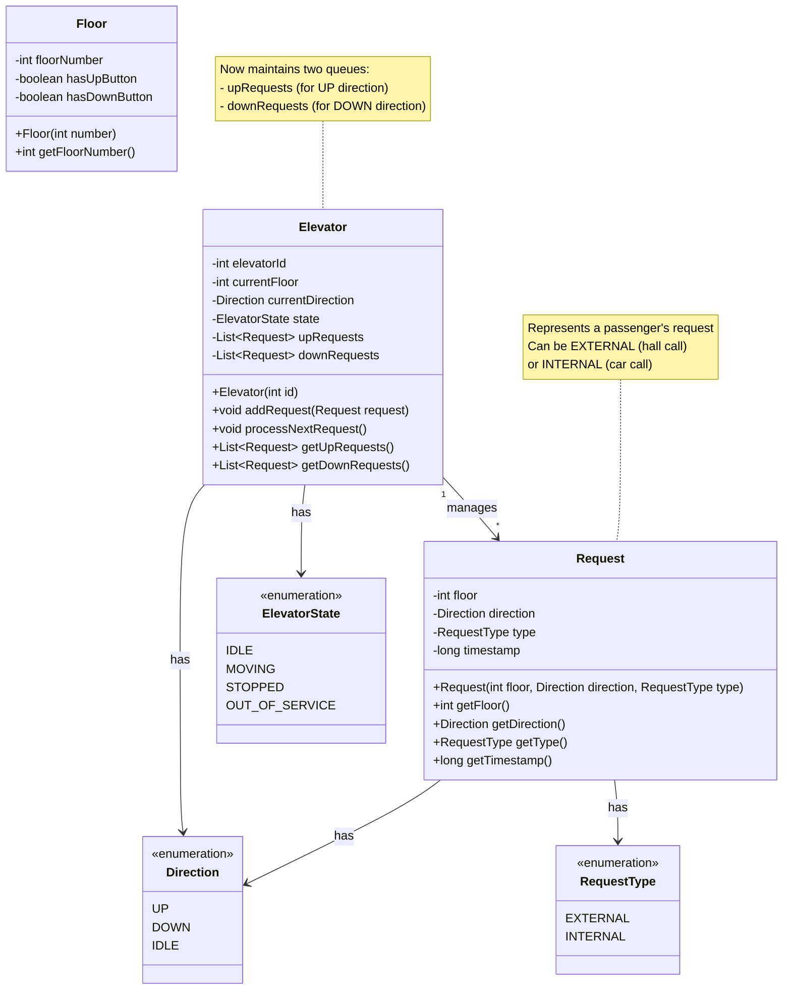
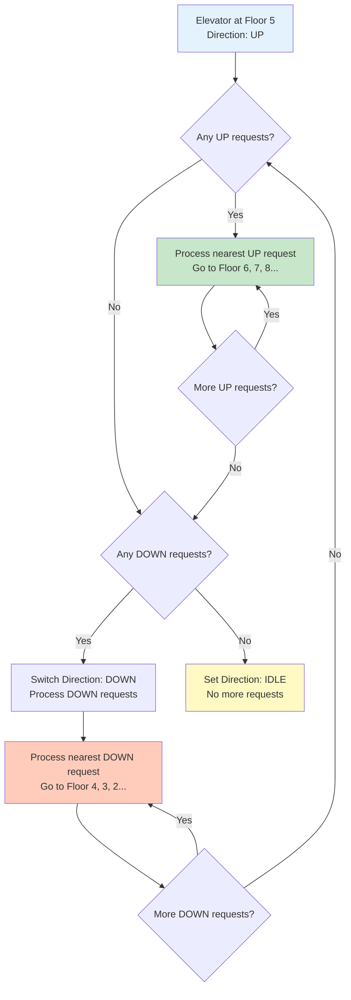
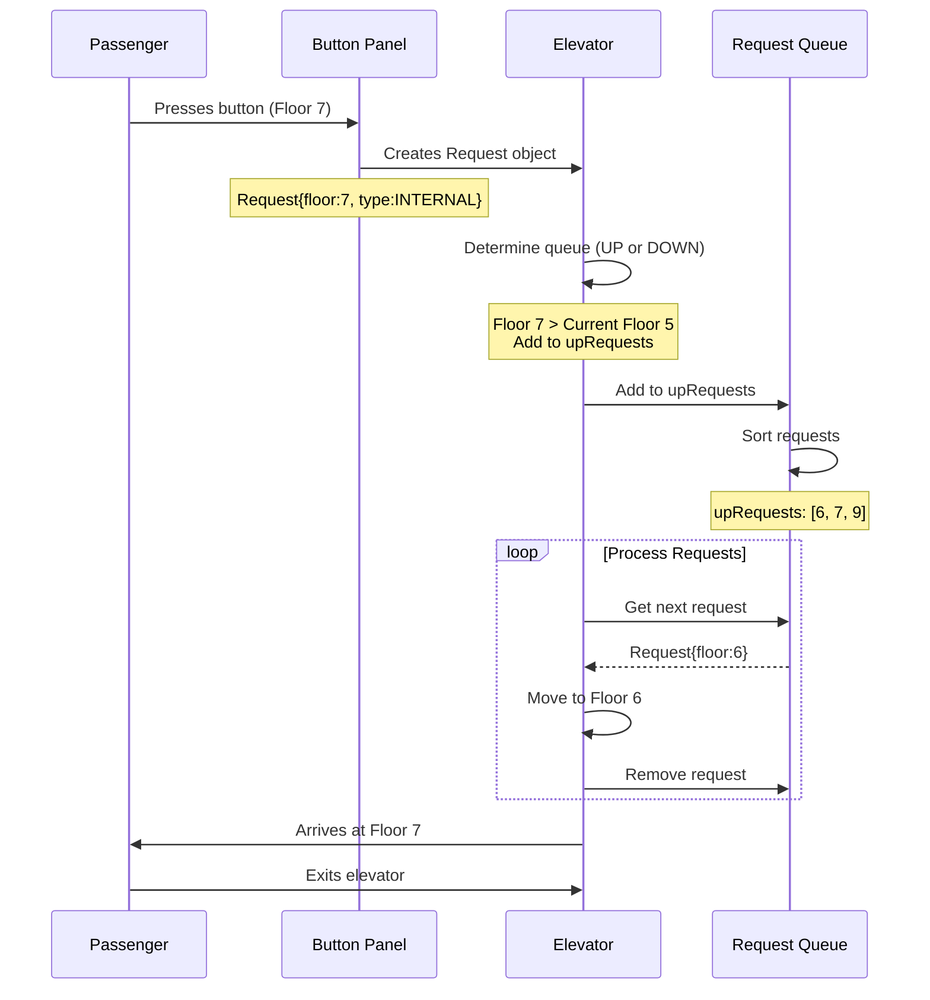

# Phase 3: Step 3 - Request Handling

## What Are We Adding?

So far we have:
- Step 1: Basic entities (Elevator, Floor)
- Step 2: State management (Direction, ElevatorState)

But how do passengers communicate with elevators? Through **Requests**!

Two types of requests:
1. **External Request** (Hall Call): Passenger outside elevator presses UP/DOWN button
2. **Internal Request** (Car Call): Passenger inside elevator presses floor button

---

## Understanding Requests

### External Request (Hall Call)
- **Who**: Passenger waiting outside elevator
- **Where**: At a specific floor
- **What**: Wants to go UP or DOWN
- **Example**: Alice at Floor 3 presses UP button
  - Request: `{floor: 3, direction: UP}`

### Internal Request (Car Call)
- **Who**: Passenger inside elevator
- **Where**: Inside the elevator car
- **What**: Wants to go to a specific floor
- **Example**: Bob inside elevator presses button "7"
  - Request: `{destinationFloor: 7}`

---

## Step 3: Adding Request Classes

### Class Diagram - Step 3



---

## What Did We Add in This Step?

### 1. RequestType Enum
**Purpose**: Distinguish between external and internal requests

```java
public enum RequestType {
    EXTERNAL,  // Request from outside elevator (hall call)
    INTERNAL   // Request from inside elevator (car call)
}
```

**Why Two Types?**
- External requests need to be dispatched to the best elevator
- Internal requests are already assigned to a specific elevator

---

### 2. Request Class
**Purpose**: Represent a single elevator request

**Attributes**:
- `floor` (int): Which floor is this request for?
- `direction` (Direction): For external requests, which direction?
- `type` (RequestType): EXTERNAL or INTERNAL
- `timestamp` (long): When was this request created? (for FCFS)

**Methods**:
- Constructor and getters for all attributes

---

### 3. Updated Elevator Class

**New Attributes**:
- `upRequests` (List<Request>): Requests for floors above current position
- `downRequests` (List<Request>): Requests for floors below current position

**Why Two Lists?**
- SCAN algorithm: Process all UP requests first, then all DOWN requests
- Efficient: No need to sort repeatedly

**New Methods**:
- `addRequest(Request)`: Add a request to appropriate queue
- `processNextRequest()`: Process the next request based on direction
- Getters for request lists

---

## Java Code Skeleton - Step 3

### RequestType Enum
```java
/**
 * Represents the type of elevator request.
 */
public enum RequestType {
    /**
     * External request - passenger waiting outside elevator
     * Pressing UP or DOWN button at a floor
     */
    EXTERNAL,

    /**
     * Internal request - passenger inside elevator
     * Pressing a destination floor button
     */
    INTERNAL
}
```

### Request Class
```java
import java.util.Objects;

/**
 * Represents a single elevator request.
 * Can be either external (from a floor) or internal (from inside elevator).
 */
public class Request {
    // Which floor this request is for
    private int floor;

    // Direction for external requests (UP/DOWN)
    // For internal requests, direction is determined by elevator's current position
    private Direction direction;

    // Type of request (EXTERNAL or INTERNAL)
    private RequestType type;

    // When this request was created (for FCFS ordering)
    private long timestamp;

    /**
     * Constructor for creating a request
     * @param floor Floor number
     * @param direction Direction (for external) or null (for internal)
     * @param type EXTERNAL or INTERNAL
     */
    public Request(int floor, Direction direction, RequestType type) {
        this.floor = floor;
        this.direction = direction;
        this.type = type;
        this.timestamp = System.currentTimeMillis();
    }

    // ========== Factory Methods for Convenience ==========

    /**
     * Create an external request (hall call)
     * @param floor Floor where passenger is waiting
     * @param direction Direction passenger wants to go (UP or DOWN)
     * @return External request
     */
    public static Request createExternalRequest(int floor, Direction direction) {
        return new Request(floor, direction, RequestType.EXTERNAL);
    }

    /**
     * Create an internal request (car call)
     * @param floor Destination floor
     * @return Internal request
     */
    public static Request createInternalRequest(int floor) {
        // Direction will be determined by elevator's current position
        return new Request(floor, null, RequestType.INTERNAL);
    }

    // ========== Getters ==========

    public int getFloor() {
        return floor;
    }

    public Direction getDirection() {
        return direction;
    }

    public RequestType getType() {
        return type;
    }

    public long getTimestamp() {
        return timestamp;
    }

    // ========== Helper Methods ==========

    /**
     * Check if this is an external request
     * @return true if EXTERNAL
     */
    public boolean isExternal() {
        return type == RequestType.EXTERNAL;
    }

    /**
     * Check if this is an internal request
     * @return true if INTERNAL
     */
    public boolean isInternal() {
        return type == RequestType.INTERNAL;
    }

    // ========== Object Methods ==========

    @Override
    public boolean equals(Object o) {
        if (this == o) return true;
        if (o == null || getClass() != o.getClass()) return false;
        Request request = (Request) o;
        return floor == request.floor &&
               direction == request.direction &&
               type == request.type;
    }

    @Override
    public int hashCode() {
        return Objects.hash(floor, direction, type);
    }

    @Override
    public String toString() {
        return "Request{" +
               "floor=" + floor +
               ", direction=" + direction +
               ", type=" + type +
               ", timestamp=" + timestamp +
               '}';
    }
}
```

### Updated Elevator Class
```java
import java.util.ArrayList;
import java.util.List;
import java.util.stream.Collectors;

/**
 * Represents a single elevator in the building.
 * Now manages request queues for UP and DOWN directions.
 */
public class Elevator {
    private int elevatorId;
    private int currentFloor;
    private Direction currentDirection;
    private ElevatorState state;

    // Request queues - separated by direction for SCAN algorithm
    private List<Request> upRequests;    // Requests for floors above current
    private List<Request> downRequests;  // Requests for floors below current

    /**
     * Constructor: Create a new elevator
     */
    public Elevator(int id) {
        this.elevatorId = id;
        this.currentFloor = 0;
        this.currentDirection = Direction.IDLE;
        this.state = ElevatorState.IDLE;
        this.upRequests = new ArrayList<>();
        this.downRequests = new ArrayList<>();
    }

    // ========== Request Management ==========

    /**
     * Add a request to this elevator's queue
     * Automatically adds to upRequests or downRequests based on floor
     * @param request Request to add
     */
    public void addRequest(Request request) {
        int requestFloor = request.getFloor();

        // Determine which queue to add to
        if (requestFloor > currentFloor) {
            // Request is for a floor above - add to upRequests
            if (!upRequests.contains(request)) {
                upRequests.add(request);
                sortUpRequests(); // Keep sorted in ascending order
            }
        } else if (requestFloor < currentFloor) {
            // Request is for a floor below - add to downRequests
            if (!downRequests.contains(request)) {
                downRequests.add(request);
                sortDownRequests(); // Keep sorted in descending order
            }
        } else {
            // Request is for current floor - handle immediately
            System.out.println("Request for current floor " + currentFloor);
        }
    }

    /**
     * Sort upRequests in ascending order (nearest floor first)
     */
    private void sortUpRequests() {
        upRequests.sort((r1, r2) -> Integer.compare(r1.getFloor(), r2.getFloor()));
    }

    /**
     * Sort downRequests in descending order (nearest floor first)
     */
    private void sortDownRequests() {
        downRequests.sort((r1, r2) -> Integer.compare(r2.getFloor(), r1.getFloor()));
    }

    /**
     * Get the next request to process based on current direction
     * @return Next request, or null if no requests
     */
    public Request getNextRequest() {
        if (currentDirection == Direction.UP && !upRequests.isEmpty()) {
            return upRequests.get(0); // First request in upRequests
        } else if (currentDirection == Direction.DOWN && !downRequests.isEmpty()) {
            return downRequests.get(0); // First request in downRequests
        } else if (!upRequests.isEmpty()) {
            // No current direction, but have up requests
            currentDirection = Direction.UP;
            return upRequests.get(0);
        } else if (!downRequests.isEmpty()) {
            // No up requests, check down requests
            currentDirection = Direction.DOWN;
            return downRequests.get(0);
        } else {
            // No requests at all
            currentDirection = Direction.IDLE;
            return null;
        }
    }

    /**
     * Remove a request after it's been processed
     * @param request Request to remove
     */
    public void removeRequest(Request request) {
        upRequests.remove(request);
        downRequests.remove(request);
    }

    /**
     * Check if elevator has any pending requests
     * @return true if requests exist
     */
    public boolean hasRequests() {
        return !upRequests.isEmpty() || !downRequests.isEmpty();
    }

    // ========== Getters ==========

    public int getElevatorId() {
        return elevatorId;
    }

    public int getCurrentFloor() {
        return currentFloor;
    }

    public void setCurrentFloor(int floor) {
        this.currentFloor = floor;
    }

    public Direction getDirection() {
        return currentDirection;
    }

    public void setDirection(Direction direction) {
        this.currentDirection = direction;
    }

    public ElevatorState getState() {
        return state;
    }

    public void setState(ElevatorState state) {
        this.state = state;
    }

    public List<Request> getUpRequests() {
        return new ArrayList<>(upRequests); // Return copy for safety
    }

    public List<Request> getDownRequests() {
        return new ArrayList<>(downRequests); // Return copy for safety
    }

    public boolean isAvailable() {
        return state.isAvailable();
    }

    @Override
    public String toString() {
        return "Elevator{" +
               "id=" + elevatorId +
               ", floor=" + currentFloor +
               ", direction=" + currentDirection +
               ", state=" + state +
               ", upRequests=" + upRequests.size() +
               ", downRequests=" + downRequests.size() +
               '}';
    }
}
```

---

## What Changed from Step 2?

### Changes to Elevator Class

| Before (Step 2) | After (Step 3) | Why? |
|----------------|----------------|------|
| No request management | Added `upRequests` and `downRequests` lists | Store pending requests |
| No request methods | Added `addRequest()`, `getNextRequest()`, `removeRequest()` | Manage request lifecycle |
| Simple state tracking | Request-aware state management | Know what to do next |

### New Classes Added

1. **RequestType Enum**: Distinguish external vs internal requests
2. **Request Class**: Model a passenger request with all details

---

## Request Processing Logic

### SCAN Algorithm (Elevator Algorithm)



---

## Example: Request Flow

### Scenario
Elevator at Floor 5, Direction IDLE

**Requests come in:**
1. Alice at Floor 3 presses UP → External Request
2. Bob at Floor 8 presses DOWN → External Request
3. Inside elevator, someone presses Floor 7 → Internal Request
4. Inside elevator, someone presses Floor 2 → Internal Request

**How requests are stored:**

```
Elevator at Floor 5:
upRequests:   [Floor 7, Floor 8] (sorted ascending)
downRequests: [Floor 3, Floor 2] (sorted descending)
```

**Processing order (SCAN algorithm):**
1. Go UP: Floor 7 (internal), Floor 8 (Bob's external)
2. Switch to DOWN
3. Go DOWN: Floor 3 (Alice's external), Floor 2 (internal)
4. Set to IDLE

---

## Design Principles Applied

### 1. Single Responsibility Principle (SRP)
- **Request**: Only stores request data
- **Elevator**: Manages requests but doesn't decide dispatch logic
- **RequestType Enum**: Only categorizes request types

### 2. Open/Closed Principle (OCP)
Easy to add new request types without modifying existing code:
```java
// Future: Add VIP_REQUEST type
public enum RequestType {
    EXTERNAL,
    INTERNAL,
    VIP_REQUEST  // New type, no changes to Request class!
}
```

### 3. Factory Pattern (Bonus)
Static factory methods for convenience:
```java
Request.createExternalRequest(3, Direction.UP);  // Clear intent
Request.createInternalRequest(7);                // Clear intent
```

---

## Common Beginner Mistakes

### Mistake 1: Not Sorting Requests
```java
// ❌ BAD: Unsorted, elevator jumps around
upRequests: [Floor 9, Floor 6, Floor 7]
// Elevator goes: 5→9→6→7 (inefficient!)

// ✅ GOOD: Sorted ascending
upRequests: [Floor 6, Floor 7, Floor 9]
// Elevator goes: 5→6→7→9 (efficient!)
```

### Mistake 2: Single Request Queue
```java
// ❌ BAD: One queue for all requests
List<Request> allRequests; // Hard to implement SCAN!

// ✅ GOOD: Separate queues by direction
List<Request> upRequests;
List<Request> downRequests;
```

### Mistake 3: Allowing Duplicate Requests
```java
// ❌ BAD: Multiple requests for same floor
upRequests: [Floor 7, Floor 7, Floor 7]

// ✅ GOOD: Check before adding
if (!upRequests.contains(request)) {
    upRequests.add(request);
}
```

---

## Request Lifecycle Diagram



---

## Design Decision Summary

| Decision | Reason |
|----------|--------|
| Separate UP and DOWN queues | Efficient SCAN algorithm implementation |
| Sort requests automatically | Nearest floor first (optimal movement) |
| Use `List` instead of `Queue` | Need sorting and random access |
| Include timestamp in Request | Support FCFS if needed later |
| Factory methods for Request | Clear, convenient creation |
| Check duplicates before adding | Avoid redundant processing |

---

## What's Still Missing?

At this stage, we still don't have:
- ❌ Controller logic (actual movement, door operations) - Step 4
- ❌ Dispatcher (assign requests to best elevator) - Step 5
- ❌ Scheduling strategy (pluggable algorithms) - Step 5

---

## Interview Talking Points

> "Now I'll add request handling. There are two types: external requests (hall calls) and internal requests (car calls). I'm storing them in two separate lists - upRequests and downRequests - to efficiently implement the SCAN algorithm. Each list is kept sorted so the elevator always picks the nearest floor in its current direction. I've also added factory methods for convenient request creation."

---

**Next**: Step 4 - Controller Logic (ElevatorController for movement and operations)
