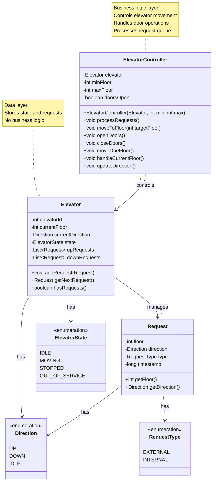
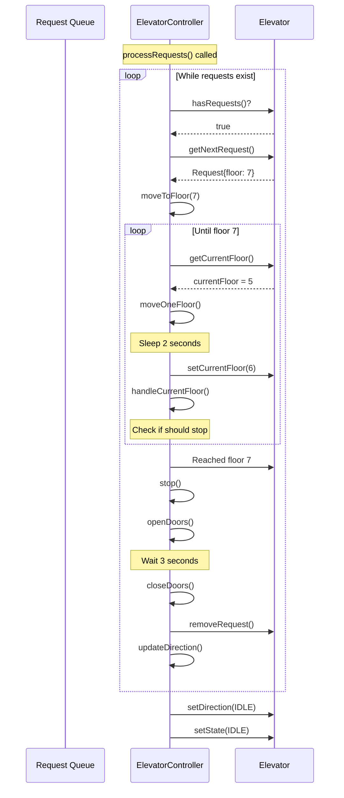
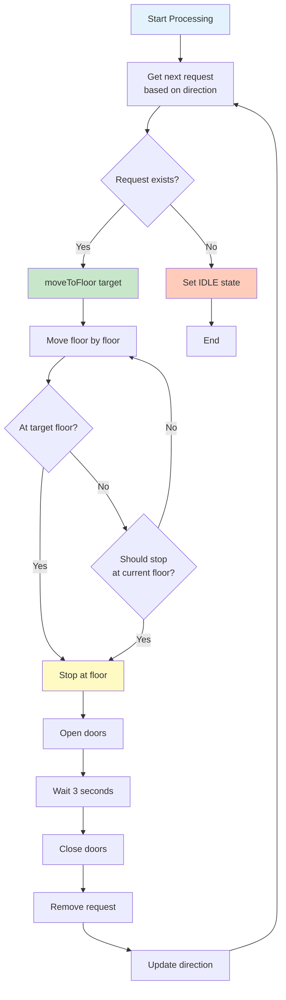
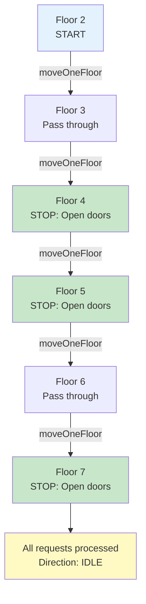

# Phase 3: Step 4 - Controller Logic

## What Are We Adding?

So far we have:
- Step 1: Basic entities (Elevator, Floor)
- Step 2: State management (Direction, ElevatorState)
- Step 3: Request handling (Request, RequestType)

But who actually **controls** the elevator movement? Who opens/closes doors? Who decides when to stop?

**Answer**: The **ElevatorController**!

---

## Controller vs Entity

### Entity (Elevator class)
- **What it is**: Data holder
- **Stores**: ID, floor, direction, state, requests
- **Does NOT**: Make decisions or perform operations

### Controller (ElevatorController class)
- **What it is**: Business logic handler
- **Does**: Move elevator, open/close doors, process requests
- **Makes**: Decisions about movement and stops

**Analogy**:
- **Elevator** = Your brain (stores information)
- **ElevatorController** = Your hands (performs actions)

---

## Step 4: Adding Controller Logic

### Class Diagram - Step 4



---

## What Did We Add in This Step?

### ElevatorController Class
**Purpose**: Control a single elevator's operations

**Attributes**:
- `elevator` (Elevator): The elevator this controller manages
- `minFloor` (int): Minimum floor (usually 0)
- `maxFloor` (int): Maximum floor (e.g., 10)
- `doorsOpen` (boolean): Are doors currently open?

**Methods**:
- `processRequests()`: Main loop - process all pending requests
- `moveToFloor(int)`: Move elevator to specific floor
- `moveOneFloor()`: Move up or down by one floor
- `openDoors()`: Open doors when stopped
- `closeDoors()`: Close doors before moving
- `handleCurrentFloor()`: Check if should stop at current floor
- `updateDirection()`: Update direction based on remaining requests

---

## Java Code Skeleton - Step 4

### ElevatorController Class
```java
import java.util.concurrent.TimeUnit;

/**
 * Controls the operations of a single elevator.
 * Handles movement, door operations, and request processing.
 * This is the BUSINESS LOGIC layer (Elevator is DATA layer).
 */
public class ElevatorController {
    // The elevator this controller manages
    private Elevator elevator;

    // Building constraints
    private int minFloor;
    private int maxFloor;

    // Door state
    private boolean doorsOpen;

    // Timing constants (in milliseconds)
    private static final long FLOOR_TRAVEL_TIME = 2000;  // 2 seconds per floor
    private static final long DOOR_OPERATION_TIME = 1000; // 1 second to open/close

    /**
     * Constructor: Create controller for an elevator
     * @param elevator The elevator to control
     * @param minFloor Minimum floor (usually 0)
     * @param maxFloor Maximum floor (e.g., 10)
     */
    public ElevatorController(Elevator elevator, int minFloor, int maxFloor) {
        this.elevator = elevator;
        this.minFloor = minFloor;
        this.maxFloor = maxFloor;
        this.doorsOpen = false;
    }

    // ========== Main Processing Loop ==========

    /**
     * Main method to process all requests in the queue.
     * This runs continuously while elevator has requests.
     */
    public void processRequests() {
        while (elevator.hasRequests()) {
            // Get next request based on current direction
            Request nextRequest = elevator.getNextRequest();

            if (nextRequest != null) {
                System.out.println("Processing request: " + nextRequest);

                // Move to the requested floor
                moveToFloor(nextRequest.getFloor());

                // Remove the processed request
                elevator.removeRequest(nextRequest);

                // Update direction for next request
                updateDirection();
            }
        }

        // No more requests - elevator becomes idle
        elevator.setDirection(Direction.IDLE);
        elevator.setState(ElevatorState.IDLE);
        System.out.println("Elevator " + elevator.getElevatorId() + " is now IDLE");
    }

    // ========== Movement Methods ==========

    /**
     * Move elevator to a specific target floor.
     * Stops at intermediate floors if needed.
     * @param targetFloor Destination floor
     */
    public void moveToFloor(int targetFloor) {
        int currentFloor = elevator.getCurrentFloor();

        if (currentFloor == targetFloor) {
            // Already at target floor
            handleCurrentFloor();
            return;
        }

        // Determine direction
        Direction direction = (targetFloor > currentFloor) ? Direction.UP : Direction.DOWN;
        elevator.setDirection(direction);
        elevator.setState(ElevatorState.MOVING);

        System.out.println("Elevator " + elevator.getElevatorId() +
                         " moving " + direction +
                         " from floor " + currentFloor +
                         " to floor " + targetFloor);

        // Move floor by floor
        while (elevator.getCurrentFloor() != targetFloor) {
            moveOneFloor();

            // Check if we should stop at current floor
            handleCurrentFloor();
        }
    }

    /**
     * Move elevator by one floor in current direction.
     * Simulates physical movement with delay.
     */
    private void moveOneFloor() {
        int currentFloor = elevator.getCurrentFloor();
        Direction direction = elevator.getDirection();

        // Calculate next floor
        int nextFloor;
        if (direction == Direction.UP) {
            nextFloor = Math.min(currentFloor + 1, maxFloor);
        } else if (direction == Direction.DOWN) {
            nextFloor = Math.max(currentFloor - 1, minFloor);
        } else {
            return; // IDLE - don't move
        }

        // Simulate travel time
        try {
            TimeUnit.MILLISECONDS.sleep(FLOOR_TRAVEL_TIME);
        } catch (InterruptedException e) {
            Thread.currentThread().interrupt();
        }

        // Update position
        elevator.setCurrentFloor(nextFloor);
        System.out.println("Elevator " + elevator.getElevatorId() +
                         " now at floor " + nextFloor);
    }

    /**
     * Handle current floor - check if should stop here.
     * Opens doors if there's a request for this floor.
     */
    private void handleCurrentFloor() {
        int currentFloor = elevator.getCurrentFloor();
        Direction direction = elevator.getDirection();

        // Check if any request is for current floor in current direction
        boolean shouldStop = false;

        if (direction == Direction.UP) {
            shouldStop = elevator.getUpRequests().stream()
                    .anyMatch(r -> r.getFloor() == currentFloor);
        } else if (direction == Direction.DOWN) {
            shouldStop = elevator.getDownRequests().stream()
                    .anyMatch(r -> r.getFloor() == currentFloor);
        }

        if (shouldStop) {
            stop();
        }
    }

    /**
     * Stop elevator at current floor.
     * Open doors, wait, close doors.
     */
    private void stop() {
        int currentFloor = elevator.getCurrentFloor();

        elevator.setState(ElevatorState.STOPPED);
        System.out.println("Elevator " + elevator.getElevatorId() +
                         " stopped at floor " + currentFloor);

        openDoors();

        // Wait for passengers to enter/exit
        try {
            TimeUnit.SECONDS.sleep(3); // 3 seconds wait time
        } catch (InterruptedException e) {
            Thread.currentThread().interrupt();
        }

        closeDoors();

        // Resume movement
        elevator.setState(ElevatorState.MOVING);
    }

    // ========== Door Operations ==========

    /**
     * Open elevator doors.
     * Safety check: Only open when stopped.
     */
    public void openDoors() {
        if (elevator.getState() != ElevatorState.MOVING) {
            System.out.println("Opening doors at floor " + elevator.getCurrentFloor());

            try {
                TimeUnit.MILLISECONDS.sleep(DOOR_OPERATION_TIME);
            } catch (InterruptedException e) {
                Thread.currentThread().interrupt();
            }

            doorsOpen = true;
            System.out.println("Doors open");
        } else {
            System.out.println("Cannot open doors while moving!");
        }
    }

    /**
     * Close elevator doors.
     * Must close before moving.
     */
    public void closeDoors() {
        System.out.println("Closing doors at floor " + elevator.getCurrentFloor());

        try {
            TimeUnit.MILLISECONDS.sleep(DOOR_OPERATION_TIME);
        } catch (InterruptedException e) {
            Thread.currentThread().interrupt();
        }

        doorsOpen = false;
        System.out.println("Doors closed");
    }

    // ========== Direction Management ==========

    /**
     * Update elevator direction based on remaining requests.
     * Called after processing each request.
     */
    private void updateDirection() {
        Direction currentDirection = elevator.getDirection();

        if (currentDirection == Direction.UP) {
            // Check if more UP requests exist
            if (elevator.getUpRequests().isEmpty()) {
                // No more UP requests, switch to DOWN if available
                if (!elevator.getDownRequests().isEmpty()) {
                    elevator.setDirection(Direction.DOWN);
                    System.out.println("Switching direction to DOWN");
                } else {
                    elevator.setDirection(Direction.IDLE);
                }
            }
        } else if (currentDirection == Direction.DOWN) {
            // Check if more DOWN requests exist
            if (elevator.getDownRequests().isEmpty()) {
                // No more DOWN requests, switch to UP if available
                if (!elevator.getUpRequests().isEmpty()) {
                    elevator.setDirection(Direction.UP);
                    System.out.println("Switching direction to UP");
                } else {
                    elevator.setDirection(Direction.IDLE);
                }
            }
        }
    }

    // ========== Getters ==========

    public Elevator getElevator() {
        return elevator;
    }

    public boolean areDoorsOpen() {
        return doorsOpen;
    }
}
```

---

## What Changed from Step 3?

### New Responsibilities

| Step 3 | Step 4 | Why? |
|--------|--------|------|
| Elevator stores requests | ElevatorController processes requests | Separation of concerns |
| No movement logic | Complete movement implementation | Controller handles actions |
| No door operations | Door open/close with safety checks | Controller manages doors |
| No direction updates | Automatic direction switching | Controller makes decisions |

### Key Addition
**ElevatorController**: The "brain" that operates the elevator

---

## Processing Flow Diagram



---

## SCAN Algorithm Implementation



---

## Design Principles Applied

### 1. Single Responsibility Principle (SRP)
- **Elevator**: Stores data (floor, direction, requests)
- **ElevatorController**: Performs operations (move, open doors, process)
- **Request**: Holds request information

Each class has ONE reason to change.

### 2. Separation of Concerns
**Data vs Logic**:
```java
// ❌ BAD: Mixing data and logic
public class Elevator {
    private int currentFloor;

    public void moveUp() {
        // Movement logic in data class - BAD!
        currentFloor++;
    }
}

// ✅ GOOD: Separated
public class Elevator {
    private int currentFloor;

    public void setCurrentFloor(int floor) {
        this.currentFloor = floor; // Just store data
    }
}

public class ElevatorController {
    public void moveOneFloor() {
        // Logic in controller - GOOD!
        int next = elevator.getCurrentFloor() + 1;
        elevator.setCurrentFloor(next);
    }
}
```

### 3. Safety First
Always check safety before operations:
```java
// Cannot open doors while moving
if (elevator.getState() != ElevatorState.MOVING) {
    openDoors();
}
```

---

## Common Beginner Mistakes

### Mistake 1: Putting Logic in Entity
```java
// ❌ WRONG: Business logic in Elevator class
public class Elevator {
    public void processRequests() {
        // Complex logic here - WRONG PLACE!
    }
}

// ✅ RIGHT: Logic in Controller
public class ElevatorController {
    public void processRequests() {
        // Logic belongs here!
    }
}
```

### Mistake 2: Not Checking Intermediate Stops
```java
// ❌ WRONG: Jump directly to target
elevator.setCurrentFloor(targetFloor);

// ✅ RIGHT: Move floor by floor, check stops
while (currentFloor != targetFloor) {
    moveOneFloor();
    handleCurrentFloor(); // Check for stops!
}
```

### Mistake 3: Forgetting Door Safety
```java
// ❌ WRONG: Open doors anytime
openDoors();

// ✅ RIGHT: Check state first
if (elevator.getState() != ElevatorState.MOVING) {
    openDoors();
}
```

---

## Movement Visualization

### Example: Elevator at Floor 2, Requests at [4, 7, 5]



**Key Points**:
- Move **one floor at a time** (not jumping)
- **Check each floor** for pending requests
- **Stop only** when request exists for that floor

---

## Timing Simulation

```java
// Realistic timing
FLOOR_TRAVEL_TIME = 2000ms  // 2 seconds per floor
DOOR_OPERATION_TIME = 1000ms // 1 second to open/close
PASSENGER_WAIT_TIME = 3000ms // 3 seconds for entry/exit

// Example: Move from Floor 2 to Floor 7
// Time = (7-2) * 2 seconds = 10 seconds travel
// Time = 3 stops * (1s open + 3s wait + 1s close) = 15 seconds stops
// Total = 25 seconds
```

---

## Design Decision Summary

| Decision | Reason |
|----------|--------|
| Separate Controller from Elevator | Separation of concerns (data vs logic) |
| Move one floor at a time | Check for intermediate stops |
| Safety check before opening doors | Prevent opening while moving |
| Simulate timing with sleep | Realistic behavior |
| Update direction after each request | Automatic direction switching |
| Stop method handles all stop logic | Single Responsibility |

---

## What's Still Missing?

At this stage, we still don't have:
- ❌ **Dispatcher**: Which elevator should handle an external request?
- ❌ **Multiple elevators**: System managing multiple elevators
- ❌ **Scheduling strategy**: Pluggable algorithms (FCFS, SCAN, SSTF)

These will be added in **Step 5**.

---

## Interview Talking Points

> "Now I'll add the controller logic. I'm separating concerns - the Elevator class stores data, while ElevatorController handles operations. The controller has methods to move the elevator, open/close doors, and process requests. It implements the SCAN algorithm by processing all UP requests first, then all DOWN requests. I'm also adding safety checks, like not opening doors while moving."

---

**Next**: Step 5 - Dispatcher and Scheduling (Multi-elevator coordination)
