# Phase 3: Step 5 - Dispatcher and Scheduling Strategy

## What Are We Adding?

So far we have:
- Step 1: Basic entities (Elevator, Floor)
- Step 2: State management (Direction, ElevatorState)
- Step 3: Request handling (Request, RequestType)
- Step 4: Controller logic (ElevatorController)

But we've only designed for ONE elevator. Real buildings have MULTIPLE elevators!

**Questions**:
- Which elevator should respond to an external request?
- How do we coordinate multiple elevators?
- Can we use different algorithms (FCFS, SCAN, SSTF)?

**Answer**: **ElevatorDispatcher** + **SchedulingStrategy** pattern!

---

## What is a Dispatcher?

**Dispatcher** = The "traffic controller" for elevators

**Responsibilities**:
1. Receives external requests (hall calls)
2. Decides which elevator should handle each request
3. Assigns requests to the chosen elevator
4. Uses a scheduling strategy to make optimal decisions

**Analogy**:
- Elevators = Taxi cabs
- Dispatcher = Taxi dispatch center
- Strategy = Algorithm to assign nearest/fastest taxi

---

## Step 5: Adding Dispatcher and Scheduling

### Class Diagram - Step 5 (FINAL)


---

## What Did We Add in This Step?

### 1. SchedulingStrategy Interface
**Purpose**: Define contract for elevator selection algorithms

**Why Interface?**
- Different buildings may want different algorithms
- Easy to add new strategies without changing existing code
- Strategy Pattern = Open/Closed Principle

**Method**:
```java
Elevator selectElevator(List<Elevator> elevators, Request request);
```

---

### 2. Concrete Strategy Implementations

#### A. NearestElevatorStrategy
**Algorithm**: Choose elevator closest to request floor

**Logic**:
```
For each elevator:
    distance = |elevator.currentFloor - request.floor|
Choose elevator with minimum distance
```

#### B. FCFSStrategy (First-Come-First-Served)
**Algorithm**: Assign to elevator with fewest pending requests

**Logic**:
```
For each elevator:
    count = number of pending requests
Choose elevator with minimum count
```

#### C. SCANStrategy (Smart SCAN)
**Algorithm**: Choose elevator already moving in request's direction

**Logic**:
```
Priority 1: Elevator moving towards request floor in same direction
Priority 2: Elevator in IDLE state (nearest)
Priority 3: Any available elevator
```

---

### 3. ElevatorDispatcher Class
**Purpose**: Central coordinator for assigning requests

**Attributes**:
- `elevators` (List<Elevator>): All elevators in the system
- `strategy` (SchedulingStrategy): Current algorithm being used

**Methods**:
- `dispatchRequest(Request)`: Assign request to best elevator
- `findBestElevator(Request)`: Use strategy to find optimal elevator
- `setStrategy(SchedulingStrategy)`: Switch algorithm at runtime

---

### 4. ElevatorSystem Class (Singleton)
**Purpose**: The main system managing everything

**Why Singleton?**
- Only ONE elevator system in a building
- Global access point for all elevator operations

**Responsibilities**:
- Create and initialize elevators
- Create controllers for each elevator
- Handle external requests (requestElevator)
- Handle internal requests (selectDestination)

---

## Java Code Skeleton - Step 5

### SchedulingStrategy Interface
```java
import java.util.List;

/**
 * Strategy interface for elevator selection algorithms.
 * Allows different algorithms to be used interchangeably.
 * This is the STRATEGY PATTERN in action!
 */
public interface SchedulingStrategy {
    /**
     * Select the best elevator to handle a request.
     * @param elevators List of all available elevators
     * @param request The request to be assigned
     * @return Best elevator for this request
     */
    Elevator selectElevator(List<Elevator> elevators, Request request);
}
```

### NearestElevatorStrategy
```java
import java.util.List;

/**
 * Strategy: Select the elevator closest to the request floor.
 * Simple and intuitive, but may not be most efficient.
 */
public class NearestElevatorStrategy implements SchedulingStrategy {

    @Override
    public Elevator selectElevator(List<Elevator> elevators, Request request) {
        Elevator bestElevator = null;
        int minDistance = Integer.MAX_VALUE;

        for (Elevator elevator : elevators) {
            // Skip elevators that are out of service
            if (!elevator.isAvailable()) {
                continue;
            }

            // Calculate distance
            int distance = Math.abs(elevator.getCurrentFloor() - request.getFloor());

            // Update if this elevator is closer
            if (distance < minDistance) {
                minDistance = distance;
                bestElevator = elevator;
            }
        }

        return bestElevator;
    }
}
```

### FCFSStrategy
```java
import java.util.List;

/**
 * Strategy: Select elevator with fewest pending requests.
 * Balances load across all elevators.
 */
public class FCFSStrategy implements SchedulingStrategy {

    @Override
    public Elevator selectElevator(List<Elevator> elevators, Request request) {
        Elevator bestElevator = null;
        int minRequests = Integer.MAX_VALUE;

        for (Elevator elevator : elevators) {
            if (!elevator.isAvailable()) {
                continue;
            }

            // Count total pending requests
            int totalRequests = elevator.getUpRequests().size() +
                              elevator.getDownRequests().size();

            // Update if this elevator has fewer requests
            if (totalRequests < minRequests) {
                minRequests = totalRequests;
                bestElevator = elevator;
            }
        }

        return bestElevator;
    }
}
```

### SCANStrategy (Smart)
```java
import java.util.List;

/**
 * Strategy: Select elevator based on direction and position.
 * Most efficient strategy - considers elevator movement patterns.
 */
public class SCANStrategy implements SchedulingStrategy {

    @Override
    public Elevator selectElevator(List<Elevator> elevators, Request request) {
        Elevator bestElevator = null;
        int bestScore = Integer.MIN_VALUE;

        for (Elevator elevator : elevators) {
            if (!elevator.isAvailable()) {
                continue;
            }

            int score = calculateScore(elevator, request);

            if (score > bestScore) {
                bestScore = score;
                bestElevator = elevator;
            }
        }

        return bestElevator;
    }

    /**
     * Calculate score for an elevator.
     * Higher score = better match.
     */
    private int calculateScore(Elevator elevator, Request request) {
        int score = 0;
        int elevatorFloor = elevator.getCurrentFloor();
        int requestFloor = request.getFloor();
        Direction elevatorDir = elevator.getDirection();
        Direction requestDir = request.getDirection();

        // Priority 1: Elevator moving in same direction towards request
        if (elevatorDir == requestDir) {
            if (elevatorDir == Direction.UP && requestFloor >= elevatorFloor) {
                score += 100; // High priority!
            } else if (elevatorDir == Direction.DOWN && requestFloor <= elevatorFloor) {
                score += 100; // High priority!
            }
        }

        // Priority 2: Idle elevator (adjust by distance)
        if (elevatorDir == Direction.IDLE) {
            int distance = Math.abs(elevatorFloor - requestFloor);
            score += (50 - distance); // Closer is better
        }

        // Priority 3: Opposite direction (low priority)
        if (elevatorDir != requestDir && elevatorDir != Direction.IDLE) {
            score += 10; // Low priority, but still available
        }

        return score;
    }
}
```

### ElevatorDispatcher
```java
import java.util.List;

/**
 * Dispatcher coordinates elevator assignment.
 * Uses a pluggable SchedulingStrategy to select best elevator.
 */
public class ElevatorDispatcher {
    private List<Elevator> elevators;
    private SchedulingStrategy strategy;

    /**
     * Constructor
     * @param elevators All elevators in the system
     * @param strategy Initial scheduling strategy
     */
    public ElevatorDispatcher(List<Elevator> elevators, SchedulingStrategy strategy) {
        this.elevators = elevators;
        this.strategy = strategy;
    }

    /**
     * Dispatch an external request to the best elevator.
     * @param request External request (hall call)
     */
    public void dispatchRequest(Request request) {
        System.out.println("Dispatching request: " + request);

        // Find best elevator using strategy
        Elevator bestElevator = findBestElevator(request);

        if (bestElevator != null) {
            System.out.println("Assigned to Elevator " + bestElevator.getElevatorId());
            bestElevator.addRequest(request);
        } else {
            System.out.println("No available elevator found!");
        }
    }

    /**
     * Find best elevator using current strategy.
     * @param request Request to assign
     * @return Best elevator, or null if none available
     */
    private Elevator findBestElevator(Request request) {
        return strategy.selectElevator(elevators, request);
    }

    /**
     * Change the scheduling strategy at runtime.
     * Demonstrates Strategy Pattern flexibility!
     * @param strategy New strategy
     */
    public void setStrategy(SchedulingStrategy strategy) {
        this.strategy = strategy;
        System.out.println("Scheduling strategy changed to: " +
                         strategy.getClass().getSimpleName());
    }

    public List<Elevator> getElevators() {
        return elevators;
    }
}
```

### ElevatorSystem (Singleton)
```java
import java.util.ArrayList;
import java.util.List;

/**
 * Main elevator system - Singleton pattern.
 * Central point for managing all elevators.
 */
public class ElevatorSystem {
    // Singleton instance
    private static ElevatorSystem instance;

    // System components
    private List<Elevator> elevators;
    private List<ElevatorController> controllers;
    private ElevatorDispatcher dispatcher;
    private int numFloors;

    /**
     * Private constructor - prevents external instantiation.
     */
    private ElevatorSystem() {
        this.elevators = new ArrayList<>();
        this.controllers = new ArrayList<>();
    }

    /**
     * Get the singleton instance.
     * Thread-safe lazy initialization.
     * @return The ElevatorSystem instance
     */
    public static synchronized ElevatorSystem getInstance() {
        if (instance == null) {
            instance = new ElevatorSystem();
        }
        return instance;
    }

    /**
     * Initialize the elevator system.
     * Creates elevators, controllers, and dispatcher.
     * @param numElevators Number of elevators in building
     * @param numFloors Number of floors in building
     */
    public void initialize(int numElevators, int numFloors) {
        this.numFloors = numFloors;

        // Create elevators
        for (int i = 1; i <= numElevators; i++) {
            Elevator elevator = new Elevator(i);
            elevators.add(elevator);

            // Create controller for each elevator
            ElevatorController controller = new ElevatorController(elevator, 0, numFloors);
            controllers.add(controller);
        }

        // Create dispatcher with default strategy
        SchedulingStrategy defaultStrategy = new SCANStrategy();
        this.dispatcher = new ElevatorDispatcher(elevators, defaultStrategy);

        System.out.println("Elevator system initialized:");
        System.out.println("- Elevators: " + numElevators);
        System.out.println("- Floors: " + (numFloors + 1) + " (0 to " + numFloors + ")");
        System.out.println("- Strategy: " + defaultStrategy.getClass().getSimpleName());
    }

    /**
     * External request: Passenger presses UP/DOWN button at a floor.
     * @param floor Floor where request is made
     * @param direction Direction (UP or DOWN)
     */
    public void requestElevator(int floor, Direction direction) {
        Request request = Request.createExternalRequest(floor, direction);
        dispatcher.dispatchRequest(request);
    }

    /**
     * Internal request: Passenger inside elevator presses floor button.
     * @param elevatorId ID of the elevator
     * @param destinationFloor Destination floor
     */
    public void selectDestination(int elevatorId, int destinationFloor) {
        // Find the elevator
        Elevator elevator = elevators.stream()
                .filter(e -> e.getElevatorId() == elevatorId)
                .findFirst()
                .orElse(null);

        if (elevator != null) {
            Request request = Request.createInternalRequest(destinationFloor);
            elevator.addRequest(request);
            System.out.println("Internal request added to Elevator " + elevatorId +
                             " for floor " + destinationFloor);
        } else {
            System.out.println("Elevator " + elevatorId + " not found!");
        }
    }

    /**
     * Change the scheduling strategy at runtime.
     * @param strategy New strategy
     */
    public void setSchedulingStrategy(SchedulingStrategy strategy) {
        dispatcher.setStrategy(strategy);
    }

    /**
     * Start all elevator controllers (in separate threads).
     * In production, each controller would run in its own thread.
     */
    public void startSystem() {
        System.out.println("Starting elevator system...");

        for (ElevatorController controller : controllers) {
            // In real implementation, start each in a new thread
            // new Thread(() -> controller.processRequests()).start();
        }
    }

    // ========== Getters ==========

    public List<Elevator> getElevators() {
        return new ArrayList<>(elevators);
    }

    public List<ElevatorController> getControllers() {
        return new ArrayList<>(controllers);
    }

    public ElevatorDispatcher getDispatcher() {
        return dispatcher;
    }

    public int getNumFloors() {
        return numFloors;
    }
}
```

---

## What Changed from Step 4?

### Major Additions

| Step 4 | Step 5 | Why? |
|--------|--------|------|
| Single elevator control | Multiple elevator coordination | Real-world buildings |
| No request assignment logic | Dispatcher with strategies | Optimal elevator selection |
| Fixed algorithm | Pluggable strategies | Flexibility (Strategy Pattern) |
| Manual system setup | Singleton system manager | Centralized control |

### New Classes

1. **SchedulingStrategy** (Interface) - Contract for algorithms
2. **NearestElevatorStrategy** - Simple distance-based
3. **FCFSStrategy** - Load balancing
4. **SCANStrategy** - Smart direction-aware
5. **ElevatorDispatcher** - Request coordinator
6. **ElevatorSystem** - Singleton system manager

---

## Strategy Pattern Visualization

```mermaid
graph TB
    Client[ElevatorDispatcher]

    Client -->|uses| Interface[SchedulingStrategy<br/><<interface>>]

    Interface -->|implements| S1[NearestElevatorStrategy]
    Interface -->|implements| S2[FCFSStrategy]
    Interface -->|implements| S3[SCANStrategy]

    S1 --> Result1[Select closest elevator]
    S2 --> Result2[Select least busy elevator]
    S3 --> Result3[Select best directional match]

    Note[📝 Strategy Pattern Benefits:<br/>✅ Easy to add new strategies<br/>✅ Can switch at runtime<br/>✅ Open/Closed Principle]

    style Interface fill:#e3f2fd
    style S1 fill:#c8e6c9
    style S2 fill:#c8e6c9
    style S3 fill:#c8e6c9
    style Note fill:#fff9c4
```



---

## Complete System Flow


---

## Singleton Pattern

### Why Singleton for ElevatorSystem?

1. **Only ONE system**: A building has exactly one elevator system
2. **Global access**: Any part of code can access it
3. **Resource management**: Centralized control of all elevators

### Singleton Implementation
```java
private static ElevatorSystem instance;

private ElevatorSystem() {
    // Private constructor
}

public static synchronized ElevatorSystem getInstance() {
    if (instance == null) {
        instance = new ElevatorSystem();
    }
    return instance;
}
```

**Usage**:
```java
// Cannot create new instances
// ElevatorSystem system = new ElevatorSystem(); // Compile error!

// Must use getInstance()
ElevatorSystem system = ElevatorSystem.getInstance();
```

---

## Design Principles Applied

### 1. Strategy Pattern (Behavioral)
**Problem**: Different buildings need different algorithms
**Solution**: Pluggable strategies via interface
**Benefit**: Can change algorithm at runtime

### 2. Singleton Pattern (Creational)
**Problem**: Need exactly one elevator system
**Solution**: Private constructor + static instance
**Benefit**: Controlled access, global availability

### 3. Open/Closed Principle
Open for extension (add new strategies), closed for modification (don't change existing code)

```java
// Add new strategy WITHOUT changing dispatcher!
public class ZoneBasedStrategy implements SchedulingStrategy {
    // New algorithm
}

dispatcher.setStrategy(new ZoneBasedStrategy()); // Just plug it in!
```

### 4. Dependency Inversion Principle
Dispatcher depends on **SchedulingStrategy interface**, not concrete implementations

```java
// ✅ GOOD: Depends on abstraction
private SchedulingStrategy strategy;

// ❌ BAD: Depends on concrete class
private NearestElevatorStrategy strategy;
```

---

## Common Beginner Mistakes

### Mistake 1: Not Using Strategy Pattern
```java
// ❌ WRONG: Hard-coded algorithm
public void dispatchRequest(Request request) {
    // Always uses nearest elevator - can't change!
    Elevator nearest = findNearest(request);
}

// ✅ RIGHT: Pluggable strategy
public void dispatchRequest(Request request) {
    Elevator best = strategy.selectElevator(elevators, request);
}
```

### Mistake 2: Multiple System Instances
```java
// ❌ WRONG: Public constructor allows multiple instances
public ElevatorSystem() { }

ElevatorSystem sys1 = new ElevatorSystem();
ElevatorSystem sys2 = new ElevatorSystem(); // Different systems!

// ✅ RIGHT: Singleton ensures one instance
private ElevatorSystem() { }
ElevatorSystem sys1 = ElevatorSystem.getInstance();
ElevatorSystem sys2 = ElevatorSystem.getInstance(); // Same instance!
```

### Mistake 3: Assigning External Request Directly
```java
// ❌ WRONG: Assign to random elevator
elevators.get(0).addRequest(request);

// ✅ RIGHT: Use dispatcher with strategy
dispatcher.dispatchRequest(request);
```

---

## Strategy Comparison

### Example: Request at Floor 5, Direction UP

**Scenario**:
- Elevator 1: Floor 3, Direction UP, 2 pending requests
- Elevator 2: Floor 7, Direction DOWN, 0 pending requests
- Elevator 3: Floor 5, Direction IDLE, 1 pending request

| Strategy | Selects | Reason |
|----------|---------|--------|
| **Nearest** | Elevator 3 | Distance = 0 (already at floor 5) |
| **FCFS** | Elevator 2 | Fewest requests (0 pending) |
| **SCAN** | Elevator 1 | Moving UP towards floor 5 (same direction) |

**Best Choice?** Elevator 1 (SCAN strategy) - already moving in right direction!

---

## Design Decision Summary

| Decision | Reason |
|----------|--------|
| Use Strategy Pattern | Different algorithms, runtime switching |
| Use Singleton for System | One system per building, global access |
| Dispatcher coordinates assignment | Separation of concerns |
| Interface for strategies | Open/Closed Principle |
| Multiple strategy implementations | Flexibility for different buildings |

---

## Complete Design Overview


---

## Interview Talking Points

> "Now I'll add the dispatcher and scheduling strategies. I'm using the Strategy Pattern to make algorithms pluggable - we can easily switch between nearest elevator, FCFS, or SCAN algorithms at runtime. The ElevatorDispatcher coordinates request assignment using the selected strategy. I'm also implementing the Singleton pattern for ElevatorSystem since there's only one system per building. This demonstrates both Open/Closed Principle (add strategies without changing dispatcher) and Dependency Inversion Principle (dispatcher depends on interface, not concrete classes)."

---

## What We've Built (Summary)

After 5 steps, we have a complete elevator system!

✅ **Entities**: Elevator, Floor, Request
✅ **Enums**: Direction, ElevatorState, RequestType
✅ **Controller**: ElevatorController (business logic)
✅ **Dispatcher**: ElevatorDispatcher (coordination)
✅ **Strategies**: Pluggable algorithms (Nearest, FCFS, SCAN)
✅ **System**: ElevatorSystem (Singleton manager)

---

**Next**: Phase 4 - Final Complete Class Diagram (All components together)
