# Phase 4: Final Complete Class Diagram

## Overview

This is the **complete, comprehensive class diagram** showing all components of the Elevator System with:
- All classes and interfaces
- All relationships (association, composition, aggregation, inheritance, dependency)
- SOLID principles annotations
- Design patterns highlighted
- Complete method signatures

---

## Complete Class Diagram

```mermaid
classDiagram
    %% ========== SYSTEM LAYER ==========
    class ElevatorSystem {
        <<Singleton>>
        -static ElevatorSystem instance
        -List~Elevator~ elevators
        -List~ElevatorController~ controllers
        -ElevatorDispatcher dispatcher
        -int numFloors

        -ElevatorSystem()
        +static getInstance() ElevatorSystem
        +void initialize(int numElevators, int numFloors)
        +void requestElevator(int floor, Direction direction)
        +void selectDestination(int elevatorId, int floor)
        +void setSchedulingStrategy(SchedulingStrategy strategy)
        +void startSystem()
        +List~Elevator~ getElevators()
        +List~ElevatorController~ getControllers()
        +ElevatorDispatcher getDispatcher()
    }
    note for ElevatorSystem "🔒 SINGLETON PATTERN\nOnly one system per building\n\n✅ Single Responsibility:\nManages system initialization\nand coordination"

    %% ========== DISPATCHER LAYER ==========
    class ElevatorDispatcher {
        -List~Elevator~ elevators
        -SchedulingStrategy strategy

        +ElevatorDispatcher(elevators, strategy)
        +void dispatchRequest(Request request)
        -Elevator findBestElevator(Request request)
        +void setStrategy(SchedulingStrategy strategy)
        +List~Elevator~ getElevators()
    }
    note for ElevatorDispatcher "🎯 STRATEGY PATTERN\nUses pluggable algorithms\n\n✅ Dependency Inversion:\nDepends on interface,\nnot concrete strategies"

    %% ========== STRATEGY PATTERN ==========
    class SchedulingStrategy {
        <<interface>>
        +selectElevator(elevators, request)* Elevator
    }
    note for SchedulingStrategy "📐 STRATEGY INTERFACE\nDefines contract for\nelevator selection algorithms\n\n✅ Open/Closed Principle:\nOpen for extension,\nclosed for modification"

    class NearestElevatorStrategy {
        +selectElevator(elevators, request) Elevator
    }
    note for NearestElevatorStrategy "Algorithm: Select closest\nelevator by distance"

    class FCFSStrategy {
        +selectElevator(elevators, request) Elevator
    }
    note for FCFSStrategy "Algorithm: Select elevator\nwith fewest pending requests"

    class SCANStrategy {
        -int calculateScore(Elevator, Request)
        +selectElevator(elevators, request) Elevator
    }
    note for SCANStrategy "Algorithm: Select elevator\nmoving in same direction\n(most efficient)"

    %% ========== CONTROLLER LAYER ==========
    class ElevatorController {
        -Elevator elevator
        -int minFloor
        -int maxFloor
        -boolean doorsOpen
        -static long FLOOR_TRAVEL_TIME
        -static long DOOR_OPERATION_TIME

        +ElevatorController(elevator, min, max)
        +void processRequests()
        +void moveToFloor(int targetFloor)
        -void moveOneFloor()
        -void handleCurrentFloor()
        -void stop()
        +void openDoors()
        +void closeDoors()
        -void updateDirection()
        +Elevator getElevator()
        +boolean areDoorsOpen()
    }
    note for ElevatorController "🎮 CONTROLLER\nBusiness logic layer\nControls elevator operations\n\n✅ Single Responsibility:\nOnly handles elevator control\n\n✅ Separation of Concerns:\nLogic separate from data"

    %% ========== ENTITY LAYER ==========
    class Elevator {
        -int elevatorId
        -int currentFloor
        -Direction currentDirection
        -ElevatorState state
        -List~Request~ upRequests
        -List~Request~ downRequests

        +Elevator(int id)
        +void addRequest(Request request)
        +Request getNextRequest()
        +void removeRequest(Request request)
        +boolean hasRequests()
        -void sortUpRequests()
        -void sortDownRequests()
        +int getElevatorId()
        +int getCurrentFloor()
        +void setCurrentFloor(int floor)
        +Direction getDirection()
        +void setDirection(Direction dir)
        +ElevatorState getState()
        +void setState(ElevatorState state)
        +List~Request~ getUpRequests()
        +List~Request~ getDownRequests()
        +boolean isAvailable()
    }
    note for Elevator "📦 ENTITY\nData holder\nStores state and requests\n\n✅ Single Responsibility:\nOnly stores elevator data\nNo business logic"

    class Floor {
        -int floorNumber
        -boolean hasUpButton
        -boolean hasDownButton

        +Floor(int number)
        +int getFloorNumber()
        +boolean hasUpButton()
        +boolean hasDownButton()
        +void setHasUpButton(boolean has)
        +void setHasDownButton(boolean has)
    }
    note for Floor "📦 ENTITY\nRepresents a floor\nin the building"

    class Request {
        -int floor
        -Direction direction
        -RequestType type
        -long timestamp

        +Request(floor, direction, type)
        +static createExternalRequest(floor, dir) Request
        +static createInternalRequest(floor) Request
        +int getFloor()
        +Direction getDirection()
        +RequestType getType()
        +long getTimestamp()
        +boolean isExternal()
        +boolean isInternal()
        +boolean equals(Object o)
        +int hashCode()
        +String toString()
    }
    note for Request "📨 VALUE OBJECT\nRepresents a passenger request\n\n✅ Factory Methods:\nConvenient creation\n\n✅ Immutable:\nFields are final (best practice)"

    %% ========== ENUMERATIONS ==========
    class Direction {
        <<enumeration>>
        UP
        DOWN
        IDLE

        +Direction getOpposite()
    }
    note for Direction "🔄 ENUM\nType-safe directions\nPrevents invalid values"

    class ElevatorState {
        <<enumeration>>
        IDLE
        MOVING
        STOPPED
        OUT_OF_SERVICE

        +boolean isAvailable()
    }
    note for ElevatorState "🚦 ENUM\nType-safe states\nEnsures valid transitions"

    class RequestType {
        <<enumeration>>
        EXTERNAL
        INTERNAL
    }
    note for RequestType "📋 ENUM\nDistinguishes request types"

    %% ========== RELATIONSHIPS ==========

    %% Composition (strong ownership)
    ElevatorSystem *-- ElevatorDispatcher : creates/owns
    ElevatorSystem *-- Elevator : creates/owns
    ElevatorSystem *-- ElevatorController : creates/owns

    %% Aggregation (weak ownership)
    ElevatorDispatcher o-- Elevator : coordinates
    ElevatorController o-- Elevator : controls

    %% Association
    Elevator "1" --> "*" Request : manages
    ElevatorDispatcher --> SchedulingStrategy : uses

    %% Dependency (uses)
    ElevatorSystem ..> SchedulingStrategy : configures
    ElevatorController ..> Direction : updates
    ElevatorController ..> ElevatorState : updates

    %% Inheritance (implements)
    SchedulingStrategy <|.. NearestElevatorStrategy : implements
    SchedulingStrategy <|.. FCFSStrategy : implements
    SchedulingStrategy <|.. SCANStrategy : implements

    %% References
    Elevator --> Direction : has
    Elevator --> ElevatorState : has
    Request --> Direction : has
    Request --> RequestType : has

    %% Styling
    classDef singleton fill:#ffe6e6,stroke:#cc0000,stroke-width:3px
    classDef controller fill:#e6f3ff,stroke:#0066cc,stroke-width:2px
    classDef entity fill:#e6ffe6,stroke:#00cc00,stroke-width:2px
    classDef strategy fill:#fff0e6,stroke:#ff9933,stroke-width:2px
    classDef enum fill:#f0e6ff,stroke:#9933ff,stroke-width:2px
    classDef dispatcher fill:#ffffcc,stroke:#cccc00,stroke-width:2px

    class ElevatorSystem singleton
    class ElevatorController controller
    class Elevator,Floor,Request entity
    class SchedulingStrategy,NearestElevatorStrategy,FCFSStrategy,SCANStrategy strategy
    class Direction,ElevatorState,RequestType enum
    class ElevatorDispatcher dispatcher
```

---

## Layered Architecture Diagram


---

## Complete System Component Diagram

```mermaid
graph LR
    subgraph "📱 Client Layer"
        PassengerApp[Passenger App/Panel]
        MaintenanceApp[Maintenance Console]
    end

    subgraph "🏢 Core System"
        subgraph "Singleton"
            ES[ElevatorSystem]
        end

        subgraph "Dispatching"
            ED[ElevatorDispatcher]
            SS[SchedulingStrategy]
        end

        subgraph "Control"
            EC1[ElevatorController 1]
            EC2[ElevatorController 2]
            EC3[ElevatorController N]
        end

        subgraph "Entities"
            Elev1[Elevator 1]
            Elev2[Elevator 2]
            ElevN[Elevator N]
        end
    end

    subgraph "💾 Data"
        RequestQueue[Request Queues]
        SystemState[System State]
    end

    PassengerApp -->|External Request| ES
    MaintenanceApp -->|Control| ES

    ES --> ED
    ES --> EC1
    ES --> EC2
    ES --> EC3

    ED --> SS
    ED --> Elev1
    ED --> Elev2
    ED --> ElevN

    EC1 --> Elev1
    EC2 --> Elev2
    EC3 --> ElevN

    Elev1 --> RequestQueue
    Elev2 --> RequestQueue
    ElevN --> RequestQueue

    ES --> SystemState

    style ES fill:#ffe6e6,stroke:#cc0000,stroke-width:3px
    style ED fill:#ffffcc,stroke:#cccc00,stroke-width:2px
    style SS fill:#fff0e6,stroke:#ff9933,stroke-width:2px
```



---

## Relationship Types Explained

### 1. Composition (Strong Ownership) ◆━━
**Symbol**: Filled diamond
**Meaning**: "Part-of" relationship; child cannot exist without parent
**Example**: ElevatorSystem ◆━━ Elevator

```java
public class ElevatorSystem {
    private List<Elevator> elevators; // Owned by system

    public void initialize(int num) {
        // System CREATES elevators
        for (int i = 1; i <= num; i++) {
            elevators.add(new Elevator(i)); // Created here
        }
    }
}
// If ElevatorSystem is destroyed, Elevators are destroyed too!
```

---

### 2. Aggregation (Weak Ownership) ◇━━
**Symbol**: Empty diamond
**Meaning**: "Has-a" relationship; child can exist independently
**Example**: ElevatorController ◇━━ Elevator

```java
public class ElevatorController {
    private Elevator elevator; // References elevator

    public ElevatorController(Elevator elevator) {
        this.elevator = elevator; // Passed in, not created
    }
}
// If ElevatorController is destroyed, Elevator still exists!
```

---

### 3. Association ━━━
**Symbol**: Simple line
**Meaning**: "Uses" or "Knows about"
**Example**: Elevator ━━━ Request

```java
public class Elevator {
    private List<Request> upRequests; // Stores references

    public void addRequest(Request request) {
        upRequests.add(request);
    }
}
// Elevator uses Request objects
```

---

### 4. Dependency ┈┈┈>
**Symbol**: Dashed arrow
**Meaning**: "Depends on" (method parameter, local variable)
**Example**: ElevatorController ┈┈┈> Direction

```java
public class ElevatorController {
    public void updateDirection() {
        // Uses Direction enum temporarily
        Direction newDir = elevator.getDirection();
        if (newDir == Direction.UP) { ... }
    }
}
// Controller depends on Direction but doesn't store it
```

---

### 5. Inheritance/Implementation ◄┈┈
**Symbol**: Dashed arrow with empty triangle
**Meaning**: "Implements" (for interfaces)
**Example**: NearestElevatorStrategy ◄┈┈ SchedulingStrategy

```java
public interface SchedulingStrategy {
    Elevator selectElevator(List<Elevator> elevators, Request request);
}

public class NearestElevatorStrategy implements SchedulingStrategy {
    @Override
    public Elevator selectElevator(List<Elevator> elevators, Request request) {
        // Implementation
    }
}
```

---

## SOLID Principles in Design

### 1. Single Responsibility Principle (SRP)
**"Each class should have one, and only one, reason to change"**

| Class | Single Responsibility |
|-------|----------------------|
| **Elevator** | Store elevator data (position, state, requests) |
| **ElevatorController** | Control elevator operations (movement, doors) |
| **ElevatorDispatcher** | Assign requests to elevators |
| **Request** | Hold request information |
| **SchedulingStrategy** | Define elevator selection algorithm |

**Example**:
```java
// ✅ GOOD: Separated responsibilities
class Elevator {
    // Only data storage
}

class ElevatorController {
    // Only operations
}

// ❌ BAD: Mixed responsibilities
class Elevator {
    private int floor;
    public void moveToFloor() { ... } // Business logic in entity!
}
```

---

### 2. Open/Closed Principle (OCP)
**"Software entities should be open for extension, closed for modification"**

**Example**: Strategy Pattern allows adding new algorithms without modifying dispatcher

```java
// ✅ GOOD: Add new strategy without changing existing code
public class ZoneBasedStrategy implements SchedulingStrategy {
    // New algorithm!
}

dispatcher.setStrategy(new ZoneBasedStrategy()); // Just plug in!

// No need to modify ElevatorDispatcher class!
```

---

### 3. Liskov Substitution Principle (LSP)
**"Objects of a superclass should be replaceable with objects of a subclass"**

**Example**: Any SchedulingStrategy implementation can replace another

```java
// All these work interchangeably
SchedulingStrategy strategy1 = new NearestElevatorStrategy();
SchedulingStrategy strategy2 = new FCFSStrategy();
SchedulingStrategy strategy3 = new SCANStrategy();

dispatcher.setStrategy(strategy1); // Works!
dispatcher.setStrategy(strategy2); // Works!
dispatcher.setStrategy(strategy3); // Works!
```

---

### 4. Interface Segregation Principle (ISP)
**"Clients should not be forced to depend on interfaces they don't use"**

**Example**: SchedulingStrategy interface has only one method

```java
// ✅ GOOD: Small, focused interface
public interface SchedulingStrategy {
    Elevator selectElevator(List<Elevator> elevators, Request request);
}

// ❌ BAD: Fat interface with unrelated methods
public interface ElevatorOperations {
    Elevator selectElevator(...);
    void openDoors();           // Unrelated!
    void processPayment();      // Unrelated!
    void sendNotification();    // Unrelated!
}
```

---

### 5. Dependency Inversion Principle (DIP)
**"Depend on abstractions, not concretions"**

**Example**: ElevatorDispatcher depends on SchedulingStrategy interface

```java
// ✅ GOOD: Depends on abstraction (interface)
public class ElevatorDispatcher {
    private SchedulingStrategy strategy; // Interface!

    public void setStrategy(SchedulingStrategy strategy) {
        this.strategy = strategy;
    }
}

// ❌ BAD: Depends on concrete class
public class ElevatorDispatcher {
    private NearestElevatorStrategy strategy; // Concrete class!
    // Can't easily swap strategies!
}
```

---

## Design Patterns Summary

### 1. Singleton Pattern
**Where**: ElevatorSystem
**Why**: Only one elevator system per building
**Benefit**: Centralized control, global access

### 2. Strategy Pattern
**Where**: SchedulingStrategy and implementations
**Why**: Different algorithms for elevator selection
**Benefit**: Pluggable algorithms, runtime switching

### 3. Factory Pattern (Bonus)
**Where**: Request.createExternalRequest(), Request.createInternalRequest()
**Why**: Convenient object creation
**Benefit**: Clear intent, encapsulated creation logic

---

## Class Count Summary

| Category | Classes/Interfaces | Count |
|----------|-------------------|-------|
| **System** | ElevatorSystem | 1 |
| **Dispatcher** | ElevatorDispatcher | 1 |
| **Strategies** | SchedulingStrategy (interface) + 3 implementations | 4 |
| **Controllers** | ElevatorController | 1 |
| **Entities** | Elevator, Floor, Request | 3 |
| **Enums** | Direction, ElevatorState, RequestType | 3 |
| **Total** | | **13** |

---

## Method Count Summary

| Class | Public Methods | Private Methods |
|-------|----------------|-----------------|
| ElevatorSystem | 9 | 1 (constructor) |
| ElevatorDispatcher | 4 | 1 |
| SchedulingStrategy | 1 | - |
| NearestElevatorStrategy | 1 | 0 |
| FCFSStrategy | 1 | 0 |
| SCANStrategy | 1 | 1 |
| ElevatorController | 5 | 5 |
| Elevator | 14 | 2 |
| Floor | 6 | 0 |
| Request | 10 | 0 |
| **Total** | **~60 methods** | |

---

## Key Design Decisions

| Decision | Reason | Trade-off |
|----------|--------|-----------|
| Separate Elevator and ElevatorController | SRP - data vs logic | More classes, but cleaner |
| Strategy Pattern for scheduling | OCP - easy to extend | Slightly more complex |
| Singleton for ElevatorSystem | One system per building | Global state (careful!) |
| Two request queues (UP/DOWN) | Efficient SCAN algorithm | More memory, faster processing |
| Enums for Direction/State | Type safety | None - always use enums! |
| Interface for SchedulingStrategy | DIP - depend on abstraction | None - always good practice |

---

## Complete Class Metrics

```
Total Classes:       13
Total Interfaces:    1
Total Enums:         3
Total Attributes:    ~35
Total Methods:       ~60
Lines of Code:       ~1500 (estimated)

Design Patterns:     3 (Singleton, Strategy, Factory)
SOLID Principles:    All 5 applied
Relationships:       6 types (Composition, Aggregation, Association,
                              Dependency, Inheritance, Realization)
```

---

## Summary

This complete class diagram shows:

✅ **All components** of the elevator system
✅ **All relationships** with proper UML notation
✅ **SOLID principles** applied throughout
✅ **Design patterns** implemented (Singleton, Strategy, Factory)
✅ **Layered architecture** (System, Dispatcher, Controller, Entity)
✅ **Type safety** using enums
✅ **Extensibility** through interfaces
✅ **Maintainability** through separation of concerns

The design is:
- **Beginner-friendly**: Clear responsibilities, well-documented
- **Interview-ready**: Demonstrates design principles and patterns
- **Extensible**: Easy to add features without breaking existing code
- **Production-ready**: Follows best practices and industry standards

---

**Next**: Phase 5 - Detailed Relationships & SOLID Principles with Code Examples
