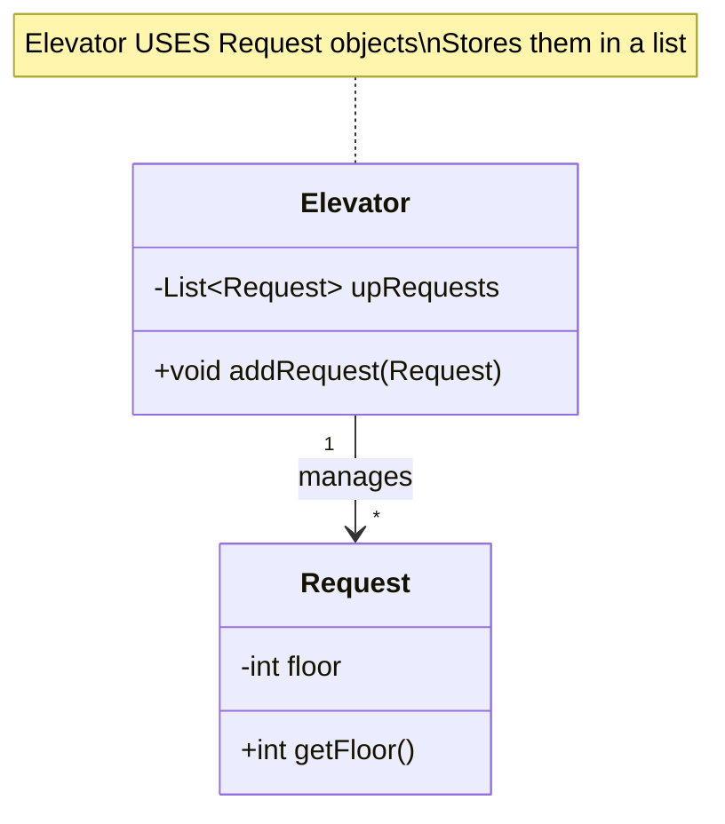
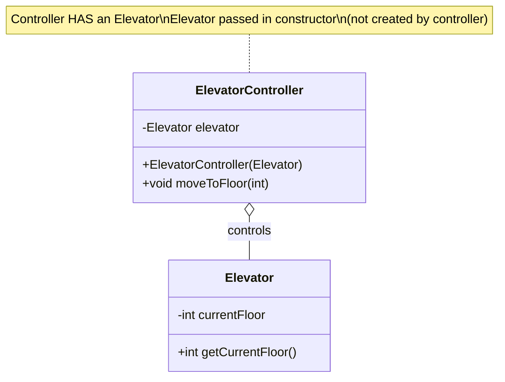
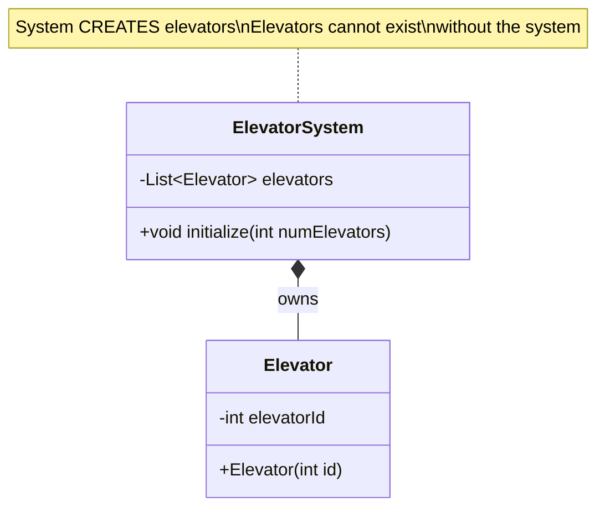
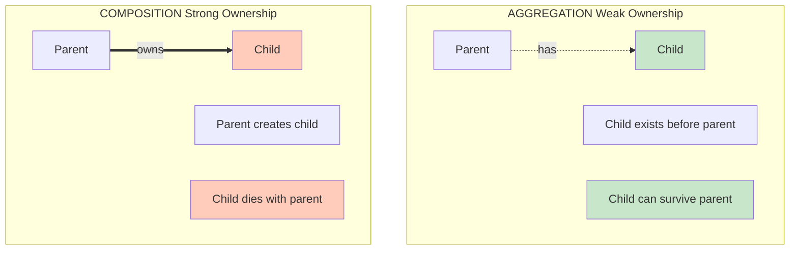
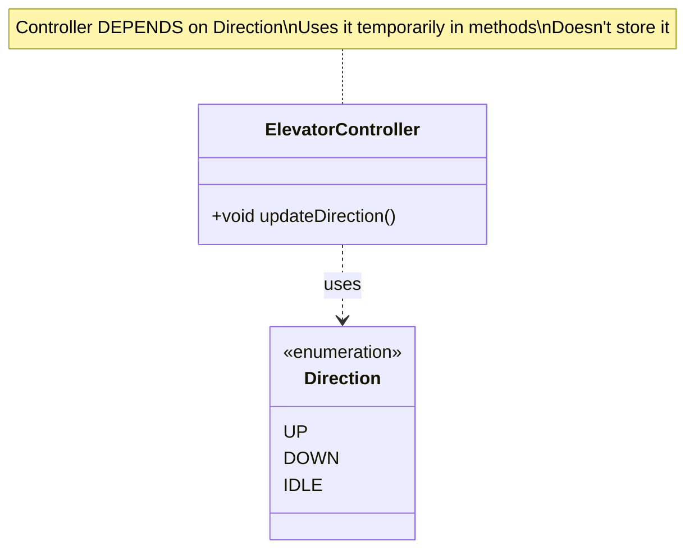
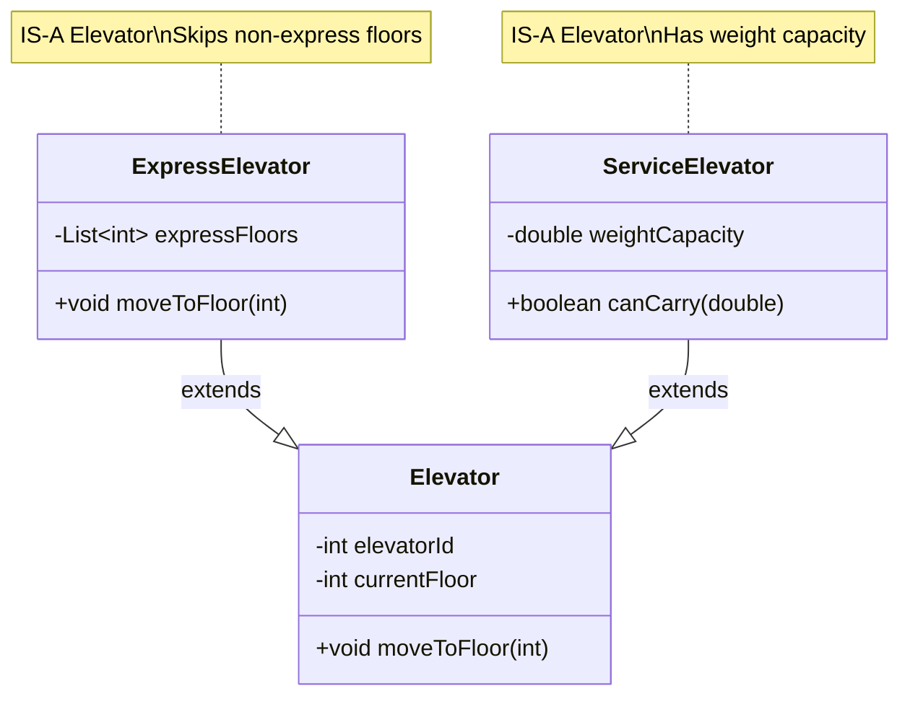
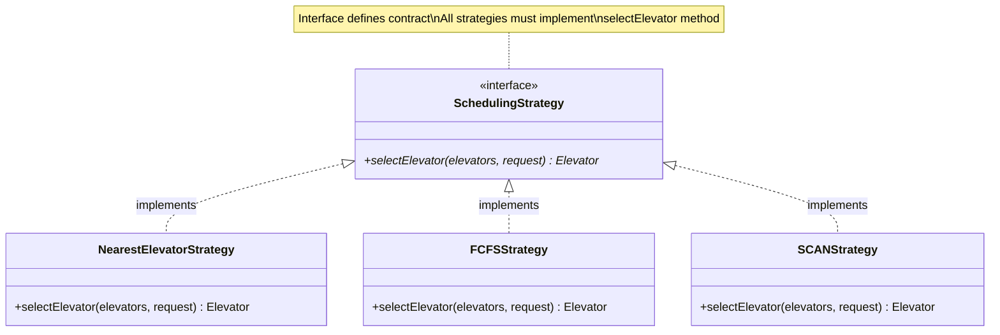
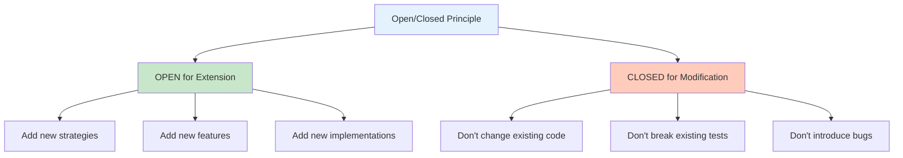
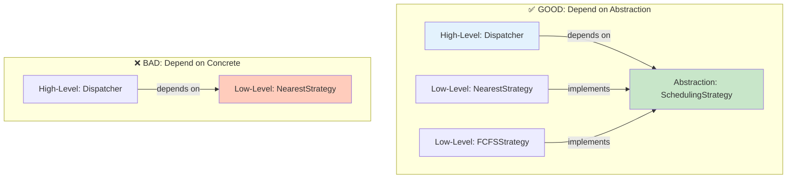
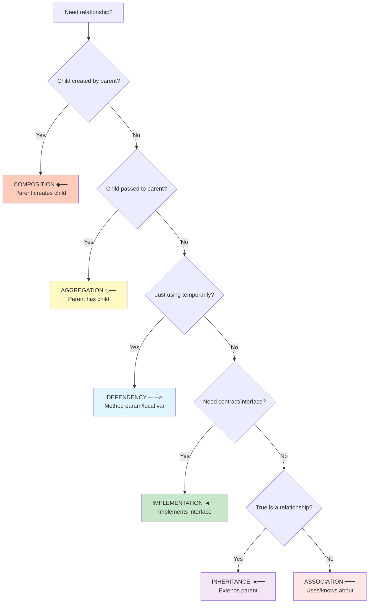

# Phase 5: Relationships & SOLID Principles

## Part 1: UML Relationships Explained

### Overview
In object-oriented design, classes don't work in isolation. They **relate** to each other in different ways. Understanding these relationships is crucial for good design.

---

## 1. Association (━━━)

### Definition
**Association** = "Uses" or "Knows about" relationship
- One class uses or interacts with another
- Weakest form of relationship
- No ownership implied

### UML Notation
```
ClassA ━━━ ClassB
```

### When to Use
- When one class needs to call methods on another
- When there's a "uses-a" relationship
- No strong ownership

### In Elevator System
**Example**: `Elevator` ━━━ `Request`

### Mermaid Diagram


### Java Code Example
```java
/**
 * ASSOCIATION EXAMPLE
 * Elevator "uses" Request objects
 */
public class Elevator {
    // Association: Elevator has a collection of Requests
    private List<Request> upRequests;
    private List<Request> downRequests;

    public Elevator(int id) {
        this.upRequests = new ArrayList<>();
        this.downRequests = new ArrayList<>();
    }

    // Elevator uses Request objects
    public void addRequest(Request request) {
        if (request.getFloor() > currentFloor) {
            upRequests.add(request);  // Association!
        }
    }

    // Elevator interacts with Request objects
    public Request getNextRequest() {
        if (!upRequests.isEmpty()) {
            return upRequests.get(0);  // Association!
        }
        return null;
    }
}
```

### Key Points
✅ Elevator **uses** Request but doesn't create or own it
✅ Request can exist independently of Elevator
✅ Many-to-many relationship possible

---

## 2. Aggregation (◇━━)

### Definition
**Aggregation** = "Has-a" relationship with **weak ownership**
- Parent has child, but child can exist independently
- Shared ownership
- Child is passed to parent (not created by parent)

### UML Notation
```
Parent ◇━━ Child
```
Empty diamond points to parent

### When to Use
- When parent uses child but doesn't create it
- When child can exist without parent
- When child might be shared between parents

### In Elevator System
**Example**: `ElevatorController` ◇━━ `Elevator`

### Mermaid Diagram


### Java Code Example
```java
/**
 * AGGREGATION EXAMPLE
 * ElevatorController "has" an Elevator (weak ownership)
 */
public class ElevatorController {
    // Aggregation: Controller has an Elevator reference
    private Elevator elevator;

    /**
     * Constructor: Elevator is PASSED IN (not created here)
     * This is key indicator of Aggregation!
     */
    public ElevatorController(Elevator elevator) {
        this.elevator = elevator;  // Aggregation!
    }

    // Controller uses elevator but doesn't own it
    public void moveToFloor(int targetFloor) {
        int currentFloor = elevator.getCurrentFloor();
        // ... movement logic
    }
}

// Usage:
Elevator elevator = new Elevator(1);  // Elevator created separately
ElevatorController controller = new ElevatorController(elevator);  // Passed in

// If controller is destroyed, elevator still exists!
controller = null;  // Controller gone
// elevator still exists and usable
```

### Key Points
✅ Child (Elevator) passed via constructor
✅ Child can exist independently
✅ Weak ownership (child outlives parent)

---

## 3. Composition (◆━━)

### Definition
**Composition** = "Part-of" relationship with **strong ownership**
- Parent owns child completely
- Child cannot exist without parent
- Parent creates and destroys child
- Exclusive ownership

### UML Notation
```
Parent ◆━━ Child
```
Filled diamond points to parent

### When to Use
- When child is created BY parent
- When child cannot exist without parent
- When child is exclusive to one parent

### In Elevator System
**Example**: `ElevatorSystem` ◆━━ `Elevator`

### Mermaid Diagram


### Java Code Example
```java
/**
 * COMPOSITION EXAMPLE
 * ElevatorSystem "owns" Elevators (strong ownership)
 */
public class ElevatorSystem {
    // Composition: System owns elevators completely
    private List<Elevator> elevators;

    private ElevatorSystem() {
        this.elevators = new ArrayList<>();
    }

    /**
     * System CREATES elevators (key indicator of Composition!)
     */
    public void initialize(int numElevators, int numFloors) {
        // Creating elevators inside the system
        for (int i = 1; i <= numElevators; i++) {
            Elevator elevator = new Elevator(i);  // COMPOSITION!
            elevators.add(elevator);
        }
    }

    // If ElevatorSystem is destroyed, all elevators are destroyed too!
}

// Usage:
ElevatorSystem system = ElevatorSystem.getInstance();
system.initialize(3, 10);  // System creates 3 elevators

// If system is destroyed, elevators are destroyed too
system = null;  // System gone → elevators gone too!
```

### Key Points
✅ Parent **creates** child internally
✅ Child **cannot exist** without parent
✅ Strong ownership (lifecycle tied together)

---

## Aggregation vs Composition: Visual Comparison



### Code Comparison

```java
// ========== AGGREGATION ==========
// Child created separately, passed to parent
Elevator elevator = new Elevator(1);
ElevatorController controller = new ElevatorController(elevator);

controller = null;  // Parent destroyed
// elevator still exists! ✅

// ========== COMPOSITION ==========
// Parent creates child internally
ElevatorSystem system = new ElevatorSystem();
system.initialize(3, 10);  // Creates 3 elevators internally

system = null;  // Parent destroyed
// elevators destroyed too! ❌ (no external reference)
```

---

## 4. Dependency (┈┈┈>)

### Definition
**Dependency** = "Depends on" relationship
- One class uses another temporarily
- Method parameter or local variable
- No persistent relationship
- Weakest coupling

### UML Notation
```
ClassA ┈┈┈> ClassB
```
Dashed arrow

### When to Use
- Method parameters
- Local variables
- Return types
- Temporary usage

### In Elevator System
**Example**: `ElevatorController` ┈┈┈> `Direction`

### Mermaid Diagram


### Java Code Example
```java
/**
 * DEPENDENCY EXAMPLE
 * ElevatorController depends on Direction enum
 */
public class ElevatorController {
    private Elevator elevator;

    /**
     * Method uses Direction as local variable
     * This creates a DEPENDENCY
     */
    public void updateDirection() {
        // Direction used as local variable (dependency!)
        Direction currentDirection = elevator.getDirection();

        // Using Direction enum values (dependency!)
        if (currentDirection == Direction.UP) {
            if (elevator.getUpRequests().isEmpty()) {
                elevator.setDirection(Direction.DOWN);  // Dependency!
            }
        }
    }

    /**
     * Method parameter creates DEPENDENCY
     */
    public void setDirection(Direction newDirection) {
        elevator.setDirection(newDirection);  // Dependency!
    }

    /**
     * Return type creates DEPENDENCY
     */
    public Direction getCurrentDirection() {
        return elevator.getDirection();  // Dependency!
    }
}

// Controller DEPENDS on Direction but doesn't store it
```

### Key Points
✅ Temporary usage only
✅ Method parameters, local variables, return types
✅ No storage of the dependent object
✅ Weakest form of coupling

---

## 5. Inheritance (◄━━)

### Definition
**Inheritance** = "Is-a" relationship
- Child inherits from parent
- Child gets all methods and fields of parent
- Used for extending behavior
- Solid arrow with empty triangle

### UML Notation
```
Child ◄━━ Parent
```

### When to Use
- When child is a specialized version of parent
- When you need to reuse parent's code
- True "is-a" relationship

### In Elevator System
Not heavily used (composition preferred), but could be:

### Mermaid Diagram


### Java Code Example
```java
/**
 * INHERITANCE EXAMPLE (Optional in our design)
 */

// Parent class
public class Elevator {
    protected int elevatorId;
    protected int currentFloor;

    public Elevator(int id) {
        this.elevatorId = id;
        this.currentFloor = 0;
    }

    public void moveToFloor(int floor) {
        // Standard movement
        this.currentFloor = floor;
    }
}

// Child class inherits from Elevator
public class ExpressElevator extends Elevator {
    private List<Integer> expressFloors;  // Only stops at these floors

    public ExpressElevator(int id, List<Integer> expressFloors) {
        super(id);  // Call parent constructor
        this.expressFloors = expressFloors;
    }

    @Override
    public void moveToFloor(int floor) {
        if (expressFloors.contains(floor)) {
            super.moveToFloor(floor);  // Use parent's method
        } else {
            System.out.println("Not an express floor!");
        }
    }
}

// Usage:
ExpressElevator express = new ExpressElevator(1, Arrays.asList(0, 10, 20));
express.moveToFloor(10);  // OK
express.moveToFloor(5);   // "Not an express floor!"
```

### Key Points
✅ "Is-a" relationship
✅ Code reuse
✅ Child inherits parent's methods and fields
⚠️ Be careful: Prefer composition over inheritance!

---

## 6. Realization/Implementation (◄┈┈)

### Definition
**Realization** = "Implements" relationship
- Class implements an interface
- Class must provide implementation for all interface methods
- Dashed arrow with empty triangle

### UML Notation
```
ConcreteClass ◄┈┈ Interface
```

### When to Use
- When defining contracts (interfaces)
- When multiple implementations needed
- Strategy Pattern, Dependency Inversion

### In Elevator System
**Example**: Strategies implement `SchedulingStrategy`

### Mermaid Diagram


### Java Code Example
```java
/**
 * REALIZATION/IMPLEMENTATION EXAMPLE
 * Concrete classes implement interface
 */

// Interface (contract)
public interface SchedulingStrategy {
    /**
     * All implementations MUST provide this method
     */
    Elevator selectElevator(List<Elevator> elevators, Request request);
}

// Concrete implementation 1
public class NearestElevatorStrategy implements SchedulingStrategy {
    @Override
    public Elevator selectElevator(List<Elevator> elevators, Request request) {
        // Implementation: find nearest elevator
        Elevator nearest = null;
        int minDistance = Integer.MAX_VALUE;

        for (Elevator elevator : elevators) {
            int distance = Math.abs(elevator.getCurrentFloor() - request.getFloor());
            if (distance < minDistance) {
                minDistance = distance;
                nearest = elevator;
            }
        }
        return nearest;
    }
}

// Concrete implementation 2
public class FCFSStrategy implements SchedulingStrategy {
    @Override
    public Elevator selectElevator(List<Elevator> elevators, Request request) {
        // Implementation: find elevator with fewest requests
        return elevators.stream()
            .min(Comparator.comparingInt(e ->
                e.getUpRequests().size() + e.getDownRequests().size()))
            .orElse(null);
    }
}

// Usage: All implementations are interchangeable!
SchedulingStrategy strategy1 = new NearestElevatorStrategy();
SchedulingStrategy strategy2 = new FCFSStrategy();

dispatcher.setStrategy(strategy1);  // Works!
dispatcher.setStrategy(strategy2);  // Works!
```

### Key Points
✅ Interface = contract
✅ All implementations interchangeable
✅ Enables polymorphism
✅ Foundation of Strategy Pattern

---

## Relationship Summary Table

| Relationship | UML | Meaning | Ownership | Example | Code Indicator |
|--------------|-----|---------|-----------|---------|----------------|
| **Association** | ━━━ | Uses | None | Elevator-Request | `private List<Request>` |
| **Aggregation** | ◇━━ | Has (weak) | Weak | Controller-Elevator | `public Constructor(Elevator e)` |
| **Composition** | ◆━━ | Owns | Strong | System-Elevator | `elevators.add(new Elevator())` |
| **Dependency** | ┈┈┈> | Depends | None | Controller-Direction | Method parameter/local var |
| **Inheritance** | ◄━━ | Is-a | N/A | ExpressElevator-Elevator | `extends` |
| **Implementation** | ◄┈┈ | Implements | N/A | NearestStrategy-Strategy | `implements` |

---

## Part 2: SOLID Principles in Detail

---

## 1. Single Responsibility Principle (SRP)

### Definition
**"A class should have one, and only one, reason to change"**

Each class should do ONE thing and do it well.

### Why It Matters
- ✅ Easier to understand
- ✅ Easier to test
- ✅ Easier to maintain
- ✅ Less likely to break

### In Elevator System

#### Good Example: Separated Responsibilities
```java
// ✅ GOOD: Elevator only stores data
public class Elevator {
    private int elevatorId;
    private int currentFloor;
    private Direction direction;

    // Only data access methods
    public int getCurrentFloor() { return currentFloor; }
    public void setCurrentFloor(int floor) { this.currentFloor = floor; }
}

// ✅ GOOD: ElevatorController only handles operations
public class ElevatorController {
    private Elevator elevator;

    // Only operation methods
    public void moveToFloor(int floor) { /* movement logic */ }
    public void openDoors() { /* door logic */ }
}
```

#### Bad Example: Mixed Responsibilities
```java
// ❌ BAD: Everything in one class
public class Elevator {
    private int elevatorId;
    private int currentFloor;

    // Data access (OK)
    public int getCurrentFloor() { return currentFloor; }

    // Movement logic (BAD! Should be in controller)
    public void moveToFloor(int floor) {
        while (currentFloor != floor) {
            // Complex movement logic here...
        }
    }

    // Door operations (BAD! Should be in controller)
    public void openDoors() {
        // Door logic here...
    }

    // Request dispatching (BAD! Should be in dispatcher)
    public void assignToElevator(Request request) {
        // Dispatch logic here...
    }

    // Multiple reasons to change!
    // 1. Data structure changes
    // 2. Movement algorithm changes
    // 3. Door mechanism changes
    // 4. Dispatch algorithm changes
}
```

### How to Apply SRP
1. Identify all responsibilities of a class
2. If more than one, split into multiple classes
3. Each class should have ONE reason to change

### Benefits in Our Design
| Class | Single Responsibility |
|-------|----------------------|
| `Elevator` | Store elevator state |
| `ElevatorController` | Control elevator operations |
| `ElevatorDispatcher` | Assign requests to elevators |
| `Request` | Hold request information |
| `SchedulingStrategy` | Select best elevator |

---

## 2. Open/Closed Principle (OCP)

### Definition
**"Software entities should be open for extension, closed for modification"**

You should be able to add new functionality **without changing** existing code.

### Why It Matters
- ✅ Reduces risk of breaking existing code
- ✅ Easier to add features
- ✅ Better for testing (existing tests still pass)

### In Elevator System: Strategy Pattern

#### Open for Extension
```java
// ✅ GOOD: Can add new strategies without changing existing code

// Existing interface (CLOSED for modification)
public interface SchedulingStrategy {
    Elevator selectElevator(List<Elevator> elevators, Request request);
}

// Existing implementations (unchanged)
public class NearestElevatorStrategy implements SchedulingStrategy { ... }
public class FCFSStrategy implements SchedulingStrategy { ... }

// NEW strategy (OPEN for extension) - NO changes to existing code!
public class ZoneBasedStrategy implements SchedulingStrategy {
    @Override
    public Elevator selectElevator(List<Elevator> elevators, Request request) {
        // New algorithm: assign based on building zones
        int zone = request.getFloor() / 10;  // Floors 0-9 = Zone 0, etc.
        return elevators.stream()
            .filter(e -> e.getElevatorId() % 3 == zone % 3)
            .findFirst()
            .orElse(elevators.get(0));
    }
}

// Usage: No changes to dispatcher!
dispatcher.setStrategy(new ZoneBasedStrategy());  // Just plug it in!
```

#### Violating OCP
```java
// ❌ BAD: Must modify class to add new algorithm

public class ElevatorDispatcher {
    private String algorithmType;  // "NEAREST", "FCFS", "SCAN"

    public Elevator findBestElevator(Request request) {
        // Must modify this method for every new algorithm!
        if (algorithmType.equals("NEAREST")) {
            // Nearest logic
        } else if (algorithmType.equals("FCFS")) {
            // FCFS logic
        } else if (algorithmType.equals("SCAN")) {
            // SCAN logic
        }
        // To add new algorithm, must modify this class! ❌
    }
}
```

### Diagram


---

## 3. Liskov Substitution Principle (LSP)

### Definition
**"Objects of a superclass should be replaceable with objects of a subclass without affecting correctness"**

If class B inherits/implements class A, you should be able to use B anywhere you use A.

### Why It Matters
- ✅ Enables polymorphism
- ✅ Ensures consistent behavior
- ✅ Makes code more flexible

### In Elevator System

#### Good Example
```java
// ✅ GOOD: All strategies are interchangeable

SchedulingStrategy strategy;

// Can use ANY implementation
strategy = new NearestElevatorStrategy();
Elevator e1 = strategy.selectElevator(elevators, request);  // Works!

strategy = new FCFSStrategy();
Elevator e2 = strategy.selectElevator(elevators, request);  // Works!

strategy = new SCANStrategy();
Elevator e3 = strategy.selectElevator(elevators, request);  // Works!

// All behave correctly - LSP satisfied!
```

#### Bad Example (Violating LSP)
```java
// ❌ BAD: Child class changes expected behavior

public interface SchedulingStrategy {
    Elevator selectElevator(List<Elevator> elevators, Request request);
}

public class BrokenStrategy implements SchedulingStrategy {
    @Override
    public Elevator selectElevator(List<Elevator> elevators, Request request) {
        return null;  // Always returns null! ❌
        // Breaks expectation that a valid elevator is returned
        // Violates LSP!
    }
}

// Usage breaks!
SchedulingStrategy strategy = new BrokenStrategy();
Elevator elevator = strategy.selectElevator(elevators, request);
elevator.addRequest(request);  // NullPointerException! ❌
```

### How to Apply LSP
1. Subclass should not **weaken** preconditions
2. Subclass should not **strengthen** postconditions
3. Subclass should **preserve** parent's behavior

---

## 4. Interface Segregation Principle (ISP)

### Definition
**"Clients should not be forced to depend on interfaces they don't use"**

Keep interfaces small and focused. Don't create "fat" interfaces with many methods.

### Why It Matters
- ✅ Smaller, focused interfaces
- ✅ Less coupling
- ✅ Easier to implement

### In Elevator System

#### Good Example: Focused Interface
```java
// ✅ GOOD: Small, focused interface

public interface SchedulingStrategy {
    // Only ONE method - focused purpose!
    Elevator selectElevator(List<Elevator> elevators, Request request);
}

// Easy to implement
public class NearestElevatorStrategy implements SchedulingStrategy {
    @Override
    public Elevator selectElevator(List<Elevator> elevators, Request request) {
        // Only implement one method - easy!
    }
}
```

#### Bad Example: Fat Interface
```java
// ❌ BAD: Fat interface with unrelated methods

public interface ElevatorOperations {
    // Scheduling
    Elevator selectElevator(List<Elevator> elevators, Request request);

    // Movement (unrelated to scheduling!)
    void moveElevator(Elevator elevator, int floor);
    void openDoors(Elevator elevator);
    void closeDoors(Elevator elevator);

    // Maintenance (unrelated!)
    void performMaintenance(Elevator elevator);
    void checkSafety(Elevator elevator);

    // Billing (unrelated!)
    double calculateUsageCost(Elevator elevator);
}

// Forced to implement ALL methods even if you only need one!
public class NearestElevatorStrategy implements ElevatorOperations {
    @Override
    public Elevator selectElevator(...) {
        // This is all I need!
    }

    @Override
    public void moveElevator(...) {
        throw new UnsupportedOperationException();  // Don't need this!
    }

    @Override
    public void openDoors(...) {
        throw new UnsupportedOperationException();  // Don't need this!
    }

    // ... must implement all methods! ❌
}
```

#### Better: Split into Multiple Interfaces
```java
// ✅ GOOD: Split into focused interfaces

public interface SchedulingStrategy {
    Elevator selectElevator(List<Elevator> elevators, Request request);
}

public interface ElevatorControl {
    void moveElevator(Elevator elevator, int floor);
    void openDoors(Elevator elevator);
    void closeDoors(Elevator elevator);
}

public interface MaintenanceOperations {
    void performMaintenance(Elevator elevator);
    void checkSafety(Elevator elevator);
}

public interface BillingOperations {
    double calculateUsageCost(Elevator elevator);
}

// Now implement only what you need!
public class NearestElevatorStrategy implements SchedulingStrategy {
    // Only implement scheduling - perfect!
}
```

---

## 5. Dependency Inversion Principle (DIP)

### Definition
**"Depend on abstractions, not on concretions"**

- High-level modules should not depend on low-level modules
- Both should depend on abstractions (interfaces)

### Why It Matters
- ✅ Loose coupling
- ✅ Easy to swap implementations
- ✅ Better testability

### In Elevator System

#### Good Example: Depend on Interface
```java
// ✅ GOOD: Dispatcher depends on interface, not concrete class

public class ElevatorDispatcher {
    // Depends on INTERFACE (abstraction)
    private SchedulingStrategy strategy;

    public ElevatorDispatcher(SchedulingStrategy strategy) {
        this.strategy = strategy;  // Accept any implementation!
    }

    public void setStrategy(SchedulingStrategy strategy) {
        this.strategy = strategy;  // Can swap easily!
    }

    public void dispatchRequest(Request request) {
        // Uses interface method
        Elevator best = strategy.selectElevator(elevators, request);
    }
}

// Can use ANY strategy implementation!
dispatcher.setStrategy(new NearestElevatorStrategy());
dispatcher.setStrategy(new FCFSStrategy());
dispatcher.setStrategy(new SCANStrategy());
// All work because we depend on abstraction!
```

#### Bad Example: Depend on Concrete Class
```java
// ❌ BAD: Dispatcher depends on concrete class

public class ElevatorDispatcher {
    // Depends on CONCRETE class
    private NearestElevatorStrategy strategy;

    public ElevatorDispatcher() {
        this.strategy = new NearestElevatorStrategy();  // Hardcoded!
    }

    public void dispatchRequest(Request request) {
        Elevator best = strategy.selectElevator(elevators, request);
        // Can only use NearestElevatorStrategy! ❌
        // Cannot easily swap to FCFSStrategy!
    }
}
```

### Diagram


---

## SOLID Principles Summary in Elevator System

| Principle | Class Example | How It's Applied |
|-----------|---------------|------------------|
| **SRP** | Elevator, ElevatorController | Elevator stores data; Controller has logic |
| **OCP** | SchedulingStrategy | Can add new strategies without modifying dispatcher |
| **LSP** | All Strategy implementations | All strategies interchangeable |
| **ISP** | SchedulingStrategy interface | Single focused method, not fat interface |
| **DIP** | Dispatcher depends on interface | Dispatcher depends on SchedulingStrategy, not concrete |

---

## Quick Reference: When to Use Each Relationship



---

**Next**: Phase 6 - Design Patterns in Detail (Strategy, Singleton, Factory)
