```mermaid
classDiagram
    class ElevatorSystem {
        <<Singleton>>
        -static ElevatorSystem instance
        -List~Elevator~ elevators
        -ElevatorDispatcher dispatcher

        -ElevatorSystem()
        +static getInstance() ElevatorSystem
        +void initialize(int, int)
    }

    note for ElevatorSystem "🔒 SINGLETON PATTERN\n\n- Private constructor\n- Static instance\n- Global access via getInstance()\n\nBenefit: Only one system\ncan exist per building"
```

```mermaid
classDiagram
    class Request {
        -int floor
        -Direction direction
        -RequestType type
        -long timestamp

        +Request(floor, direction, type)
        +createExternalRequest(floor, dir)$ Request
        +createInternalRequest(floor)$ Request
    }

    class RequestType {
        <<enumeration>>
        EXTERNAL
        INTERNAL
    }

    Request --> RequestType

    note for Request "🏭 FACTORY PATTERN\n\nStatic factory methods\nhide creation complexity\n\nBenefit: Clear intent,\nencapsulated logic"
```

# Phase 6: Design Patterns

## Overview

Design patterns are proven solutions to common software design problems. Our elevator system uses 3 main patterns:

1. **Singleton Pattern** - ElevatorSystem
2. **Strategy Pattern** - SchedulingStrategy
3. **Factory Pattern** - Request creation

---

## 1. Singleton Pattern

### Problem
**Need exactly ONE instance** of a class throughout the application.

In our case: A building has only ONE elevator system.

### Solution
Make constructor private and provide a static method to get the single instance.

### UML Diagram


### Implementation
```java
public class ElevatorSystem {
    // Static instance - shared by all
    private static ElevatorSystem instance;

    // Private constructor - prevents external instantiation
    private ElevatorSystem() {
        this.elevators = new ArrayList<>();
        this.controllers = new ArrayList<>();
    }

    // Public method to get the single instance
    public static synchronized ElevatorSystem getInstance() {
        if (instance == null) {
            instance = new ElevatorSystem();
        }
        return instance;
    }

    // Rest of the methods...
}
```

### Usage
```java
// ❌ CANNOT do this - constructor is private
// ElevatorSystem system = new ElevatorSystem();  // Compile error!

// ✅ MUST use getInstance()
ElevatorSystem system1 = ElevatorSystem.getInstance();
ElevatorSystem system2 = ElevatorSystem.getInstance();

// system1 and system2 are THE SAME object!
System.out.println(system1 == system2);  // true
```

### Thread-Safe Singleton (Better)
```java
public class ElevatorSystem {
    // Eager initialization - thread-safe
    private static final ElevatorSystem instance = new ElevatorSystem();

    private ElevatorSystem() { }

    public static ElevatorSystem getInstance() {
        return instance;  // Already created
    }
}
```

### Benefits
✅ Controlled access to single instance
✅ Global access point
✅ Lazy initialization (if needed)

### Drawbacks
⚠️ Global state (can make testing harder)
⚠️ Thread-safety concerns (use synchronized or eager init)

---

## 2. Strategy Pattern

### Problem
**Need different algorithms** that can be **swapped at runtime**.

In our case: Different elevator selection algorithms (Nearest, FCFS, SCAN).

### Solution
Define an interface for the algorithm, then create concrete implementations. Client uses the interface.

### UML Diagram


### Implementation

#### Step 1: Define Strategy Interface
```java
public interface SchedulingStrategy {
    Elevator selectElevator(List<Elevator> elevators, Request request);
}
```

#### Step 2: Create Concrete Strategies
```java
// Strategy 1: Nearest Elevator
public class NearestElevatorStrategy implements SchedulingStrategy {
    @Override
    public Elevator selectElevator(List<Elevator> elevators, Request request) {
        return elevators.stream()
            .min(Comparator.comparingInt(e ->
                Math.abs(e.getCurrentFloor() - request.getFloor())))
            .orElse(null);
    }
}

// Strategy 2: FCFS (least busy)
public class FCFSStrategy implements SchedulingStrategy {
    @Override
    public Elevator selectElevator(List<Elevator> elevators, Request request) {
        return elevators.stream()
            .min(Comparator.comparingInt(e ->
                e.getUpRequests().size() + e.getDownRequests().size()))
            .orElse(null);
    }
}

// Strategy 3: SCAN (direction-aware)
public class SCANStrategy implements SchedulingStrategy {
    @Override
    public Elevator selectElevator(List<Elevator> elevators, Request request) {
        // Complex scoring logic...
        return findBestDirectionalMatch(elevators, request);
    }
}
```

#### Step 3: Context Uses Strategy
```java
public class ElevatorDispatcher {
    private SchedulingStrategy strategy;

    public ElevatorDispatcher(SchedulingStrategy strategy) {
        this.strategy = strategy;
    }

    // Can change strategy at runtime!
    public void setStrategy(SchedulingStrategy strategy) {
        this.strategy = strategy;
    }

    public void dispatchRequest(Request request) {
        // Use current strategy
        Elevator best = strategy.selectElevator(elevators, request);
        best.addRequest(request);
    }
}
```

### Usage
```java
ElevatorDispatcher dispatcher = new ElevatorDispatcher(new NearestElevatorStrategy());

// Morning rush hour - use FCFS to balance load
dispatcher.setStrategy(new FCFSStrategy());

// Normal hours - use SCAN for efficiency
dispatcher.setStrategy(new SCANStrategy());

// Late night - use nearest for speed
dispatcher.setStrategy(new NearestElevatorStrategy());

// All work seamlessly!
```

### Benefits
✅ Open/Closed Principle (add strategies without changing code)
✅ Runtime flexibility
✅ Eliminates conditional logic
✅ Easy to test each strategy independently

---

## 3. Factory Pattern

### Problem
**Object creation is complex** or we want to **hide creation logic**.

In our case: Creating different types of requests (External vs Internal).

### Solution
Provide factory methods that encapsulate creation logic.

### UML Diagram


### Implementation

```java
public class Request {
    private int floor;
    private Direction direction;
    private RequestType type;
    private long timestamp;

    // Private constructor (optional - can be public too)
    public Request(int floor, Direction direction, RequestType type) {
        this.floor = floor;
        this.direction = direction;
        this.type = type;
        this.timestamp = System.currentTimeMillis();
    }

    // Factory Method 1: External Request
    public static Request createExternalRequest(int floor, Direction direction) {
        return new Request(floor, direction, RequestType.EXTERNAL);
    }

    // Factory Method 2: Internal Request
    public static Request createInternalRequest(int floor) {
        // Internal requests don't need direction (determined by elevator position)
        return new Request(floor, null, RequestType.INTERNAL);
    }
}
```

### Usage
```java
// ❌ Less clear - direct constructor
Request req1 = new Request(5, Direction.UP, RequestType.EXTERNAL);

// ✅ More clear - factory method
Request req2 = Request.createExternalRequest(5, Direction.UP);
Request req3 = Request.createInternalRequest(7);

// Intent is obvious from method name!
```

### Benefits
✅ Clear intent (method name describes what's being created)
✅ Encapsulates creation logic
✅ Can return different types from same method
✅ More readable code

---

## Pattern Comparison

| Pattern | Purpose | When to Use | Example in Our Design |
|---------|---------|-------------|----------------------|
| **Singleton** | Ensure one instance | Global coordinator | ElevatorSystem |
| **Strategy** | Interchangeable algorithms | Multiple ways to do same thing | SchedulingStrategy |
| **Factory** | Hide creation complexity | Complex object creation | Request creation |

---

## Design Patterns Interaction Diagram


---

## Additional Patterns (Could Be Added)

### 4. Observer Pattern (Future Enhancement)
**Use Case**: Notify passengers when elevator arrives

```java
public interface ElevatorObserver {
    void onElevatorArrived(int elevatorId, int floor);
}

public class PassengerNotifier implements ElevatorObserver {
    @Override
    public void onElevatorArrived(int elevatorId, int floor) {
        System.out.println("Elevator " + elevatorId + " arrived at floor " + floor);
    }
}

public class Elevator {
    private List<ElevatorObserver> observers = new ArrayList<>();

    public void addObserver(ElevatorObserver observer) {
        observers.add(observer);
    }

    private void notifyObservers() {
        for (ElevatorObserver observer : observers) {
            observer.onElevatorArrived(elevatorId, currentFloor);
        }
    }
}
```

### 5. State Pattern (Alternative to Enum)
**Use Case**: Manage complex elevator states

```java
public interface ElevatorState {
    void handleRequest(Elevator elevator);
}

public class IdleState implements ElevatorState {
    @Override
    public void handleRequest(Elevator elevator) {
        elevator.setState(new MovingState());
    }
}

public class MovingState implements ElevatorState {
    @Override
    public void handleRequest(Elevator elevator) {
        // Different behavior when moving
    }
}
```

---

## Interview Tips: Discussing Design Patterns

### What to Say
> "I'm using the Singleton pattern for ElevatorSystem because there's only one system per building. This ensures centralized control and prevents multiple instances. I'm also using the Strategy pattern for scheduling algorithms - this allows us to easily switch between different elevator selection strategies at runtime without modifying the dispatcher. Finally, I'm using static factory methods in the Request class to make request creation more intuitive and to hide creation complexity."

### What to Highlight
- ✅ **Why** you chose each pattern
- ✅ **Benefits** of using the pattern
- ✅ **Trade-offs** (e.g., Singleton can complicate testing)
- ✅ **Alternatives** considered

---

**Next**: Phase 7 - Sequence Diagrams for Key Flows
