```mermaid
sequenceDiagram
    actor Alice as 👤 Alice<br/>(Floor 5)
    participant Button as 🔘 UP Button
    participant System as 🏢 ElevatorSystem
    participant Dispatcher as 🎯 Dispatcher
    participant Strategy as 📐 Strategy
    participant E2 as 🛗 Elevator 2

    Alice->>Button: Presses UP button at Floor 5
    activate Button
    Button->>System: requestElevator(5, UP)
    activate System

    System->>System: Create External Request
    Note over System: Request{floor:5, dir:UP, type:EXTERNAL}

    System->>Dispatcher: dispatchRequest(request)
    activate Dispatcher

    Dispatcher->>Strategy: selectElevator(elevators, request)
    activate Strategy
    Note over Strategy: Evaluates all elevators:<br/>E1: Floor 8, DOWN, busy<br/>E2: Floor 3, UP, idle<br/>E3: Floor 1, IDLE, busy

    Strategy-->>Dispatcher: Elevator 2 (best match)
    deactivate Strategy

    Dispatcher->>E2: addRequest(request)
    activate E2
    Note over E2: Adds to upRequests queue

    E2-->>Dispatcher: Request added
    deactivate E2

    Dispatcher-->>System: Elevator 2 assigned
    deactivate Dispatcher

    System-->>Button: Confirmation
    Button-->>Alice: Button lights up
    deactivate Button
    deactivate System

    Note over Alice,E2: Elevator 2 will arrive shortly...
```

```mermaid
sequenceDiagram
    actor Bob as 👤 Bob<br/>(Inside Elevator 2)
    participant Panel as 🔘 Floor Panel
    participant System as 🏢 ElevatorSystem
    participant E2 as 🛗 Elevator 2
    participant Queue as 📋 Request Queue

    Bob->>Panel: Presses button "8"
    activate Panel

    Panel->>System: selectDestination(elevatorId:2, floor:8)
    activate System

    System->>System: Create Internal Request
    Note over System: Request{floor:8, type:INTERNAL}

    System->>E2: addRequest(request)
    activate E2

    E2->>E2: Determine queue (UP or DOWN)
    Note over E2: Floor 8 > Current Floor 5<br/>Add to upRequests

    E2->>Queue: Add to upRequests
    activate Queue
    Queue->>Queue: Sort in ascending order
    Note over Queue: upRequests: [6, 7, 8]
    Queue-->>E2: Request queued
    deactivate Queue

    E2-->>System: Request added
    deactivate E2

    System-->>Panel: Confirmation
    Panel-->>Bob: Button "8" lights up
    deactivate Panel
    deactivate System

    Note over Bob,E2: Elevator will stop at Floor 8
```

```mermaid
sequenceDiagram
    participant Controller as 🎮 ElevatorController
    participant Elevator as 🛗 Elevator
    participant Queue as 📋 Request Queue

    Controller->>Controller: processRequests()
    activate Controller

    loop While requests exist
        Controller->>Elevator: hasRequests()
        Elevator-->>Controller: true

        Controller->>Elevator: getNextRequest()
        Elevator->>Queue: Get first request in current direction
        Queue-->>Elevator: Request{floor:6}
        Elevator-->>Controller: Request{floor:6}

        Controller->>Controller: moveToFloor(6)

        loop Until Floor 6
            Controller->>Controller: moveOneFloor()
            Note over Controller: Sleep 2 seconds<br/>(simulate travel time)

            Controller->>Elevator: setCurrentFloor(currentFloor + 1)
            Elevator-->>Controller: OK

            Controller->>Controller: handleCurrentFloor()
            Note over Controller: Check if should stop
        end

        Note over Controller: Reached Floor 6

        Controller->>Controller: stop()
        Controller->>Controller: openDoors()
        Note over Controller: Sleep 1 second (door opening)
        Note over Controller: Sleep 3 seconds (wait for passengers)
        Controller->>Controller: closeDoors()
        Note over Controller: Sleep 1 second (door closing)

        Controller->>Elevator: removeRequest(Request{floor:6})
        Elevator->>Queue: Remove request
        Queue-->>Elevator: Removed
        Elevator-->>Controller: OK

        Controller->>Controller: updateDirection()
        Note over Controller: Check remaining requests<br/>Continue UP if more UP requests
    end

    Controller->>Elevator: setDirection(IDLE)
    Controller->>Elevator: setState(IDLE)
    deactivate Controller

    Note over Controller,Elevator: All requests processed
```

```mermaid
sequenceDiagram
    participant P1 as 👤 P1<br/>(Floor 3)
    participant P2 as 👤 P2<br/>(Floor 8)
    participant System as 🏢 System
    participant Dispatcher as 🎯 Dispatcher
    participant Strategy as 📐 SCAN Strategy
    participant E1 as 🛗 E1<br/>(Floor 5, UP)
    participant E2 as 🛗 E2<br/>(Floor 7, DOWN)

    P1->>System: requestElevator(3, UP)
    activate System
    System->>Dispatcher: dispatch(Request{3, UP})
    activate Dispatcher

    Dispatcher->>Strategy: selectElevator(elevators, request)
    activate Strategy
    Note over Strategy: E1: Floor 5, moving UP<br/>(wrong direction for Floor 3)<br/>E2: Floor 7, moving DOWN<br/>(correct direction for Floor 3)
    Strategy-->>Dispatcher: Elevator 2
    deactivate Strategy

    Dispatcher->>E2: addRequest(Request{3, UP})
    E2-->>Dispatcher: OK
    Dispatcher-->>System: E2 assigned
    deactivate Dispatcher
    System-->>P1: Elevator 2 coming
    deactivate System

    Note over P1,E2: Short delay...

    P2->>System: requestElevator(8, DOWN)
    activate System
    System->>Dispatcher: dispatch(Request{8, DOWN})
    activate Dispatcher

    Dispatcher->>Strategy: selectElevator(elevators, request)
    activate Strategy
    Note over Strategy: E1: Floor 5, moving UP<br/>(correct direction for Floor 8)<br/>E2: Floor 7, moving DOWN<br/>(wrong direction for Floor 8)
    Strategy-->>Dispatcher: Elevator 1
    deactivate Strategy

    Dispatcher->>E1: addRequest(Request{8, DOWN})
    E1-->>Dispatcher: OK
    Dispatcher-->>System: E1 assigned
    deactivate Dispatcher
    System-->>P2: Elevator 1 coming
    deactivate System

    Note over P1,P2: Optimal assignment based on<br/>current direction and position!
```

```mermaid
sequenceDiagram
    participant Alice as 👤 Alice
    participant System as 🏢 System
    participant Disp as 🎯 Dispatcher
    participant E2 as 🛗 Elevator 2
    participant Ctrl as 🎮 Controller

    Note over Alice: Alice is at Floor 3<br/>Wants to go to Floor 7

    rect rgb(255, 240, 230)
        Note over Alice,Disp: STEP 1: External Request (Hall Call)

        Alice->>System: Presses UP at Floor 3
        System->>Disp: dispatchRequest(3, UP)
        Disp->>E2: Assign request
        E2-->>Alice: Elevator 2 coming
    end

    rect rgb(230, 240, 255)
        Note over E2,Ctrl: STEP 2: Elevator Movement to Floor 3

        Ctrl->>E2: processRequests()
        loop Move from Floor 2 to Floor 3
            Ctrl->>E2: moveOneFloor()
        end

        Ctrl->>Ctrl: stop() at Floor 3
        Ctrl->>Ctrl: openDoors()
        Note over Alice,E2: Doors open - Alice enters

        Ctrl->>Ctrl: closeDoors()
    end

    rect rgb(240, 255, 230)
        Note over Alice,E2: STEP 3: Internal Request (Car Call)

        Alice->>System: Presses button "7"
        System->>E2: addRequest(7, INTERNAL)
        E2->>E2: Add to upRequests
        Note over E2: upRequests: [7]
    end

    rect rgb(255, 250, 240)
        Note over E2,Ctrl: STEP 4: Elevator Movement to Floor 7

        Ctrl->>E2: Continue processing
        loop Move from Floor 3 to Floor 7
            Ctrl->>E2: moveOneFloor()
        end

        Ctrl->>Ctrl: stop() at Floor 7
        Ctrl->>Ctrl: openDoors()
        Note over Alice,E2: Doors open - Alice exits

        Alice->>E2: Exits elevator
        Ctrl->>Ctrl: closeDoors()
    end

    rect rgb(245, 245, 245)
        Note over E2,Ctrl: STEP 5: Elevator Returns to Idle

        Ctrl->>E2: removeRequest(7)
        Ctrl->>E2: hasRequests()
        E2-->>Ctrl: false (no more requests)

        Ctrl->>E2: setDirection(IDLE)
        Ctrl->>E2: setState(IDLE)
    end

    Note over Alice: Journey complete!<br/>Alice arrived at Floor 7
```

# Phase 7: Sequence Diagrams

## Overview

Sequence diagrams show **how objects interact over time**. They visualize the **flow of messages** between components.

This phase covers 5 key flows:
1. External Request Flow (Hall Call)
2. Internal Request Flow (Car Call)
3. Elevator Movement Flow
4. Request Dispatching Flow
5. Complete Journey Flow

---

## 1. External Request Flow (Hall Call)

### Scenario
Passenger Alice is at Floor 5 and wants to go UP.

### Sequence Diagram

### Key Points
1. **User initiates** by pressing button
2. **System creates** external request
3. **Dispatcher** uses strategy to find best elevator
4. **Strategy** evaluates all elevators
5. **Best elevator** gets the request
6. **User feedback** via button light

---

## 2. Internal Request Flow (Car Call)

### Scenario
Bob is inside Elevator 2 and presses button for Floor 8.

### Sequence Diagram

### Key Points
1. **Internal request** doesn't need direction (determined by elevator position)
2. **Directly added** to specific elevator (no dispatching)
3. **Automatic sorting** in appropriate queue (UP or DOWN)
4. **Visual feedback** via button light

---

## 3. Elevator Movement Flow

### Scenario
Elevator 2 moves from Floor 5 to Floor 8, stopping at intermediate floors.

### Sequence Diagram

### Key Points
1. **Floor-by-floor movement** (not jumping)
2. **Check each floor** for pending requests
3. **Stop** → **Open doors** → **Wait** → **Close doors**
4. **Update direction** after each request
5. **Become IDLE** when no more requests

---

## 4. Complete Request Dispatching Flow

### Scenario
Multiple passengers make requests; system assigns them optimally.

### Sequence Diagram

### Key Points
1. **SCAN strategy** considers direction
2. **Elevator moving towards request** gets priority
3. **Load balancing** across elevators
4. **Different passengers** may get different elevators

---

## 5. Complete Journey Flow (End-to-End)

### Scenario
Alice's complete journey from Floor 3 to Floor 7.

### Sequence Diagram

### Key Points
1. **5 distinct phases** in complete journey
2. **External request** → **Pickup** → **Internal request** → **Dropoff** → **Idle**
3. **Multiple interactions** between components
4. **Timing** matters (doors, movement, waiting)

---

## Timing Analysis

### Time Breakdown for Alice's Journey (Floor 3 → Floor 7)

**Total Time**: ~26 seconds

**Breakdown**:
- Request & dispatch: 3s
- Pickup (Floor 2→3): 7s
- Internal request: 1s
- Travel (Floor 3→7): 12s
- Idle: 1s

---

## Concurrent Requests Sequence

### Scenario
Two passengers make requests simultaneously.

```mermaid
sequenceDiagram
    participant P1 as 👤 P1 (Floor 2)
    participant P2 as 👤 P2 (Floor 8)
    participant System as 🏢 System
    participant Disp as 🎯 Dispatcher
    participant E1 as 🛗 E1
    participant E2 as 🛗 E2

    par P1 makes request
        P1->>System: requestElevator(2, UP)
        System->>Disp: dispatch(Request{2, UP})
        Disp->>E1: Assign to E1
    and P2 makes request
        P2->>System: requestElevator(8, DOWN)
        System->>Disp: dispatch(Request{8, DOWN})
        Disp->>E2: Assign to E2
    end

    Note over P1,E2: Requests handled in parallel!

    par E1 processes
        E1->>E1: Move to Floor 2
        E1->>E1: Pickup P1
    and E2 processes
        E2->>E2: Move to Floor 8
        E2->>E2: Pickup P2
    end

    Note over E1,E2: Both elevators work independently
```

### Key Points
- **Parallel processing** of requests
- **Independent operation** of elevators
- **No blocking** (one request doesn't wait for another)

---

## Error Scenarios

### Scenario: No Available Elevators

```mermaid
sequenceDiagram
    participant User as 👤 User
    participant System as 🏢 System
    participant Disp as 🎯 Dispatcher
    participant E1 as 🛗 E1<br/>(Out of Service)
    participant E2 as 🛗 E2<br/>(Out of Service)

    User->>System: requestElevator(5, UP)
    System->>Disp: dispatch(request)

    Disp->>E1: Check availability
    E1-->>Disp: OUT_OF_SERVICE

    Disp->>E2: Check availability
    E2-->>Disp: OUT_OF_SERVICE

    Disp-->>System: No available elevator
    System-->>User: Error: Please wait

    Note over User: Request queued<br/>Will be reassigned when<br/>elevator becomes available
```

---

## Summary

### Sequence Diagrams Covered
1. ✅ **External Request** - Hall call flow
2. ✅ **Internal Request** - Car call flow
3. ✅ **Elevator Movement** - Floor-by-floor movement
4. ✅ **Dispatching** - Request assignment logic
5. ✅ **Complete Journey** - End-to-end passenger experience
6. ✅ **Concurrent Requests** - Parallel processing
7. ✅ **Error Handling** - No available elevators

### Key Takeaways
- **Step-by-step visualization** of interactions
- **Timing matters** in elevator systems
- **Multiple components** work together
- **Parallel processing** is essential
- **Error handling** must be considered

---

**Next**: Phase 8 - Data Model & Component Diagram
