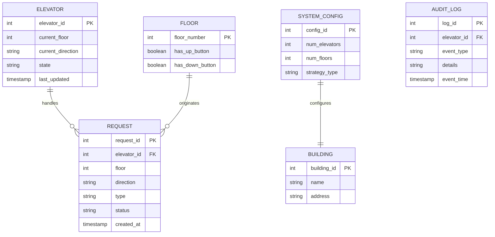
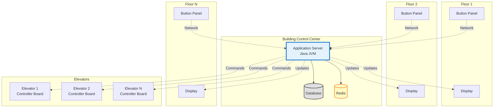
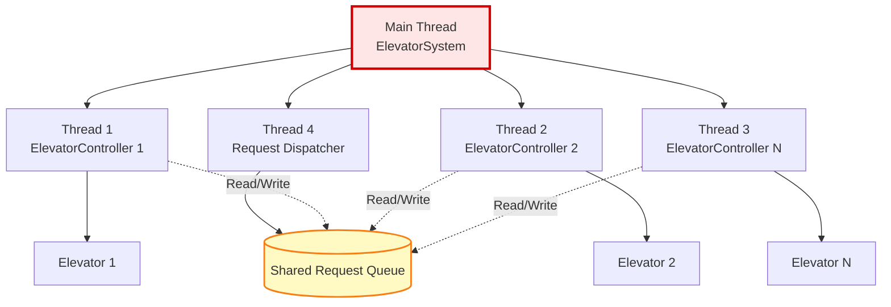
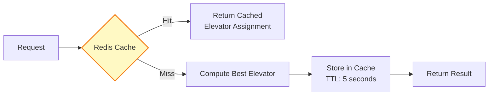

# Phase 8: Data Model & Component Diagram

## Part 1: Data Model (Optional for Basic Design)

While our elevator system primarily runs in memory, here's how we would persist data if needed.

### Entity-Relationship Diagram



### Table Definitions

#### 1. ELEVATOR Table
```sql
CREATE TABLE elevator (
    elevator_id INT PRIMARY KEY,
    current_floor INT NOT NULL,
    current_direction VARCHAR(10) NOT NULL,  -- 'UP', 'DOWN', 'IDLE'
    state VARCHAR(20) NOT NULL,              -- 'IDLE', 'MOVING', 'STOPPED', 'OUT_OF_SERVICE'
    last_updated TIMESTAMP DEFAULT CURRENT_TIMESTAMP,
    INDEX idx_state (state),
    INDEX idx_floor_direction (current_floor, current_direction)
);
```

#### 2. REQUEST Table
```sql
CREATE TABLE request (
    request_id INT AUTO_INCREMENT PRIMARY KEY,
    elevator_id INT,
    floor INT NOT NULL,
    direction VARCHAR(10),                    -- 'UP', 'DOWN', NULL for internal
    type VARCHAR(10) NOT NULL,               -- 'EXTERNAL', 'INTERNAL'
    status VARCHAR(20) DEFAULT 'PENDING',    -- 'PENDING', 'ASSIGNED', 'COMPLETED', 'CANCELLED'
    created_at TIMESTAMP DEFAULT CURRENT_TIMESTAMP,
    completed_at TIMESTAMP NULL,
    FOREIGN KEY (elevator_id) REFERENCES elevator(elevator_id),
    INDEX idx_status (status),
    INDEX idx_elevator (elevator_id),
    INDEX idx_created (created_at)
);
```

#### 3. FLOOR Table
```sql
CREATE TABLE floor (
    floor_number INT PRIMARY KEY,
    has_up_button BOOLEAN DEFAULT TRUE,
    has_down_button BOOLEAN DEFAULT TRUE,
    CHECK (floor_number >= 0)
);
```

#### 4. SYSTEM_CONFIG Table
```sql
CREATE TABLE system_config (
    config_id INT PRIMARY KEY DEFAULT 1,
    num_elevators INT NOT NULL,
    num_floors INT NOT NULL,
    strategy_type VARCHAR(50) DEFAULT 'SCAN',  -- 'NEAREST', 'FCFS', 'SCAN'
    created_at TIMESTAMP DEFAULT CURRENT_TIMESTAMP,
    updated_at TIMESTAMP DEFAULT CURRENT_TIMESTAMP ON UPDATE CURRENT_TIMESTAMP,
    CHECK (num_elevators > 0),
    CHECK (num_floors > 0)
);
```

#### 5. AUDIT_LOG Table (For tracking)
```sql
CREATE TABLE audit_log (
    log_id BIGINT AUTO_INCREMENT PRIMARY KEY,
    elevator_id INT,
    event_type VARCHAR(50),    -- 'MOVED', 'STOPPED', 'DOOR_OPENED', 'DOOR_CLOSED', 'REQUEST_ASSIGNED'
    details TEXT,
    event_time TIMESTAMP DEFAULT CURRENT_TIMESTAMP,
    FOREIGN KEY (elevator_id) REFERENCES elevator(elevator_id),
    INDEX idx_elevator_time (elevator_id, event_time),
    INDEX idx_event_type (event_type)
);
```

### Sample Data

```sql
-- Insert elevators
INSERT INTO elevator (elevator_id, current_floor, current_direction, state) VALUES
(1, 0, 'IDLE', 'IDLE'),
(2, 0, 'IDLE', 'IDLE'),
(3, 0, 'IDLE', 'IDLE');

-- Insert floors (for 11-floor building)
INSERT INTO floor (floor_number, has_up_button, has_down_button) VALUES
(0, TRUE, FALSE),   -- Ground floor: only UP
(1, TRUE, TRUE),
(2, TRUE, TRUE),
-- ... middle floors
(10, FALSE, TRUE);  -- Top floor: only DOWN

-- Insert system config
INSERT INTO system_config (config_id, num_elevators, num_floors, strategy_type) VALUES
(1, 3, 11, 'SCAN');

-- Insert a request
INSERT INTO request (floor, direction, type, status) VALUES
(5, 'UP', 'EXTERNAL', 'PENDING');
```

---

## Part 2: Component Diagram

### System Architecture

```mermaid
graph TB
    subgraph "🌐 PRESENTATION LAYER Optional"
        UI[Web/Mobile UI]
        Panel[Physical Button Panels]
        Display[Floor Displays]
    end

    subgraph "🏢 APPLICATION LAYER"
        API[REST API Controller]
        WS[WebSocket Server]
    end

    subgraph "💼 BUSINESS LOGIC LAYER"
        subgraph "Core System"
            ElevatorSystem[ElevatorSystem<br/>Singleton]
        end

        subgraph "Dispatcher"
            Dispatcher[ElevatorDispatcher]
            Strategy[SchedulingStrategy]
        end

        subgraph "Controllers"
            EC1[ElevatorController 1]
            EC2[ElevatorController 2]
            EC3[ElevatorController N]
        end
    end

    subgraph "📦 DOMAIN LAYER"
        Entities[Entities<br/>Elevator, Request, Floor]
        Enums[Enums<br/>Direction, State, Type]
    end

    subgraph "💾 PERSISTENCE LAYER Optional"
        DAO[Data Access Objects]
        DB[(Database<br/>MySQL/PostgreSQL)]
        Cache[(Redis Cache)]
    end

    subgraph "🔧 INFRASTRUCTURE"
        Logger[Logging Service<br/>Log4j/Logback]
        Monitor[Monitoring<br/>Prometheus]
        Metrics[Metrics Collector]
    end

    %% Connections
    UI --> API
    Panel --> API
    API --> ElevatorSystem
    WS --> ElevatorSystem

    ElevatorSystem --> Dispatcher
    ElevatorSystem --> EC1
    ElevatorSystem --> EC2
    ElevatorSystem --> EC3

    Dispatcher --> Strategy
    EC1 --> Entities
    EC2 --> Entities
    EC3 --> Entities

    ElevatorSystem -.->|Optional| DAO
    DAO -.-> DB
    ElevatorSystem -.-> Cache

    ElevatorSystem --> Logger
    ElevatorSystem --> Metrics
    Metrics --> Monitor

    style ElevatorSystem fill:#ffe6e6,stroke:#cc0000,stroke-width:3px
    style Dispatcher fill:#ffffcc,stroke:#cccc00,stroke-width:2px
    style DB fill:#e0e0e0,stroke:#424242,stroke-width:2px
```

### Component Details

#### 1. Presentation Layer (Optional)
- **Web/Mobile UI**: User interface for building management
- **Button Panels**: Physical elevator buttons (external/internal)
- **Floor Displays**: Show elevator position and direction

#### 2. Application Layer (Optional)
- **REST API**: HTTP endpoints for external systems
- **WebSocket**: Real-time updates to connected clients

#### 3. Business Logic Layer (Core)
- **ElevatorSystem**: Singleton managing all components
- **ElevatorDispatcher**: Assigns requests to elevators
- **SchedulingStrategy**: Pluggable algorithms
- **ElevatorController**: Controls individual elevators

#### 4. Domain Layer
- **Entities**: Core business objects (Elevator, Request, Floor)
- **Enums**: Type-safe constants (Direction, State, Type)

#### 5. Persistence Layer (Optional)
- **DAO**: Data Access Objects for database operations
- **Database**: MySQL/PostgreSQL for persistent storage
- **Cache**: Redis for frequently accessed data

#### 6. Infrastructure
- **Logging**: Application logs for debugging
- **Monitoring**: System health and performance
- **Metrics**: Request rates, response times, etc.

---

## Part 3: Deployment Diagram

### Single-Building Deployment



---

## Part 4: Concurrency & Threading

### Thread Model



### Synchronization Strategy

```java
/**
 * Thread-safe elevator request handling
 */
public class Elevator {
    private List<Request> upRequests;
    private List<Request> downRequests;

    // Synchronized method to prevent race conditions
    public synchronized void addRequest(Request request) {
        if (request.getFloor() > currentFloor) {
            upRequests.add(request);
            sortUpRequests();
        } else if (request.getFloor() < currentFloor) {
            downRequests.add(request);
            sortDownRequests();
        }
        // Notify waiting threads
        notifyAll();
    }

    // Synchronized getter
    public synchronized Request getNextRequest() {
        // ... implementation
    }
}

/**
 * Thread-safe dispatcher
 */
public class ElevatorDispatcher {
    // Use concurrent collection
    private List<Elevator> elevators = new CopyOnWriteArrayList<>();

    public synchronized void dispatchRequest(Request request) {
        Elevator best = strategy.selectElevator(elevators, request);
        if (best != null) {
            best.addRequest(request);
        }
    }
}
```

### Locking Strategy

**1. Pessimistic Locking** (for critical sections)
```java
public synchronized void processRequests() {
    synchronized (elevator) {
        // Critical section - only one thread at a time
        Request next = elevator.getNextRequest();
        if (next != null) {
            moveToFloor(next.getFloor());
        }
    }
}
```

**2. Optimistic Locking** (with version numbers)
```java
public class Elevator {
    private int version;  // Version number for optimistic locking

    public boolean addRequestOptimistic(Request request) {
        int currentVersion = version;

        // Add request
        upRequests.add(request);

        // Check if version changed (someone else modified)
        if (version == currentVersion) {
            version++;  // Increment version
            return true;
        } else {
            // Retry or handle conflict
            return false;
        }
    }
}
```

---

## Part 5: Scalability & Performance

### Caching Strategy



```java
/**
 * Caching elevator assignments for repeated requests
 */
public class ElevatorDispatcher {
    private Cache<String, Integer> cache;  // Request hash → Elevator ID

    public void dispatchRequest(Request request) {
        String cacheKey = request.getFloor() + "_" + request.getDirection();

        // Check cache first
        Integer cachedElevatorId = cache.get(cacheKey);
        if (cachedElevatorId != null) {
            Elevator elevator = findElevatorById(cachedElevatorId);
            if (elevator.isAvailable()) {
                elevator.addRequest(request);
                return;
            }
        }

        // Cache miss - compute
        Elevator best = strategy.selectElevator(elevators, request);
        best.addRequest(request);

        // Cache result
        cache.put(cacheKey, best.getElevatorId(), 5, TimeUnit.SECONDS);
    }
}
```

---

## Summary

### Data Model
✅ Designed for persistence (optional in basic design)
✅ Normalized tables
✅ Appropriate indexes for performance
✅ Audit logging for tracking

### Component Diagram
✅ Layered architecture (Presentation, Business, Domain, Persistence)
✅ Clear separation of concerns
✅ Optional external integrations (UI, API)
✅ Infrastructure components (logging, monitoring)

### Concurrency
✅ Multi-threaded design
✅ Synchronized access to shared resources
✅ Lock strategies (pessimistic and optimistic)
✅ Thread-safe collections

### Scalability
✅ Caching for performance
✅ Horizontal scalability (add more elevators)
✅ Monitoring and metrics

---

**Next**: Phase 9 - Complete Java Implementation
