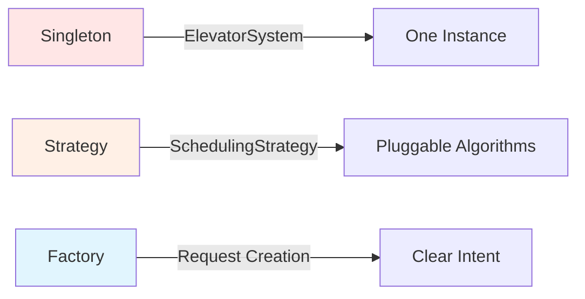

# Elevator System - Low-Level Design (LLD)

A comprehensive, beginner-friendly guide to designing an elevator system from scratch.

## 📚 Table of Contents

1. [Requirements Analysis](01-requirements.md)
2. [Use Case Diagram](02-use-case-diagram.md)
3. [Incremental Class Diagrams](03-step1-class-diagram.md) (Steps 1-5)
   - [Step 1: Core Entities](03-step1-class-diagram.md)
   - [Step 2: State Management](04-step2-class-diagram.md)
   - [Step 3: Request Handling](05-step3-class-diagram.md)
   - [Step 4: Controller Logic](06-step4-class-diagram.md)
   - [Step 5: Dispatcher & Strategy](07-step5-class-diagram.md)
4. [Final Complete Class Diagram](08-final-class-diagram.md)
5. [Relationships & SOLID Principles](09-relationships-and-solid.md)
6. [Design Patterns](10-design-patterns.md)
7. [Sequence Diagrams](11-sequence-diagrams.md)
8. [Data Model & Components](12-data-model-and-components.md)
9. [Complete Java Implementation](13-complete-java-implementation.java)
10. [Interview Q&A & Summary](14-interview-qa-and-summary.md)

---

## 🎯 What You'll Learn

### Design Principles
- ✅ **SOLID Principles** - All 5 principles explained with examples
- ✅ **Separation of Concerns** - Data vs Logic layers
- ✅ **Clean Architecture** - Layered design approach
- ✅ **Type Safety** - Using enums effectively

### Design Patterns
- ✅ **Singleton Pattern** - For ElevatorSystem
- ✅ **Strategy Pattern** - For scheduling algorithms
- ✅ **Factory Pattern** - For request creation

### UML Relationships
- ✅ **Association** - Uses relationship
- ✅ **Aggregation** - Weak ownership
- ✅ **Composition** - Strong ownership
- ✅ **Dependency** - Temporary usage
- ✅ **Inheritance** - Is-a relationship
- ✅ **Realization** - Implements interface

### Technical Skills
- ✅ **Thread Safety** - Synchronized methods
- ✅ **Concurrency** - Multi-threaded design
- ✅ **Algorithms** - SCAN (elevator algorithm)
- ✅ **Data Structures** - Queues, lists, sorting

---

## 🏗️ System Overview

### Core Components

```
┌─────────────────────────────────────────┐
│       ElevatorSystem (Singleton)        │
│  - Central coordination                 │
│  - Manages all elevators                │
└─────────────────┬───────────────────────┘
                  │
        ┌─────────┴──────────┐
        │                    │
┌───────▼─────────┐  ┌───────▼──────────┐
│  Dispatcher     │  │  Controllers     │
│  - Assigns      │  │  - Move elevator │
│    requests     │  │  - Open/close    │
│  - Uses         │  │    doors         │
│    strategy     │  │  - Process       │
└────────┬────────┘  └───────┬──────────┘
         │                   │
    ┌────▼────┐         ┌────▼────┐
    │Strategy │         │Elevator │
    │Pattern  │         │Entity   │
    └─────────┘         └─────────┘
```

### Key Features

1. **Multiple Elevators** - System manages N elevators
2. **Two Request Types**:
   - External (Hall Call): UP/DOWN buttons on floors
   - Internal (Car Call): Floor buttons inside elevator
3. **Smart Scheduling**:
   - Nearest Elevator Strategy
   - FCFS (First-Come-First-Served) Strategy
   - SCAN (Direction-aware) Strategy
4. **Efficient Movement** - SCAN algorithm processes requests optimally
5. **Thread-Safe** - Synchronized access to shared resources

---

## 🚀 Quick Start

### Running the Demo

```bash
# Compile
javac 13-complete-java-implementation.java

# Run
java ElevatorSystemDemo
```

### Expected Output

```
========================================
ELEVATOR SYSTEM INITIALIZED
========================================
Elevators: 3
Floors: 0 to 10
Strategy: SCANStrategy
========================================

=== SCENARIO 1: External Requests ===

Dispatching: Request{floor=5, dir=UP, type=EXTERNAL}
Assigned to Elevator 2
[E2] Processing: Request{floor=5, dir=UP, type=EXTERNAL}
[E2] Moving UP from 0 to 5
[E2] Now at floor 1
[E2] Now at floor 2
...
```

---

## 📖 Learning Path

### For Beginners

**Start Here**:
1. Read [Requirements Analysis](01-requirements.md) - Understand the problem
2. Read [Use Case Diagram](02-use-case-diagram.md) - See user interactions
3. Follow incremental class diagrams (Step 1 → Step 5) - Build complexity gradually
4. Read [Relationships & SOLID](09-relationships-and-solid.md) - Learn principles
5. Study [Complete Java Code](13-complete-java-implementation.java) - See it in action

**Then**:
6. Read [Design Patterns](10-design-patterns.md) - Understand patterns used
7. Read [Sequence Diagrams](11-sequence-diagrams.md) - Visualize flows
8. Practice [Interview Q&A](14-interview-qa-and-summary.md) - Prepare for interviews

### For Interview Preparation

**Focus On**:
1. [Final Complete Class Diagram](08-final-class-diagram.md) - Full system view
2. [Sequence Diagrams](11-sequence-diagrams.md) - Key flows
3. [Interview Q&A](14-interview-qa-and-summary.md) - Common questions
4. [Design Patterns](10-design-patterns.md) - Know when/why to use
5. **"What to Draw First" Checklist** in Interview Q&A

**Practice Drawing**:
- Core entities (5 min)
- Controller & dispatcher (5 min)
- Strategy pattern (3 min)
- Complete relationships (5 min)

---

## 🎨 Design Highlights

### SOLID Principles Applied

| Principle | Where | How |
|-----------|-------|-----|
| **S** - Single Responsibility | Elevator, ElevatorController | Data vs Logic separation |
| **O** - Open/Closed | SchedulingStrategy | Add strategies without modifying code |
| **L** - Liskov Substitution | All strategies | Interchangeable implementations |
| **I** - Interface Segregation | SchedulingStrategy | Single focused method |
| **D** - Dependency Inversion | ElevatorDispatcher | Depends on interface, not concrete |

### Design Patterns



---

## 🔧 Technical Details

### Algorithm: SCAN (Elevator Algorithm)

```
1. While moving UP:
   - Process all UP requests in ascending order
   - Stop at each requested floor

2. When no more UP requests:
   - Switch direction to DOWN

3. While moving DOWN:
   - Process all DOWN requests in descending order
   - Stop at each requested floor

4. When no more requests:
   - Set direction to IDLE
   - Wait for new requests
```

**Time Complexity**: O(n) where n = total requests
**Space Complexity**: O(n)

### Concurrency Model

- **Main Thread**: ElevatorSystem coordination
- **Worker Threads**: One per ElevatorController
- **Synchronization**: `synchronized` methods on Elevator class
- **Thread-Safe Collections**: Used for request queues

---

## 📊 Class Metrics

- **Total Classes**: 13
- **Total Interfaces**: 1
- **Total Enums**: 3
- **Design Patterns**: 3 (Singleton, Strategy, Factory)
- **SOLID Principles**: All 5 applied
- **Lines of Code**: ~1,500

---

## 🧪 Testing Scenarios

### Unit Tests
- ✅ Request creation (factory methods)
- ✅ Elevator request addition
- ✅ Queue sorting (UP/DOWN)
- ✅ Direction updates
- ✅ Strategy selection

### Integration Tests
- ✅ Complete journey (external → pickup → internal → dropoff)
- ✅ Multiple concurrent requests
- ✅ Strategy switching
- ✅ Edge cases (all elevators busy, invalid floors)

---

## 🚀 Extensions & Future Enhancements

### Easy to Add
1. **VIP Requests** - Add priority field
2. **Access Control** - Security levels for floors
3. **Energy Optimization** - Idle positioning
4. **Time-Based Strategies** - Rush hour handling

### Advanced Features
1. **Predictive Algorithms** - ML-based request prediction
2. **Zone-Based Scheduling** - Assign elevators to floor ranges
3. **Observer Pattern** - Real-time notifications
4. **Emergency Modes** - Fire, earthquake handling

---

## 📝 Common Interview Questions

1. **Why separate Elevator and ElevatorController?**
   - Single Responsibility Principle (data vs logic)

2. **Why use Strategy Pattern?**
   - Open/Closed Principle (add algorithms without modifying code)

3. **How do you handle concurrency?**
   - Synchronized methods, thread-safe collections

4. **What's the time complexity?**
   - addRequest: O(n log n), getNextRequest: O(1)

5. **How would you optimize for rush hour?**
   - Time-based strategy, sectoring

**[Full Q&A List →](14-interview-qa-and-summary.md)**

---

## 🎯 Key Takeaways

### For Beginners
- ✅ Start simple, add complexity incrementally
- ✅ Use enums for type safety
- ✅ Separate data from logic
- ✅ Apply SOLID principles
- ✅ Use design patterns appropriately

### For Interviews
- ✅ Clarify requirements first
- ✅ Think aloud during design
- ✅ Explain trade-offs
- ✅ Draw incrementally
- ✅ Show extensibility

### For Production
- ✅ Add persistence layer (database)
- ✅ Implement comprehensive error handling
- ✅ Add logging and monitoring
- ✅ Use dependency injection
- ✅ Write extensive tests

---

## 📚 Additional Resources

### Related LLD Problems
- Parking Lot System
- Vending Machine
- ATM System
- Library Management System
- Hotel Booking System

### Further Reading
- "Design Patterns" by Gang of Four
- "Clean Architecture" by Robert C. Martin
- "Effective Java" by Joshua Bloch

---

## 🤝 Contributing

This is a learning resource. Suggestions for improvements are welcome!

---

## 📄 License

This educational material is provided as-is for learning purposes.

---

## 📞 Contact

For questions or feedback about this LLD documentation, please open an issue in the repository.

---

**Happy Learning! 🚀**

Built with ❤️ for aspiring software engineers preparing for system design interviews.
