# Movie Ticket Booking System - Use Case Diagram

## 📋 What is a Use Case Diagram?

A **Use Case Diagram** shows:
- **Who** uses the system (actors)
- **What** they can do (use cases)
- **How** use cases relate to each other

Think of it like a menu at a restaurant showing who can order what!

---

## 🎭 Actors (Who uses the system?)

### 1. **Customer** 👤
**Who:** Regular users who want to book movie tickets

**Goals:**
- Search and browse movies
- Select shows and seats
- Book and pay for tickets
- View and cancel bookings

**Real-world example:** You using BookMyShow to book a movie ticket

---

### 2. **Admin** 👨‍💼
**Who:** Theater staff or system administrators

**Goals:**
- Manage movies, theaters, screens
- Schedule shows
- View reports and analytics
- Handle customer support issues

**Real-world example:** Theater manager adding new shows or viewing daily revenue

---

### 3. **System** 🤖
**Who:** Automated system components

**Goals:**
- Send notifications (email, SMS)
- Process payments via payment gateway
- Release blocked seats after timeout
- Generate booking confirmations

**Real-world example:** Automatic email you receive after booking confirmation

---

## 🎯 Use Case Diagram

```mermaid
graph TB
    subgraph "Movie Ticket Booking System"
        %% Customer Use Cases
        UC1[Search Movies]
        UC2[View Movie Details]
        UC3[Select Show]
        UC4[View Seat Availability]
        UC5[Select Seats]
        UC6[Make Payment]
        UC7[View Booking]
        UC8[Cancel Booking]
        UC9[Register/Login]

        %% Admin Use Cases
        UC10[Manage Movies]
        UC11[Manage Theaters]
        UC12[Manage Screens]
        UC13[Schedule Shows]
        UC14[View Reports]
        UC15[Manage Seat Layout]

        %% System Use Cases
        UC16[Send Confirmation]
        UC17[Process Payment]
        UC18[Release Blocked Seats]
        UC19[Send Notifications]
    end

    %% Actors
    Customer((Customer<br/>👤))
    Admin((Admin<br/>👨‍💼))
    System((System<br/>🤖))
    PaymentGateway((Payment<br/>Gateway<br/>💳))

    %% Customer connections
    Customer --> UC1
    Customer --> UC2
    Customer --> UC3
    Customer --> UC4
    Customer --> UC5
    Customer --> UC6
    Customer --> UC7
    Customer --> UC8
    Customer --> UC9

    %% Admin connections
    Admin --> UC10
    Admin --> UC11
    Admin --> UC12
    Admin --> UC13
    Admin --> UC14
    Admin --> UC15

    %% System connections
    System --> UC16
    System --> UC17
    System --> UC18
    System --> UC19

    %% External system
    UC17 -.->|uses| PaymentGateway

    %% Use case relationships
    UC6 -.->|includes| UC17
    UC6 -.->|triggers| UC16
    UC8 -.->|triggers| UC17
    UC5 -.->|requires| UC9
    UC6 -.->|requires| UC5

    style Customer fill:#e1f5ff,stroke:#01579b,stroke-width:3px
    style Admin fill:#fff3e0,stroke:#e65100,stroke-width:3px
    style System fill:#e8f5e9,stroke:#1b5e20,stroke-width:3px
    style PaymentGateway fill:#fce4ec,stroke:#880e4f,stroke-width:3px

    style UC1 fill:#bbdefb,stroke:#1976d2
    style UC2 fill:#bbdefb,stroke:#1976d2
    style UC3 fill:#bbdefb,stroke:#1976d2
    style UC4 fill:#bbdefb,stroke:#1976d2
    style UC5 fill:#bbdefb,stroke:#1976d2
    style UC6 fill:#c8e6c9,stroke:#388e3c
    style UC7 fill:#bbdefb,stroke:#1976d2
    style UC8 fill:#ffccbc,stroke:#d84315
    style UC9 fill:#bbdefb,stroke:#1976d2

    style UC10 fill:#ffe0b2,stroke:#f57c00
    style UC11 fill:#ffe0b2,stroke:#f57c00
    style UC12 fill:#ffe0b2,stroke:#f57c00
    style UC13 fill:#ffe0b2,stroke:#f57c00
    style UC14 fill:#ffe0b2,stroke:#f57c00
    style UC15 fill:#ffe0b2,stroke:#f57c00

    style UC16 fill:#c5e1a5,stroke:#689f38
    style UC17 fill:#c5e1a5,stroke:#689f38
    style UC18 fill:#c5e1a5,stroke:#689f38
    style UC19 fill:#c5e1a5,stroke:#689f38
```



---

## 🔍 Detailed Use Case Descriptions

### Customer Use Cases (Blue boxes)

#### UC1: Search Movies 🔎
**Description:** Customer searches for movies based on criteria

**Preconditions:**
- Customer is on the homepage (login not required)

**Main Flow:**
1. Customer enters search criteria (title, genre, language)
2. System displays matching movies
3. Customer views results

**Postconditions:**
- List of movies displayed

**Alternative Flow:**
- No movies found → Show "No results" message

---

#### UC2: View Movie Details 📄
**Description:** Customer views detailed information about a movie

**Main Flow:**
1. Customer clicks on a movie from search results
2. System displays:
   - Movie title, poster, trailer
   - Duration, genre, language, rating
   - Synopsis
   - Available theaters and show times

**Real-world example:** Clicking "Dune 2" to see synopsis and showtimes

---

#### UC3: Select Show 🎬
**Description:** Customer selects a specific show

**Main Flow:**
1. Customer views available shows for a movie
2. System displays shows grouped by:
   - Theater
   - Date
   - Time
3. Customer selects a show
4. System navigates to seat selection

---

#### UC4: View Seat Availability 💺
**Description:** Customer views seat layout and availability

**Main Flow:**
1. System displays screen layout
2. Shows seat status:
   - 🟢 Green = Available
   - 🔴 Red = Booked
   - 🟡 Yellow = Blocked (someone else selecting)
3. Real-time updates as other users book

---

#### UC5: Select Seats 🎫
**Description:** Customer selects seats for booking

**Preconditions:**
- Customer must be logged in

**Main Flow:**
1. Customer clicks on available seats
2. System blocks selected seats temporarily (10 minutes)
3. System calculates total price
4. Customer proceeds to payment

**Business Rules:**
- Maximum 10 seats per booking
- Seats must be in the same screen/show
- Blocked seats auto-released after 10 minutes

---

#### UC6: Make Payment 💳
**Description:** Customer completes payment

**Main Flow:**
1. Customer reviews booking details
2. Customer selects payment method
3. System redirects to payment gateway
4. Customer enters payment details
5. Payment gateway processes payment
6. System receives payment confirmation
7. System confirms booking
8. System sends confirmation email/SMS

**Alternative Flows:**
- Payment fails → Seats released, customer notified
- Payment timeout → Seats released after 10 minutes

**Includes:**
- UC17: Process Payment
- UC16: Send Confirmation

---

#### UC7: View Booking 📋
**Description:** Customer views their booking history

**Main Flow:**
1. Customer logs in
2. Customer navigates to "My Bookings"
3. System displays:
   - Current bookings (future shows)
   - Past bookings (history)
   - Cancelled bookings

**Details shown:**
- Booking ID, movie, theater, show time
- Seat numbers, total amount
- QR code for entry

---

#### UC8: Cancel Booking ❌
**Description:** Customer cancels a booking

**Preconditions:**
- Booking exists
- Show hasn't started yet
- Within cancellation window (2 hours before show)

**Main Flow:**
1. Customer selects booking to cancel
2. System shows cancellation policy and refund amount
3. Customer confirms cancellation
4. System processes refund
5. Seats become available again
6. System sends cancellation confirmation

---

#### UC9: Register/Login 🔐
**Description:** Customer creates account or logs in

**Registration Flow:**
1. Customer enters name, email, phone, password
2. System validates (email not already registered)
3. System creates account
4. System sends verification email

**Login Flow:**
1. Customer enters email and password
2. System validates credentials
3. System generates JWT token
4. Customer is logged in

---

### Admin Use Cases (Orange boxes)

#### UC10: Manage Movies 🎥
**Description:** Admin adds, updates, or deletes movies

**Main Flow (Add):**
1. Admin navigates to "Add Movie"
2. Admin enters movie details:
   - Title, duration, language, genre
   - Release date, rating
   - Description, poster image
3. System validates and saves movie

**Main Flow (Update):**
1. Admin searches for movie
2. Admin edits details
3. System updates movie

**Main Flow (Delete):**
1. Admin selects movie
2. System checks if movie has future shows
3. If yes, warn admin; if no, allow deletion

---

#### UC11: Manage Theaters 🏢
**Description:** Admin manages theater information

**Main Flow:**
1. Admin adds theater with:
   - Name, location, city
   - Number of screens
   - Facilities
2. System saves theater

---

#### UC12: Manage Screens 🎭
**Description:** Admin manages screens within a theater

**Main Flow:**
1. Admin selects theater
2. Admin adds screen with:
   - Screen name (Screen 1, IMAX)
   - Capacity
   - Screen type (Regular, IMAX, 3D)
3. Admin defines seat layout (rows, columns, seat types)

---

#### UC13: Schedule Shows ⏰
**Description:** Admin schedules movie shows

**Main Flow:**
1. Admin selects:
   - Movie
   - Theater and screen
   - Date and time
2. System validates:
   - No overlapping shows
   - Minimum gap between shows (15 min cleanup)
3. System creates show
4. All seats marked as available

**Business Rules:**
- Show end time = start time + movie duration + cleanup time
- Can schedule up to 30 days in advance

---

#### UC14: View Reports 📊
**Description:** Admin views analytics and reports

**Reports available:**
- Daily/weekly/monthly revenue
- Occupancy rate per show
- Most popular movies
- Theater-wise performance
- Failed bookings analysis

---

#### UC15: Manage Seat Layout 🗺️
**Description:** Admin configures seat layout for screens

**Main Flow:**
1. Admin selects screen
2. Admin defines:
   - Number of rows (A, B, C, ...)
   - Seats per row
   - Seat types (Regular, Premium, VIP)
   - Pricing for each type
3. System creates seat matrix

---

### System Use Cases (Green boxes)

#### UC16: Send Confirmation 📧
**Description:** System sends booking confirmation

**Triggers:**
- Successful payment

**Main Flow:**
1. System generates booking confirmation
2. System creates QR code
3. System sends email with:
   - Booking details
   - QR code
   - Calendar invite
4. System sends SMS with booking ID

---

#### UC17: Process Payment 💰
**Description:** System processes payment via gateway

**Main Flow:**
1. System calls payment gateway API
2. Payment gateway processes transaction
3. System receives webhook callback
4. System updates payment status
5. If success, confirm booking
6. If failed, release seats and notify customer

---

#### UC18: Release Blocked Seats ⏳
**Description:** System auto-releases seats after timeout

**Triggers:**
- Background scheduler runs every minute

**Main Flow:**
1. System finds seats blocked > 10 minutes
2. System checks if booking completed
3. If no payment, release seats
4. Update seat status to "Available"

---

#### UC19: Send Notifications 🔔
**Description:** System sends various notifications

**Notification types:**
- Booking confirmation
- Booking cancellation
- Payment failure
- Show reminder (1 hour before show)
- Promotional offers

---

## 🔗 Use Case Relationships

### 1. **<<include>>** (Required)
Shown as dotted arrow `-.->|includes|`

**Meaning:** One use case always includes another

**Examples:**
- "Make Payment" **includes** "Process Payment"
  - You cannot make payment without processing it
- "Cancel Booking" **includes** "Process Refund"

**When to use:** When one use case ALWAYS needs another

---

### 2. **<<extend>>** (Optional)
**Meaning:** One use case optionally extends another

**Examples:**
- "Search Movies" can **extend to** "Apply Filters"
  - You can search without filters, filters are optional
- "View Booking" can **extend to** "Download Ticket"

**When to use:** When additional functionality is optional

---

### 3. **<<triggers>>** (Cause-Effect)
**Meaning:** One use case triggers another automatically

**Examples:**
- "Make Payment" **triggers** "Send Confirmation"
- "Cancel Booking" **triggers** "Process Refund"

---

### 4. **<<requires>>** (Precondition)
**Meaning:** One use case requires another to be completed first

**Examples:**
- "Select Seats" **requires** "Register/Login"
  - Must be logged in to select seats
- "Make Payment" **requires** "Select Seats"
  - Must select seats before payment

---

## 📊 Use Case Priority Matrix

| Priority | Use Cases | Why Critical? |
|----------|-----------|---------------|
| **P0 (Critical)** | Search Movies, Select Show, Select Seats, Make Payment | Core booking flow - system useless without these |
| **P1 (High)** | View Booking, Cancel Booking, Register/Login, Process Payment | Important for user experience |
| **P2 (Medium)** | Send Confirmation, Release Blocked Seats, View Reports | Important but system can work without initially |
| **P3 (Low)** | Manage Seat Layout, View Movie Details | Nice to have, can be added later |

---

## 🎯 Main User Flows

### Flow 1: Customer Books a Ticket (Happy Path)

```
1. Search Movies (UC1)
   ↓
2. View Movie Details (UC2)
   ↓
3. Select Show (UC3)
   ↓
4. View Seat Availability (UC4)
   ↓
5. Register/Login (UC9) [if not logged in]
   ↓
6. Select Seats (UC5)
   ↓
7. Make Payment (UC6)
   ↓
8. System Process Payment (UC17)
   ↓
9. System Send Confirmation (UC16)
   ↓
10. View Booking (UC7)
```

**Total steps:** 10 steps
**Time estimate:** 3-5 minutes
**Success criteria:** Booking confirmed, email received

---

### Flow 2: Customer Cancels a Booking

```
1. Login (UC9)
   ↓
2. View Booking (UC7)
   ↓
3. Cancel Booking (UC8)
   ↓
4. System Process Refund (UC17)
   ↓
5. System Send Notification (UC19)
```

**Time estimate:** 1-2 minutes
**Success criteria:** Booking cancelled, refund initiated

---

### Flow 3: Admin Schedules a New Show

```
1. Admin Login
   ↓
2. Manage Movies (UC10) [if movie not exists]
   ↓
3. Manage Theaters (UC11) [if theater not exists]
   ↓
4. Schedule Shows (UC13)
   ↓
5. System creates show with all seats available
```

**Time estimate:** 2-3 minutes
**Success criteria:** Show visible to customers

---

## 🎓 Beginner Tips

### What to draw first in an interview?

1. **Draw actors first** (stick figures on left/right)
2. **Draw main use cases** (ovals in the middle)
   - Start with "Search Movies"
   - Then "Book Ticket" (can be broken down later)
3. **Connect actors to use cases** (lines)
4. **Add relationships** (include, extend) if time permits

### Common mistakes beginners make:

❌ **Mistake 1:** Making use cases too technical
- Wrong: "Execute SQL Query"
- Right: "Search Movies"

❌ **Mistake 2:** Too many use cases (overcomplicated)
- Start with 5-7 main use cases
- Can elaborate later

❌ **Mistake 3:** Confusing actors
- Wrong: "Database" as actor
- Right: Database is part of system, not an actor

❌ **Mistake 4:** Mixing use cases with functions
- Wrong: "validatePayment()" - this is a function
- Right: "Make Payment" - this is what user wants to do

✅ **Solution:** Think from user's perspective - "What does the user want to achieve?"

---

## 📝 Summary

| Element | Count | Examples |
|---------|-------|----------|
| **Actors** | 4 | Customer, Admin, System, Payment Gateway |
| **Customer Use Cases** | 9 | Search, Select, Book, Pay, View, Cancel |
| **Admin Use Cases** | 6 | Manage Movies/Theaters/Shows, View Reports |
| **System Use Cases** | 4 | Send Confirmation, Process Payment, Release Seats |
| **Total Use Cases** | 19 | Covers all functional requirements |
| **Relationships** | 8 | includes, extends, triggers, requires |

---

**Next Document:** [03_step1_class_diagram.md](./03_step1_class_diagram.md) - Building the class structure incrementally
