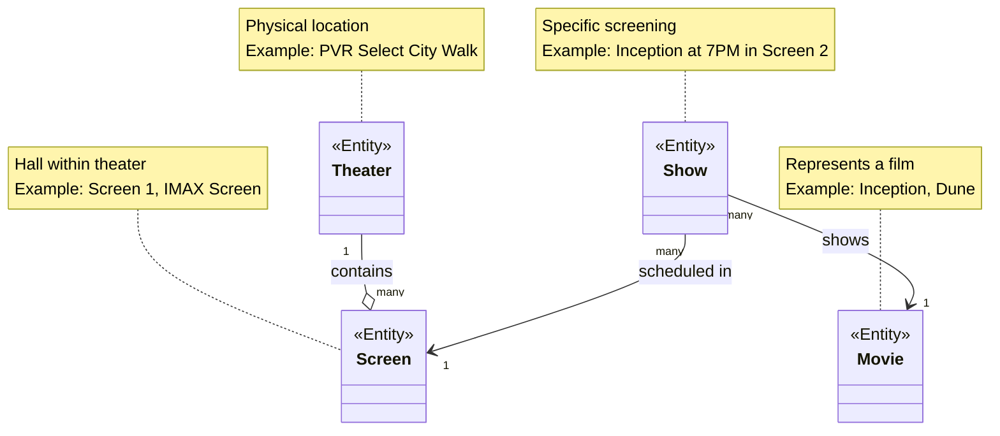

# Step 1: Core Domain Entities - Basic Structure

## 🎯 WHERE TO START?

### Why start with entities?
In any system design, we start with **NOUNS** (entities/things) before **VERBS** (actions/services).

Think of it like building a house:
- **Entities** = Bricks, windows, doors (the materials)
- **Services** = Construction workers (the ones who do the work)

We need to know what materials we have before we can build!

---

## 🧠 What are we identifying in Step 1?

From our requirements, we need to identify the **core domain entities**:

1. **Movie** - The film being shown
2. **Theater** - The physical location showing movies
3. **Screen** - Individual halls within a theater
4. **Show** - A specific screening of a movie

**Why these four first?**
- These form the foundation of our system
- Everything else (booking, seats, payments) depends on these
- In an interview, starting with these shows you understand the domain

---

## 🎨 Step 1: Class Diagram (Basic Structure)



---

## 📋 What Did We Add?

### 1. **Four Core Entities**
We identified the minimum entities needed to represent a movie booking system:
- Movie
- Theater
- Screen
- Show

### 2. **Basic Relationships (without details)**
We showed how entities relate to each other:

#### Theater "contains" Screen (Composition)
```
Theater --o Screen
```
- **Meaning:** A Theater HAS Screens
- **Real-world:** PVR Select City Walk has Screen 1, Screen 2, IMAX Screen
- **Cardinality:** One Theater can have MANY Screens
- **Lifetime:** If Theater is deleted, all its Screens are deleted too

**Java analogy:**
```java
class Theater {
    private List<Screen> screens; // Theater OWNS screens
}
```

#### Show "uses" Movie (Association)
```
Show --> Movie
```
- **Meaning:** A Show DISPLAYS a Movie
- **Real-world:** 7:00 PM show displays "Inception"
- **Cardinality:** Many Shows can show the same Movie (different times, different screens)
- **Lifetime:** If Movie is deleted, Shows might need to be cancelled

#### Show "scheduled in" Screen (Association)
```
Show --> Screen
```
- **Meaning:** A Show HAPPENS IN a Screen
- **Real-world:** "Inception 7:00 PM" happens in Screen 2
- **Cardinality:** Many Shows can be scheduled in the same Screen (at different times)

---

## 🎓 Why This Step?

### For Beginners:
**Question:** Why not add all details at once?

**Answer:** Incremental design prevents overwhelm!
- Step 1: Identify entities (what exists?)
- Step 2: Add attributes (what properties?)
- Step 3: Add methods (what actions?)
- Step 4: Add more entities (booking, payment)

Like assembling IKEA furniture - follow steps, don't jump ahead!

---

## 🔍 Understanding Relationships

### Relationship Symbols in UML

| Symbol | Name | Meaning | Example |
|--------|------|---------|---------|
| `--` | Association | One class uses another | Show uses Movie |
| `--o` | Aggregation | "Has-a" (weak ownership) | Department has Employees |
| `--*` | Composition | "Owns" (strong ownership) | Theater owns Screens |
| `--|>` | Inheritance | "Is-a" | Car is-a Vehicle |
| `..>` | Dependency | Temporary usage | Service uses Entity |

### Our Relationships Explained:

```
Theater "1" --o "many" Screen
```
- **Left side (1):** ONE Theater
- **Right side (many):** has MANY Screens
- **Symbol (--o):** Aggregation (Theater contains Screens)

**Read as:** "One Theater contains many Screens"

```
Show "many" --> "1" Movie
```
- **Left side (many):** MANY Shows
- **Right side (1):** display ONE Movie each
- **Symbol (-->):** Association

**Read as:** "Many Shows can display the same Movie"

---

## 🎯 Design Decisions

### Decision 1: Theater vs Screen
**Question:** Why separate Theater and Screen?

**Answer:**
- One Theater (building) has multiple Screens (halls)
- Each Screen can show different movies simultaneously
- PVR Select City Walk (Theater) has:
  - Screen 1 showing "Inception"
  - Screen 2 showing "Dune"
  - IMAX Screen showing "Avatar"

### Decision 2: Show as Separate Entity
**Question:** Why not combine Movie and Show?

**Answer:**
- Movie is the film itself (metadata)
- Show is a specific instance (time + location)
- Same movie can have multiple shows:
  - Inception at 3:00 PM in Screen 1
  - Inception at 7:00 PM in Screen 2
  - Inception at 10:00 PM in Screen 1

**Analogy:**
- Movie = Recipe (permanent)
- Show = Cooking the recipe at specific time (instance)

### Decision 3: Cardinality
**Question:** Why "1 to many" and "many to 1"?

**Answer:**
- **Theater → Screen:** One Theater has MANY Screens (1:M)
- **Show → Movie:** Many Shows can show the SAME Movie (M:1)
- **Show → Screen:** Many Shows happen in the SAME Screen (at different times) (M:1)

---

## 🧪 Real-World Example

Let's map our entities to a real scenario:

```
Theater: PVR Select City Walk, Delhi
├── Screen 1 (Regular, 150 seats)
│   ├── Show 1: Inception @ 3:00 PM
│   ├── Show 2: Dune @ 6:30 PM
│   └── Show 3: Inception @ 10:00 PM
├── Screen 2 (Regular, 180 seats)
│   ├── Show 1: Avatar @ 2:00 PM
│   └── Show 2: Avatar @ 7:00 PM
└── IMAX Screen (IMAX, 300 seats)
    ├── Show 1: Oppenheimer @ 4:00 PM
    └── Show 2: Oppenheimer @ 9:00 PM
```

**From this:**
- **1 Theater** (PVR Select City Walk)
- **3 Screens** (Screen 1, Screen 2, IMAX)
- **4 Movies** (Inception, Dune, Avatar, Oppenheimer)
- **7 Shows** (different times and screens)

---

## ❌ Common Beginner Mistakes

### Mistake 1: Too Many Entities at Once
```
❌ Don't start with 20 entities
✅ Start with 4-5 core entities
```
**Solution:** Add entities incrementally (next step we'll add Seat, Booking)

### Mistake 2: Adding Methods Too Early
```
❌ Step 1: Adding bookTicket(), cancelBooking() methods
✅ Step 1: Just identify entities and relationships
```
**Solution:** First structure (what exists), then behavior (what it does)

### Mistake 3: Confusing Association Types
```
❌ Using composition everywhere
✅ Choose based on lifetime dependency
```
**Solution:**
- **Composition (--*):** Part cannot exist without whole (Screen dies with Theater)
- **Association (-->):** Independent existence (Movie exists without Show)

### Mistake 4: Wrong Cardinality
```
❌ Theater "1" --- "1" Screen (wrong!)
✅ Theater "1" --o "many" Screen (correct!)
```
**Solution:** Think real-world - one theater has multiple screens, not just one!

---

## 🎯 What Should Be Added Next?

In **Step 2**, we will:
1. ✅ Add **attributes** to each entity (id, name, etc.)
2. ✅ Add **data types** for attributes
3. ✅ Show **primary keys** and **foreign keys**
4. ✅ Add basic **constructors**

In **Step 3**, we will:
- Add **Seat** entity
- Add **Booking** entity
- Add **Customer** entity

In **Step 4**, we will:
- Add **Payment** entity
- Add **methods/operations**

---

## 📊 Design Checklist (Step 1)

| Task | Status | Notes |
|------|--------|-------|
| Identify core entities | ✅ | Movie, Theater, Screen, Show |
| Define relationships | ✅ | Theater contains Screen, Show uses Movie/Screen |
| Keep it simple | ✅ | No attributes yet, no methods yet |
| Add notes to diagram | ✅ | Explain what each entity represents |
| Validate with real example | ✅ | PVR theater example |

---

## 🎓 Interview Tips

### If asked "Where do you start LLD?"

**Good Answer:**
> "I start by identifying the core domain entities - the nouns in the problem statement. For a movie booking system, these are Movie, Theater, Screen, and Show. I then establish basic relationships between them before adding details like attributes and methods. This incremental approach ensures I don't miss important entities and keeps the design organized."

### If asked "How do you decide relationships?"

**Good Answer:**
> "I think about real-world semantics. A Theater physically contains Screens - if the theater closes, screens don't exist elsewhere, so that's composition. A Show displays a Movie, but the Movie can exist independently even if all Shows are cancelled - that's association. I also consider cardinality based on business rules - one theater can have multiple screens, but each screen belongs to only one theater."

---

## 📝 Summary

| Aspect | Details |
|--------|---------|
| **Entities Added** | Movie, Theater, Screen, Show |
| **Relationships** | 3 (Theater→Screen, Show→Movie, Show→Screen) |
| **Attributes** | None yet (added in Step 2) |
| **Methods** | None yet (added later) |
| **Next Step** | Add attributes and data types |

---

**Key Takeaway:** Start simple with core entities and relationships. Build complexity incrementally!

**Next Document:** [04_step2_class_diagram.md](./04_step2_class_diagram.md) - Adding attributes and data types
