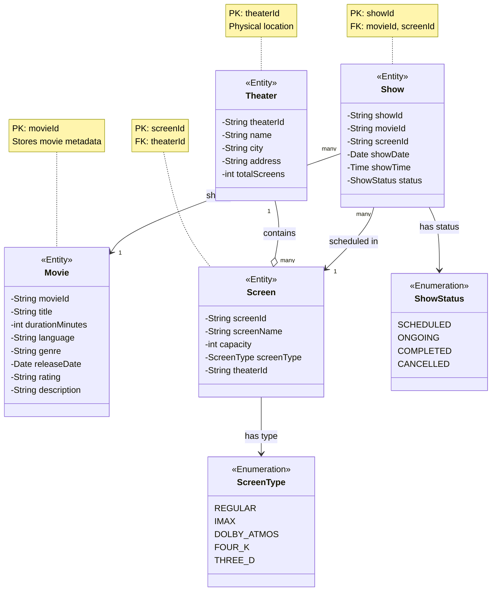

# Step 2: Adding Attributes and Data Types

## 🎯 WHAT YOU ADDED IN THIS STEP?

In Step 2, we're adding **attributes** (properties/fields) to our entities with **data types**.

**Analogy:**
- **Step 1:** We identified "Car" exists
- **Step 2:** We specify Car has color (String), model (String), year (int)

---

## 🔄 WHY YOU ADDED ATTRIBUTES?

Entities without attributes are just empty boxes! We need to store information.

**Real-world example:**
- Movie entity needs to store: title, duration, language
- Without these, we can't display movie details to users

---

## 📊 WHAT IS THE CHANGE FROM PREVIOUS STEP?

### Step 1 (Previous):
```java
class Movie { } // Empty - no data!
```

### Step 2 (Current):
```java
class Movie {
    private String movieId;      // NEW: Unique identifier
    private String title;         // NEW: Movie name
    private int duration;         // NEW: Length in minutes
    private String language;      // NEW: English, Hindi, etc.
}
```

**Key difference:** Entities now have **state** (data they hold)

---

## 🎨 Step 2: Class Diagram with Attributes



---

## 📋 Detailed Attribute Breakdown

### 1. Movie Entity

```java
public class Movie {
    // Primary Key - Uniquely identifies each movie
    private String movieId;           // Example: "MOV001", "MOV002"

    // Basic Information
    private String title;              // Example: "Inception"
    private int durationMinutes;       // Example: 148 (2 hours 28 minutes)
    private String language;           // Example: "English", "Hindi"
    private String genre;              // Example: "Sci-Fi", "Action"

    // Additional Details
    private Date releaseDate;          // Example: 2010-07-16
    private String rating;             // Example: "PG-13", "R", "U/A"
    private String description;        // Example: "A thief who steals corporate secrets..."
}
```

**Why these attributes?**
- **movieId:** Unique identifier (Primary Key) - used to reference movie in other tables
- **title:** What customers search for ("Inception")
- **durationMinutes:** Needed to calculate show end time
- **language:** Customers filter by language
- **genre:** Customers filter by genre (Action, Comedy)
- **releaseDate:** Display "Now Showing" or "Coming Soon"
- **rating:** Age restriction enforcement (don't show R-rated to kids)
- **description:** Movie synopsis for customers

**Data type choices:**
- `String movieId` instead of `int`: More flexible (can use "MOV001", "INC2024")
- `int durationMinutes` instead of `String`: Need to do math (calculate show end time)
- `Date releaseDate` instead of `String`: Can compare dates, sort by date

---

### 2. Theater Entity

```java
public class Theater {
    // Primary Key
    private String theaterId;          // Example: "THR001"

    // Basic Information
    private String name;               // Example: "PVR Select City Walk"
    private String city;               // Example: "Delhi", "Mumbai"
    private String address;            // Example: "A-3, District Centre, Saket"
    private int totalScreens;          // Example: 8 (has 8 screens)
}
```

**Why these attributes?**
- **theaterId:** Unique identifier (Primary Key)
- **name:** Display to customers ("PVR Priya", "INOX Nehru Place")
- **city:** Critical for filtering (users search "movies in Delhi")
- **address:** Show on map, give directions
- **totalScreens:** Administrative info (validation - can't add 9th screen if total is 8)

**Real-world mapping:**
```
theaterId: "THR001"
name: "PVR Select City Walk"
city: "Delhi"
address: "A-3, District Centre, Saket, New Delhi - 110017"
totalScreens: 11
```

---

### 3. Screen Entity

```java
public class Screen {
    // Primary Key
    private String screenId;           // Example: "SCR001"

    // Basic Information
    private String screenName;         // Example: "Screen 1", "IMAX Screen"
    private int capacity;              // Example: 150 (total seats)
    private ScreenType screenType;     // Example: REGULAR, IMAX, DOLBY_ATMOS

    // Foreign Key - Links to Theater
    private String theaterId;          // Example: "THR001"
}
```

**Why these attributes?**
- **screenId:** Unique identifier (Primary Key)
- **screenName:** Display to customers ("IMAX Screen", "Gold Class")
- **capacity:** Total number of seats (used for validation)
- **screenType:** Different pricing (IMAX costs more)
- **theaterId:** Foreign Key - which theater owns this screen

**Relationship:**
```
Screen.theaterId → Theater.theaterId (Foreign Key)
```
This creates the link: Screen belongs to a Theater

**Enumeration: ScreenType**
```java
public enum ScreenType {
    REGULAR,        // Standard screen
    IMAX,           // IMAX (bigger screen, better quality)
    DOLBY_ATMOS,    // Enhanced audio
    FOUR_K,         // 4K resolution
    THREE_D         // 3D movies
}
```

**Why enum instead of String?**
- ✅ Type safety: Can't accidentally set "IMACS" (typo)
- ✅ Validation: Only allowed values
- ✅ Auto-complete: IDE suggests valid options
- ✅ Refactoring: Easy to rename everywhere

---

### 4. Show Entity

```java
public class Show {
    // Primary Key
    private String showId;             // Example: "SHW001"

    // Foreign Keys - Links to Movie and Screen
    private String movieId;            // Example: "MOV001" (which movie)
    private String screenId;           // Example: "SCR001" (which screen)

    // Show Timing
    private Date showDate;             // Example: 2025-11-18
    private Time showTime;             // Example: 19:00:00 (7:00 PM)

    // Status
    private ShowStatus status;         // Example: SCHEDULED, ONGOING, COMPLETED
}
```

**Why these attributes?**
- **showId:** Unique identifier (Primary Key)
- **movieId:** Foreign Key - which movie is being shown
- **screenId:** Foreign Key - in which screen
- **showDate:** Which day (2025-11-18)
- **showTime:** What time (7:00 PM)
- **status:** Current state of show

**Relationships:**
```
Show.movieId → Movie.movieId (Foreign Key)
Show.screenId → Screen.screenId (Foreign Key)
```

**Enumeration: ShowStatus**
```java
public enum ShowStatus {
    SCHEDULED,    // Show is upcoming
    ONGOING,      // Show is currently playing
    COMPLETED,    // Show has finished
    CANCELLED     // Show was cancelled
}
```

**Why track status?**
- **SCHEDULED:** Allow bookings
- **ONGOING:** Disable bookings (show already started)
- **COMPLETED:** Show in history, no bookings
- **CANCELLED:** Refund existing bookings

---

## 🔑 Understanding Keys

### Primary Key (PK)
**Definition:** Unique identifier for each row in a table

**Examples:**
- `movieId` in Movie table
- `theaterId` in Theater table
- `screenId` in Screen table
- `showId` in Show table

**Why needed?**
- To uniquely identify each record
- To reference from other tables

**Analogy:** Like your Aadhar number or SSN - uniquely identifies YOU

---

### Foreign Key (FK)
**Definition:** A field that references the Primary Key of another table

**Examples:**
```
Screen.theaterId → Theater.theaterId
  (Screen belongs to a Theater)

Show.movieId → Movie.movieId
  (Show displays a Movie)

Show.screenId → Screen.screenId
  (Show happens in a Screen)
```

**Why needed?**
- To create relationships between tables
- To maintain referential integrity

**Analogy:** Your college ID references your university - you belong to that university

---

## 🎯 Design Decisions

### Decision 1: String IDs vs Integer IDs

**Option A: Integer IDs**
```java
private int movieId;  // 1, 2, 3, 4
```
**Pros:** Simple, auto-increment, efficient
**Cons:** Predictable, sequential, can expose business data (3000 movies = 3000 ID)

**Option B: String IDs (We chose this)**
```java
private String movieId;  // "MOV001", "INC2024"
```
**Pros:** Flexible (can use UUID, readable codes), not predictable
**Cons:** Slightly more storage

**We chose String:** More flexibility for real-world systems (can use UUIDs, readable codes)

---

### Decision 2: Duration as Minutes vs Duration as Object

**Option A: Store as minutes (We chose this)**
```java
private int durationMinutes;  // 148 minutes
```
**Pros:** Simple, easy to calculate (startTime + duration = endTime)
**Cons:** Need to convert to hours:minutes for display

**Option B: Store as String**
```java
private String duration;  // "2h 28m"
```
**Pros:** Easy to display
**Cons:** Hard to calculate, need parsing

**We chose int:** Easier for calculations (show scheduling)

---

### Decision 3: Date and Time Separation

**Our choice:**
```java
private Date showDate;    // 2025-11-18
private Time showTime;    // 19:00:00
```

**Why separate?**
- Easy to query "all shows on 2025-11-18"
- Easy to query "all 7 PM shows"
- Can combine when needed: showDate + showTime = full DateTime

**Alternative:**
```java
private DateTime showDateTime;  // 2025-11-18 19:00:00
```
**Cons:** Harder to query by just date or just time

---

### Decision 4: Enums for Fixed Values

**We used enums for:**
- `ScreenType` (REGULAR, IMAX, etc.)
- `ShowStatus` (SCHEDULED, ONGOING, etc.)

**Why?**
- Type safety (can't set invalid values)
- IDE auto-complete
- Clear documentation of allowed values

**Example of problem without enum:**
```java
// Without enum - String can be anything
screen.setType("imac");  // Typo! Should be "imax"
screen.setType("dolby");  // Is it "dolby" or "DOLBY" or "Dolby Atmos"?

// With enum - Compile error on typo
screen.setType(ScreenType.IMACS);  // ❌ Compile error!
screen.setType(ScreenType.IMAX);   // ✅ Only valid values allowed
```

---

## ❌ Common Beginner Mistakes

### Mistake 1: Too Many Attributes Too Soon
```java
❌ Adding 30 attributes to Movie entity
   (budget, director, cast, crew, distributors, etc.)

✅ Start with essential attributes only
   (movieId, title, duration, language)
```
**Solution:** Add attributes incrementally. Can always add more later!

---

### Mistake 2: Wrong Data Types
```java
❌ private String durationMinutes;  // "148"
   // Can't do: showEndTime = showStartTime + duration (String + String = ?)

✅ private int durationMinutes;     // 148
   // Can do: showEndTime = showStartTime + duration
```
**Solution:** Choose data type based on operations you'll perform

---

### Mistake 3: Not Using Enums
```java
❌ private String status;  // Can be "scheduled", "Scheduled", "SCHEDULED", "sheduled"

✅ private ShowStatus status;  // Only SCHEDULED, ONGOING, COMPLETED, CANCELLED
```
**Solution:** Use enums for fields with fixed set of values

---

### Mistake 4: Missing Primary Keys
```java
❌ class Movie {
       private String title;  // Not unique! Two movies can have same title
   }

✅ class Movie {
       private String movieId;  // ✅ Unique identifier
       private String title;
   }
```
**Solution:** Every entity needs a Primary Key (unique identifier)

---

### Mistake 5: Missing Foreign Keys
```java
❌ class Screen {
       // No link to Theater - how do we know which theater owns this screen?
   }

✅ class Screen {
       private String theaterId;  // ✅ Foreign Key linking to Theater
   }
```
**Solution:** Use Foreign Keys to establish relationships

---

## 🧪 Real-World Data Example

Let's populate our entities with real data:

### Movie Table
| movieId | title | durationMinutes | language | genre | releaseDate | rating | description |
|---------|-------|----------------|----------|-------|-------------|--------|-------------|
| MOV001 | Inception | 148 | English | Sci-Fi | 2010-07-16 | PG-13 | A thief who steals secrets... |
| MOV002 | Dune | 155 | English | Sci-Fi | 2021-10-22 | PG-13 | Feature adaptation of Frank Herbert's novel... |
| MOV003 | 3 Idiots | 170 | Hindi | Comedy | 2009-12-25 | PG | Two friends embark on a quest... |

### Theater Table
| theaterId | name | city | address | totalScreens |
|-----------|------|------|---------|--------------|
| THR001 | PVR Select City Walk | Delhi | A-3, District Centre, Saket | 11 |
| THR002 | INOX Nehru Place | Delhi | 1st Floor, Nehru Place | 6 |

### Screen Table
| screenId | screenName | capacity | screenType | theaterId |
|----------|------------|----------|------------|-----------|
| SCR001 | Screen 1 | 150 | REGULAR | THR001 |
| SCR002 | IMAX Screen | 300 | IMAX | THR001 |
| SCR003 | Screen 2 | 180 | DOLBY_ATMOS | THR001 |
| SCR004 | Screen 1 | 120 | REGULAR | THR002 |

### Show Table
| showId | movieId | screenId | showDate | showTime | status |
|--------|---------|----------|----------|----------|--------|
| SHW001 | MOV001 | SCR001 | 2025-11-18 | 15:00:00 | SCHEDULED |
| SHW002 | MOV001 | SCR001 | 2025-11-18 | 19:00:00 | SCHEDULED |
| SHW003 | MOV002 | SCR002 | 2025-11-18 | 18:00:00 | SCHEDULED |
| SHW004 | MOV003 | SCR004 | 2025-11-18 | 14:00:00 | SCHEDULED |

**Queries we can now answer:**
1. "What movies are showing?" → Query Movie table
2. "What theaters are in Delhi?" → Query Theater table WHERE city = 'Delhi'
3. "What shows are playing Inception?" → Query Show table WHERE movieId = 'MOV001'
4. "What's showing at PVR Select City Walk?" →
   - Get theaterId for "PVR Select City Walk" → THR001
   - Get all screenIds for THR001 → SCR001, SCR002, SCR003
   - Get all shows for these screenIds

---

## 📊 Design Checklist (Step 2)

| Task | Status | Notes |
|------|--------|-------|
| Add Primary Keys | ✅ | All entities have unique IDs |
| Add Foreign Keys | ✅ | Screen→Theater, Show→Movie/Screen |
| Choose appropriate data types | ✅ | int for numbers, String for text, Date/Time for temporal |
| Use enums for fixed values | ✅ | ScreenType, ShowStatus |
| Keep attributes minimal | ✅ | Only essential attributes |
| Add notes to diagram | ✅ | Explain PK, FK |

---

## 🎓 Interview Tips

### If asked "How do you choose data types?"

**Good Answer:**
> "I choose data types based on the operations I'll perform. For example, I use `int` for duration because I need to calculate show end time (startTime + duration). I use enums for fields with fixed values like status or screen type for type safety. For IDs, I prefer String over int for flexibility - can use UUIDs or readable codes like 'MOV001' instead of just '1'."

### If asked "What are Primary and Foreign Keys?"

**Good Answer:**
> "A Primary Key uniquely identifies each record - like movieId for Movie table. A Foreign Key is a field that references another table's Primary Key to create relationships. For example, Screen has theaterId as a Foreign Key referencing Theater's Primary Key, which means each screen belongs to a theater. This maintains referential integrity - you can't have a screen with theaterId 'THR999' if that theater doesn't exist."

---

## 📝 Summary

| Aspect | Details |
|--------|---------|
| **Entities** | Movie, Theater, Screen, Show (same as Step 1) |
| **New: Attributes** | Each entity now has properties with data types |
| **New: Enums** | ScreenType, ShowStatus |
| **New: Keys** | Primary Keys (IDs) and Foreign Keys (relationships) |
| **Next Step** | Add Booking, Seat, Customer entities |

---

**Key Takeaway:** Attributes define what data each entity stores. Choose data types carefully based on operations needed!

**Next Document:** [05_step3_class_diagram.md](./05_step3_class_diagram.md) - Adding Booking and Customer entities
