# Step 3: Adding Booking, Customer, and Seat Entities

## 🎯 WHAT YOU ADDED IN THIS STEP?

In Step 3, we're adding the **transactional entities** that handle the booking process:

1. **Customer** - Who books tickets
2. **Seat** - Individual seats in a screen
3. **Booking** - The actual ticket reservation

**Why these three together?**
They form the core booking workflow: Customer books Seats to create a Booking!

---

## 🔄 WHY YOU ADDED THESE?

### Previous Steps:
- **Step 1-2:** We have Movie, Theater, Screen, Show (the inventory)

### Step 3:
- **Now:** We need to handle customers buying tickets!

**Analogy:**
- **Step 1-2:** Restaurant menu (what's available)
- **Step 3:** Customer places an order (booking the food)

**Without these:** System can show movies but can't book tickets!

---

## 📊 WHAT IS THE CHANGE FROM PREVIOUS STEP?

### Step 2 → Step 3 Changes:

| Aspect | Step 2 | Step 3 |
|--------|--------|--------|
| **Entities** | 4 (Movie, Theater, Screen, Show) | 7 (+ Customer, Seat, Booking) |
| **Capability** | Can display movies and shows | Can book tickets |
| **Relationships** | 3 simple ones | 9 complex ones |
| **Business Logic** | Informational | Transactional |

---

## 🎨 Step 3: Class Diagram with Booking Entities

```mermaid
classDiagram
    %% Previous entities (from Step 2)
    class Movie {
        <<Entity>>
        -String movieId
        -String title
        -int durationMinutes
        -String language
        -String genre
        -Date releaseDate
        -String rating
    }

    class Theater {
        <<Entity>>
        -String theaterId
        -String name
        -String city
        -String address
        -int totalScreens
    }

    class Screen {
        <<Entity>>
        -String screenId
        -String screenName
        -int capacity
        -ScreenType screenType
        -String theaterId
    }

    class Show {
        <<Entity>>
        -String showId
        -String movieId
        -String screenId
        -Date showDate
        -Time showTime
        -ShowStatus status
    }

    %% NEW ENTITIES in Step 3
    class Customer {
        <<Entity>>
        -String customerId
        -String name
        -String email
        -String phoneNumber
        -String passwordHash
        -Date registrationDate
        +login() boolean
        +updateProfile() void
    }

    class Seat {
        <<Entity>>
        -String seatId
        -String screenId
        -String seatNumber
        -String rowNumber
        -SeatType seatType
        -double basePrice
    }

    class ShowSeat {
        <<Entity>>
        -String showSeatId
        -String showId
        -String seatId
        -SeatStatus status
        -Date blockedAt
        +isAvailable() boolean
        +block() void
        +release() void
    }

    class Booking {
        <<Entity>>
        -String bookingId
        -String customerId
        -String showId
        -List~String~ seatIds
        -double totalAmount
        -BookingStatus status
        -Date bookingTime
        -Date expiresAt
        +calculateTotal() double
        +confirm() void
        +cancel() void
    }

    %% Enumerations
    class SeatType {
        <<Enumeration>>
        REGULAR
        PREMIUM
        RECLINER
        VIP
        WHEELCHAIR
    }

    class SeatStatus {
        <<Enumeration>>
        AVAILABLE
        BLOCKED
        BOOKED
        NOT_AVAILABLE
    }

    class BookingStatus {
        <<Enumeration>>
        PENDING_PAYMENT
        CONFIRMED
        CANCELLED
        EXPIRED
    }

    class ShowStatus {
        <<Enumeration>>
        SCHEDULED
        ONGOING
        COMPLETED
        CANCELLED
    }

    class ScreenType {
        <<Enumeration>>
        REGULAR
        IMAX
        DOLBY_ATMOS
        FOUR_K
        THREE_D
    }

    %% Previous relationships
    Theater "1" --o "many" Screen : contains
    Show "many" --> "1" Movie : shows
    Show "many" --> "1" Screen : scheduled in

    %% NEW relationships in Step 3
    Screen "1" --* "many" Seat : has
    Customer "1" --> "many" Booking : makes
    Booking "many" --> "1" Show : for
    Booking "1" --> "many" ShowSeat : reserves
    Show "1" --> "many" ShowSeat : has availability
    ShowSeat "many" --> "1" Seat : represents

    %% Enum relationships
    Seat --> SeatType : categorized as
    ShowSeat --> SeatStatus : has status
    Booking --> BookingStatus : has status
    Show --> ShowStatus : has status
    Screen --> ScreenType : has type

    note for Customer "Represents user<br/>PK: customerId"
    note for Seat "Physical seat in screen<br/>PK: seatId, FK: screenId"
    note for ShowSeat "Seat availability per show<br/>PK: showSeatId<br/>FK: showId, seatId"
    note for Booking "Ticket reservation<br/>PK: bookingId<br/>FK: customerId, showId"

    style Customer fill:#e1f5ff,stroke:#01579b,stroke-width:3px
    style Seat fill:#fff3e0,stroke:#e65100,stroke-width:2px
    style ShowSeat fill:#c8e6c9,stroke:#388e3c,stroke-width:3px
    style Booking fill:#fce4ec,stroke:#880e4f,stroke-width:3px
```



---

## 📋 Detailed Entity Breakdown

### 1. Customer Entity (The User)

```java
public class Customer {
    // Primary Key
    private String customerId;           // Example: "CUST001", "UUID-xxx"

    // Personal Information
    private String name;                 // Example: "John Doe"
    private String email;                // Example: "john@example.com" (UNIQUE)
    private String phoneNumber;          // Example: "+91-9876543210" (UNIQUE)

    // Authentication
    private String passwordHash;         // Example: "bcrypt-hashed-password"
                                        // NEVER store plain password!

    // Metadata
    private Date registrationDate;       // Example: 2025-01-15

    // Methods (basic for now)
    public boolean login(String email, String password) {
        // Verify credentials
    }

    public void updateProfile(String name, String phone) {
        // Update user details
    }
}
```

**Why these attributes?**
- **customerId:** Unique identifier (Primary Key)
- **name:** Personalization ("Welcome, John!")
- **email:** Login credential, unique per customer, for notifications
- **phoneNumber:** SMS notifications, OTP verification, unique
- **passwordHash:** Authentication (NEVER store plain password!)
- **registrationDate:** Track when user joined

**Design decisions:**
- **Email unique:** One account per email address
- **Phone unique:** Prevent duplicate accounts
- **passwordHash:** Security best practice (use bcrypt, not plain text)

**Real-world example:**
```
customerId: "CUST001"
name: "Priya Sharma"
email: "priya.sharma@gmail.com"
phoneNumber: "+91-9876543210"
passwordHash: "$2a$10$N9qo8uLOickgx2ZMRZoMyeIjZAgcfl7p92ldGxad68LJZdL17lhWy"
registrationDate: 2025-11-15
```

---

### 2. Seat Entity (Physical Seats)

```java
public class Seat {
    // Primary Key
    private String seatId;               // Example: "SEAT001"

    // Foreign Key - which screen
    private String screenId;             // Example: "SCR001"

    // Seat Identification
    private String seatNumber;           // Example: "7" (column number)
    private String rowNumber;            // Example: "C" (row letter)
                                        // Full seat: C7

    // Seat Classification
    private SeatType seatType;           // Example: REGULAR, PREMIUM, VIP

    // Pricing
    private double basePrice;            // Example: 200.0 (₹200 for regular)
}
```

**Why these attributes?**
- **seatId:** Unique identifier (Primary Key)
- **screenId:** Foreign Key - which screen owns this seat
- **seatNumber + rowNumber:** Physical location (A1, B5, C7)
- **seatType:** Different types have different pricing
- **basePrice:** Base price for this seat type (can vary by show timing)

**Seat numbering convention:**
```
Row A:  A1  A2  A3  A4  A5  A6
Row B:  B1  B2  B3  B4  B5  B6
Row C:  C1  C2  C3  C4  C5  C6
        ^   ^
        |   |
        |   +-- seatNumber: "2"
        +------ rowNumber: "A"
```

**Enumeration: SeatType**
```java
public enum SeatType {
    REGULAR,     // Standard seats - base price
    PREMIUM,     // Better location - 1.5x price
    RECLINER,    // Reclining seats - 2x price
    VIP,         // Private boxes - 3x price
    WHEELCHAIR   // Accessible - base price
}
```

**Real-world example:**
```
Screen 1 layout (capacity: 30 seats):

         [SCREEN]

  A1  A2  A3  A4  A5     <- Row A (REGULAR seats)
  B1  B2  B3  B4  B5     <- Row B (REGULAR seats)
  C1  C2  C3  C4  C5     <- Row C (PREMIUM seats - center)
  D1  D2  D3  D4  D5     <- Row D (RECLINER seats)
  W1  W2                 <- Row W (WHEELCHAIR accessible)
```

---

### 3. ShowSeat Entity (Seat Availability per Show)

**This is a CRITICAL entity! Pay close attention!**

```java
public class ShowSeat {
    // Primary Key
    private String showSeatId;           // Example: "SS001"

    // Foreign Keys
    private String showId;               // Example: "SHW001"
    private String seatId;               // Example: "SEAT001"

    // Status tracking
    private SeatStatus status;           // Example: AVAILABLE, BLOCKED, BOOKED

    // Blocking information
    private Date blockedAt;              // Example: 2025-11-18 14:30:00
                                        // When was seat blocked?

    // Methods
    public boolean isAvailable() {
        return status == SeatStatus.AVAILABLE;
    }

    public void block() {
        status = SeatStatus.BLOCKED;
        blockedAt = new Date();
    }

    public void release() {
        status = SeatStatus.AVAILABLE;
        blockedAt = null;
    }
}
```

**Why do we need ShowSeat? Why not just Seat?**

**Problem:** Same physical seat has different status for different shows!

**Example:**
```
Seat C7 in Screen 1:
- For "Inception" 3:00 PM show → BOOKED (someone already booked)
- For "Inception" 7:00 PM show → AVAILABLE (can be booked)
- For "Dune" 6:00 PM show → BLOCKED (someone is selecting right now)
```

**Solution: ShowSeat entity**
- One `Seat` record for physical seat C7
- Multiple `ShowSeat` records (one per show) tracking status

**Real-world data:**

Seat table:
| seatId | screenId | rowNumber | seatNumber | seatType |
|--------|----------|-----------|------------|----------|
| SEAT001 | SCR001 | C | 7 | PREMIUM |

ShowSeat table:
| showSeatId | showId | seatId | status | blockedAt |
|------------|--------|---------|---------|-----------|
| SS001 | SHW001 | SEAT001 | BOOKED | null |
| SS002 | SHW002 | SEAT001 | AVAILABLE | null |
| SS003 | SHW003 | SEAT001 | BLOCKED | 2025-11-18 14:30 |

**Interpretation:**
- Seat C7 is BOOKED for Show SHW001 (3 PM Inception)
- Seat C7 is AVAILABLE for Show SHW002 (7 PM Inception)
- Seat C7 is BLOCKED for Show SHW003 (6 PM Dune) - someone selecting now

**Enumeration: SeatStatus**
```java
public enum SeatStatus {
    AVAILABLE,      // Can be selected
    BLOCKED,        // Temporarily held (during booking process)
    BOOKED,         // Confirmed booking
    NOT_AVAILABLE   // Maintenance, damaged, etc.
}
```

**Status lifecycle:**
```
AVAILABLE
    ↓
    (User clicks seat)
    ↓
BLOCKED (10 minutes)
    ↓
    (Payment success)     OR    (Timeout / Payment fail)
    ↓                           ↓
BOOKED                     AVAILABLE (released)
```

---

### 4. Booking Entity (The Reservation)

```java
public class Booking {
    // Primary Key
    private String bookingId;            // Example: "BK20251118001"

    // Foreign Keys
    private String customerId;           // Example: "CUST001"
    private String showId;               // Example: "SHW001"

    // Booked seats
    private List<String> seatIds;        // Example: ["SEAT001", "SEAT002"]
                                        // List of showSeatIds actually

    // Payment
    private double totalAmount;          // Example: 450.0 (₹450)

    // Status
    private BookingStatus status;        // Example: PENDING_PAYMENT, CONFIRMED

    // Timestamps
    private Date bookingTime;            // Example: 2025-11-18 14:35:00
    private Date expiresAt;              // Example: 2025-11-18 14:45:00
                                        // 10 minutes to complete payment

    // Methods
    public double calculateTotal() {
        // Sum of seat prices + taxes
    }

    public void confirm() {
        status = BookingStatus.CONFIRMED;
    }

    public void cancel() {
        status = BookingStatus.CANCELLED;
        // Release seats
    }
}
```

**Why these attributes?**
- **bookingId:** Unique identifier (PNR number)
- **customerId:** Who made the booking (Foreign Key)
- **showId:** Which show (Foreign Key)
- **seatIds:** Which seats (can be multiple - family booking)
- **totalAmount:** Total price to pay
- **status:** Current state of booking
- **bookingTime:** When booking was created
- **expiresAt:** When blocked seats will be released

**Enumeration: BookingStatus**
```java
public enum BookingStatus {
    PENDING_PAYMENT,  // Seats blocked, awaiting payment
    CONFIRMED,        // Payment successful, booking confirmed
    CANCELLED,        // User cancelled or admin cancelled
    EXPIRED           // Payment timeout, seats auto-released
}
```

**Booking lifecycle:**
```
User selects seats
    ↓
Create Booking (status: PENDING_PAYMENT)
    ↓
Block ShowSeats (status: BLOCKED)
    ↓
Set expiresAt = now + 10 minutes
    ↓
    (Payment success)           OR     (10 min timeout)
    ↓                                  ↓
Update status: CONFIRMED          Update status: EXPIRED
Update ShowSeats: BOOKED          Update ShowSeats: AVAILABLE
Send confirmation email           Send timeout notification
```

**Real-world example:**
```
bookingId: "BK20251118001"
customerId: "CUST001"
showId: "SHW001"
seatIds: ["SS001", "SS002", "SS003"]  // 3 seats: C7, C8, C9
totalAmount: 650.0  // ₹650 (3 premium seats × ₹200 + tax)
status: CONFIRMED
bookingTime: 2025-11-18 14:35:00
expiresAt: 2025-11-18 14:45:00
```

---

## 🔗 New Relationships Explained

### 1. Screen → Seat (Composition) **[NEW]**
```mermaid
graph LR
    Screen --* Seat
```
**Relationship:** Screen "has" Seats (composition - strong ownership)

**Cardinality:** 1 Screen → Many Seats

**Meaning:**
- Each Screen has a fixed layout of Seats
- If Screen is deleted, all its Seats are deleted
- Seats cannot exist without a Screen

**Java representation:**
```java
public class Screen {
    private String screenId;
    private List<Seat> seats;  // Screen OWNS seats

    // When screen is created, seats are created
    public Screen(String screenId, int rows, int seatsPerRow) {
        this.screenId = screenId;
        this.seats = createSeats(rows, seatsPerRow);
    }
}
```

---

### 2. Customer → Booking (Association) **[NEW]**

**Relationship:** Customer "makes" Bookings (association)

**Cardinality:** 1 Customer → Many Bookings

**Meaning:**
- One Customer can make multiple Bookings
- Customer can exist without Bookings (new user)
- Booking requires a Customer

**Java representation:**
```java
public class Customer {
    private String customerId;
    // Customer doesn't store bookings (queried from database)
}

public class Booking {
    private String customerId;  // Reference to Customer
}
```

---

### 3. Booking → Show (Association) **[NEW]**

**Relationship:** Booking "is for" a Show

**Cardinality:** Many Bookings → 1 Show

**Meaning:**
- Multiple Bookings can be for the same Show
- Each Booking is for exactly one Show

---

### 4. Show → ShowSeat (Composition) **[NEW]**

**Relationship:** Show "has" seat availability tracked by ShowSeats

**Cardinality:** 1 Show → Many ShowSeats (one per physical seat)

**Meaning:**
- When Show is created, create ShowSeat entries for all seats in the screen
- When Show is deleted, all ShowSeats for that show are deleted

**Example:**
```
Show SHW001 (Inception 7 PM in Screen 1):
- Screen 1 has 30 seats
- Create 30 ShowSeat records:
  - ShowSeat SS001: Show=SHW001, Seat=SEAT001, Status=AVAILABLE
  - ShowSeat SS002: Show=SHW001, Seat=SEAT002, Status=AVAILABLE
  - ...
  - ShowSeat SS030: Show=SHW001, Seat=SEAT030, Status=AVAILABLE
```

---

### 5. ShowSeat → Seat (Association) **[NEW]**

**Relationship:** ShowSeat "represents availability of" a Seat

**Cardinality:** Many ShowSeats → 1 Seat

**Meaning:**
- Same physical Seat has different ShowSeat entries for different Shows
- ShowSeat tracks status (AVAILABLE/BLOCKED/BOOKED) per show

---

### 6. Booking → ShowSeat (Association) **[NEW]**

**Relationship:** Booking "reserves" ShowSeats

**Cardinality:** 1 Booking → Many ShowSeats

**Meaning:**
- One Booking can reserve multiple seats (family booking)
- Each ShowSeat can have at most one Booking (no double-booking!)

---

## 🎯 Design Decisions

### Decision 1: Separate Seat and ShowSeat

**Why not just one Seat entity with status?**

**Problem with single Seat entity:**
```java
// ❌ WRONG APPROACH
public class Seat {
    private String seatId;
    private SeatStatus status;  // PROBLEM: status for which show?
}
```

**Issue:** Same seat has different status for different shows!
- Seat C7 might be BOOKED for 3 PM show
- Same Seat C7 is AVAILABLE for 7 PM show

**Solution: ShowSeat entity**
```java
// ✅ CORRECT APPROACH
public class Seat {
    private String seatId;
    private String seatNumber;  // Physical attributes only
}

public class ShowSeat {
    private String showSeatId;
    private String showId;      // Which show?
    private String seatId;      // Which physical seat?
    private SeatStatus status;  // Status for THIS show
}
```

**Benefits:**
- ✅ Track seat status per show
- ✅ Same seat can be AVAILABLE for one show, BOOKED for another
- ✅ Historical tracking (which seat was booked for which show)

---

### Decision 2: Booking Expiration

**Why have expiresAt?**

**Problem:** User selects seats but never completes payment

**Without expiration:**
```
User A selects seats C7, C8, C9 at 3:00 PM
User A goes for lunch
Seats remain BLOCKED forever
Other users can't book these seats
Show starts with empty seats!
```

**Solution: Auto-expiration**
```java
private Date expiresAt;  // Booking expires after 10 minutes

// Background job runs every minute
if (currentTime > booking.expiresAt && booking.status == PENDING_PAYMENT) {
    booking.status = EXPIRED;
    releaseSeats(booking.seatIds);
}
```

**Benefits:**
- ✅ Seats don't stay blocked forever
- ✅ Other users get a chance to book
- ✅ Maximizes revenue (no wasted seats)

---

### Decision 3: List of SeatIds in Booking

**Why List<String> seatIds instead of just one seatId?**

**Real-world scenario:**
- Family of 4 wants to watch a movie
- They need 4 seats together
- All 4 seats in ONE booking (not 4 separate bookings)

**Benefits:**
```java
private List<String> seatIds;  // ["SS001", "SS002", "SS003", "SS004"]
```
- ✅ One booking for multiple seats
- ✅ Easier cancellation (cancel entire family booking at once)
- ✅ Group discounts (if applicable)

---

## ❌ Common Beginner Mistakes

### Mistake 1: Not Separating Seat and ShowSeat
```java
❌ class Seat {
       private SeatStatus status;  // Status for which show???
   }

✅ class Seat {
       // Physical attributes only
   }

✅ class ShowSeat {
       private String showId;
       private SeatStatus status;  // Status for specific show
   }
```

---

### Mistake 2: Storing Passwords in Plain Text
```java
❌ private String password;  // "mypassword123" - DANGEROUS!

✅ private String passwordHash;  // "$2a$10$N9qo8..." - bcrypt hash
```
**Why?** If database is hacked, hackers get all passwords!

---

### Mistake 3: No Email/Phone Uniqueness
```java
❌ Allowing multiple accounts with same email

✅ Email and phone should be UNIQUE
   Database constraint: UNIQUE(email), UNIQUE(phoneNumber)
```

---

### Mistake 4: No Booking Expiration
```java
❌ Seats stay blocked forever if payment not completed

✅ Add expiresAt field
   Background job releases seats after timeout
```

---

### Mistake 5: Many-to-Many without Junction Table
```java
❌ Direct many-to-many between Booking and Seat
   (Can't track status per seat per show)

✅ ShowSeat as junction table
   Tracks which seat, which show, what status
```

---

## 📊 Complete Data Flow Example

Let's trace a complete booking:

### Initial State (Before Booking)

**Show Table:**
| showId | movieId | screenId | showDate | showTime | status |
|--------|---------|----------|----------|----------|--------|
| SHW001 | MOV001 | SCR001 | 2025-11-18 | 19:00 | SCHEDULED |

**Seat Table (Screen SCR001 has 6 seats):**
| seatId | screenId | rowNumber | seatNumber | seatType |
|--------|----------|-----------|------------|----------|
| SEAT001 | SCR001 | C | 7 | PREMIUM |
| SEAT002 | SCR001 | C | 8 | PREMIUM |
| SEAT003 | SCR001 | C | 9 | PREMIUM |

**ShowSeat Table (all available):**
| showSeatId | showId | seatId | status | blockedAt |
|------------|--------|---------|---------|-----------|
| SS001 | SHW001 | SEAT001 | AVAILABLE | null |
| SS002 | SHW001 | SEAT002 | AVAILABLE | null |
| SS003 | SHW001 | SEAT003 | AVAILABLE | null |

---

### Step 1: Customer Selects Seats (14:35:00)

**Action:** Customer CUST001 selects seats C7 and C8

**System:**
1. Create Booking record
2. Update ShowSeat status to BLOCKED
3. Set expiresAt = current time + 10 minutes

**Booking Table:**
| bookingId | customerId | showId | seatIds | totalAmount | status | bookingTime | expiresAt |
|-----------|------------|--------|---------|-------------|--------|-------------|-----------|
| BK001 | CUST001 | SHW001 | [SS001, SS002] | 400 | PENDING_PAYMENT | 14:35:00 | 14:45:00 |

**ShowSeat Table (updated):**
| showSeatId | showId | seatId | status | blockedAt |
|------------|--------|---------|---------|-----------|
| SS001 | SHW001 | SEAT001 | **BLOCKED** | 14:35:00 |
| SS002 | SHW001 | SEAT002 | **BLOCKED** | 14:35:00 |
| SS003 | SHW001 | SEAT003 | AVAILABLE | null |

---

### Step 2: Customer Completes Payment (14:38:00)

**Action:** Payment successful (₹400)

**System:**
1. Update Booking status to CONFIRMED
2. Update ShowSeat status to BOOKED
3. Send confirmation email

**Booking Table (updated):**
| bookingId | status |
|-----------|--------|
| BK001 | **CONFIRMED** |

**ShowSeat Table (updated):**
| showSeatId | status | blockedAt |
|------------|--------|-----------|
| SS001 | **BOOKED** | null |
| SS002 | **BOOKED** | null |
| SS003 | AVAILABLE | null |

---

### Step 3: Another Customer Views Show (14:39:00)

**Action:** Customer CUST002 views seat availability

**System shows:**
- Seat C7 (SEAT001): ❌ BOOKED (red)
- Seat C8 (SEAT002): ❌ BOOKED (red)
- Seat C9 (SEAT003): ✅ AVAILABLE (green)

**Customer can only select C9!**

---

## 🎓 Interview Tips

### If asked "How do you prevent double-booking?"

**Good Answer:**
> "I use a ShowSeat entity that tracks seat availability per show. When a customer selects seats, I immediately update ShowSeat status to BLOCKED with a timestamp. This is done in a database transaction with row-level locking (SELECT FOR UPDATE) to prevent race conditions. If payment isn't completed within 10 minutes, a background job releases the seats by updating status back to AVAILABLE. When payment succeeds, status becomes BOOKED permanently. This ensures no two customers can book the same seat for the same show."

### If asked "Why separate Seat and ShowSeat?"

**Good Answer:**
> "Seat represents the physical seat with permanent attributes like row number, seat type, and base price. ShowSeat represents the availability of that specific seat for a specific show. We need ShowSeat because the same physical seat can have different statuses for different shows - it might be BOOKED for the 3 PM show but AVAILABLE for the 7 PM show. This separation also allows us to track historical data - which seats were booked for which shows."

---

## 📝 Summary

| Aspect | Details |
|--------|---------|
| **New Entities** | Customer, Seat, ShowSeat, Booking |
| **Total Entities** | 8 (Movie, Theater, Screen, Show, Customer, Seat, ShowSeat, Booking) |
| **New Relationships** | 6 new associations |
| **New Enums** | SeatType, SeatStatus, BookingStatus |
| **Capability Added** | Can now handle complete booking flow |
| **Next Step** | Add Payment entity and payment processing |

---

**Key Takeaway:** ShowSeat is the critical entity that prevents double-booking by tracking seat status per show!

**Next Document:** [06_step4_class_diagram.md](./06_step4_class_diagram.md) - Adding Payment entity and processing
