# Step 4: Adding Payment Entity

## 🎯 WHAT YOU ADDED IN THIS STEP?

In Step 4, we're adding the **Payment** entity to handle all payment transactions.

**New in Step 4:**
- Payment entity
- Payment methods (Credit Card, UPI, Wallet)
- Payment status tracking
- Refund handling

---

## 🔄 WHY YOU ADDED PAYMENT?

### Previous Steps:
- **Step 3:** Customer can create bookings and select seats

### Step 4:
- **Now:** Customer needs to PAY for the booking!

**Without Payment entity:**
- No way to track if customer paid
- No refund processing for cancellations
- No payment history
- No transaction tracking

**Real-world:** Every booking needs a payment record - even if payment fails!

---

## 📊 WHAT IS THE CHANGE FROM PREVIOUS STEP?

### Step 3 → Step 4 Changes:

| Aspect | Step 3 | Step 4 |
|--------|--------|--------|
| **Payment Tracking** | ❌ None | ✅ Full payment lifecycle |
| **Refunds** | ❌ Can't process | ✅ Can process refunds |
| **Payment Methods** | ❌ Not tracked | ✅ Multiple methods supported |
| **Transaction History** | ❌ No record | ✅ Complete audit trail |
| **Payment Status** | ❌ Unknown | ✅ Tracked (Success/Failed/Refunded) |

---

## 🎨 Step 4: Class Diagram with Payment

```mermaid
classDiagram
    %% Previous entities (keeping it concise, showing key ones)
    class Movie {
        <<Entity>>
        -String movieId
        -String title
        -int durationMinutes
        -String language
    }

    class Show {
        <<Entity>>
        -String showId
        -String movieId
        -String screenId
        -Date showDate
        -Time showTime
    }

    class Customer {
        <<Entity>>
        -String customerId
        -String name
        -String email
        -String phoneNumber
    }

    class Booking {
        <<Entity>>
        -String bookingId
        -String customerId
        -String showId
        -List~String~ showSeatIds
        -double totalAmount
        -BookingStatus status
        -Date bookingTime
        -Date expiresAt
        +confirm() void
        +cancel() void
    }

    class ShowSeat {
        <<Entity>>
        -String showSeatId
        -String showId
        -String seatId
        -SeatStatus status
        -Date blockedAt
    }

    %% NEW ENTITY in Step 4
    class Payment {
        <<Entity>>
        -String paymentId
        -String bookingId
        -double amount
        -PaymentMethod method
        -PaymentStatus status
        -String transactionId
        -Date paymentTime
        -Date refundedAt
        -String refundTransactionId
        +processPayment() boolean
        +refund() boolean
        +getStatus() PaymentStatus
    }

    %% Enumerations
    class PaymentMethod {
        <<Enumeration>>
        CREDIT_CARD
        DEBIT_CARD
        UPI
        NET_BANKING
        WALLET
        CASH
    }

    class PaymentStatus {
        <<Enumeration>>
        PENDING
        PROCESSING
        SUCCESS
        FAILED
        REFUNDED
        PARTIALLY_REFUNDED
    }

    class BookingStatus {
        <<Enumeration>>
        PENDING_PAYMENT
        CONFIRMED
        CANCELLED
        EXPIRED
    }

    class SeatStatus {
        <<Enumeration>>
        AVAILABLE
        BLOCKED
        BOOKED
    }

    %% Previous relationships
    Customer "1" --> "many" Booking : makes
    Booking "many" --> "1" Show : for
    Booking "1" --> "many" ShowSeat : reserves

    %% NEW relationship in Step 4
    Booking "1" --> "1" Payment : has
    Payment --> PaymentMethod : uses
    Payment --> PaymentStatus : has status

    note for Payment "Tracks payment transaction<br/>PK: paymentId<br/>FK: bookingId<br/>1:1 with Booking"
    note for PaymentMethod "Multiple payment options<br/>Credit Card, UPI, Wallet, etc."
    note for PaymentStatus "Payment lifecycle<br/>PENDING → SUCCESS/FAILED"

    style Payment fill:#c8e6c9,stroke:#388e3c,stroke-width:3px
    style PaymentMethod fill:#fff3e0,stroke:#e65100,stroke-width:2px
    style PaymentStatus fill:#fff3e0,stroke:#e65100,stroke-width:2px
```



---

## 📋 Detailed Entity Breakdown

### Payment Entity

```java
public class Payment {
    // Primary Key
    private String paymentId;              // Example: "PAY20251118001"

    // Foreign Key - which booking
    private String bookingId;              // Example: "BK20251118001"
                                          // 1:1 relationship (one booking = one payment)

    // Payment Details
    private double amount;                 // Example: 450.0 (₹450)
    private PaymentMethod method;          // Example: UPI, CREDIT_CARD
    private PaymentStatus status;          // Example: SUCCESS, FAILED

    // Transaction Tracking
    private String transactionId;          // Example: "TXN_STRIPE_12345"
                                          // From payment gateway (Stripe, Razorpay)

    // Timestamps
    private Date paymentTime;              // Example: 2025-11-18 14:38:00
                                          // When payment was attempted

    // Refund Information
    private Date refundedAt;               // Example: 2025-11-19 10:00:00
                                          // When refund was processed (null if not refunded)

    private String refundTransactionId;    // Example: "REFUND_STRIPE_67890"
                                          // From payment gateway

    // Methods
    public boolean processPayment() {
        // Call payment gateway API
        // Update status based on response
    }

    public boolean refund() {
        // Call payment gateway refund API
        // Update status to REFUNDED
        // Set refundedAt timestamp
    }

    public PaymentStatus getStatus() {
        return this.status;
    }
}
```

---

## 🔍 Understanding Payment Attributes

### 1. **paymentId** (Primary Key)
**Purpose:** Unique identifier for each payment transaction

**Format:** "PAY" + date + sequence number
```java
"PAY20251118001"  // 1st payment on Nov 18, 2025
"PAY20251118002"  // 2nd payment on Nov 18, 2025
```

**Why needed?**
- Track individual payment transactions
- Reference in payment gateway callbacks
- Audit trail for accounting

---

### 2. **bookingId** (Foreign Key)

**Purpose:** Link payment to specific booking

**Relationship:** 1:1 (One booking has exactly one payment attempt)

**Note:** Even if payment fails, we create a Payment record!

**Example scenarios:**

**Scenario 1: Successful Payment**
```
Booking BK001 → Payment PAY001 (status: SUCCESS)
```

**Scenario 2: Failed Payment**
```
Booking BK002 → Payment PAY002 (status: FAILED)
```

**Scenario 3: Retry after failure**
```
Booking BK002 → Payment PAY002 (status: FAILED)
              → Payment PAY003 (status: SUCCESS)
```

**Why track failed payments?**
- Analytics (why payments fail?)
- Fraud detection (multiple failed attempts)
- Customer support (help user retry)

---

### 3. **amount** (double)

**Purpose:** How much was paid

**Should match:** `Booking.totalAmount`

**Why separate from Booking amount?**
- Payment amount might include processing fees
- Refund amount might be partial (cancellation charges)
- Payment gateway might charge in different currency

**Example:**
```java
Booking.totalAmount = 450.0   // ₹450 for 2 tickets
Payment.amount = 454.0        // ₹450 + ₹4 payment gateway fee
```

---

### 4. **method** (PaymentMethod enum)

**Purpose:** How customer paid

**Values:**
```java
public enum PaymentMethod {
    CREDIT_CARD,      // Visa, MasterCard, Amex
    DEBIT_CARD,       // Bank debit cards
    UPI,              // UPI (India): PhonePe, Google Pay, Paytm
    NET_BANKING,      // Direct bank transfer
    WALLET,           // Digital wallets: PayPal, Apple Pay
    CASH              // Cash on counter (rare for online booking)
}
```

**Why track method?**
- Different processing fees per method
- Analytics (which methods are popular?)
- Refund routing (refund to same method)

**Real-world distribution (India):**
- UPI: 60%
- Cards: 25%
- Wallets: 10%
- Net Banking: 5%

---

### 5. **status** (PaymentStatus enum)

**Purpose:** Current state of payment

**Values:**
```java
public enum PaymentStatus {
    PENDING,              // Payment initiated, waiting for response
    PROCESSING,           // Payment gateway is processing
    SUCCESS,              // Payment successful ✅
    FAILED,               // Payment failed ❌
    REFUNDED,             // Full refund processed
    PARTIALLY_REFUNDED    // Partial refund (cancellation charges deducted)
}
```

**Status Lifecycle:**

```
PENDING
   ↓
PROCESSING
   ↓
   ├─→ SUCCESS ─→ REFUNDED (if cancelled later)
   │              └─→ PARTIALLY_REFUNDED
   └─→ FAILED
```

**Detailed flow:**

```java
// User clicks "Pay Now"
payment.status = PENDING;

// Call payment gateway
payment.status = PROCESSING;

// Gateway response received
if (response.success) {
    payment.status = SUCCESS;
    booking.status = CONFIRMED;
} else {
    payment.status = FAILED;
    booking.status = EXPIRED;
    releaseSeats();
}

// Later, user cancels booking
if (cancellationRequested) {
    if (withinFreeCancel) {
        payment.status = REFUNDED;
        refund.amount = payment.amount;  // Full refund
    } else {
        payment.status = PARTIALLY_REFUNDED;
        refund.amount = payment.amount * 0.7;  // 70% refund, 30% charges
    }
}
```

---

### 6. **transactionId** (String)

**Purpose:** Transaction ID from payment gateway

**Why needed?**
- Reference for payment gateway support
- Reconciliation with bank statements
- Dispute resolution
- Refund processing

**Example transaction IDs:**
```
Stripe:    "txn_1J3x4K2eZvKYlo2C"
Razorpay:  "pay_IH3d0ara9bSsjQ"
PayPal:    "4RR959492F879224N"
```

**Important:** Store this from payment gateway webhook!

---

### 7. **paymentTime** (Date)

**Purpose:** When payment was completed

**Different from bookingTime:**
```
Booking.bookingTime:  2025-11-18 14:35:00  (when seats selected)
Payment.paymentTime:  2025-11-18 14:38:00  (3 minutes later, when paid)
```

**Use cases:**
- Analytics: average time to payment
- Timeout calculation: if (currentTime - paymentTime > 10 min) → expire
- Reconciliation: match with gateway timestamps

---

### 8. **refundedAt** (Date, nullable)

**Purpose:** When refund was processed

**Null by default:** Only set when refund is initiated

**Example:**
```java
// Before cancellation
refundedAt = null
status = SUCCESS

// After cancellation
refundedAt = 2025-11-19 10:00:00
status = REFUNDED
```

---

### 9. **refundTransactionId** (String, nullable)

**Purpose:** Transaction ID for refund from payment gateway

**Different from original transactionId:**
```java
transactionId = "txn_original_12345"  // Original payment
refundTransactionId = "refund_67890"  // Refund transaction
```

**Why track separately?**
- Accounting: match refund transaction in bank statement
- Support: reference for refund queries
- Reconciliation: ensure refund reached customer

---

## 🔗 Relationship: Booking ↔ Payment

### 1:1 Relationship

**Definition:** One Booking has exactly one successful Payment

**Why 1:1?**
- A booking is paid for once
- If payment fails, create new booking (or retry with new payment record)

**Database representation:**

**Booking Table:**
| bookingId | customerId | showId | totalAmount | status |
|-----------|------------|--------|-------------|--------|
| BK001 | CUST001 | SHW001 | 450.0 | CONFIRMED |

**Payment Table:**
| paymentId | bookingId | amount | method | status | transactionId |
|-----------|-----------|--------|--------|--------|---------------|
| PAY001 | BK001 | 450.0 | UPI | SUCCESS | razorpay_12345 |

**Foreign Key:** `Payment.bookingId → Booking.bookingId`

---

## 🎯 Complete Payment Flow

### Scenario 1: Successful Payment

```
Step 1: User selects seats
- Create Booking (status: PENDING_PAYMENT)
- Block ShowSeats (status: BLOCKED)

Step 2: User clicks "Pay Now"
- Create Payment record (status: PENDING)
- Redirect to payment gateway

Step 3: Payment gateway processes
- Update Payment (status: PROCESSING)

Step 4: Payment gateway callback (webhook)
- Payment gateway sends: { status: "success", transactionId: "xyz123" }
- Update Payment:
  * status: SUCCESS
  * transactionId: "xyz123"
  * paymentTime: now()
- Update Booking:
  * status: CONFIRMED
- Update ShowSeats:
  * status: BOOKED
- Send confirmation email

Result:
✅ Booking confirmed
✅ Seats booked
✅ Payment recorded
✅ Email sent
```

---

### Scenario 2: Failed Payment

```
Step 1: User selects seats
- Create Booking (status: PENDING_PAYMENT)
- Block ShowSeats (status: BLOCKED)

Step 2: User clicks "Pay Now"
- Create Payment record (status: PENDING)
- Redirect to payment gateway

Step 3: Payment fails (insufficient funds)
- Payment gateway sends: { status: "failed", reason: "insufficient_funds" }
- Update Payment:
  * status: FAILED
  * paymentTime: now()
- Update Booking:
  * status: EXPIRED
- Update ShowSeats:
  * status: AVAILABLE (release seats!)
- Show error message to user

Result:
❌ Booking expired
✅ Seats released (others can book)
✅ Payment failure recorded
✅ User can retry
```

---

### Scenario 3: Booking Cancellation with Refund

```
Initial State:
- Booking BK001: CONFIRMED
- Payment PAY001: SUCCESS (amount: 450)
- ShowSeats: BOOKED

Step 1: User clicks "Cancel Booking"
- Check cancellation policy:
  * > 24 hours before show → Full refund
  * 2-24 hours before show → 50% refund
  * < 2 hours before show → No refund

Step 2: Process refund (assume full refund)
- Call payment gateway refund API
- Payment gateway returns: { refundId: "refund_789" }

Step 3: Update records
- Update Payment:
  * status: REFUNDED
  * refundedAt: now()
  * refundTransactionId: "refund_789"
- Update Booking:
  * status: CANCELLED
- Update ShowSeats:
  * status: AVAILABLE (seats released!)
- Send cancellation confirmation email

Result:
✅ Booking cancelled
✅ Refund processed
✅ Seats available for others
✅ Email sent
```

---

## 🎯 Design Decisions

### Decision 1: 1:1 vs 1:Many for Booking-Payment

**Option A: 1:Many (One booking, multiple payment attempts)**
```java
class Booking {
    private List<Payment> payments;  // Multiple attempts
}
```
**Pros:** Track all retry attempts
**Cons:** Complex to manage, which payment is the successful one?

**Option B: 1:1 (We chose this)**
```java
class Booking {
    // No direct reference (query via bookingId)
}

class Payment {
    private String bookingId;  // One payment per booking
}
```
**Pros:** Simple, clear relationship
**Cons:** Failed payments create orphan Payment records

**We chose 1:1:** Simpler design, can still track failed attempts by querying all payments for a booking

---

### Decision 2: Store Payment Method

**Why store method?**
1. **Refund routing:** Refund to same method used for payment
2. **Analytics:** Which payment methods are popular?
3. **Fees:** Different methods have different fees
4. **Customer preference:** Pre-select last used method next time

**Example analytics:**
```sql
SELECT method, COUNT(*) as count, SUM(amount) as revenue
FROM Payment
WHERE status = 'SUCCESS'
GROUP BY method;

-- Results:
-- UPI: 5000 transactions, ₹22,50,000 revenue
-- CARD: 2000 transactions, ₹15,00,000 revenue
```

---

### Decision 3: Track Both paymentTime and refundedAt

**Why separate timestamps?**

**Use cases:**
1. **Refund processing time:** `refundedAt - paymentTime` = how long customer waited for refund
2. **Revenue reporting:** Count revenue by paymentTime, not by refundedAt
3. **Gateway reconciliation:** Match paymentTime with gateway logs

---

### Decision 4: Enum for PaymentStatus

**Why enum instead of boolean isPaid?**

**Problem with boolean:**
```java
❌ private boolean isPaid;  // true or false
   // Can't differentiate between: PENDING, PROCESSING, FAILED
   // Can't track REFUNDED state
```

**Solution with enum:**
```java
✅ private PaymentStatus status;  // PENDING, PROCESSING, SUCCESS, FAILED, REFUNDED
   // Clear state machine
   // Easy to add new states (PARTIALLY_REFUNDED)
```

---

## ❌ Common Beginner Mistakes

### Mistake 1: Not Recording Failed Payments
```java
❌ Only create Payment record when payment succeeds

✅ Create Payment record for EVERY attempt (success or failure)
   // Useful for fraud detection, analytics, debugging
```

---

### Mistake 2: Storing Credit Card Details
```java
❌ class Payment {
       private String cardNumber;      // ❌❌❌ NEVER DO THIS!
       private String cvv;             // ❌❌❌ SECURITY RISK!
   }

✅ class Payment {
       private String transactionId;   // Reference from payment gateway
       private PaymentMethod method;   // Just "CREDIT_CARD", not card details
   }
```

**Why?**
- **PCI DSS compliance:** Storing card details requires expensive certification
- **Security risk:** If database is hacked, card details leaked
- **Legal issues:** Violates payment regulations

**Solution:** Use payment gateways (Stripe, Razorpay) that handle card storage securely

---

### Mistake 3: No Idempotency
```java
❌ User clicks "Pay" multiple times → Multiple payments!

✅ Use idempotency key:
   payment.idempotencyKey = bookingId;
   // Payment gateway ignores duplicate requests with same key
```

---

### Mistake 4: No Transaction IDs
```java
❌ class Payment {
       // No transactionId field
   }
   // Can't reconcile with payment gateway!
   // Can't process refunds!

✅ private String transactionId;  // From payment gateway
```

---

### Mistake 5: Synchronous Payment Processing
```java
❌ // Wait for payment gateway response (might take 10 seconds)
   PaymentResponse response = paymentGateway.charge(amount);
   // User waits... browser times out...

✅ // Async processing with webhooks
   1. Redirect user to payment gateway
   2. User completes payment
   3. Payment gateway calls our webhook
   4. We update Payment and Booking
   5. We send confirmation email
```

---

## 🧪 Real-World Data Example

### Payment Table

| paymentId | bookingId | amount | method | status | transactionId | paymentTime | refundedAt | refundTransactionId |
|-----------|-----------|--------|--------|--------|---------------|-------------|------------|---------------------|
| PAY001 | BK001 | 450.0 | UPI | SUCCESS | razorpay_abc123 | 2025-11-18 14:38 | null | null |
| PAY002 | BK002 | 600.0 | CREDIT_CARD | FAILED | null | 2025-11-18 15:20 | null | null |
| PAY003 | BK003 | 300.0 | UPI | SUCCESS | razorpay_def456 | 2025-11-18 16:05 | 2025-11-19 10:00 | refund_ghi789 |

**Interpretations:**
- **PAY001:** Successful UPI payment, not refunded
- **PAY002:** Failed credit card payment (insufficient funds?)
- **PAY003:** Successful UPI payment, later refunded (booking cancelled)

---

## 🎓 Interview Tips

### If asked "How do you handle payment processing?"

**Good Answer:**
> "I use an async webhook-based approach. When a user initiates payment, I create a Payment record with status PENDING and redirect them to a payment gateway like Stripe or Razorpay. The payment gateway processes the payment and sends a webhook to our backend with the result. I verify the webhook signature for security, then update the Payment status to SUCCESS or FAILED. If successful, I update the Booking to CONFIRMED and the ShowSeats to BOOKED, then send a confirmation email. This async approach prevents browser timeouts and handles payment gateway delays gracefully."

### If asked "How do you handle refunds?"

**Good Answer:**
> "When a user cancels a booking, I first check the cancellation policy based on time remaining until the show. If eligible for refund, I call the payment gateway's refund API with the original transactionId. The gateway returns a refundTransactionId which I store in the Payment record. I update the Payment status to REFUNDED or PARTIALLY_REFUNDED based on the policy, set the refundedAt timestamp, and release the ShowSeats back to AVAILABLE status so others can book them. I then send a cancellation confirmation email with refund details."

### If asked "Why not store credit card details?"

**Good Answer:**
> "Storing credit card details requires PCI DSS Level 1 compliance, which is extremely expensive and complex to maintain. It also creates a massive security liability - if our database is compromised, we'd leak customer payment information and face legal consequences. Instead, I use payment gateways like Stripe or Razorpay which are PCI compliant. They handle the sensitive card data, and we only store their transaction reference IDs. This approach is more secure, cheaper, and still allows us to process payments and refunds effectively."

---

## 📝 Summary

| Aspect | Details |
|--------|---------|
| **New Entity** | Payment |
| **Total Entities** | 9 (Movie, Theater, Screen, Show, Customer, Seat, ShowSeat, Booking, Payment) |
| **New Enums** | PaymentMethod, PaymentStatus |
| **New Relationship** | Booking 1:1 Payment |
| **Capability Added** | Complete payment lifecycle, refund processing |
| **Next Step** | Add Service layer to handle business logic |

---

**Key Takeaways:**
1. **Always record payment attempts** - even failures are valuable data
2. **Never store card details** - use payment gateways (PCI DSS compliance)
3. **Use enums for status** - clear state machine, type-safe
4. **Track transaction IDs** - essential for refunds and reconciliation
5. **Async webhooks** - don't make users wait for payment processing

**Next Document:** [07_step5_class_diagram.md](./07_step5_class_diagram.md) - Adding Service Layer for business logic
