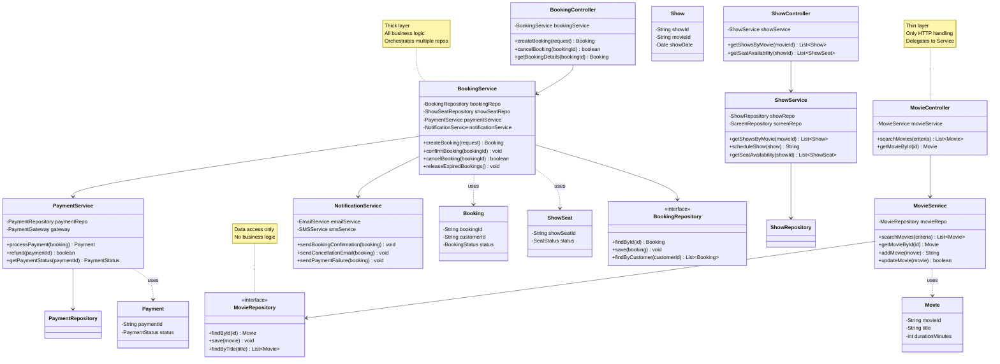

# Step 5: Service Layer - Business Logic

## 🎯 WHAT YOU ADDED IN THIS STEP?

In Step 5, we're adding the **Service Layer** - the brain of our application!

**New in Step 5:**
- Service classes for business logic
- Orchestration between entities
- Separation of concerns (Controller → Service → Repository)

---

## 🔄 WHY YOU ADDED SERVICE LAYER?

### Without Service Layer (❌ Bad Design):
```java
// Controller doing everything - BAD!
@RestController
public class BookingController {
    @PostMapping("/book")
    public Booking createBooking() {
        // Check seat availability - business logic in controller!
        // Block seats - business logic!
        // Calculate price - business logic!
        // Save to database - data access in controller!
        // Send email - notification in controller!
        // Everything mixed together - MESS!
    }
}
```

### With Service Layer (✅ Good Design):
```java
// Controller - thin layer, just HTTP handling
@RestController
public class BookingController {
    private BookingService bookingService;

    @PostMapping("/book")
    public Booking createBooking(@RequestBody BookingRequest request) {
        return bookingService.createBooking(request);  // Delegate to service!
    }
}

// Service - all business logic here
@Service
public class BookingService {
    public Booking createBooking(BookingRequest request) {
        // Check seat availability
        // Block seats
        // Calculate price
        // Save to database
        // Send notification
        // All business logic centralized!
    }
}
```

**Benefits:**
- ✅ **Single Responsibility:** Controller handles HTTP, Service handles business logic
- ✅ **Testable:** Can test business logic without HTTP layer
- ✅ **Reusable:** Other controllers/APIs can use same service
- ✅ **Maintainable:** Changes to business logic don't affect HTTP layer

---

## 🎨 Step 5: Architecture with Service Layer



---

## 📋 Service Classes Breakdown

### 1. MovieService

**Responsibility:** Manage movie-related operations

```java
@Service
public class MovieService {
    private final MovieRepository movieRepository;

    // Constructor injection (Dependency Injection)
    public MovieService(MovieRepository movieRepository) {
        this.movieRepository = movieRepository;
    }

    /**
     * Search movies by criteria
     * Example: Search by title="Inception", language="English"
     */
    public List<Movie> searchMovies(SearchCriteria criteria) {
        // Business logic: validate criteria
        if (criteria == null || criteria.isEmpty()) {
            throw new IllegalArgumentException("Search criteria cannot be empty");
        }

        // Delegate to repository
        return movieRepository.findByCriteria(criteria);
    }

    /**
     * Get movie by ID
     */
    public Movie getMovieById(String movieId) {
        return movieRepository.findById(movieId)
            .orElseThrow(() -> new MovieNotFoundException(movieId));
    }

    /**
     * Add new movie (Admin operation)
     */
    public String addMovie(Movie movie) {
        // Business validation
        validateMovie(movie);

        // Check if movie already exists
        if (movieRepository.existsByTitle(movie.getTitle())) {
            throw new DuplicateMovieException(movie.getTitle());
        }

        // Save and return ID
        return movieRepository.save(movie);
    }

    private void validateMovie(Movie movie) {
        if (movie.getTitle() == null || movie.getTitle().trim().isEmpty()) {
            throw new ValidationException("Movie title is required");
        }
        if (movie.getDurationMinutes() <= 0) {
            throw new ValidationException("Movie duration must be positive");
        }
    }
}
```

**Key Points:**
- ✅ **Single Responsibility:** Only movie-related logic
- ✅ **Validation:** Business rules (duration > 0, title not empty)
- ✅ **Error Handling:** Throws domain exceptions (MovieNotFoundException)
- ✅ **Dependency Injection:** Uses repository interface (testable)

---

### 2. ShowService

**Responsibility:** Manage shows and seat availability

```java
@Service
public class ShowService {
    private final ShowRepository showRepository;
    private final ScreenRepository screenRepository;
    private final ShowSeatRepository showSeatRepository;

    public ShowService(ShowRepository showRepository,
                       ScreenRepository screenRepository,
                       ShowSeatRepository showSeatRepository) {
        this.showRepository = showRepository;
        this.screenRepository = screenRepository;
        this.showSeatRepository = showSeatRepository;
    }

    /**
     * Get all shows for a movie
     */
    public List<Show> getShowsByMovie(String movieId, String city, Date date) {
        return showRepository.findByMovieAndCityAndDate(movieId, city, date);
    }

    /**
     * Schedule a new show (Admin operation)
     */
    public String scheduleShow(Show show) {
        // Validate show timing
        validateShowTiming(show);

        // Check for overlapping shows in same screen
        List<Show> overlappingShows = showRepository.findOverlapping(
            show.getScreenId(), show.getShowDate(), show.getShowTime()
        );

        if (!overlappingShows.isEmpty()) {
            throw new ShowOverlapException("Show overlaps with existing show");
        }

        // Save show
        String showId = showRepository.save(show);

        // Initialize seat availability for this show
        initializeShowSeats(showId, show.getScreenId());

        return showId;
    }

    /**
     * Get seat availability for a show
     */
    public List<ShowSeat> getSeatAvailability(String showId) {
        return showSeatRepository.findByShowId(showId);
    }

    /**
     * Initialize ShowSeat entries when show is created
     */
    private void initializeShowSeats(String showId, String screenId) {
        // Get all seats for the screen
        List<Seat> seats = screenRepository.getSeats(screenId);

        // Create ShowSeat entry for each seat (all AVAILABLE initially)
        for (Seat seat : seats) {
            ShowSeat showSeat = new ShowSeat();
            showSeat.setShowId(showId);
            showSeat.setSeatId(seat.getSeatId());
            showSeat.setStatus(SeatStatus.AVAILABLE);

            showSeatRepository.save(showSeat);
        }
    }

    private void validateShowTiming(Show show) {
        // Show time should be in future
        if (show.getShowDate().before(new Date())) {
            throw new ValidationException("Cannot schedule show in the past");
        }
    }
}
```

**Key Points:**
- ✅ **Orchestration:** Coordinates multiple repositories (Show, Screen, ShowSeat)
- ✅ **Business Rule:** Check for overlapping shows
- ✅ **Initialization:** Auto-create ShowSeat entries when show is scheduled
- ✅ **Validation:** Show timing must be in future

---

### 3. BookingService (Most Important!)

**Responsibility:** Handle complete booking lifecycle

```java
@Service
@Transactional  // Important: All or nothing!
public class BookingService {
    private final BookingRepository bookingRepository;
    private final ShowSeatRepository showSeatRepository;
    private final PaymentService paymentService;
    private final NotificationService notificationService;

    public BookingService(BookingRepository bookingRepository,
                          ShowSeatRepository showSeatRepository,
                          PaymentService paymentService,
                          NotificationService notificationService) {
        this.bookingRepository = bookingRepository;
        this.showSeatRepository = showSeatRepository;
        this.paymentService = paymentService;
        this.notificationService = notificationService;
    }

    /**
     * Create new booking (Step 1: Select seats)
     */
    public Booking createBooking(BookingRequest request) {
        // 1. Validate request
        validateBookingRequest(request);

        // 2. Check seat availability and block seats
        List<ShowSeat> seats = blockSeats(request.getShowId(), request.getSeatIds());

        // 3. Calculate total amount
        double totalAmount = calculateTotal(seats);

        // 4. Create booking
        Booking booking = new Booking();
        booking.setCustomerId(request.getCustomerId());
        booking.setShowId(request.getShowId());
        booking.setSeatIds(request.getSeatIds());
        booking.setTotalAmount(totalAmount);
        booking.setStatus(BookingStatus.PENDING_PAYMENT);
        booking.setBookingTime(new Date());
        booking.setExpiresAt(calculateExpiryTime());  // 10 minutes from now

        // 5. Save booking
        String bookingId = bookingRepository.save(booking);
        booking.setBookingId(bookingId);

        return booking;
    }

    /**
     * Confirm booking after successful payment (Step 2: Payment success)
     */
    public void confirmBooking(String bookingId, Payment payment) {
        // 1. Get booking
        Booking booking = bookingRepository.findById(bookingId)
            .orElseThrow(() -> new BookingNotFoundException(bookingId));

        // 2. Verify payment is successful
        if (payment.getStatus() != PaymentStatus.SUCCESS) {
            throw new PaymentNotSuccessfulException();
        }

        // 3. Update booking status
        booking.setStatus(BookingStatus.CONFIRMED);
        bookingRepository.update(booking);

        // 4. Update ShowSeats to BOOKED
        for (String seatId : booking.getSeatIds()) {
            ShowSeat showSeat = showSeatRepository.findById(seatId)
                .orElseThrow();
            showSeat.setStatus(SeatStatus.BOOKED);
            showSeat.setBlockedAt(null);  // No longer blocked
            showSeatRepository.update(showSeat);
        }

        // 5. Send confirmation email
        notificationService.sendBookingConfirmation(booking);
    }

    /**
     * Cancel booking and process refund
     */
    public boolean cancelBooking(String bookingId) {
        // 1. Get booking
        Booking booking = bookingRepository.findById(bookingId)
            .orElseThrow(() -> new BookingNotFoundException(bookingId));

        // 2. Check if cancellation is allowed
        if (booking.getStatus() != BookingStatus.CONFIRMED) {
            throw new InvalidBookingStateException("Only confirmed bookings can be cancelled");
        }

        // 3. Check cancellation policy (2 hours before show)
        Show show = showRepository.findById(booking.getShowId()).orElseThrow();
        if (!isCancellationAllowed(show)) {
            throw new CancellationNotAllowedException("Cannot cancel within 2 hours of show");
        }

        // 4. Process refund
        Payment payment = paymentService.findByBookingId(bookingId);
        boolean refundSuccess = paymentService.refund(payment.getPaymentId());

        if (!refundSuccess) {
            throw new RefundFailedException();
        }

        // 5. Update booking status
        booking.setStatus(BookingStatus.CANCELLED);
        bookingRepository.update(booking);

        // 6. Release seats (make available again)
        releaseSeats(booking.getSeatIds());

        // 7. Send cancellation email
        notificationService.sendCancellationEmail(booking);

        return true;
    }

    /**
     * Release expired bookings (Background job - runs every minute)
     */
    @Scheduled(cron = "0 * * * * *")  // Every minute
    public void releaseExpiredBookings() {
        Date now = new Date();

        // Find all bookings that expired
        List<Booking> expiredBookings = bookingRepository.findExpiredBookings(now);

        for (Booking booking : expiredBookings) {
            // Update booking status
            booking.setStatus(BookingStatus.EXPIRED);
            bookingRepository.update(booking);

            // Release seats
            releaseSeats(booking.getSeatIds());

            // Optional: Notify customer
            notificationService.sendPaymentFailure(booking);
        }
    }

    /**
     * Block seats atomically (with locking to prevent double-booking)
     */
    private List<ShowSeat> blockSeats(String showId, List<String> seatIds) {
        List<ShowSeat> blockedSeats = new ArrayList<>();

        for (String seatId : seatIds) {
            // Lock seat row (pessimistic locking)
            ShowSeat showSeat = showSeatRepository.findByIdWithLock(seatId);

            // Check if available
            if (showSeat.getStatus() != SeatStatus.AVAILABLE) {
                throw new SeatNotAvailableException(seatId);
            }

            // Block seat
            showSeat.setStatus(SeatStatus.BLOCKED);
            showSeat.setBlockedAt(new Date());
            showSeatRepository.update(showSeat);

            blockedSeats.add(showSeat);
        }

        return blockedSeats;
    }

    /**
     * Release seats (make available)
     */
    private void releaseSeats(List<String> seatIds) {
        for (String seatId : seatIds) {
            ShowSeat showSeat = showSeatRepository.findById(seatId).orElseThrow();
            showSeat.setStatus(SeatStatus.AVAILABLE);
            showSeat.setBlockedAt(null);
            showSeatRepository.update(showSeat);
        }
    }

    /**
     * Calculate total amount
     */
    private double calculateTotal(List<ShowSeat> seats) {
        double total = 0.0;
        for (ShowSeat showSeat : seats) {
            Seat seat = seatRepository.findById(showSeat.getSeatId()).orElseThrow();
            total += seat.getBasePrice();
        }

        // Add taxes (18% GST in India)
        double tax = total * 0.18;
        return total + tax;
    }

    private Date calculateExpiryTime() {
        Calendar cal = Calendar.getInstance();
        cal.add(Calendar.MINUTE, 10);  // Expires in 10 minutes
        return cal.getTime();
    }

    private boolean isCancellationAllowed(Show show) {
        // Calculate hours until show
        long diff = show.getShowDateTime().getTime() - new Date().getTime();
        long hoursUntilShow = diff / (60 * 60 * 1000);

        return hoursUntilShow >= 2;  // At least 2 hours before show
    }

    private void validateBookingRequest(BookingRequest request) {
        if (request.getSeatIds() == null || request.getSeatIds().isEmpty()) {
            throw new ValidationException("No seats selected");
        }
        if (request.getSeatIds().size() > 10) {
            throw new ValidationException("Maximum 10 seats per booking");
        }
    }
}
```

**Key Points:**
- ✅ **@Transactional:** Ensures atomicity (all or nothing)
- ✅ **Orchestration:** Uses multiple services (Payment, Notification)
- ✅ **Locking:** Prevents double-booking with `findByIdWithLock`
- ✅ **Business Rules:** Cancellation policy, seat limit, expiry
- ✅ **Scheduled Job:** Auto-release expired bookings

---

### 4. PaymentService

```java
@Service
public class PaymentService {
    private final PaymentRepository paymentRepository;
    private final PaymentGateway paymentGateway;  // External service (Stripe, Razorpay)

    /**
     * Process payment via payment gateway
     */
    public Payment processPayment(Booking booking) {
        // 1. Create payment record
        Payment payment = new Payment();
        payment.setBookingId(booking.getBookingId());
        payment.setAmount(booking.getTotalAmount());
        payment.setStatus(PaymentStatus.PENDING);

        String paymentId = paymentRepository.save(payment);
        payment.setPaymentId(paymentId);

        // 2. Call payment gateway
        try {
            PaymentGatewayResponse response = paymentGateway.charge(
                booking.getTotalAmount(),
                booking.getCustomerId()
            );

            // 3. Update payment based on response
            if (response.isSuccess()) {
                payment.setStatus(PaymentStatus.SUCCESS);
                payment.setTransactionId(response.getTransactionId());
                payment.setPaymentTime(new Date());
            } else {
                payment.setStatus(PaymentStatus.FAILED);
            }

        } catch (PaymentGatewayException e) {
            payment.setStatus(PaymentStatus.FAILED);
        }

        // 4. Save updated payment
        paymentRepository.update(payment);

        return payment;
    }

    /**
     * Process refund
     */
    public boolean refund(String paymentId) {
        Payment payment = paymentRepository.findById(paymentId)
            .orElseThrow(() -> new PaymentNotFoundException(paymentId));

        if (payment.getStatus() != PaymentStatus.SUCCESS) {
            throw new InvalidPaymentStateException("Can only refund successful payments");
        }

        // Call payment gateway refund API
        try {
            RefundResponse response = paymentGateway.refund(
                payment.getTransactionId(),
                payment.getAmount()
            );

            if (response.isSuccess()) {
                payment.setStatus(PaymentStatus.REFUNDED);
                payment.setRefundedAt(new Date());
                payment.setRefundTransactionId(response.getRefundId());
                paymentRepository.update(payment);
                return true;
            }
        } catch (PaymentGatewayException e) {
            // Log error
            return false;
        }

        return false;
    }
}
```

---

### 5. NotificationService

```java
@Service
public class NotificationService {
    private final EmailService emailService;
    private final SMSService smsService;

    /**
     * Send booking confirmation
     */
    public void sendBookingConfirmation(Booking booking) {
        Customer customer = customerRepository.findById(booking.getCustomerId()).orElseThrow();
        Show show = showRepository.findById(booking.getShowId()).orElseThrow();
        Movie movie = movieRepository.findById(show.getMovieId()).orElseThrow();

        // Email
        String emailBody = buildConfirmationEmail(booking, customer, show, movie);
        emailService.send(customer.getEmail(), "Booking Confirmed", emailBody);

        // SMS
        String smsBody = String.format("Booking %s confirmed for %s. Total: ₹%.2f",
            booking.getBookingId(), movie.getTitle(), booking.getTotalAmount());
        smsService.send(customer.getPhoneNumber(), smsBody);
    }
}
```

---

## 🎯 Design Decisions

### Decision 1: Service Layer Pattern

**Why separate Service from Controller?**

**Benefits:**
1. **Testability:** Test business logic without HTTP layer
2. **Reusability:** Multiple controllers can use same service
3. **Single Responsibility:** Controller=HTTP, Service=Business Logic
4. **Maintainability:** Changes to logic don't affect HTTP layer

---

### Decision 2: @Transactional on BookingService

**Why transactional?**

**Example scenario:**
```java
createBooking() {
    blockSeats();         // Step 1: Block seats (SUCCESS)
    createBooking();      // Step 2: Save booking (SUCCESS)
    processPayment();     // Step 3: Process payment (FAILED!)
}
```

**Without @Transactional:**
- Seats stay blocked ❌
- Booking saved in DB ❌
- Payment failed ❌
- System in inconsistent state!

**With @Transactional:**
- Payment fails → Rollback entire transaction
- Seats unblocked ✅
- Booking not saved ✅
- System consistent!

---

## 📝 Summary

| Aspect | Details |
|--------|---------|
| **Services Added** | Movie, Show, Booking, Payment, Notification |
| **Pattern** | Service Layer Pattern |
| **Benefits** | Testable, Reusable, Maintainable, SOLID |
| **Next Step** | Add Repository layer for data access |

**Next Document:** [08_step6_repository_layer.md](./08_step6_repository_layer.md)
