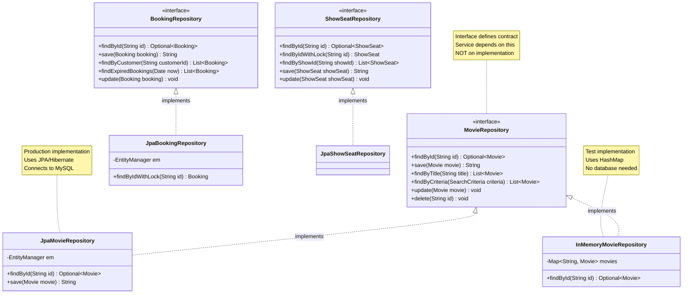

# Step 6: Repository Layer - Data Access

## 🎯 Repository Pattern

**Purpose:** Separate data access logic from business logic

**Benefits:**
- ✅ **Abstraction:** Service doesn't know if data comes from MySQL, MongoDB, or In-Memory
- ✅ **Testability:** Easy to mock for testing
- ✅ **SOLID:** Dependency Inversion Principle
- ✅ **Flexibility:** Switch databases without changing business logic

---

## 🎨 Repository Architecture



---

## 📋 Repository Interfaces

### MovieRepository

```java
public interface MovieRepository {
    /**
     * Find movie by ID
     * @return Optional.empty() if not found
     */
    Optional<Movie> findById(String movieId);

    /**
     * Save new movie
     * @return generated movieId
     */
    String save(Movie movie);

    /**
     * Find movies by title (partial match)
     */
    List<Movie> findByTitle(String title);

    /**
     * Complex search with multiple criteria
     */
    List<Movie> findByCriteria(SearchCriteria criteria);

    /**
     * Update existing movie
     */
    void update(Movie movie);

    /**
     * Delete movie
     */
    void delete(String movieId);
}
```

---

### BookingRepository (Critical!)

```java
public interface BookingRepository {
    Optional<Booking> findById(String bookingId);

    String save(Booking booking);

    List<Booking> findByCustomer(String customerId);

    /**
     * Find all bookings that have expired
     * Used by background job to release seats
     */
    List<Booking> findExpiredBookings(Date currentTime);

    void update(Booking booking);
}
```

---

### ShowSeatRepository (Most Critical!)

```java
public interface ShowSeatRepository {
    Optional<ShowSeat> findById(String showSeatId);

    /**
     * CRITICAL: Find with database row lock
     * Prevents double-booking race condition
     * Uses: SELECT ... FOR UPDATE
     */
    ShowSeat findByIdWithLock(String showSeatId);

    List<ShowSeat> findByShowId(String showId);

    String save(ShowSeat showSeat);

    void update(ShowSeat showSeat);
}
```

**Why `findByIdWithLock`?**

**Without Lock (Race Condition):**
```
Time    User A                      User B
────────────────────────────────────────────
14:00   SELECT seat C7 (AVAILABLE)
14:00                               SELECT seat C7 (AVAILABLE)
14:01   UPDATE C7 = BLOCKED
14:01                               UPDATE C7 = BLOCKED
14:02   Book C7 ✅
14:02                               Book C7 ✅

Result: DOUBLE BOOKING! 😱
```

**With Lock (Pessimistic Locking):**
```
Time    User A                      User B
────────────────────────────────────────────
14:00   SELECT C7 FOR UPDATE 🔒
14:00                               SELECT C7 FOR UPDATE (WAITING...)
14:01   UPDATE C7 = BLOCKED
14:01   COMMIT (Release lock) 🔓
14:01                               SELECT C7 (BLOCKED)
14:01                               ERROR: Seat not available

Result: No double booking! ✅
```

---

## 🗄️ JPA Implementation

### JpaShowSeatRepository

```java
@Repository
public class JpaShowSeatRepository implements ShowSeatRepository {

    @PersistenceContext
    private EntityManager entityManager;

    @Override
    public ShowSeat findByIdWithLock(String showSeatId) {
        // Pessimistic lock: SELECT ... FOR UPDATE
        return entityManager.createQuery(
            "SELECT ss FROM ShowSeat ss WHERE ss.showSeatId = :id",
            ShowSeat.class
        )
        .setParameter("id", showSeatId)
        .setLockMode(LockModeType.PESSIMISTIC_WRITE)  // 🔒 Row lock!
        .getSingleResult();
    }

    @Override
    public List<ShowSeat> findByShowId(String showId) {
        return entityManager.createQuery(
            "SELECT ss FROM ShowSeat ss WHERE ss.showId = :showId",
            ShowSeat.class
        )
        .setParameter("showId", showId)
        .getResultList();
    }

    @Override
    @Transactional
    public String save(ShowSeat showSeat) {
        showSeat.setShowSeatId(UUID.randomUUID().toString());
        entityManager.persist(showSeat);
        return showSeat.getShowSeatId();
    }

    @Override
    @Transactional
    public void update(ShowSeat showSeat) {
        entityManager.merge(showSeat);
    }
}
```

**SQL Generated:**
```sql
-- findByIdWithLock generates:
SELECT * FROM show_seats
WHERE show_seat_id = ?
FOR UPDATE;  -- 🔒 Locks this row until transaction commits
```

---

## 🧪 In-Memory Implementation (Testing)

```java
public class InMemoryMovieRepository implements MovieRepository {
    private final Map<String, Movie> movies = new ConcurrentHashMap<>();

    @Override
    public Optional<Movie> findById(String movieId) {
        return Optional.ofNullable(movies.get(movieId));
    }

    @Override
    public String save(Movie movie) {
        String id = UUID.randomUUID().toString();
        movie.setMovieId(id);
        movies.put(id, movie);
        return id;
    }

    @Override
    public List<Movie> findByTitle(String title) {
        return movies.values().stream()
            .filter(m -> m.getTitle().contains(title))
            .collect(Collectors.toList());
    }
}
```

**Benefits for Testing:**
- ✅ No database needed
- ✅ Fast (in-memory)
- ✅ Isolated tests
- ✅ Easy to reset (clear map)

---

## 📝 Summary

| Aspect | Details |
|--------|---------|
| **Pattern** | Repository Pattern |
| **Key Feature** | Pessimistic locking for preventing double-booking |
| **Implementations** | JPA (production), In-Memory (testing) |
| **SOLID Principle** | Dependency Inversion (Service depends on interface) |

**Next Document:** [09_step7_design_patterns.md](./09_step7_design_patterns.md)
