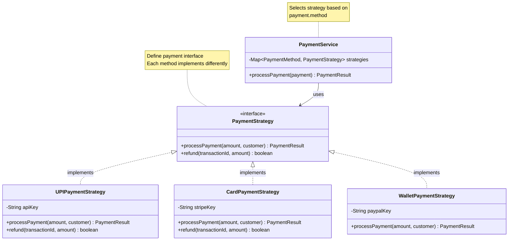
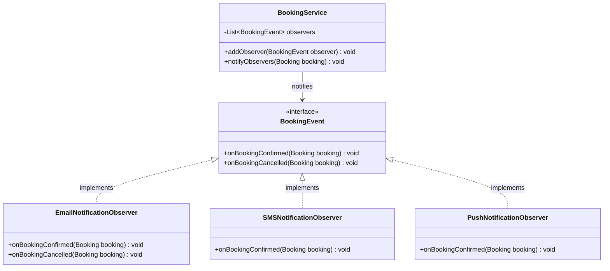

# Step 7: Design Patterns Applied

## 🎨 Design Patterns in Movie Booking System

### 1. **Repository Pattern** ✅ (Already implemented in Step 6)

**Purpose:** Encapsulate data access logic

**Where:** All repositories (MovieRepository, BookingRepository, etc.)

---

### 2. **Strategy Pattern** - Payment Methods

**Problem:** Need to support multiple payment methods (UPI, Card, Wallet)

**Solution:** Strategy pattern - different payment strategies



**Java Implementation:**

```java
// Strategy interface
public interface PaymentStrategy {
    PaymentResult processPayment(double amount, String customerId);
    boolean refund(String transactionId, double amount);
}

// Concrete strategies
public class UPIPaymentStrategy implements PaymentStrategy {
    private final RazorpayClient razorpay;

    @Override
    public PaymentResult processPayment(double amount, String customerId) {
        // UPI-specific logic
        return razorpay.chargeViaUPI(amount, customerId);
    }

    @Override
    public boolean refund(String transactionId, double amount) {
        return razorpay.refund(transactionId, amount);
    }
}

public class CardPaymentStrategy implements PaymentStrategy {
    private final StripeClient stripe;

    @Override
    public PaymentResult processPayment(double amount, String customerId) {
        // Card-specific logic
        return stripe.charge(amount, customerId);
    }
}

// Context class
@Service
public class PaymentService {
    private final Map<PaymentMethod, PaymentStrategy> strategies;

    public PaymentService() {
        strategies = new HashMap<>();
        strategies.put(PaymentMethod.UPI, new UPIPaymentStrategy());
        strategies.put(PaymentMethod.CREDIT_CARD, new CardPaymentStrategy());
        strategies.put(PaymentMethod.WALLET, new WalletPaymentStrategy());
    }

    public PaymentResult processPayment(Payment payment) {
        // Select strategy based on payment method
        PaymentStrategy strategy = strategies.get(payment.getMethod());

        if (strategy == null) {
            throw new UnsupportedPaymentMethodException(payment.getMethod());
        }

        // Delegate to strategy
        return strategy.processPayment(payment.getAmount(), payment.getCustomerId());
    }
}
```

**Benefits:**
- ✅ **Open/Closed:** Add new payment method without changing existing code
- ✅ **Single Responsibility:** Each strategy handles one payment type
- ✅ **Easy Testing:** Mock strategies easily

---

### 3. **Factory Pattern** - Entity Creation

**Problem:** Creating entities with complex initialization logic

**Solution:** Factory classes to centralize creation

```java
// Factory for creating Bookings
public class BookingFactory {

    /**
     * Create booking with validation and defaults
     */
    public static Booking createBooking(BookingRequest request) {
        // Validation
        if (request.getSeatIds().isEmpty()) {
            throw new ValidationException("No seats selected");
        }

        // Create booking
        Booking booking = new Booking();
        booking.setBookingId(generateBookingId());
        booking.setCustomerId(request.getCustomerId());
        booking.setShowId(request.getShowId());
        booking.setSeatIds(request.getSeatIds());
        booking.setStatus(BookingStatus.PENDING_PAYMENT);
        booking.setBookingTime(new Date());
        booking.setExpiresAt(calculateExpiryTime());  // 10 minutes from now

        return booking;
    }

    private static String generateBookingId() {
        // Format: BK + YYYYMMDD + sequence
        SimpleDateFormat sdf = new SimpleDateFormat("yyyyMMdd");
        String date = sdf.format(new Date());
        String sequence = String.format("%05d", getNextSequence());
        return "BK" + date + sequence;
    }

    private static Date calculateExpiryTime() {
        Calendar cal = Calendar.getInstance();
        cal.add(Calendar.MINUTE, 10);
        return cal.getTime();
    }
}

// Usage in Service
public class BookingService {
    public Booking createBooking(BookingRequest request) {
        Booking booking = BookingFactory.createBooking(request);  // Use factory!
        // ... rest of logic
    }
}
```

**Benefits:**
- ✅ **Centralized Logic:** All booking creation in one place
- ✅ **Consistency:** Always create bookings with correct defaults
- ✅ **Testability:** Easy to test creation logic

---

### 4. **Observer Pattern** - Notifications

**Problem:** When booking is confirmed, need to notify customer via email, SMS, push notification

**Solution:** Observer pattern - notify all observers when event occurs



**Java Implementation:**

```java
// Observer interface
public interface BookingEventObserver {
    void onBookingConfirmed(Booking booking);
    void onBookingCancelled(Booking booking);
}

// Concrete observers
public class EmailNotificationObserver implements BookingEventObserver {
    private final EmailService emailService;

    @Override
    public void onBookingConfirmed(Booking booking) {
        emailService.sendConfirmation(booking);
    }

    @Override
    public void onBookingCancelled(Booking booking) {
        emailService.sendCancellation(booking);
    }
}

public class SMSNotificationObserver implements BookingEventObserver {
    private final SMSService smsService;

    @Override
    public void onBookingConfirmed(Booking booking) {
        smsService.sendConfirmationSMS(booking);
    }

    @Override
    public void onBookingCancelled(Booking booking) {
        smsService.sendCancellationSMS(booking);
    }
}

// Subject (BookingService)
@Service
public class BookingService {
    private final List<BookingEventObserver> observers = new ArrayList<>();

    public BookingService() {
        // Register observers
        observers.add(new EmailNotificationObserver());
        observers.add(new SMSNotificationObserver());
        observers.add(new PushNotificationObserver());
    }

    public void confirmBooking(String bookingId, Payment payment) {
        // ... confirm booking logic

        // Notify all observers
        notifyBookingConfirmed(booking);
    }

    private void notifyBookingConfirmed(Booking booking) {
        for (BookingEventObserver observer : observers) {
            observer.onBookingConfirmed(booking);
        }
    }
}
```

**Benefits:**
- ✅ **Loose Coupling:** BookingService doesn't know about Email/SMS implementation
- ✅ **Open/Closed:** Easy to add new notification channels
- ✅ **Single Responsibility:** Each observer handles one notification type

---

### 5. **Singleton Pattern** - Database Connection Pool

**Problem:** Only one database connection pool should exist

**Solution:** Singleton pattern

```java
public class DatabaseConnectionPool {
    private static volatile DatabaseConnectionPool instance;
    private final HikariDataSource dataSource;

    // Private constructor
    private DatabaseConnectionPool() {
        HikariConfig config = new HikariConfig();
        config.setJdbcUrl("jdbc:mysql://localhost:3306/movie_booking");
        config.setUsername("root");
        config.setPassword("password");
        config.setMaximumPoolSize(20);

        this.dataSource = new HikariDataSource(config);
    }

    // Double-checked locking (thread-safe)
    public static DatabaseConnectionPool getInstance() {
        if (instance == null) {
            synchronized (DatabaseConnectionPool.class) {
                if (instance == null) {
                    instance = new DatabaseConnectionPool();
                }
            }
        }
        return instance;
    }

    public Connection getConnection() throws SQLException {
        return dataSource.getConnection();
    }
}
```

**Benefits:**
- ✅ **Single Instance:** Only one connection pool
- ✅ **Resource Efficiency:** Reuse connections
- ✅ **Thread-Safe:** Double-checked locking

---

### 6. **Builder Pattern** - Complex Object Construction

**Problem:** Creating ShowSeat with many optional fields

**Solution:** Builder pattern

```java
public class ShowSeat {
    private String showSeatId;
    private String showId;
    private String seatId;
    private SeatStatus status;
    private Date blockedAt;
    private String blockedByCustomerId;
    private int version;  // For optimistic locking

    // Private constructor
    private ShowSeat() {}

    // Builder class
    public static class Builder {
        private final ShowSeat showSeat = new ShowSeat();

        public Builder showId(String showId) {
            showSeat.showId = showId;
            return this;
        }

        public Builder seatId(String seatId) {
            showSeat.seatId = seatId;
            return this;
        }

        public Builder status(SeatStatus status) {
            showSeat.status = status;
            return this;
        }

        public Builder blockedAt(Date blockedAt) {
            showSeat.blockedAt = blockedAt;
            return this;
        }

        public ShowSeat build() {
            // Validation
            if (showSeat.showId == null || showSeat.seatId == null) {
                throw new IllegalStateException("showId and seatId are required");
            }

            // Defaults
            if (showSeat.status == null) {
                showSeat.status = SeatStatus.AVAILABLE;
            }

            return showSeat;
        }
    }
}

// Usage
ShowSeat showSeat = new ShowSeat.Builder()
    .showId("SHW001")
    .seatId("SEAT001")
    .status(SeatStatus.AVAILABLE)
    .build();
```

**Benefits:**
- ✅ **Readable:** Clear what each parameter is
- ✅ **Optional Parameters:** Can omit optional fields
- ✅ **Immutable:** Can make object immutable after building

---

## 🎯 SOLID Principles Applied

### 1. **Single Responsibility Principle (SRP)**

**Definition:** A class should have only one reason to change

**Examples:**
```java
✅ MovieService - Only movie-related operations
✅ BookingService - Only booking-related operations
✅ PaymentService - Only payment processing

❌ BookingService handling movies, payments, notifications - TOO MANY RESPONSIBILITIES
```

---

### 2. **Open/Closed Principle (OCP)**

**Definition:** Open for extension, closed for modification

**Example: Strategy Pattern for Payments**
```java
// Adding new payment method doesn't require changing existing code
✅ Add CryptoPaymentStrategy (NEW CLASS)
   WITHOUT modifying PaymentService

❌ Adding if-else in PaymentService for each new method
```

---

### 3. **Liskov Substitution Principle (LSP)**

**Definition:** Derived classes must be substitutable for base classes

**Example: Repository Implementations**
```java
// Service depends on interface
public class BookingService {
    private BookingRepository repo;  // Interface, not implementation!

    // Can use JpaBookingRepository or InMemoryBookingRepository
    // Service code doesn't change!
}

✅ Substitute JpaBookingRepository with InMemoryBookingRepository
   WITHOUT breaking BookingService
```

---

### 4. **Interface Segregation Principle (ISP)**

**Definition:** Clients shouldn't depend on interfaces they don't use

**Example:**
```java
❌ BAD: One huge Repository interface
public interface Repository {
    void save();
    void update();
    void delete();
    void findById();
    void sendEmail();  // Why is this here???
    void processPayment();  // Not related to data access!
}

✅ GOOD: Segregated interfaces
public interface BookingRepository {
    void save(Booking b);
    Booking findById(String id);
}

public interface NotificationService {
    void sendEmail(Booking b);
}

public interface PaymentService {
    Payment processPayment(Booking b);
}
```

---

### 5. **Dependency Inversion Principle (DIP)**

**Definition:** Depend on abstractions, not concretions

**Example:**
```java
❌ BAD: Service depends on concrete implementation
public class BookingService {
    private JpaBookingRepository repo = new JpaBookingRepository();  // ❌ Tight coupling!
}

✅ GOOD: Service depends on interface
public class BookingService {
    private final BookingRepository repo;  // ✅ Interface!

    public BookingService(BookingRepository repo) {
        this.repo = repo;  // Dependency Injection
    }
}

// Can inject any implementation
BookingService service = new BookingService(new JpaBookingRepository());
// OR
BookingService service = new BookingService(new InMemoryBookingRepository());
```

---

## 📝 Summary

| Pattern | Where Used | Benefit |
|---------|------------|---------|
| **Strategy** | Payment methods | Add new methods easily |
| **Factory** | Entity creation | Centralized creation logic |
| **Observer** | Notifications | Decouple notification channels |
| **Repository** | Data access | Abstract database implementation |
| **Singleton** | Connection pool | Single instance |
| **Builder** | Complex objects | Readable construction |

| SOLID Principle | Example |
|-----------------|---------|
| **SRP** | One service per domain (MovieService, BookingService) |
| **OCP** | Strategy pattern for payments |
| **LSP** | Repository implementations substitutable |
| **ISP** | Segregated interfaces (not one big interface) |
| **DIP** | Services depend on interfaces, not implementations |

**Next Document:** [10_final_architecture.md](./10_final_architecture.md)
