# Sequence Diagrams - Complete Flows

## 1. Booking Flow (Happy Path)

```mermaid
sequenceDiagram
    actor Customer
    participant UI as Web UI
    participant BookingCtrl as BookingController
    participant BookingSvc as BookingService
    participant ShowSeatRepo as ShowSeatRepository
    participant BookingRepo as BookingRepository
    participant PaymentSvc as PaymentService
    participant Gateway as Payment Gateway
    participant NotifSvc as NotificationService
    participant DB as Database

    Note over Customer,DB: STEP 1: Search & Select Show
    Customer->>UI: Search "Inception"
    UI->>BookingCtrl: GET /movies/search?title=Inception
    BookingCtrl->>BookingSvc: searchMovies("Inception")
    BookingSvc->>DB: SELECT * FROM movies WHERE title LIKE '%Inception%'
    DB-->>BookingSvc: List<Movie>
    BookingSvc-->>UI: Display movies

    Note over Customer,DB: STEP 2: View Seat Availability
    Customer->>UI: Select show (7:00 PM)
    UI->>BookingCtrl: GET /shows/{showId}/seats
    BookingCtrl->>BookingSvc: getSeatAvailability(showId)
    BookingSvc->>ShowSeatRepo: findByShowId(showId)
    ShowSeatRepo->>DB: SELECT * FROM show_seats WHERE show_id = ?
    DB-->>ShowSeatRepo: List<ShowSeat>
    ShowSeatRepo-->>BookingSvc: List<ShowSeat>
    BookingSvc-->>UI: Seat layout with status
    UI-->>Customer: Display: Green=Available, Red=Booked

    Note over Customer,DB: STEP 3: Select Seats & Create Booking
    Customer->>UI: Click seats C7, C8
    UI->>BookingCtrl: POST /bookings {showId, seatIds:[C7,C8]}
    BookingCtrl->>BookingSvc: createBooking(request)

    Note over BookingSvc,DB: Pessimistic Locking
    BookingSvc->>ShowSeatRepo: findByIdWithLock(C7)
    ShowSeatRepo->>DB: SELECT * FROM show_seats WHERE id=C7 FOR UPDATE 🔒
    DB-->>ShowSeatRepo: ShowSeat(C7, status=AVAILABLE)
    BookingSvc->>ShowSeatRepo: update(C7, status=BLOCKED)
    ShowSeatRepo->>DB: UPDATE show_seats SET status='BLOCKED', blocked_at=NOW()

    BookingSvc->>ShowSeatRepo: findByIdWithLock(C8)
    ShowSeatRepo->>DB: SELECT * FROM show_seats WHERE id=C8 FOR UPDATE 🔒
    DB-->>ShowSeatRepo: ShowSeat(C8, status=AVAILABLE)
    BookingSvc->>ShowSeatRepo: update(C8, status=BLOCKED)

    Note over BookingSvc: Calculate total: ₹400
    BookingSvc->>BookingRepo: save(booking)
    BookingRepo->>DB: INSERT INTO bookings (status='PENDING_PAYMENT', expires_at=NOW()+10min)
    DB-->>BookingRepo: bookingId: BK001
    BookingSvc-->>BookingCtrl: Booking(BK001, total=400, status=PENDING)
    BookingCtrl-->>UI: Booking details
    UI-->>Customer: "Seats blocked for 10 min. Proceed to payment"

    Note over Customer,DB: STEP 4: Payment Processing
    Customer->>UI: Click "Pay Now"
    UI->>BookingCtrl: POST /payments {bookingId:BK001, method:UPI}
    BookingCtrl->>PaymentSvc: processPayment(BK001, UPI)
    PaymentSvc->>DB: INSERT INTO payments (status='PENDING')
    PaymentSvc->>Gateway: charge(amount=400, customerId)
    Gateway-->>PaymentSvc: {success:true, txnId:'razorpay_123'}

    PaymentSvc->>DB: UPDATE payments SET status='SUCCESS', txn_id='razorpay_123'
    PaymentSvc-->>BookingSvc: Payment(status=SUCCESS)

    Note over BookingSvc,DB: STEP 5: Confirm Booking
    BookingSvc->>BookingRepo: update(BK001, status='CONFIRMED')
    BookingRepo->>DB: UPDATE bookings SET status='CONFIRMED'

    BookingSvc->>ShowSeatRepo: update(C7, status='BOOKED')
    ShowSeatRepo->>DB: UPDATE show_seats SET status='BOOKED'
    BookingSvc->>ShowSeatRepo: update(C8, status='BOOKED')
    ShowSeatRepo->>DB: UPDATE show_seats SET status='BOOKED'

    BookingSvc->>NotifSvc: sendBookingConfirmation(BK001)
    NotifSvc->>Customer: Email: "Booking confirmed! QR code attached"
    NotifSvc->>Customer: SMS: "BK001 confirmed for Inception"

    BookingSvc-->>UI: Booking confirmed
    UI-->>Customer: "Success! Check your email for tickets"
```

---

## 2. Cancellation & Refund Flow

---

## 3. Payment Failure & Seat Release Flow

---

## 4. Timeout & Auto-Release Flow (Background Job)

---

## 5. Concurrent Booking Conflict (Race Condition Prevented)

```mermaid
sequenceDiagram
    actor UserA as User A
    actor UserB as User B
    participant BookingSvc as BookingService
    participant ShowSeatRepo as ShowSeatRepository
    participant DB as Database

    Note over UserA,DB: Both users try to book seat C7 simultaneously

    par User A selects C7
        UserA->>BookingSvc: createBooking([C7])
        BookingSvc->>ShowSeatRepo: findByIdWithLock(C7)
        ShowSeatRepo->>DB: SELECT * FROM show_seats<br/>WHERE id='C7' FOR UPDATE 🔒
        Note over DB: Lock acquired by User A
        DB-->>ShowSeatRepo: ShowSeat(C7, status=AVAILABLE)
    and User B selects C7
        UserB->>BookingSvc: createBooking([C7])
        BookingSvc->>ShowSeatRepo: findByIdWithLock(C7)
        ShowSeatRepo->>DB: SELECT * FROM show_seats<br/>WHERE id='C7' FOR UPDATE
        Note over DB: WAITING for lock... ⏳
    end

    Note over BookingSvc,DB: User A gets lock first
    BookingSvc->>ShowSeatRepo: update(C7, status=BLOCKED)
    ShowSeatRepo->>DB: UPDATE show_seats SET status='BLOCKED'
    BookingSvc-->>UserA: Booking created ✅

    Note over DB: Lock released 🔓
    DB-->>ShowSeatRepo: ShowSeat(C7, status=BLOCKED)
    BookingSvc->>BookingSvc: Check if C7 is available
    BookingSvc-->>UserB: Error: Seat not available ❌
```

---

## 📝 Key Takeaways from Sequences

1. **Pessimistic Locking:** `FOR UPDATE` prevents race conditions
2. **Transaction Boundaries:** All seat blocking + booking creation in one transaction
3. **Timeouts:** 10-minute expiry prevents seat hogging
4. **Background Jobs:** Auto-release expired bookings
5. **Notifications:** Async notifications don't block main flow
6. **Error Handling:** Payment failure immediately releases seats

---

**Next Document:** [11_data_model_er_diagram.md](./11_data_model_er_diagram.md)
