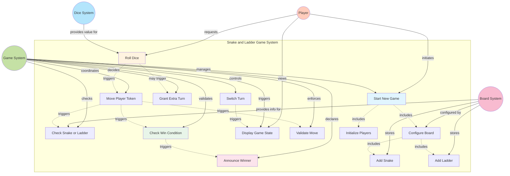
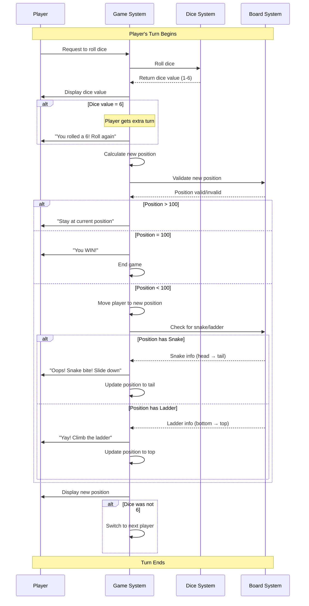
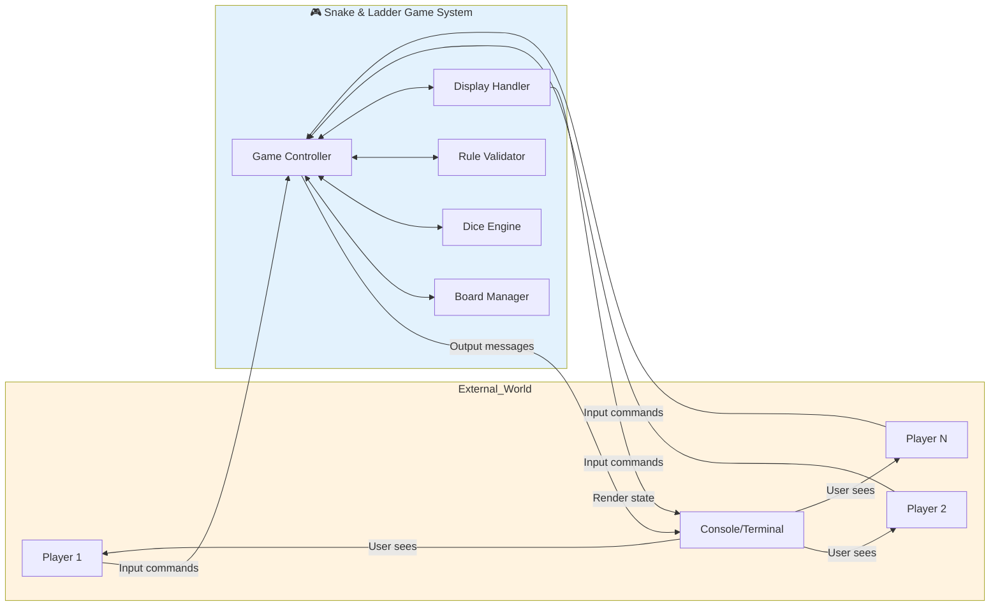

# Snake and Ladder Game - Use Case Diagram

## 📚 What is a Use Case Diagram?

**For Beginners:** A use case diagram shows WHO uses the system (actors) and WHAT they can do (use cases). Think of it as a visual menu showing all available actions.

**Key Terms:**
- **Actor**: A person or system that interacts with our application (shown as stick figures)
- **Use Case**: An action or goal that an actor wants to achieve (shown as ovals)
- **System Boundary**: The box around use cases showing what's inside our system

---

## 1. Actors Identification

### Primary Actors (Main Users)
These are the direct users of the system:

#### 1.1 Player (Human User)
**Who:** The person playing the game

**Responsibilities:**
- Starts the game
- Rolls the dice when it's their turn
- Observes the board and game state
- Sees the result of their actions

**Characteristics:**
- Multiple players can exist in one game (2-6 typically)
- Each player takes turns
- Each player has a unique identifier (name/color)

---

### Secondary Actors (System Components)
These are parts of the system that support the game:

#### 1.2 Game System
**What:** The orchestrator that manages overall game flow

**Responsibilities:**
- Initializes the game
- Manages turn rotation
- Enforces game rules
- Determines the winner
- Displays game state

#### 1.3 Dice System
**What:** The component that generates random numbers

**Responsibilities:**
- Generates random values (1-6)
- Determines if extra turn is granted (on rolling 6)

#### 1.4 Board System
**What:** The game board that manages the playing field

**Responsibilities:**
- Stores board configuration (size, snakes, ladders)
- Validates positions
- Returns snake/ladder information for positions

---

## 2. Use Cases Identification

### Core Use Cases

| Use Case ID | Use Case Name | Actor | Description |
|-------------|---------------|-------|-------------|
| UC-1 | Start New Game | Player | Initialize a new game with players and board configuration |
| UC-2 | Roll Dice | Player | Roll the dice to get a random number (1-6) |
| UC-3 | Move Player Token | Game System | Move player's token based on dice roll |
| UC-4 | Check Snake or Ladder | Game System | Check if player landed on snake/ladder and adjust position |
| UC-5 | Grant Extra Turn | Game System | Give player another turn if they rolled a 6 |
| UC-6 | Switch Turn | Game System | Move to the next player's turn |
| UC-7 | Check Win Condition | Game System | Check if any player has reached position 100 |
| UC-8 | Display Game State | Game System | Show current positions of all players |
| UC-9 | Announce Winner | Game System | Declare the winner when someone reaches 100 |
| UC-10 | Validate Move | Game System | Ensure move is within board boundaries |

---

## 3. Use Case Diagram (Mermaid)



---

## 4. Detailed Use Case Flow Diagrams

### 4.1 Use Case Flow: Complete Game Turn



---

## 5. Use Case Descriptions

### UC-1: Start New Game

**Actors:** Player, Game System, Board System

**Preconditions:**
- None (game can always be started)

**Main Flow:**
1. Player initiates game start
2. System prompts for number of players
3. Player enters player count (minimum 2)
4. System prompts for player names
5. Player enters names for each player
6. System configures the board (default or custom)
7. System initializes all players at position 0
8. System displays welcome message and board
9. System starts with Player 1's turn

**Postconditions:**
- Game is initialized
- All players are at position 0
- First player's turn is active

**Alternative Flows:**
- If player count < 2: Display error, request again
- If custom board selected: Prompt for snake/ladder configuration

---

### UC-2: Roll Dice

**Actors:** Player, Dice System, Game System

**Preconditions:**
- Game is in progress
- It's the current player's turn

**Main Flow:**
1. System displays "Player X's turn"
2. System prompts player to roll dice
3. Player initiates dice roll (presses enter/button)
4. Dice system generates random number (1-6)
5. System displays dice value to all players
6. System proceeds to move player

**Postconditions:**
- Dice value is generated
- Game proceeds to movement phase

**Alternative Flows:**
- None (dice always produces a value)

---

### UC-3: Move Player Token

**Actors:** Game System, Board System

**Preconditions:**
- Dice has been rolled
- Dice value is available

**Main Flow:**
1. System calculates new position = current position + dice value
2. System validates new position (≤ 100)
3. If valid, system updates player position
4. System checks for snake/ladder at new position
5. System displays movement message
6. System updates game state

**Postconditions:**
- Player position is updated
- Game state reflects new position

**Alternative Flows:**
- **Alt 1:** New position > 100
  - Player stays at current position
  - Display "Need exact number to win"
- **Alt 2:** New position = 100
  - Trigger win condition check

---

### UC-4: Check Snake or Ladder

**Actors:** Game System, Board System

**Preconditions:**
- Player has moved to a new position

**Main Flow:**
1. System queries board for position details
2. Board returns snake/ladder information

**Postconditions:**
- Player position may be adjusted
- Appropriate message is displayed

**Alternative Flows:**
- **Alt 1:** Position has Snake
  - System displays "Snake! Slide from X to Y"
  - System updates player position to snake tail
- **Alt 2:** Position has Ladder
  - System displays "Ladder! Climb from X to Y"
  - System updates player position to ladder top
- **Alt 3:** Position is empty
  - No action taken
  - Player stays at rolled position

---

### UC-5: Grant Extra Turn

**Actors:** Game System

**Preconditions:**
- Player rolled a 6

**Main Flow:**
1. System checks if dice value = 6
2. System displays "You rolled a 6! Go again!"
3. System keeps current player active
4. System returns to roll dice phase

**Postconditions:**
- Same player gets another turn
- Turn counter doesn't increment

**Alternative Flows:**
- **Alt 1:** Player rolled 6 three times consecutively (optional rule)
  - Forfeit turn
  - Switch to next player

---

### UC-6: Switch Turn

**Actors:** Game System

**Preconditions:**
- Current player's turn is complete
- Dice value was not 6 (or extra turn rule doesn't apply)

**Main Flow:**
1. System increments turn counter
2. System calculates next player index (round-robin)
3. System sets next player as active
4. System displays "Player Y's turn"

**Postconditions:**
- Next player is now active
- Game continues with new player

**Alternative Flows:**
- None (always switches unless game ended)

---

### UC-7: Check Win Condition

**Actors:** Game System

**Preconditions:**
- Player has moved

**Main Flow:**
1. System checks if any player position = 100
2. If true, trigger win announcement
3. If false, continue game

**Postconditions:**
- Win condition is evaluated
- Game either continues or ends

**Alternative Flows:**
- **Alt 1:** Player reached 100
  - Trigger UC-9 (Announce Winner)
  - End game

---

### UC-8: Display Game State

**Actors:** Game System, Player

**Preconditions:**
- Game is initialized

**Main Flow:**
1. System displays current turn number
2. System displays whose turn it is
3. System lists all players with their current positions
4. System shows board (optional visualization)

**Postconditions:**
- Players are informed of current game state

**Alternative Flows:**
- None

**Example Output:**
```
========================================
Turn: 15
Current Player: Alice
========================================
Player Positions:
  1. Alice    - Position 42
  2. Bob      - Position 38
  3. Charlie  - Position 51
========================================
```

---

### UC-9: Announce Winner

**Actors:** Game System, Player

**Preconditions:**
- A player has reached position 100

**Main Flow:**
1. System identifies winning player
2. System displays congratulations message
3. System shows final statistics (turns taken, positions)
4. System asks if players want to play again

**Postconditions:**
- Game is marked as complete
- Winner is recorded

**Example Output:**
```
🎉🎉🎉🎉🎉🎉🎉🎉🎉🎉🎉🎉🎉
CONGRATULATIONS ALICE!
You won the game in 47 turns!
🎉🎉🎉🎉🎉🎉🎉🎉🎉🎉🎉🎉🎉

Final Standings:
  1st: Alice   - 100 (Winner!)
  2nd: Charlie - 87
  3rd: Bob     - 62
```

---

### UC-10: Validate Move

**Actors:** Game System, Board System

**Preconditions:**
- New position is calculated

**Main Flow:**
1. System checks if new position ≤ board size (100)
2. System checks if new position ≥ 0
3. System returns validation result

**Postconditions:**
- Move is validated as legal or illegal

**Business Rules:**
- Position must be 0-100
- To win, must land EXACTLY on 100
- If roll exceeds 100, player stays in place

---

## 6. Use Case Dependencies

### Includes Relationship
**Definition:** Use case A ALWAYS includes use case B

Examples:
- **Start New Game** includes **Configure Board**
- **Configure Board** includes **Add Snake** and **Add Ladder**
- **Roll Dice** includes **Move Player Token**

### Extends Relationship
**Definition:** Use case B OPTIONALLY extends use case A under certain conditions

Examples:
- **Grant Extra Turn** extends **Roll Dice** (only if rolled 6)
- **Check Snake or Ladder** extends **Move Player Token** (only if landed on special cell)

---

## 7. Actor-Use Case Matrix

| Actor | Start Game | Roll Dice | Move Token | Check Snake/Ladder | Switch Turn | Display State | Announce Winner |
|-------|------------|-----------|------------|-------------------|-------------|---------------|-----------------|
| Player | ✅ Primary | ✅ Primary | ❌ | ❌ | ❌ | ✅ Secondary | ✅ Secondary |
| Game System | ✅ Primary | ✅ Secondary | ✅ Primary | ✅ Primary | ✅ Primary | ✅ Primary | ✅ Primary |
| Dice System | ❌ | ✅ Primary | ❌ | ❌ | ❌ | ❌ | ❌ |
| Board System | ✅ Secondary | ❌ | ✅ Secondary | ✅ Primary | ❌ | ❌ | ❌ |

**Legend:**
- ✅ Primary: Actor initiates or performs the use case
- ✅ Secondary: Actor supports or is affected by the use case
- ❌ Not involved

---

## 8. System Context Diagram

This diagram shows the Snake and Ladder system's boundary and its interactions:



---

## 9. Beginner's Checklist: "What to Draw First?"

When creating use case diagrams in an interview or whiteboard session:

### Step 1: Identify Actors (2 minutes)
- ✅ Draw stick figures for human actors (Players)
- ✅ Draw stick figures or boxes for system actors (Game, Dice, Board)
- ✅ Place primary actors on the left, secondary on the right

### Step 2: Draw System Boundary (1 minute)
- ✅ Draw a large rectangle
- ✅ Label it "Snake and Ladder Game System"
- ✅ Everything inside is what WE build
- ✅ Everything outside is external

### Step 3: Identify Core Use Cases (3 minutes)
- ✅ Start with nouns from requirements → convert to verbs
  - Requirement: "Players roll dice" → Use Case: "Roll Dice"
  - Requirement: "Game determines winner" → Use Case: "Check Win Condition"
- ✅ Draw ovals inside system boundary
- ✅ Use simple, action-oriented names

### Step 4: Connect Actors to Use Cases (2 minutes)
- ✅ Draw solid lines from actors to use cases they interact with
- ✅ Player connects to: Start Game, Roll Dice, View State
- ✅ Game System connects to: most use cases (orchestrator)

### Step 5: Add Relationships (2 minutes)
- ✅ Use dashed arrows for includes/extends
- ✅ Label relationships clearly
- ✅ Don't overdo it - keep it simple!

**Total Time: ~10 minutes for basic diagram**

---

## 10. Common Mistakes Beginners Make

### ❌ Mistake 1: Too Many Use Cases
**Problem:** Creating use cases for every tiny action
```
Bad: "Increment Position", "Decrement Position", "Add 1", "Add 2"
Good: "Move Player Token"
```

**Solution:** Use cases should represent meaningful goals, not implementation details.

---

### ❌ Mistake 2: Implementation Details in Use Cases
**Problem:** Naming use cases like code functions
```
Bad: "executePlayerMovementAlgorithm()", "updatePositionVariable"
Good: "Move Player", "Update Position"
```

**Solution:** Use cases are user goals, not code methods. Use plain language.

---

### ❌ Mistake 3: Confusing Actors with Objects
**Problem:** Making internal objects as actors
```
Bad: Snake as actor, Ladder as actor, Cell as actor
Good: Board System manages snakes, ladders, and cells
```

**Solution:** Actors are entities that INITIATE actions, not passive data.

---

### ❌ Mistake 4: Missing the System Boundary
**Problem:** Not showing what's inside vs outside the system

**Solution:** Always draw a clear box around your system. External entities stay outside.

---

### ❌ Mistake 5: Overusing Extends/Includes
**Problem:** Adding too many relationship arrows
```
Bad: Every use case connected to every other use case
Good: Only show meaningful dependencies
```

**Solution:** Use includes for ALWAYS happens, extends for SOMETIMES happens. Keep it minimal.

---

## 11. Summary

**Key Takeaways:**

1. **Actors Identified:**
   - Primary: Player (human)
   - System: Game, Dice, Board

2. **Core Use Cases:**
   - Start Game, Roll Dice, Move Player, Check Snake/Ladder
   - Grant Extra Turn, Switch Turn, Check Win, Display State, Announce Winner

3. **Main Flows:**
   - Game initialization → Turn loop → Win condition
   - Each turn: Roll → Move → Check → Display → Next

4. **Relationships:**
   - Start Game INCLUDES Configure Board
   - Roll Dice MAY TRIGGER Extra Turn
   - Move Player INCLUDES Check Snake/Ladder

**Next Step:** Now that we understand WHAT the system does, we'll design HOW it's structured using class diagrams!

---

📌 **Remember:** Use case diagrams show the EXTERNAL view (what users see). Class diagrams (next) show the INTERNAL view (how we build it).
