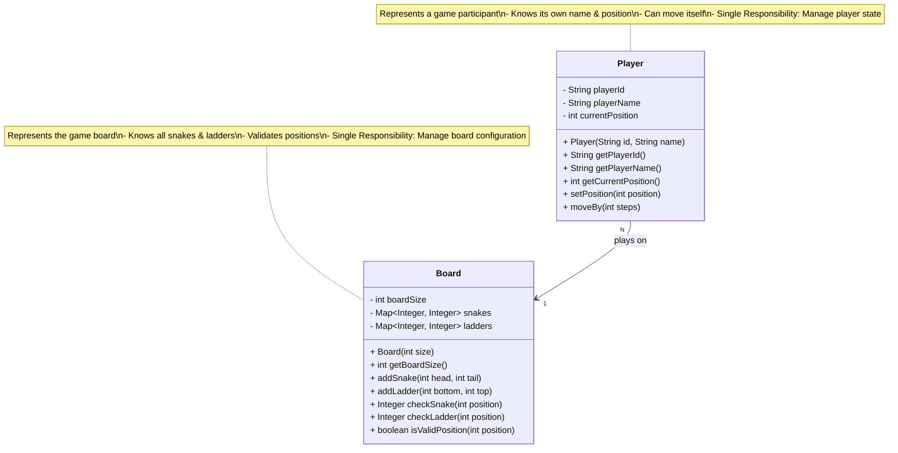
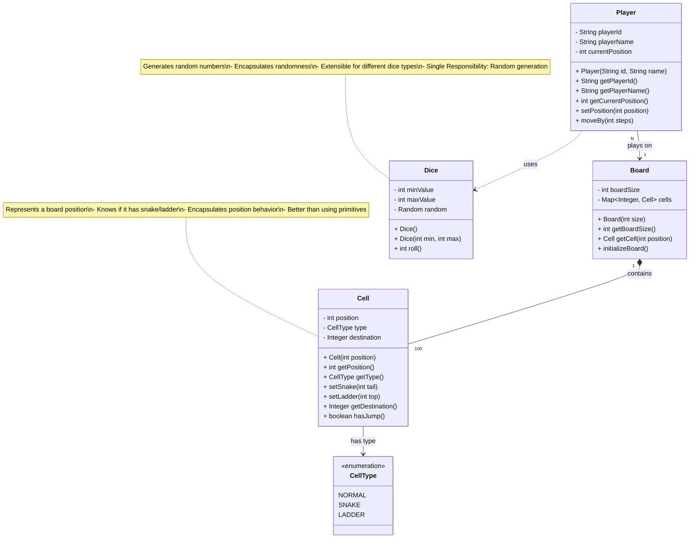

# Snake and Ladder Game - Class Diagram Steps 1-2

## 📚 What is a Class Diagram?

**For Beginners:** A class diagram shows the BLUEPRINT of our code. It's like an architectural drawing that shows:
- What classes (building blocks) we'll create
- What data each class holds (attributes/fields)
- What actions each class can perform (methods)
- How classes relate to each other (relationships)

**Why build incrementally?**
- Starting with ALL classes at once is overwhelming
- Building step-by-step helps understand design evolution
- Each step adds complexity gradually
- Mirrors real-world design process

---

## STEP 1: Core Entities - Player and Board

### 🎯 WHERE TO START?

**Start with the NOUNS from requirements:**
- Look at functional requirements
- Identify key entities (things/objects)
- Pick the most fundamental ones

**For Snake and Ladder:**
- **Player** → Someone who plays (fundamental)
- **Board** → Where the game happens (fundamental)

**Why these two first?**
1. They exist independently (low coupling)
2. They're the foundation for everything else
3. They map directly to real-world concepts
4. Easy for beginners to understand

---

### 📊 Step 1: Class Diagram



---

### 🔍 WHAT YOU ADDED?

#### 1. Player Class
**Purpose:** Represents each person playing the game

**Attributes (Data):**
- `playerId`: Unique identifier (like "P1", "P2")
- `playerName`: Human-readable name (like "Alice", "Bob")
- `currentPosition`: Where the player is on the board (0-100)

**Methods (Actions):**
- `Player(id, name)`: Constructor to create a new player
- `getPlayerId()`: Returns the player's ID
- `getPlayerName()`: Returns the player's name
- `getCurrentPosition()`: Returns current position
- `setPosition(position)`: Updates position to a specific value
- `moveBy(steps)`: Moves player forward by N steps

**Why these methods?**
- Getters: Let other classes READ player data
- Setters: Let other classes UPDATE player position
- moveBy(): Business logic for movement calculation

---

#### 2. Board Class
**Purpose:** Represents the game board with snakes and ladders

**Attributes (Data):**
- `boardSize`: Total cells (typically 100)
- `snakes`: Map storing snake positions (head → tail)
  - Example: {98 → 28, 54 → 34}
  - Key = head position, Value = tail position
- `ladders`: Map storing ladder positions (bottom → top)
  - Example: {4 → 14, 9 → 31}
  - Key = bottom position, Value = top position

**Why Map/Dictionary?**
- Fast lookup: O(1) time to check if position has snake/ladder
- Easy to add/remove: Just put/remove entries
- Clear semantics: position → destination

**Methods (Actions):**
- `Board(size)`: Constructor to create board with given size
- `getBoardSize()`: Returns maximum position (100)
- `addSnake(head, tail)`: Adds a snake to the board
- `addLadder(bottom, top)`: Adds a ladder to the board
- `checkSnake(position)`: Returns tail position if snake exists, null otherwise
- `checkLadder(position)`: Returns top position if ladder exists, null otherwise
- `isValidPosition(position)`: Checks if position is 0-100

---

### 🤔 WHY YOU ADDED?

#### Design Decision 1: Separate Player and Board
**Question:** Why not put everything in one Game class?

**Answer:** Single Responsibility Principle (SRP)
- Player class: Manages player-specific data
- Board class: Manages board-specific data
- Later Game class: Orchestrates the game flow

**Benefits:**
- Easy to test: Test Player and Board independently
- Easy to modify: Change player logic without touching board
- Easy to understand: Each class has one clear purpose

---

#### Design Decision 2: Player stores its own position
**Question:** Should Board store player positions or Player store it?

**Answer:** Player stores it (chosen approach)

**Reasoning:**
- Position is a property of the player, not the board
- Multiple players can be at same position (requirement)
- Player is responsible for its own state
- Board is just the playing field, doesn't track occupants

**Alternative approach (not chosen):**
```java
// Alternative: Board stores positions
class Board {
    Map<String, Integer> playerPositions; // NOT CHOSEN
}
```

**Why we didn't choose this:**
- Violates cohesion (board shouldn't manage players)
- Harder to add players dynamically
- Player becomes a "dumb" data class

---

#### Design Decision 3: Using Map for snakes and ladders
**Question:** Why Map instead of separate classes?

**Answer:** YAGNI (You Aren't Gonna Need It) + Simplicity

**Current approach:**
```java
Map<Integer, Integer> snakes; // position → destination
```

**Alternative approach:**
```java
class Snake {
    int head;
    int tail;
}
List<Snake> snakes;
```

**Why Map is better for now:**
- Snakes have no behavior (just data)
- Don't need to iterate all snakes
- Only need quick lookup: "Is there a snake at position X?"
- Map provides O(1) lookup
- Simpler to understand for beginners

**When to use Snake class:**
- If snakes have different types
- If snakes have special behaviors
- If we need to display snake names/colors
- (We'll add this in later steps!)

---

### 📏 RELATIONSHIPS EXPLAINED

#### Association: Player → Board
**Notation:** `Player "N" --> "1" Board : plays on`

**What it means:**
- Many (N) players play on one (1) board
- Player knows about Board
- Player depends on Board for validation

**In Java code:**
```java
class Player {
    // Player needs to know the board to validate moves
    public boolean isValidMove(int newPosition, Board board) {
        return board.isValidPosition(newPosition);
    }
}
```

**Cardinality:**
- N players : 1 board
- Multiple players share the same board
- Each player references the same board instance

---

### 💻 Java Code Skeleton

```java
/**
 * Represents a player in the Snake and Ladder game.
 *
 * Responsibility: Manage player identity and position
 *
 * @author LLD Tutorial
 */
public class Player {
    // ========== ATTRIBUTES ==========

    private String playerId;      // Unique identifier (e.g., "P1")
    private String playerName;    // Display name (e.g., "Alice")
    private int currentPosition;  // Current position on board (0-100)

    // ========== CONSTRUCTOR ==========

    /**
     * Creates a new player with given ID and name.
     * Player starts at position 0 (off the board).
     *
     * @param id Unique player identifier
     * @param name Display name for the player
     */
    public Player(String id, String name) {
        this.playerId = id;
        this.playerName = name;
        this.currentPosition = 0; // All players start at 0
    }

    // ========== GETTERS ==========

    public String getPlayerId() {
        return this.playerId;
    }

    public String getPlayerName() {
        return this.playerName;
    }

    public int getCurrentPosition() {
        return this.currentPosition;
    }

    // ========== BUSINESS METHODS ==========

    /**
     * Sets the player's position to a specific value.
     * Used when player lands on snake/ladder.
     *
     * @param position New position value
     */
    public void setPosition(int position) {
        this.currentPosition = position;
    }

    /**
     * Moves the player forward by specified number of steps.
     * Does NOT handle boundary checking (that's Game's job).
     *
     * @param steps Number of steps to move (from dice roll)
     */
    public void moveBy(int steps) {
        this.currentPosition += steps;
    }

    @Override
    public String toString() {
        return String.format("Player[id=%s, name=%s, position=%d]",
                             playerId, playerName, currentPosition);
    }
}
```

```java
import java.util.HashMap;
import java.util.Map;

/**
 * Represents the game board with snakes and ladders.
 *
 * Responsibility: Manage board configuration and validate positions
 *
 * @author LLD Tutorial
 */
public class Board {
    // ========== ATTRIBUTES ==========

    private final int boardSize;              // Total cells (typically 100)
    private Map<Integer, Integer> snakes;     // head → tail mapping
    private Map<Integer, Integer> ladders;    // bottom → top mapping

    // ========== CONSTRUCTOR ==========

    /**
     * Creates a board with specified size.
     * Initializes empty snake and ladder collections.
     *
     * @param size Total number of cells (typically 100)
     */
    public Board(int size) {
        this.boardSize = size;
        this.snakes = new HashMap<>();
        this.ladders = new HashMap<>();
    }

    // ========== GETTERS ==========

    public int getBoardSize() {
        return this.boardSize;
    }

    // ========== CONFIGURATION METHODS ==========

    /**
     * Adds a snake to the board.
     * Snake head must be greater than tail.
     *
     * @param head Starting position (higher value)
     * @param tail Ending position (lower value)
     * @throws IllegalArgumentException if head <= tail
     */
    public void addSnake(int head, int tail) {
        if (head <= tail) {
            throw new IllegalArgumentException(
                "Snake head must be greater than tail: head=" + head + ", tail=" + tail
            );
        }

        if (ladders.containsKey(head)) {
            throw new IllegalArgumentException(
                "Position " + head + " already has a ladder!"
            );
        }

        this.snakes.put(head, tail);
    }

    /**
     * Adds a ladder to the board.
     * Ladder bottom must be less than top.
     *
     * @param bottom Starting position (lower value)
     * @param top Ending position (higher value)
     * @throws IllegalArgumentException if bottom >= top
     */
    public void addLadder(int bottom, int top) {
        if (bottom >= top) {
            throw new IllegalArgumentException(
                "Ladder bottom must be less than top: bottom=" + bottom + ", top=" + top
            );
        }

        if (snakes.containsKey(bottom)) {
            throw new IllegalArgumentException(
                "Position " + bottom + " already has a snake!"
            );
        }

        this.ladders.put(bottom, top);
    }

    // ========== QUERY METHODS ==========

    /**
     * Checks if given position has a snake.
     *
     * @param position Position to check
     * @return Tail position if snake exists, null otherwise
     */
    public Integer checkSnake(int position) {
        return this.snakes.get(position);
    }

    /**
     * Checks if given position has a ladder.
     *
     * @param position Position to check
     * @return Top position if ladder exists, null otherwise
     */
    public Integer checkLadder(int position) {
        return this.ladders.get(position);
    }

    /**
     * Validates if position is within board boundaries.
     *
     * @param position Position to validate
     * @return true if 0 <= position <= boardSize
     */
    public boolean isValidPosition(int position) {
        return position >= 0 && position <= boardSize;
    }
}
```

---

## STEP 2: Add Dice and Cell

### 🎯 WHAT SHOULD BE ADDED?

Now that we have Player and Board, we need:
1. **Dice** → Generates random numbers (1-6)
2. **Cell** → Represents individual board positions (optional but good practice)

**Why add these now?**
- **Dice**: Core game mechanic (how players move)
- **Cell**: Encapsulates position behavior (better OOP)

---

### 📊 Step 2: Class Diagram



---

### 🔍 WHAT YOU ADDED IN THIS STEP?

#### 1. Dice Class (NEW)
**Purpose:** Generates random numbers for player movement

**Attributes:**
- `minValue`: Minimum dice value (typically 1)
- `maxValue`: Maximum dice value (typically 6)
- `random`: Random number generator instance

**Methods:**
- `Dice()`: Default constructor (creates 1-6 dice)
- `Dice(min, max)`: Custom dice (for extensibility)
- `roll()`: Generates random number between min and max

**Why separate Dice class?**
- **Testability**: Can inject mock dice for testing
- **Extensibility**: Easy to add weighted dice, custom dice
- **Single Responsibility**: Only handles random generation
- **Reusability**: Can use dice in other games

---

#### 2. Cell Class (NEW)
**Purpose:** Represents a single position on the board

**Attributes:**
- `position`: Cell number (1-100)
- `type`: What kind of cell (NORMAL, SNAKE, LADDER)
- `destination`: Where this cell leads to (if snake/ladder)

**Methods:**
- `Cell(position)`: Creates a normal cell
- `getPosition()`: Returns cell number
- `getType()`: Returns cell type
- `setSnake(tail)`: Marks this cell as snake head
- `setLadder(top)`: Marks this cell as ladder bottom
- `getDestination()`: Returns destination (null if normal)
- `hasJump()`: Returns true if cell has snake/ladder

**Why Cell class?**
- **Encapsulation**: Cell knows its own behavior
- **Better than primitives**: More meaningful than just integers
- **Extensibility**: Easy to add special cell types later
- **Object-Oriented**: Following "tell, don't ask" principle

---

#### 3. CellType Enum (NEW)
**Purpose:** Represents different types of cells

**Values:**
- `NORMAL`: Regular cell (no jump)
- `SNAKE`: Snake head (slides down)
- `LADDER`: Ladder bottom (climbs up)

**Why enum?**
- **Type safety**: Can't use invalid types
- **Readability**: `CellType.SNAKE` vs magic strings
- **Extensibility**: Easy to add new types (BONUS, PENALTY, etc.)

---

### 🔄 WHAT IS THE CHANGE FROM PREVIOUS STEP?

#### Change 1: Board now uses Cell objects
**Before (Step 1):**
```java
class Board {
    Map<Integer, Integer> snakes;
    Map<Integer, Integer> ladders;
}
```

**After (Step 2):**
```java
class Board {
    Map<Integer, Cell> cells;
}
```

**Why this change?**
- More object-oriented (encapsulation)
- Cell manages its own snake/ladder
- Easier to add cell behavior later
- Cleaner API: `cell.hasJump()` vs checking two maps

---

#### Change 2: Added Dice for random generation
**Why separate from Game?**
```java
// BAD ❌ - Game doing too much
class Game {
    public int rollDice() {
        return new Random().nextInt(6) + 1;
    }
}

// GOOD ✅ - Dice has single responsibility
class Dice {
    private Random random = new Random();
    public int roll() {
        return random.nextInt(6) + 1;
    }
}
```

**Benefits:**
- Game doesn't need to know how dice works
- Can inject different dice implementations
- Can test with deterministic dice

---

### 🎨 DESIGN DECISIONS

#### Decision 1: Composition (Board contains Cells)
**Notation:** `Board "1" *-- "100" Cell`

**What it means:**
- Board OWNS cells (composition)
- Cells cannot exist without board
- When board is destroyed, cells are too
- Strong ownership relationship

**In code:**
```java
class Board {
    private Map<Integer, Cell> cells;

    public Board(int size) {
        this.cells = new HashMap<>();
        for (int i = 1; i <= size; i++) {
            this.cells.put(i, new Cell(i)); // Board creates cells
        }
    }
}
```

**Why composition not aggregation?**
- Cells have no meaning outside board
- Board creates and manages cell lifecycle
- Clear ownership semantics

---

#### Decision 2: Dependency (Player uses Dice)
**Notation:** `Player ..> Dice : uses`

**What it means:**
- Player depends on Dice
- Dice is passed to Player (not owned)
- Weak coupling (dotted line)

**In code:**
```java
class Player {
    public int takeTurn(Dice dice) {
        return dice.roll(); // Uses dice, doesn't own it
    }
}
```

**Why dependency not association?**
- Player doesn't store dice reference
- Dice is just used temporarily
- Loose coupling (good for testing)

---

### 💻 Java Code Skeleton

```java
import java.util.Random;

/**
 * Represents a dice that generates random numbers.
 *
 * Responsibility: Generate random values for player movement
 *
 * Design Pattern: Strategy (can be extended for different dice types)
 */
public class Dice {
    // ========== ATTRIBUTES ==========

    private final int minValue;
    private final int maxValue;
    private final Random random;

    // ========== CONSTRUCTORS ==========

    /**
     * Creates a standard 6-sided dice (1-6).
     */
    public Dice() {
        this(1, 6); // Default: standard dice
    }

    /**
     * Creates a custom dice with specified range.
     * Useful for game variations or testing.
     *
     * @param min Minimum value (inclusive)
     * @param max Maximum value (inclusive)
     */
    public Dice(int min, int max) {
        if (min >= max) {
            throw new IllegalArgumentException("Min must be less than max");
        }
        this.minValue = min;
        this.maxValue = max;
        this.random = new Random();
    }

    // ========== BUSINESS METHODS ==========

    /**
     * Rolls the dice and returns a random value.
     *
     * @return Random number between minValue and maxValue (inclusive)
     */
    public int roll() {
        // random.nextInt(n) gives 0 to n-1
        // So we use: min + random.nextInt(max - min + 1)
        return minValue + random.nextInt(maxValue - minValue + 1);
    }

    /**
     * For testing: creates a deterministic dice.
     * This is useful for unit tests where you want predictable results.
     */
    public static Dice createTestDice(int fixedValue) {
        return new Dice() {
            @Override
            public int roll() {
                return fixedValue;
            }
        };
    }
}
```

```java
/**
 * Enum representing different types of board cells.
 */
public enum CellType {
    NORMAL,   // Regular cell, no special action
    SNAKE,    // Snake head, slides down
    LADDER    // Ladder bottom, climbs up
}
```

```java
/**
 * Represents a single cell on the game board.
 *
 * Responsibility: Manage cell state and behavior
 *
 * Design: Encapsulates cell logic (OOP principle)
 */
public class Cell {
    // ========== ATTRIBUTES ==========

    private final int position;      // Cell number (1-100)
    private CellType type;           // Cell type (NORMAL, SNAKE, LADDER)
    private Integer destination;     // Where this cell leads (null if NORMAL)

    // ========== CONSTRUCTOR ==========

    /**
     * Creates a normal cell at given position.
     *
     * @param position Cell number (1-100)
     */
    public Cell(int position) {
        this.position = position;
        this.type = CellType.NORMAL;
        this.destination = null;
    }

    // ========== GETTERS ==========

    public int getPosition() {
        return this.position;
    }

    public CellType getType() {
        return this.type;
    }

    public Integer getDestination() {
        return this.destination;
    }

    // ========== CONFIGURATION METHODS ==========

    /**
     * Marks this cell as a snake head.
     *
     * @param tail Where the snake leads to (must be < position)
     * @throws IllegalArgumentException if tail >= position
     */
    public void setSnake(int tail) {
        if (tail >= this.position) {
            throw new IllegalArgumentException(
                "Snake tail must be less than head: position=" + position + ", tail=" + tail
            );
        }
        this.type = CellType.SNAKE;
        this.destination = tail;
    }

    /**
     * Marks this cell as a ladder bottom.
     *
     * @param top Where the ladder leads to (must be > position)
     * @throws IllegalArgumentException if top <= position
     */
    public void setLadder(int top) {
        if (top <= this.position) {
            throw new IllegalArgumentException(
                "Ladder top must be greater than bottom: position=" + position + ", top=" + top
            );
        }
        this.type = CellType.LADDER;
        this.destination = top;
    }

    // ========== QUERY METHODS ==========

    /**
     * Checks if this cell has a jump (snake or ladder).
     *
     * @return true if cell is SNAKE or LADDER
     */
    public boolean hasJump() {
        return this.type != CellType.NORMAL;
    }

    @Override
    public String toString() {
        if (type == CellType.NORMAL) {
            return String.format("Cell[%d]", position);
        } else {
            return String.format("Cell[%d, %s → %d]", position, type, destination);
        }
    }
}
```

**Updated Board class:**
```java
import java.util.HashMap;
import java.util.Map;

public class Board {
    private final int boardSize;
    private Map<Integer, Cell> cells;

    public Board(int size) {
        this.boardSize = size;
        this.cells = new HashMap<>();
        initializeBoard();
    }

    /**
     * Initializes all cells on the board.
     * Creates normal cells for all positions.
     */
    private void initializeBoard() {
        for (int i = 1; i <= boardSize; i++) {
            cells.put(i, new Cell(i));
        }
    }

    public int getBoardSize() {
        return this.boardSize;
    }

    /**
     * Gets the cell at specified position.
     *
     * @param position Cell position (1-boardSize)
     * @return Cell object
     */
    public Cell getCell(int position) {
        return cells.get(position);
    }

    /**
     * Adds a snake to the board.
     */
    public void addSnake(int head, int tail) {
        Cell cell = cells.get(head);
        if (cell != null) {
            cell.setSnake(tail);
        }
    }

    /**
     * Adds a ladder to the board.
     */
    public void addLadder(int bottom, int top) {
        Cell cell = cells.get(bottom);
        if (cell != null) {
            cell.setLadder(top);
        }
    }
}
```

---

## 📝 Summary of Steps 1-2

### What We Built:
1. **Step 1**: Core entities (Player, Board)
2. **Step 2**: Game mechanics (Dice, Cell, CellType)

### Key Relationships:
- Player → Board (association)
- Board → Cell (composition)
- Player → Dice (dependency)

### Design Principles Applied:
- **Single Responsibility**: Each class has one clear purpose
- **Encapsulation**: Cell manages its own snake/ladder logic
- **Extensibility**: Easy to add custom dice, special cells

### Next Steps:
- Step 3: Add Snake and Ladder as separate classes (polymorphism)
- Step 4: Add Game controller to orchestrate everything
- Step 5: Add factories and strategies for flexibility

---

**For Beginners:** We started simple (just Player and Board) and gradually added complexity (Dice, Cell). This is how real design evolves - start with basics, then refine!
