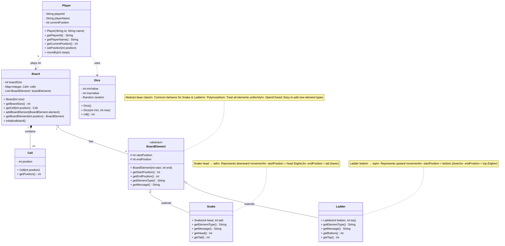
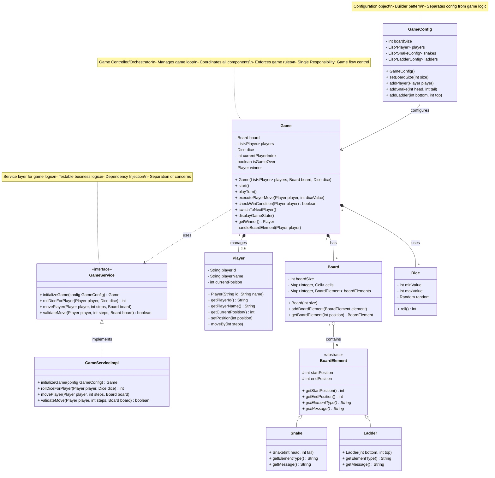

# Snake and Ladder Game - Class Diagram Steps 3-4

## STEP 3: Add Polymorphism - Snake and Ladder as Separate Classes

### 🎯 WHAT YOU ADDED IN THIS STEP?

**Goal:** Extract Snake and Ladder from the Cell class and make them proper objects with inheritance.

**Why this change?**
- Better Object-Oriented design (polymorphism)
- Easier to add different types of snakes/ladders
- More extensible for future features
- Follows Open/Closed Principle

---

### 📊 Step 3: Class Diagram



---

### 🔍 WHAT YOU ADDED?

#### 1. BoardElement Abstract Class (NEW)
**Purpose:** Common base class for all special board elements (Snake, Ladder, etc.)

**Attributes:**
- `startPosition`: Where element begins (protected - subclasses can access)
- `endPosition`: Where element leads to (protected)

**Methods:**
- `BoardElement(start, end)`: Constructor
- `getStartPosition()`: Returns start position
- `getEndPosition()`: Returns end position
- `getElementType()*`: Abstract method - subclasses must implement
- `getMessage()*`: Abstract method - returns display message

**Why abstract class?**
- Defines common structure for Snake and Ladder
- Enforces contract (subclasses must implement abstract methods)
- Enables polymorphism (treat Snake and Ladder uniformly)
- Code reuse (common attributes defined once)

---

#### 2. Snake Class (NEW)
**Purpose:** Represents a snake on the board

**Inheritance:** Extends BoardElement

**Constructor:**
- `Snake(int head, int tail)`: Creates snake from head to tail
  - Validates: head > tail
  - Calls super(head, tail)

**Methods:**
- `getElementType()`: Returns "SNAKE"
- `getMessage()`: Returns "Oops! Snake bite! Slide from {head} to {tail}"
- `getHead()`: Returns startPosition (alias for clarity)
- `getTail()`: Returns endPosition (alias for clarity)

**Design note:**
- Snake-specific methods (getHead, getTail) improve readability
- Message generation encapsulated in Snake class
- Validation happens in constructor

---

#### 3. Ladder Class (NEW)
**Purpose:** Represents a ladder on the board

**Inheritance:** Extends BoardElement

**Constructor:**
- `Ladder(int bottom, int top)`: Creates ladder from bottom to top
  - Validates: top > bottom
  - Calls super(bottom, top)

**Methods:**
- `getElementType()`: Returns "LADDER"
- `getMessage()`: Returns "Yay! Climb the ladder from {bottom} to {top}"
- `getBottom()`: Returns startPosition (alias)
- `getTop()`: Returns endPosition (alias)

---

### 🔄 WHAT IS THE CHANGE FROM STEP 2?

#### Change 1: Cell Simplified
**Before (Step 2):**
```java
class Cell {
    private int position;
    private CellType type;           // REMOVED
    private Integer destination;     // REMOVED

    public void setSnake(int tail) { ... }     // REMOVED
    public void setLadder(int top) { ... }     // REMOVED
}
```

**After (Step 3):**
```java
class Cell {
    private int position;  // Just the position number

    public int getPosition() { ... }
}
```

**Why this change?**
- Cell is now a simple value object
- Snake/Ladder logic moved to their own classes
- Cell doesn't need to know about snakes/ladders
- Better separation of concerns

---

#### Change 2: Board manages BoardElements
**Before (Step 2):**
```java
class Board {
    private Map<Integer, Cell> cells;
    // Snake and ladder logic inside Cell
}
```

**After (Step 3):**
```java
class Board {
    private Map<Integer, Cell> cells;
    private List<BoardElement> boardElements;  // NEW!

    public void addBoardElement(BoardElement element) { ... }
    public BoardElement getBoardElement(int position) { ... }
}
```

**Why this change?**
- Board now manages a collection of BoardElements
- Can iterate through all snakes/ladders easily
- Polymorphism: Board doesn't care if it's Snake or Ladder
- Easy to add new element types (Bonus, Penalty, etc.)

---

### 🎨 DESIGN DECISIONS

#### Decision 1: Abstract Class vs Interface

**Question:** Should BoardElement be an abstract class or interface?

**Chosen:** Abstract class

**Reasoning:**
```java
// Abstract class (CHOSEN)
abstract class BoardElement {
    protected int startPosition;     // Can have fields
    protected int endPosition;       // Can have fields

    public BoardElement(int start, int end) {  // Can have constructor
        this.startPosition = start;
        this.endPosition = end;
    }

    public abstract String getMessage();  // Force implementation
}

// Interface (NOT chosen)
interface IBoardElement {
    // Cannot have fields
    // Cannot have constructor
    int getStartPosition();
    int getEndPosition();
    String getMessage();
}
```

**Why abstract class?**
- Snake and Ladder share common DATA (startPosition, endPosition)
- Want to reuse code (constructor validation)
- Need protected fields (subclass access)
- IS-A relationship (Snake IS-A BoardElement)

**When to use interface:**
- No shared data, only behavior
- Multiple inheritance needed
- Contract definition only

---

#### Decision 2: Composition (Board has BoardElements)

**Notation:** `Board "1" o-- "N" BoardElement : has`

**What it means:**
- Board HAS BoardElements (aggregation)
- BoardElements can exist independently
- Weaker ownership than composition
- Open diamond symbol (◇)

**In code:**
```java
class Board {
    private List<BoardElement> boardElements = new ArrayList<>();

    public void addBoardElement(BoardElement element) {
        // Board receives pre-created elements
        this.boardElements.add(element);
    }
}

// Elsewhere:
Snake snake = new Snake(98, 28);  // Created outside Board
board.addBoardElement(snake);     // Board receives it
```

**Why aggregation not composition?**
- BoardElements created outside Board
- Can be reused or moved to different board
- Board doesn't control element lifecycle

---

#### Decision 3: Polymorphism Benefit

**Before (No Polymorphism):**
```java
// BAD ❌ - Need to check type everywhere
if (element instanceof Snake) {
    Snake snake = (Snake) element;
    System.out.println("Snake from " + snake.getHead() + " to " + snake.getTail());
} else if (element instanceof Ladder) {
    Ladder ladder = (Ladder) element;
    System.out.println("Ladder from " + ladder.getBottom() + " to " + ladder.getTop());
}
```

**After (With Polymorphism):**
```java
// GOOD ✅ - Treat all elements uniformly
BoardElement element = board.getBoardElement(position);
if (element != null) {
    System.out.println(element.getMessage());  // Polymorphic call!
    player.setPosition(element.getEndPosition());
}
```

**Benefits:**
- No type checking needed
- Easy to add new element types
- Follows Open/Closed Principle
- Cleaner, more maintainable code

---

### 💻 Java Code Skeleton

```java
/**
 * Abstract base class for all board elements (Snake, Ladder, etc.).
 *
 * Responsibility: Define common structure for board elements
 *
 * Design Pattern: Template Method (common structure, specific implementation)
 */
public abstract class BoardElement {
    // ========== ATTRIBUTES ==========

    protected int startPosition;  // Where element begins
    protected int endPosition;    // Where element leads to

    // ========== CONSTRUCTOR ==========

    /**
     * Creates a board element.
     *
     * @param start Starting position
     * @param end Ending position
     */
    public BoardElement(int start, int end) {
        this.startPosition = start;
        this.endPosition = end;
    }

    // ========== CONCRETE METHODS ==========

    public int getStartPosition() {
        return this.startPosition;
    }

    public int getEndPosition() {
        return this.endPosition;
    }

    // ========== ABSTRACT METHODS ==========
    // Subclasses MUST implement these

    /**
     * Returns the type of this element.
     *
     * @return Element type (e.g., "SNAKE", "LADDER")
     */
    public abstract String getElementType();

    /**
     * Returns a display message for this element.
     *
     * @return User-friendly message
     */
    public abstract String getMessage();

    @Override
    public String toString() {
        return String.format("%s[%d → %d]", getElementType(), startPosition, endPosition);
    }
}
```

```java
/**
 * Represents a snake on the game board.
 * Snakes send players backward (downward movement).
 *
 * Responsibility: Encapsulate snake behavior
 */
public class Snake extends BoardElement {

    // ========== CONSTRUCTOR ==========

    /**
     * Creates a snake from head to tail.
     *
     * @param head Snake head position (higher value)
     * @param tail Snake tail position (lower value)
     * @throws IllegalArgumentException if head <= tail
     */
    public Snake(int head, int tail) {
        super(head, tail);

        // Validation: Snake must go downward
        if (head <= tail) {
            throw new IllegalArgumentException(
                "Snake head must be greater than tail: head=" + head + ", tail=" + tail
            );
        }
    }

    // ========== BUSINESS METHODS ==========

    @Override
    public String getElementType() {
        return "SNAKE";
    }

    @Override
    public String getMessage() {
        return String.format("Oops! Snake bite! Slide from %d to %d",
                           getHead(), getTail());
    }

    /**
     * Convenience method: Returns snake head.
     * Alias for getStartPosition() with better semantics.
     */
    public int getHead() {
        return this.startPosition;
    }

    /**
     * Convenience method: Returns snake tail.
     * Alias for getEndPosition() with better semantics.
     */
    public int getTail() {
        return this.endPosition;
    }
}
```

```java
/**
 * Represents a ladder on the game board.
 * Ladders send players forward (upward movement).
 *
 * Responsibility: Encapsulate ladder behavior
 */
public class Ladder extends BoardElement {

    // ========== CONSTRUCTOR ==========

    /**
     * Creates a ladder from bottom to top.
     *
     * @param bottom Ladder bottom position (lower value)
     * @param top Ladder top position (higher value)
     * @throws IllegalArgumentException if top <= bottom
     */
    public Ladder(int bottom, int top) {
        super(bottom, top);

        // Validation: Ladder must go upward
        if (top <= bottom) {
            throw new IllegalArgumentException(
                "Ladder top must be greater than bottom: bottom=" + bottom + ", top=" + top
            );
        }
    }

    // ========== BUSINESS METHODS ==========

    @Override
    public String getElementType() {
        return "LADDER";
    }

    @Override
    public String getMessage() {
        return String.format("Yay! Climb the ladder from %d to %d",
                           getBottom(), getTop());
    }

    /**
     * Convenience method: Returns ladder bottom.
     * Alias for getStartPosition() with better semantics.
     */
    public int getBottom() {
        return this.startPosition;
    }

    /**
     * Convenience method: Returns ladder top.
     * Alias for getEndPosition() with better semantics.
     */
    public int getTop() {
        return this.endPosition;
    }
}
```

**Updated Board class:**
```java
import java.util.*;

public class Board {
    private final int boardSize;
    private Map<Integer, Cell> cells;
    private Map<Integer, BoardElement> boardElements;  // position → element

    public Board(int size) {
        this.boardSize = size;
        this.cells = new HashMap<>();
        this.boardElements = new HashMap<>();
        initializeBoard();
    }

    private void initializeBoard() {
        for (int i = 1; i <= boardSize; i++) {
            cells.put(i, new Cell(i));
        }
    }

    /**
     * Adds a board element (snake or ladder) to the board.
     *
     * @param element BoardElement to add
     * @throws IllegalArgumentException if position already has an element
     */
    public void addBoardElement(BoardElement element) {
        int startPos = element.getStartPosition();

        // Check if position already occupied
        if (boardElements.containsKey(startPos)) {
            throw new IllegalArgumentException(
                "Position " + startPos + " already has a " +
                boardElements.get(startPos).getElementType()
            );
        }

        boardElements.put(startPos, element);
    }

    /**
     * Gets the board element at specified position.
     *
     * @param position Position to check
     * @return BoardElement if exists, null otherwise
     */
    public BoardElement getBoardElement(int position) {
        return boardElements.get(position);
    }

    public int getBoardSize() {
        return this.boardSize;
    }

    public Cell getCell(int position) {
        return cells.get(position);
    }
}
```

---

## STEP 4: Add Game Controller and Service Layer

### 🎯 WHAT YOU ADDED IN THIS STEP?

**Goal:** Create the orchestrator that manages game flow and coordinates all components.

**Why this change?**
- Need something to control game loop
- Coordinate Player, Board, Dice interactions
- Enforce game rules
- Manage turn rotation

---

### 📊 Step 4: Class Diagram



---

### 🔍 WHAT YOU ADDED?

#### 1. Game Class (NEW) - The Orchestrator
**Purpose:** Main controller that manages the entire game

**Attributes:**
- `board`: The game board (composition - Game owns Board)
- `players`: List of all players (composition - Game manages Players)
- `dice`: Dice for rolling (composition)
- `currentPlayerIndex`: Index of current player (0-based)
- `isGameOver`: Flag indicating if game ended
- `winner`: The winning player (null if game ongoing)

**Methods:**
- `Game(players, board, dice)`: Constructor
- `start()`: Starts the game loop
- `playTurn()`: Executes one complete turn
- `executePlayerMove(player, diceValue)`: Moves player and handles elements
- `checkWinCondition(player)`: Checks if player won
- `switchToNextPlayer()`: Moves to next player's turn
- `displayGameState()`: Shows current state
- `getWinner()`: Returns winner
- `handleBoardElement(player)`: Private - handles snake/ladder

**Why Game class?**
- **Orchestration**: Coordinates Player, Board, Dice
- **Game Loop**: Manages turn-by-turn flow
- **Rule Enforcement**: Validates moves, checks win
- **Single Entry Point**: Main class for game execution

---

#### 2. GameService Interface (NEW) - Business Logic Layer
**Purpose:** Defines game business logic operations

**Methods:**
- `initializeGame(config)`: Creates and configures game
- `rollDiceForPlayer(player, dice)`: Handles dice rolling logic
- `movePlayer(player, steps, board)`: Handles movement logic
- `validateMove(player, steps, board)`: Validates if move is legal

**Why interface?**
- **Testability**: Can mock for unit tests
- **Dependency Inversion**: Game depends on interface, not implementation
- **Flexibility**: Can swap implementations

---

#### 3. GameServiceImpl Class (NEW) - Implementation
**Purpose:** Implements game business logic

**Why separate implementation?**
- Follows Dependency Inversion Principle
- Easy to test (can inject different implementations)
- Can have multiple implementations (e.g., OnlineGameService, LocalGameService)

---

#### 4. GameConfig Class (NEW) - Configuration Object
**Purpose:** Holds game configuration data

**Attributes:**
- `boardSize`: Size of board
- `players`: List of players
- `snakes`: Snake configurations
- `ladders`: Ladder configurations

**Why GameConfig?**
- **Separation**: Config separate from game logic
- **Builder Pattern**: Can build complex configurations
- **Flexibility**: Easy to create different game setups
- **Validation**: Validate config before game starts

---

### 🔄 WHAT IS THE CHANGE FROM STEP 3?

#### Change 1: Added Orchestration Layer
**Before (Step 3):**
- Had individual components (Player, Board, Dice)
- No coordinator
- No game flow logic

**After (Step 4):**
- Game class orchestrates everything
- Manages turn rotation
- Controls game loop
- Coordinates component interactions

---

#### Change 2: Added Service Layer
**Before:** Business logic scattered

**After:** Centralized in GameService
- Easier to test
- Reusable logic
- Clear separation of concerns

---

### 🎨 DESIGN DECISIONS

#### Decision 1: Game owns Board and Dice (Composition)

**Notation:** `Game "1" *-- "1" Board : has`

**What it means:**
- Game OWNS Board (filled diamond ◆)
- Board cannot exist without Game
- When Game is destroyed, Board is too
- Strong ownership

**In code:**
```java
class Game {
    private Board board;  // Game creates and owns board
    private Dice dice;    // Game creates and owns dice

    public Game(List<Player> players, Board board, Dice dice) {
        this.board = board;      // Could also create here
        this.dice = dice;
        this.players = new ArrayList<>(players);
    }
}
```

---

#### Decision 2: Service Interface for Testability

**Without interface (Hard to test):**
```java
class Game {
    public void playTurn() {
        int roll = new Dice().roll();  // Hard-coded dependency
        // Hard to test!
    }
}
```

**With interface (Easy to test):**
```java
class Game {
    private GameService service;

    public Game(..., GameService service) {
        this.service = service;  // Dependency Injection
    }

    public void playTurn() {
        int roll = service.rollDiceForPlayer(currentPlayer, dice);
        // Can inject mock service for testing!
    }
}
```

---

### 💻 Java Code Skeleton

```java
import java.util.*;

/**
 * Main game controller that orchestrates the Snake and Ladder game.
 *
 * Responsibility: Manage game flow and coordinate components
 *
 * Design Pattern: Facade (provides simple interface to complex subsystem)
 */
public class Game {
    // ========== ATTRIBUTES ==========

    private Board board;
    private List<Player> players;
    private Dice dice;
    private int currentPlayerIndex;
    private boolean isGameOver;
    private Player winner;

    // ========== CONSTRUCTOR ==========

    /**
     * Creates a new game instance.
     *
     * @param players List of players (minimum 2)
     * @param board Game board
     * @param dice Dice for rolling
     * @throws IllegalArgumentException if less than 2 players
     */
    public Game(List<Player> players, Board board, Dice dice) {
        if (players == null || players.size() < 2) {
            throw new IllegalArgumentException("Need at least 2 players");
        }

        this.players = new ArrayList<>(players);
        this.board = board;
        this.dice = dice;
        this.currentPlayerIndex = 0;
        this.isGameOver = false;
        this.winner = null;
    }

    // ========== GAME FLOW METHODS ==========

    /**
     * Starts the game loop.
     * Continues until a player wins.
     */
    public void start() {
        System.out.println("========================================");
        System.out.println("🎮 Snake and Ladder Game Started! 🎮");
        System.out.println("========================================\n");

        displayGameState();

        while (!isGameOver) {
            playTurn();
        }

        announceWinner();
    }

    /**
     * Executes one complete turn for current player.
     */
    public void playTurn() {
        Player currentPlayer = players.get(currentPlayerIndex);

        System.out.println("\n========================================");
        System.out.println(currentPlayer.getPlayerName() + "'s turn");
        System.out.println("========================================");
        System.out.println("Press Enter to roll the dice...");

        // In real implementation, wait for user input
        // new Scanner(System.in).nextLine();

        // Roll dice
        int diceValue = dice.roll();
        System.out.println("🎲 Rolled: " + diceValue);

        // Execute move
        executePlayerMove(currentPlayer, diceValue);

        // Check win condition
        if (checkWinCondition(currentPlayer)) {
            this.isGameOver = true;
            this.winner = currentPlayer;
            return;
        }

        // If rolled 6, give extra turn
        if (diceValue == 6) {
            System.out.println("🎉 You rolled a 6! Go again!");
            // Don't switch player
        } else {
            switchToNextPlayer();
        }

        displayGameState();
    }

    /**
     * Moves player and handles board elements.
     *
     * @param player Player to move
     * @param diceValue Dice roll value
     */
    private void executePlayerMove(Player player, int diceValue) {
        int currentPos = player.getCurrentPosition();
        int newPos = currentPos + diceValue;

        // Check if exceeds board
        if (newPos > board.getBoardSize()) {
            System.out.println("❌ Need exact number to win! Staying at " + currentPos);
            return;
        }

        // Move player
        player.setPosition(newPos);
        System.out.println("📍 Moved from " + currentPos + " → " + newPos);

        // Check for snake or ladder
        handleBoardElement(player);
    }

    /**
     * Handles snake or ladder at player's position.
     *
     * @param player Player to check
     */
    private void handleBoardElement(Player player) {
        int position = player.getCurrentPosition();
        BoardElement element = board.getBoardElement(position);

        if (element != null) {
            System.out.println(element.getMessage());
            player.setPosition(element.getEndPosition());
            System.out.println("📍 New position: " + player.getCurrentPosition());
        }
    }

    /**
     * Checks if player has won the game.
     *
     * @param player Player to check
     * @return true if player reached position 100
     */
    private boolean checkWinCondition(Player player) {
        return player.getCurrentPosition() == board.getBoardSize();
    }

    /**
     * Switches to the next player's turn.
     */
    private void switchToNextPlayer() {
        currentPlayerIndex = (currentPlayerIndex + 1) % players.size();
    }

    /**
     * Displays current game state.
     */
    private void displayGameState() {
        System.out.println("\n📊 Current Positions:");
        System.out.println("========================================");
        for (Player player : players) {
            String marker = (player == players.get(currentPlayerIndex)) ? " ← CURRENT" : "";
            System.out.printf("  %s: Position %d%s\n",
                            player.getPlayerName(),
                            player.getCurrentPosition(),
                            marker);
        }
        System.out.println("========================================");
    }

    /**
     * Announces the winner.
     */
    private void announceWinner() {
        System.out.println("\n\n🎉🎉🎉🎉🎉🎉🎉🎉🎉🎉🎉🎉🎉");
        System.out.println("  CONGRATULATIONS " + winner.getPlayerName().toUpperCase() + "!");
        System.out.println("  You won the game!");
        System.out.println("🎉🎉🎉🎉🎉🎉🎉🎉🎉🎉🎉🎉🎉");
    }

    public Player getWinner() {
        return this.winner;
    }

    public boolean isGameOver() {
        return this.isGameOver;
    }
}
```

```java
/**
 * Service interface for game business logic.
 *
 * Design: Dependency Inversion Principle
 */
public interface GameService {
    Game initializeGame(GameConfig config);
    int rollDiceForPlayer(Player player, Dice dice);
    void movePlayer(Player player, int steps, Board board);
    boolean validateMove(Player player, int steps, Board board);
}
```

```java
/**
 * Configuration object for game setup.
 *
 * Design Pattern: Builder
 */
public class GameConfig {
    private int boardSize = 100;
    private List<Player> players = new ArrayList<>();
    private List<int[]> snakes = new ArrayList<>();  // [head, tail]
    private List<int[]> ladders = new ArrayList<>(); // [bottom, top]

    public GameConfig setBoardSize(int size) {
        this.boardSize = size;
        return this;
    }

    public GameConfig addPlayer(Player player) {
        this.players.add(player);
        return this;
    }

    public GameConfig addSnake(int head, int tail) {
        this.snakes.add(new int[]{head, tail});
        return this;
    }

    public GameConfig addLadder(int bottom, int top) {
        this.ladders.add(new int[]{bottom, top});
        return this;
    }

    // Getters
    public int getBoardSize() { return boardSize; }
    public List<Player> getPlayers() { return players; }
    public List<int[]> getSnakes() { return snakes; }
    public List<int[]> getLadders() { return ladders; }
}
```

---

## 📝 Summary of Steps 3-4

### Step 3: Polymorphism
- Added BoardElement abstract class
- Created Snake and Ladder subclasses
- Enabled polymorphic behavior
- Improved extensibility

### Step 4: Game Controller
- Added Game orchestrator class
- Added GameService interface
- Added GameConfig for configuration
- Implemented complete game flow

### Design Principles Applied:
- **Inheritance**: Snake and Ladder extend BoardElement
- **Polymorphism**: Treat all BoardElements uniformly
- **Composition**: Game owns Board, Players, Dice
- **Dependency Inversion**: Game depends on GameService interface
- **Single Responsibility**: Each class has one clear purpose

### Next: Step 5 will add Factories and Strategies for maximum flexibility!
