# Snake and Ladder Game - Final Class Design (Step 5 + Complete Architecture)

## STEP 5: Add Factories and Strategies

### 🎯 WHAT YOU ADDED IN THIS STEP?

**Goal:** Add creational patterns (Factory) and behavioral patterns (Strategy) for maximum flexibility.

**Why this change?**
- Centralize object creation (Factory Pattern)
- Support different dice types (Strategy Pattern)
- Make system highly extensible
- Follow Open/Closed Principle

---

### 📊 Step 5: Class Diagram with Patterns


---

### 💻 Java Code - Strategy Pattern

```java
/**
 * Strategy interface for different dice rolling behaviors.
 *
 * Design Pattern: Strategy
 * Purpose: Allow different dice implementations
 */
public interface DiceStrategy {
    /**
     * Rolls the dice and returns a value.
     *
     * @return Dice roll result
     */
    int roll();
}
```

```java
import java.util.Random;

/**
 * Standard 6-sided dice (1-6).
 */
public class StandardDice implements DiceStrategy {
    private final Random random;

    public StandardDice() {
        this.random = new Random();
    }

    @Override
    public int roll() {
        return 1 + random.nextInt(6); // 1 to 6
    }
}
```

```java
/**
 * Loaded dice that always returns a fixed value.
 * Useful for testing!
 */
public class LoadedDice implements DiceStrategy {
    private final int fixedValue;

    public LoadedDice(int value) {
        if (value < 1 || value > 6) {
            throw new IllegalArgumentException("Dice value must be 1-6");
        }
        this.fixedValue = value;
    }

    @Override
    public int roll() {
        return fixedValue;
    }
}
```

```java
import java.util.Random;

/**
 * Custom dice with configurable range.
 */
public class CustomRangeDice implements DiceStrategy {
    private final int min;
    private final int max;
    private final Random random;

    public CustomRangeDice(int min, int max) {
        if (min >= max) {
            throw new IllegalArgumentException("Min must be < max");
        }
        this.min = min;
        this.max = max;
        this.random = new Random();
    }

    @Override
    public int roll() {
        return min + random.nextInt(max - min + 1);
    }
}
```

---

### 💻 Java Code - Factory Pattern

```java
/**
 * Factory for creating Game instances.
 *
 * Design Pattern: Factory Method
 * Purpose: Centralize game creation and hide complexity
 */
public class GameFactory {

    /**
     * Creates a standard game with default board and dice.
     *
     * @param players List of players
     * @return Configured game
     */
    public static Game createStandardGame(List<Player> players) {
        Board board = BoardFactory.createStandardBoard();
        DiceStrategy dice = DiceFactory.createStandardDice();

        return new GameBuilder()
                .setPlayers(players)
                .setBoard(board)
                .setDiceStrategy(dice)
                .build();
    }

    /**
     * Creates a game with custom configuration.
     *
     * @param config Game configuration
     * @return Configured game
     */
    public static Game createCustomGame(GameConfig config) {
        Board board = BoardFactory.createBoardWithConfig(config);
        DiceStrategy dice = DiceFactory.createStandardDice();

        return new GameBuilder()
                .setPlayers(config.getPlayers())
                .setBoard(board)
                .setDiceStrategy(dice)
                .build();
    }

    /**
     * Creates a test game with loaded dice for deterministic testing.
     *
     * @param players Players
     * @return Test game
     */
    public static Game createTestGame(List<Player> players) {
        Board board = BoardFactory.createStandardBoard();
        DiceStrategy dice = new LoadedDice(3); // Always rolls 3

        return new GameBuilder()
                .setPlayers(players)
                .setBoard(board)
                .setDiceStrategy(dice)
                .build();
    }
}
```

```java
/**
 * Factory for creating Board instances.
 */
public class BoardFactory {

    /**
     * Creates standard 10x10 board with classic snake/ladder configuration.
     */
    public static Board createStandardBoard() {
        Board board = new Board(100);

        // Add standard snakes
        board.addBoardElement(new Snake(99, 54));
        board.addBoardElement(new Snake(95, 75));
        board.addBoardElement(new Snake(92, 88));
        board.addBoardElement(new Snake(89, 68));
        board.addBoardElement(new Snake(74, 53));
        board.addBoardElement(new Snake(64, 60));
        board.addBoardElement(new Snake(62, 19));
        board.addBoardElement(new Snake(49, 11));
        board.addBoardElement(new Snake(46, 25));
        board.addBoardElement(new Snake(16, 6));

        // Add standard ladders
        board.addBoardElement(new Ladder(2, 38));
        board.addBoardElement(new Ladder(7, 14));
        board.addBoardElement(new Ladder(8, 31));
        board.addBoardElement(new Ladder(15, 26));
        board.addBoardElement(new Ladder(21, 42));
        board.addBoardElement(new Ladder(28, 84));
        board.addBoardElement(new Ladder(36, 44));
        board.addBoardElement(new Ladder(51, 67));
        board.addBoardElement(new Ladder(71, 91));
        board.addBoardElement(new Ladder(78, 98));

        return board;
    }

    /**
     * Creates board with custom size.
     */
    public static Board createCustomBoard(int size) {
        return new Board(size);
    }

    /**
     * Creates board from configuration.
     */
    public static Board createBoardWithConfig(GameConfig config) {
        Board board = new Board(config.getBoardSize());

        // Add snakes from config
        for (int[] snake : config.getSnakes()) {
            board.addBoardElement(new Snake(snake[0], snake[1]));
        }

        // Add ladders from config
        for (int[] ladder : config.getLadders()) {
            board.addBoardElement(new Ladder(ladder[0], ladder[1]));
        }

        return board;
    }
}
```

```java
/**
 * Factory for creating DiceStrategy instances.
 */
public class DiceFactory {

    public static DiceStrategy createStandardDice() {
        return new StandardDice();
    }

    public static DiceStrategy createLoadedDice(int value) {
        return new LoadedDice(value);
    }

    public static DiceStrategy createCustomDice(int min, int max) {
        return new CustomRangeDice(min, max);
    }
}
```

---

### 💻 Java Code - Builder Pattern

```java
import java.util.*;

/**
 * Builder for constructing Game instances.
 *
 * Design Pattern: Builder
 * Purpose: Flexible and readable game construction
 */
public class GameBuilder {
    private List<Player> players;
    private Board board;
    private DiceStrategy diceStrategy;

    public GameBuilder() {
        // Initialize with defaults
        this.players = new ArrayList<>();
        this.board = null;
        this.diceStrategy = new StandardDice();
    }

    public GameBuilder setPlayers(List<Player> players) {
        this.players = new ArrayList<>(players);
        return this;
    }

    public GameBuilder addPlayer(Player player) {
        this.players.add(player);
        return this;
    }

    public GameBuilder setBoard(Board board) {
        this.board = board;
        return this;
    }

    public GameBuilder setDiceStrategy(DiceStrategy diceStrategy) {
        this.diceStrategy = diceStrategy;
        return this;
    }

    /**
     * Builds and returns the Game instance.
     *
     * @return Configured game
     * @throws IllegalStateException if required fields missing
     */
    public Game build() {
        // Validation
        if (players.size() < 2) {
            throw new IllegalStateException("Need at least 2 players");
        }

        if (board == null) {
            throw new IllegalStateException("Board is required");
        }

        return new Game(this);
    }

    // Package-private getters for Game constructor
    List<Player> getPlayers() { return players; }
    Board getBoard() { return board; }
    DiceStrategy getDiceStrategy() { return diceStrategy; }
}
```

**Updated Game class to use Builder:**

```java
public class Game {
    private final Board board;
    private final List<Player> players;
    private final DiceStrategy diceStrategy;
    private int currentPlayerIndex;
    private boolean isGameOver;
    private Player winner;

    // Private constructor - only Builder can create
    Game(GameBuilder builder) {
        this.board = builder.getBoard();
        this.players = builder.getPlayers();
        this.diceStrategy = builder.getDiceStrategy();
        this.currentPlayerIndex = 0;
        this.isGameOver = false;
        this.winner = null;
    }

    // ... rest of Game methods use this.diceStrategy.roll()
}
```

---

## FINAL COMPLETE CLASS DIAGRAM

```mermaid
classDiagram
    %% ==================== GAME CORE ====================
    class Game {
        - Board board
        - List~Player~ players
        - DiceStrategy diceStrategy
        - int currentPlayerIndex
        - boolean isGameOver
        - Player winner

        - Game(builder GameBuilder)
        + start() void
        + playTurn() void
        - executePlayerMove(Player, int) void
        - handleBoardElement(Player) void
        - checkWinCondition(Player) boolean
        - switchToNextPlayer() void
        - displayGameState() void
        + getWinner() Player
    }

    class Player {
        - String playerId
        - String playerName
        - int currentPosition

        + Player(id String, name String)
        + getPlayerId() String
        + getPlayerName() String
        + getCurrentPosition() int
        + setPosition(position int) void
        + moveBy(steps int) void
        + toString() String
    }

    class Board {
        - int boardSize
        - Map~Integer, Cell~ cells
        - Map~Integer, BoardElement~ boardElements

        + Board(size int)
        - initializeBoard() void
        + getBoardSize() int
        + getCell(position int) Cell
        + addBoardElement(element BoardElement) void
        + getBoardElement(position int) BoardElement
    }

    class Cell {
        - int position

        + Cell(position int)
        + getPosition() int
        + toString() String
    }

    %% ==================== BOARD ELEMENTS ====================
    class BoardElement {
        <<abstract>>
        # int startPosition
        # int endPosition

        + BoardElement(start int, end int)
        + getStartPosition() int
        + getEndPosition() int
        + getElementType()* String
        + getMessage()* String
        + toString() String
    }

    class Snake {
        + Snake(head int, tail int)
        + getElementType() String
        + getMessage() String
        + getHead() int
        + getTail() int
    }

    class Ladder {
        + Ladder(bottom int, top int)
        + getElementType() String
        + getMessage() String
        + getBottom() int
        + getTop() int
    }

    %% ==================== DICE STRATEGY ====================
    class DiceStrategy {
        <<interface>>
        + roll()* int
    }

    class StandardDice {
        - Random random

        + StandardDice()
        + roll() int
    }

    class LoadedDice {
        - int fixedValue

        + LoadedDice(value int)
        + roll() int
    }

    class CustomRangeDice {
        - int min
        - int max
        - Random random

        + CustomRangeDice(min int, max int)
        + roll() int
    }

    %% ==================== FACTORIES ====================
    class GameFactory {
        <<factory>>
        + createStandardGame(players)$ Game
        + createCustomGame(config)$ Game
        + createTestGame(players)$ Game
    }

    class BoardFactory {
        <<factory>>
        + createStandardBoard()$ Board
        + createCustomBoard(size)$ Board
        + createBoardWithConfig(config)$ Board
    }

    class DiceFactory {
        <<factory>>
        + createStandardDice()$ DiceStrategy
        + createLoadedDice(value)$ DiceStrategy
        + createCustomDice(min, max)$ DiceStrategy
    }

    %% ==================== BUILDER ====================
    class GameBuilder {
        - List~Player~ players
        - Board board
        - DiceStrategy diceStrategy

        + GameBuilder()
        + setPlayers(players) GameBuilder
        + addPlayer(player) GameBuilder
        + setBoard(board) GameBuilder
        + setDiceStrategy(strategy) GameBuilder
        + build() Game
        ~ getPlayers() List~Player~
        ~ getBoard() Board
        ~ getDiceStrategy() DiceStrategy
    }

    %% ==================== CONFIG ====================
    class GameConfig {
        - int boardSize
        - List~Player~ players
        - List~int[]~ snakes
        - List~int[]~ ladders

        + GameConfig()
        + setBoardSize(size) GameConfig
        + addPlayer(player) GameConfig
        + addSnake(head, tail) GameConfig
        + addLadder(bottom, top) GameConfig
        + getBoardSize() int
        + getPlayers() List~Player~
        + getSnakes() List~int[]~
        + getLadders() List~int[]~
    }

    %% ==================== RELATIONSHIPS ====================

    %% Composition
    Game "1" *-- "1" Board : owns
    Game "1" *-- "2..N" Player : manages
    Board "1" *-- "100" Cell : contains

    %% Aggregation
    Board "1" o-- "N" BoardElement : has

    %% Association
    Game --> DiceStrategy : uses

    %% Inheritance
    BoardElement <|-- Snake : extends
    BoardElement <|-- Ladder : extends
    DiceStrategy <|.. StandardDice : implements
    DiceStrategy <|.. LoadedDice : implements
    DiceStrategy <|.. CustomRangeDice : implements

    %% Dependency
    GameFactory ..> Game : creates
    GameFactory ..> GameBuilder : uses
    GameFactory ..> GameConfig : uses
    BoardFactory ..> Board : creates
    BoardFactory ..> BoardElement : creates
    DiceFactory ..> DiceStrategy : creates
    GameBuilder ..> Game : builds

    %% Styling
    class Game,Player,Board,Cell {
        stroke:#2E7D32,stroke-width:2px
    }

    class BoardElement,Snake,Ladder {
        stroke:#F57C00,stroke-width:2px
    }

    class DiceStrategy,StandardDice,LoadedDice,CustomRangeDice {
        stroke:#1976D2,stroke-width:2px
    }

    class GameFactory,BoardFactory,DiceFactory {
        stroke:#7B1FA2,stroke-width:2px
    }

    class GameBuilder,GameConfig {
        stroke:#C2185B,stroke-width:2px
    }
```

---

## COMPREHENSIVE LAYERED ARCHITECTURE DIAGRAM

```mermaid
graph TB
    subgraph "📱 CLIENT LAYER"
        Main["<b>Main / Console App</b><br/>────────────────<br/>Entry point<br/>User interaction<br/>Console I/O"]
    end

    subgraph "🎮 GAME CONTROLLER LAYER"
        Game["<b>Game</b><br/>────────────────<br/>- Game loop<br/>- Turn management<br/>- Rule enforcement<br/>- Win condition check<br/>────────────────<br/>🎯 Single Responsibility<br/>Orchestrates game flow"]
    end

    subgraph "🏭 FACTORY LAYER - Object Creation"
        GameFactory["<b>GameFactory</b><br/>────────────────<br/>+ createStandardGame()<br/>+ createCustomGame()<br/>+ createTestGame()<br/>────────────────<br/>🏭 Factory Pattern<br/>Centralized creation"]

        BoardFactory["<b>BoardFactory</b><br/>────────────────<br/>+ createStandardBoard()<br/>+ createCustomBoard()<br/>+ createBoardWithConfig()<br/>────────────────<br/>🏭 Factory Pattern"]

        DiceFactory["<b>DiceFactory</b><br/>────────────────<br/>+ createStandardDice()<br/>+ createLoadedDice()<br/>+ createCustomDice()<br/>────────────────<br/>🏭 Factory Pattern"]

        GameBuilder["<b>GameBuilder</b><br/>────────────────<br/>+ setPlayers()<br/>+ setBoard()<br/>+ setDiceStrategy()<br/>+ build()<br/>────────────────<br/>🔨 Builder Pattern<br/>Flexible construction"]
    end

    subgraph "🎲 STRATEGY LAYER - Behaviors"
        DiceStrategy["<b>&lt;&lt;interface&gt;&gt;<br/>DiceStrategy</b><br/>────────────────<br/>+ roll()* int"]

        StandardDice["<b>StandardDice</b><br/>────────────────<br/>1-6 random<br/>────────────────<br/>✅ Default"]

        LoadedDice["<b>LoadedDice</b><br/>────────────────<br/>Fixed value<br/>────────────────<br/>🧪 Testing"]

        CustomDice["<b>CustomRangeDice</b><br/>────────────────<br/>Custom min-max<br/>────────────────<br/>🎮 Variations"]
    end

    subgraph "📦 DOMAIN ENTITIES - Core Business Objects"
        Player["<b>Player</b><br/>────────────────<br/>- playerId<br/>- playerName<br/>- currentPosition<br/>────────────────<br/>+ moveBy(steps)<br/>+ setPosition(pos)<br/>────────────────<br/>📦 Entity<br/>Manages player state"]

        Board["<b>Board</b><br/>────────────────<br/>- boardSize<br/>- cells Map<br/>- boardElements Map<br/>────────────────<br/>+ addBoardElement()<br/>+ getBoardElement()<br/>────────────────<br/>📦 Entity<br/>Manages board state"]

        Cell["<b>Cell</b><br/>────────────────<br/>- position<br/>────────────────<br/>Simple value object"]
    end

    subgraph "🐍 BOARD ELEMENT HIERARCHY - Polymorphism"
        BoardElement["<b>&lt;&lt;abstract&gt;&gt;<br/>BoardElement</b><br/>────────────────<br/># startPosition<br/># endPosition<br/>────────────────<br/>+ getElementType()*<br/>+ getMessage()*<br/>────────────────<br/>🎯 Template Method"]

        Snake["<b>Snake</b><br/>────────────────<br/>head → tail<br/>────────────────<br/>Downward movement"]

        Ladder["<b>Ladder</b><br/>────────────────<br/>bottom → top<br/>────────────────<br/>Upward movement"]
    end

    subgraph "⚙️ CONFIGURATION LAYER"
        GameConfig["<b>GameConfig</b><br/>────────────────<br/>- boardSize<br/>- players List<br/>- snakes List<br/>- ladders List<br/>────────────────<br/>Configuration object"]
    end

    %% Client to Controller
    Main --> GameFactory
    GameFactory --> Game

    %% Factories create components
    GameFactory --> GameBuilder
    GameFactory --> BoardFactory
    GameFactory --> DiceFactory
    GameFactory --> GameConfig

    BoardFactory --> Board
    BoardFactory --> Snake
    BoardFactory --> Ladder
    DiceFactory --> DiceStrategy

    GameBuilder --> Game

    %% Strategy implementations
    DiceStrategy --> StandardDice
    DiceStrategy --> LoadedDice
    DiceStrategy --> CustomDice

    %% Game uses components
    Game --> Player
    Game --> Board
    Game --> DiceStrategy

    %% Board uses elements
    Board --> Cell
    Board --> BoardElement

    %% Inheritance
    BoardElement --> Snake
    BoardElement --> Ladder

    %% Config
    GameConfig --> GameFactory

    %% Styling
    classDef clientStyle fill:#fce4ec,stroke:#880e4f,stroke-width:2px
    classDef controllerStyle fill:#e8f5e9,stroke:#1b5e20,stroke-width:2px
    classDef factoryStyle fill:#f3e5f5,stroke:#4a148c,stroke-width:2px
    classDef strategyStyle fill:#e1f5ff,stroke:#01579b,stroke-width:2px
    classDef entityStyle fill:#fff3e0,stroke:#e65100,stroke-width:2px
    classDef elementStyle fill:#fff9c4,stroke:#f57f17,stroke-width:2px
    classDef configStyle fill:#e0f7fa,stroke:#006064,stroke-width:2px

    class Main clientStyle
    class Game controllerStyle
    class GameFactory,BoardFactory,DiceFactory,GameBuilder factoryStyle
    class DiceStrategy,StandardDice,LoadedDice,CustomDice strategyStyle
    class Player,Board,Cell entityStyle
    class BoardElement,Snake,Ladder elementStyle
    class GameConfig configStyle
```



---

## 📝 Summary of Final Design

### Design Patterns Used:
1. **Strategy Pattern**: DiceStrategy for different dice behaviors
2. **Factory Pattern**: GameFactory, BoardFactory, DiceFactory for object creation
3. **Builder Pattern**: GameBuilder for flexible game construction
4. **Template Method**: BoardElement for common structure
5. **Facade**: Game class simplifies complex subsystem

### SOLID Principles:
1. **Single Responsibility**: Each class has one clear purpose
2. **Open/Closed**: Easy to add new dice types, board elements
3. **Liskov Substitution**: Can replace DiceStrategy implementations
4. **Interface Segregation**: Small, focused interfaces
5. **Dependency Inversion**: Depend on abstractions (DiceStrategy, BoardElement)

### Key Relationships:
- **Composition** (◆): Game owns Board, Players, Cells
- **Aggregation** (◇): Board has BoardElements
- **Inheritance** (△): Snake/Ladder extend BoardElement
- **Implementation** (△--): Dice classes implement DiceStrategy
- **Dependency** (- - >): Factories create objects

**Next: We'll dive deep into these patterns and principles with detailed examples!**
