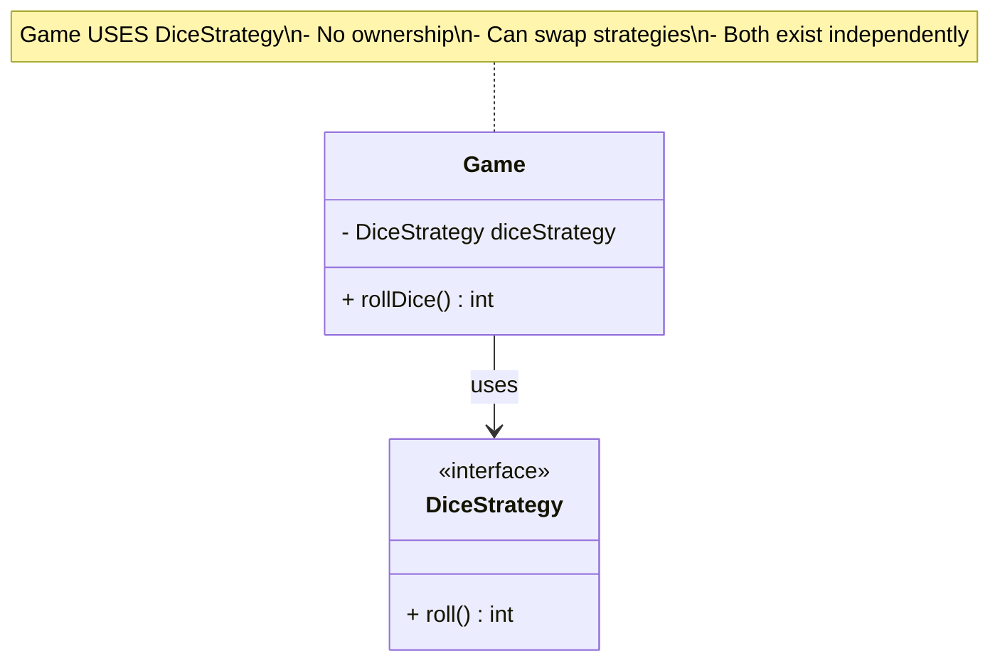
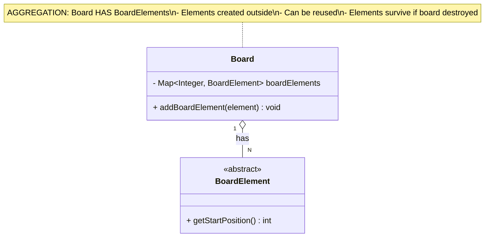
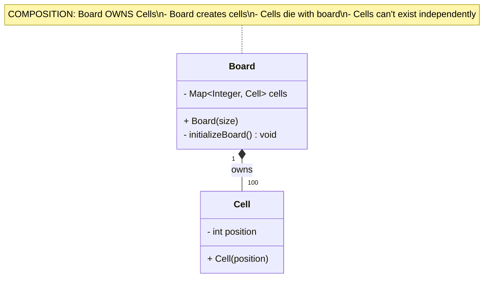
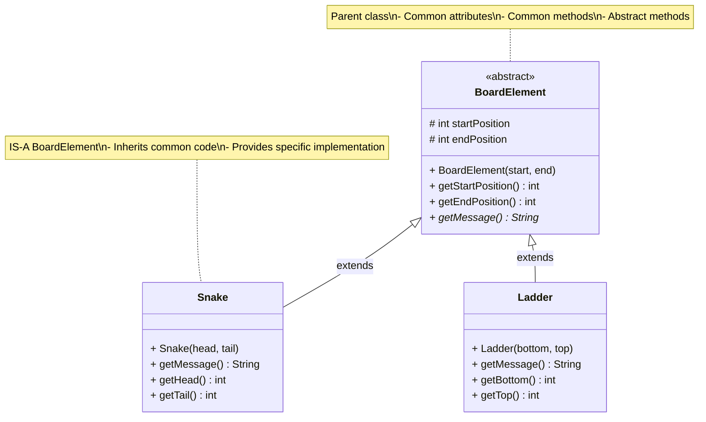
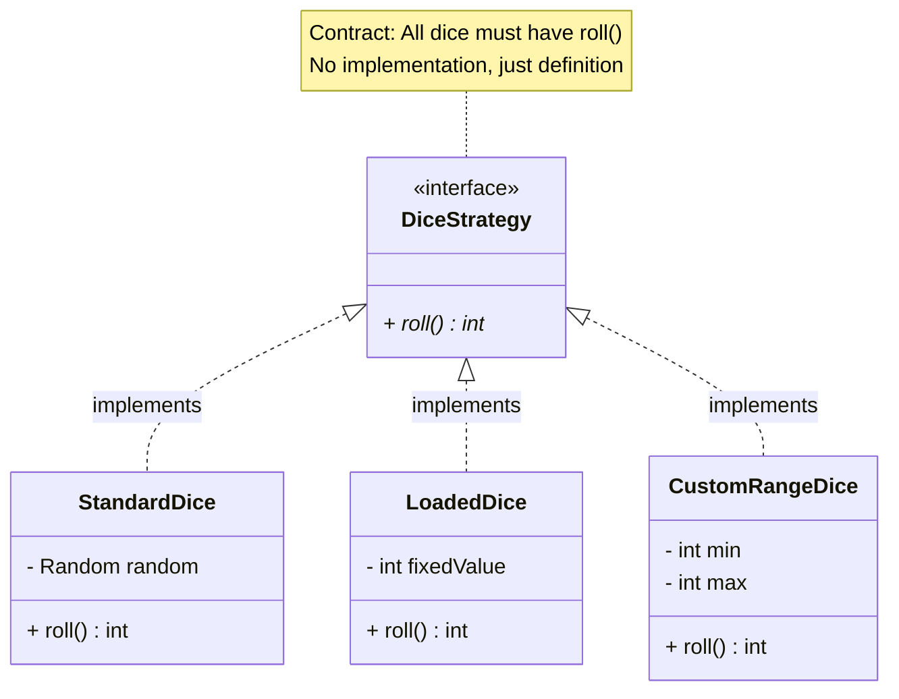

# Snake and Ladder Game - Relationships & SOLID Principles

## Part 1: UML Relationships Explained

### 📚 What are UML Relationships?

**For Beginners:** Relationships show HOW classes interact with each other. Think of them as connections between objects in your program.

---

## 1. Association

### Definition
**Association** = "Uses" or "Has-a" relationship (loose connection)

**Characteristics:**
- Class A uses Class B
- Both can exist independently
- Represented by a solid line (→)
- Can have multiplicity (1, N, *, 0..1)

### When to Use
- When one class uses another temporarily
- No ownership involved
- Both objects have independent lifecycles

### UML Notation
```
ClassA ────> ClassB
```

### Real-World Example
- Person uses Phone
- Student uses Library
- Player plays on Board

---

### Snake & Ladder Example



### Java Code Example

```java
/**
 * ASSOCIATION Example: Game uses DiceStrategy
 *
 * - Game has a reference to DiceStrategy
 * - DiceStrategy exists independently
 * - Can be passed from outside (Dependency Injection)
 */
public class Game {
    private DiceStrategy diceStrategy;  // Association

    // DiceStrategy passed from outside (not created here)
    public Game(DiceStrategy diceStrategy) {
        this.diceStrategy = diceStrategy;  // Just storing reference
    }

    public int rollDice() {
        return diceStrategy.roll();  // Using it
    }

    // Can change the strategy
    public void setDiceStrategy(DiceStrategy newStrategy) {
        this.diceStrategy = newStrategy;
    }
}

// Usage
DiceStrategy dice = new StandardDice();  // Created outside
Game game = new Game(dice);              // Just passed in
```

**Key Point:** Game doesn't create DiceStrategy, just uses it!

---

## 2. Aggregation

### Definition
**Aggregation** = "Has-a" relationship with weak ownership (◇)

**Characteristics:**
- Class A HAS Class B
- B can exist without A
- Represented by open diamond (◇)
- Weaker than composition

### When to Use
- When one class contains another
- Contained object can exist independently
- Shared ownership possible

### UML Notation
```
ClassA ◇────> ClassB
```

### Real-World Example
- Department has Employees (employees can change departments)
- Library has Books (books can move to other libraries)
- Board has BoardElements (elements can be reused)

---

### Snake & Ladder Example



### Java Code Example

```java
/**
 * AGGREGATION Example: Board has BoardElements
 *
 * - Board contains BoardElements
 * - Elements created OUTSIDE board
 * - Elements can exist independently
 */
public class Board {
    private Map<Integer, BoardElement> boardElements;

    public Board() {
        this.boardElements = new HashMap<>();
    }

    // Receives pre-created elements (NOT creating them)
    public void addBoardElement(BoardElement element) {
        boardElements.put(element.getStartPosition(), element);
    }
}

// Usage
Snake snake = new Snake(98, 28);    // Created OUTSIDE board
Ladder ladder = new Ladder(4, 14);  // Created OUTSIDE board

Board board = new Board();
board.addBoardElement(snake);       // Board receives them
board.addBoardElement(ladder);

// Elements exist independently
// Can add same element to different board!
Board anotherBoard = new Board();
anotherBoard.addBoardElement(snake);  // Reusing same snake!
```

**Key Point:** Board doesn't create BoardElements, receives them from outside!

---

## 3. Composition

### Definition
**Composition** = "Part-of" relationship with strong ownership (◆)

**Characteristics:**
- Class A OWNS Class B
- B cannot exist without A
- Represented by filled diamond (◆)
- Stronger than aggregation
- Lifecycle dependency

### When to Use
- When one class completely owns another
- Contained object has no meaning without container
- Parts cannot be shared
- Tight coupling acceptable

### UML Notation
```
ClassA ◆────> ClassB
```

### Real-World Example
- House has Rooms (room can't exist without house)
- Car has Engine (engine is part of car)
- Board has Cells (cells are part of board)

---

### Snake & Ladder Example



### Java Code Example

```java
/**
 * COMPOSITION Example: Board owns Cells
 *
 * - Board creates Cells
 * - Cells are part of Board
 * - Cells die when Board dies
 */
public class Board {
    private Map<Integer, Cell> cells;  // Composition

    public Board(int size) {
        this.cells = new HashMap<>();
        initializeBoard(size);  // Board CREATES cells
    }

    private void initializeBoard(int size) {
        for (int i = 1; i <= size; i++) {
            // Board creates each cell
            cells.put(i, new Cell(i));
        }
    }

    // Cells are private, can't be accessed outside
    public Cell getCell(int position) {
        return cells.get(position);  // Returns reference, not ownership
    }
}

// Usage
Board board = new Board(100);  // Board creates all 100 cells internally

// When board is destroyed, all cells are destroyed too!
board = null;  // Cells gone!

// You CANNOT do this (cells are private to board):
// Cell cell = new Cell(5);
// board.addCell(cell);  // NO! Board creates its own cells
```

**Key Difference:**

| Aggregation (◇) | Composition (◆) |
|-----------------|------------------|
| Objects passed in | Objects created internally |
| Can exist independently | Cannot exist independently |
| Weak ownership | Strong ownership |
| `board.add(snake)` | `new Board()` creates cells |

---

## 4. Inheritance (Generalization)

### Definition
**Inheritance** = "Is-a" relationship (△)

**Characteristics:**
- Subclass IS-A type of Superclass
- Code reuse through inheritance
- Represented by hollow triangle (△)
- Supports polymorphism

### When to Use
- When there's a clear "is-a" relationship
- Want to reuse code from parent
- Need polymorphic behavior
- Share common attributes/methods

### UML Notation
```
Subclass ────▷ Superclass
```

### Real-World Example
- Dog is-a Animal
- Car is-a Vehicle
- Snake is-a BoardElement

---

### Snake & Ladder Example



### Java Code Example

```java
/**
 * INHERITANCE Example: Snake and Ladder extend BoardElement
 *
 * - Code reuse (common attributes in parent)
 * - Polymorphism (treat all as BoardElement)
 * - Specialization (specific behavior in children)
 */

// PARENT CLASS
public abstract class BoardElement {
    protected int startPosition;  // Shared by all children
    protected int endPosition;    // Shared by all children

    // Common constructor
    public BoardElement(int start, int end) {
        this.startPosition = start;
        this.endPosition = end;
    }

    // Common methods (inherited by all children)
    public int getStartPosition() {
        return startPosition;
    }

    public int getEndPosition() {
        return endPosition;
    }

    // Abstract method (children MUST implement)
    public abstract String getMessage();
}

// CHILD CLASS 1
public class Snake extends BoardElement {
    // Inherits: startPosition, endPosition, getStartPosition(), getEndPosition()

    public Snake(int head, int tail) {
        super(head, tail);  // Call parent constructor

        if (head <= tail) {
            throw new IllegalArgumentException("Snake head must be > tail");
        }
    }

    // Must implement abstract method
    @Override
    public String getMessage() {
        return "Oops! Snake! Slide from " + startPosition + " to " + endPosition;
    }

    // Additional methods specific to Snake
    public int getHead() {
        return startPosition;
    }

    public int getTail() {
        return endPosition;
    }
}

// CHILD CLASS 2
public class Ladder extends BoardElement {
    // Inherits: startPosition, endPosition, getStartPosition(), getEndPosition()

    public Ladder(int bottom, int top) {
        super(bottom, top);  // Call parent constructor

        if (bottom >= top) {
            throw new IllegalArgumentException("Ladder bottom must be < top");
        }
    }

    // Must implement abstract method
    @Override
    public String getMessage() {
        return "Yay! Ladder! Climb from " + startPosition + " to " + endPosition;
    }

    // Additional methods specific to Ladder
    public int getBottom() {
        return startPosition;
    }

    public int getTop() {
        return endPosition;
    }
}

// POLYMORPHISM in action!
public class Board {
    private Map<Integer, BoardElement> elements;

    public void handleElement(Player player) {
        BoardElement element = elements.get(player.getPosition());

        if (element != null) {
            // Polymorphic call - works for both Snake and Ladder!
            System.out.println(element.getMessage());
            player.setPosition(element.getEndPosition());
        }
    }
}
```

**Benefits:**
1. **Code Reuse:** Don't repeat startPosition/endPosition
2. **Polymorphism:** Treat Snake and Ladder uniformly
3. **Maintainability:** Change common logic in one place
4. **Extensibility:** Easy to add new BoardElement types

---

## 5. Realization (Implementation)

### Definition
**Realization** = Class implements an interface (△--)

**Characteristics:**
- Class provides concrete implementation of interface
- Interface defines contract
- Represented by dashed line with hollow triangle
- Supports polymorphism

### When to Use
- Define a contract (interface)
- Multiple implementations needed
- Want complete abstraction
- Follows Dependency Inversion Principle

### UML Notation
```
ConcreteClass ----▷ Interface
```

---

### Snake & Ladder Example



### Java Code Example

```java
/**
 * REALIZATION Example: Dice classes implement DiceStrategy
 *
 * - Interface defines contract
 * - Classes provide specific implementation
 * - Enables polymorphism and dependency inversion
 */

// INTERFACE (Contract)
public interface DiceStrategy {
    int roll();  // All dice MUST have this method
}

// IMPLEMENTATION 1
public class StandardDice implements DiceStrategy {
    private Random random = new Random();

    @Override
    public int roll() {
        return 1 + random.nextInt(6);  // 1-6
    }
}

// IMPLEMENTATION 2
public class LoadedDice implements DiceStrategy {
    private int fixedValue;

    public LoadedDice(int value) {
        this.fixedValue = value;
    }

    @Override
    public int roll() {
        return fixedValue;  // Always same value
    }
}

// IMPLEMENTATION 3
public class CustomRangeDice implements DiceStrategy {
    private int min;
    private int max;
    private Random random = new Random();

    public CustomRangeDice(int min, int max) {
        this.min = min;
        this.max = max;
    }

    @Override
    public int roll() {
        return min + random.nextInt(max - min + 1);
    }
}

// USAGE: Polymorphism!
public class Game {
    private DiceStrategy dice;  // Depends on INTERFACE, not implementation

    public Game(DiceStrategy dice) {
        this.dice = dice;  // Can accept ANY implementation!
    }

    public void playTurn() {
        int value = dice.roll();  // Polymorphic call!
        // Works with StandardDice, LoadedDice, CustomRangeDice!
    }
}

// Create game with different dice
Game game1 = new Game(new StandardDice());
Game game2 = new Game(new LoadedDice(6));
Game game3 = new Game(new CustomRangeDice(1, 12));
```

---

## 6. Dependency

### Definition
**Dependency** = Class uses another class temporarily (- - >)

**Characteristics:**
- Weakest relationship
- Used as method parameter or local variable
- No instance variable
- Represented by dashed arrow

### When to Use
- When class needs another class briefly
- Not stored as instance variable
- Method-level usage only

### UML Notation
```
ClassA - - - > ClassB
```

### Snake & Ladder Example

```java
/**
 * DEPENDENCY Example: GameFactory depends on various classes
 *
 * - Uses classes to create objects
 * - Doesn't store them as instance variables
 * - Temporary usage only
 */

public class GameFactory {
    // NO instance variables

    // Uses Player, Board, DiceStrategy only as local variables
    public static Game createStandardGame(List<Player> players) {
        // Create dependencies temporarily
        Board board = BoardFactory.createStandardBoard();  // Dependency
        DiceStrategy dice = new StandardDice();            // Dependency

        // Build and return game
        return new GameBuilder()
                .setPlayers(players)
                .setBoard(board)
                .setDiceStrategy(dice)
                .build();

        // board and dice are local variables, not stored!
    }
}
```

---

## Relationship Comparison Table

| Relationship | Strength | Symbol | Ownership | Lifecycle | Example |
|--------------|----------|--------|-----------|-----------|---------|
| **Dependency** | Weakest | `- - >` | None | Independent | Factory → Game |
| **Association** | Weak | `──>` | None | Independent | Game → DiceStrategy |
| **Aggregation** | Medium | `◇──>` | Weak | Independent | Board ◇→ BoardElement |
| **Composition** | Strong | `◆──>` | Strong | Dependent | Board ◆→ Cell |
| **Inheritance** | Strongest | `──▷` | N/A | N/A | Snake ──▷ BoardElement |
| **Realization** | Interface | `--▷` | N/A | N/A | StandardDice --▷ DiceStrategy |

---

## Common Beginner Mistakes

### ❌ Mistake 1: Confusing Aggregation and Composition

**Problem:**
```java
// Is this aggregation or composition?
class Board {
    private List<BoardElement> elements;
}
```

**Solution:**
- **Ask:** Who creates the objects?
  - If Board creates → **Composition** (◆)
  - If passed from outside → **Aggregation** (◇)

```java
// COMPOSITION ◆
class Board {
    private List<Cell> cells;

    public Board() {
        cells = new ArrayList<>();
        for (int i = 0; i < 100; i++) {
            cells.add(new Cell(i));  // Board CREATES cells
        }
    }
}

// AGGREGATION ◇
class Board {
    private List<BoardElement> elements;

    public void addElement(BoardElement element) {
        elements.add(element);  // Board RECEIVES elements
    }
}
```

---

### ❌ Mistake 2: Overusing Inheritance

**Problem:**
```java
// BAD ❌
class FastDice extends StandardDice {
    // Just to change one method?
}
```

**Solution:** Use Composition over Inheritance!
```java
// GOOD ✅
interface DiceStrategy {
    int roll();
}

class FastDice implements DiceStrategy {
    public int roll() {
        // Different implementation
    }
}
```

**Rule:** Prefer interfaces and composition over inheritance chains!

---

*(Continuing in next section...)*
