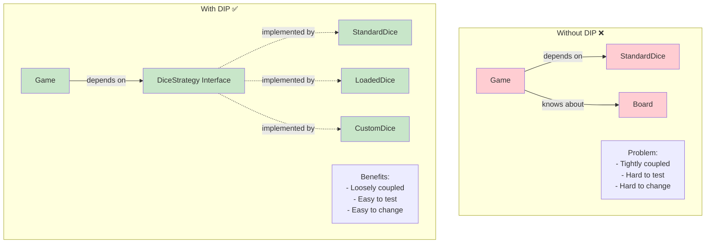

# Snake and Ladder Game - SOLID Principles Deep Dive

## 📚 What are SOLID Principles?

**For Beginners:** SOLID is an acronym for 5 principles of Object-Oriented Design that make code:
- Easy to understand
- Easy to maintain
- Easy to extend
- Easy to test

Think of them as "best practices" for writing clean OOP code!

---

## 1. Single Responsibility Principle (SRP)

### Definition
**"A class should have ONE and ONLY ONE reason to change."**

**Simple Explanation:**
- Each class should do ONE thing well
- If a class has multiple responsibilities, split it
- Makes code easier to understand and modify

### Why It Matters
- **Bad:** One "God Class" that does everything
- **Good:** Multiple focused classes, each with clear purpose

---

### Snake & Ladder Example

#### ❌ BAD: Violating SRP

```java
// BAD ❌ - Game class doing EVERYTHING
public class Game {
    private List<Player> players;
    private int[][] board;

    // Responsibility 1: Game logic
    public void start() { ... }
    public void playTurn() { ... }

    // Responsibility 2: Dice rolling
    public int rollDice() {
        return 1 + new Random().nextInt(6);
    }

    // Responsibility 3: Console output
    public void displayBoard() {
        for (int i = 0; i < 10; i++) {
            for (int j = 0; j < 10; j++) {
                System.out.print(board[i][j] + " ");
            }
        }
    }

    // Responsibility 4: Board configuration
    public void addSnake(int head, int tail) { ... }
    public void addLadder(int bottom, int top) { ... }

    // Responsibility 5: Player management
    public void addPlayer(String name) { ... }
    public void movePlayer(Player p, int steps) { ... }
}

// TOO MANY RESPONSIBILITIES!
// Changes to dice logic require modifying Game class
// Changes to display require modifying Game class
// Changes to board structure require modifying Game class
```

#### ✅ GOOD: Following SRP

```java
// GOOD ✅ - Separate classes, each with ONE responsibility

/**
 * Responsibility: Game flow control ONLY
 */
public class Game {
    private Board board;          // Delegates board logic
    private List<Player> players; // Delegates player logic
    private DiceStrategy dice;    // Delegates dice logic
    private GameDisplay display;  // Delegates display logic

    public void start() {
        display.showWelcome();
        while (!isGameOver()) {
            playTurn();
        }
    }

    public void playTurn() {
        Player current = getCurrentPlayer();
        int roll = dice.roll();           // Dice handles rolling
        display.showDiceRoll(current, roll); // Display handles output

        movePlayer(current, roll);
        display.showPosition(current);    // Display handles output
    }

    // Game ONLY orchestrates, doesn't DO the work!
}

/**
 * Responsibility: Dice rolling ONLY
 */
public interface DiceStrategy {
    int roll();
}

public class StandardDice implements DiceStrategy {
    private Random random = new Random();

    @Override
    public int roll() {
        return 1 + random.nextInt(6);
    }
}

/**
 * Responsibility: Board management ONLY
 */
public class Board {
    private int boardSize;
    private Map<Integer, BoardElement> elements;

    public void addBoardElement(BoardElement element) { ... }
    public BoardElement getBoardElement(int position) { ... }
}

/**
 * Responsibility: Display/output ONLY
 */
public class GameDisplay {
    public void showWelcome() {
        System.out.println("Welcome to Snake and Ladder!");
    }

    public void showDiceRoll(Player player, int roll) {
        System.out.println(player.getName() + " rolled " + roll);
    }

    public void showPosition(Player player) {
        System.out.println(player.getName() + " is at " + player.getPosition());
    }
}

/**
 * Responsibility: Player state ONLY
 */
public class Player {
    private String name;
    private int position;

    public void setPosition(int position) {
        this.position = position;
    }

    public int getPosition() {
        return position;
    }
}
```

### Benefits of SRP in Our Design

| Class | Single Responsibility |
|-------|----------------------|
| `Game` | Orchestrate game flow |
| `Player` | Manage player state |
| `Board` | Manage board structure |
| `DiceStrategy` | Generate random numbers |
| `BoardElement` | Represent board special positions |
| `Snake` | Represent downward movement |
| `Ladder` | Represent upward movement |
| `GameFactory` | Create game instances |

**Result:** Each class is small, focused, easy to understand and test!

---

## 2. Open/Closed Principle (OCP)

### Definition
**"Software entities should be OPEN for extension but CLOSED for modification."**

**Simple Explanation:**
- Can add NEW features without changing EXISTING code
- Extend behavior through inheritance/interfaces
- Existing code remains stable and tested

### Why It Matters
- **Bad:** Every new feature breaks existing code
- **Good:** Add features without touching old code

---

### Snake & Ladder Example

#### ❌ BAD: Violating OCP

```java
// BAD ❌ - Need to modify class for new dice types
public class Dice {
    private String type;

    public Dice(String type) {
        this.type = type;
    }

    public int roll() {
        if (type.equals("STANDARD")) {
            return 1 + new Random().nextInt(6);
        } else if (type.equals("LOADED")) {
            return 6;  // Always 6
        } else if (type.equals("CUSTOM")) {
            return 1 + new Random().nextInt(12);  // 1-12
        }
        // If we want to add new type, must MODIFY this method! ❌
        return 1;
    }
}

// Adding new dice type requires:
// 1. Modify Dice class ❌
// 2. Add new if-else condition ❌
// 3. Risk breaking existing code ❌
```

#### ✅ GOOD: Following OCP

```java
// GOOD ✅ - OPEN for extension, CLOSED for modification

/**
 * CLOSED for modification: This interface never changes
 */
public interface DiceStrategy {
    int roll();
}

/**
 * EXTENSION 1: Standard dice
 */
public class StandardDice implements DiceStrategy {
    private Random random = new Random();

    @Override
    public int roll() {
        return 1 + random.nextInt(6);
    }
}

/**
 * EXTENSION 2: Loaded dice (for testing)
 */
public class LoadedDice implements DiceStrategy {
    private int fixedValue;

    public LoadedDice(int value) {
        this.fixedValue = value;
    }

    @Override
    public int roll() {
        return fixedValue;
    }
}

/**
 * EXTENSION 3: Custom range dice
 * ADDED NEW TYPE WITHOUT MODIFYING EXISTING CODE! ✅
 */
public class CustomRangeDice implements DiceStrategy {
    private int min;
    private int max;
    private Random random = new Random();

    public CustomRangeDice(int min, int max) {
        this.min = min;
        this.max = max;
    }

    @Override
    public int roll() {
        return min + random.nextInt(max - min + 1);
    }
}

/**
 * Game code remains UNCHANGED! ✅
 */
public class Game {
    private DiceStrategy dice;  // Works with ANY DiceStrategy

    public Game(DiceStrategy dice) {
        this.dice = dice;
    }

    public void playTurn() {
        int roll = dice.roll();  // Works for ALL dice types!
        // No changes needed when adding new dice types!
    }
}

// Usage: Easy to add new types
Game game1 = new Game(new StandardDice());
Game game2 = new Game(new LoadedDice(6));
Game game3 = new Game(new CustomRangeDice(1, 12));

// Want a new dice type? Just create new class implementing DiceStrategy!
// NO need to modify Game, DiceStrategy, or existing dice classes!
```

### More OCP Examples in Our Design

#### Example 2: BoardElement Hierarchy

```java
// CLOSED for modification
public abstract class BoardElement {
    protected int startPosition;
    protected int endPosition;

    public abstract String getMessage();
}

// EXTENSION 1
public class Snake extends BoardElement {
    @Override
    public String getMessage() {
        return "Snake! Slide down!";
    }
}

// EXTENSION 2
public class Ladder extends BoardElement {
    @Override
    public String getMessage() {
        return "Ladder! Climb up!";
    }
}

// NEW EXTENSION 3: Add new element type WITHOUT modifying existing code!
public class TeleportPortal extends BoardElement {
    @Override
    public String getMessage() {
        return "Portal! Teleport!";
    }
}

// NEW EXTENSION 4: Add bonus cell
public class BonusCell extends BoardElement {
    @Override
    public String getMessage() {
        return "Bonus! Extra turn!";
    }
}

// Game code still works! No changes needed!
public class Board {
    public void handleElement(BoardElement element) {
        System.out.println(element.getMessage());  // Works for ALL types!
        // No modification needed when adding new element types!
    }
}
```

**Benefits:**
- Add new features without touching tested code
- Existing functionality remains stable
- Easy to extend system

---

## 3. Liskov Substitution Principle (LSP)

### Definition
**"Objects of a superclass should be replaceable with objects of a subclass without breaking the application."**

**Simple Explanation:**
- If class B extends class A, you should be able to use B anywhere you use A
- Subclass must fulfill parent's contract
- No surprises when substituting

### Why It Matters
- **Bad:** Subclass breaks when used in place of parent
- **Good:** Subclass works seamlessly as parent

---

### Snake & Ladder Example

#### ❌ BAD: Violating LSP

```java
// BAD ❌ - BoardElement contract says: "endPosition is where you move to"

public abstract class BoardElement {
    protected int startPosition;
    protected int endPosition;

    public int getEndPosition() {
        return endPosition;
    }
}

public class Snake extends BoardElement {
    // Follows contract ✅
    public Snake(int head, int tail) {
        this.startPosition = head;
        this.endPosition = tail;  // tail is where you move to
    }
}

// VIOLATES LSP! ❌
public class RandomSnake extends BoardElement {
    public RandomSnake(int head) {
        this.startPosition = head;
        this.endPosition = -1;  // Invalid! Violates contract!
    }

    @Override
    public int getEndPosition() {
        // Returns RANDOM position each time! ❌
        return new Random().nextInt(100);
        // Violates expectation: endPosition should be FIXED!
    }
}

// Code breaks when using RandomSnake!
public void movePlayer(Player player, BoardElement element) {
    int destination = element.getEndPosition();
    player.setPosition(destination);

    // Works fine with Snake and Ladder
    // BREAKS with RandomSnake (different position each call!)
}
```

#### ✅ GOOD: Following LSP

```java
// GOOD ✅ - All subclasses fulfill parent contract

public abstract class BoardElement {
    protected int startPosition;
    protected int endPosition;

    public BoardElement(int start, int end) {
        this.startPosition = start;
        this.endPosition = end;
    }

    public int getStartPosition() {
        return startPosition;  // Always returns same value
    }

    public int getEndPosition() {
        return endPosition;    // Always returns same value
    }

    public abstract String getMessage();
}

// FOLLOWS LSP ✅
public class Snake extends BoardElement {
    public Snake(int head, int tail) {
        super(head, tail);
        if (head <= tail) {
            throw new IllegalArgumentException("Invalid snake");
        }
    }

    @Override
    public String getMessage() {
        return "Snake! Slide down!";
    }
    // getStartPosition() and getEndPosition() work as expected ✅
}

// FOLLOWS LSP ✅
public class Ladder extends BoardElement {
    public Ladder(int bottom, int top) {
        super(bottom, top);
        if (bottom >= top) {
            throw new IllegalArgumentException("Invalid ladder");
        }
    }

    @Override
    public String getMessage() {
        return "Ladder! Climb up!";
    }
    // getStartPosition() and getEndPosition() work as expected ✅
}

// Works perfectly with ANY BoardElement subclass!
public void handleElement(Player player, BoardElement element) {
    int destination = element.getEndPosition();  // Always consistent ✅
    player.setPosition(destination);
    System.out.println(element.getMessage());

    // Works identically for Snake, Ladder, or any future BoardElement!
}
```

### LSP in DiceStrategy

```java
// All DiceStrategy implementations are substitutable ✅

public interface DiceStrategy {
    int roll();  // Contract: returns value between min and max
}

public class StandardDice implements DiceStrategy {
    @Override
    public int roll() {
        return 1 + new Random().nextInt(6);  // 1-6 ✅
    }
}

public class LoadedDice implements DiceStrategy {
    private int value;

    @Override
    public int roll() {
        return value;  // Fixed value ✅
    }
}

// All implementations work interchangeably!
public class Game {
    private DiceStrategy dice;

    public void playTurn() {
        int roll = dice.roll();  // Works with ANY DiceStrategy! ✅
        // No surprises, no type checking needed
    }
}
```

---

## 4. Interface Segregation Principle (ISP)

### Definition
**"Clients should not be forced to depend on interfaces they don't use."**

**Simple Explanation:**
- Many small, specific interfaces > One large interface
- Class should only implement methods it needs
- Don't force unnecessary methods

### Why It Matters
- **Bad:** Fat interfaces with many methods
- **Good:** Slim interfaces with focused purpose

---

### Snake & Ladder Example

#### ❌ BAD: Violating ISP

```java
// BAD ❌ - Fat interface with too many methods
public interface GameElement {
    // Methods needed by Snake/Ladder
    int getStartPosition();
    int getEndPosition();
    String getMessage();

    // Methods needed by Player
    void move(int steps);
    void resetPosition();

    // Methods needed by Cell
    boolean isOccupied();
    void setOccupied(boolean occupied);

    // Methods needed by Board
    void validate();
    void draw();
}

// Snake forced to implement methods it doesn't need! ❌
public class Snake implements GameElement {
    @Override
    public int getStartPosition() { return head; }  // Needs this ✅

    @Override
    public int getEndPosition() { return tail; }    // Needs this ✅

    @Override
    public String getMessage() { return "Snake!"; } // Needs this ✅

    // Forced to implement irrelevant methods! ❌
    @Override
    public void move(int steps) {
        // Snakes don't move! This makes no sense!
        throw new UnsupportedOperationException();
    }

    @Override
    public void resetPosition() {
        // Snakes don't reset! This makes no sense!
        throw new UnsupportedOperationException();
    }

    @Override
    public boolean isOccupied() {
        // Snakes aren't occupied! This makes no sense!
        return false;
    }

    @Override
    public void setOccupied(boolean occupied) {
        // Snakes aren't occupied! This makes no sense!
    }

    @Override
    public void validate() {
        // Maybe useful, but mixed with irrelevant methods
    }

    @Override
    public void draw() {
        // Maybe useful, but mixed with irrelevant methods
    }
}
```

#### ✅ GOOD: Following ISP

```java
// GOOD ✅ - Small, focused interfaces

/**
 * Interface for elements that have positions (Snake, Ladder)
 */
public interface Positionable {
    int getStartPosition();
    int getEndPosition();
}

/**
 * Interface for elements that have messages (Snake, Ladder)
 */
public interface Messageable {
    String getMessage();
}

/**
 * Interface for moveable entities (Player)
 */
public interface Moveable {
    void move(int steps);
    void resetPosition();
}

/**
 * Interface for occupiable cells (Cell)
 */
public interface Occupiable {
    boolean isOccupied();
    void setOccupied(boolean occupied);
}

// Snake only implements what it needs! ✅
public class Snake implements Positionable, Messageable {
    private int head;
    private int tail;

    @Override
    public int getStartPosition() { return head; }  // Needs this ✅

    @Override
    public int getEndPosition() { return tail; }    // Needs this ✅

    @Override
    public String getMessage() {                    // Needs this ✅
        return "Snake! Slide from " + head + " to " + tail;
    }

    // No unnecessary methods! ✅
}

// Player only implements what it needs! ✅
public class Player implements Moveable {
    private int position;

    @Override
    public void move(int steps) {              // Needs this ✅
        position += steps;
    }

    @Override
    public void resetPosition() {              // Needs this ✅
        position = 0;
    }

    // No unnecessary methods! ✅
}

// Cell only implements what it needs! ✅
public class Cell implements Occupiable {
    private boolean occupied;

    @Override
    public boolean isOccupied() {              // Needs this ✅
        return occupied;
    }

    @Override
    public void setOccupied(boolean occupied) { // Needs this ✅
        this.occupied = occupied;
    }

    // No unnecessary methods! ✅
}
```

### ISP in Our Design

Our design naturally follows ISP:

```java
// DiceStrategy: Small, focused interface ✅
public interface DiceStrategy {
    int roll();  // Just one method!
}

// No unnecessary methods
// StandardDice, LoadedDice, CustomDice only implement roll()
```

---

## 5. Dependency Inversion Principle (DIP)

### Definition
**"High-level modules should not depend on low-level modules. Both should depend on abstractions."**

**Simple Explanation:**
- Depend on interfaces/abstractions, not concrete classes
- High-level code shouldn't know about low-level details
- Makes code flexible and testable

### Why It Matters
- **Bad:** Hard-coded dependencies, difficult to test
- **Good:** Flexible dependencies, easy to swap implementations

---

### Snake & Ladder Example

#### ❌ BAD: Violating DIP

```java
// BAD ❌ - Game depends on CONCRETE classes

public class Game {
    private StandardDice dice;  // Concrete class! ❌
    private Board board;
    private List<Player> players;

    public Game() {
        // Creating dependencies inside! ❌
        this.dice = new StandardDice();
        this.board = new Board(100);
        this.players = new ArrayList<>();
    }

    public void playTurn() {
        int roll = dice.roll();  // Tightly coupled to StandardDice ❌
        // Cannot use different dice types!
        // Cannot mock for testing!
    }
}

// Problems:
// 1. Cannot use LoadedDice or CustomDice ❌
// 2. Cannot test Game without real StandardDice ❌
// 3. Game knows TOO MUCH about dice implementation ❌
```

#### ✅ GOOD: Following DIP

```java
// GOOD ✅ - Game depends on ABSTRACTION

public class Game {
    // Depend on INTERFACE, not concrete class ✅
    private DiceStrategy dice;
    private Board board;
    private List<Player> players;

    // Dependencies INJECTED from outside ✅
    public Game(DiceStrategy dice, Board board, List<Player> players) {
        this.dice = dice;        // Accept ANY DiceStrategy
        this.board = board;
        this.players = players;
    }

    public void playTurn() {
        int roll = dice.roll();  // Works with ANY DiceStrategy! ✅
        // StandardDice, LoadedDice, CustomDice all work!
    }
}

// Usage: Flexible! ✅
DiceStrategy standardDice = new StandardDice();
DiceStrategy loadedDice = new LoadedDice(6);
DiceStrategy customDice = new CustomRangeDice(1, 12);

Game game1 = new Game(standardDice, board, players);  // Production
Game game2 = new Game(loadedDice, board, players);    // Testing
Game game3 = new Game(customDice, board, players);    // Variation

// Testing: Easy to mock! ✅
DiceStrategy mockDice = new DiceStrategy() {
    @Override
    public int roll() {
        return 3;  // Predictable for testing
    }
};
Game testGame = new Game(mockDice, board, players);  // Fully testable!
```

### DIP Diagram



### More DIP Examples

```java
// Example 2: Factory with DIP ✅

public class GameFactory {
    // Returns INTERFACE, not concrete class ✅
    public static DiceStrategy createStandardDice() {
        return new StandardDice();  // Returns as interface
    }

    public static DiceStrategy createLoadedDice(int value) {
        return new LoadedDice(value);  // Returns as interface
    }
}

// Usage
DiceStrategy dice = GameFactory.createStandardDice();
// Code depends on DiceStrategy, not StandardDice!
```

---

## SOLID Principles Summary Matrix

| Principle | What | Why | How in Our Design |
|-----------|------|-----|-------------------|
| **SRP** | One class, one responsibility | Easier to understand and modify | Game, Player, Board, Dice are all separate |
| **OCP** | Open for extension, closed for modification | Add features without breaking existing code | DiceStrategy, BoardElement use polymorphism |
| **LSP** | Subclasses substitutable for parent | No surprises when using inheritance | All DiceStrategy implementations work identically |
| **ISP** | Small, focused interfaces | Don't force unnecessary methods | DiceStrategy has only roll(), not bloated |
| **DIP** | Depend on abstractions | Flexible, testable, loosely coupled | Game depends on DiceStrategy interface |

---

## SOLID in Action: Complete Example

```java
/**
 * Complete example showing ALL SOLID principles
 */

// DIP: Depend on abstraction ✅
// ISP: Small, focused interface ✅
public interface DiceStrategy {
    int roll();
}

// OCP: Can add new types without modifying existing code ✅
// LSP: All implementations work interchangeably ✅
public class StandardDice implements DiceStrategy {
    @Override
    public int roll() {
        return 1 + new Random().nextInt(6);
    }
}

// SRP: Game only orchestrates, doesn't do everything ✅
// DIP: Depends on DiceStrategy interface, not concrete class ✅
public class Game {
    private DiceStrategy dice;  // DIP ✅
    private Board board;        // SRP - delegating to Board ✅
    private List<Player> players; // SRP - delegating to Player ✅

    // DIP: Dependency Injection ✅
    public Game(DiceStrategy dice, Board board, List<Player> players) {
        this.dice = dice;
        this.board = board;
        this.players = players;
    }

    // SRP: Game orchestrates, doesn't implement details ✅
    public void playTurn() {
        Player current = getCurrentPlayer();
        int roll = dice.roll();         // DIP: works with any DiceStrategy ✅
        executeMove(current, roll);
    }

    // SRP: Focused method ✅
    private void executeMove(Player player, int steps) {
        player.move(steps);  // SRP: Player handles its own movement ✅

        BoardElement element = board.getBoardElement(player.getPosition());
        if (element != null) {
            // LSP: Works with Snake, Ladder, or any BoardElement ✅
            player.setPosition(element.getEndPosition());
        }
    }
}

// SRP: Player only manages player state ✅
public class Player {
    private String name;
    private int position;

    public void move(int steps) {
        this.position += steps;
    }

    public int getPosition() {
        return position;
    }
}

// ALL 5 SOLID PRINCIPLES WORKING TOGETHER! 🎉
```

---

**Key Takeaway:** SOLID principles make code that is easy to understand, test, extend, and maintain!
