```mermaid
sequenceDiagram
    participant G as Game
    participant P as Player (Alice)
    participant B as Board
    participant Disp as Display

    Note over G,Disp: Alice at position 97

    G->>G: playTurn()
    activate G

    Note over G: Alice rolls 3

    G->>P: getCurrentPosition()
    P-->>G: 97

    G->>G: newPos = 97 + 3 = 100

    alt Exact win!
        G->>P: setPosition(100)
        activate P
        P->>P: currentPosition = 100
        P-->>G: updated
        deactivate P

        G->>G: checkWinCondition(Alice)

        G->>P: getCurrentPosition()
        P-->>G: 100

        G->>B: getBoardSize()
        B-->>G: 100

        Note over G: Position == BoardSize ✅

        G->>G: isGameOver = true
        G->>G: winner = Alice

        G->>Disp: announceWinner(Alice)
        activate Disp

        Note over Disp: 🎉🎉🎉🎉🎉🎉🎉🎉<br/>CONGRATULATIONS ALICE!<br/>You won the game!<br/>🎉🎉🎉🎉🎉🎉🎉🎉

        Disp-->>G: winner announced
        deactivate Disp

        G->>G: displayFinalStandings()

        Note over G: Game loop exits
    end

    deactivate G

    Note over G,Disp: Game Over
```

# Snake and Ladder Game - Sequence Diagrams

## 📚 What are Sequence Diagrams?

**For Beginners:** Sequence diagrams show HOW objects interact over TIME. They illustrate the flow of messages between objects step-by-step.

**Key Elements:**
- **Actors/Objects:** Shown as boxes at the top
- **Lifeline:** Vertical dashed lines showing object lifetime
- **Messages:** Arrows showing method calls
- **Activation:** Rectangles showing when object is active
- **Time:** Flows from top to bottom

---

## Sequence Diagram 1: Game Initialization

### 📝 Description
Shows how a game is created and initialized with all components.

### 🎯 Flow
1. Main creates GameFactory
2. GameFactory creates Board, Dice, Players
3. GameFactory uses GameBuilder
4. GameBuilder assembles Game
5. Game is ready to play

---

### Mermaid Diagram


---

### Detailed Explanation

#### Step 1: Main → GameFactory
```java
List<Player> players = Arrays.asList(
    new Player("P1", "Alice"),
    new Player("P2", "Bob")
);

Game game = GameFactory.createStandardGame(players);
```

**What happens:**
- Main calls GameFactory with player list
- GameFactory orchestrates creation of all components

---

#### Step 2: GameFactory → BoardFactory
```java
// Inside GameFactory
Board board = BoardFactory.createStandardBoard();
```

**What happens:**
- BoardFactory creates Board with 100 cells
- Adds standard snakes (10 snakes)
- Adds standard ladders (10 ladders)
- Returns configured board

---

#### Step 3: GameFactory → DiceFactory
```java
// Inside GameFactory
DiceStrategy dice = DiceFactory.createStandardDice();
```

**What happens:**
- DiceFactory creates StandardDice instance
- Returns as DiceStrategy interface (DIP principle)

---

#### Step 4: GameFactory → GameBuilder
```java
// Inside GameFactory
return new GameBuilder()
        .setPlayers(players)
        .setBoard(board)
        .setDiceStrategy(dice)
        .build();
```

**What happens:**
- GameBuilder receives all components
- Validates configuration (min 2 players, board not null)
- Creates Game instance
- Returns assembled game

---

## Sequence Diagram 2: Player Turn Flow

### 📝 Description
Shows a complete player turn including dice roll, movement, snake/ladder handling.

### 🎯 Flow
1. Game prompts current player
2. Player rolls dice
3. Game validates move
4. Game moves player
5. Game checks for snake/ladder
6. Game updates display
7. Game checks win condition
8. Game switches turn (or grants extra turn)

---

### Mermaid Diagram

```mermaid
sequenceDiagram
    participant G as Game
    participant P as Player
    participant D as DiceStrategy
    participant B as Board
    participant BE as BoardElement
    participant Disp as Display

    Note over G,Disp: Player Turn: Alice's Turn

    G->>Disp: showCurrentPlayer(Alice)
    Disp-->>G: displayed

    Note over G: Wait for player input

    G->>D: roll()
    activate D
    D->>D: generate random(1-6)
    D-->>G: diceValue (e.g., 4)
    deactivate D

    G->>Disp: showDiceRoll(Alice, 4)
    Disp-->>G: displayed

    Note over G: Calculate new position

    G->>G: currentPos = P.getCurrentPosition()
    Note right of G: currentPos = 10
    G->>G: newPos = currentPos + diceValue
    Note right of G: newPos = 14

    alt newPos > 100
        Note over G: Move exceeds board
        G->>Disp: showMessage("Need exact number")
        G->>G: keep player at current position
    else newPos == 100
        Note over G: Player wins!
        G->>P: setPosition(100)
        G->>G: setWinner(P)
        G->>G: isGameOver = true
        G->>Disp: announceWinner(Alice)
    else newPos < 100
        Note over G: Valid move
        G->>P: setPosition(14)
        activate P
        P->>P: currentPosition = 14
        P-->>G: position updated
        deactivate P

        G->>Disp: showMove(Alice, 10, 14)

        Note over G: Check for snake/ladder

        G->>B: getBoardElement(14)
        activate B

        alt Position has Ladder
            B->>BE: (Ladder at 14 → 31)
            activate BE
            BE-->>B: ladder
            B-->>G: ladder
            deactivate B

            G->>BE: getMessage()
            BE-->>G: "Yay! Climb ladder!"
            G->>Disp: showMessage("Yay! Climb ladder!")

            G->>BE: getEndPosition()
            BE-->>G: 31

            G->>P: setPosition(31)
            activate P
            P->>P: currentPosition = 31
            P-->>G: position updated
            deactivate P
            deactivate BE

            G->>Disp: showNewPosition(Alice, 31)

        else Position has Snake
            B->>BE: (Snake at 14 → 5)
            activate BE
            BE-->>B: snake
            B-->>G: snake
            deactivate B

            G->>BE: getMessage()
            BE-->>G: "Oops! Snake bite!"
            G->>Disp: showMessage("Oops! Snake bite!")

            G->>BE: getEndPosition()
            BE-->>G: 5

            G->>P: setPosition(5)
            activate P
            P->>P: currentPosition = 5
            P-->>G: position updated
            deactivate P
            deactivate BE

            G->>Disp: showNewPosition(Alice, 5)

        else No special element
            B-->>G: null
            deactivate B
            Note over G: No snake or ladder
        end

        Note over G: Check win condition

        G->>G: checkWinCondition(P)
        alt Player at position 100
            G->>G: isGameOver = true
            G->>G: winner = P
        else Player not at 100
            Note over G: Game continues
        end

        Note over G: Determine next turn

        alt diceValue == 6
            G->>Disp: showMessage("Rolled 6! Go again!")
            Note over G: Same player continues
        else diceValue != 6
            G->>G: switchToNextPlayer()
            Note right of G: currentPlayerIndex++
            G->>Disp: showNextPlayer(Bob)
        end
    end

    G->>Disp: displayGameState()
    Disp-->>G: state displayed

    Note over G,Disp: Turn Complete
```

---

### Detailed Explanation

#### Phase 1: Roll Dice
```java
// In Game.playTurn()
Player current = players.get(currentPlayerIndex);
int diceValue = diceStrategy.roll();
System.out.println(current.getName() + " rolled " + diceValue);
```

**Messages:**
1. `Game → DiceStrategy: roll()`
2. `DiceStrategy → Game: return 4`

---

#### Phase 2: Calculate and Validate Move
```java
int currentPos = current.getCurrentPosition();  // 10
int newPos = currentPos + diceValue;            // 14

if (newPos > board.getBoardSize()) {
    System.out.println("Need exact number to win!");
    return;  // Stay at current position
}
```

**Messages:**
1. `Game → Player: getCurrentPosition()`
2. `Player → Game: return 10`
3. `Game → Game: calculate newPos`

---

#### Phase 3: Move Player
```java
current.setPosition(newPos);
System.out.println(current.getName() + " moved to " + newPos);
```

**Messages:**
1. `Game → Player: setPosition(14)`
2. `Player → Player: update position`

---

#### Phase 4: Check Board Element
```java
BoardElement element = board.getBoardElement(newPos);

if (element != null) {
    System.out.println(element.getMessage());
    current.setPosition(element.getEndPosition());
    System.out.println("New position: " + current.getCurrentPosition());
}
```

**Messages:**
1. `Game → Board: getBoardElement(14)`
2. `Board → Game: return Ladder`
3. `Game → Ladder: getMessage()`
4. `Ladder → Game: "Yay! Climb ladder!"`
5. `Game → Ladder: getEndPosition()`
6. `Ladder → Game: return 31`
7. `Game → Player: setPosition(31)`

---

#### Phase 5: Check Win and Switch Turn
```java
if (current.getCurrentPosition() == board.getBoardSize()) {
    isGameOver = true;
    winner = current;
    announceWinner();
} else if (diceValue != 6) {
    switchToNextPlayer();
}
```

**Messages:**
1. `Game → Game: checkWinCondition()`
2. If not won and not 6: `Game → Game: switchToNextPlayer()`

---

## Sequence Diagram 3: Game Completion

### 📝 Description
Shows the flow when a player wins the game.

### Mermaid Diagram



---

### Detailed Explanation

#### Win Condition Check
```java
private boolean checkWinCondition(Player player) {
    return player.getCurrentPosition() == board.getBoardSize();
}
```

**Flow:**
1. Check if player position == 100
2. If yes, set `isGameOver = true`
3. Set `winner = player`
4. Call `announceWinner()`

---

#### Winner Announcement
```java
private void announceWinner() {
    System.out.println("\n\n🎉🎉🎉🎉🎉🎉🎉🎉🎉🎉🎉🎉🎉");
    System.out.println("  CONGRATULATIONS " + winner.getPlayerName().toUpperCase() + "!");
    System.out.println("  You won the game!");
    System.out.println("🎉🎉🎉🎉🎉🎉🎉🎉🎉🎉🎉🎉🎉");

    displayFinalStandings();
}

private void displayFinalStandings() {
    System.out.println("\nFinal Standings:");
    // Sort players by position
    players.stream()
           .sorted((p1, p2) -> Integer.compare(p2.getCurrentPosition(), p1.getCurrentPosition()))
           .forEach(p -> System.out.println("  " + p.getPlayerName() + ": " + p.getCurrentPosition()));
}
```

---

## Message Types in Sequence Diagrams

### 1. Synchronous Call (Solid Arrow →)
```
A ->> B: method()
```
- Caller waits for response
- Most common type
- Used for regular method calls

**Example:**
```java
int value = dice.roll();  // Wait for return value
```

---

### 2. Asynchronous Call (Solid Arrow →)
```
A -) B: method()
```
- Caller doesn't wait
- Fire and forget
- Used for events, notifications

**Example:**
```java
eventPublisher.publishEvent(gameStarted);  // Don't wait
```

---

### 3. Return Message (Dashed Arrow ←)
```
B -->> A: return value
```
- Shows return value
- Optional (can be implied)

**Example:**
```java
return diceValue;
```

---

### 4. Self Call (Loop back →)
```
A ->> A: method()
```
- Object calls its own method
- Internal processing

**Example:**
```java
private void initializeBoard() {
    // Self call
}
```

---

## Sequence Diagram Best Practices

### ✅ DO:
1. **Start simple**: Show main flow first
2. **Use alt/opt**: Show conditional logic
3. **Keep vertical**: Time flows downward
4. **Show returns**: Make data flow clear
5. **Add notes**: Explain complex logic

### ❌ DON'T:
1. **Too many objects**: Keep to 5-7 participants
2. **Too much detail**: Focus on key interactions
3. **Miss alternatives**: Show error cases
4. **Forget activation**: Show when objects are active

---

## Sequence Diagram Reading Guide

When reading a sequence diagram, ask:

1. **Who initiates?** (leftmost object usually)
2. **What's the order?** (top to bottom)
3. **What's returned?** (dashed arrows)
4. **Are there conditions?** (alt/opt boxes)
5. **What activates when?** (rectangles on lifelines)

---

## Complete Game Flow Summary

```
Main → GameFactory → GameBuilder → Game
  ↓
Game.start()
  ↓
while (!isGameOver) {
  ↓
  playTurn()
    ├─ getCurrentPlayer()
    ├─ dice.roll()
    ├─ player.setPosition()
    ├─ board.getBoardElement()
    ├─ element.getMessage() [if exists]
    ├─ checkWinCondition()
    └─ switchToNextPlayer() [if not 6]
  ↓
}
  ↓
announceWinner()
```

---

**Key Takeaway:** Sequence diagrams show the dynamic behavior of the system - how objects collaborate over time to accomplish tasks!
