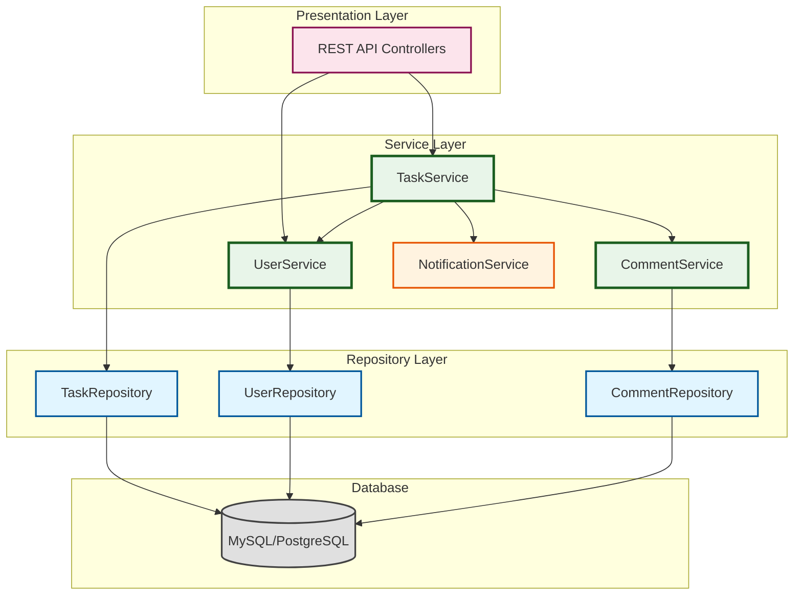
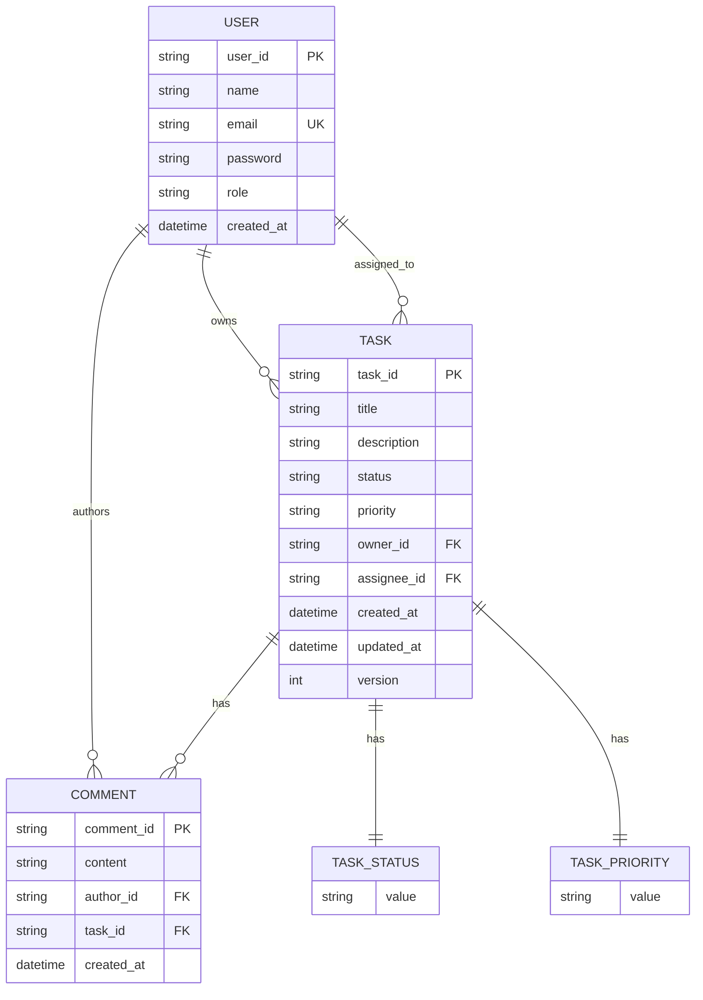

# Task Management System - Low Level Design (LLD)

## 📚 Complete Documentation

This is a comprehensive, beginner-friendly Low Level Design for a Task Management System. The documentation is divided into 10 phases, each building on the previous one.

---

## 📖 Table of Contents

### Core Design Phases

1. **[Phase 1: Requirements Analysis & Planning](./phase1-requirements-analysis.md)**
   - Functional Requirements
   - Non-Functional Requirements
   - Assumptions & Constraints
   - Success Criteria

2. **[Phase 2: Use Case Analysis](./phase2-use-case-analysis.md)**
   - Actor Identification (User, Admin, System)
   - Use Case Diagrams with Mermaid
   - Detailed Use Case Flows
   - User Journey Maps

3. **[Phase 3: Core Entity Design](./phase3-core-entity-design.md)**
   - Incremental Class Diagrams (Step-by-Step)
   - Task, User, Comment Entities
   - POJO Design Patterns
   - Common Mistakes & Solutions

4. **[Phase 4: Relationships & Enums](./phase4-relationships-enums.md)**
   - Association, Aggregation, Composition
   - TaskStatus & TaskPriority Enums
   - Complete Entity Relationship Diagram
   - UML Relationship Symbols Explained

5. **[Phase 5: Service Layer Design](./phase5-service-layer-design.md)**
   - SOLID Principles Explained
   - Service Interfaces & Implementations
   - Dependency Injection
   - DTOs (Data Transfer Objects)
   - ValidationService, NotificationService

6. **[Phase 6: Repository & Data Layer](./phase6-repository-data-layer.md)**
   - Repository Pattern
   - JPA Implementations (Production)
   - In-Memory Implementations (Testing)
   - JPQL & CriteriaBuilder
   - Complex Query Examples

### Advanced Topics

7. **[Phase 7: Design Patterns](./phase7-design-patterns.md)**
   - Factory Pattern (Task Creation)
   - Strategy Pattern (Task Filtering)
   - Observer Pattern (Notifications)
   - Singleton Pattern (ID Generation)

8. **[Phase 8: Concurrency & Data Model](./phase8-concurrency-data-model.md)**
   - Optimistic Locking
   - Pessimistic Locking
   - Database Schema (ER Diagram)
   - Entity-to-Table Mapping
   - Indexes & Constraints

9. **[Phase 9: Sequence & Component Diagrams](./phase9-sequence-component-diagrams.md)**
   - Create Task Flow
   - Assign Task Flow
   - Update Status Flow
   - Add Comment Flow
   - System Architecture Diagram

10. **[Phase 10: Interview Q&A & Code](./phase10-interview-qa-code.md)**
    - 15 Interview Questions with Answers
    - Common Mistakes & Solutions
    - Whiteboard Checklist
    - Complete Java Code with Comments
    - Design Decisions Summary

---

## 🎯 Quick Start Guide

### For Beginners
Start with Phase 1 and go sequentially. Each phase builds on the previous one.

### For Interview Prep
1. Read Phase 1 (Requirements)
2. Study Phase 2 (Use Cases)
3. Focus on Phase 4 (Relationships)
4. Master Phase 5 (SOLID Principles)
5. Practice Phase 10 (Interview Q&A)

### For Implementation
1. Review Phase 3-6 (Entities, Services, Repositories)
2. Study Phase 7 (Design Patterns)
3. Implement Phase 8 (Concurrency)
4. Reference Phase 9 (Flow Diagrams)

---

## 🏗️ System Architecture Overview



---

## 🎨 Core Design Principles Applied

### SOLID Principles
- ✅ **S**ingle Responsibility: Each class has one job
- ✅ **O**pen/Closed: Open for extension, closed for modification
- ✅ **L**iskov Substitution: Subtypes are substitutable
- ✅ **I**nterface Segregation: Focused interfaces
- ✅ **D**ependency Inversion: Depend on abstractions

### Design Patterns
- ✅ **Repository Pattern**: Data access abstraction
- ✅ **Factory Pattern**: Object creation
- ✅ **Strategy Pattern**: Algorithm selection
- ✅ **Observer Pattern**: Event notification
- ✅ **DTO Pattern**: Data transfer

---

## 💡 Key Features

### Core Functionality
- ✅ Create, Read, Update, Delete Tasks
- ✅ Assign/Reassign Tasks to Users
- ✅ Update Task Status (TODO → IN_PROGRESS → DONE)
- ✅ Set Task Priority (LOW, MEDIUM, HIGH)
- ✅ Add Comments to Tasks
- ✅ Filter & Search Tasks
- ✅ User Authentication & Authorization

### Technical Features
- ✅ RESTful API Design
- ✅ JPA/Hibernate ORM
- ✅ Optimistic Locking (Concurrency Control)
- ✅ Audit Trail (createdAt, updatedAt)
- ✅ Email Notifications
- ✅ Input Validation
- ✅ Exception Handling
- ✅ Unit Test Support (In-Memory Repositories)

---

## 📊 Entity Relationship Diagram



---

## 🚀 Technology Stack

### Backend
- **Language**: Java 11+
- **Framework**: Spring Boot 2.x
- **ORM**: JPA/Hibernate
- **Database**: MySQL 8.0 / PostgreSQL 12+
- **Build Tool**: Maven / Gradle

### Testing
- **Unit Tests**: JUnit 5
- **Mocking**: Mockito
- **Integration Tests**: Spring Boot Test
- **In-Memory DB**: H2 (for tests)

### Additional
- **API Documentation**: Swagger/OpenAPI
- **Logging**: SLF4J + Logback
- **Validation**: Hibernate Validator

---

## 📝 API Endpoints

### Task Operations
```
POST   /api/tasks              - Create task
GET    /api/tasks/{id}         - Get task by ID
PUT    /api/tasks/{id}         - Update task
DELETE /api/tasks/{id}         - Delete task
GET    /api/tasks              - List all tasks (with filters)
PUT    /api/tasks/{id}/assign  - Assign task to user
PUT    /api/tasks/{id}/status  - Update task status
```

### Comment Operations
```
POST   /api/tasks/{id}/comments     - Add comment to task
GET    /api/tasks/{id}/comments     - Get all comments for task
```

### User Operations
```
POST   /api/users/register          - Register new user
POST   /api/users/login             - User login
GET    /api/users/{id}              - Get user by ID
```

---

## 🎓 Learning Objectives

After completing this LLD, you will understand:

1. **Requirements Analysis**
   - How to gather and document requirements
   - Functional vs non-functional requirements

2. **Use Case Modeling**
   - Identifying actors and use cases
   - Creating use case diagrams
   - Documenting flows

3. **Object-Oriented Design**
   - Entity design and relationships
   - Association, Aggregation, Composition
   - Enums and their usage

4. **SOLID Principles**
   - How and why to apply each principle
   - Real-world examples

5. **Design Patterns**
   - When to use each pattern
   - Implementation examples
   - Trade-offs

6. **Data Access**
   - Repository pattern
   - JPA/Hibernate
   - Query optimization

7. **Concurrency**
   - Optimistic vs Pessimistic locking
   - Transaction management

8. **System Design**
   - Layered architecture
   - Sequence diagrams
   - Component diagrams

---

## 🎯 Design Decisions & Trade-offs

### 1. UUID vs Auto-increment IDs
**Decision**: Use UUID
- ✅ Unique across distributed systems
- ✅ Generated in application (no DB roundtrip)
- ✅ Non-predictable (security)
- ❌ Larger storage (36 chars vs 8 bytes)
- ❌ Less human-readable

### 2. Enum vs String for Status/Priority
**Decision**: Use Enum
- ✅ Type-safe (compile-time checking)
- ✅ IDE autocomplete
- ✅ Clear valid values
- ❌ Requires code change to add new values
- **Mitigation**: Use database-driven enum for frequently changing values

### 3. Composition vs Aggregation for Comments
**Decision**: Use Composition
- ✅ Comments cannot exist without Task
- ✅ Cascade delete (delete task → delete comments)
- ✅ Clear lifecycle management
- ❌ Cannot move comments between tasks
- **Justification**: Comments are task-specific

### 4. Optimistic vs Pessimistic Locking
**Decision**: Use Optimistic Locking
- ✅ Better performance (no locks held)
- ✅ Suitable for low-contention scenarios
- ❌ Requires retry logic
- **Mitigation**: Add version field, handle version conflicts

### 5. Notification: Synchronous vs Asynchronous
**Decision**: Asynchronous (future enhancement)
- ✅ Don't block user operations
- ✅ Can retry failed notifications
- ❌ More complex (message queue needed)
- **Current**: Synchronous for simplicity
- **Future**: RabbitMQ/Kafka for async

---

## 📈 Scalability Considerations

### Current Design (Good for < 10K users)
- Single database
- Synchronous notifications
- In-memory caching (optional)

### Future Enhancements (> 10K users)
1. **Database**
   - Read replicas for scaling reads
   - Sharding by user ID
   - Connection pooling

2. **Caching**
   - Redis for frequently accessed tasks
   - Cache invalidation strategy
   - TTL-based expiration

3. **Async Processing**
   - Message queue (RabbitMQ/Kafka)
   - Async notification sending
   - Background job processing

4. **API Gateway**
   - Rate limiting
   - Load balancing
   - API versioning

5. **Microservices** (if needed)
   - Task Service
   - User Service
   - Notification Service
   - Each with its own database

---

## 🔒 Security Considerations

### Implemented
- ✅ Password hashing (BCrypt)
- ✅ Input validation
- ✅ Parameterized queries (SQL injection prevention)
- ✅ Role-based access control (RBAC)

### To Implement
- 🔲 JWT authentication
- 🔲 HTTPS/TLS
- 🔲 Rate limiting
- 🔲 XSS protection
- 🔲 CSRF tokens
- 🔲 API key management

---

## 📚 Additional Resources

### Books
- "Head First Design Patterns" - Freeman & Freeman
- "Clean Code" - Robert C. Martin
- "Designing Data-Intensive Applications" - Martin Kleppmann

### Online
- Spring Boot Documentation
- JPA/Hibernate Guides
- System Design Interview Prep

---

## 🤝 Contributing

This is a learning resource. Suggestions for improvement are welcome!

---

## 📄 License

This documentation is for educational purposes.

---

**Start Learning**: [Phase 1 - Requirements Analysis](./phase1-requirements-analysis.md)

**Good luck with your LLD interview preparation!** 🚀
