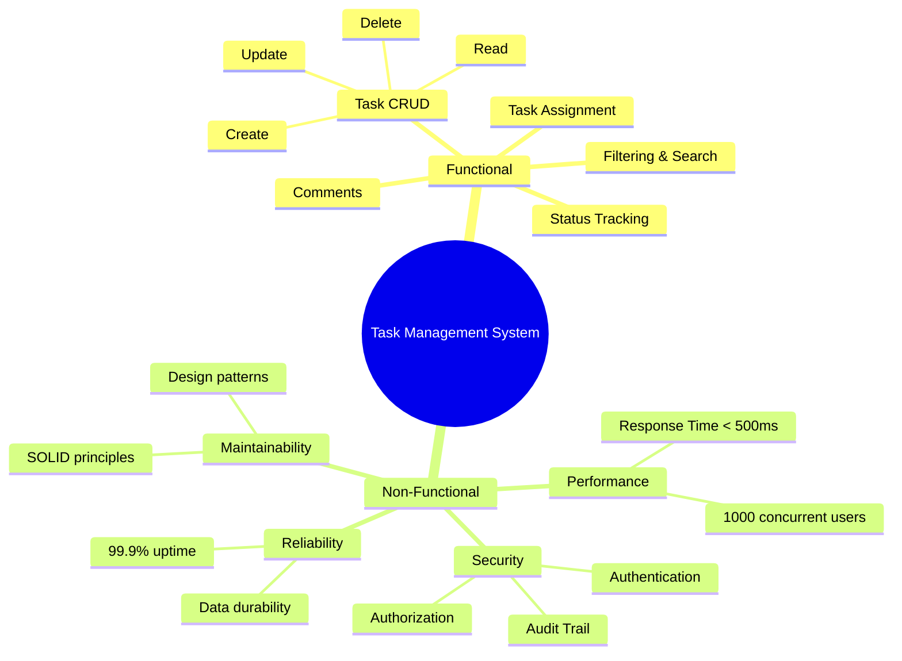

# Phase 1: Requirements Analysis & Planning

## 📋 Overview
This phase establishes the foundation of our Task Management System by clearly defining what the system needs to do (functional requirements) and how well it needs to perform (non-functional requirements).

---

## 1.1 Functional Requirements

### Core Task Management
1. **Create Task**
   - User can create a new task with:
     - Title (mandatory, 3-200 characters)
     - Description (optional, up to 5000 characters)
     - Priority (LOW, MEDIUM, HIGH)
     - Assignee (optional, can be assigned later)
   - System generates unique task ID automatically
   - Task starts with status `TODO` by default
   - Creator becomes the task owner

2. **Assign Task**
   - Task owner or admin can assign task to any user
   - Task can be reassigned to different user
   - User can be assigned multiple tasks
   - System sends notification to assigned user
   - Track assignment history (who assigned, when)

3. **Update Task Status**
   - Assignee or owner can update status
   - Status transitions: `TODO` → `IN_PROGRESS` → `DONE`
   - Can move back from `IN_PROGRESS` to `TODO`
   - Cannot move from `DONE` to other states (immutable once done)
   - Track status change history

4. **Update Task Priority**
   - Owner or admin can change priority
   - Priority levels: `LOW` → `MEDIUM` → `HIGH`
   - Track priority change history

5. **Update Task Details**
   - Owner or assignee can update title and description
   - Maintain audit trail of changes
   - Track who made changes and when

6. **Add Comments**
   - Any user can add comments to a task
   - Comments include:
     - Comment text (1-2000 characters)
     - Timestamp
     - Author information
   - Comments are immutable (cannot edit/delete)
   - Support @mentions for notifying users

7. **List Tasks**
   - List all tasks (with pagination)
   - Filter by:
     - Status (TODO, IN_PROGRESS, DONE)
     - Priority (LOW, MEDIUM, HIGH)
     - Assignee (specific user)
     - Owner (who created it)
     - Date range (created between dates)
   - Sort by:
     - Priority (HIGH first)
     - Created date (newest/oldest)
     - Updated date
   - Search by title/description keywords

8. **View Task Details**
   - View complete task information
   - View all comments on task
   - View task history (status changes, assignments, etc.)

### User Management (Simplified)
9. **User Registration**
   - Register with name, email, password
   - Email must be unique
   - System generates unique user ID

10. **User Authentication**
    - Login with email/password
    - Maintain session

### Notification System
11. **Send Notifications**
    - Notify when task is assigned
    - Notify when task status changes
    - Notify when mentioned in comment
    - Notification types: Email, In-app

---

## 1.2 Non-Functional Requirements

### Performance
- **Response Time**
  - Task listing: < 500ms for 1000 tasks
  - Task creation: < 200ms
  - Task update: < 300ms
  - Search: < 1 second

- **Throughput**
  - Support 1000 concurrent users
  - Handle 100 task operations per second

- **Scalability**
  - System should scale horizontally (add more servers)
  - Database should handle millions of tasks
  - Support 10,000+ users

### Reliability
- **Availability**: 99.9% uptime (< 9 hours downtime per year)
- **Data Durability**: No data loss (use database transactions)
- **Error Handling**: Graceful failure with meaningful error messages
- **Backup**: Daily automated backups

### Security
- **Authentication**: Secure password storage (BCrypt hashing)
- **Authorization**: Role-based access control (RBAC)
  - Only owner/assignee can update task
  - Only admin can delete tasks
- **Input Validation**: Prevent SQL injection, XSS attacks
- **Audit Trail**: Log all critical operations

### Usability
- **Intuitive API**: RESTful endpoints with clear naming
- **Error Messages**: User-friendly error descriptions
- **Documentation**: API documentation with examples

### Maintainability
- **Clean Code**: Follow SOLID principles
- **Design Patterns**: Use proven patterns (Factory, Strategy, Repository)
- **Testing**: Unit tests with 80%+ coverage
- **Logging**: Comprehensive logging for debugging

### Concurrency
- **Optimistic Locking**: Handle concurrent updates to same task
- **Transaction Management**: Ensure data consistency
- **Thread Safety**: Services should be stateless and thread-safe

---

## 1.3 Assumptions & Constraints

### Assumptions
1. **Single Tenant**: One organization uses the system (no multi-tenancy)
2. **Task Ownership**: Task creator is the owner, ownership cannot be transferred
3. **Comment Immutability**: Comments cannot be edited or deleted (audit trail)
4. **User Roles**: Two roles - Regular User and Admin
5. **Task ID Format**: System-generated UUID
6. **Time Zone**: All dates stored in UTC
7. **Network**: Reliable network connection assumed
8. **Database**: Relational database (MySQL/PostgreSQL)

### Constraints
1. **Technology Stack**: Java 11+, Spring Boot, JPA/Hibernate
2. **Database**: SQL database required (for ACID properties)
3. **No File Attachments**: Tasks don't support file uploads (Phase 1)
4. **No Subtasks**: Flat task structure (no parent-child tasks)
5. **No Task Dependencies**: Tasks are independent
6. **No Bulk Operations**: Operations work on single task at a time
7. **Limited History**: Keep last 100 changes per task

---

## 1.4 System Overview

### What is a Task Management System?

Think of it like a digital **TODO list on steroids**. Just like you write tasks on paper:
- ✅ Buy groceries
- ✅ Call mom
- ✅ Finish homework

But our system adds:
- **Assignment**: Delegate tasks to team members
- **Priority**: Mark urgent tasks
- **Status**: Track progress (TODO → IN_PROGRESS → DONE)
- **Comments**: Team discussion on each task
- **History**: See who changed what and when

### Real-World Example
```
Scenario: Software Development Team

John (Manager) creates task:
  Title: "Fix login bug"
  Priority: HIGH
  Assigns to: Sarah (Developer)

Sarah sees notification → Starts working
  Changes status: TODO → IN_PROGRESS
  Adds comment: "Found the issue in AuthService"

Sarah fixes bug
  Changes status: IN_PROGRESS → DONE
  Adds comment: "Fixed and tested"

John gets notification → Reviews task → Closes it
```

### System Boundary
```
┌─────────────────────────────────────────┐
│     TASK MANAGEMENT SYSTEM              │
│                                         │
│  ┌──────────┐  ┌──────────┐           │
│  │  Tasks   │  │  Users   │           │
│  └──────────┘  └──────────┘           │
│                                         │
│  ┌──────────┐  ┌──────────┐           │
│  │ Comments │  │Notifications│         │
│  └──────────┘  └──────────┘           │
│                                         │
└─────────────────────────────────────────┘
        ↑                    ↓
   User Actions        Notifications
```

---

## 1.5 Key Entities (Preview)

We'll work with these main "things" in our system:

1. **Task**: The work item
   - Has properties: title, description, priority, status
   - Can be assigned to users
   - Has comments

2. **User**: Person using the system
   - Has properties: name, email
   - Can create tasks
   - Can be assigned tasks

3. **Comment**: Discussion on a task
   - Has properties: text, timestamp
   - Belongs to a task
   - Written by a user

4. **Status**: State of a task (Enum)
   - TODO, IN_PROGRESS, DONE

5. **Priority**: Importance of a task (Enum)
   - LOW, MEDIUM, HIGH

---

## 1.6 Success Criteria

The system is successful if:
1. ✅ Users can perform all CRUD operations on tasks in < 500ms
2. ✅ Concurrent updates don't cause data corruption
3. ✅ All changes are tracked in audit trail
4. ✅ System handles 1000 concurrent users without crashes
5. ✅ Code follows SOLID principles (measurable via code review)
6. ✅ 80%+ test coverage
7. ✅ Zero critical security vulnerabilities

---

## 📊 Visual Requirements Summary



---

## 🎯 Next Steps

Now that we have clear requirements, in **Phase 2** we'll:
1. Identify actors (who uses the system)
2. Define use cases (what they do)
3. Create use case diagrams
4. Document interaction flows

---

## 💡 Beginner Tips

### What's the difference between Functional and Non-Functional?

**Functional Requirements** = **WHAT** the system does
- "User can create a task" ← This is a feature
- "User can add comments" ← This is a feature

**Non-Functional Requirements** = **HOW WELL** it does it
- "Response time < 500ms" ← This is about performance
- "99.9% uptime" ← This is about reliability

**Analogy**:
- Functional: A car can drive, brake, turn (features)
- Non-Functional: Car reaches 0-60mph in 5 seconds (performance), car is safe (reliability)

### Why do we need both?

Without functional requirements:
- ❌ Team doesn't know what to build

Without non-functional requirements:
- ❌ System might be too slow
- ❌ System might crash under load
- ❌ System might have security vulnerabilities

Both are equally important! 🎯

---

**Phase 1 Complete!** ✅

Next: [Phase 2 - Use Case Analysis](./phase2-use-case-analysis.md)
