```mermaid
graph BT
    Admin((👑 Admin))
    User((👤 User))

    Admin -.is a.-> User

    style User fill:#e1f5ff,stroke:#01579b,stroke-width:3px
    style Admin fill:#fff3e0,stroke:#e65100,stroke-width:3px
```

# Phase 2: Use Case Analysis

## 📋 Overview
In this phase, we identify **who** uses our system (actors) and **what** they do (use cases). Think of it as creating a storyboard of all interactions with the system.

---

## 2.1 Actor Identification

### What is an Actor?
An **actor** is anyone or anything that interacts with the system from outside.

Think of actors as **roles**, not specific people:
- ❌ "John" is not an actor
- ✅ "User" is an actor (John plays the User role)

### Actors in Task Management System

#### 1. **Regular User** 👤
**Who**: Any team member using the system

**Capabilities**:
- Create tasks
- View tasks they created or are assigned to
- Update tasks they own or are assigned to
- Add comments to any task
- Assign tasks they own
- Change status of tasks they're assigned to
- Update their own profile

**Example**: Sarah (Developer), Mike (Designer), Lisa (QA Engineer)

---

#### 2. **Admin** 👑
**Who**: System administrator with elevated privileges

**Capabilities**:
- All Regular User capabilities +
- View ALL tasks (regardless of ownership)
- Delete any task
- Reassign any task
- Manage users (create, deactivate)
- View system metrics and reports
- Override any permission

**Example**: Project Manager, Team Lead

---

#### 3. **System** 🤖
**Who**: Automated processes within the system

**Capabilities**:
- Send notifications (email, in-app)
- Generate task IDs
- Log audit trails
- Clean up old data
- Send reminder notifications

**Example**: Notification service, Scheduler service

---

## 2.2 Use Case Diagram

### Use Case Diagram Explained

```mermaid
%%{init: {'theme':'base'}}%%
graph TB
    User((👤 Regular User))
    Admin((👑 Admin))
    System((🤖 System))

    subgraph "Task Management System"
        UC1[Create Task]
        UC2[View Task]
        UC3[Update Task]
        UC4[Assign Task]
        UC5[Change Task Status]
        UC6[Update Task Priority]
        UC7[Add Comment]
        UC8[List/Filter Tasks]
        UC9[Search Tasks]
        UC10[Delete Task]
        UC11[Send Notification]
        UC12[Generate Task ID]
        UC13[Manage Users]
        UC14[View All Tasks]
    end

    %% Regular User connections
    User --> UC1
    User --> UC2
    User --> UC3
    User --> UC4
    User --> UC5
    User --> UC6
    User --> UC7
    User --> UC8
    User --> UC9

    %% Admin connections (includes user capabilities)
    Admin --> UC1
    Admin --> UC2
    Admin --> UC3
    Admin --> UC4
    Admin --> UC5
    Admin --> UC6
    Admin --> UC7
    Admin --> UC8
    Admin --> UC9
    Admin --> UC10
    Admin --> UC13
    Admin --> UC14

    %% System connections
    UC1 -.includes.-> UC12
    UC4 -.includes.-> UC11
    UC5 -.includes.-> UC11
    UC7 -.includes.-> UC11

    %% Styling
    classDef userClass fill:#e1f5ff,stroke:#01579b,stroke-width:3px
    classDef adminClass fill:#fff3e0,stroke:#e65100,stroke-width:3px
    classDef systemClass fill:#f3e5f5,stroke:#4a148c,stroke-width:3px
    classDef usecaseClass fill:#e8f5e9,stroke:#1b5e20,stroke-width:2px

    class User userClass
    class Admin adminClass
    class System systemClass
    class UC1,UC2,UC3,UC4,UC5,UC6,UC7,UC8,UC9,UC10,UC11,UC12,UC13,UC14 usecaseClass
```



### Understanding the Diagram

**Solid Lines** (→): Actor **directly performs** the use case
- User → Create Task: User clicks "Create Task" button

**Dotted Lines with <<include>>** (-.->): One use case **always uses** another
- Create Task includes Generate Task ID: Every time you create a task, system generates ID automatically

**Key Points**:
1. Admin can do everything User can do (inheritance)
2. System actor handles automated processes
3. Notifications are triggered by multiple use cases

---

## 2.3 Detailed Use Cases

### Use Case 1: Create Task

```
Use Case ID: UC-01
Name: Create Task
Actor: User
Precondition: User is logged in
Postcondition: New task is created and saved in database

Main Flow:
1. User clicks "Create Task" button
2. System displays task creation form
3. User enters title (mandatory)
4. User enters description (optional)
5. User selects priority (default: LOW)
6. User selects assignee (optional)
7. User clicks "Submit"
8. System validates input
9. System generates unique task ID
10. System sets status to TODO
11. System saves task to database
12. System displays success message
13. IF assignee selected, System sends notification to assignee

Alternate Flow 1: Invalid Input
8a. IF title is empty or too long
    8a1. System displays error message
    8a2. User corrects input
    8a3. Resume from step 7

Alternate Flow 2: Database Error
11a. IF database save fails
    11a1. System displays error message
    11a2. System logs error
    11a3. User can retry

Exception Flow: User Not Authenticated
1a. IF user not logged in
    1a1. System redirects to login page
    1a2. After login, resume from step 1
```

**Mermaid Sequence Diagram**:


---

### Use Case 2: Assign Task

```
Use Case ID: UC-02
Name: Assign Task
Actor: User (Task Owner) or Admin
Precondition:
  - User is logged in
  - Task exists
  - User is owner of task OR user is admin
Postcondition: Task is assigned to selected user

Main Flow:
1. User views task details
2. User clicks "Assign" button
3. System displays list of users
4. User selects assignee
5. User clicks "Confirm"
6. System validates permission (owner or admin)
7. System updates task assignee
8. System saves to database
9. System sends notification to new assignee
10. System displays success message
11. System logs assignment in audit trail

Alternate Flow: User Not Authorized
6a. IF user is not owner and not admin
    6a1. System displays "Permission Denied" error
    6a2. Use case ends

Alternate Flow: Assignee Already Assigned
7a. IF selected user is already assignee
    7a1. System displays "Already assigned" message
    7a2. Resume from step 3
```

**Mermaid Sequence Diagram**:


---

### Use Case 3: Update Task Status

```
Use Case ID: UC-03
Name: Update Task Status
Actor: User (Assignee) or Task Owner or Admin
Precondition:
  - User is logged in
  - Task exists
  - User is assignee OR owner OR admin
Postcondition: Task status is updated

Main Flow:
1. User views task details
2. User clicks "Change Status" button
3. System displays status options (TODO, IN_PROGRESS, DONE)
4. User selects new status
5. User clicks "Confirm"
6. System validates status transition
7. System validates user permission
8. System updates task status
9. System saves to database
10. System sends notification to owner (if user is assignee)
11. System displays success message

Alternate Flow: Invalid Status Transition
6a. IF transition from DONE to other states
    6a1. System displays "Cannot change status of completed task"
    6a2. Use case ends

Alternate Flow: Concurrent Update
9a. IF task was updated by another user
    9a1. System detects version mismatch (optimistic lock)
    9a2. System displays "Task was updated by someone else"
    9a3. System shows latest version
    9a4. User can retry
```

**Status Transition Diagram**:


---

### Use Case 4: Add Comment

```
Use Case ID: UC-04
Name: Add Comment
Actor: User (any authenticated user)
Precondition: User is logged in
Postcondition: Comment is added to task

Main Flow:
1. User views task details
2. User scrolls to comments section
3. User types comment in text box
4. User clicks "Add Comment"
5. System validates comment (not empty, length < 2000)
6. System creates comment object with timestamp
7. System saves comment to database
8. System checks for @mentions in comment
9. IF @mentions found, System sends notifications to mentioned users
10. System displays new comment in UI
11. System displays success message

Alternate Flow: Empty Comment
5a. IF comment is empty
    5a1. System displays "Comment cannot be empty"
    5a2. Resume from step 3

Alternate Flow: @Mention Processing
8a. User includes @john in comment
    8a1. System parses comment for @mentions
    8a2. System validates mentioned user exists
    8a3. System sends notification to John
    8a4. Continue to step 10
```

---

## 2.4 Use Case Relationships

### Include Relationship (<<include>>)

**Definition**: When use case A **always** needs use case B to complete

**Example**:
```
Create Task <<include>> Generate Task ID
Every task creation MUST generate an ID
```

**Mermaid Representation**:


**Why use it?**
- Avoid repetition in documentation
- Common functionality extracted
- Reusability

---

### Extend Relationship (<<extend>>)

**Definition**: When use case B **optionally** extends use case A

**Example**:
```
View Task <<extend>> View Task History
User can optionally view history
```

**Mermaid Representation**:


**Why use it?**
- Optional behavior
- Doesn't clutter main use case
- Can add features later

---

### Generalization (Inheritance)

**Definition**: When one actor is a specialized version of another

**Example**:
```
Admin inherits from User
Admin can do everything User can do + more
```



---

## 2.5 Complete Use Case Catalog

| Use Case ID | Name | Actor | Priority | Complexity |
|-------------|------|-------|----------|------------|
| UC-01 | Create Task | User | High | Medium |
| UC-02 | View Task | User | High | Low |
| UC-03 | Update Task | User | High | Medium |
| UC-04 | Assign Task | User/Admin | High | Medium |
| UC-05 | Change Status | User | High | Low |
| UC-06 | Update Priority | User/Admin | Medium | Low |
| UC-07 | Add Comment | User | Medium | Low |
| UC-08 | List Tasks | User | High | Medium |
| UC-09 | Filter Tasks | User | Medium | Medium |
| UC-10 | Search Tasks | User | Medium | High |
| UC-11 | Delete Task | Admin | Low | Low |
| UC-12 | Send Notification | System | High | Medium |
| UC-13 | Generate Task ID | System | High | Low |
| UC-14 | Manage Users | Admin | Medium | Medium |

---

## 2.6 User Journey Map

### Journey: From Task Creation to Completion


---

## 💡 Beginner Tips

### What's the difference between Actor and User?

**Actor** = Role (like "Driver" in a car)
- Anyone can be a driver
- Driver is a role, not a person

**User** = Specific actor type in our system
- "User" is one of the actors
- Other actors: Admin, System

### Why do we need Use Case Diagrams?

1. **Communication**: Non-technical people understand it
2. **Completeness**: Ensures we don't miss features
3. **Testing**: Each use case = test scenarios
4. **Documentation**: Visual documentation is easier to understand

### How to read the diagrams?

```
User → Use Case: User performs this action
Use Case -.includes.-> Another: Always needs the other
Use Case <-.extends.- Another: Optionally adds behavior
```

---

## 🎯 Key Takeaways

1. ✅ **3 Actors**: User, Admin, System
2. ✅ **14 Use Cases**: Covering all requirements
3. ✅ **Relationships**: Include, Extend, Generalization
4. ✅ **Detailed Flows**: Main, Alternate, Exception flows
5. ✅ **Sequence Diagrams**: Show interaction between components

---

## 🚀 Next Steps

In **Phase 3**, we'll:
1. Design core entities (Task, User, Comment)
2. Create incremental class diagrams
3. Define attributes and methods
4. Show step-by-step evolution

---

**Phase 2 Complete!** ✅

Previous: [Phase 1 - Requirements Analysis](./phase1-requirements-analysis.md)
Next: [Phase 3 - Core Entity Design](./phase3-core-entity-design.md)
