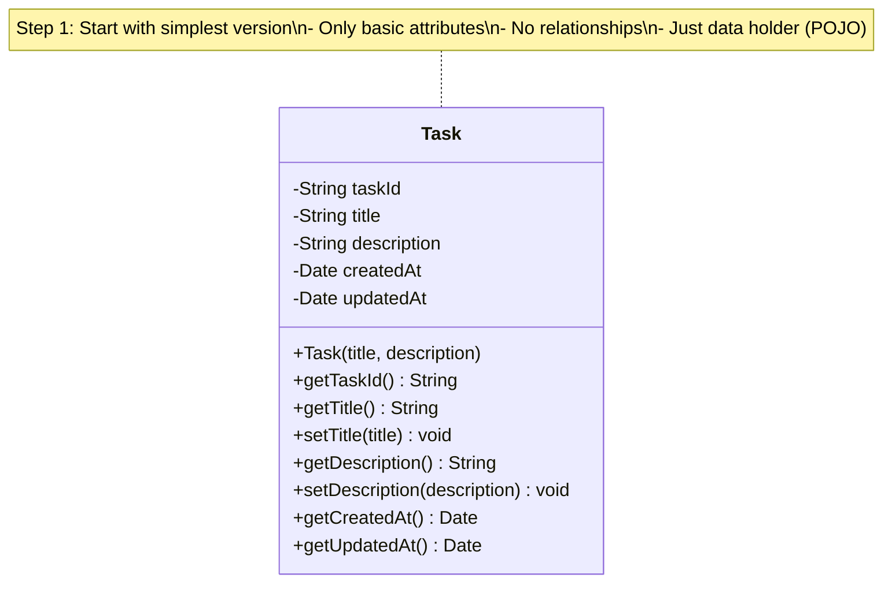
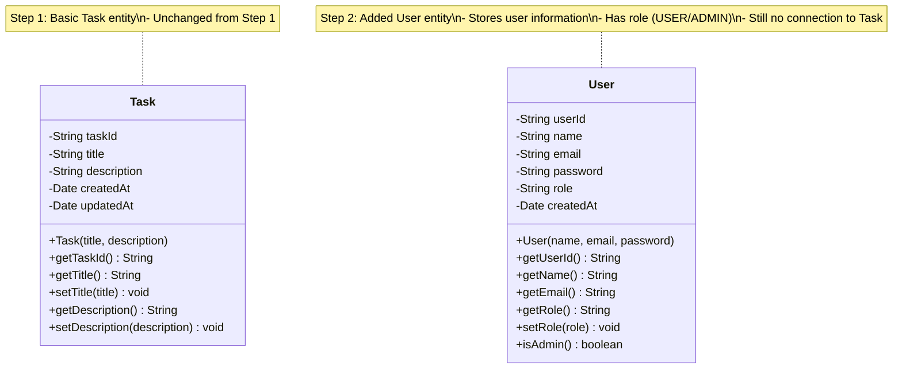
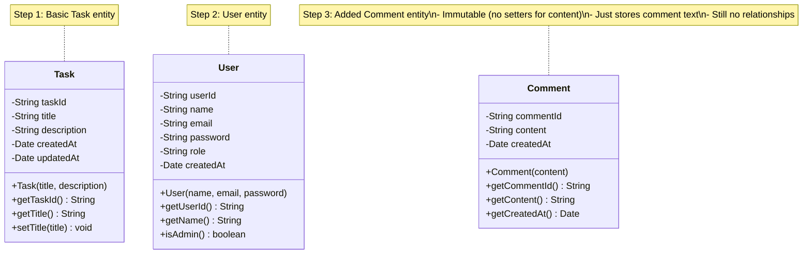

# Phase 3: Core Entity Design (Incremental Class Diagrams)

## 📋 Overview
In this phase, we'll design our core entities **step-by-step**. Each step builds on the previous one, showing how the design evolves naturally.

Think of it like building with LEGO blocks:
- Step 1: Place first block (Task entity)
- Step 2: Add second block (User entity)
- Step 3: Connect blocks (relationships)
- And so on...

---

## 🎯 Design Approach: Start Simple, Add Complexity

**Principle**: Don't try to design everything at once!

```
❌ Wrong: Design complete system in one go
✅ Right: Start with simplest version, iterate
```

---

## Step 1: Single Entity (Task)

### What We're Adding?
- Just the **Task** entity
- Only essential attributes
- No relationships yet

### Why Start Here?
- Task is the **core** of our system (most important entity)
- Understanding one entity well before adding complexity
- Foundation for everything else

### Design Decision
- **ID as String**: UUIDs are better than auto-increment integers (distributed systems)
- **Timestamps**: Track when task was created/updated (audit trail)
- **No relationships yet**: Keep it simple first

---

### Step 1 Class Diagram



### Java Code (Step 1)

```java
/**
 * Task Entity - Step 1: Basic Version
 *
 * This is a POJO (Plain Old Java Object) - just a data holder.
 * No business logic here!
 */
public class Task {

    // Primary Key - Using String for UUID
    private String taskId;

    // Basic task information
    private String title;          // e.g., "Fix login bug"
    private String description;    // e.g., "Users can't login with email"

    // Audit fields - track when task was created/updated
    private Date createdAt;
    private Date updatedAt;

    /**
     * Constructor - Creates a new task
     *
     * @param title - What needs to be done (mandatory)
     * @param description - Detailed explanation (optional)
     */
    public Task(String title, String description) {
        this.taskId = UUID.randomUUID().toString();  // Auto-generate ID
        this.title = title;
        this.description = description;
        this.createdAt = new Date();  // Current timestamp
        this.updatedAt = new Date();
    }

    // Getters and Setters
    // These allow controlled access to private fields

    public String getTaskId() {
        return taskId;
    }

    public String getTitle() {
        return title;
    }

    public void setTitle(String title) {
        this.title = title;
        this.updatedAt = new Date();  // Update timestamp when changed
    }

    public String getDescription() {
        return description;
    }

    public void setDescription(String description) {
        this.description = description;
        this.updatedAt = new Date();
    }

    public Date getCreatedAt() {
        return createdAt;
    }

    public Date getUpdatedAt() {
        return updatedAt;
    }
}
```

### What's Missing?
- ❌ No status (TODO, IN_PROGRESS, DONE)
- ❌ No priority (LOW, MEDIUM, HIGH)
- ❌ No owner/assignee
- ❌ No comments

**That's okay!** We'll add these step-by-step.

---

## Step 2: Add User Entity

### What We're Adding?
- **User** entity
- Basic user information
- Still no relationships

### Why Add This Now?
- Tasks need to be assigned to users
- Before connecting them, define User clearly
- Each entity should be understood independently first

### What Changed From Step 1?
- ➕ Added **User** entity
- Task entity unchanged (no modifications)

### Design Decision
- **Email as unique**: Users login with email
- **Password stored**: Will be hashed (security concern for later)
- **Role field**: Distinguish between regular user and admin

---

### Step 2 Class Diagram



### Java Code (Step 2)

```java
/**
 * User Entity - Step 2: Basic Version
 *
 * Represents a person using the system.
 * Can be a regular user or admin.
 */
public class User {

    // Primary Key
    private String userId;

    // User information
    private String name;          // e.g., "John Doe"
    private String email;         // e.g., "john@company.com" (unique!)
    private String password;      // Will be hashed (e.g., BCrypt)

    // Role: "USER" or "ADMIN"
    // In real system, use enum, but keeping simple for now
    private String role;

    // Audit field
    private Date createdAt;

    /**
     * Constructor - Creates a new user
     *
     * @param name - Full name
     * @param email - Unique email (used for login)
     * @param password - Plain password (will be hashed before storing)
     */
    public User(String name, String email, String password) {
        this.userId = UUID.randomUUID().toString();
        this.name = name;
        this.email = email;
        this.password = password;  // TODO: Hash this!
        this.role = "USER";        // Default role
        this.createdAt = new Date();
    }

    public String getUserId() {
        return userId;
    }

    public String getName() {
        return name;
    }

    public String getEmail() {
        return email;
    }

    public String getRole() {
        return role;
    }

    public void setRole(String role) {
        // Only allow USER or ADMIN
        if ("USER".equals(role) || "ADMIN".equals(role)) {
            this.role = role;
        }
    }

    /**
     * Check if this user is an admin
     *
     * @return true if admin, false otherwise
     */
    public boolean isAdmin() {
        return "ADMIN".equals(this.role);
    }

    public Date getCreatedAt() {
        return createdAt;
    }
}
```

---

## Step 3: Add Comment Entity

### What We're Adding?
- **Comment** entity
- Comments are remarks on tasks

### Why Add This Now?
- All core entities defined before relationships
- Comment is simpler than relationships
- Complete the entity set

### What Changed From Step 2?
- ➕ Added **Comment** entity
- Task and User unchanged

### Design Decision
- **Immutable**: Once posted, cannot edit (audit trail)
- **Timestamp**: Know when comment was added
- **No edit/delete**: Comments are permanent record

---

### Step 3 Class Diagram



### Java Code (Step 3)

```java
/**
 * Comment Entity - Step 3: Basic Version
 *
 * Represents a comment on a task.
 * Comments are IMMUTABLE - once posted, cannot be edited.
 */
public class Comment {

    // Primary Key
    private String commentId;

    // Comment text
    private String content;  // e.g., "I've started working on this"

    // When was it posted
    private Date createdAt;

    /**
     * Constructor - Creates a new comment
     *
     * @param content - The comment text (1-2000 characters)
     */
    public Comment(String content) {
        this.commentId = UUID.randomUUID().toString();
        this.content = content;
        this.createdAt = new Date();
    }

    public String getCommentId() {
        return commentId;
    }

    public String getContent() {
        return content;
    }

    // NO SETTER for content - immutable!
    // Once posted, content cannot be changed

    public Date getCreatedAt() {
        return createdAt;
    }

    /**
     * Check if comment mentions a user
     *
     * @param username - Username to check (e.g., "john")
     * @return true if comment contains @username
     */
    public boolean mentionsUser(String username) {
        return content.contains("@" + username);
    }
}
```

---

## 🎯 Summary of Steps 1-3

| Step | What We Added | Why |
|------|---------------|-----|
| 1 | Task entity | Core of the system |
| 2 | User entity | People who use tasks |
| 3 | Comment entity | Discussion on tasks |

**Current State**:
- ✅ Three independent entities
- ❌ No relationships yet
- ❌ No enums yet (Status, Priority)

**Next**: In Phase 4, we'll connect these entities with relationships!

---

## 💡 Beginner Concepts

### What is a POJO?

**POJO** = **P**lain **O**ld **J**ava **O**bject

A simple Java class with:
- ✅ Private fields
- ✅ Constructor
- ✅ Getters/Setters
- ❌ No special annotations (for now)
- ❌ No business logic (just data)

**Example**:
```java
public class Task {  // This is a POJO
    private String title;

    public Task(String title) {
        this.title = title;
    }

    public String getTitle() {
        return title;
    }
}
```

**Why POJOs?**
- Simple to understand
- Easy to test
- Frameworks (Spring, Hibernate) work well with POJOs

---

### Why UUID instead of Integer for ID?

**Option 1: Auto-increment Integer**
```java
private int taskId;  // 1, 2, 3, 4, ...
```
❌ Problems:
- Predictable (security issue)
- Conflicts in distributed systems
- Need database to generate

**Option 2: UUID (Universally Unique Identifier)**
```java
private String taskId;  // "550e8400-e29b-41d4-a716-446655440000"
```
✅ Benefits:
- Unique across all systems (no conflicts)
- Generated in application (no database call)
- Not predictable (better security)

**When to use each?**
- Small system, single database → Auto-increment OK
- Distributed system, microservices → UUID better
- Our system → UUID (best practice for modern apps)

---

### Why Separate createdAt and updatedAt?

```java
private Date createdAt;   // When task was created (never changes)
private Date updatedAt;   // When task was last modified (changes)
```

**Benefits**:
1. **Audit Trail**: Know when data changed
2. **Debugging**: Find recently modified tasks
3. **Sorting**: Sort by "most recent"
4. **Conflict Resolution**: Optimistic locking (more in Phase 8)

**Example**:
```
Task created: 2024-01-01 10:00 AM  (createdAt)
User updates title: 2024-01-01 11:30 AM  (updatedAt)
User updates status: 2024-01-01 02:15 PM  (updatedAt)

createdAt: 2024-01-01 10:00 AM  (unchanged)
updatedAt: 2024-01-01 02:15 PM  (latest change)
```

---

## 🚫 Common Beginner Mistakes

### Mistake 1: Adding Too Much Too Soon

```java
// ❌ Bad: Trying to add everything in first iteration
public class Task {
    private String taskId;
    private String title;
    private String description;
    private TaskStatus status;           // Too early!
    private TaskPriority priority;       // Too early!
    private User owner;                  // Too early!
    private User assignee;               // Too early!
    private List<Comment> comments;      // Too early!
    private List<Tag> tags;              // Too early!
    private Attachment attachment;       // Too early!
    // ... 50 more fields
}
```

**Why bad?**
- Overwhelming
- Can't understand core first
- Hard to modify later

**Solution**: Start simple, add incrementally (what we're doing!)

---

### Mistake 2: Making Everything Public

```java
// ❌ Bad: Public fields
public class Task {
    public String title;  // Anyone can change!
}

// Someone can do:
task.title = "";  // Set to empty! No validation!
task.title = null;  // Set to null! System crashes!
```

**Why bad?**
- No control over changes
- Can't add validation
- Can't track changes

**Solution**: Private fields + Getters/Setters

```java
// ✅ Good: Private fields with controlled access
public class Task {
    private String title;

    public void setTitle(String title) {
        if (title == null || title.isEmpty()) {
            throw new IllegalArgumentException("Title cannot be empty");
        }
        this.title = title;
        this.updatedAt = new Date();  // Track change
    }
}
```

---

### Mistake 3: No Constructor

```java
// ❌ Bad: No constructor
public class Task {
    private String taskId;
    private String title;
}

// Usage:
Task task = new Task();
task.setTaskId(UUID.randomUUID().toString());  // Manual work
task.setTitle("Fix bug");
```

**Why bad?**
- Easy to forget required fields
- Object can be in invalid state
- More code to write

**Solution**: Constructor with required fields

```java
// ✅ Good: Constructor ensures valid state
public class Task {
    private String taskId;
    private String title;

    public Task(String title) {
        if (title == null || title.isEmpty()) {
            throw new IllegalArgumentException("Title is required");
        }
        this.taskId = UUID.randomUUID().toString();  // Auto-generated
        this.title = title;
    }
}

// Usage:
Task task = new Task("Fix bug");  // Simple! Valid state guaranteed!
```

---

## 🎯 Key Takeaways

1. ✅ **Start Simple**: One entity at a time
2. ✅ **POJOs**: Simple data holders, no business logic
3. ✅ **Private Fields**: Encapsulation for control
4. ✅ **UUIDs**: Better for modern systems
5. ✅ **Audit Fields**: createdAt, updatedAt are essential
6. ✅ **Immutability**: Comments can't be edited (design choice)
7. ✅ **Constructors**: Ensure objects are in valid state

---

## 🚀 Next Steps

In **Phase 4**, we'll:
1. Add **Enums** (TaskStatus, TaskPriority)
2. Create **Relationships** between entities
3. Show different types of relationships (Association, Aggregation, Composition)
4. Understand UML relationship symbols

This is where entities come alive and connect! 🔗

---

**Phase 3 Complete!** ✅

Previous: [Phase 2 - Use Case Analysis](./phase2-use-case-analysis.md)
Next: [Phase 4 - Relationships & Enums](./phase4-relationships-enums.md)
