# Phase 4: Relationships & Enums

## 📋 Overview
In Phase 3, we created three independent entities. Now we'll connect them and add enums for status and priority.

Think of it like:
- Phase 3: We had puzzle pieces 🧩
- Phase 4: We connect the pieces 🔗

---

## 4.1 Understanding Relationships

### What is a Relationship?

A **relationship** is a connection between two classes showing how they interact.

**Real-world analogy**:
- Person **owns** a Car
- Student **enrolls in** a Course
- Task **belongs to** a User

---

## Types of Relationships (UML)

### 1. Association (Uses/Knows About)

**Definition**: Class A uses or knows about Class B, but they're independent

**Real-world Example**:
- Teacher teaches Student
- Doctor treats Patient
- If Teacher leaves, Student still exists ✅

**UML Symbol**: `――――>` (solid line with arrow)

**Strength**: Weakest relationship

---

### 2. Aggregation (Has-A, Can Exist Independently)

**Definition**: Class A has Class B, but B can exist without A

**Real-world Example**:
- Department has Employees
- If Department closes, Employees still exist ✅
- Employees can move to another department

**UML Symbol**: `◇―――>` (hollow diamond)

**Strength**: Medium relationship

**Key Point**: Child can exist without parent

---

### 3. Composition (Has-A, Cannot Exist Independently)

**Definition**: Class A owns Class B, B cannot exist without A

**Real-world Example**:
- House has Rooms
- If House is destroyed, Rooms are destroyed too ❌
- Room cannot exist without House

**UML Symbol**: `◆―――>` (filled diamond)

**Strength**: Strongest relationship

**Key Point**: Child dies with parent

---

### Quick Comparison Table

| Type | Symbol | Strength | Child exists independently? | Example |
|------|--------|----------|---------------------------|---------|
| Association | `――――>` | Weak | Yes | Teacher → Student |
| Aggregation | `◇―――>` | Medium | Yes | Department ◇―> Employee |
| Composition | `◆―――>` | Strong | No | House ◆―> Room |

---

## Step 4: Add Enums (Status & Priority)

### What We're Adding?
- **TaskStatus** enum (TODO, IN_PROGRESS, DONE)
- **TaskPriority** enum (LOW, MEDIUM, HIGH)

### Why Add Enums?
- **Type Safety**: Can't assign invalid values
- **Code Clarity**: `status = TaskStatus.TODO` is clearer than `status = "TODO"`
- **Compile-Time Checking**: Typos caught at compile time

### What Changed From Step 3?
- ➕ Added two enums
- Entities unchanged (preparing for next step)

---

### Step 4 Class Diagram


### Java Code (Step 4)

```java
/**
 * TaskStatus Enum
 *
 * Represents the current state of a task in its lifecycle.
 *
 * Lifecycle: TODO → IN_PROGRESS → DONE
 */
public enum TaskStatus {
    TODO,          // Task is created but not started
    IN_PROGRESS,   // Someone is working on it
    DONE;          // Task is completed

    /**
     * Check if status can transition to new status
     *
     * @param newStatus - The status to transition to
     * @return true if transition is valid
     */
    public boolean canTransitionTo(TaskStatus newStatus) {
        // Cannot change from DONE (immutable)
        if (this == DONE) {
            return false;
        }

        // All other transitions are valid
        return true;
    }

    /**
     * Get user-friendly display name
     *
     * @return display name
     */
    public String getDisplayName() {
        switch (this) {
            case TODO:
                return "To Do";
            case IN_PROGRESS:
                return "In Progress";
            case DONE:
                return "Done";
            default:
                return this.name();
        }
    }
}
```

```java
/**
 * TaskPriority Enum
 *
 * Represents how urgent/important a task is.
 */
public enum TaskPriority {
    LOW,      // Can be done later
    MEDIUM,   // Normal priority
    HIGH;     // Urgent, do first

    /**
     * Get numeric value for sorting
     * Higher number = higher priority
     *
     * @return priority value
     */
    public int getValue() {
        switch (this) {
            case LOW:
                return 1;
            case MEDIUM:
                return 2;
            case HIGH:
                return 3;
            default:
                return 0;
        }
    }

    /**
     * Compare priorities
     *
     * @param other - Another priority
     * @return true if this priority is higher
     */
    public boolean isHigherThan(TaskPriority other) {
        return this.getValue() > other.getValue();
    }
}
```

---

## Step 5: Add Task → User Relationship (Owner & Assignee)

### What We're Adding?
- Task has an **owner** (who created it)
- Task has an **assignee** (who works on it)
- Task has **status** and **priority**

### Why Add This Now?
- Connect Task to User (core relationship)
- Add status and priority to Task (from enums)

### What Changed From Step 4?
- ➕ Task now has owner (User)
- ➕ Task now has assignee (User)
- ➕ Task now has status (TaskStatus)
- ➕ Task now has priority (TaskPriority)

### Design Decision
- **Aggregation**: Task → User (aggregation)
  - If Task is deleted, User still exists ✅
  - User can exist independently
- **One-to-Many**: One User can have many Tasks
- **Owner vs Assignee**: Owner creates, Assignee does the work

---

### Step 5 Class Diagram


### Java Code (Step 5)

```java
/**
 * Task Entity - Step 5: With Relationships
 *
 * Now Task is connected to User!
 */
public class Task {

    // Identity
    private String taskId;

    // Basic info
    private String title;
    private String description;

    // NEW: Enums
    private TaskStatus status;
    private TaskPriority priority;

    // NEW: Relationships to User
    private User owner;      // Who created this task (mandatory)
    private User assignee;   // Who is working on it (optional)

    // Audit
    private Date createdAt;
    private Date updatedAt;

    /**
     * Constructor - Create a new task
     *
     * @param title - Task title
     * @param description - Task description
     * @param owner - User who creates this task (becomes owner)
     */
    public Task(String title, String description, User owner) {
        // Validation
        if (title == null || title.trim().isEmpty()) {
            throw new IllegalArgumentException("Title cannot be empty");
        }
        if (owner == null) {
            throw new IllegalArgumentException("Owner cannot be null");
        }

        // Initialize
        this.taskId = UUID.randomUUID().toString();
        this.title = title;
        this.description = description;
        this.owner = owner;
        this.status = TaskStatus.TODO;         // Default status
        this.priority = TaskPriority.MEDIUM;   // Default priority
        this.assignee = null;                  // Not assigned yet
        this.createdAt = new Date();
        this.updatedAt = new Date();
    }

    // Getters

    public TaskStatus getStatus() {
        return status;
    }

    public TaskPriority getPriority() {
        return priority;
    }

    public User getOwner() {
        return owner;
    }

    public User getAssignee() {
        return assignee;
    }

    // Setters with validation

    public void setStatus(TaskStatus newStatus) {
        // Validate transition
        if (!this.status.canTransitionTo(newStatus)) {
            throw new IllegalStateException(
                "Cannot transition from " + this.status + " to " + newStatus
            );
        }

        this.status = newStatus;
        this.updatedAt = new Date();
    }

    public void setPriority(TaskPriority priority) {
        this.priority = priority;
        this.updatedAt = new Date();
    }

    /**
     * Assign this task to a user
     *
     * @param user - User to assign to
     */
    public void assignTo(User user) {
        this.assignee = user;
        this.updatedAt = new Date();
    }

    /**
     * Unassign the task (remove assignee)
     */
    public void unassign() {
        this.assignee = null;
        this.updatedAt = new Date();
    }

    /**
     * Check if task is assigned
     *
     * @return true if someone is assigned
     */
    public boolean isAssigned() {
        return this.assignee != null;
    }

    /**
     * Check if task is completed
     *
     * @return true if status is DONE
     */
    public boolean isDone() {
        return this.status == TaskStatus.DONE;
    }
}
```

---

## Step 6: Add Task → Comment Relationship

### What We're Adding?
- Task has **many Comments**
- Comment belongs to **one Task**
- Comment is written by **one User**

### Why Add This Now?
- Complete the core entity relationships
- Show one-to-many relationship

### What Changed From Step 5?
- ➕ Task has list of Comments (one-to-many)
- ➕ Comment now has author (User)
- ➕ Comment now has task reference

### Design Decision
- **Composition**: Task ◆―> Comment
  - If Task is deleted, Comments are deleted too ❌
  - Comments cannot exist without Task
  - Strong ownership
- **Aggregation**: Comment ◇―> User
  - If Comment is deleted, User still exists ✅

---

### Step 6 Class Diagram


### Understanding the Symbols

```
Task "1" o-- "0..*" Comment
 │    │   │    │
 │    │   │    └── Multiplicity: 0 or more
 │    │   └── Hollow diamond: Composition
 │    └── Multiplicity: exactly 1
 └── Class name

Read as: "One Task has zero or more Comments"
```

### Java Code (Step 6)

```java
/**
 * Task Entity - Step 6: With Comments
 */
public class Task {

    private String taskId;
    private String title;
    private String description;
    private TaskStatus status;
    private TaskPriority priority;
    private User owner;
    private User assignee;

    // NEW: List of comments (one-to-many)
    private List<Comment> comments;

    private Date createdAt;
    private Date updatedAt;

    public Task(String title, String description, User owner) {
        // ... same as before ...

        // Initialize empty list
        this.comments = new ArrayList<>();
    }

    /**
     * Add a comment to this task
     *
     * @param comment - Comment to add
     */
    public void addComment(Comment comment) {
        if (comment == null) {
            throw new IllegalArgumentException("Comment cannot be null");
        }

        this.comments.add(comment);
        this.updatedAt = new Date();
    }

    /**
     * Get all comments on this task
     *
     * @return unmodifiable list of comments (prevent external modification)
     */
    public List<Comment> getComments() {
        return Collections.unmodifiableList(comments);
    }

    /**
     * Get number of comments
     *
     * @return comment count
     */
    public int getCommentCount() {
        return comments.size();
    }

    /**
     * Check if task has any comments
     *
     * @return true if at least one comment exists
     */
    public boolean hasComments() {
        return !comments.isEmpty();
    }
}
```

```java
/**
 * Comment Entity - Step 6: With Relationships
 */
public class Comment {

    private String commentId;
    private String content;
    private Date createdAt;

    // NEW: Relationships
    private User author;   // Who wrote this comment
    private Task task;     // Which task this belongs to

    /**
     * Constructor
     *
     * @param content - Comment text
     * @param author - User who wrote it
     * @param task - Task it belongs to
     */
    public Comment(String content, User author, Task task) {
        // Validation
        if (content == null || content.trim().isEmpty()) {
            throw new IllegalArgumentException("Content cannot be empty");
        }
        if (author == null) {
            throw new IllegalArgumentException("Author cannot be null");
        }
        if (task == null) {
            throw new IllegalArgumentException("Task cannot be null");
        }

        this.commentId = UUID.randomUUID().toString();
        this.content = content;
        this.author = author;
        this.task = task;
        this.createdAt = new Date();
    }

    public User getAuthor() {
        return author;
    }

    public Task getTask() {
        return task;
    }

    /**
     * Get author name for display
     *
     * @return author's name
     */
    public String getAuthorName() {
        return author.getName();
    }
}
```

---

## 4.2 Complete Entity Relationship Diagram

### Final Entity Model (All Relationships)

```mermaid
classDiagram
    class Task {
        -String taskId
        -String title
        -String description
        -TaskStatus status
        -TaskPriority priority
        -User owner
        -User assignee
        -List~Comment~ comments
        -Date createdAt
        -Date updatedAt
        +Task(title, description, owner)
        +getStatus() TaskStatus
        +setStatus(status) void
        +getPriority() TaskPriority
        +setPriority(priority) void
        +assignTo(user) void
        +addComment(comment) void
        +getComments() List~Comment~
        +isDone() boolean
        +isAssigned() boolean
    }

    class User {
        -String userId
        -String name
        -String email
        -String password
        -String role
        -Date createdAt
        +User(name, email, password)
        +getUserId() String
        +getName() String
        +getEmail() String
        +getRole() String
        +setRole(role) void
        +isAdmin() boolean
    }

    class Comment {
        -String commentId
        -String content
        -User author
        -Task task
        -Date createdAt
        +Comment(content, author, task)
        +getCommentId() String
        +getContent() String
        +getAuthor() User
        +getTask() Task
        +mentionsUser(username) boolean
    }

    class TaskStatus {
        <<enumeration>>
        TODO
        IN_PROGRESS
        DONE
        +canTransitionTo(newStatus) boolean
        +getDisplayName() String
    }

    class TaskPriority {
        <<enumeration>>
        LOW
        MEDIUM
        HIGH
        +getValue() int
        +isHigherThan(other) boolean
    }

    %% Relationships with multiplicity
    Task "1" *-- "0..*" Comment : contains ▸
    Comment "*" --> "1" User : authored by ▸
    Task "*" --> "1" User : owned by ▸
    Task "*" --> "0..1" User : assigned to ▸
    Task "*" --> "1" TaskStatus : has ▸
    Task "*" --> "1" TaskPriority : has ▸

    %% Styling
    style Task fill:#e8f5e9,stroke:#1b5e20,stroke-width:3px
    style User fill:#e1f5ff,stroke:#01579b,stroke-width:3px
    style Comment fill:#fff3e0,stroke:#e65100,stroke-width:3px
    style TaskStatus fill:#f3e5f5,stroke:#4a148c,stroke-width:2px
    style TaskPriority fill:#f3e5f5,stroke:#4a148c,stroke-width:2px
```



---

## 4.3 Relationship Explanation Table

| From | To | Type | Multiplicity | Meaning | Why This Type? |
|------|-----|------|--------------|---------|----------------|
| Task | Comment | Composition | 1 to 0..* | Task contains comments | Comments die with Task |
| Comment | User | Aggregation | * to 1 | User authors comment | User exists independently |
| Task | User (owner) | Aggregation | * to 1 | User owns task | User exists independently |
| Task | User (assignee) | Aggregation | * to 0..1 | User assigned to task | User exists independently |
| Task | TaskStatus | Association | * to 1 | Task has status | Enum (constant) |
| Task | TaskPriority | Association | * to 1 | Task has priority | Enum (constant) |

---

## 4.4 Multiplicity Explained

### What is Multiplicity?

**Multiplicity** shows how many instances can be related.

**Notation**:
- `1` = exactly one
- `0..1` = zero or one (optional)
- `0..*` or `*` = zero or more
- `1..*` = one or more

### Examples

```
Task "1" --> "0..1" User : assignee
```
**Read as**:
- One Task can have zero or one assignee
- Task might not be assigned (0)
- Task can be assigned to one user (1)
- Task cannot be assigned to multiple users

```
Task "1" --> "0..*" Comment
```
**Read as**:
- One Task can have zero or more comments
- New task has 0 comments
- Popular task might have 100 comments
- No upper limit

---

## 💡 Beginner Concepts

### Association vs Aggregation vs Composition

**Mental Model**:

```
Association: "Uses" or "Knows about"
   Teacher → Student
   "Teacher teaches Student"
   Both exist independently

Aggregation: "Has" (weak ownership)
   Company ◇―> Employee
   "Company has Employees"
   Employee can leave, still exists

Composition: "Owns" (strong ownership)
   House ◆―> Room
   "House owns Rooms"
   Room destroyed when House destroyed
```

**For Our System**:

```java
// Aggregation: Task → User
Task task = new Task("Fix bug", "...", john);
// If we delete task, john still exists ✅

// Composition: Task → Comment
Comment comment = new Comment("Done", john, task);
// If we delete task, comment should be deleted too ❌
```

---

### Why Use Enums?

**Without Enum** (String):
```java
task.setStatus("TODO");       // ✅ Works
task.setStatus("DONE");       // ✅ Works
task.setStatus("Done");       // ❌ Typo! But compiles!
task.setStatus("COMPLETED");  // ❌ Invalid! But compiles!
task.setStatus("asdf");       // ❌ Nonsense! But compiles!
```

**With Enum**:
```java
task.setStatus(TaskStatus.TODO);        // ✅ Works
task.setStatus(TaskStatus.DONE);        // ✅ Works
task.setStatus(TaskStatus.Done);        // ❌ Compile error! (case matters)
task.setStatus(TaskStatus.COMPLETED);   // ❌ Compile error! (doesn't exist)
task.setStatus("DONE");                 // ❌ Compile error! (wrong type)
```

**Benefits**:
1. ✅ **Type Safety**: Only valid values allowed
2. ✅ **Compile-Time Checking**: Errors caught early
3. ✅ **IDE Autocomplete**: IDE suggests valid values
4. ✅ **Refactoring**: Easy to rename (IDE does it)
5. ✅ **Documentation**: Clear what values are valid

---

### How to Read Class Diagrams


**Breakdown**:

1. **Class Box**:
   ```
   ┌─────────┐
   │  Task   │  ← Class name
   ├─────────┤
   │ -title  │  ← Private field (-)
   ├─────────┤
   │+setTitle│  ← Public method (+)
   └─────────┘
   ```

2. **Visibility**:
   - `-` = private
   - `+` = public
   - `#` = protected
   - `~` = package

3. **Relationship Line**:
   ```
   Task "1" *-- "0..*" Comment
    │    │   │    │      │
    │    │   │    │      └─ Class name
    │    │   │    └─ Multiplicity (0 or more)
    │    │   └─ Diamond (composition)
    │    └─ Multiplicity (exactly 1)
    └─ Class name
   ```

---

## 🚫 Common Beginner Mistakes

### Mistake 1: Circular Dependencies

```java
// ❌ Bad: Both classes reference each other directly
public class Task {
    private List<Comment> comments;

    public void addComment(Comment comment) {
        comments.add(comment);
        comment.setTask(this);  // Setting both directions manually
    }
}

public class Comment {
    private Task task;

    public void setTask(Task task) {
        this.task = task;
        task.addComment(this);  // Infinite recursion!
    }
}
```

**Problem**: Calling `addComment()` calls `setTask()` calls `addComment()` ... infinite loop!

**Solution**: One direction manages relationship
```java
// ✅ Good: Task manages relationship
public class Task {
    private List<Comment> comments;

    public void addComment(Comment comment) {
        if (!comments.contains(comment)) {
            comments.add(comment);
            // That's it! Don't call back to comment
        }
    }
}

public class Comment {
    private Task task;  // Just stores reference, doesn't modify task
}
```

---

### Mistake 2: Exposing Internal Collections

```java
// ❌ Bad: Returning mutable list
public class Task {
    private List<Comment> comments = new ArrayList<>();

    public List<Comment> getComments() {
        return comments;  // Returns actual list!
    }
}

// Someone can do:
task.getComments().clear();  // Deleted all comments! No validation!
```

**Problem**: Callers can modify internal state directly

**Solution**: Return unmodifiable list
```java
// ✅ Good: Return unmodifiable view
public List<Comment> getComments() {
    return Collections.unmodifiableList(comments);
}

// Now:
task.getComments().clear();  // Throws UnsupportedOperationException!

// Must use proper method:
task.addComment(comment);  // Goes through validation
```

---

### Mistake 3: Not Using Composition for Lifecycle Management

```java
// ❌ Bad: Using aggregation for comments
// Comment can exist without Task? No!

Task task = ...;
Comment comment = new Comment("Nice work", user, task);

// Later:
taskRepository.delete(task);  // Delete task
// But comment still exists in database! Orphaned!
```

**Solution**: Use composition + cascade delete
```java
// ✅ Good: Comments deleted with Task
@Entity
public class Task {
    @OneToMany(cascade = CascadeType.ALL, orphanRemoval = true)
    private List<Comment> comments;
}

// Now:
taskRepository.delete(task);  // Deletes task AND all comments!
```

---

## 🎯 Key Takeaways

1. ✅ **Enums**: Type-safe constants (TaskStatus, TaskPriority)
2. ✅ **Association**: Weak "uses" relationship
3. ✅ **Aggregation**: "Has" relationship, child survives
4. ✅ **Composition**: "Owns" relationship, child dies with parent
5. ✅ **Multiplicity**: How many instances relate (1, 0..1, *)
6. ✅ **Bidirectional**: Both classes reference each other (be careful!)
7. ✅ **Encapsulation**: Return unmodifiable collections

---

## 🚀 Next Steps

In **Phase 5**, we'll:
1. Design **Service Layer** (business logic)
2. Apply **SOLID Principles**
3. Separate concerns (controller, service, repository)
4. Show dependency injection

This is where we add the "brains" to our entities! 🧠

---

**Phase 4 Complete!** ✅

Previous: [Phase 3 - Core Entity Design](./phase3-core-entity-design.md)
Next: [Phase 5 - Service Layer Design](./phase5-service-layer-design.md)
