# Phase 5: Service Layer Design (SOLID Principles)

## 📋 Overview
So far we have entities (data holders). Now we need **business logic** - the "brains" of the system.

**Architecture Layers**:
```
┌─────────────────────┐
│   Controller Layer  │ ← Handles HTTP requests (REST API)
├─────────────────────┤
│   Service Layer     │ ← Business logic (THIS PHASE!)
├─────────────────────┤
│   Repository Layer  │ ← Data access (database)
├─────────────────────┤
│   Database          │ ← Stores data
└─────────────────────┘
```

---

## 5.1 Why Do We Need a Service Layer?

### Bad Design (No Service Layer)

```java
// ❌ Controller doing everything
@RestController
public class TaskController {

    @Autowired
    private TaskRepository taskRepo;

    @PostMapping("/tasks")
    public Task createTask(@RequestBody TaskDto dto) {
        // Validation
        if (dto.getTitle() == null || dto.getTitle().isEmpty()) {
            throw new Exception("Title required");
        }

        // Business logic
        Task task = new Task();
        task.setTitle(dto.getTitle());
        task.setStatus(TaskStatus.TODO);

        // Database
        taskRepo.save(task);

        // Send email
        emailService.send("Task created");

        return task;
    }
}
```

**Problems**:
1. ❌ Controller has too many responsibilities
2. ❌ Can't reuse logic (what if CLI wants same function?)
3. ❌ Hard to test (need HTTP server)
4. ❌ Business logic mixed with HTTP concerns

---

### Good Design (With Service Layer)

```java
// ✅ Controller: Only handles HTTP
@RestController
public class TaskController {

    @Autowired
    private TaskService taskService;  // Delegate to service

    @PostMapping("/tasks")
    public Task createTask(@RequestBody TaskDto dto) {
        return taskService.createTask(dto);  // That's it!
    }
}

// ✅ Service: Contains business logic
@Service
public class TaskService {

    @Autowired
    private TaskRepository taskRepo;

    public Task createTask(TaskDto dto) {
        // Validation, business logic, database, notifications
        // All in one place!
    }
}
```

**Benefits**:
1. ✅ Separation of concerns
2. ✅ Reusable (CLI, web, mobile can use same service)
3. ✅ Easy to test (no HTTP needed)
4. ✅ Clear responsibility

---

## 5.2 SOLID Principles

SOLID is an acronym for 5 design principles that make software maintainable.

### S - Single Responsibility Principle (SRP)

**Definition**: A class should have only ONE reason to change.

**Example**:

```java
// ❌ Bad: Multiple responsibilities
public class TaskService {
    public void createTask(Task task) {
        // 1. Validate
        validate(task);

        // 2. Save to database
        database.save(task);

        // 3. Send email
        sendEmail(task);

        // 4. Log to file
        logToFile(task);

        // 5. Update cache
        cache.update(task);
    }
}
```

**Reasons to change**: Validation logic, database change, email provider change, logging format change, cache strategy change = **5 reasons!**

```java
// ✅ Good: Single responsibility
public class TaskService {
    private TaskValidator validator;
    private TaskRepository repository;
    private NotificationService notificationService;
    private AuditService auditService;
    private CacheService cacheService;

    public void createTask(Task task) {
        validator.validate(task);              // 1 job
        repository.save(task);                 // 1 job
        notificationService.notifyCreation(task);  // 1 job
        auditService.log(task);                // 1 job
        cacheService.update(task);             // 1 job
    }
}
```

Each class has one responsibility!

---

### O - Open/Closed Principle (OCP)

**Definition**: Classes should be **open for extension**, but **closed for modification**.

**Example**:

```java
// ❌ Bad: Need to modify class to add new notification type
public class NotificationService {
    public void sendNotification(Task task, String type) {
        if (type.equals("EMAIL")) {
            // Send email
        } else if (type.equals("SMS")) {
            // Send SMS
        } else if (type.equals("PUSH")) {
            // Send push notification
        }
        // To add new type, must modify this class!
    }
}
```

```java
// ✅ Good: Can add new types without modifying existing code
public interface NotificationChannel {
    void send(Task task);
}

public class EmailNotification implements NotificationChannel {
    public void send(Task task) {
        // Send email
    }
}

public class SMSNotification implements NotificationChannel {
    public void send(Task task) {
        // Send SMS
    }
}

// Add new channel without modifying existing classes!
public class PushNotification implements NotificationChannel {
    public void send(Task task) {
        // Send push
    }
}

public class NotificationService {
    private List<NotificationChannel> channels;

    public void sendNotification(Task task) {
        for (NotificationChannel channel : channels) {
            channel.send(task);  // Polymorphism!
        }
    }
}
```

---

### L - Liskov Substitution Principle (LSP)

**Definition**: Subclass should be substitutable for their parent class.

**Example**:

```java
// ❌ Bad: Violates LSP
public class Task {
    public void setStatus(TaskStatus status) {
        this.status = status;  // Can set any status
    }
}

public class CompletedTask extends Task {
    @Override
    public void setStatus(TaskStatus status) {
        if (status != TaskStatus.DONE) {
            throw new Exception("Completed task cannot change status!");
        }
        // Changes behavior! LSP violated!
    }
}

// Usage:
Task task = new CompletedTask();
task.setStatus(TaskStatus.TODO);  // Throws exception! Unexpected!
```

**Better**: Don't use inheritance for this. Use composition or state pattern.

---

### I - Interface Segregation Principle (ISP)

**Definition**: Don't force classes to depend on interfaces they don't use.

**Example**:

```java
// ❌ Bad: Fat interface
public interface TaskOperations {
    void createTask(Task task);
    void updateTask(Task task);
    void deleteTask(String taskId);
    void assignTask(String taskId, String userId);
    void changeStatus(String taskId, TaskStatus status);
    void addComment(String taskId, Comment comment);
    // ... 20 more methods
}

// ReadOnlyTaskService only needs read operations
// But must implement ALL methods!
public class ReadOnlyTaskService implements TaskOperations {
    public void createTask(Task task) {
        throw new UnsupportedOperationException();  // Can't implement!
    }
    // Must provide dummy implementations for all write operations ❌
}
```

```java
// ✅ Good: Segregated interfaces
public interface TaskReader {
    Task getTask(String taskId);
    List<Task> listTasks();
}

public interface TaskWriter {
    void createTask(Task task);
    void updateTask(Task task);
    void deleteTask(String taskId);
}

// ReadOnlyService only implements what it needs
public class ReadOnlyTaskService implements TaskReader {
    public Task getTask(String taskId) { /*...*/ }
    public List<Task> listTasks() { /*...*/ }
    // No need to implement write operations!
}
```

---

### D - Dependency Inversion Principle (DIP)

**Definition**: Depend on abstractions (interfaces), not concrete classes.

**Example**:

```java
// ❌ Bad: Depends on concrete class
public class TaskService {
    private MySQLTaskRepository repository;  // Concrete class!

    public TaskService() {
        this.repository = new MySQLTaskRepository();  // Tightly coupled!
    }

    // Can't switch to PostgreSQL without modifying TaskService
}
```

```java
// ✅ Good: Depends on interface
public class TaskService {
    private TaskRepository repository;  // Interface!

    // Dependency Injection via constructor
    public TaskService(TaskRepository repository) {
        this.repository = repository;
    }

    // Can use ANY implementation: MySQL, PostgreSQL, MongoDB, In-Memory
}
```

---

## 5.3 Service Layer Architecture


---

## 5.4 Service Layer Class Diagram

```mermaid
classDiagram
    %% Service Interfaces
    class ITaskService {
        <<interface>>
        +createTask(dto) Task
        +getTask(taskId) Task
        +updateTask(taskId, dto) Task
        +deleteTask(taskId) void
        +assignTask(taskId, userId) void
        +updateStatus(taskId, status) void
        +listTasks(filter) List~Task~
    }

    class IUserService {
        <<interface>>
        +registerUser(dto) User
        +getUser(userId) User
        +getUserByEmail(email) User
        +updateUser(userId, dto) User
    }

    class ICommentService {
        <<interface>>
        +addComment(taskId, dto) Comment
        +getComments(taskId) List~Comment~
    }

    class INotificationService {
        <<interface>>
        +notifyTaskAssigned(task, user) void
        +notifyStatusChanged(task) void
        +notifyCommentAdded(task, comment) void
    }

    %% Service Implementations
    class TaskService {
        -TaskRepository taskRepo
        -UserService userService
        -CommentService commentService
        -NotificationService notificationService
        -ValidationService validationService
        +createTask(dto) Task
        +assignTask(taskId, userId) void
        +updateStatus(taskId, status) void
    }

    class UserService {
        -UserRepository userRepo
        -PasswordEncoder passwordEncoder
        +registerUser(dto) User
        +getUserByEmail(email) User
    }

    class CommentService {
        -CommentRepository commentRepo
        -UserService userService
        -TaskService taskService
        +addComment(taskId, dto) Comment
    }

    class NotificationService {
        -EmailService emailService
        -SMSService smsService
        +notifyTaskAssigned(task, user) void
        +notifyStatusChanged(task) void
    }

    class ValidationService {
        +validateTask(dto) void
        +validateUser(dto) void
        +validateComment(dto) void
    }

    %% Relationships
    ITaskService <|.. TaskService : implements
    IUserService <|.. UserService : implements
    ICommentService <|.. CommentService : implements
    INotificationService <|.. NotificationService : implements

    TaskService --> IUserService : depends on
    TaskService --> ICommentService : depends on
    TaskService --> INotificationService : depends on
    TaskService --> ValidationService : depends on
    CommentService --> IUserService : depends on

    note for TaskService "✅ SRP: Only task operations\n✅ DIP: Depends on interfaces\n✅ OCP: Easy to extend"
    note for ITaskService "✅ ISP: Focused interface\nOnly task-related operations"

    style ITaskService fill:#e1f5ff,stroke:#01579b,stroke-width:3px
    style IUserService fill:#e1f5ff,stroke:#01579b,stroke-width:3px
    style ICommentService fill:#e1f5ff,stroke:#01579b,stroke-width:3px
    style INotificationService fill:#e1f5ff,stroke:#01579b,stroke-width:3px
    style TaskService fill:#e8f5e9,stroke:#1b5e20,stroke-width:3px
    style UserService fill:#e8f5e9,stroke:#1b5e20,stroke-width:3px
    style CommentService fill:#e8f5e9,stroke:#1b5e20,stroke-width:3px
    style NotificationService fill:#fff3e0,stroke:#e65100,stroke-width:2px
    style ValidationService fill:#fff3e0,stroke:#e65100,stroke-width:2px
```



---

## 5.5 Java Code - Service Layer

### ITaskService Interface

```java
/**
 * Task Service Interface
 *
 * Defines operations for task management.
 * Following Interface Segregation Principle (ISP).
 */
public interface ITaskService {

    /**
     * Create a new task
     *
     * @param dto - Task creation data
     * @return Created task
     * @throws ValidationException if data is invalid
     */
    Task createTask(TaskCreationDto dto);

    /**
     * Get task by ID
     *
     * @param taskId - Task ID
     * @return Task if found
     * @throws TaskNotFoundException if not found
     */
    Task getTask(String taskId);

    /**
     * Update task details
     *
     * @param taskId - Task ID
     * @param dto - Update data
     * @return Updated task
     */
    Task updateTask(String taskId, TaskUpdateDto dto);

    /**
     * Delete task
     *
     * @param taskId - Task ID
     * @throws TaskNotFoundException if not found
     */
    void deleteTask(String taskId);

    /**
     * Assign task to user
     *
     * @param taskId - Task ID
     * @param userId - User ID to assign to
     */
    void assignTask(String taskId, String userId);

    /**
     * Update task status
     *
     * @param taskId - Task ID
     * @param status - New status
     */
    void updateStatus(String taskId, TaskStatus status);

    /**
     * Update task priority
     *
     * @param taskId - Task ID
     * @param priority - New priority
     */
    void updatePriority(String taskId, TaskPriority priority);

    /**
     * List tasks with optional filter
     *
     * @param filter - Filter criteria
     * @return List of tasks matching filter
     */
    List<Task> listTasks(TaskFilter filter);
}
```

---

### TaskService Implementation

```java
/**
 * Task Service Implementation
 *
 * SOLID Principles Applied:
 * - SRP: Only handles task business logic
 * - OCP: Can extend with decorators/proxies
 * - LSP: Properly implements ITaskService
 * - ISP: Interface has focused operations
 * - DIP: Depends on interfaces (IUserService, etc.)
 */
@Service  // Spring annotation
public class TaskService implements ITaskService {

    // Dependencies (all interfaces - DIP!)
    private final TaskRepository taskRepository;
    private final IUserService userService;
    private final INotificationService notificationService;
    private final ValidationService validationService;

    /**
     * Constructor Injection (Dependency Injection)
     *
     * Benefits:
     * - Easy to test (pass mock objects)
     * - Explicit dependencies (clear what's needed)
     * - Immutable (final fields)
     */
    @Autowired
    public TaskService(
            TaskRepository taskRepository,
            IUserService userService,
            INotificationService notificationService,
            ValidationService validationService
    ) {
        this.taskRepository = taskRepository;
        this.userService = userService;
        this.notificationService = notificationService;
        this.validationService = validationService;
    }

    /**
     * Create a new task
     *
     * Steps:
     * 1. Validate input
     * 2. Get owner user
     * 3. Create task entity
     * 4. Save to database
     * 5. Send notification if assigned
     * 6. Return created task
     */
    @Override
    public Task createTask(TaskCreationDto dto) {
        // Step 1: Validate
        validationService.validateTaskCreation(dto);

        // Step 2: Get owner
        User owner = userService.getUser(dto.getOwnerId());

        // Step 3: Create entity
        Task task = new Task(
            dto.getTitle(),
            dto.getDescription(),
            owner
        );

        // Set optional fields
        if (dto.getPriority() != null) {
            task.setPriority(dto.getPriority());
        }

        // Step 4: Save
        task = taskRepository.save(task);

        // Step 5: Assign if specified
        if (dto.getAssigneeId() != null) {
            assignTask(task.getTaskId(), dto.getAssigneeId());
        }

        return task;
    }

    /**
     * Assign task to user
     *
     * Business rules:
     * - Only owner or admin can assign
     * - Assignee must exist
     * - Cannot assign to self if already owner
     * - Send notification to assignee
     */
    @Override
    public void assignTask(String taskId, String userId) {
        // Get task
        Task task = getTask(taskId);

        // Get assignee
        User assignee = userService.getUser(userId);

        // Business rule: Check if already assigned
        if (task.getAssignee() != null &&
            task.getAssignee().getUserId().equals(userId)) {
            throw new BusinessException("Task already assigned to this user");
        }

        // Assign
        task.assignTo(assignee);

        // Save
        taskRepository.update(task);

        // Notification
        notificationService.notifyTaskAssigned(task, assignee);
    }

    /**
     * Update task status
     *
     * Business rules:
     * - Only assignee or owner can update
     * - Status transition must be valid
     * - Notify owner when status changes
     */
    @Override
    public void updateStatus(String taskId, TaskStatus newStatus) {
        // Get task
        Task task = getTask(taskId);

        // Store old status for notification
        TaskStatus oldStatus = task.getStatus();

        // Update (entity validates transition)
        try {
            task.setStatus(newStatus);
        } catch (IllegalStateException e) {
            throw new BusinessException("Invalid status transition", e);
        }

        // Save
        taskRepository.update(task);

        // Notification
        if (oldStatus != newStatus) {
            notificationService.notifyStatusChanged(task, oldStatus, newStatus);
        }
    }

    /**
     * Get task by ID
     */
    @Override
    public Task getTask(String taskId) {
        Task task = taskRepository.findById(taskId);
        if (task == null) {
            throw new TaskNotFoundException("Task not found: " + taskId);
        }
        return task;
    }

    /**
     * List tasks with filter
     *
     * Examples:
     * - All tasks: filter = null
     * - By status: filter.status = IN_PROGRESS
     * - By assignee: filter.assigneeId = "user123"
     * - By priority: filter.priority = HIGH
     */
    @Override
    public List<Task> listTasks(TaskFilter filter) {
        if (filter == null) {
            return taskRepository.findAll();
        }

        // Delegate to repository
        // Repository handles complex queries
        return taskRepository.findByFilter(filter);
    }

    /**
     * Update task
     */
    @Override
    public Task updateTask(String taskId, TaskUpdateDto dto) {
        validationService.validateTaskUpdate(dto);

        Task task = getTask(taskId);

        // Update fields if provided
        if (dto.getTitle() != null) {
            task.setTitle(dto.getTitle());
        }

        if (dto.getDescription() != null) {
            task.setDescription(dto.getDescription());
        }

        if (dto.getPriority() != null) {
            task.setPriority(dto.getPriority());
        }

        // Save
        return taskRepository.update(task);
    }

    /**
     * Delete task
     *
     * Business rule: Only owner or admin can delete
     */
    @Override
    public void deleteTask(String taskId) {
        Task task = getTask(taskId);
        taskRepository.delete(taskId);
    }
}
```

---

### ValidationService

```java
/**
 * Validation Service
 *
 * SRP: Only handles validation logic
 * Separated from TaskService for clarity
 */
@Service
public class ValidationService {

    /**
     * Validate task creation data
     *
     * @param dto - Task creation data
     * @throws ValidationException if invalid
     */
    public void validateTaskCreation(TaskCreationDto dto) {
        List<String> errors = new ArrayList<>();

        // Title validation
        if (dto.getTitle() == null || dto.getTitle().trim().isEmpty()) {
            errors.add("Title is required");
        } else if (dto.getTitle().length() < 3) {
            errors.add("Title must be at least 3 characters");
        } else if (dto.getTitle().length() > 200) {
            errors.add("Title must not exceed 200 characters");
        }

        // Description validation
        if (dto.getDescription() != null && dto.getDescription().length() > 5000) {
            errors.add("Description must not exceed 5000 characters");
        }

        // Owner validation
        if (dto.getOwnerId() == null || dto.getOwnerId().trim().isEmpty()) {
            errors.add("Owner ID is required");
        }

        // Throw if errors
        if (!errors.isEmpty()) {
            throw new ValidationException(errors);
        }
    }

    /**
     * Validate task update
     */
    public void validateTaskUpdate(TaskUpdateDto dto) {
        List<String> errors = new ArrayList<>();

        // Title validation (if provided)
        if (dto.getTitle() != null) {
            if (dto.getTitle().trim().isEmpty()) {
                errors.add("Title cannot be empty");
            } else if (dto.getTitle().length() < 3) {
                errors.add("Title must be at least 3 characters");
            } else if (dto.getTitle().length() > 200) {
                errors.add("Title must not exceed 200 characters");
            }
        }

        // At least one field must be provided
        if (dto.getTitle() == null &&
            dto.getDescription() == null &&
            dto.getPriority() == null) {
            errors.add("At least one field must be updated");
        }

        if (!errors.isEmpty()) {
            throw new ValidationException(errors);
        }
    }

    /**
     * Validate comment
     */
    public void validateComment(CommentCreationDto dto) {
        List<String> errors = new ArrayList<>();

        if (dto.getContent() == null || dto.getContent().trim().isEmpty()) {
            errors.add("Comment content is required");
        } else if (dto.getContent().length() > 2000) {
            errors.add("Comment must not exceed 2000 characters");
        }

        if (dto.getAuthorId() == null) {
            errors.add("Author ID is required");
        }

        if (dto.getTaskId() == null) {
            errors.add("Task ID is required");
        }

        if (!errors.isEmpty()) {
            throw new ValidationException(errors);
        }
    }
}
```

---

### NotificationService

```java
/**
 * Notification Service
 *
 * SRP: Only handles notifications
 * OCP: Easy to add new notification channels
 */
@Service
public class NotificationService implements INotificationService {

    private final EmailService emailService;
    private final SMSService smsService;

    @Autowired
    public NotificationService(EmailService emailService, SMSService smsService) {
        this.emailService = emailService;
        this.smsService = smsService;
    }

    /**
     * Notify user when task is assigned
     */
    @Override
    public void notifyTaskAssigned(Task task, User assignee) {
        String subject = "Task Assigned: " + task.getTitle();
        String message = String.format(
            "Hi %s,\n\nYou have been assigned to task: %s\n\nDescription: %s\n\nPriority: %s",
            assignee.getName(),
            task.getTitle(),
            task.getDescription(),
            task.getPriority().getDisplayName()
        );

        // Send email
        emailService.send(assignee.getEmail(), subject, message);

        // Optionally send SMS for high priority
        if (task.getPriority() == TaskPriority.HIGH) {
            smsService.send(assignee.getPhoneNumber(), "High priority task assigned: " + task.getTitle());
        }
    }

    /**
     * Notify when status changes
     */
    @Override
    public void notifyStatusChanged(Task task, TaskStatus oldStatus, TaskStatus newStatus) {
        // Notify owner if assignee changed status
        User owner = task.getOwner();

        String subject = "Task Status Updated: " + task.getTitle();
        String message = String.format(
            "Task '%s' status changed from %s to %s",
            task.getTitle(),
            oldStatus.getDisplayName(),
            newStatus.getDisplayName()
        );

        emailService.send(owner.getEmail(), subject, message);
    }

    /**
     * Notify when comment is added
     */
    @Override
    public void notifyCommentAdded(Task task, Comment comment) {
        // Notify owner and assignee (if different from commenter)
        Set<String> recipients = new HashSet<>();

        recipients.add(task.getOwner().getEmail());
        if (task.getAssignee() != null) {
            recipients.add(task.getAssignee().getEmail());
        }

        // Remove commenter from recipients
        recipients.remove(comment.getAuthor().getEmail());

        String subject = "New Comment on Task: " + task.getTitle();
        String message = String.format(
            "%s commented on '%s':\n\n%s",
            comment.getAuthor().getName(),
            task.getTitle(),
            comment.getContent()
        );

        for (String email : recipients) {
            emailService.send(email, subject, message);
        }
    }
}
```

---

## 5.6 DTOs (Data Transfer Objects)

### Why DTOs?

DTOs decouple API from domain entities.

**Benefits**:
1. ✅ **Security**: Don't expose all entity fields (e.g., password)
2. ✅ **Flexibility**: API can change without changing entities
3. ✅ **Validation**: Request-specific validation
4. ✅ **Clarity**: Clear what data is needed for each operation

```java
/**
 * Task Creation DTO
 *
 * Only fields needed to create a task.
 * Simpler than Task entity.
 */
public class TaskCreationDto {
    private String title;          // Required
    private String description;    // Optional
    private String ownerId;        // Required
    private String assigneeId;     // Optional
    private TaskPriority priority; // Optional (default: MEDIUM)

    // Getters and setters
    // ...
}

/**
 * Task Update DTO
 *
 * Only fields that can be updated.
 * All fields optional.
 */
public class TaskUpdateDto {
    private String title;          // Optional
    private String description;    // Optional
    private TaskPriority priority; // Optional

    // Getters and setters
    // ...
}

/**
 * Task Response DTO
 *
 * What API returns to client.
 * Includes computed fields.
 */
public class TaskResponseDto {
    private String taskId;
    private String title;
    private String description;
    private TaskStatus status;
    private TaskPriority priority;
    private String ownerName;      // Denormalized for convenience
    private String assigneeName;   // Denormalized
    private int commentCount;      // Computed
    private Date createdAt;
    private Date updatedAt;

    // Constructor from Task entity
    public static TaskResponseDto fromEntity(Task task) {
        TaskResponseDto dto = new TaskResponseDto();
        dto.setTaskId(task.getTaskId());
        dto.setTitle(task.getTitle());
        dto.setDescription(task.getDescription());
        dto.setStatus(task.getStatus());
        dto.setPriority(task.getPriority());
        dto.setOwnerName(task.getOwner().getName());
        if (task.getAssignee() != null) {
            dto.setAssigneeName(task.getAssignee().getName());
        }
        dto.setCommentCount(task.getCommentCount());
        dto.setCreatedAt(task.getCreatedAt());
        dto.setUpdatedAt(task.getUpdatedAt());
        return dto;
    }
}
```

---

## 💡 Beginner Concepts

### What is Dependency Injection?

**Without DI** (Hard-coded):
```java
public class TaskService {
    private TaskRepository repo = new MySQLTaskRepository();  // Tight coupling!

    // Can't change to PostgreSQL without modifying code
}
```

**With DI** (Flexible):
```java
public class TaskService {
    private TaskRepository repo;  // Interface

    // Spring provides implementation at runtime
    @Autowired
    public TaskService(TaskRepository repo) {
        this.repo = repo;
    }

    // Can be MySQL, PostgreSQL, or In-Memory without code change!
}
```

**Benefits**:
- Easy to test (inject mock repository)
- Easy to switch implementations
- Loose coupling

---

### Why Constructor Injection?

**Three types of DI**:

1. **Constructor Injection** ✅ (Recommended)
```java
public class TaskService {
    private final TaskRepository repo;  // Final = immutable

    @Autowired
    public TaskService(TaskRepository repo) {
        this.repo = repo;
    }
}
```

2. **Setter Injection** ❌ (Not recommended)
```java
public class TaskService {
    private TaskRepository repo;

    @Autowired
    public void setRepository(TaskRepository repo) {
        this.repo = repo;
    }
    // repo can be null! Not guaranteed to be set!
}
```

3. **Field Injection** ❌ (Convenient but bad)
```java
public class TaskService {
    @Autowired
    private TaskRepository repo;
    // Hard to test, breaks encapsulation
}
```

**Why constructor is best**:
1. ✅ Immutable (final fields)
2. ✅ Explicit dependencies
3. ✅ Easy to test (no Spring needed)
4. ✅ Cannot create object in invalid state

---

## 🚫 Common Beginner Mistakes

### Mistake 1: God Service (Violates SRP)

```java
// ❌ Bad: One service does everything
@Service
public class ApplicationService {
    public void createTask() { /*...*/ }
    public void createUser() { /*...*/ }
    public void sendEmail() { /*...*/ }
    public void generateReport() { /*...*/ }
    public void processPayment() { /*...*/ }
    // ... 100 more methods
}
```

**Solution**: Split into focused services (TaskService, UserService, etc.)

---

### Mistake 2: Service Depends on Controller

```java
// ❌ Bad: Service depends on web layer
@Service
public class TaskService {
    public Task createTask(HttpServletRequest request) {  // Web-specific!
        String title = request.getParameter("title");
        // ...
    }
}
```

**Solution**: Service should be independent of delivery mechanism

```java
// ✅ Good: Service uses DTOs
@Service
public class TaskService {
    public Task createTask(TaskCreationDto dto) {  // Generic DTO!
        // Can be used by web, CLI, mobile, etc.
    }
}
```

---

### Mistake 3: Returning Entities Directly

```java
// ❌ Bad: Controller returns entity
@RestController
public class TaskController {
    @GetMapping("/tasks/{id}")
    public Task getTask(@PathVariable String id) {
        return taskService.getTask(id);  // Exposes all fields!
    }
}
```

**Problem**: Exposes internal structure, may include sensitive data

**Solution**: Use DTOs

```java
// ✅ Good: Controller returns DTO
@GetMapping("/tasks/{id}")
public TaskResponseDto getTask(@PathVariable String id) {
    Task task = taskService.getTask(id);
    return TaskResponseDto.fromEntity(task);  // Convert to DTO
}
```

---

## 🎯 Key Takeaways

1. ✅ **Service Layer**: Contains business logic
2. ✅ **SOLID Principles**: Make code maintainable
   - **S**ingle Responsibility
   - **O**pen/Closed
   - **L**iskov Substitution
   - **I**nterface Segregation
   - **D**ependency Inversion
3. ✅ **Dependency Injection**: Loose coupling
4. ✅ **DTOs**: Decouple API from entities
5. ✅ **Validation**: Separate validation logic
6. ✅ **Notifications**: Separate cross-cutting concerns

---

## 🚀 Next Steps

In **Phase 6**, we'll:
1. Design **Repository Layer** (data access)
2. Apply **Repository Pattern**
3. Create JPA implementations
4. Show in-memory implementations for testing

---

**Phase 5 Complete!** ✅

Previous: [Phase 4 - Relationships & Enums](./phase4-relationships-enums.md)
Next: [Phase 6 - Repository & Data Layer](./phase6-repository-data-layer.md)
