# Phase 6: Repository & Data Layer

## 📋 Overview
The Repository Layer sits between the Service Layer and the Database. It handles all data access logic.

**Why separate it?**
- Service Layer doesn't know HOW data is stored
- Easy to switch databases (MySQL → PostgreSQL → MongoDB)
- Easy to test (use in-memory implementations)

```
Service Layer → Repository Interface → Implementation (MySQL/PostgreSQL/In-Memory)
```

---

## 6.1 Repository Pattern

### What is the Repository Pattern?

**Definition**: Mediates between the domain and data mapping layers, acting like an in-memory collection of domain objects.

**Analogy**: Think of it as a **librarian**
- You ask librarian for a book (don't care where it's stored)
- Librarian finds it (knows the storage system)
- You get the book (don't know if it was in shelf A or B)

---

### Benefits

1. ✅ **Abstraction**: Hide database details
2. ✅ **Testability**: Easy to mock
3. ✅ **Centralization**: All queries in one place
4. ✅ **Flexibility**: Switch databases without changing business logic
5. ✅ **Reusability**: Same repository used by multiple services

---

## 6.2 Repository Architecture

```mermaid
graph TB
    subgraph "Service Layer"
        TS[TaskService]
    end

    subgraph "Repository Pattern"
        ITR[TaskRepository Interface]

        subgraph "Implementations"
            JTR[JpaTaskRepository]
            MTR[InMemoryTaskRepository]
        end
    end

    subgraph "Data Storage"
        DB[(MySQL Database)]
        MEM[HashMap In Memory]
    end

    TS -->|depends on| ITR
    ITR <|.. JTR
    ITR <|.. MTR
    JTR --> DB
    MTR --> MEM

    style ITR fill:#e1f5ff,stroke:#01579b,stroke-width:3px
    style JTR fill:#e8f5e9,stroke:#1b5e20,stroke-width:3px
    style MTR fill:#fff3e0,stroke:#e65100,stroke-width:2px
    style TS fill:#f3e5f5,stroke:#4a148c,stroke-width:2px
```

**Key Point**: Service depends on **interface**, not implementation (Dependency Inversion Principle!)

---

## 6.3 Repository Interface Design

### TaskRepository Interface

```java
/**
 * TaskRepository Interface
 *
 * Defines data access operations for Task entity.
 * Service layer depends on this interface, not implementation.
 */
public interface TaskRepository {

    /**
     * Save a new task
     *
     * @param task - Task to save
     * @return Saved task (with generated ID if applicable)
     */
    Task save(Task task);

    /**
     * Update an existing task
     *
     * @param task - Task to update
     * @return Updated task
     */
    Task update(Task task);

    /**
     * Find task by ID
     *
     * @param taskId - Task ID
     * @return Task if found, null otherwise
     */
    Task findById(String taskId);

    /**
     * Find all tasks
     *
     * @return List of all tasks
     */
    List<Task> findAll();

    /**
     * Find tasks by status
     *
     * @param status - Task status
     * @return List of tasks with given status
     */
    List<Task> findByStatus(TaskStatus status);

    /**
     * Find tasks by priority
     *
     * @param priority - Task priority
     * @return List of tasks with given priority
     */
    List<Task> findByPriority(TaskPriority priority);

    /**
     * Find tasks assigned to a user
     *
     * @param userId - User ID
     * @return List of tasks assigned to user
     */
    List<Task> findByAssignee(String userId);

    /**
     * Find tasks owned by a user
     *
     * @param userId - User ID
     * @return List of tasks owned by user
     */
    List<Task> findByOwner(String userId);

    /**
     * Find tasks by filter
     *
     * Supports complex filtering (status, priority, assignee, etc.)
     *
     * @param filter - Filter criteria
     * @return List of tasks matching filter
     */
    List<Task> findByFilter(TaskFilter filter);

    /**
     * Delete task by ID
     *
     * @param taskId - Task ID
     * @return true if deleted, false if not found
     */
    boolean delete(String taskId);

    /**
     * Check if task exists
     *
     * @param taskId - Task ID
     * @return true if exists
     */
    boolean exists(String taskId);

    /**
     * Count total tasks
     *
     * @return Total number of tasks
     */
    long count();
}
```

---

### UserRepository Interface

```java
/**
 * UserRepository Interface
 */
public interface UserRepository {

    User save(User user);

    User update(User user);

    User findById(String userId);

    /**
     * Find user by email (unique)
     *
     * @param email - Email address
     * @return User if found, null otherwise
     */
    User findByEmail(String email);

    List<User> findAll();

    boolean delete(String userId);

    boolean exists(String userId);

    /**
     * Check if email is already taken
     *
     * @param email - Email to check
     * @return true if email exists
     */
    boolean emailExists(String email);
}
```

---

### CommentRepository Interface

```java
/**
 * CommentRepository Interface
 */
public interface CommentRepository {

    Comment save(Comment comment);

    Comment findById(String commentId);

    /**
     * Find all comments for a task
     *
     * @param taskId - Task ID
     * @return List of comments ordered by created date
     */
    List<Comment> findByTask(String taskId);

    /**
     * Find comments by author
     *
     * @param userId - User ID
     * @return List of comments by user
     */
    List<Comment> findByAuthor(String userId);

    /**
     * Count comments for a task
     *
     * @param taskId - Task ID
     * @return Number of comments
     */
    int countByTask(String taskId);

    boolean delete(String commentId);
}
```

---

## 6.4 JPA Implementation (Production)

### JpaTaskRepository

```java
/**
 * JPA Implementation of TaskRepository
 *
 * Uses Spring Data JPA for database operations.
 * Connects to MySQL/PostgreSQL database.
 */
@Repository  // Spring annotation
public class JpaTaskRepository implements TaskRepository {

    @PersistenceContext
    private EntityManager entityManager;

    /**
     * Save a new task
     *
     * JPA automatically generates ID and sets timestamps.
     */
    @Override
    @Transactional
    public Task save(Task task) {
        entityManager.persist(task);  // INSERT INTO tasks ...
        return task;
    }

    /**
     * Update existing task
     *
     * JPA tracks changes and updates automatically.
     */
    @Override
    @Transactional
    public Task update(Task task) {
        return entityManager.merge(task);  // UPDATE tasks SET ... WHERE id = ?
    }

    /**
     * Find by ID
     *
     * Returns managed entity (tracked by JPA).
     */
    @Override
    public Task findById(String taskId) {
        return entityManager.find(Task.class, taskId);
        // SELECT * FROM tasks WHERE task_id = ?
    }

    /**
     * Find all tasks
     *
     * Uses JPQL (Java Persistence Query Language).
     */
    @Override
    public List<Task> findAll() {
        String jpql = "SELECT t FROM Task t ORDER BY t.createdAt DESC";
        return entityManager.createQuery(jpql, Task.class)
                .getResultList();
    }

    /**
     * Find by status
     *
     * JPQL automatically converts enum to string.
     */
    @Override
    public List<Task> findByStatus(TaskStatus status) {
        String jpql = "SELECT t FROM Task t WHERE t.status = :status";
        return entityManager.createQuery(jpql, Task.class)
                .setParameter("status", status)
                .getResultList();
        // SELECT * FROM tasks WHERE status = 'IN_PROGRESS'
    }

    /**
     * Find by priority
     */
    @Override
    public List<Task> findByPriority(TaskPriority priority) {
        String jpql = "SELECT t FROM Task t WHERE t.priority = :priority";
        return entityManager.createQuery(jpql, Task.class)
                .setParameter("priority", priority)
                .getResultList();
    }

    /**
     * Find by assignee
     *
     * Joins with User table.
     */
    @Override
    public List<Task> findByAssignee(String userId) {
        String jpql = "SELECT t FROM Task t WHERE t.assignee.userId = :userId";
        return entityManager.createQuery(jpql, Task.class)
                .setParameter("userId", userId)
                .getResultList();
        // SELECT * FROM tasks t
        // JOIN users u ON t.assignee_id = u.user_id
        // WHERE u.user_id = ?
    }

    /**
     * Find by owner
     */
    @Override
    public List<Task> findByOwner(String userId) {
        String jpql = "SELECT t FROM Task t WHERE t.owner.userId = :userId";
        return entityManager.createQuery(jpql, Task.class)
                .setParameter("userId", userId)
                .getResultList();
    }

    /**
     * Complex filter query
     *
     * Dynamically builds query based on filter criteria.
     */
    @Override
    public List<Task> findByFilter(TaskFilter filter) {
        CriteriaBuilder cb = entityManager.getCriteriaBuilder();
        CriteriaQuery<Task> cq = cb.createQuery(Task.class);
        Root<Task> task = cq.from(Task.class);

        List<Predicate> predicates = new ArrayList<>();

        // Add status filter
        if (filter.getStatus() != null) {
            predicates.add(cb.equal(task.get("status"), filter.getStatus()));
        }

        // Add priority filter
        if (filter.getPriority() != null) {
            predicates.add(cb.equal(task.get("priority"), filter.getPriority()));
        }

        // Add assignee filter
        if (filter.getAssigneeId() != null) {
            predicates.add(cb.equal(task.get("assignee").get("userId"), filter.getAssigneeId()));
        }

        // Add owner filter
        if (filter.getOwnerId() != null) {
            predicates.add(cb.equal(task.get("owner").get("userId"), filter.getOwnerId()));
        }

        // Add date range filter
        if (filter.getCreatedAfter() != null) {
            predicates.add(cb.greaterThanOrEqualTo(task.get("createdAt"), filter.getCreatedAfter()));
        }
        if (filter.getCreatedBefore() != null) {
            predicates.add(cb.lessThanOrEqualTo(task.get("createdAt"), filter.getCreatedBefore()));
        }

        // Add text search (title or description)
        if (filter.getSearchText() != null && !filter.getSearchText().isEmpty()) {
            String searchPattern = "%" + filter.getSearchText().toLowerCase() + "%";
            Predicate titleMatch = cb.like(cb.lower(task.get("title")), searchPattern);
            Predicate descMatch = cb.like(cb.lower(task.get("description")), searchPattern);
            predicates.add(cb.or(titleMatch, descMatch));
        }

        // Combine all predicates
        cq.where(predicates.toArray(new Predicate[0]));

        // Sorting
        if (filter.getSortBy() != null) {
            if ("priority".equals(filter.getSortBy())) {
                cq.orderBy(cb.desc(task.get("priority")));  // HIGH first
            } else if ("createdAt".equals(filter.getSortBy())) {
                cq.orderBy(cb.desc(task.get("createdAt")));  // Newest first
            }
        }

        // Execute query
        TypedQuery<Task> query = entityManager.createQuery(cq);

        // Pagination
        if (filter.getOffset() != null) {
            query.setFirstResult(filter.getOffset());
        }
        if (filter.getLimit() != null) {
            query.setMaxResults(filter.getLimit());
        }

        return query.getResultList();
    }

    /**
     * Delete task
     */
    @Override
    @Transactional
    public boolean delete(String taskId) {
        Task task = findById(taskId);
        if (task != null) {
            entityManager.remove(task);  // DELETE FROM tasks WHERE task_id = ?
            return true;
        }
        return false;
    }

    /**
     * Check existence
     */
    @Override
    public boolean exists(String taskId) {
        String jpql = "SELECT COUNT(t) FROM Task t WHERE t.taskId = :taskId";
        Long count = entityManager.createQuery(jpql, Long.class)
                .setParameter("taskId", taskId)
                .getSingleResult();
        return count > 0;
    }

    /**
     * Count all tasks
     */
    @Override
    public long count() {
        String jpql = "SELECT COUNT(t) FROM Task t";
        return entityManager.createQuery(jpql, Long.class)
                .getSingleResult();
    }
}
```

---

## 6.5 In-Memory Implementation (Testing)

### InMemoryTaskRepository

```java
/**
 * In-Memory Implementation of TaskRepository
 *
 * Uses HashMap to store tasks in memory.
 * Perfect for unit testing (no database needed!).
 *
 * Benefits:
 * - Fast (no network/disk I/O)
 * - Isolated tests
 * - No cleanup needed (data disappears after test)
 */
public class InMemoryTaskRepository implements TaskRepository {

    // Storage: Map<TaskId, Task>
    private final Map<String, Task> storage = new ConcurrentHashMap<>();

    /**
     * Save a task
     *
     * Simply puts in map.
     */
    @Override
    public Task save(Task task) {
        storage.put(task.getTaskId(), task);
        return task;
    }

    /**
     * Update a task
     *
     * Replaces existing entry in map.
     */
    @Override
    public Task update(Task task) {
        if (!storage.containsKey(task.getTaskId())) {
            throw new TaskNotFoundException("Task not found: " + task.getTaskId());
        }
        storage.put(task.getTaskId(), task);
        return task;
    }

    /**
     * Find by ID
     *
     * Simple map lookup.
     */
    @Override
    public Task findById(String taskId) {
        return storage.get(taskId);
    }

    /**
     * Find all tasks
     *
     * Returns all values from map.
     */
    @Override
    public List<Task> findAll() {
        return new ArrayList<>(storage.values());
    }

    /**
     * Find by status
     *
     * Filters list in memory.
     */
    @Override
    public List<Task> findByStatus(TaskStatus status) {
        return storage.values().stream()
                .filter(task -> task.getStatus() == status)
                .collect(Collectors.toList());
    }

    /**
     * Find by priority
     */
    @Override
    public List<Task> findByPriority(TaskPriority priority) {
        return storage.values().stream()
                .filter(task -> task.getPriority() == priority)
                .collect(Collectors.toList());
    }

    /**
     * Find by assignee
     */
    @Override
    public List<Task> findByAssignee(String userId) {
        return storage.values().stream()
                .filter(task -> task.getAssignee() != null &&
                        task.getAssignee().getUserId().equals(userId))
                .collect(Collectors.toList());
    }

    /**
     * Find by owner
     */
    @Override
    public List<Task> findByOwner(String userId) {
        return storage.values().stream()
                .filter(task -> task.getOwner().getUserId().equals(userId))
                .collect(Collectors.toList());
    }

    /**
     * Complex filter
     *
     * Uses Java 8 Streams for filtering.
     */
    @Override
    public List<Task> findByFilter(TaskFilter filter) {
        Stream<Task> stream = storage.values().stream();

        // Apply filters
        if (filter.getStatus() != null) {
            stream = stream.filter(t -> t.getStatus() == filter.getStatus());
        }

        if (filter.getPriority() != null) {
            stream = stream.filter(t -> t.getPriority() == filter.getPriority());
        }

        if (filter.getAssigneeId() != null) {
            stream = stream.filter(t -> t.getAssignee() != null &&
                    t.getAssignee().getUserId().equals(filter.getAssigneeId()));
        }

        if (filter.getOwnerId() != null) {
            stream = stream.filter(t -> t.getOwner().getUserId().equals(filter.getOwnerId()));
        }

        if (filter.getCreatedAfter() != null) {
            stream = stream.filter(t -> t.getCreatedAt().after(filter.getCreatedAfter()));
        }

        if (filter.getCreatedBefore() != null) {
            stream = stream.filter(t -> t.getCreatedAt().before(filter.getCreatedBefore()));
        }

        if (filter.getSearchText() != null && !filter.getSearchText().isEmpty()) {
            String search = filter.getSearchText().toLowerCase();
            stream = stream.filter(t ->
                    t.getTitle().toLowerCase().contains(search) ||
                            (t.getDescription() != null && t.getDescription().toLowerCase().contains(search))
            );
        }

        // Sorting
        if ("priority".equals(filter.getSortBy())) {
            stream = stream.sorted((t1, t2) ->
                    Integer.compare(t2.getPriority().getValue(), t1.getPriority().getValue())
            );
        } else if ("createdAt".equals(filter.getSortBy())) {
            stream = stream.sorted((t1, t2) ->
                    t2.getCreatedAt().compareTo(t1.getCreatedAt())
            );
        }

        // Pagination
        if (filter.getOffset() != null) {
            stream = stream.skip(filter.getOffset());
        }

        if (filter.getLimit() != null) {
            stream = stream.limit(filter.getLimit());
        }

        return stream.collect(Collectors.toList());
    }

    /**
     * Delete task
     */
    @Override
    public boolean delete(String taskId) {
        return storage.remove(taskId) != null;
    }

    /**
     * Check existence
     */
    @Override
    public boolean exists(String taskId) {
        return storage.containsKey(taskId);
    }

    /**
     * Count tasks
     */
    @Override
    public long count() {
        return storage.size();
    }

    /**
     * Clear all tasks (useful for test cleanup)
     */
    public void clear() {
        storage.clear();
    }
}
```

---

## 6.6 Complete Repository Layer Diagram

```mermaid
classDiagram
    %% Interfaces
    class TaskRepository {
        <<interface>>
        +save(task) Task
        +update(task) Task
        +findById(id) Task
        +findAll() List~Task~
        +findByStatus(status) List~Task~
        +findByPriority(priority) List~Task~
        +findByAssignee(userId) List~Task~
        +findByOwner(userId) List~Task~
        +findByFilter(filter) List~Task~
        +delete(id) boolean
        +exists(id) boolean
        +count() long
    }

    class UserRepository {
        <<interface>>
        +save(user) User
        +update(user) User
        +findById(id) User
        +findByEmail(email) User
        +findAll() List~User~
        +delete(id) boolean
        +emailExists(email) boolean
    }

    class CommentRepository {
        <<interface>>
        +save(comment) Comment
        +findById(id) Comment
        +findByTask(taskId) List~Comment~
        +findByAuthor(userId) List~Comment~
        +countByTask(taskId) int
        +delete(id) boolean
    }

    %% JPA Implementations
    class JpaTaskRepository {
        -EntityManager entityManager
        +save(task) Task
        +update(task) Task
        +findById(id) Task
        +findAll() List~Task~
        +findByFilter(filter) List~Task~
    }

    class JpaUserRepository {
        -EntityManager entityManager
        +save(user) User
        +findByEmail(email) User
    }

    class JpaCommentRepository {
        -EntityManager entityManager
        +save(comment) Comment
        +findByTask(taskId) List~Comment~
    }

    %% In-Memory Implementations
    class InMemoryTaskRepository {
        -Map~String,Task~ storage
        +save(task) Task
        +update(task) Task
        +findById(id) Task
        +clear() void
    }

    class InMemoryUserRepository {
        -Map~String,User~ storage
        +save(user) User
        +findByEmail(email) User
        +clear() void
    }

    class InMemoryCommentRepository {
        -Map~String,Comment~ storage
        +save(comment) Comment
        +findByTask(taskId) List~Comment~
        +clear() void
    }

    %% Relationships
    TaskRepository <|.. JpaTaskRepository : implements
    TaskRepository <|.. InMemoryTaskRepository : implements
    UserRepository <|.. JpaUserRepository : implements
    UserRepository <|.. InMemoryUserRepository : implements
    CommentRepository <|.. JpaCommentRepository : implements
    CommentRepository <|.. InMemoryCommentRepository : implements

    %% Database
    class MySQL {
        <<database>>
        tasks table
        users table
        comments table
    }

    JpaTaskRepository --> MySQL
    JpaUserRepository --> MySQL
    JpaCommentRepository --> MySQL

    note for TaskRepository "✅ DIP: Services depend on interface\n✅ OCP: Easy to add new implementations\n✅ LSP: All implementations substitutable"
    note for InMemoryTaskRepository "Perfect for testing!\n- No database needed\n- Fast\n- Isolated tests"

    style TaskRepository fill:#e1f5ff,stroke:#01579b,stroke-width:3px
    style UserRepository fill:#e1f5ff,stroke:#01579b,stroke-width:3px
    style CommentRepository fill:#e1f5ff,stroke:#01579b,stroke-width:3px
    style JpaTaskRepository fill:#e8f5e9,stroke:#1b5e20,stroke-width:3px
    style InMemoryTaskRepository fill:#fff3e0,stroke:#e65100,stroke-width:2px
```



---

## 💡 Beginner Concepts

### JPA vs In-Memory: When to Use?

**JPA (Production)**:
```java
@Repository
public class JpaTaskRepository implements TaskRepository {
    @PersistenceContext
    private EntityManager em;  // Connects to real database

    public Task save(Task task) {
        em.persist(task);  // Saves to MySQL/PostgreSQL
        return task;
    }
}
```
**Use when**:
- Production code
- Data must persist (survive restart)
- Need ACID transactions

**In-Memory (Testing)**:
```java
public class InMemoryTaskRepository implements TaskRepository {
    private Map<String, Task> storage = new HashMap<>();  // RAM only

    public Task save(Task task) {
        storage.put(task.getTaskId(), task);  // Saves to HashMap
        return task;
    }
}
```
**Use when**:
- Unit testing
- Fast tests needed
- No database setup wanted
- Isolated tests (no shared state)

---

### Why CriteriaBuilder for Dynamic Queries?

**String concatenation** (❌ Bad - SQL Injection risk):
```java
String sql = "SELECT * FROM tasks WHERE status = '" + status + "'";
// If status = "TODO'; DROP TABLE tasks; --"
// SQL Injection vulnerability!
```

**JPQL with parameters** (✅ Better - Safe):
```java
String jpql = "SELECT t FROM Task t WHERE t.status = :status";
query.setParameter("status", status);  // Escaped automatically
```

**CriteriaBuilder** (✅ Best - Type-safe & dynamic):
```java
CriteriaBuilder cb = em.getCriteriaBuilder();
CriteriaQuery<Task> cq = cb.createQuery(Task.class);
Root<Task> task = cq.from(Task.class);

List<Predicate> predicates = new ArrayList<>();
if (status != null) {
    predicates.add(cb.equal(task.get("status"), status));
}
cq.where(predicates.toArray(new Predicate[0]));
```
**Benefits**:
- Type-safe (compile-time checking)
- Dynamic (add predicates conditionally)
- No SQL injection risk
- Works with all databases

---

## 🚫 Common Beginner Mistakes

### Mistake 1: Repository with Business Logic

```java
// ❌ Bad: Business logic in repository
@Repository
public class TaskRepository {
    public Task createTaskAndNotify(Task task) {
        save(task);
        emailService.send("Task created");  // Business logic!
        return task;
    }
}
```

**Solution**: Repository only does data access, Service does business logic

```java
// ✅ Good: Pure data access
@Repository
public class TaskRepository {
    public Task save(Task task) {
        return em.persist(task);  // Only database operation
    }
}

// Business logic in Service
@Service
public class TaskService {
    public Task createTask(Task task) {
        Task saved = taskRepo.save(task);  // Data access
        emailService.send("Task created");  // Business logic
        return saved;
    }
}
```

---

### Mistake 2: Not Using Interfaces

```java
// ❌ Bad: Service depends on concrete class
@Service
public class TaskService {
    @Autowired
    private JpaTaskRepository taskRepo;  // Concrete class!

    // Can't test with in-memory implementation
}
```

**Solution**: Depend on interface

```java
// ✅ Good: Service depends on interface
@Service
public class TaskService {
    @Autowired
    private TaskRepository taskRepo;  // Interface!

    // Can inject JpaTaskRepository (production)
    // OR InMemoryTaskRepository (testing)
}
```

---

### Mistake 3: Not Handling Null

```java
// ❌ Bad: Doesn't handle not found
public Task getTask(String id) {
    Task task = taskRepo.findById(id);
    return task.getTitle();  // NullPointerException if not found!
}
```

**Solution**: Check null or use Optional

```java
// ✅ Good: Handle null
public Task getTask(String id) {
    Task task = taskRepo.findById(id);
    if (task == null) {
        throw new TaskNotFoundException("Task not found: " + id);
    }
    return task;
}

// Or use Optional
public Optional<Task> findTask(String id) {
    Task task = taskRepo.findById(id);
    return Optional.ofNullable(task);
}
```

---

## 🎯 Key Takeaways

1. ✅ **Repository Pattern**: Abstracts data access
2. ✅ **Interface**: Service depends on interface, not implementation
3. ✅ **JPA**: Production implementation (database)
4. ✅ **In-Memory**: Testing implementation (HashMap)
5. ✅ **JPQL**: Java Persistence Query Language
6. ✅ **CriteriaBuilder**: Type-safe dynamic queries
7. ✅ **Separation**: Repository = data access, Service = business logic

---

## 🚀 Next Steps

In **Phase 7**, we'll:
1. Apply **Design Patterns** (Factory, Strategy, Observer)
2. Show practical examples
3. Explain when to use each pattern

---

**Phase 6 Complete!** ✅

Previous: [Phase 5 - Service Layer Design](./phase5-service-layer-design.md)
Next: [Phase 7 - Design Patterns Integration](./phase7-design-patterns.md)
