# Traffic Signal System - Use Case Diagram

> **For Beginners**: A Use Case Diagram shows WHO (actors) can do WHAT (use cases) with the system. Think of it like a menu at a restaurant - it shows what's available to different types of customers.

---

## What is a Use Case Diagram?

**Simple Explanation**:
- **Actors** = People or systems that interact with our system (like characters in a play)
- **Use Cases** = Actions/features the system provides (like verbs: "View", "Control", "Monitor")
- **Relationships** = How actors and use cases connect

**Real-World Analogy**: Think of an ATM machine:
- Actors: Customer, Bank Staff, ATM Maintenance Person
- Use Cases: Withdraw Money, Check Balance, Deposit Money, Refill Cash

---

## Use Case Diagram (Mermaid)

```mermaid
graph TB
    subgraph "Traffic Signal System"
        UC1[("🚦 View Current Signal State<br/>(Query operation)")]
        UC2[("⏰ Start Automatic Cycling<br/>(Timer-driven)")]
        UC3[("🔄 Transition Signal State<br/>(State change)")]
        UC4[("🚨 Manual Override Signal<br/>(Emergency control)")]
        UC5[("⚙️ Configure Signal Durations<br/>(Setup)")]
        UC6[("📊 View State History<br/>(Audit log)")]
        UC7[("🛑 Stop System<br/>(Shutdown)")]
    end

    %% Actors
    Admin["👤 System Administrator<br/>(Human)"]
    Timer["⏲️ Timer Thread<br/>(System Actor)"]
    Operator["🚔 Traffic Operator<br/>(Human)"]
    Monitor["📱 Monitoring System<br/>(External System)"]

    %% Administrator connections
    Admin -->|"Performs"| UC5
    Admin -->|"Can trigger"| UC7
    Admin -->|"Can view"| UC6
    Admin -->|"Can initiate"| UC2

    %% Timer Thread connections
    Timer -->|"Automatically triggers"| UC2
    Timer -->|"Executes"| UC3

    %% Operator connections
    Operator -->|"Triggers in emergency"| UC4
    Operator -->|"Can view"| UC1

    %% Monitoring System connections
    Monitor -->|"Continuously polls"| UC1
    Monitor -->|"Receives updates from"| UC6

    %% Relationships between use cases
    UC2 -.->|"includes"| UC3
    UC4 -.->|"includes"| UC3
    UC3 -.->|"updates"| UC6

    style UC1 fill:#e1f5ff,stroke:#01579b,stroke-width:2px
    style UC2 fill:#f3e5f5,stroke:#4a148c,stroke-width:2px
    style UC3 fill:#e8f5e9,stroke:#1b5e20,stroke-width:2px
    style UC4 fill:#ffebee,stroke:#c62828,stroke-width:2px
    style UC5 fill:#fff3e0,stroke:#e65100,stroke-width:2px
    style UC6 fill:#fce4ec,stroke:#880e4f,stroke-width:2px
    style UC7 fill:#f5f5f5,stroke:#424242,stroke-width:2px

    style Admin fill:#fff9c4,stroke:#f57f17,stroke-width:3px
    style Timer fill:#c8e6c9,stroke:#2e7d32,stroke-width:3px
    style Operator fill:#ffccbc,stroke:#d84315,stroke-width:3px
    style Monitor fill:#b3e5fc,stroke:#0277bd,stroke-width:3px
```



---

## Actors Explained

### 1. 👤 System Administrator (Primary Human Actor)

**Who**: IT staff or system engineer who manages the traffic signal system

**Responsibilities**:
- Configure initial signal durations for each direction
- Start the automatic cycling when system boots up
- Stop the system for maintenance
- View historical state changes for debugging
- Has highest privilege level

**Example Actions**:
```java
// Administrator sets up the system
admin.configureSignal(Direction.NORTH, 60, 5, 65); // green, yellow, red durations
admin.startSystem();
```

**Real-World Scenario**:
"When a new intersection is installed, the Administrator configures how long each signal should stay green/yellow/red based on traffic studies."

---

### 2. ⏲️ Timer Thread (System Actor - Automated)

**Who**: Background thread/process that runs continuously

**Responsibilities**:
- Automatically trigger state transitions based on configured durations
- No human intervention needed
- Runs 24/7 in a loop

**Example Behavior**:
```java
// Timer thread logic (simplified)
while (systemRunning) {
    sleep(currentStateDuration);
    transitionToNextState();
}
```

**Real-World Scenario**:
"The Timer is like a metronome in music - it keeps the rhythm going without anyone having to manually click it."

---

### 3. 🚔 Traffic Operator (Secondary Human Actor)

**Who**: Police officer or traffic control center staff

**Responsibilities**:
- Trigger manual override in emergencies
- Allow VIP convoys or emergency vehicles to pass
- View current signal states
- Lower privilege than Administrator (can't change configurations)

**Example Actions**:
```java
// Operator gives priority to emergency vehicle
operator.manualOverride(Direction.NORTH); // Force NORTH to GREEN
```

**Real-World Scenario**:
"An ambulance is stuck at the EAST signal. The Operator manually overrides to make EAST green so the ambulance can pass quickly."

---

### 4. 📱 Monitoring System (External System Actor)

**Who**: Dashboard or monitoring application (could be a city-wide traffic management system)

**Responsibilities**:
- Continuously query current signal states
- Display real-time status on a dashboard
- Receive state change notifications
- Generate alerts if system malfunctions

**Example Integration**:
```java
// Monitoring system polls every second
MonitoringDashboard dashboard = new MonitoringDashboard();
dashboard.pollSignalState(); // Gets current state every 1 second
```

**Real-World Scenario**:
"A central control room monitors 100 intersections on a big screen. They see which signals are green/red in real-time."

---

## Use Cases Explained

### UC1: 🚦 View Current Signal State (Query Operation)

**Description**: Get the current state of signals for all directions

**Actors**: Traffic Operator, Monitoring System

**Preconditions**: System must be running

**Main Flow**:
1. Actor requests current state
2. System retrieves current state from all signals
3. System returns state with time remaining
4. Actor displays the information

**Postconditions**: No state change (read-only operation)

**Example Output**:
```json
{
  "NORTH": {"state": "GREEN", "timeRemaining": 45},
  "SOUTH": {"state": "RED", "timeRemaining": 110},
  "EAST": {"state": "RED", "timeRemaining": 110},
  "WEST": {"state": "RED", "timeRemaining": 110}
}
```

**Non-Functional**: Response time < 50ms

---

### UC2: ⏰ Start Automatic Cycling (Timer-Driven)

**Description**: Begin the automatic round-robin cycling of signals

**Actors**: System Administrator (initiates), Timer Thread (executes)

**Preconditions**:
- System configured with signal durations
- All signals initialized to RED

**Main Flow**:
1. Administrator starts the system
2. System initializes all signals to RED
3. Timer thread starts
4. System transitions first direction (NORTH) to GREEN
5. After duration expires, transition to YELLOW, then RED
6. Move to next direction (SOUTH)
7. Repeat steps 4-6 infinitely

**Postconditions**: Signals cycle continuously until manual override or system stop

**Example Timeline**:
```
0:00  - NORTH: GREEN (60s), others: RED
1:00  - NORTH: YELLOW (5s)
1:05  - NORTH: RED, SOUTH: GREEN (60s)
2:05  - SOUTH: YELLOW (5s)
2:10  - SOUTH: RED, EAST: GREEN (45s)
... continues ...
```

---

### UC3: 🔄 Transition Signal State (Core Operation)

**Description**: Change a signal from one state to another

**Actors**: Timer Thread (automatic), Traffic Operator (manual via override)

**Preconditions**: Signal must be in a valid state

**Main Flow**:
1. Trigger received (from timer or manual override)
2. Validate transition is legal (GREEN→YELLOW→RED→GREEN)
3. Change current state
4. Update timestamp
5. Log the transition
6. Notify observers (monitoring systems)

**Alternate Flow (Invalid Transition)**:
- If transition is invalid (e.g., RED → GREEN directly without YELLOW)
- Throw exception and maintain current state

**Postconditions**:
- Signal is in new state
- Transition is logged
- Observers are notified

**Thread Safety**: This operation must be synchronized (only one thread can change state at a time)

---

### UC4: 🚨 Manual Override Signal (Emergency Control)

**Description**: Force a specific direction to GREEN immediately (emergency situations)

**Actors**: Traffic Operator

**Preconditions**:
- Operator has authorization
- System is running
- Target direction exists

**Main Flow**:
1. Operator requests override for specific direction (e.g., NORTH)
2. System validates operator credentials
3. System completes current YELLOW transition (if any) - safety first!
4. System transitions current GREEN signal to YELLOW → RED
5. System transitions target direction to GREEN
6. System logs override with operator ID and reason
7. System resumes automatic cycling after override completes

**Alternate Flow (Unauthorized)**:
- If operator lacks credentials, reject request
- Log unauthorized access attempt

**Example Code**:
```java
operator.manualOverride(Direction.NORTH, "Emergency vehicle - Ambulance #42");
// Result: NORTH becomes GREEN within 200ms
```

**Non-Functional**: Override processed within 200ms

**Safety Constraint**: Never have two directions GREEN simultaneously

---

### UC5: ⚙️ Configure Signal Durations (Setup)

**Description**: Set the duration for GREEN, YELLOW, RED states for each direction

**Actors**: System Administrator

**Preconditions**: System is in configuration mode (before starting or during pause)

**Main Flow**:
1. Administrator provides configuration:
   - Direction
   - GREEN duration (in seconds)
   - YELLOW duration (in seconds)
   - RED duration (in seconds)
2. System validates inputs (positive integers, YELLOW >= 3 seconds for safety)
3. System stores configuration
4. System confirms to administrator

**Validation Rules**:
- All durations must be positive integers
- YELLOW duration should be at least 3 seconds (safety guideline)
- Total cycle time = sum of all GREEN + YELLOW durations

**Example**:
```java
SignalConfig config = new SignalConfig();
config.setDuration(Direction.NORTH, State.GREEN, 60);
config.setDuration(Direction.NORTH, State.YELLOW, 5);
config.setDuration(Direction.NORTH, State.RED, 65);
```

---

### UC6: 📊 View State History (Audit Log)

**Description**: View past state transitions for debugging or compliance

**Actors**: System Administrator, Monitoring System

**Preconditions**: System has been running and logging transitions

**Main Flow**:
1. Actor requests history (optionally filtered by direction, time range)
2. System retrieves log entries from storage
3. System formats and returns results
4. Actor displays/analyzes the data

**Example Log Entries**:
```
[2025-11-17 10:00:00] NORTH: INIT → RED (System Start)
[2025-11-17 10:00:01] NORTH: RED → GREEN (Auto Cycle)
[2025-11-17 10:01:01] NORTH: GREEN → YELLOW (Auto Cycle)
[2025-11-17 10:01:06] NORTH: YELLOW → RED (Auto Cycle)
[2025-11-17 10:01:07] SOUTH: RED → GREEN (Auto Cycle)
[2025-11-17 10:05:23] SOUTH: GREEN → YELLOW (Manual Override by OP-101)
[2025-11-17 10:05:28] SOUTH: YELLOW → RED (Manual Override by OP-101)
[2025-11-17 10:05:29] EAST: RED → GREEN (Manual Override by OP-101)
```

**Use Cases**:
- Debug: "Why did NORTH turn red early yesterday at 3 PM?"
- Audit: "How many manual overrides happened last week?"
- Analytics: "What's the average cycle time?"

---

### UC7: 🛑 Stop System (Shutdown)

**Description**: Gracefully stop the traffic signal system

**Actors**: System Administrator

**Preconditions**: System is currently running

**Main Flow**:
1. Administrator requests shutdown
2. System completes current state transition (safety)
3. System transitions all signals to RED (fail-safe)
4. System stops timer thread
5. System persists current state to disk (for recovery)
6. System confirms shutdown to administrator

**Fail-Safe Behavior**:
- If system crashes unexpectedly, all signals should default to RED
- This prevents accidents

**Example**:
```java
admin.stopSystem();
// All signals safely transition to RED before shutdown
```

---

## Use Case Relationships

### 1. **Include Relationship** (Mandatory)

**Notation**: Dotted arrow with `<<include>>`

**Example**: UC2 (Start Automatic Cycling) **includes** UC3 (Transition Signal State)

**Meaning**:
- When automatic cycling runs, it MUST call transition signal state
- Transition is a mandatory part of cycling
- Like "Bake Cake" includes "Preheat Oven"

```
UC2: Start Automatic Cycling
    ├──> UC3: Transition Signal State (included)
```

---

### 2. **Extend Relationship** (Optional)

**Notation**: Dotted arrow with `<<extend>>`

**Example**: UC4 (Manual Override) **extends** UC2 (Automatic Cycling)

**Meaning**:
- Manual override is an optional interruption of automatic cycling
- It doesn't always happen
- Like "Order Dessert" extends "Have Dinner" (optional)

```
UC2: Automatic Cycling (base)
    <──── UC4: Manual Override (optional extension)
```

---

## Use Case Priorities (MoSCoW Method)

| Priority | Use Cases | Reason |
|----------|-----------|--------|
| **Must Have** | UC2, UC3 | Core functionality - system useless without auto cycling |
| **Should Have** | UC1, UC4 | Important for operation and emergencies |
| **Could Have** | UC5, UC6 | Nice to have for monitoring and analysis |
| **Won't Have (v1)** | Advanced analytics, predictive maintenance | Future enhancements |

---

## Actor-Use Case Matrix

| Use Case | Admin | Timer | Operator | Monitor | Frequency |
|----------|-------|-------|----------|---------|-----------|
| UC1: View State | ✓ | - | ✓ | ✓ | High (1000/sec) |
| UC2: Auto Cycle | ✓ (start) | ✓ (execute) | - | - | Continuous |
| UC3: Transition | - | ✓ | ✓ (via UC4) | - | High |
| UC4: Override | - | - | ✓ | - | Low (rare) |
| UC5: Configure | ✓ | - | - | - | Very Low (once) |
| UC6: View History | ✓ | - | - | ✓ | Medium |
| UC7: Stop System | ✓ | - | - | - | Very Low |

---

## User Stories (Agile Format)

> **Format**: As a [actor], I want to [action], so that [benefit]

1. **As a System Administrator**, I want to configure signal durations, so that the intersection timing matches traffic patterns.

2. **As a Timer Thread**, I want to automatically cycle signals, so that traffic flows smoothly without manual intervention.

3. **As a Traffic Operator**, I want to manually override signals, so that emergency vehicles can pass quickly.

4. **As a Monitoring System**, I want to view current signal states, so that I can display real-time status on a dashboard.

5. **As a System Administrator**, I want to view state history, so that I can debug issues and analyze performance.

---

## Sequence of Use Cases (Typical Day)

```
Morning Setup:
1. UC5: Admin configures signal durations
2. UC2: Admin starts automatic cycling

Throughout Day:
3. UC3: Timer continuously transitions states (every minute)
4. UC1: Monitoring system polls state (every second)

Emergency (Rare):
5. UC4: Operator triggers manual override
6. UC3: System transitions to override direction
7. UC2: System resumes automatic cycling

Evening:
8. UC6: Admin reviews state history for the day

Maintenance:
9. UC7: Admin stops system
```

---

## Key Takeaways for Beginners

1. **Actors are WHO**: People (Admin, Operator) or Systems (Timer, Monitor)

2. **Use Cases are WHAT**: Actions the system can perform (View, Start, Override)

3. **Relationships are HOW**:
   - Include = mandatory part
   - Extend = optional addition

4. **Start with Primary Actors**: Admin and Timer are most important

5. **Think of Real Scenarios**: "What if ambulance needs to pass?" → Manual Override

---

**Next Step**: Now that we know WHAT the system should do (use cases), let's design HOW to build it (class diagrams).
