# Step 1: Basic Enums and Foundation

> **For Beginners**: When designing a system, ALWAYS start with the simplest building blocks. Think of it like building with LEGO - you need to identify your basic pieces before building the castle!

---

## 🎯 WHERE TO START?

### Why Start Here?
When designing any system, ask yourself: **"What are the NOUNS (things/entities) in the problem?"**

From our requirements, we identified:
1. **Directions** - NORTH, SOUTH, EAST, WEST (fixed set of values)
2. **Signal States** - RED, YELLOW, GREEN (fixed set of values)

These are PERFECT candidates for **enums** because:
- ✅ Fixed set of values (won't add "PURPLE" light!)
- ✅ Type-safe (can't accidentally pass a string "red" instead of RED)
- ✅ Self-documenting (code readers immediately know valid values)

### What Should Be Added in Step 1?
- `Direction` enum
- `SignalState` enum

### Design Decision
**Why enums instead of Strings or integers?**
- ❌ BAD: `String direction = "NRTH"` (typo causes runtime error!)
- ❌ BAD: `int state = 3` (what does 3 mean? RED or GREEN?)
- ✅ GOOD: `Direction direction = Direction.NORTH` (typo caught at compile time!)
- ✅ GOOD: `SignalState state = SignalState.RED` (crystal clear!)

---

## 📊 Step 1 Class Diagram

```mermaid
classDiagram
    class Direction {
        <<enumeration>>
        NORTH
        SOUTH
        EAST
        WEST
        +values() Direction[]
        +valueOf(String) Direction
    }

    class SignalState {
        <<enumeration>>
        RED
        YELLOW
        GREEN
        +values() SignalState[]
        +valueOf(String) SignalState
        +getNextState() SignalState
        +getDuration() int
    }

    note for Direction "Represents the 4 cardinal\ndirections at an intersection.\n\n✅ Fixed set of values\n✅ Type-safe\n✅ Extensible (can add NE, NW later)"

    note for SignalState "Represents the 3 possible\nstates of a traffic light.\n\nTransition order:\nGREEN → YELLOW → RED → GREEN\n\n✅ Enum methods help with\nstate transitions"
```



---

## 🔍 Detailed Explanation

### 1. Direction Enum

**Purpose**: Represent the four cardinal directions at an intersection.

**Java Code**:
```java
/**
 * Enum representing the four cardinal directions at an intersection.
 *
 * Why enum?
 * - Type-safe: Can't pass invalid direction like "NORTHEAST" accidentally
 * - Fixed values: Directions don't change (physics!)
 * - Readable: Code is self-documenting
 *
 * Example usage:
 *   Direction myDirection = Direction.NORTH;
 *   if (myDirection == Direction.SOUTH) { ... }
 */
public enum Direction {
    NORTH,   // Vehicles moving northward
    SOUTH,   // Vehicles moving southward
    EAST,    // Vehicles moving eastward
    WEST;    // Vehicles moving westward

    /**
     * Get the next direction in round-robin order.
     * NORTH → SOUTH → EAST → WEST → NORTH (cycles)
     *
     * This is useful for automatic signal cycling.
     *
     * @return Next direction in sequence
     */
    public Direction getNext() {
        Direction[] directions = Direction.values(); // [NORTH, SOUTH, EAST, WEST]
        int currentIndex = this.ordinal();           // NORTH=0, SOUTH=1, EAST=2, WEST=3
        int nextIndex = (currentIndex + 1) % directions.length; // Wrap around using modulo
        return directions[nextIndex];
    }

    /**
     * Example of using Direction enum
     */
    public static void main(String[] args) {
        // Example 1: Type safety
        Direction dir = Direction.NORTH;
        // Direction dir = "NORTH"; // ❌ Compile error! Can't assign String to Direction

        // Example 2: Cycling through directions
        Direction current = Direction.NORTH;
        System.out.println("Current: " + current);        // NORTH
        current = current.getNext();
        System.out.println("Next: " + current);           // SOUTH
        current = current.getNext();
        System.out.println("Next: " + current);           // EAST
        current = current.getNext();
        System.out.println("Next: " + current);           // WEST
        current = current.getNext();
        System.out.println("Back to: " + current);        // NORTH (wrapped around!)

        // Example 3: Loop through all directions
        for (Direction d : Direction.values()) {
            System.out.println(d);
        }
        // Output: NORTH, SOUTH, EAST, WEST
    }
}
```

**Key Enum Methods** (automatically provided by Java):
- `values()`: Returns array of all enum values `[NORTH, SOUTH, EAST, WEST]`
- `valueOf(String)`: Converts string to enum `Direction.valueOf("NORTH")` → `Direction.NORTH`
- `ordinal()`: Returns position (index) `NORTH.ordinal()` → `0`
- `name()`: Returns name as string `NORTH.name()` → `"NORTH"`

---

### 2. SignalState Enum

**Purpose**: Represent the three possible states of a traffic light with transition logic.

**Java Code**:
```java
/**
 * Enum representing the three states of a traffic signal.
 *
 * State Transition Rules:
 * GREEN → YELLOW → RED → GREEN (cyclic)
 *
 * Why include duration in enum?
 * - Each state has a typical duration
 * - Provides default values
 * - Can be overridden per direction if needed
 */
public enum SignalState {
    // Enum constants with associated data (duration in seconds)
    RED(60, "Stop! Do not cross"),          // Longest duration
    YELLOW(5, "Prepare to stop"),           // Short warning period
    GREEN(55, "Go! Safe to cross");         // Active crossing time

    // Instance variables (each enum constant has these)
    private final int defaultDuration;  // How long this state typically lasts (seconds)
    private final String description;   // Human-readable description

    /**
     * Constructor for enum (called once per constant)
     *
     * @param defaultDuration Default duration in seconds
     * @param description Human-readable description
     */
    SignalState(int defaultDuration, String description) {
        this.defaultDuration = defaultDuration;
        this.description = description;
    }

    /**
     * Get the default duration for this state.
     *
     * @return Duration in seconds
     */
    public int getDefaultDuration() {
        return defaultDuration;
    }

    /**
     * Get human-readable description.
     *
     * @return Description string
     */
    public String getDescription() {
        return description;
    }

    /**
     * Get the next state in the traffic signal cycle.
     *
     * Transition logic:
     * GREEN → YELLOW (warn drivers to slow down)
     * YELLOW → RED (stop vehicles)
     * RED → GREEN (allow vehicles to go)
     *
     * @return Next signal state
     */
    public SignalState getNextState() {
        switch (this) {
            case GREEN:
                return YELLOW;  // GREEN always goes to YELLOW
            case YELLOW:
                return RED;     // YELLOW always goes to RED
            case RED:
                return GREEN;   // RED always goes to GREEN
            default:
                throw new IllegalStateException("Unknown state: " + this);
        }
    }

    /**
     * Check if this state allows vehicles to cross.
     *
     * @return true if GREEN, false otherwise
     */
    public boolean canCross() {
        return this == GREEN;
    }

    /**
     * Check if this state is a warning state.
     *
     * @return true if YELLOW, false otherwise
     */
    public boolean isWarning() {
        return this == YELLOW;
    }

    /**
     * Example usage of SignalState enum
     */
    public static void main(String[] args) {
        // Example 1: Using state with duration
        SignalState state = SignalState.GREEN;
        System.out.println(state + " lasts " + state.getDefaultDuration() + " seconds");
        // Output: GREEN lasts 55 seconds

        // Example 2: State transitions
        SignalState current = SignalState.GREEN;
        System.out.println("Current: " + current);              // GREEN
        current = current.getNextState();
        System.out.println("Next: " + current);                 // YELLOW
        current = current.getNextState();
        System.out.println("Next: " + current);                 // RED
        current = current.getNextState();
        System.out.println("Back to: " + current);              // GREEN

        // Example 3: Using helper methods
        if (state.canCross()) {
            System.out.println("Safe to cross!");
        }

        if (state.isWarning()) {
            System.out.println("Warning! Prepare to stop!");
        }

        // Example 4: Loop through all states
        for (SignalState s : SignalState.values()) {
            System.out.println(s + ": " + s.getDescription());
        }
        // Output:
        // RED: Stop! Do not cross
        // YELLOW: Prepare to stop
        // GREEN: Go! Safe to cross
    }
}
```

---

## 🧠 Beginner Concepts Explained

### What is an Enum?

**Simple Definition**: An enum (enumeration) is a special data type that represents a **fixed set of constants**.

**Real-World Analogies**:
1. **Days of Week**: MONDAY, TUESDAY, WEDNESDAY... (always 7 days, never changes)
2. **Months**: JANUARY, FEBRUARY, MARCH... (always 12 months)
3. **Card Suits**: HEARTS, DIAMONDS, CLUBS, SPADES (always 4 suits)
4. **Traffic Lights**: RED, YELLOW, GREEN (always 3 states)

**Why Use Enums?**

| Feature | Without Enum (String/int) | With Enum |
|---------|---------------------------|-----------|
| **Type Safety** | `String color = "Gren"` (typo, runs but wrong!) | `SignalState state = SignalState.GREN` (compile error!) |
| **Valid Values** | Any string allowed: `"PURPLE"`, `"BLUE"` | Only defined values allowed |
| **Readability** | `if (state == 1)` (what is 1?) | `if (state == SignalState.RED)` (clear!) |
| **Autocomplete** | IDE can't help | IDE shows all valid values |
| **Refactoring** | Risky (find/replace strings) | Safe (compiler checks all usage) |

---

### Enum vs Class: What's the Difference?

```java
// ❌ BAD: Using a class with constants (old style)
public class SignalStateOldStyle {
    public static final int RED = 0;
    public static final int YELLOW = 1;
    public static final int GREEN = 2;
}

// Problem: Can assign any int
int state = 999; // Valid Java, but nonsensical!
int state = SignalStateOldStyle.RED + SignalStateOldStyle.GREEN; // 0 + 2 = 2 (GREEN?) Confusing!

// ✅ GOOD: Using enum
public enum SignalState {
    RED, YELLOW, GREEN
}

// Can only assign valid enum values
SignalState state = SignalState.RED; // OK
SignalState state = 999; // ❌ Compile error!
```

---

## 🎨 UML Notation for Enums

In UML (Unified Modeling Language), enums are shown as:

```
┌─────────────────────┐
│  <<enumeration>>    │  ← Stereotype (tells us it's an enum)
│     Direction       │  ← Enum name
├─────────────────────┤
│  NORTH              │  ← Enum constants
│  SOUTH              │
│  EAST               │
│  WEST               │
├─────────────────────┤
│ + values(): Direction[] │  ← Methods
│ + valueOf(String): Direction │
└─────────────────────┘
```

---

## 🚀 Key Takeaways from Step 1

1. **Start with Enums**: Identify fixed sets of values first
2. **Type Safety**: Enums prevent invalid values at compile time
3. **Behavior in Enums**: Enums can have methods (like `getNextState()`)
4. **Data in Enums**: Enums can have instance variables (like `defaultDuration`)
5. **Readability**: Enums make code self-documenting

---

## 🔄 What Changed from Nothing to Step 1?

### Before (No Code):
- Just requirements written in English
- No structure

### After Step 1:
- ✅ Two foundational enums created
- ✅ Direction enum with round-robin logic
- ✅ SignalState enum with transition logic
- ✅ Type-safe representation of core concepts

---

## 🎯 Design Decisions Made

| Decision | Why? | Alternative Considered |
|----------|------|------------------------|
| Use enums for Direction | Fixed set, type-safe | ❌ Strings (error-prone, typos) |
| Use enums for SignalState | Fixed set, transition logic fits naturally | ❌ Integers (unclear meaning) |
| Add `getNextState()` in SignalState | Encapsulate transition logic | ❌ External if-else (scattered logic) |
| Add `defaultDuration` in enum | Provide sensible defaults | ❌ Hard-code in separate config class |
| Circular transition (RED→GREEN) | Traffic lights cycle infinitely | ❌ Linear (would need restart) |

---

## 🧪 How to Test Step 1

```java
public class Step1Test {
    public static void main(String[] args) {
        // Test 1: Direction cycling
        Direction dir = Direction.NORTH;
        assert dir.getNext() == Direction.SOUTH;
        assert dir.getNext().getNext() == Direction.EAST;
        assert dir.getNext().getNext().getNext() == Direction.WEST;
        assert dir.getNext().getNext().getNext().getNext() == Direction.NORTH; // Wraps around!

        // Test 2: SignalState transitions
        SignalState state = SignalState.GREEN;
        assert state.getNextState() == SignalState.YELLOW;
        assert state.getNextState().getNextState() == SignalState.RED;
        assert state.getNextState().getNextState().getNextState() == SignalState.GREEN; // Cycles!

        // Test 3: Duration access
        assert SignalState.RED.getDefaultDuration() == 60;
        assert SignalState.YELLOW.getDefaultDuration() == 5;
        assert SignalState.GREEN.getDefaultDuration() == 55;

        System.out.println("✅ All Step 1 tests passed!");
    }
}
```

---

## 📚 Common Beginner Mistakes

### Mistake 1: Using Strings Instead of Enums

```java
// ❌ BAD
String direction = "NORTH";
if (direction.equals("NROTH")) { // Typo! Will always be false
    // This code never runs, but compiler doesn't warn you
}

// ✅ GOOD
Direction direction = Direction.NORTH;
if (direction == Direction.NROTH) { // ❌ Compile error! "NROTH" doesn't exist
    // Compiler catches the mistake immediately
}
```

**Solution**: Always use enums for fixed sets of values.

---

### Mistake 2: Forgetting Enum Constructors are Private

```java
// ❌ This won't work
SignalState state = new SignalState(); // Compile error!

// ✅ Correct way
SignalState state = SignalState.RED; // Use the constant directly
```

**Why**: Enum constructors are implicitly private. You can't create new enum instances.

---

### Mistake 3: Modifying Enum Values

```java
// ❌ Can't do this
SignalState.RED = SignalState.GREEN; // Compile error! Enum constants are final

// ✅ Enums are immutable - can only use predefined constants
SignalState state = SignalState.RED; // OK
state = SignalState.GREEN;           // OK (changing variable, not enum constant)
```

---

## 🔜 What's Next?

In **Step 2**, we'll add:
- `TrafficSignal` class (combines Direction + SignalState)
- `SignalTimer` class (tracks time remaining)

**Preview**:
```java
TrafficSignal northSignal = new TrafficSignal(Direction.NORTH);
northSignal.setState(SignalState.GREEN);
```

---

**Remember**: Always build incrementally! Step 1 gives us the foundation. Each subsequent step will add one layer of complexity.
