# Step 2: Adding TrafficSignal Class

> **For Beginners**: In Step 1, we created the "building blocks" (enums). Now we create the "objects" that USE those building blocks. Think of enums as ingredients, and classes as the recipe that combines them!

---

## 🎯 WHAT YOU ADDED IN THIS STEP?

### New Classes:
1. **TrafficSignal** - Represents a single traffic signal for one direction
2. **SignalConfig** - Holds configuration (durations) for a signal

### Why We Added These?
- **TrafficSignal**: We need an object to represent "the NORTH signal" or "the SOUTH signal"
- **SignalConfig**: We need to store how long each state should last (configurable)

---

## 🔄 WHAT IS THE CHANGE FROM PREVIOUS STEP?

### Step 1 Had:
- ✅ Direction enum (NORTH, SOUTH, EAST, WEST)
- ✅ SignalState enum (RED, YELLOW, GREEN)

### Step 2 Adds:
- ✅ **TrafficSignal** class (combines Direction + SignalState + time tracking)
- ✅ **SignalConfig** class (stores durations for each state)
- ✅ **Relationship**: TrafficSignal "has-a" Direction (composition)
- ✅ **Relationship**: TrafficSignal "has-a" SignalState (association)
- ✅ **Relationship**: TrafficSignal "uses" SignalConfig (dependency)

---

## 📊 Step 2 Class Diagram

```mermaid
classDiagram
    %% Enums from Step 1
    class Direction {
        <<enumeration>>
        NORTH
        SOUTH
        EAST
        WEST
        +getNext() Direction
    }

    class SignalState {
        <<enumeration>>
        RED
        YELLOW
        GREEN
        +getNextState() SignalState
        +getDefaultDuration() int
        +canCross() boolean
    }

    %% New classes in Step 2
    class TrafficSignal {
        -direction: Direction
        -currentState: SignalState
        -timeRemaining: int
        -config: SignalConfig
        +TrafficSignal(direction, config)
        +getCurrentState() SignalState
        +getDirection() Direction
        +getTimeRemaining() int
        +transitionToNextState() void
        +setState(state) void
        +decrementTime() void
        +resetTime() void
    }

    class SignalConfig {
        -greenDuration: int
        -yellowDuration: int
        -redDuration: int
        +SignalConfig(green, yellow, red)
        +getDuration(state) int
        +setDuration(state, duration) void
        +validate() boolean
    }

    %% Relationships
    TrafficSignal "1" *-- "1" Direction : has-a (composition)
    TrafficSignal "1" o-- "1" SignalState : has-a (aggregation)
    TrafficSignal "1" --> "1" SignalConfig : uses (dependency)
    SignalState <.. TrafficSignal : uses
    Direction <.. TrafficSignal : uses

    note for TrafficSignal "Core entity representing\na signal for ONE direction.\n\nCombines:\n- Which direction (NORTH/SOUTH/etc)\n- Current state (RED/YELLOW/GREEN)\n- Time remaining in current state\n- Configuration for durations\n\n✅ Single Responsibility:\nManages one signal's state"

    note for SignalConfig "Configuration object\nholding duration settings.\n\nWhy separate class?\n✅ Single Responsibility\n✅ Easy to modify durations\n✅ Reusable across signals\n\nExample:\nNORTH: G=60s, Y=5s, R=65s"
```



---

## 🔍 Detailed Explanation

### 1. SignalConfig Class

**Purpose**: Hold configuration data for signal durations.

**Why a Separate Class?**
- **Single Responsibility**: Config is separate concern from signal behavior
- **Reusability**: Same config can be used for multiple signals
- **Validation**: Centralized place to validate durations
- **Flexibility**: Easy to load from file/database later

**Java Code**:
```java
/**
 * Configuration for signal durations.
 *
 * Holds the duration (in seconds) for each signal state.
 * This is separated from TrafficSignal to follow Single Responsibility Principle.
 *
 * Example:
 *   SignalConfig config = new SignalConfig(60, 5, 65);
 *   // GREEN=60s, YELLOW=5s, RED=65s
 */
public class SignalConfig {
    // Duration in seconds for each state
    private int greenDuration;   // How long GREEN lasts
    private int yellowDuration;  // How long YELLOW lasts (warning period)
    private int redDuration;     // How long RED lasts

    /**
     * Constructor with validation.
     *
     * @param greenDuration Duration for GREEN state (seconds)
     * @param yellowDuration Duration for YELLOW state (seconds)
     * @param redDuration Duration for RED state (seconds)
     * @throws IllegalArgumentException if any duration is invalid
     */
    public SignalConfig(int greenDuration, int yellowDuration, int redDuration) {
        // Validation: All durations must be positive
        if (greenDuration <= 0 || yellowDuration <= 0 || redDuration <= 0) {
            throw new IllegalArgumentException(
                "All durations must be positive! Got: green=" + greenDuration +
                ", yellow=" + yellowDuration + ", red=" + redDuration
            );
        }

        // Safety guideline: YELLOW should be at least 3 seconds (give drivers time to react)
        if (yellowDuration < 3) {
            throw new IllegalArgumentException(
                "YELLOW duration must be at least 3 seconds for safety! Got: " + yellowDuration
            );
        }

        this.greenDuration = greenDuration;
        this.yellowDuration = yellowDuration;
        this.redDuration = redDuration;
    }

    /**
     * Get duration for a specific state.
     *
     * @param state The signal state
     * @return Duration in seconds
     */
    public int getDuration(SignalState state) {
        switch (state) {
            case GREEN:
                return greenDuration;
            case YELLOW:
                return yellowDuration;
            case RED:
                return redDuration;
            default:
                throw new IllegalArgumentException("Unknown state: " + state);
        }
    }

    /**
     * Set duration for a specific state (allows runtime reconfiguration).
     *
     * @param state The signal state
     * @param duration New duration in seconds
     */
    public void setDuration(SignalState state, int duration) {
        if (duration <= 0) {
            throw new IllegalArgumentException("Duration must be positive! Got: " + duration);
        }

        switch (state) {
            case GREEN:
                this.greenDuration = duration;
                break;
            case YELLOW:
                if (duration < 3) {
                    throw new IllegalArgumentException("YELLOW must be at least 3 seconds!");
                }
                this.yellowDuration = duration;
                break;
            case RED:
                this.redDuration = duration;
                break;
            default:
                throw new IllegalArgumentException("Unknown state: " + state);
        }
    }

    /**
     * Validate the configuration.
     *
     * @return true if valid, false otherwise
     */
    public boolean validate() {
        return greenDuration > 0 &&
               yellowDuration >= 3 &&
               redDuration > 0;
    }

    /**
     * Get total cycle time (sum of all durations).
     *
     * @return Total cycle time in seconds
     */
    public int getTotalCycleTime() {
        return greenDuration + yellowDuration + redDuration;
    }

    @Override
    public String toString() {
        return String.format("SignalConfig{GREEN=%ds, YELLOW=%ds, RED=%ds, Total=%ds}",
            greenDuration, yellowDuration, redDuration, getTotalCycleTime());
    }

    // Example usage
    public static void main(String[] args) {
        // Example 1: Create config
        SignalConfig config = new SignalConfig(60, 5, 65);
        System.out.println(config);
        // Output: SignalConfig{GREEN=60s, YELLOW=5s, RED=65s, Total=130s}

        // Example 2: Get duration for specific state
        int greenTime = config.getDuration(SignalState.GREEN);
        System.out.println("GREEN lasts: " + greenTime + " seconds");

        // Example 3: Update duration
        config.setDuration(SignalState.GREEN, 70);
        System.out.println("Updated: " + config);

        // Example 4: Validation error
        try {
            SignalConfig badConfig = new SignalConfig(60, 2, 65); // YELLOW < 3s
        } catch (IllegalArgumentException e) {
            System.out.println("Error: " + e.getMessage());
            // Output: Error: YELLOW duration must be at least 3 seconds for safety! Got: 2
        }
    }
}
```

---

### 2. TrafficSignal Class

**Purpose**: Represent a single traffic signal for one direction at the intersection.

**Responsibilities**:
1. Know its direction (NORTH, SOUTH, etc.)
2. Know its current state (RED, YELLOW, GREEN)
3. Track time remaining in current state
4. Transition to next state
5. Use configuration for durations

**Java Code**:
```java
import java.time.LocalDateTime;
import java.util.logging.Logger;

/**
 * Represents a traffic signal for a single direction.
 *
 * This class combines:
 * - Direction (NORTH/SOUTH/EAST/WEST)
 * - Current state (RED/YELLOW/GREEN)
 * - Time tracking
 * - Configuration
 *
 * Example:
 *   TrafficSignal northSignal = new TrafficSignal(Direction.NORTH, config);
 *   northSignal.setState(SignalState.GREEN); // Make it GREEN
 *   northSignal.transitionToNextState();     // GREEN → YELLOW
 */
public class TrafficSignal {
    private static final Logger LOGGER = Logger.getLogger(TrafficSignal.class.getName());

    // Core properties
    private final Direction direction;       // Which direction (immutable - never changes)
    private SignalState currentState;        // Current state (mutable - changes over time)
    private int timeRemaining;               // Seconds remaining in current state
    private final SignalConfig config;       // Configuration for durations

    /**
     * Constructor.
     *
     * @param direction The direction this signal controls
     * @param config Configuration for signal durations
     */
    public TrafficSignal(Direction direction, SignalConfig config) {
        if (direction == null || config == null) {
            throw new IllegalArgumentException("Direction and config cannot be null!");
        }

        this.direction = direction;
        this.config = config;
        this.currentState = SignalState.RED;  // Start in RED (safe default)
        this.timeRemaining = config.getDuration(SignalState.RED);

        LOGGER.info(String.format("Created TrafficSignal for %s, starting in RED for %d seconds",
            direction, timeRemaining));
    }

    /**
     * Get the direction this signal controls.
     *
     * @return The direction
     */
    public Direction getDirection() {
        return direction;
    }

    /**
     * Get the current state of the signal.
     *
     * @return Current state (RED/YELLOW/GREEN)
     */
    public SignalState getCurrentState() {
        return currentState;
    }

    /**
     * Get time remaining in current state.
     *
     * @return Seconds remaining
     */
    public int getTimeRemaining() {
        return timeRemaining;
    }

    /**
     * Set the signal to a specific state.
     *
     * This is used for:
     * - Initial setup
     * - Manual override
     *
     * @param newState The state to set
     */
    public void setState(SignalState newState) {
        if (newState == null) {
            throw new IllegalArgumentException("State cannot be null!");
        }

        SignalState oldState = this.currentState;
        this.currentState = newState;
        this.timeRemaining = config.getDuration(newState);

        LOGGER.info(String.format("[%s] %s: %s → %s (duration: %d seconds)",
            LocalDateTime.now(), direction, oldState, newState, timeRemaining));
    }

    /**
     * Transition to the next state in the cycle.
     *
     * Follows the rule: GREEN → YELLOW → RED → GREEN
     *
     * This is called by:
     * - Timer thread (automatic cycling)
     * - Manual override completion
     */
    public void transitionToNextState() {
        SignalState nextState = currentState.getNextState();
        setState(nextState);
    }

    /**
     * Decrement the time remaining by 1 second.
     *
     * Called every second by the timer.
     *
     * @return true if time expired (0 seconds remaining), false otherwise
     */
    public boolean decrementTime() {
        if (timeRemaining > 0) {
            timeRemaining--;
        }
        return timeRemaining == 0;
    }

    /**
     * Reset time to the configured duration for current state.
     *
     * Used when state changes.
     */
    public void resetTime() {
        this.timeRemaining = config.getDuration(currentState);
    }

    /**
     * Check if signal is currently GREEN (vehicles can cross).
     *
     * @return true if GREEN, false otherwise
     */
    public boolean isGreen() {
        return currentState == SignalState.GREEN;
    }

    /**
     * Check if signal is currently RED (vehicles must stop).
     *
     * @return true if RED, false otherwise
     */
    public boolean isRed() {
        return currentState == SignalState.RED;
    }

    /**
     * Get a formatted string representation of the signal status.
     *
     * @return Status string
     */
    public String getStatus() {
        return String.format("%s: %s (%d seconds remaining)",
            direction, currentState, timeRemaining);
    }

    @Override
    public String toString() {
        return getStatus();
    }

    // Example usage
    public static void main(String[] args) throws InterruptedException {
        // Example 1: Create a signal
        SignalConfig config = new SignalConfig(10, 3, 12); // Short durations for demo
        TrafficSignal northSignal = new TrafficSignal(Direction.NORTH, config);

        System.out.println("Initial: " + northSignal);
        // Output: NORTH: RED (12 seconds remaining)

        // Example 2: Change to GREEN
        northSignal.setState(SignalState.GREEN);
        System.out.println("After setState: " + northSignal);
        // Output: NORTH: GREEN (10 seconds remaining)

        // Example 3: Simulate time passing
        System.out.println("\nSimulating time passing...");
        for (int i = 0; i < 5; i++) {
            Thread.sleep(1000); // Wait 1 second
            boolean expired = northSignal.decrementTime();
            System.out.println(northSignal);
            if (expired) {
                System.out.println("  ⏰ Time expired! Transitioning...");
                northSignal.transitionToNextState();
            }
        }

        // Example 4: Full cycle
        System.out.println("\nFull cycle demonstration:");
        northSignal.setState(SignalState.GREEN);
        System.out.println("1. " + northSignal);
        northSignal.transitionToNextState(); // GREEN → YELLOW
        System.out.println("2. " + northSignal);
        northSignal.transitionToNextState(); // YELLOW → RED
        System.out.println("3. " + northSignal);
        northSignal.transitionToNextState(); // RED → GREEN
        System.out.println("4. " + northSignal);
    }
}
```

---

## 🔗 Understanding Relationships

### 1. Composition: TrafficSignal *-- Direction

**Symbol**: `*--` (filled diamond)

**Meaning**: TrafficSignal **owns** a Direction. The Direction cannot exist without the TrafficSignal.

**In Java**:
```java
public class TrafficSignal {
    private final Direction direction; // Created during construction, never changes

    public TrafficSignal(Direction direction, SignalConfig config) {
        this.direction = direction; // Direction is part of this TrafficSignal
    }
}
```

**Why Composition?**
- Direction is created when TrafficSignal is created
- Direction is destroyed when TrafficSignal is destroyed
- Direction doesn't make sense without TrafficSignal (what's a "NORTH" without a signal?)

**Real-World Analogy**: A car **has a** engine (composition). The engine is part of the car. If you scrap the car, the engine goes with it.

---

### 2. Aggregation: TrafficSignal o-- SignalState

**Symbol**: `o--` (hollow diamond)

**Meaning**: TrafficSignal **has a** SignalState, but the state can exist independently.

**In Java**:
```java
public class TrafficSignal {
    private SignalState currentState; // References an enum value

    public void setState(SignalState newState) {
        this.currentState = newState; // State exists independently (it's an enum)
    }
}
```

**Why Aggregation?**
- SignalState is an enum, exists globally
- Multiple TrafficSignals can reference the same enum value (SignalState.RED)
- If TrafficSignal is destroyed, SignalState enum still exists

**Real-World Analogy**: A library **has** books (aggregation). The books can exist without the library. If the library closes, books still exist.

---

### 3. Dependency: TrafficSignal --> SignalConfig

**Symbol**: `-->` (dashed arrow)

**Meaning**: TrafficSignal **uses** SignalConfig, but doesn't own it.

**In Java**:
```java
public class TrafficSignal {
    private final SignalConfig config; // Passed in from outside

    public TrafficSignal(Direction direction, SignalConfig config) {
        this.config = config; // We use it, but don't create it
    }

    public void resetTime() {
        this.timeRemaining = config.getDuration(currentState); // Use config
    }
}
```

**Why Dependency?**
- SignalConfig is created externally
- TrafficSignal just uses it
- Multiple signals can share the same config

**Real-World Analogy**: A chef **uses** a recipe (dependency). The chef didn't write the recipe, just follows it.

---

## 📊 Quick Comparison of Relationships

| Relationship | Symbol | Ownership | Lifetime | Example |
|--------------|--------|-----------|----------|---------|
| **Composition** | `*--` | Strong ownership | Same as owner | Heart in Body |
| **Aggregation** | `o--` | Weak ownership | Independent | Books in Library |
| **Dependency** | `-->` | No ownership | Independent | Chef uses Recipe |

---

## 🎯 Design Decisions Made in Step 2

| Decision | Why? | Alternative Considered |
|----------|------|------------------------|
| **Direction is final** | Direction never changes (NORTH signal stays NORTH) | ❌ Mutable (no use case) |
| **currentState is mutable** | State changes frequently (RED → GREEN → ...) | ✅ Must be mutable |
| **Separate SignalConfig class** | Single Responsibility, reusable, testable | ❌ Hard-code in TrafficSignal (inflexible) |
| **Start in RED state** | Fail-safe (safest default) | ❌ Start in GREEN (unsafe!) |
| **Validation in constructor** | Fail-fast (catch errors early) | ❌ Validate later (errors slip through) |
| **Logging state transitions** | Debugging and audit trail | ❌ No logging (hard to debug) |

---

## 🧪 How to Test Step 2

```java
public class Step2Test {
    public static void main(String[] args) {
        // Test 1: SignalConfig validation
        try {
            SignalConfig invalidConfig = new SignalConfig(-10, 5, 60);
            assert false : "Should throw exception for negative duration";
        } catch (IllegalArgumentException e) {
            System.out.println("✅ Test 1 passed: Validation works");
        }

        // Test 2: TrafficSignal creation
        SignalConfig config = new SignalConfig(60, 5, 65);
        TrafficSignal signal = new TrafficSignal(Direction.NORTH, config);
        assert signal.getDirection() == Direction.NORTH;
        assert signal.getCurrentState() == SignalState.RED; // Starts in RED
        System.out.println("✅ Test 2 passed: Signal created correctly");

        // Test 3: State transition
        signal.setState(SignalState.GREEN);
        assert signal.getCurrentState() == SignalState.GREEN;
        signal.transitionToNextState();
        assert signal.getCurrentState() == SignalState.YELLOW;
        signal.transitionToNextState();
        assert signal.getCurrentState() == SignalState.RED;
        System.out.println("✅ Test 3 passed: Transitions work");

        // Test 4: Time decrement
        signal.setState(SignalState.GREEN);
        int initial = signal.getTimeRemaining();
        signal.decrementTime();
        assert signal.getTimeRemaining() == initial - 1;
        System.out.println("✅ Test 4 passed: Time tracking works");

        System.out.println("\n✅ All Step 2 tests passed!");
    }
}
```

---

## 📚 Common Beginner Mistakes

### Mistake 1: Making Direction Mutable

```java
// ❌ BAD: Direction should never change!
public class TrafficSignal {
    private Direction direction; // Not final!

    public void setDirection(Direction newDirection) {
        this.direction = newDirection; // Why would NORTH become SOUTH?
    }
}

// ✅ GOOD: Direction is immutable
public class TrafficSignal {
    private final Direction direction; // Final - can't change!

    // No setDirection() method - direction is set once in constructor
}
```

**Why Bad?** A traffic signal's direction is its identity. Changing it makes no sense.

---

### Mistake 2: Forgetting Validation

```java
// ❌ BAD: No validation
public SignalConfig(int green, int yellow, int red) {
    this.greenDuration = green; // What if green is -100?
    this.yellowDuration = yellow; // What if yellow is 0?
    this.redDuration = red;
}

// ✅ GOOD: Validate inputs
public SignalConfig(int green, int yellow, int red) {
    if (green <= 0 || yellow < 3 || red <= 0) {
        throw new IllegalArgumentException("Invalid durations!");
    }
    this.greenDuration = green;
    this.yellowDuration = yellow;
    this.redDuration = red;
}
```

**Why Bad?** Invalid data leads to bugs. Fail fast!

---

### Mistake 3: Null Checks Missing

```java
// ❌ BAD: No null checks
public TrafficSignal(Direction direction, SignalConfig config) {
    this.direction = direction; // What if null?
    this.config = config;       // What if null?
}

// Later...
int duration = config.getDuration(state); // NullPointerException! 💥

// ✅ GOOD: Check for nulls
public TrafficSignal(Direction direction, SignalConfig config) {
    if (direction == null || config == null) {
        throw new IllegalArgumentException("Direction and config cannot be null!");
    }
    this.direction = direction;
    this.config = config;
}
```

---

## 🔜 What's Next?

In **Step 3**, we'll add the **State Pattern**:
- Create `SignalStateInterface`
- Create concrete state classes: `RedState`, `YellowState`, `GreenState`
- Move state-specific behavior into state classes

**Preview**:
```java
// Instead of switch-case in TrafficSignal:
public void transitionToNextState() {
    currentState = currentState.getNextState(); // Logic in enum
}

// We'll have:
public void transitionToNextState() {
    currentState.handleStateChange(this); // Logic in state class
}
```

**Benefits of State Pattern**:
- ✅ Easier to add new states (e.g., FLASHING_YELLOW)
- ✅ State-specific behavior is encapsulated
- ✅ Follows Open/Closed Principle

---

**Remember**: We're building incrementally! Step 2 gave us basic signal objects. Step 3 will make them more sophisticated with the State pattern.
