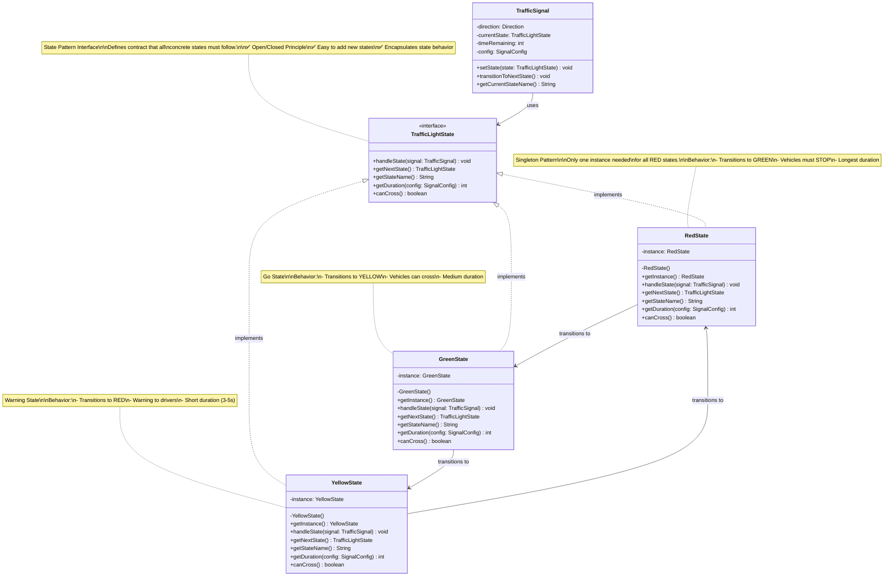
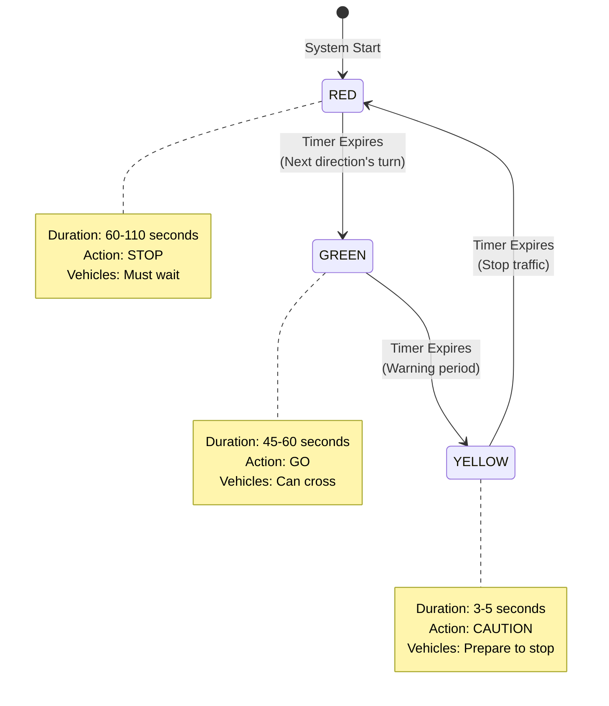

# Step 3: Implementing State Pattern

> **For Beginners**: In Step 2, we had state logic scattered in the `SignalState` enum using switch-case statements. Now we'll use the **State Pattern** to make each state a separate class. Think of it like giving each traffic light color its own "brain" to decide what to do next!

---

## 🎯 WHAT ARE WE ADDING IN THIS STEP?

### The Problem with Step 2:
```java
// State logic was in the enum using switch-case
public SignalState getNextState() {
    switch (this) {
        case GREEN:  return YELLOW;
        case YELLOW: return RED;
        case RED:    return GREEN;
    }
}
```

**Issues**:
- ❌ Adding new states requires modifying the enum (violates Open/Closed Principle)
- ❌ State-specific behavior is scattered
- ❌ Hard to add complex state logic (e.g., flashing yellow for pedestrian crossing)

### The Solution: State Pattern

Create separate classes for each state:
- `TrafficLightState` (interface)
- `RedState` (concrete class)
- `YellowState` (concrete class)
- `GreenState` (concrete class)

---

## 🔄 WHAT CHANGED FROM STEP 2?

### Step 2 Had:
- ✅ TrafficSignal class
- ✅ SignalState enum (with transition logic)
- ✅ SignalConfig class

### Step 3 Adds:
- ✅ **TrafficLightState interface** (defines behavior all states must implement)
- ✅ **RedState class** (behavior specific to RED)
- ✅ **YellowState class** (behavior specific to YELLOW)
- ✅ **GreenState class** (behavior specific to GREEN)
- ✅ **Modified TrafficSignal** (now uses state objects instead of enum)

---

## 📊 Step 3 Class Diagram



---

## 🔍 Understanding State Pattern

### What is State Pattern?

**Definition**: A behavioral design pattern that allows an object to change its behavior when its internal state changes.

**Real-World Analogy**:
Think of a **person's mood**:
- When you're HAPPY: You smile, laugh, spread joy
- When you're SAD: You cry, stay quiet, need comfort
- When you're ANGRY: You shout, frown, need space

Each mood has **different behaviors**. The same person acts differently based on their current state!

### State Pattern Components

```mermaid
graph TB
    subgraph "State Pattern Structure"
        Context["Context<br/>(TrafficSignal)<br/>Maintains current state"]
        StateInterface["State Interface<br/>(TrafficLightState)<br/>Defines contract"]
        ConcreteState1["Concrete State 1<br/>(RedState)<br/>Implements behavior"]
        ConcreteState2["Concrete State 2<br/>(YellowState)<br/>Implements behavior"]
        ConcreteState3["Concrete State 3<br/>(GreenState)<br/>Implements behavior"]
    end

    Context -->|"delegates to"| StateInterface
    StateInterface <|.. ConcreteState1
    StateInterface <|.. ConcreteState2
    StateInterface <|.. ConcreteState3
    ConcreteState1 -->|"transitions to"| ConcreteState3
    ConcreteState2 -->|"transitions to"| ConcreteState1
    ConcreteState3 -->|"transitions to"| ConcreteState2

    style Context fill:#ffeb3b,stroke:#f57f17
    style StateInterface fill:#e1bee7,stroke:#6a1b9a
    style ConcreteState1 fill:#ffcdd2,stroke:#c62828
    style ConcreteState2 fill:#fff9c4,stroke:#f57f17
    style ConcreteState3 fill:#c8e6c9,stroke:#2e7d32
```

---

## 💻 Implementation

### 1. TrafficLightState Interface

**Purpose**: Define the contract that all concrete state classes must implement.

```java
/**
 * State Pattern Interface for Traffic Light States.
 *
 * This interface defines the behavior that all concrete states
 * (RedState, YellowState, GreenState) must implement.
 *
 * Benefits of using interface:
 * - Polymorphism: TrafficSignal can work with any state
 * - Open/Closed: Can add new states without modifying existing code
 * - Contract: Guarantees all states have required methods
 */
public interface TrafficLightState {

    /**
     * Handle the behavior for this state.
     *
     * This method is called when the signal enters this state.
     * Each concrete state can define its own behavior.
     *
     * @param signal The traffic signal context
     */
    void handleState(TrafficSignal signal);

    /**
     * Get the next state in the transition sequence.
     *
     * State transitions:
     * - RED → GREEN
     * - YELLOW → RED
     * - GREEN → YELLOW
     *
     * @return The next state object
     */
    TrafficLightState getNextState();

    /**
     * Get the name of this state.
     *
     * @return State name (RED, YELLOW, or GREEN)
     */
    String getStateName();

    /**
     * Get the duration for this state from config.
     *
     * @param config The signal configuration
     * @return Duration in seconds
     */
    int getDuration(SignalConfig config);

    /**
     * Check if vehicles can cross in this state.
     *
     * @return true if GREEN, false otherwise
     */
    boolean canCross();
}
```

---

### 2. RedState Class (Singleton)

**Purpose**: Represent the RED state with specific behavior.

**Design Decision**: Use **Singleton Pattern** because:
- We only need ONE instance of RedState for the entire system
- All RED signals behave the same way
- Saves memory (no need to create multiple RedState objects)

```java
import java.util.logging.Logger;

/**
 * Concrete State: RED
 *
 * Behavior:
 * - Vehicles MUST STOP
 * - Transitions to GREEN (next direction gets its turn)
 * - Typically longest duration (sum of other directions' GREEN+YELLOW)
 *
 * Pattern: Singleton (only one instance needed)
 *
 * Real-World: Like a red traffic light saying "STOP! Wait your turn!"
 */
public class RedState implements TrafficLightState {

    private static final Logger LOGGER = Logger.getLogger(RedState.class.getName());

    // Singleton instance (only one RED state object exists)
    private static final RedState INSTANCE = new RedState();

    /**
     * Private constructor (prevents external instantiation).
     * This is part of the Singleton pattern.
     */
    private RedState() {
        LOGGER.info("RedState instance created (Singleton)");
    }

    /**
     * Get the singleton instance.
     *
     * @return The single RedState instance
     */
    public static RedState getInstance() {
        return INSTANCE;
    }

    @Override
    public void handleState(TrafficSignal signal) {
        LOGGER.info(String.format(
            "[%s] Entered RED state - STOP! Duration: %d seconds",
            signal.getDirection(),
            signal.getTimeRemaining()
        ));

        // RED-specific behavior:
        // - Display "STOP" message
        // - Turn on red LED
        // - Activate stop sensors
        // (In real system, this would interface with hardware)
    }

    @Override
    public TrafficLightState getNextState() {
        // RED → GREEN (give this direction its turn to go)
        LOGGER.fine("Transitioning: RED → GREEN");
        return GreenState.getInstance();
    }

    @Override
    public String getStateName() {
        return "RED";
    }

    @Override
    public int getDuration(SignalConfig config) {
        return config.getDuration(SignalState.RED);
    }

    @Override
    public boolean canCross() {
        return false; // Cannot cross when RED!
    }

    @Override
    public String toString() {
        return "RedState{STOP}";
    }
}
```

**Why Singleton?**

```java
// Without Singleton (wasteful):
TrafficSignal north = new TrafficSignal(Direction.NORTH, config);
TrafficSignal south = new TrafficSignal(Direction.SOUTH, config);
// Each creates its own RedState, YellowState, GreenState objects
// = 12 objects (4 signals × 3 states) 💸

// With Singleton (efficient):
// All signals share the same RedState instance
// = 3 objects (1 per state) ✅
RedState red1 = RedState.getInstance();
RedState red2 = RedState.getInstance();
assert red1 == red2; // Same instance!
```

---

### 3. YellowState Class (Singleton)

**Purpose**: Warning state before stopping.

```java
import java.util.logging.Logger;

/**
 * Concrete State: YELLOW
 *
 * Behavior:
 * - WARNING state
 * - Tells drivers to prepare to stop
 * - Transitions to RED
 * - Short duration (3-5 seconds)
 *
 * Safety Note: YELLOW should NEVER be skipped!
 * It gives drivers time to react.
 *
 * Real-World: Like a yellow light saying "Caution! Stop if you can!"
 */
public class YellowState implements TrafficLightState {

    private static final Logger LOGGER = Logger.getLogger(YellowState.class.getName());

    // Singleton instance
    private static final YellowState INSTANCE = new YellowState();

    /**
     * Private constructor (Singleton pattern).
     */
    private YellowState() {
        LOGGER.info("YellowState instance created (Singleton)");
    }

    /**
     * Get the singleton instance.
     *
     * @return The single YellowState instance
     */
    public static YellowState getInstance() {
        return INSTANCE;
    }

    @Override
    public void handleState(TrafficSignal signal) {
        LOGGER.warning(String.format(
            "[%s] Entered YELLOW state - CAUTION! Prepare to stop. Duration: %d seconds",
            signal.getDirection(),
            signal.getTimeRemaining()
        ));

        // YELLOW-specific behavior:
        // - Flash warning lights
        // - Sound caution beep
        // - Activate warning sensors
        // (In real system, this would interface with hardware)
    }

    @Override
    public TrafficLightState getNextState() {
        // YELLOW → RED (stop the traffic)
        LOGGER.fine("Transitioning: YELLOW → RED");
        return RedState.getInstance();
    }

    @Override
    public String getStateName() {
        return "YELLOW";
    }

    @Override
    public int getDuration(SignalConfig config) {
        return config.getDuration(SignalState.YELLOW);
    }

    @Override
    public boolean canCross() {
        return false; // Should NOT cross during YELLOW!
        // Note: Legally, some jurisdictions allow crossing if already
        // in intersection, but we'll be conservative here.
    }

    @Override
    public String toString() {
        return "YellowState{CAUTION}";
    }
}
```

---

### 4. GreenState Class (Singleton)

**Purpose**: "Go" state allowing traffic to pass.

```java
import java.util.logging.Logger;

/**
 * Concrete State: GREEN
 *
 * Behavior:
 * - Vehicles CAN CROSS
 * - Transitions to YELLOW (warning before stopping)
 * - Medium duration (45-60 seconds typically)
 *
 * Real-World: Like a green light saying "GO! It's safe to cross!"
 */
public class GreenState implements TrafficLightState {

    private static final Logger LOGGER = Logger.getLogger(GreenState.class.getName());

    // Singleton instance
    private static final GreenState INSTANCE = new GreenState();

    /**
     * Private constructor (Singleton pattern).
     */
    private GreenState() {
        LOGGER.info("GreenState instance created (Singleton)");
    }

    /**
     * Get the singleton instance.
     *
     * @return The single GreenState instance
     */
    public static GreenState getInstance() {
        return INSTANCE;
    }

    @Override
    public void handleState(TrafficSignal signal) {
        LOGGER.info(String.format(
            "[%s] Entered GREEN state - GO! Safe to cross. Duration: %d seconds",
            signal.getDirection(),
            signal.getTimeRemaining()
        ));

        // GREEN-specific behavior:
        // - Turn on green LED
        // - Open gate (if applicable)
        // - Activate go sensors
        // - Start vehicle counter
        // (In real system, this would interface with hardware)
    }

    @Override
    public TrafficLightState getNextState() {
        // GREEN → YELLOW (warn before stopping)
        LOGGER.fine("Transitioning: GREEN → YELLOW");
        return YellowState.getInstance();
    }

    @Override
    public String getStateName() {
        return "GREEN";
    }

    @Override
    public int getDuration(SignalConfig config) {
        return config.getDuration(SignalState.GREEN);
    }

    @Override
    public boolean canCross() {
        return true; // Can cross when GREEN!
    }

    @Override
    public String toString() {
        return "GreenState{GO}";
    }
}
```

---

## 🔄 State Transition Diagram



---

## 🎨 Modified TrafficSignal Class

**Changes from Step 2**:
- Uses `TrafficLightState` interface instead of `SignalState` enum
- Delegates behavior to state objects

```java
import java.time.LocalDateTime;
import java.util.logging.Logger;

/**
 * TrafficSignal - Modified to use State Pattern.
 *
 * This class now delegates state-specific behavior to
 * TrafficLightState objects (RedState, YellowState, GreenState).
 */
public class TrafficSignal {

    private static final Logger LOGGER = Logger.getLogger(TrafficSignal.class.getName());

    // Core properties
    private final Direction direction;              // Which direction (immutable)
    private TrafficLightState currentState;         // Current state object (State Pattern!)
    private int timeRemaining;                      // Seconds remaining
    private final SignalConfig config;              // Configuration

    /**
     * Constructor.
     *
     * @param direction The direction this signal controls
     * @param config Configuration for signal durations
     */
    public TrafficSignal(Direction direction, SignalConfig config) {
        if (direction == null || config == null) {
            throw new IllegalArgumentException("Direction and config cannot be null!");
        }

        this.direction = direction;
        this.config = config;

        // Start in RED state (safe default)
        this.currentState = RedState.getInstance();
        this.timeRemaining = currentState.getDuration(config);

        LOGGER.info(String.format(
            "Created TrafficSignal for %s, starting in %s for %d seconds",
            direction,
            currentState.getStateName(),
            timeRemaining
        ));
    }

    /**
     * Get the direction this signal controls.
     *
     * @return The direction
     */
    public Direction getDirection() {
        return direction;
    }

    /**
     * Get the current state name.
     *
     * @return State name (RED, YELLOW, or GREEN)
     */
    public String getCurrentStateName() {
        return currentState.getStateName();
    }

    /**
     * Get the current state object.
     *
     * @return Current state
     */
    public TrafficLightState getCurrentState() {
        return currentState;
    }

    /**
     * Get time remaining in current state.
     *
     * @return Seconds remaining
     */
    public int getTimeRemaining() {
        return timeRemaining;
    }

    /**
     * Get the configuration.
     *
     * @return Signal configuration
     */
    public SignalConfig getConfig() {
        return config;
    }

    /**
     * Set the signal to a specific state.
     *
     * This is the KEY method where State Pattern shines!
     * We delegate behavior to the state object.
     *
     * @param newState The state to set
     */
    public void setState(TrafficLightState newState) {
        if (newState == null) {
            throw new IllegalArgumentException("State cannot be null!");
        }

        TrafficLightState oldState = this.currentState;
        this.currentState = newState;
        this.timeRemaining = newState.getDuration(config);

        // Delegate to the state object!
        currentState.handleState(this);

        LOGGER.info(String.format(
            "[%s] %s: %s → %s (duration: %d seconds)",
            LocalDateTime.now(),
            direction,
            oldState.getStateName(),
            newState.getStateName(),
            timeRemaining
        ));
    }

    /**
     * Transition to the next state in the cycle.
     *
     * State Pattern benefit: The state object knows its next state!
     * No switch-case needed here.
     */
    public void transitionToNextState() {
        TrafficLightState nextState = currentState.getNextState();
        setState(nextState);
    }

    /**
     * Decrement the time remaining by 1 second.
     *
     * @return true if time expired, false otherwise
     */
    public boolean decrementTime() {
        if (timeRemaining > 0) {
            timeRemaining--;
        }
        return timeRemaining == 0;
    }

    /**
     * Check if signal is currently allowing traffic to cross.
     *
     * @return true if can cross, false otherwise
     */
    public boolean canCross() {
        return currentState.canCross();
    }

    /**
     * Get formatted status string.
     *
     * @return Status string
     */
    public String getStatus() {
        return String.format(
            "%s: %s (%d seconds remaining)",
            direction,
            currentState.getStateName(),
            timeRemaining
        );
    }

    @Override
    public String toString() {
        return getStatus();
    }
}
```

---

## 📚 State Pattern Benefits

### 1. Open/Closed Principle ✅

**Before (Step 2)**:
```java
// Adding a new state requires modifying SignalState enum
public enum SignalState {
    RED, YELLOW, GREEN, FLASHING_YELLOW; // ❌ Modified enum!

    public SignalState getNextState() {
        switch (this) {
            case GREEN: return YELLOW;
            case YELLOW: return RED;
            case RED: return GREEN;
            case FLASHING_YELLOW: return ???; // ❌ Need to modify switch!
        }
    }
}
```

**After (Step 3)**:
```java
// Adding a new state = create new class, no modifications!
public class FlashingYellowState implements TrafficLightState {
    // ✅ New class, existing code untouched!

    @Override
    public TrafficLightState getNextState() {
        return RedState.getInstance();
    }

    // ... other methods
}
```

### 2. Single Responsibility Principle ✅

Each state class has ONE job:
- `RedState`: Handle RED behavior
- `YellowState`: Handle YELLOW behavior
- `GreenState`: Handle GREEN behavior

### 3. Easier Testing ✅

```java
// Test each state independently
@Test
public void testRedStateTransition() {
    RedState red = RedState.getInstance();
    TrafficLightState next = red.getNextState();
    assertEquals("GREEN", next.getStateName());
}

@Test
public void testYellowStateCannotCross() {
    YellowState yellow = YellowState.getInstance();
    assertFalse(yellow.canCross());
}
```

---

## 🧪 Testing Step 3

```java
public class Step3Test {
    public static void main(String[] args) {
        System.out.println("=== Testing State Pattern ===\n");

        // Test 1: Singleton instances
        RedState red1 = RedState.getInstance();
        RedState red2 = RedState.getInstance();
        assert red1 == red2 : "RedState should be singleton!";
        System.out.println("✅ Test 1: Singleton pattern works");

        // Test 2: State transitions
        TrafficLightState state = RedState.getInstance();
        assert state.getStateName().equals("RED");

        state = state.getNextState(); // RED → GREEN
        assert state.getStateName().equals("GREEN");

        state = state.getNextState(); // GREEN → YELLOW
        assert state.getStateName().equals("YELLOW");

        state = state.getNextState(); // YELLOW → RED
        assert state.getStateName().equals("RED");
        System.out.println("✅ Test 2: State transitions work correctly");

        // Test 3: canCross() behavior
        assert !RedState.getInstance().canCross();
        assert !YellowState.getInstance().canCross();
        assert GreenState.getInstance().canCross();
        System.out.println("✅ Test 3: canCross() behaves correctly");

        // Test 4: TrafficSignal with State Pattern
        SignalConfig config = new SignalConfig(60, 5, 65);
        TrafficSignal signal = new TrafficSignal(Direction.NORTH, config);

        assert signal.getCurrentStateName().equals("RED");
        signal.setState(GreenState.getInstance());
        assert signal.getCurrentStateName().equals("GREEN");
        assert signal.canCross();

        signal.transitionToNextState(); // GREEN → YELLOW
        assert signal.getCurrentStateName().equals("YELLOW");

        signal.transitionToNextState(); // YELLOW → RED
        assert signal.getCurrentStateName().equals("RED");
        System.out.println("✅ Test 4: TrafficSignal works with State Pattern");

        System.out.println("\n✅ All Step 3 tests passed!");
    }
}
```

---

## 📚 Common Beginner Mistakes

### Mistake 1: Not Using Singleton

```java
// ❌ BAD: Creating new instances every time
public class RedState implements TrafficLightState {
    public RedState() { } // Public constructor!

    public TrafficLightState getNextState() {
        return new GreenState(); // ❌ New instance every time! Memory waste!
    }
}

// ✅ GOOD: Use Singleton
public class RedState implements TrafficLightState {
    private static final RedState INSTANCE = new RedState();
    private RedState() { } // Private constructor!

    public static RedState getInstance() {
        return INSTANCE;
    }

    public TrafficLightState getNextState() {
        return GreenState.getInstance(); // ✅ Reuse same instance!
    }
}
```

### Mistake 2: Putting Business Logic in Interface

```java
// ❌ BAD: Default methods with logic in interface
public interface TrafficLightState {
    default TrafficLightState getNextState() {
        // This defeats the purpose of State Pattern!
        if (this instanceof RedState) return GreenState.getInstance();
        if (this instanceof GreenState) return YellowState.getInstance();
        // ...
    }
}

// ✅ GOOD: Each state implements its own logic
public class RedState implements TrafficLightState {
    public TrafficLightState getNextState() {
        return GreenState.getInstance(); // Each state knows its next state
    }
}
```

### Mistake 3: Null State Transitions

```java
// ❌ BAD: Forgetting to handle null states
public void transitionToNextState() {
    TrafficLightState nextState = currentState.getNextState();
    setState(nextState); // What if nextState is null? 💥
}

// ✅ GOOD: Always validate
public void transitionToNextState() {
    TrafficLightState nextState = currentState.getNextState();
    if (nextState == null) {
        throw new IllegalStateException("Next state cannot be null!");
    }
    setState(nextState);
}
```

---

## 🎯 Key Takeaways from Step 3

1. **State Pattern** = Each state is a separate class with its own behavior
2. **Singleton Pattern** = Only one instance of each state needed
3. **Open/Closed Principle** = Can add new states without modifying existing code
4. **Polymorphism** = TrafficSignal works with any TrafficLightState
5. **Cleaner Code** = No switch-case statements, each state encapsulates its behavior

---

## 🔜 What's Next?

In **Step 4**, we'll integrate the State Pattern with TrafficSignal more deeply:
- Add state change listeners (Observer Pattern preview)
- Add validation for state transitions
- Handle edge cases (what if timer expires during state change?)

**Preview**:
```java
public void transitionToNextState() {
    // Validate transition is allowed
    if (!canTransition()) {
        throw new IllegalStateException("Cannot transition now!");
    }

    // Notify observers before transition
    notifyObservers(StateChangeEvent.BEFORE_TRANSITION);

    // Perform transition
    TrafficLightState nextState = currentState.getNextState();
    setState(nextState);

    // Notify observers after transition
    notifyObservers(StateChangeEvent.AFTER_TRANSITION);
}
```

---

**Remember**: State Pattern makes your code more flexible and maintainable. It's perfect when an object's behavior changes based on its internal state!
