# Step 4: Integration and State Validation

> **For Beginners**: In Step 3, we created separate state classes. Now we'll add **validation**, **safety checks**, and **observers** to make the system more robust. Think of it like adding guardrails to a highway - they prevent accidents!

---

## 🎯 WHAT ARE WE ADDING IN THIS STEP?

### New Components:
1. **StateTransitionValidator** - Validates if a transition is legal
2. **StateChangeListener** (Observer Pattern) - Gets notified when state changes
3. **StateChangeEvent** - Contains information about state changes
4. **Enhanced TrafficSignal** - With validation and notifications

### Why These Additions?

**Problem**: In Step 3, we could transition states without checks:
```java
signal.setState(GreenState.getInstance()); // Always allowed? ❌
signal.setState(null); // What happens? 💥
```

**Solution**: Add validation layer:
```java
if (validator.isValidTransition(currentState, newState)) {
    // Transition allowed ✅
} else {
    // Reject invalid transition ❌
}
```

---

## 📊 Step 4 Class Diagram

```mermaid
classDiagram
    %% Core Classes from Step 3
    class TrafficSignal {
        -direction: Direction
        -currentState: TrafficLightState
        -timeRemaining: int
        -config: SignalConfig
        -listeners: List~StateChangeListener~
        -validator: StateTransitionValidator
        +addListener(listener) void
        +removeListener(listener) void
        +setState(state) void
        +transitionToNextState() void
        -notifyListeners(event) void
        -validateTransition(from, to) boolean
    }

    %% New Classes in Step 4
    class StateTransitionValidator {
        +isValidTransition(from, to) boolean
        +isDirectTransitionAllowed(from, to) boolean
        +getMissingSteps(from, to) List~TrafficLightState~
    }

    class StateChangeListener {
        <<interface>>
        +onStateChange(event: StateChangeEvent) void
        +onStateChangeStart(event: StateChangeEvent) void
        +onStateChangeComplete(event: StateChangeEvent) void
    }

    class StateChangeEvent {
        -signal: TrafficSignal
        -fromState: TrafficLightState
        -toState: TrafficLightState
        -timestamp: LocalDateTime
        -reason: String
        +getSignal() TrafficSignal
        +getFromState() TrafficLightState
        +getToState() TrafficLightState
        +getTimestamp() LocalDateTime
        +getReason() String
    }

    class LoggingStateListener {
        -logger: Logger
        +onStateChange(event) void
        +onStateChangeStart(event) void
        +onStateChangeComplete(event) void
    }

    class SafetyCheckListener {
        +onStateChange(event) void
        +onStateChangeStart(event) void
        +onStateChangeComplete(event) void
    }

    %% Relationships
    TrafficSignal --> StateTransitionValidator : uses
    TrafficSignal --> StateChangeListener : notifies
    TrafficSignal --> StateChangeEvent : creates
    StateChangeListener <|.. LoggingStateListener : implements
    StateChangeListener <|.. SafetyCheckListener : implements
    StateChangeEvent --> TrafficSignal : references
    StateChangeEvent --> TrafficLightState : references

    note for StateTransitionValidator "Validates state transitions\n\nRules:\n✅ GREEN → YELLOW (allowed)\n✅ YELLOW → RED (allowed)\n✅ RED → GREEN (allowed)\n❌ GREEN → RED (skip YELLOW? NO!)"

    note for StateChangeListener "Observer Pattern\n\nListeners get notified:\n- Before state change\n- After state change\n\nExamples:\n- Logging\n- Safety checks\n- UI updates"
```



---

## 💻 Implementation

### 1. StateTransitionValidator Class

**Purpose**: Validate if a state transition is legal and safe.

```java
import java.util.ArrayList;
import java.util.List;
import java.util.logging.Logger;

/**
 * Validates state transitions for traffic signals.
 *
 * Rules:
 * 1. GREEN → YELLOW (allowed)
 * 2. YELLOW → RED (allowed)
 * 3. RED → GREEN (allowed)
 * 4. Any other direct transition is INVALID (for safety)
 *
 * Why validator?
 * - Safety: Prevent invalid transitions (e.g., GREEN → RED skips warning!)
 * - Single Responsibility: Validation logic in one place
 * - Testability: Easy to test validation rules independently
 */
public class StateTransitionValidator {

    private static final Logger LOGGER = Logger.getLogger(StateTransitionValidator.class.getName());

    /**
     * Check if transition from one state to another is valid.
     *
     * Valid transitions:
     * - GREEN → YELLOW ✅
     * - YELLOW → RED ✅
     * - RED → GREEN ✅
     * - Same state → Same state ✅ (no-op)
     *
     * Invalid transitions:
     * - GREEN → RED ❌ (skips YELLOW warning!)
     * - YELLOW → GREEN ❌ (illogical)
     * - RED → YELLOW ❌ (illogical)
     *
     * @param fromState Current state
     * @param toState Target state
     * @return true if transition is valid, false otherwise
     */
    public boolean isValidTransition(TrafficLightState fromState, TrafficLightState toState) {
        if (fromState == null || toState == null) {
            LOGGER.severe("Cannot validate transition: state is null");
            return false;
        }

        // Same state transition is always valid (no-op)
        if (fromState.getStateName().equals(toState.getStateName())) {
            return true;
        }

        // Check if it's a direct valid transition
        TrafficLightState expectedNext = fromState.getNextState();
        boolean isValid = expectedNext.getStateName().equals(toState.getStateName());

        if (!isValid) {
            LOGGER.warning(String.format(
                "INVALID transition detected: %s → %s (expected: %s → %s)",
                fromState.getStateName(),
                toState.getStateName(),
                fromState.getStateName(),
                expectedNext.getStateName()
            ));
        }

        return isValid;
    }

    /**
     * Check if a direct transition is allowed (bypassing validation).
     * This is used for emergency manual overrides.
     *
     * @param fromState Current state
     * @param toState Target state
     * @return true if direct transition is allowed
     */
    public boolean isDirectTransitionAllowed(TrafficLightState fromState, TrafficLightState toState) {
        // For manual override, we allow:
        // - Any state → RED (emergency stop)
        // - RED → GREEN (emergency clearance)
        // - But NEVER GREEN → RED directly (must go through YELLOW for safety!)

        String from = fromState.getStateName();
        String to = toState.getStateName();

        // Emergency stop: Any → RED
        if (to.equals("RED")) {
            return true;
        }

        // Emergency clearance: RED → GREEN
        if (from.equals("RED") && to.equals("GREEN")) {
            return true;
        }

        // For all other cases, use normal validation
        return isValidTransition(fromState, toState);
    }

    /**
     * Get the missing intermediate steps for an invalid transition.
     *
     * Example: GREEN → RED requires intermediate step YELLOW
     * Returns: [YELLOW]
     *
     * @param fromState Current state
     * @param toState Target state
     * @return List of missing intermediate states
     */
    public List<TrafficLightState> getMissingSteps(TrafficLightState fromState, TrafficLightState toState) {
        List<TrafficLightState> steps = new ArrayList<>();

        if (isValidTransition(fromState, toState)) {
            return steps; // No missing steps (valid transition)
        }

        // Calculate missing steps
        TrafficLightState current = fromState;
        while (!current.getStateName().equals(toState.getStateName())) {
            current = current.getNextState();
            if (!current.getStateName().equals(toState.getStateName())) {
                steps.add(current);
            }

            // Safety: Prevent infinite loop
            if (steps.size() > 3) {
                LOGGER.severe("Infinite loop detected in getMissingSteps!");
                break;
            }
        }

        return steps;
    }

    /**
     * Example usage and testing.
     */
    public static void main(String[] args) {
        StateTransitionValidator validator = new StateTransitionValidator();

        System.out.println("=== Testing Valid Transitions ===");
        System.out.println("GREEN → YELLOW: " +
            validator.isValidTransition(GreenState.getInstance(), YellowState.getInstance())); // true
        System.out.println("YELLOW → RED: " +
            validator.isValidTransition(YellowState.getInstance(), RedState.getInstance())); // true
        System.out.println("RED → GREEN: " +
            validator.isValidTransition(RedState.getInstance(), GreenState.getInstance())); // true

        System.out.println("\n=== Testing Invalid Transitions ===");
        System.out.println("GREEN → RED: " +
            validator.isValidTransition(GreenState.getInstance(), RedState.getInstance())); // false ❌
        System.out.println("YELLOW → GREEN: " +
            validator.isValidTransition(YellowState.getInstance(), GreenState.getInstance())); // false ❌

        System.out.println("\n=== Testing Missing Steps ===");
        List<TrafficLightState> missing = validator.getMissingSteps(
            GreenState.getInstance(),
            RedState.getInstance()
        );
        System.out.println("GREEN → RED requires: " + missing); // [YELLOW]
    }
}
```

---

### 2. StateChangeEvent Class

**Purpose**: Encapsulate information about a state change.

```java
import java.time.LocalDateTime;

/**
 * Event object containing information about a state change.
 *
 * This follows the Event-Driven pattern and is used by
 * the Observer pattern to notify listeners.
 *
 * Immutable class (all fields final).
 */
public class StateChangeEvent {

    private final TrafficSignal signal;           // Which signal changed
    private final TrafficLightState fromState;    // Previous state
    private final TrafficLightState toState;      // New state
    private final LocalDateTime timestamp;        // When it happened
    private final String reason;                  // Why it happened
    private final boolean isAutomatic;            // Automatic or manual?

    /**
     * Constructor.
     *
     * @param signal The traffic signal that changed
     * @param fromState Previous state
     * @param toState New state
     * @param reason Reason for change (e.g., "Timer expired", "Manual override")
     * @param isAutomatic true if automatic, false if manual
     */
    public StateChangeEvent(TrafficSignal signal,
                           TrafficLightState fromState,
                           TrafficLightState toState,
                           String reason,
                           boolean isAutomatic) {
        this.signal = signal;
        this.fromState = fromState;
        this.toState = toState;
        this.timestamp = LocalDateTime.now();
        this.reason = reason;
        this.isAutomatic = isAutomatic;
    }

    // Getters (no setters - immutable!)

    public TrafficSignal getSignal() {
        return signal;
    }

    public TrafficLightState getFromState() {
        return fromState;
    }

    public TrafficLightState getToState() {
        return toState;
    }

    public LocalDateTime getTimestamp() {
        return timestamp;
    }

    public String getReason() {
        return reason;
    }

    public boolean isAutomatic() {
        return isAutomatic;
    }

    public boolean isManual() {
        return !isAutomatic;
    }

    /**
     * Get formatted description of the event.
     *
     * @return Event description
     */
    public String getDescription() {
        return String.format(
            "[%s] %s: %s → %s (%s, %s)",
            timestamp,
            signal.getDirection(),
            fromState.getStateName(),
            toState.getStateName(),
            reason,
            isAutomatic ? "Automatic" : "Manual"
        );
    }

    @Override
    public String toString() {
        return getDescription();
    }
}
```

---

### 3. StateChangeListener Interface

**Purpose**: Observer pattern - listeners get notified when state changes.

```java
/**
 * Observer Pattern: Listener interface for state changes.
 *
 * Any class that wants to be notified of state changes
 * should implement this interface and register with TrafficSignal.
 *
 * Use cases:
 * - Logging state changes
 * - Updating UI/dashboard
 * - Safety checks
 * - Analytics/metrics
 * - Hardware control (turn on/off LEDs)
 */
public interface StateChangeListener {

    /**
     * Called when a state change is about to start.
     *
     * This is called BEFORE the state actually changes.
     * Listeners can use this to prepare or validate.
     *
     * @param event The state change event
     */
    void onStateChangeStart(StateChangeEvent event);

    /**
     * Called when a state change has completed.
     *
     * This is called AFTER the state has changed.
     * Listeners can use this to react to the change.
     *
     * @param event The state change event
     */
    void onStateChangeComplete(StateChangeEvent event);

    /**
     * Called on any state change (convenience method).
     *
     * This is called during the transition.
     * Default implementation does nothing.
     *
     * @param event The state change event
     */
    default void onStateChange(StateChangeEvent event) {
        // Default: do nothing
        // Subclasses can override if needed
    }
}
```

---

### 4. LoggingStateListener (Concrete Observer)

**Purpose**: Log all state changes to console/file.

```java
import java.util.logging.Logger;
import java.util.logging.Level;

/**
 * Concrete Observer: Logs all state changes.
 *
 * This is useful for:
 * - Debugging
 * - Audit trail
 * - Compliance
 * - Analytics
 */
public class LoggingStateListener implements StateChangeListener {

    private static final Logger LOGGER = Logger.getLogger(LoggingStateListener.class.getName());

    @Override
    public void onStateChangeStart(StateChangeEvent event) {
        LOGGER.info(String.format(
            "🔄 State change starting: %s",
            event.getDescription()
        ));
    }

    @Override
    public void onStateChangeComplete(StateChangeEvent event) {
        LOGGER.info(String.format(
            "✅ State change completed: %s",
            event.getDescription()
        ));

        // Log additional details
        if (event.isManual()) {
            LOGGER.warning("⚠️  Manual override detected!");
        }

        // Log to file (in real system)
        // logToFile(event);
    }

    @Override
    public void onStateChange(StateChangeEvent event) {
        // Optional: Log during transition
        LOGGER.fine("State transitioning...");
    }

    /**
     * In a real system, this would write to a file or database.
     */
    private void logToFile(StateChangeEvent event) {
        // Implementation: Write to audit.log
        // Format: [timestamp] direction from→to reason
    }
}
```

---

### 5. SafetyCheckListener (Concrete Observer)

**Purpose**: Perform safety validations during state changes.

```java
import java.util.logging.Logger;

/**
 * Concrete Observer: Performs safety checks during state changes.
 *
 * Safety rules:
 * 1. YELLOW should never be skipped
 * 2. State changes should happen within time bounds
 * 3. No rapid state flipping (prevents hardware damage)
 */
public class SafetyCheckListener implements StateChangeListener {

    private static final Logger LOGGER = Logger.getLogger(SafetyCheckListener.class.getName());

    private static final long MIN_STATE_DURATION_MS = 1000; // Minimum 1 second per state

    private long lastChangeTimestamp = 0;

    @Override
    public void onStateChangeStart(StateChangeEvent event) {
        // Safety check 1: Validate transition
        String from = event.getFromState().getStateName();
        String to = event.getToState().getStateName();

        if (from.equals("GREEN") && to.equals("RED")) {
            LOGGER.severe("🚨 SAFETY VIOLATION: Skipping YELLOW! This is dangerous!");
            throw new IllegalStateException("Cannot skip YELLOW state!");
        }

        // Safety check 2: Prevent rapid state flipping
        long now = System.currentTimeMillis();
        if (lastChangeTimestamp > 0) {
            long timeSinceLastChange = now - lastChangeTimestamp;
            if (timeSinceLastChange < MIN_STATE_DURATION_MS) {
                LOGGER.warning(String.format(
                    "⚠️  Warning: Rapid state change detected (%.2f seconds)",
                    timeSinceLastChange / 1000.0
                ));
            }
        }
    }

    @Override
    public void onStateChangeComplete(StateChangeEvent event) {
        // Update timestamp
        lastChangeTimestamp = System.currentTimeMillis();

        // Log successful safety check
        LOGGER.info("✅ Safety check passed for: " + event.getDescription());
    }
}
```

---

### 6. Enhanced TrafficSignal Class

**Changes from Step 3**:
- Added validator
- Added listeners (Observer pattern)
- Added notification methods

```java
import java.time.LocalDateTime;
import java.util.ArrayList;
import java.util.List;
import java.util.logging.Logger;

/**
 * Enhanced TrafficSignal with validation and observers.
 *
 * New features in Step 4:
 * - State transition validation
 * - Observer pattern (listeners)
 * - Safety checks
 */
public class TrafficSignal {

    private static final Logger LOGGER = Logger.getLogger(TrafficSignal.class.getName());

    // Core properties (from Step 3)
    private final Direction direction;
    private TrafficLightState currentState;
    private int timeRemaining;
    private final SignalConfig config;

    // New in Step 4
    private final StateTransitionValidator validator;
    private final List<StateChangeListener> listeners;

    /**
     * Constructor.
     */
    public TrafficSignal(Direction direction, SignalConfig config) {
        if (direction == null || config == null) {
            throw new IllegalArgumentException("Direction and config cannot be null!");
        }

        this.direction = direction;
        this.config = config;
        this.currentState = RedState.getInstance();
        this.timeRemaining = currentState.getDuration(config);

        // Initialize new components
        this.validator = new StateTransitionValidator();
        this.listeners = new ArrayList<>();

        LOGGER.info(String.format(
            "Created TrafficSignal for %s with validation and observers",
            direction
        ));
    }

    // === Observer Pattern Methods ===

    /**
     * Register a listener to be notified of state changes.
     *
     * @param listener The listener to add
     */
    public void addListener(StateChangeListener listener) {
        if (listener == null) {
            throw new IllegalArgumentException("Listener cannot be null!");
        }
        listeners.add(listener);
        LOGGER.fine("Listener added: " + listener.getClass().getSimpleName());
    }

    /**
     * Unregister a listener.
     *
     * @param listener The listener to remove
     */
    public void removeListener(StateChangeListener listener) {
        listeners.remove(listener);
        LOGGER.fine("Listener removed: " + listener.getClass().getSimpleName());
    }

    /**
     * Notify all listeners that a state change is starting.
     */
    private void notifyListenersStart(StateChangeEvent event) {
        for (StateChangeListener listener : listeners) {
            try {
                listener.onStateChangeStart(event);
            } catch (Exception e) {
                LOGGER.severe("Listener threw exception: " + e.getMessage());
                // Continue notifying other listeners
            }
        }
    }

    /**
     * Notify all listeners that a state change completed.
     */
    private void notifyListenersComplete(StateChangeEvent event) {
        for (StateChangeListener listener : listeners) {
            try {
                listener.onStateChangeComplete(event);
            } catch (Exception e) {
                LOGGER.severe("Listener threw exception: " + e.getMessage());
            }
        }
    }

    // === State Management Methods ===

    /**
     * Set the signal to a specific state (with validation!).
     *
     * @param newState The state to set
     * @param reason Reason for change
     * @param isAutomatic true if automatic, false if manual
     */
    public void setState(TrafficLightState newState, String reason, boolean isAutomatic) {
        if (newState == null) {
            throw new IllegalArgumentException("State cannot be null!");
        }

        // Validate transition
        if (!validator.isValidTransition(currentState, newState)) {
            throw new IllegalStateException(String.format(
                "Invalid state transition: %s → %s",
                currentState.getStateName(),
                newState.getStateName()
            ));
        }

        // Create event
        StateChangeEvent event = new StateChangeEvent(
            this,
            currentState,
            newState,
            reason,
            isAutomatic
        );

        // Notify listeners (before)
        notifyListenersStart(event);

        // Perform state change
        TrafficLightState oldState = this.currentState;
        this.currentState = newState;
        this.timeRemaining = newState.getDuration(config);

        // Delegate to state
        currentState.handleState(this);

        // Notify listeners (after)
        notifyListenersComplete(event);

        LOGGER.info(String.format(
            "[%s] %s: %s → %s (duration: %d seconds)",
            LocalDateTime.now(),
            direction,
            oldState.getStateName(),
            newState.getStateName(),
            timeRemaining
        ));
    }

    /**
     * Set state (convenience method - automatic transition).
     */
    public void setState(TrafficLightState newState) {
        setState(newState, "State set manually", false);
    }

    /**
     * Transition to next state (with validation).
     */
    public void transitionToNextState() {
        TrafficLightState nextState = currentState.getNextState();
        setState(nextState, "Timer expired - automatic transition", true);
    }

    /**
     * Force a state (bypasses normal validation - USE CAREFULLY!).
     * This is for emergency manual overrides only.
     *
     * @param newState The state to force
     * @param reason Reason for override
     */
    public void forceState(TrafficLightState newState, String reason) {
        if (newState == null) {
            throw new IllegalArgumentException("State cannot be null!");
        }

        // Check if direct transition is allowed (less strict)
        if (!validator.isDirectTransitionAllowed(currentState, newState)) {
            LOGGER.warning(String.format(
                "⚠️  Forcing state despite validation failure: %s → %s. Reason: %s",
                currentState.getStateName(),
                newState.getStateName(),
                reason
            ));
        }

        // Create event (marked as manual)
        StateChangeEvent event = new StateChangeEvent(
            this,
            currentState,
            newState,
            "FORCED: " + reason,
            false
        );

        // Notify listeners
        notifyListenersStart(event);

        // Force state change
        this.currentState = newState;
        this.timeRemaining = newState.getDuration(config);
        currentState.handleState(this);

        // Notify listeners
        notifyListenersComplete(event);

        LOGGER.warning(String.format(
            "⚠️  FORCED STATE CHANGE: %s → %s",
            event.getFromState().getStateName(),
            newState.getStateName()
        ));
    }

    // === Getters ===

    public Direction getDirection() {
        return direction;
    }

    public String getCurrentStateName() {
        return currentState.getStateName();
    }

    public TrafficLightState getCurrentState() {
        return currentState;
    }

    public int getTimeRemaining() {
        return timeRemaining;
    }

    public SignalConfig getConfig() {
        return config;
    }

    public boolean decrementTime() {
        if (timeRemaining > 0) {
            timeRemaining--;
        }
        return timeRemaining == 0;
    }

    public boolean canCross() {
        return currentState.canCross();
    }

    public String getStatus() {
        return String.format(
            "%s: %s (%d seconds remaining)",
            direction,
            currentState.getStateName(),
            timeRemaining
        );
    }

    @Override
    public String toString() {
        return getStatus();
    }
}
```

---

## 🧪 Testing Step 4

```java
public class Step4Test {
    public static void main(String[] args) {
        System.out.println("=== Testing Validation and Observers ===\n");

        // Create signal
        SignalConfig config = new SignalConfig(10, 3, 12);
        TrafficSignal signal = new TrafficSignal(Direction.NORTH, config);

        // Add listeners
        signal.addListener(new LoggingStateListener());
        signal.addListener(new SafetyCheckListener());

        // Test 1: Valid transition
        System.out.println("Test 1: Valid transition (RED → GREEN)");
        signal.setState(GreenState.getInstance(), "Test", true);
        System.out.println("✅ Test 1 passed\n");

        // Test 2: Invalid transition (should throw exception)
        System.out.println("Test 2: Invalid transition (GREEN → RED)");
        try {
            signal.setState(RedState.getInstance(), "Test", false);
            System.out.println("❌ Test 2 failed: Should have thrown exception!");
        } catch (IllegalStateException e) {
            System.out.println("✅ Test 2 passed: " + e.getMessage() + "\n");
        }

        // Test 3: Normal cycle with observers
        System.out.println("Test 3: Full cycle with observers");
        signal.setState(GreenState.getInstance());
        signal.transitionToNextState(); // GREEN → YELLOW
        signal.transitionToNextState(); // YELLOW → RED
        System.out.println("✅ Test 3 passed\n");

        System.out.println("✅ All Step 4 tests passed!");
    }
}
```

---

## 🎯 Key Takeaways from Step 4

1. **Validation** = Prevent invalid state transitions (safety!)
2. **Observer Pattern** = Decouple state changes from reactions
3. **Events** = Encapsulate state change information
4. **Safety** = Multiple layers of checks prevent accidents
5. **Extensibility** = Easy to add new listeners without modifying TrafficSignal

---

## 🔜 What's Next?

In **Step 5**, we'll add:
- **TrafficController** - Manages all signals at the intersection
- **Timer** - Automatic cycling mechanism
- **Round-robin scheduling** - Ensures fair time distribution

---

**Remember**: Adding validation and observers makes the system more robust and maintainable!
