# Step 5: Traffic Controller and Timer

> **For Beginners**: So far we've built individual traffic signals. Now we need a **controller** to manage ALL signals at the intersection and a **timer** to make them cycle automatically. Think of the controller as a conductor orchestrating a symphony - each instrument (signal) plays at the right time!

---

## 🎯 WHAT ARE WE ADDING IN THIS STEP?

### New Components:
1. **TrafficController** - Manages all 4 signals (NORTH, SOUTH, EAST, WEST)
2. **SignalTimer** - Runs in background, decrements time, triggers transitions
3. **Round-Robin Scheduler** - Ensures fair cycling through all directions

### Why These Additions?

**Problem**: Individual signals don't coordinate:
```java
TrafficSignal north = new TrafficSignal(...);
TrafficSignal south = new TrafficSignal(...);
// How do they know when to switch? 🤔
// Who ensures only ONE is green at a time? 🤔
```

**Solution**: Central controller:
```java
TrafficController controller = new TrafficController();
controller.start(); // Automatically cycles all signals! ✅
```

---

## 📊 Step 5 Architecture Diagram


---

## 📊 Step 5 Class Diagram

```mermaid
classDiagram
    class TrafficController {
        -signals: Map~Direction,TrafficSignal~
        -currentDirection: Direction
        -timer: SignalTimer
        -isRunning: boolean
        -lock: ReentrantLock
        +TrafficController(configs)
        +start() void
        +stop() void
        +pause() void
        +resume() void
        +manualOverride(direction, reason) void
        +getCurrentDirection() Direction
        +getSignal(direction) TrafficSignal
        +getAllSignalStatus() Map
        -initializeSignals() void
        -cycleToNextDirection() void
        -setAllSignalsToRed() void
    }

    class SignalTimer {
        -controller: TrafficController
        -thread: Thread
        -running: boolean
        -tickIntervalMs: long
        +SignalTimer(controller)
        +start() void
        +stop() void
        +isRunning() boolean
        -run() void
    }

    class RoundRobinScheduler {
        -directions: Queue~Direction~
        -currentIndex: int
        +RoundRobinScheduler(directions)
        +getNext() Direction
        +getCurrent() Direction
        +reset() void
        +skip(direction) void
    }

    class TrafficSignal {
        -direction: Direction
        -currentState: TrafficLightState
        -timeRemaining: int
        +decrementTime() boolean
        +transitionToNextState() void
        +setState(state) void
    }

    TrafficController "1" *-- "4" TrafficSignal : manages
    TrafficController "1" *-- "1" SignalTimer : has
    TrafficController "1" --> "1" RoundRobinScheduler : uses
    SignalTimer --> TrafficController : callbacks
    TrafficSignal --> TrafficLightState : uses

    note for TrafficController "Central controller managing\nall signals at intersection.\n\nResponsibilities:\n✅ Coordinate all 4 signals\n✅ Ensure only 1 is GREEN\n✅ Handle manual overrides\n✅ Thread-safe operations"

    note for SignalTimer "Background thread that:\n- Ticks every second\n- Decrements time on active signal\n- Triggers state transitions\n- Runs continuously"

    note for RoundRobinScheduler "Fair scheduling:\nNORTH → SOUTH → EAST → WEST\n↑________________________↓\n\nEach direction gets\nequal opportunity"
```



---

## 💻 Implementation

### 1. RoundRobinScheduler Class

**Purpose**: Manage fair cycling through all directions.

```java
import java.util.*;
import java.util.logging.Logger;

/**
 * Round-Robin Scheduler for traffic directions.
 *
 * Ensures fair cycling: NORTH → SOUTH → EAST → WEST → NORTH...
 *
 * Real-World Analogy: Like taking turns in a game - everyone gets
 * equal opportunity to play!
 */
public class RoundRobinScheduler {

    private static final Logger LOGGER = Logger.getLogger(RoundRobinScheduler.class.getName());

    private final List<Direction> directions;
    private int currentIndex;

    /**
     * Constructor with default directions (NORTH, SOUTH, EAST, WEST).
     */
    public RoundRobinScheduler() {
        this(Arrays.asList(Direction.NORTH, Direction.SOUTH, Direction.EAST, Direction.WEST));
    }

    /**
     * Constructor with custom directions.
     *
     * @param directions List of directions to cycle through
     */
    public RoundRobinScheduler(List<Direction> directions) {
        if (directions == null || directions.isEmpty()) {
            throw new IllegalArgumentException("Directions list cannot be null or empty!");
        }

        this.directions = new ArrayList<>(directions);
        this.currentIndex = 0;

        LOGGER.info("Round-Robin Scheduler created with directions: " + directions);
    }

    /**
     * Get the current direction.
     *
     * @return Current direction
     */
    public Direction getCurrent() {
        return directions.get(currentIndex);
    }

    /**
     * Move to the next direction in round-robin fashion.
     *
     * @return Next direction
     */
    public Direction getNext() {
        currentIndex = (currentIndex + 1) % directions.size(); // Wrap around
        Direction next = directions.get(currentIndex);
        LOGGER.fine("Moved to next direction: " + next);
        return next;
    }

    /**
     * Reset to the first direction.
     */
    public void reset() {
        currentIndex = 0;
        LOGGER.info("Scheduler reset to: " + directions.get(0));
    }

    /**
     * Get all directions in order.
     *
     * @return List of all directions
     */
    public List<Direction> getAllDirections() {
        return new ArrayList<>(directions);
    }

    /**
     * Get total number of directions.
     *
     * @return Number of directions
     */
    public int size() {
        return directions.size();
    }

    @Override
    public String toString() {
        return String.format("RoundRobinScheduler{current=%s, order=%s}",
            getCurrent(), directions);
    }
}
```

---

### 2. SignalTimer Class

**Purpose**: Background thread that ticks every second and triggers state changes.

```java
import java.util.logging.Logger;

/**
 * Timer thread for automatic signal cycling.
 *
 * This thread runs continuously in the background:
 * 1. Ticks every second (configurable)
 * 2. Tells controller to decrement time on active signal
 * 3. Controller triggers state transition when time expires
 *
 * Threading Note: This is a DAEMON thread - it stops when main program exits.
 */
public class SignalTimer implements Runnable {

    private static final Logger LOGGER = Logger.getLogger(SignalTimer.class.getName());

    private final TrafficController controller;
    private Thread thread;
    private volatile boolean running;           // Volatile for thread visibility
    private long tickIntervalMs;                // How often to tick (milliseconds)

    /**
     * Constructor.
     *
     * @param controller The traffic controller to notify
     */
    public SignalTimer(TrafficController controller) {
        this(controller, 1000); // Default: 1 second ticks
    }

    /**
     * Constructor with custom tick interval.
     *
     * @param controller The traffic controller to notify
     * @param tickIntervalMs Tick interval in milliseconds
     */
    public SignalTimer(TrafficController controller, long tickIntervalMs) {
        if (controller == null) {
            throw new IllegalArgumentException("Controller cannot be null!");
        }
        if (tickIntervalMs <= 0) {
            throw new IllegalArgumentException("Tick interval must be positive!");
        }

        this.controller = controller;
        this.tickIntervalMs = tickIntervalMs;
        this.running = false;

        LOGGER.info(String.format("SignalTimer created (tick interval: %d ms)", tickIntervalMs));
    }

    /**
     * Start the timer thread.
     */
    public void start() {
        if (running) {
            LOGGER.warning("Timer is already running!");
            return;
        }

        running = true;
        thread = new Thread(this, "SignalTimer-Thread");
        thread.setDaemon(true); // Daemon thread - exits with main program
        thread.start();

        LOGGER.info("Timer thread started");
    }

    /**
     * Stop the timer thread.
     */
    public void stop() {
        if (!running) {
            LOGGER.warning("Timer is not running!");
            return;
        }

        running = false;
        if (thread != null) {
            thread.interrupt(); // Wake up if sleeping
            try {
                thread.join(2000); // Wait up to 2 seconds for thread to finish
            } catch (InterruptedException e) {
                LOGGER.warning("Interrupted while waiting for timer thread to stop");
                Thread.currentThread().interrupt();
            }
        }

        LOGGER.info("Timer thread stopped");
    }

    /**
     * Check if timer is running.
     *
     * @return true if running, false otherwise
     */
    public boolean isRunning() {
        return running;
    }

    /**
     * The main timer loop (runs in separate thread).
     */
    @Override
    public void run() {
        LOGGER.info("Timer thread entering main loop");

        while (running) {
            try {
                // Sleep for tick interval
                Thread.sleep(tickIntervalMs);

                // Notify controller to tick (decrement time)
                controller.tick();

            } catch (InterruptedException e) {
                if (running) {
                    LOGGER.warning("Timer thread interrupted unexpectedly");
                }
                // Exit loop if interrupted
                break;
            } catch (Exception e) {
                LOGGER.severe("Error in timer thread: " + e.getMessage());
                e.printStackTrace();
                // Continue running despite error
            }
        }

        LOGGER.info("Timer thread exiting main loop");
    }

    /**
     * Set tick interval (in milliseconds).
     * Takes effect on next tick.
     *
     * @param intervalMs New interval in milliseconds
     */
    public void setTickInterval(long intervalMs) {
        if (intervalMs <= 0) {
            throw new IllegalArgumentException("Interval must be positive!");
        }
        this.tickIntervalMs = intervalMs;
        LOGGER.info("Tick interval changed to: " + intervalMs + " ms");
    }

    /**
     * Get current tick interval.
     *
     * @return Tick interval in milliseconds
     */
    public long getTickInterval() {
        return tickIntervalMs;
    }
}
```

---

### 3. TrafficController Class

**Purpose**: The central brain coordinating all signals.

```java
import java.util.*;
import java.util.concurrent.ConcurrentHashMap;
import java.util.concurrent.locks.ReentrantLock;
import java.util.logging.Logger;

/**
 * Central controller managing all traffic signals at an intersection.
 *
 * Responsibilities:
 * 1. Create and manage 4 signals (NORTH, SOUTH, EAST, WEST)
 * 2. Ensure only ONE signal is GREEN at any time (safety!)
 * 3. Implement round-robin cycling
 * 4. Handle manual overrides
 * 5. Thread-safe operations
 *
 * Real-World Analogy: Like an orchestra conductor - coordinates all
 * instruments (signals) to play in harmony!
 */
public class TrafficController {

    private static final Logger LOGGER = Logger.getLogger(TrafficController.class.getName());

    // Signals for each direction
    private final Map<Direction, TrafficSignal> signals;

    // Current direction that has GREEN light
    private Direction currentDirection;

    // Round-robin scheduler
    private final RoundRobinScheduler scheduler;

    // Timer for automatic cycling
    private SignalTimer timer;

    // State flags
    private volatile boolean isRunning;
    private volatile boolean isPaused;

    // Thread safety
    private final ReentrantLock lock;

    /**
     * Constructor with default configurations.
     */
    public TrafficController() {
        this(createDefaultConfigs());
    }

    /**
     * Constructor with custom configurations.
     *
     * @param configs Map of direction to signal configuration
     */
    public TrafficController(Map<Direction, SignalConfig> configs) {
        if (configs == null || configs.isEmpty()) {
            throw new IllegalArgumentException("Configs cannot be null or empty!");
        }

        this.signals = new ConcurrentHashMap<>();
        this.lock = new ReentrantLock();
        this.isRunning = false;
        this.isPaused = false;

        // Initialize signals
        initializeSignals(configs);

        // Create scheduler
        this.scheduler = new RoundRobinScheduler();
        this.currentDirection = scheduler.getCurrent();

        // Create timer
        this.timer = new SignalTimer(this);

        LOGGER.info("TrafficController created and initialized");
    }

    /**
     * Create default configurations for all directions.
     */
    private static Map<Direction, SignalConfig> createDefaultConfigs() {
        Map<Direction, SignalConfig> configs = new HashMap<>();

        // NORTH and SOUTH: Main road (longer GREEN)
        configs.put(Direction.NORTH, new SignalConfig(60, 5, 65));
        configs.put(Direction.SOUTH, new SignalConfig(60, 5, 65));

        // EAST and WEST: Side road (shorter GREEN)
        configs.put(Direction.EAST, new SignalConfig(45, 5, 110));
        configs.put(Direction.WEST, new SignalConfig(45, 5, 110));

        return configs;
    }

    /**
     * Initialize all traffic signals.
     */
    private void initializeSignals(Map<Direction, SignalConfig> configs) {
        for (Map.Entry<Direction, SignalConfig> entry : configs.entrySet()) {
            Direction direction = entry.getKey();
            SignalConfig config = entry.getValue();

            TrafficSignal signal = new TrafficSignal(direction, config);

            // Add logging listener to each signal
            signal.addListener(new LoggingStateListener());
            signal.addListener(new SafetyCheckListener());

            signals.put(direction, signal);
            LOGGER.info("Initialized signal for: " + direction);
        }
    }

    /**
     * Start the traffic controller.
     * Sets first direction to GREEN, others to RED, and starts timer.
     */
    public void start() {
        lock.lock();
        try {
            if (isRunning) {
                LOGGER.warning("Controller is already running!");
                return;
            }

            LOGGER.info("Starting traffic controller...");

            // Set all signals to RED initially
            setAllSignalsToRed();

            // Set first direction to GREEN
            TrafficSignal firstSignal = signals.get(currentDirection);
            firstSignal.setState(
                GreenState.getInstance(),
                "System start - initial GREEN",
                true
            );

            // Start timer
            timer.start();

            isRunning = true;
            isPaused = false;

            LOGGER.info("Traffic controller started successfully");
            LOGGER.info("Current GREEN direction: " + currentDirection);

        } finally {
            lock.unlock();
        }
    }

    /**
     * Stop the traffic controller.
     * Sets all signals to RED (fail-safe) and stops timer.
     */
    public void stop() {
        lock.lock();
        try {
            if (!isRunning) {
                LOGGER.warning("Controller is not running!");
                return;
            }

            LOGGER.info("Stopping traffic controller...");

            // Stop timer first
            timer.stop();

            // Fail-safe: Set all signals to RED
            setAllSignalsToRed();

            isRunning = false;
            isPaused = false;

            LOGGER.info("Traffic controller stopped successfully");

        } finally {
            lock.unlock();
        }
    }

    /**
     * Pause automatic cycling (signals stay in current state).
     */
    public void pause() {
        lock.lock();
        try {
            if (!isRunning || isPaused) {
                LOGGER.warning("Cannot pause - controller not running or already paused");
                return;
            }

            isPaused = true;
            LOGGER.info("Traffic controller paused");

        } finally {
            lock.unlock();
        }
    }

    /**
     * Resume automatic cycling.
     */
    public void resume() {
        lock.lock();
        try {
            if (!isRunning || !isPaused) {
                LOGGER.warning("Cannot resume - controller not paused");
                return;
            }

            isPaused = false;
            LOGGER.info("Traffic controller resumed");

        } finally {
            lock.unlock();
        }
    }

    /**
     * Called by timer every second.
     * Decrements time on active signal and triggers transitions.
     */
    public void tick() {
        lock.lock();
        try {
            if (!isRunning || isPaused) {
                return; // Don't tick if not running or paused
            }

            // Get current GREEN signal
            TrafficSignal activeSignal = signals.get(currentDirection);

            // Decrement time
            boolean timeExpired = activeSignal.decrementTime();

            // If time expired, transition state
            if (timeExpired) {
                handleTimeExpired(activeSignal);
            }

        } catch (Exception e) {
            LOGGER.severe("Error during tick: " + e.getMessage());
            e.printStackTrace();
        } finally {
            lock.unlock();
        }
    }

    /**
     * Handle time expired on active signal.
     */
    private void handleTimeExpired(TrafficSignal signal) {
        String currentState = signal.getCurrentStateName();

        if (currentState.equals("GREEN")) {
            // GREEN → YELLOW
            signal.transitionToNextState();

        } else if (currentState.equals("YELLOW")) {
            // YELLOW → RED
            signal.transitionToNextState();

            // Move to next direction
            cycleToNextDirection();

        } else if (currentState.equals("RED")) {
            // This shouldn't happen during normal operation
            LOGGER.warning("Time expired on RED signal - unexpected!");
        }
    }

    /**
     * Cycle to the next direction in round-robin order.
     */
    private void cycleToNextDirection() {
        // Get next direction
        Direction nextDirection = scheduler.getNext();

        LOGGER.info(String.format(
            "Cycling from %s to %s",
            currentDirection,
            nextDirection
        ));

        // Update current direction
        currentDirection = nextDirection;

        // Set new direction to GREEN
        TrafficSignal nextSignal = signals.get(nextDirection);
        nextSignal.setState(
            GreenState.getInstance(),
            "Round-robin cycle",
            true
        );
    }

    /**
     * Set all signals to RED (fail-safe operation).
     */
    private void setAllSignalsToRed() {
        LOGGER.info("Setting all signals to RED (fail-safe)");

        for (TrafficSignal signal : signals.values()) {
            signal.setState(
                RedState.getInstance(),
                "System initialization/shutdown",
                true
            );
        }
    }

    /**
     * Manual override - force a specific direction to GREEN.
     * This is for emergencies (ambulance, fire truck, etc.)
     *
     * @param direction Direction to override to GREEN
     * @param reason Reason for override
     */
    public void manualOverride(Direction direction, String reason) {
        lock.lock();
        try {
            if (!isRunning) {
                throw new IllegalStateException("Cannot override - controller not running!");
            }

            LOGGER.warning(String.format(
                "⚠️  MANUAL OVERRIDE: Forcing %s to GREEN. Reason: %s",
                direction,
                reason
            ));

            // Get current and target signals
            TrafficSignal currentSignal = signals.get(currentDirection);
            TrafficSignal targetSignal = signals.get(direction);

            // If target is already GREEN, nothing to do
            if (currentDirection == direction) {
                LOGGER.info("Target direction is already GREEN - no action needed");
                return;
            }

            // Transition current signal: GREEN → YELLOW → RED
            if (currentSignal.getCurrentStateName().equals("GREEN")) {
                currentSignal.setState(
                    YellowState.getInstance(),
                    "Manual override - warning",
                    false
                );
                // Wait for YELLOW duration (in real system, would be async)
            }

            if (!currentSignal.getCurrentStateName().equals("RED")) {
                currentSignal.setState(
                    RedState.getInstance(),
                    "Manual override - stop current",
                    false
                );
            }

            // Set target signal to GREEN
            targetSignal.setState(
                GreenState.getInstance(),
                "Manual override - " + reason,
                false
            );

            // Update current direction
            currentDirection = direction;

            LOGGER.info("Manual override completed successfully");

        } finally {
            lock.unlock();
        }
    }

    // === Getters ===

    /**
     * Get signal for a specific direction.
     *
     * @param direction The direction
     * @return Traffic signal for that direction
     */
    public TrafficSignal getSignal(Direction direction) {
        return signals.get(direction);
    }

    /**
     * Get current GREEN direction.
     *
     * @return Current direction
     */
    public Direction getCurrentDirection() {
        return currentDirection;
    }

    /**
     * Get status of all signals.
     *
     * @return Map of direction to status string
     */
    public Map<Direction, String> getAllSignalStatus() {
        Map<Direction, String> status = new LinkedHashMap<>();
        for (Direction dir : scheduler.getAllDirections()) {
            TrafficSignal signal = signals.get(dir);
            status.put(dir, signal.getStatus());
        }
        return status;
    }

    /**
     * Check if controller is running.
     *
     * @return true if running, false otherwise
     */
    public boolean isRunning() {
        return isRunning;
    }

    /**
     * Check if controller is paused.
     *
     * @return true if paused, false otherwise
     */
    public boolean isPaused() {
        return isPaused;
    }

    /**
     * Print current status to console.
     */
    public void printStatus() {
        System.out.println("\n=== Traffic Controller Status ===");
        System.out.println("Running: " + isRunning);
        System.out.println("Paused: " + isPaused);
        System.out.println("Current GREEN: " + currentDirection);
        System.out.println("\nSignal Status:");
        for (Map.Entry<Direction, String> entry : getAllSignalStatus().entrySet()) {
            System.out.println("  " + entry.getValue());
        }
        System.out.println("=================================\n");
    }
}
```

---

## 🧪 Complete Example

```java
public class TrafficSystemDemo {
    public static void main(String[] args) throws InterruptedException {
        System.out.println("=== Traffic Signal System Demo ===\n");

        // Create controller
        TrafficController controller = new TrafficController();

        // Start the system
        controller.start();

        // Run for 30 seconds
        for (int i = 0; i < 30; i++) {
            Thread.sleep(1000);
            if (i % 5 == 0) {
                controller.printStatus();
            }
        }

        // Test manual override
        System.out.println("\n🚨 EMERGENCY: Ambulance needs EAST direction!");
        controller.manualOverride(Direction.EAST, "Ambulance #42");
        controller.printStatus();

        // Run for 10 more seconds
        Thread.sleep(10000);

        // Stop the system
        controller.stop();
        controller.printStatus();

        System.out.println("✅ Demo completed!");
    }
}
```

---

## 🎯 Key Takeaways from Step 5

1. **TrafficController** = Central coordinator for all signals
2. **SignalTimer** = Background thread for automatic cycling
3. **Round-Robin** = Fair scheduling algorithm
4. **Thread Safety** = ReentrantLock prevents race conditions
5. **Manual Override** = Emergency control capability

---

## 🔜 What's Next?

In **Step 6-8**, we'll add:
- Final class diagram with all relationships
- Sequence diagrams showing interactions
- Component diagrams for deployment

---

**Remember**: The controller is the heart of the system - it coordinates everything!
