# Final Class Diagram - Complete System

> **For Beginners**: This is the "big picture" - all classes working together. Think of it like a map of a city showing how all roads connect. We'll see every class we built and how they relate to each other!

---

## 🎯 COMPLETE SYSTEM OVERVIEW

We've built the system incrementally across 5 steps. Now let's see everything together!

### What's Included:
- **Enums**: Direction, SignalState
- **State Pattern**: TrafficLightState interface + concrete states
- **Core Classes**: TrafficSignal, SignalConfig
- **Validation**: StateTransitionValidator
- **Observer Pattern**: StateChangeListener, StateChangeEvent
- **Controller**: TrafficController, SignalTimer, RoundRobinScheduler

---

## 📊 Complete Class Diagram

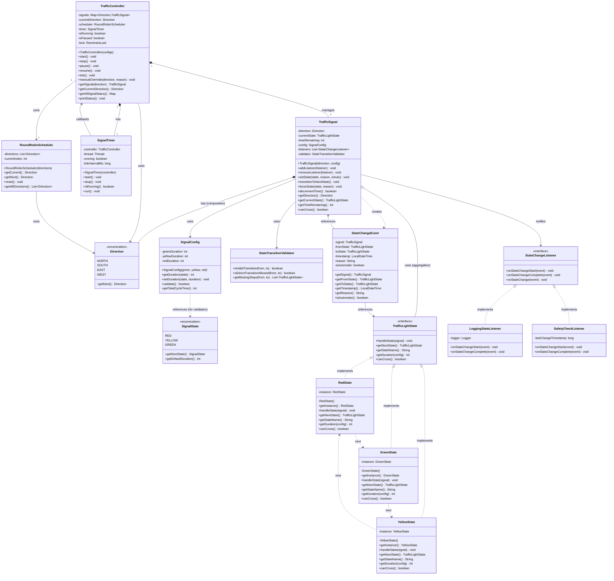

---

## 🎨 Relationship Legend

Let's understand ALL the different arrows and what they mean:

### 1. Inheritance/Implementation

**Symbol**: `<|--` (solid line with closed arrow) or `<|..` (dashed line with closed arrow)

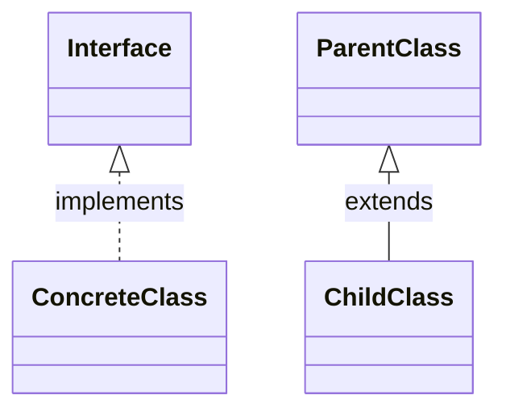

**Examples in Our System**:
- `TrafficLightState <|.. RedState` = RedState implements TrafficLightState
- `StateChangeListener <|.. LoggingStateListener` = LoggingStateListener implements StateChangeListener

**Java Code**:
```java
// Interface implementation (dashed line)
public class RedState implements TrafficLightState {
    // RedState "is-a" TrafficLightState
}

// Class inheritance (solid line)
public class AdvancedController extends TrafficController {
    // AdvancedController "is-a" TrafficController
}
```

---

### 2. Composition (Strong Ownership)

**Symbol**: `*--` (solid line with filled diamond)

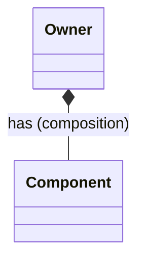

**Meaning**:
- Owner **owns** the component
- Component **cannot exist** without owner
- Component is **created** by owner
- Component is **destroyed** with owner

**Examples in Our System**:
- `TrafficController *-- TrafficSignal` = Controller creates and owns signals
- `TrafficController *-- SignalTimer` = Controller creates and owns timer
- `TrafficSignal *-- Direction` = Signal owns its direction

**Java Code**:
```java
public class TrafficController {
    // Composition: Controller OWNS the signals
    private Map<Direction, TrafficSignal> signals;

    public TrafficController() {
        signals = new HashMap<>();
        // Controller CREATES the signals (strong ownership)
        signals.put(Direction.NORTH, new TrafficSignal(Direction.NORTH, config));
    }
}
// If controller is destroyed, signals are destroyed too!
```

**Real-World Analogy**: A **car** has an **engine** (composition). If you destroy the car, the engine goes with it. The engine doesn't make sense without the car.

---

### 3. Aggregation (Weak Ownership)

**Symbol**: `o--` (solid line with hollow diamond)

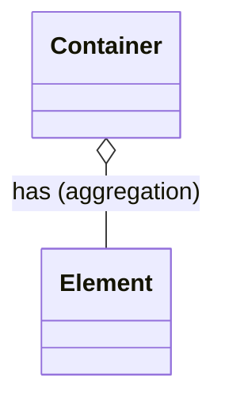

**Meaning**:
- Container **has** the element
- Element **can exist** independently
- Element is typically **passed in** (not created by container)
- Element can be **shared** by multiple containers

**Examples in Our System**:
- `TrafficSignal o-- TrafficLightState` = Signal uses state, but state exists independently (singleton)

**Java Code**:
```java
public class TrafficSignal {
    // Aggregation: Signal USES state, but doesn't own it
    private TrafficLightState currentState;

    public void setState(TrafficLightState newState) {
        // State is passed in from outside (singleton)
        this.currentState = newState;
    }
}
// States exist independently (RedState.getInstance())
// Multiple signals can use the same state instance
```

**Real-World Analogy**: A **library** has **books** (aggregation). If the library closes, books still exist. Books can move to another library.

---

### 4. Dependency (Uses)

**Symbol**: `-->` (solid line with open arrow)

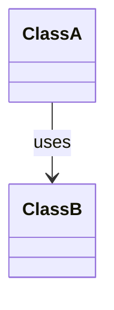

**Meaning**:
- ClassA **uses** ClassB
- ClassA depends on ClassB to function
- No ownership involved
- Typically passed as parameter or returned from method

**Examples in Our System**:
- `TrafficSignal --> SignalConfig` = Signal uses config
- `TrafficController --> RoundRobinScheduler` = Controller uses scheduler
- `SignalTimer --> TrafficController` = Timer calls controller

**Java Code**:
```java
public class TrafficSignal {
    // Dependency: Signal USES config, but doesn't own it
    private final SignalConfig config;

    public TrafficSignal(Direction direction, SignalConfig config) {
        this.config = config; // Config passed from outside
    }

    public void resetTime() {
        this.timeRemaining = config.getDuration(currentState); // Using config
    }
}
```

**Real-World Analogy**: A **chef** uses a **recipe** (dependency). The chef doesn't own the recipe, just follows it.

---

### 5. Association (General Relationship)

**Symbol**: `--` (solid line without arrow)

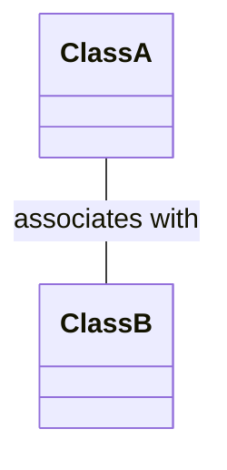

**Meaning**:
- General relationship without specific ownership
- Can be bidirectional
- Not commonly used (prefer more specific relationships)

---

### 6. Dependency (Creates/Returns)

**Symbol**: `..>` (dashed line with open arrow)

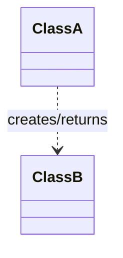

**Meaning**:
- ClassA creates instances of ClassB
- Or ClassA returns ClassB from methods
- Weaker relationship than solid arrow

**Examples in Our System**:
- `TrafficSignal ..> StateChangeEvent` = Signal creates events
- `RedState ..> GreenState` = RedState returns GreenState from getNextState()

**Java Code**:
```java
public class TrafficSignal {
    // Creates StateChangeEvent
    public void setState(TrafficLightState newState, String reason, boolean isAuto) {
        StateChangeEvent event = new StateChangeEvent(...); // Creates event
        notifyListeners(event);
    }
}

public class RedState {
    // Returns next state
    public TrafficLightState getNextState() {
        return GreenState.getInstance(); // Returns/depends on GreenState
    }
}
```

---

## 📊 Relationship Summary Table

| Relationship | Symbol | Java Example | Lifetime | Example |
|--------------|--------|--------------|----------|---------|
| **Implementation** | `<\|..` | `class A implements B` | Independent | RedState implements TrafficLightState |
| **Inheritance** | `<\|--` | `class A extends B` | Child depends on parent | (not used in our system) |
| **Composition** | `*--` | `new B()` inside A | Same as owner | Controller owns Signals |
| **Aggregation** | `o--` | B passed to A | Independent | Signal uses State (singleton) |
| **Dependency** | `-->` | A uses B | Independent | Signal uses Config |
| **Creates** | `..>` | `new B()` in method | Independent | Signal creates Event |

---

## 🧩 Design Patterns Visible in Diagram

### 1. State Pattern
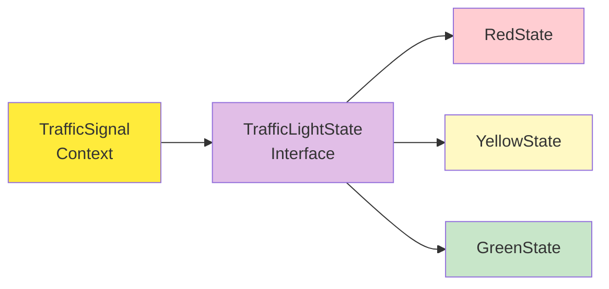

**Where**: TrafficSignal uses TrafficLightState interface with concrete implementations

**Benefits**:
- Easy to add new states (e.g., FlashingYellow)
- State behavior is encapsulated
- Follows Open/Closed Principle

---

### 2. Singleton Pattern
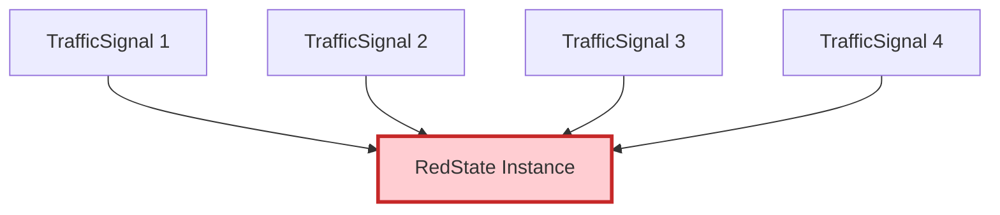

**Where**: RedState, YellowState, GreenState are singletons

**Benefits**:
- Only one instance per state (memory efficient)
- Global access point
- Thread-safe (properly implemented)

---

### 3. Observer Pattern
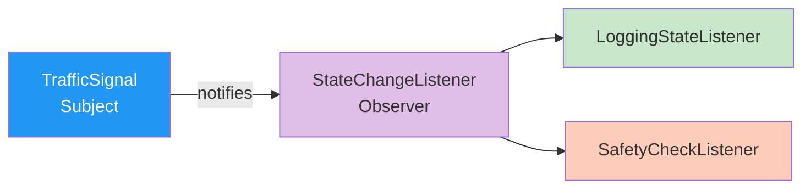

**Where**: TrafficSignal notifies StateChangeListeners when state changes

**Benefits**:
- Loose coupling between signal and observers
- Easy to add new listeners
- Follows Single Responsibility

---

### 4. Strategy Pattern (Implicit)
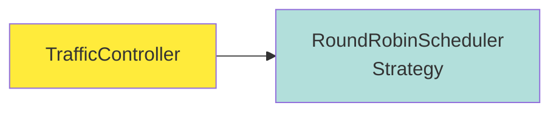

**Where**: TrafficController uses RoundRobinScheduler for direction selection

**Benefits**:
- Can swap scheduler algorithms (e.g., priority-based, time-based)
- Encapsulates scheduling logic

---

## 🎯 Class Responsibilities (Single Responsibility Principle)

| Class | Single Responsibility | Why This Design? |
|-------|----------------------|------------------|
| **Direction** | Represent a direction | Fixed set of values, enum is perfect |
| **SignalState** | Represent signal states | For backward compatibility with config |
| **TrafficLightState** | Define state contract | Interface for polymorphism |
| **RedState/YellowState/GreenState** | Implement specific state behavior | Each state has unique logic |
| **SignalConfig** | Store duration configuration | Separate config from behavior |
| **TrafficSignal** | Manage a single signal | One signal, one responsibility |
| **StateTransitionValidator** | Validate transitions | Separate validation logic |
| **StateChangeEvent** | Encapsulate change data | Immutable data carrier |
| **StateChangeListener** | Define observer contract | Interface for observers |
| **LoggingStateListener** | Log state changes | Single concern: logging |
| **SafetyCheckListener** | Perform safety checks | Single concern: safety |
| **TrafficController** | Coordinate all signals | Central coordination |
| **SignalTimer** | Provide timing mechanism | Single concern: timing |
| **RoundRobinScheduler** | Manage direction order | Single concern: scheduling |

---

## 🔢 Class Count and Complexity

### Total Classes: 14
- Enums: 2
- Interfaces: 2
- Concrete Classes: 10

### Lines of Code (Approximate):
- RedState, YellowState, GreenState: ~100 each = 300
- TrafficSignal: ~200
- TrafficController: ~300
- SignalTimer: ~150
- Others: ~100 each = 700
- **Total: ~1,650 lines**

### Complexity Level:
- **Beginner**: Direction, SignalState, SignalConfig
- **Intermediate**: TrafficLightState, RedState, YellowState, GreenState, TrafficSignal
- **Advanced**: TrafficController, SignalTimer, StateTransitionValidator, Observers

---

## 🎨 Package Structure

```
com.traffic.signal/
├── enums/
│   ├── Direction.java
│   └── SignalState.java
├── state/
│   ├── TrafficLightState.java (interface)
│   ├── RedState.java
│   ├── YellowState.java
│   └── GreenState.java
├── config/
│   └── SignalConfig.java
├── core/
│   └── TrafficSignal.java
├── validation/
│   └── StateTransitionValidator.java
├── observer/
│   ├── StateChangeListener.java (interface)
│   ├── StateChangeEvent.java
│   ├── LoggingStateListener.java
│   └── SafetyCheckListener.java
├── controller/
│   ├── TrafficController.java
│   ├── SignalTimer.java
│   └── RoundRobinScheduler.java
└── Main.java
```

---

## 🎯 Key Takeaways

1. **Layered Architecture**: Clear separation of concerns
2. **Design Patterns**: State, Singleton, Observer, Strategy
3. **SOLID Principles**: Each class has single responsibility
4. **Extensibility**: Easy to add new states, listeners, schedulers
5. **Thread Safety**: ReentrantLock in controller, volatile flags in timer
6. **Fail-Safe**: All signals go RED on shutdown

---

## 🔜 What's Next?

In the next sections, we'll see:
- **Sequence Diagrams**: How objects interact over time
- **Component Diagrams**: Deployment architecture
- **Concurrency Details**: Thread safety deep dive

---

**Remember**: This diagram is your roadmap. Refer back to it when implementing or debugging!
