# Sequence Diagrams - System Interactions

> **For Beginners**: A Sequence Diagram shows HOW objects interact over TIME. It's like a comic strip showing who talks to whom and in what order. Read from top to bottom - time flows downward!

---

## 🎯 WHAT ARE SEQUENCE DIAGRAMS?

**Simple Explanation**:
- **Vertical axis** = Time (flows downward)
- **Horizontal axis** = Different objects/actors
- **Arrows** = Messages/method calls between objects
- **Boxes on lifeline** = Object is active/processing

**Real-World Analogy**: Like a WhatsApp conversation:
```
10:00 AM - You: "Hello!"
10:01 AM - Friend: "Hi! How are you?"
10:02 AM - You: "Good! Want to grab coffee?"
10:03 AM - Friend: "Sure! See you at 3 PM"
```

---

## 📊 Diagram 1: System Startup

**Scenario**: Administrator starts the traffic signal system.


**Key Points**:
1. Controller creates all signals during initialization
2. All signals start in RED (fail-safe)
3. First direction (NORTH) is set to GREEN
4. Timer thread starts in background
5. System is now running automatically

---

## 📊 Diagram 2: Automatic State Transition

**Scenario**: Timer triggers automatic transition from GREEN → YELLOW → RED, then cycles to next direction.


**Key Points**:
1. Timer ticks every second
2. Active signal's time is decremented
3. When time expires, state transitions occur
4. Observers are notified of all changes
5. After RED, controller cycles to next direction
6. Next signal becomes GREEN

---

## 📊 Diagram 3: Manual Override

**Scenario**: Operator triggers manual override to give EAST direction priority (e.g., ambulance).

```mermaid
sequenceDiagram
    participant Operator as 👤 Operator
    participant Controller as TrafficController
    participant North as Signal(NORTH)
    participant East as Signal(EAST)
    participant Listeners as Observers
    participant Logger as LoggingListener

    Note over Operator,Logger: Current: NORTH is GREEN<br/>Override: Need EAST for ambulance

    Operator->>Controller: manualOverride(EAST, "Ambulance")
    activate Controller

    Controller->>Controller: lock.lock() 🔒
    Note over Controller: Thread-safe operation

    Controller->>Controller: validate: isRunning?
    Note over Controller: ✅ System is running

    Controller->>Controller: Check if EAST already GREEN
    Note over Controller: NORTH is GREEN, not EAST<br/>Need to switch

    Note over Controller: Step 1: Stop current GREEN signal

    Controller->>North: getCurrentStateName()
    North-->>Controller: "GREEN"

    Controller->>North: setState(YellowState, "Manual override", false)
    activate North

    North->>North: validate transition
    North->>Listeners: onStateChangeStart(event)
    activate Listeners
    Listeners->>Logger: log: "Manual override starting"
    Logger-->>Listeners: ✅
    deactivate Listeners

    North->>North: currentState = YellowState
    North->>North: handleState()

    North->>Listeners: onStateChangeComplete(event)
    activate Listeners
    Listeners->>Logger: log: "NORTH → YELLOW completed"
    Logger-->>Listeners: ✅
    deactivate Listeners

    North-->>Controller: transitioned to YELLOW
    deactivate North

    Note over Controller: Wait for YELLOW duration<br/>(in real system, would be async)

    Note over Controller: Step 2: Transition to RED

    Controller->>North: setState(RedState, "Manual override", false)
    activate North

    North->>Listeners: notify listeners
    North-->>Controller: transitioned to RED
    deactivate North

    Note over Controller: Step 3: Set target to GREEN

    Controller->>East: setState(GreenState, "Manual override - Ambulance", false)
    activate East

    East->>East: validate transition
    East->>Listeners: onStateChangeStart(event)
    activate Listeners
    Listeners->>Logger: log: "⚠️ MANUAL OVERRIDE: EAST → GREEN"
    Logger-->>Listeners: ✅
    deactivate Listeners

    East->>East: currentState = GreenState
    East->>East: handleState()

    East->>Listeners: onStateChangeComplete(event)
    activate Listeners
    Listeners->>Logger: log: "EAST is now GREEN (Manual override)"
    Logger-->>Listeners: ✅
    deactivate Listeners

    East-->>Controller: transitioned to GREEN
    deactivate East

    Controller->>Controller: currentDirection = EAST
    Controller->>Controller: lock.unlock() 🔓

    Controller-->>Operator: Manual override completed ✅
    deactivate Controller

    Note over Operator,Logger: EAST is now GREEN<br/>Ambulance can pass!<br/>System will resume normal cycling after
```



**Key Points**:
1. Manual override requires thread lock (thread-safe)
2. Current GREEN signal transitions through YELLOW to RED (safety!)
3. Target signal is set to GREEN
4. All changes are logged for audit trail
5. System resumes automatic cycling after override
6. Never skip YELLOW state (safety requirement)

---

## 📊 Diagram 4: State Validation Failure

**Scenario**: Attempt invalid transition (GREEN → RED directly).


**Key Points**:
1. Validator checks all transitions
2. Invalid transitions are rejected
3. Exception is thrown to caller
4. Signal state is NOT changed
5. Safety is maintained

---

## 📊 Diagram 5: Observer Pattern Notification

**Scenario**: Multiple observers react to a state change.

```mermaid
sequenceDiagram
    participant Signal as TrafficSignal
    participant Validator as Validator
    participant Logger as LoggingListener
    participant Safety as SafetyListener
    participant UI as UIListener (hypothetical)
    participant RedState as RedState
    participant GreenState as GreenState

    Note over Signal,GreenState: Transition: RED → GREEN

    Signal->>Validator: isValidTransition(RED, GREEN)
    Validator-->>Signal: true ✅

    Signal->>Signal: Create StateChangeEvent
    Note over Signal: event = new StateChangeEvent(<br/>  signal: this,<br/>  from: RED,<br/>  to: GREEN,<br/>  reason: "Auto cycle",<br/>  isAutomatic: true<br/>)

    Note over Signal: Notify all listeners (BEFORE)

    Signal->>Logger: onStateChangeStart(event)
    activate Logger
    Logger->>Logger: log to console
    Note over Logger: "🔄 State change starting:<br/>NORTH: RED → GREEN"
    Logger-->>Signal: ✅
    deactivate Logger

    Signal->>Safety: onStateChangeStart(event)
    activate Safety
    Safety->>Safety: validate transition safety
    Safety->>Safety: check rapid flipping
    Note over Safety: Last change: 60 seconds ago<br/>✅ Safe
    Safety-->>Signal: ✅
    deactivate Safety

    Signal->>UI: onStateChangeStart(event)
    activate UI
    UI->>UI: update dashboard
    Note over UI: Show "NORTH: transitioning..."
    UI-->>Signal: ✅
    deactivate UI

    Note over Signal: Perform actual state change

    Signal->>Signal: currentState = GreenState
    Signal->>Signal: timeRemaining = 60
    Signal->>GreenState: handleState(this)
    activate GreenState
    GreenState->>GreenState: turn on green LED
    GreenState-->>Signal: ✅
    deactivate GreenState

    Note over Signal: Notify all listeners (AFTER)

    Signal->>Logger: onStateChangeComplete(event)
    activate Logger
    Logger->>Logger: log to file
    Note over Logger: "✅ State change completed:<br/>NORTH is now GREEN"
    Logger-->>Signal: ✅
    deactivate Logger

    Signal->>Safety: onStateChangeComplete(event)
    activate Safety
    Safety->>Safety: update last change timestamp
    Safety->>Safety: log successful check
    Safety-->>Signal: ✅
    deactivate Safety

    Signal->>UI: onStateChangeComplete(event)
    activate UI
    UI->>UI: update dashboard
    Note over UI: Show "NORTH: GREEN (60s)"
    UI-->>Signal: ✅
    deactivate UI

    Note over Signal,GreenState: All observers notified<br/>Transition complete ✅
```



**Key Points**:
1. All listeners are notified BEFORE state change
2. State change happens
3. All listeners are notified AFTER state change
4. Listeners can perform different actions (log, validate, update UI)
5. If any listener throws exception, others still get notified

---

## 📊 Diagram 6: System Shutdown

**Scenario**: Administrator stops the system gracefully.

```mermaid
sequenceDiagram
    participant Admin as 👤 Admin
    participant Controller as TrafficController
    participant Timer as SignalTimer
    participant North as Signal(NORTH)
    participant South as Signal(SOUTH)
    participant East as Signal(EAST)
    participant West as Signal(WEST)

    Note over Admin,West: System is running<br/>SOUTH is GREEN

    Admin->>Controller: stop()
    activate Controller

    Controller->>Controller: lock.lock() 🔒

    Controller->>Controller: validate: isRunning?
    Note over Controller: ✅ System is running

    Note over Controller: Step 1: Stop timer

    Controller->>Timer: stop()
    activate Timer

    Timer->>Timer: running = false
    Timer->>Timer: thread.interrupt()
    Note over Timer: Wait for thread to finish<br/>(join with timeout)

    Timer-->>Controller: timer stopped ✅
    deactivate Timer

    Note over Controller: Step 2: Fail-safe - All to RED

    Controller->>Controller: setAllSignalsToRed()

    Controller->>North: setState(RedState, "System shutdown", true)
    activate North
    North->>North: handleState()
    North-->>Controller: ✅
    deactivate North

    Controller->>South: setState(RedState, "System shutdown", true)
    activate South
    South->>South: handleState()
    South-->>Controller: ✅
    deactivate South

    Controller->>East: setState(RedState, "System shutdown", true)
    activate East
    East->>East: handleState()
    East-->>Controller: ✅
    deactivate East

    Controller->>West: setState(RedState, "System shutdown", true)
    activate West
    West->>West: handleState()
    West-->>Controller: ✅
    deactivate West

    Note over Controller: Step 3: Update flags

    Controller->>Controller: isRunning = false
    Controller->>Controller: isPaused = false

    Controller->>Controller: lock.unlock() 🔓

    Controller-->>Admin: System stopped ✅
    deactivate Controller

    Note over Admin,West: All signals are RED<br/>Timer is stopped<br/>System is safe
```



**Key Points**:
1. Timer is stopped first
2. All signals transition to RED (fail-safe)
3. System state flags are updated
4. Thread lock ensures safe shutdown
5. System can be restarted later

---

## 🎯 Sequence Diagram Reading Guide

### How to Read These Diagrams:

1. **Top to Bottom** = Time flows downward
2. **Left to Right** = Different objects/actors
3. **Solid Arrow (→)** = Synchronous call (waits for response)
4. **Dashed Arrow (⇢)** = Return/response
5. **Box on Lifeline** = Object is active (processing)
6. **Note boxes** = Comments/explanations
7. **Loop box** = Repeated actions
8. **Alt box** = Conditional (if/else)

### Symbols:
- `→` : Method call
- `⇢` : Return value
- `🔒` : Lock acquired
- `🔓` : Lock released
- `✅` : Success
- `❌` : Failure
- `⏰` : Timer/timeout
- `💥` : Exception

---

## 🎯 Key Takeaways

1. **Initialization**: Controller creates all components
2. **Automatic Cycling**: Timer → Controller → Signal → State transition
3. **Manual Override**: Validates, transitions through YELLOW, sets target GREEN
4. **Validation**: All transitions checked, invalid ones rejected
5. **Observer Pattern**: Multiple listeners notified of changes
6. **Shutdown**: Timer stops, all signals go RED (fail-safe)

---

## 🔜 What's Next?

Next we'll see:
- **Component Diagrams**: How system is deployed
- **Concurrency Details**: Thread safety mechanisms
- **Design Patterns**: Detailed explanation

---

**Remember**: Sequence diagrams show the "movie" of how objects interact. Class diagrams show the "cast" (who's who).
