# Component and Deployment Diagrams

> **For Beginners**: Component Diagrams show the BIG PICTURE - how different parts of the system fit together and how they're deployed. Think of it like a building blueprint showing rooms, floors, and how utilities connect!

---

## 🎯 WHAT ARE COMPONENT DIAGRAMS?

**Component Diagram**: Shows major components and their dependencies
**Deployment Diagram**: Shows hardware/infrastructure where system runs
**Data Model**: Shows how data is structured and persisted

---

## 📊 Component Diagram - Logical Architecture


**Layer Responsibilities**:

| Layer | Purpose | Components |
|-------|---------|------------|
| **Presentation** | User interaction | CLI, Web UI, API |
| **Application** | Business orchestration | Controller, Timer, Scheduler |
| **Domain** | Core business logic | Signal, State, Observer, Validator |
| **Infrastructure** | Technical services | Logger, Config, Persistence |

---

## 📊 Component Details

### 1. Traffic Controller Component

```mermaid
graph TB
    subgraph "Traffic Controller Component"
        Main[TrafficController<br/>Main Class]
        Lock[ReentrantLock<br/>Thread Safety]
        SignalMap[Map&lt;Direction, TrafficSignal&gt;<br/>Signal Registry]
    end

    subgraph "Provides Interfaces"
        IStart[start&#40;&#41;]
        IStop[stop&#40;&#41;]
        ITick[tick&#40;&#41;]
        IOverride[manualOverride&#40;&#41;]
        IQuery[getSignalStatus&#40;&#41;]
    end

    subgraph "Requires Interfaces"
        RTimer[Timer.start&#40;&#41;]
        RSignal[Signal.setState&#40;&#41;]
        RScheduler[Scheduler.getNext&#40;&#41;]
    end

    Main --> IStart
    Main --> IStop
    Main --> ITick
    Main --> IOverride
    Main --> IQuery

    Main ..> RTimer
    Main ..> RSignal
    Main ..> RScheduler

    style Main fill:#ffeb3b,stroke:#f57f17,stroke-width:3px
```

**Provides**: Control operations (start, stop, override, query)
**Requires**: Timer, Signal, Scheduler services
**Dependencies**: Thread-safe, requires locking

---

### 2. Traffic Signal Component

```mermaid
graph TB
    subgraph "Traffic Signal Component"
        SignalMain[TrafficSignal<br/>Main Class]
        ListenerList[List&lt;StateChangeListener&gt;<br/>Observer Registry]
    end

    subgraph "Provides Interfaces"
        ISetState[setState&#40;&#41;]
        ITransition[transitionToNextState&#40;&#41;]
        IQuery[getCurrentState&#40;&#41;]
        IListener[addListener&#40;&#41;/removeListener&#40;&#41;]
    end

    subgraph "Requires Interfaces"
        RState[State.handleState&#40;&#41;]
        RValidator[Validator.isValidTransition&#40;&#41;]
        RConfig[Config.getDuration&#40;&#41;]
        RObserver[Observer.onStateChange&#40;&#41;]
    end

    SignalMain --> ISetState
    SignalMain --> ITransition
    SignalMain --> IQuery
    SignalMain --> IListener

    SignalMain ..> RState
    SignalMain ..> RValidator
    SignalMain ..> RConfig
    SignalMain ..> RObserver

    style SignalMain fill:#ff9800,stroke:#e65100,stroke-width:3px
```

**Provides**: State management, observer registration
**Requires**: State objects, validator, config, observers
**Dependencies**: State pattern, observer pattern

---

## 📊 Deployment Diagram - Single Intersection


**Hardware Requirements**:
- **CPU**: 1 GHz+ (Raspberry Pi 3 or better)
- **RAM**: 256 MB minimum (512 MB recommended)
- **Storage**: 100 MB for application + logs
- **GPIO Pins**: 12 pins (4 directions × 3 states)
- **Network**: Optional (for remote monitoring)

**Software Requirements**:
- **OS**: Linux-based (Raspbian, Ubuntu)
- **Java**: JDK 8 or higher
- **Dependencies**: None (pure Java)

---

## 📊 Deployment Diagram - Multi-Intersection


**Communication Protocol**: MQTT or HTTP/REST
**Data Flow**:
1. Each intersection runs independently
2. Sends status updates to central dashboard
3. Dashboard aggregates and displays
4. Analytics service processes historical data

---

## 📊 Data Model

### State Transition Log (for persistence)


**Schema Details**:

1. **INTERSECTION**: Metadata about the intersection
   - Location (GPS coordinates)
   - Installation date
   - Name/identifier

2. **SIGNAL**: Individual signals at intersection
   - Direction (NORTH, SOUTH, EAST, WEST)
   - Foreign key to intersection

3. **STATE_TRANSITION**: Historical log of all state changes
   - Immutable audit log
   - Tracks automatic and manual transitions
   - Used for analytics and debugging

4. **MANUAL_OVERRIDE**: Log of operator interventions
   - Who triggered override
   - Why (reason)
   - When and for how long
   - Compliance and audit purposes

5. **CONFIGURATION**: Current settings
   - Duration for each state
   - Version controlled (historical tracking)

---

## 📊 Process Flow Diagram

```mermaid
flowchart TD
    Start([System Boot]) --> Init[Initialize Components]
    Init --> LoadConfig[Load Configuration]
    LoadConfig --> CreateSignals[Create 4 Traffic Signals]
    CreateSignals --> SetRed[Set All Signals to RED]
    SetRed --> StartTimer[Start Timer Thread]
    StartTimer --> FirstGreen[Set First Direction to GREEN]
    FirstGreen --> Running{System Running?}

    Running -->|Yes| Tick[Timer Tick Every Second]
    Tick --> Decrement[Decrement Active Signal Time]
    Decrement --> Expired{Time Expired?}

    Expired -->|No| Running
    Expired -->|Yes| CheckState{Current State?}

    CheckState -->|GREEN| ToYellow[Transition to YELLOW]
    ToYellow --> Running

    CheckState -->|YELLOW| ToRed[Transition to RED]
    ToRed --> NextDir[Get Next Direction]
    NextDir --> SetGreen[Set Next Signal to GREEN]
    SetGreen --> Running

    Running -->|Override?| Override[Manual Override Request]
    Override --> StopCurrent[Stop Current Signal<br/>GREEN → YELLOW → RED]
    StopCurrent --> ForceGreen[Force Target to GREEN]
    ForceGreen --> Running

    Running -->|Stop Command| Shutdown[Stop Timer Thread]
    Shutdown --> AllRed[Set All Signals to RED]
    AllRed --> Cleanup[Cleanup Resources]
    Cleanup --> End([System Shutdown])

    style Start fill:#4caf50,stroke:#1b5e20
    style Running fill:#ffeb3b,stroke:#f57f17
    style End fill:#f44336,stroke:#c62828
    style Override fill:#ff9800,stroke:#e65100
```



---

## 📊 Network Communication (Future Enhancement)


**MQTT Topics**:
- `/intersection/{id}/status` - Status updates
- `/intersection/{id}/events` - State change events
- `/intersection/{id}/commands` - Commands from dashboard
- `/intersection/{id}/responses` - Command responses

---

## 📊 Scalability Architecture


**Scalability Features**:
1. **Horizontal Scaling**: Multiple API servers
2. **Load Balancing**: Distribute traffic
3. **Message Queue**: Decouple components
4. **Database Replication**: Read replicas for scaling
5. **Edge Computing**: Each intersection runs independently

---

## 🎯 Deployment Strategies

### Strategy 1: Standalone (Current Implementation)
- **Use Case**: Single intersection, no network
- **Pros**: Simple, no dependencies
- **Cons**: No remote monitoring

### Strategy 2: Centralized Monitoring
- **Use Case**: Multiple intersections, city-wide
- **Pros**: Central visibility, analytics
- **Cons**: Network dependency

### Strategy 3: Hybrid (Recommended)
- **Use Case**: Critical infrastructure
- **Pros**: Works offline, syncs when online
- **Cons**: More complex implementation

---

## 🎯 Key Takeaways

1. **Component Diagram**: Shows logical structure
2. **Deployment Diagram**: Shows physical infrastructure
3. **Data Model**: Defines persistence structure
4. **Scalability**: System can grow from 1 to 1000s of intersections
5. **Independence**: Each intersection runs autonomously

---

## 🔜 What's Next?

Next we'll cover:
- **Concurrency and Thread Safety**: Deep dive into locking
- **SOLID Principles**: How we applied them
- **Design Patterns**: Complete catalog

---

**Remember**: Good architecture is about layers, separation of concerns, and scalability!
