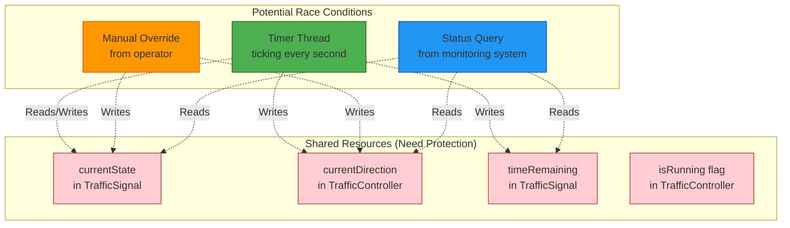

# Concurrency and Thread Safety

> **For Beginners**: When multiple things happen at the same time (like timer ticking AND manual override), we need **thread safety** to prevent chaos! Think of it like traffic rules for your code - preventing "collisions" between threads.

---

## 🎯 WHY CONCURRENCY MATTERS?

### The Problem Without Thread Safety:

```java
// ❌ DANGEROUS: Two threads modifying state simultaneously
Thread 1 (Timer):           Thread 2 (Manual Override):
signal.getCurrentState()    signal.getCurrentState()
  → GREEN                     → GREEN
signal.setState(YELLOW)     signal.setState(RED)

Result: Undefined! Which wins? 💥
```

### Real-World Analogy:
Imagine two people trying to use the same ATM card at different ATMs simultaneously:
- Person A: Withdraws $100 (balance: $1000 → $900)
- Person B: Withdraws $100 (reads $1000, withdraws, balance: $900)
- Result: Two withdrawals, but balance only decreased once! 💸

---

## 📊 Concurrency Points in Our System



---

## 🔒 Thread Safety Mechanisms

### 1. ReentrantLock (Used in TrafficController)

**What**: A lock that only one thread can hold at a time
**Why**: Prevents simultaneous modifications to controller state

```java
import java.util.concurrent.locks.ReentrantLock;
import java.util.logging.Logger;

/**
 * TrafficController with ReentrantLock for thread safety.
 *
 * Why ReentrantLock instead of synchronized?
 * ✅ More flexible (try-lock with timeout)
 * ✅ Can check if locked
 * ✅ Fair lock ordering (prevent starvation)
 * ✅ Better performance under high contention
 */
public class TrafficController {

    private static final Logger LOGGER = Logger.getLogger(TrafficController.class.getName());

    // The lock that protects all controller operations
    private final ReentrantLock lock;

    // Shared mutable state (protected by lock)
    private Direction currentDirection;
    private volatile boolean isRunning;  // Also volatile for visibility
    private volatile boolean isPaused;

    public TrafficController() {
        // Create fair lock (FIFO order) to prevent thread starvation
        this.lock = new ReentrantLock(true); // true = fair lock
        // ...
    }

    /**
     * Thread-safe start operation.
     */
    public void start() {
        lock.lock(); // 🔒 Acquire lock (blocks if another thread has it)
        try {
            // Only one thread can execute this block at a time
            if (isRunning) {
                LOGGER.warning("Controller is already running!");
                return;
            }

            // ... perform start operations
            isRunning = true;

            LOGGER.info("Controller started by thread: " + Thread.currentThread().getName());

        } finally {
            lock.unlock(); // 🔓 Always release lock (even if exception occurs!)
        }
    }

    /**
     * Thread-safe tick operation (called by timer).
     */
    public void tick() {
        lock.lock(); // 🔒 Acquire lock
        try {
            if (!isRunning || isPaused) {
                return; // Skip if not running
            }

            // Decrement time on active signal
            TrafficSignal activeSignal = signals.get(currentDirection);
            boolean timeExpired = activeSignal.decrementTime();

            if (timeExpired) {
                handleTimeExpired(activeSignal);
            }

        } finally {
            lock.unlock(); // 🔓 Release lock
        }
    }

    /**
     * Thread-safe manual override.
     */
    public void manualOverride(Direction direction, String reason) {
        lock.lock(); // 🔒 Acquire lock
        try {
            if (!isRunning) {
                throw new IllegalStateException("Cannot override - controller not running!");
            }

            LOGGER.warning(String.format(
                "Thread %s triggered manual override: %s",
                Thread.currentThread().getName(),
                direction
            ));

            // ... perform override operations
            currentDirection = direction;

        } finally {
            lock.unlock(); // 🔓 Release lock
        }
    }

    /**
     * Thread-safe query (read-only, but still needs lock for consistency).
     */
    public Map<Direction, String> getAllSignalStatus() {
        lock.lock(); // 🔒 Acquire lock
        try {
            // Read consistent snapshot of all signals
            Map<Direction, String> status = new LinkedHashMap<>();
            for (Direction dir : scheduler.getAllDirections()) {
                TrafficSignal signal = signals.get(dir);
                status.put(dir, signal.getStatus());
            }
            return status;

        } finally {
            lock.unlock(); // 🔓 Release lock
        }
    }
}
```

**Key Points**:
1. **Always lock in try-finally** - Ensures unlock even if exception occurs
2. **Fair lock** - Prevents thread starvation (first come, first served)
3. **Lock entire operation** - No partial state changes
4. **Short critical sections** - Don't hold lock longer than necessary

---

### 2. Volatile Keyword

**What**: Ensures variable changes are visible to all threads immediately
**Why**: Prevents threads from caching old values

```java
public class TrafficController {

    // Without volatile: Thread might cache old value
    // With volatile: Thread always sees latest value
    private volatile boolean isRunning;
    private volatile boolean isPaused;

    // Example: Timer thread checks this flag
    public void tick() {
        if (!isRunning || isPaused) { // ✅ Always sees fresh value
            return;
        }
        // ...
    }

    // Main thread sets this flag
    public void stop() {
        lock.lock();
        try {
            isRunning = false; // ✅ Immediately visible to timer thread
        } finally {
            lock.unlock();
        }
    }
}
```

**Volatile vs Synchronized**:
```java
// Volatile: Good for flags (read/write single variable)
private volatile boolean running;

// Synchronized/Lock: Good for complex operations (multiple steps)
lock.lock();
try {
    step1();
    step2();
    step3();
} finally {
    lock.unlock();
}
```

---

### 3. Thread-Safe Collections

**ConcurrentHashMap**: Thread-safe map without external locking

```java
import java.util.concurrent.ConcurrentHashMap;

public class TrafficController {

    // ✅ Thread-safe map (no external locking needed for basic ops)
    private final Map<Direction, TrafficSignal> signals = new ConcurrentHashMap<>();

    // Multiple threads can read/write safely
    public TrafficSignal getSignal(Direction direction) {
        return signals.get(direction); // ✅ Thread-safe
    }

    // Why ConcurrentHashMap instead of synchronized HashMap?
    // ✅ Better performance (fine-grained locking)
    // ✅ No need to lock entire map for single operation
    // ✅ Allows concurrent reads
}
```

**Regular HashMap (not thread-safe)**:
```java
// ❌ DANGEROUS: HashMap is not thread-safe!
private final Map<Direction, TrafficSignal> signals = new HashMap<>();

// Two threads calling put() simultaneously → data corruption 💥
```

---

## 📊 Race Condition Example

### Scenario: Timer and Manual Override Collide

```mermaid
sequenceDiagram
    participant Timer as Timer Thread
    participant Controller as TrafficController
    participant Override as Override Thread

    Note over Timer,Override: Without Locking (RACE CONDITION)

    Timer->>Controller: tick() - check currentDirection
    Note over Timer: currentDirection = NORTH

    Override->>Controller: manualOverride(EAST)
    Note over Override: Change currentDirection to EAST

    Timer->>Controller: Continue tick() - use NORTH
    Note over Timer: Decrement NORTH's time<br/>❌ But EAST is supposed to be active!

    Note over Timer,Override: Result: INCONSISTENT STATE 💥

    Note over Timer,Override: With Locking (SAFE)

    Timer->>Controller: tick() - acquire lock 🔒
    activate Controller
    Note over Controller: Lock acquired by Timer

    Override->>Controller: manualOverride(EAST) - try to acquire lock
    Note over Override: ⏳ Blocked! Waiting for lock...

    Timer->>Controller: Complete tick() - release lock 🔓
    deactivate Controller

    Override->>Controller: Now acquire lock 🔒
    activate Controller
    Override->>Controller: Change currentDirection to EAST
    Override->>Controller: Release lock 🔓
    deactivate Controller

    Note over Timer,Override: Result: CONSISTENT! ✅
```



---

## 🧪 Testing Thread Safety

### Test 1: Concurrent Tick and Override

```java
import java.util.concurrent.*;
import java.util.logging.Logger;

public class ConcurrencyTest {

    private static final Logger LOGGER = Logger.getLogger(ConcurrencyTest.class.getName());

    public static void main(String[] args) throws InterruptedException, ExecutionException {
        System.out.println("=== Testing Thread Safety ===\n");

        // Create controller
        TrafficController controller = new TrafficController();
        controller.start();

        // Create thread pool
        ExecutorService executor = Executors.newFixedThreadPool(10);

        // Task 1: Simulate rapid ticks (timer thread)
        Callable<Integer> tickTask = () -> {
            int tickCount = 0;
            for (int i = 0; i < 100; i++) {
                controller.tick();
                tickCount++;
                Thread.sleep(10); // 10ms per tick (faster than real)
            }
            return tickCount;
        };

        // Task 2: Simulate manual overrides (multiple operators)
        Callable<Integer> overrideTask = () -> {
            int overrideCount = 0;
            for (int i = 0; i < 20; i++) {
                Direction[] directions = Direction.values();
                Direction randomDir = directions[ThreadLocalRandom.current().nextInt(directions.length)];
                try {
                    controller.manualOverride(randomDir, "Test override " + i);
                    overrideCount++;
                } catch (Exception e) {
                    LOGGER.warning("Override failed: " + e.getMessage());
                }
                Thread.sleep(50); // 50ms between overrides
            }
            return overrideCount;
        };

        // Task 3: Simulate status queries (monitoring system)
        Callable<Integer> queryTask = () -> {
            int queryCount = 0;
            for (int i = 0; i < 200; i++) {
                Map<Direction, String> status = controller.getAllSignalStatus();
                queryCount++;
                Thread.sleep(5); // 5ms per query
            }
            return queryCount;
        };

        // Submit tasks
        List<Future<Integer>> futures = new ArrayList<>();
        futures.add(executor.submit(tickTask));
        futures.add(executor.submit(overrideTask));
        futures.add(executor.submit(overrideTask)); // Multiple override threads
        futures.add(executor.submit(queryTask));
        futures.add(executor.submit(queryTask));
        futures.add(executor.submit(queryTask));

        // Wait for all tasks to complete
        for (Future<Integer> future : futures) {
            int result = future.get();
            LOGGER.info("Task completed with result: " + result);
        }

        // Shutdown
        executor.shutdown();
        controller.stop();

        System.out.println("✅ All concurrent operations completed without errors!");
        System.out.println("   If you see this message, thread safety is working! 🎉");
    }
}
```

**What This Test Proves**:
1. Multiple threads accessing controller simultaneously
2. No data corruption (all operations complete)
3. No deadlocks (all threads finish)
4. No exceptions (state remains consistent)

---

### Test 2: Deadlock Prevention

```java
/**
 * Test to ensure no deadlocks occur.
 *
 * Deadlock scenario:
 * - Thread A: locks resource 1, wants resource 2
 * - Thread B: locks resource 2, wants resource 1
 * - Both wait forever! ⏰
 *
 * Our prevention:
 * - Use single lock (ReentrantLock) for all controller operations
 * - Always acquire lock in same order
 * - Use try-finally to ensure unlock
 */
public class DeadlockPreventionTest {

    public static void main(String[] args) throws InterruptedException {
        TrafficController controller = new TrafficController();
        controller.start();

        // Create two threads that might deadlock if poorly designed
        Thread t1 = new Thread(() -> {
            for (int i = 0; i < 1000; i++) {
                controller.manualOverride(Direction.NORTH, "T1");
            }
        }, "Override-Thread-1");

        Thread t2 = new Thread(() -> {
            for (int i = 0; i < 1000; i++) {
                controller.manualOverride(Direction.SOUTH, "T2");
            }
        }, "Override-Thread-2");

        // Start both threads
        t1.start();
        t2.start();

        // Wait for completion with timeout
        t1.join(5000); // Wait max 5 seconds
        t2.join(5000);

        if (t1.isAlive() || t2.isAlive()) {
            System.out.println("❌ DEADLOCK DETECTED! Threads are still running after timeout.");
        } else {
            System.out.println("✅ No deadlock! Both threads completed successfully.");
        }

        controller.stop();
    }
}
```

---

## 🎯 Thread Safety Patterns

### Pattern 1: Immutable Objects

**What**: Objects that can't be modified after creation
**Why**: Immutable objects are automatically thread-safe!

```java
/**
 * StateChangeEvent is immutable - all fields are final.
 * Multiple threads can safely read this without locking.
 */
public class StateChangeEvent {
    private final TrafficSignal signal;     // Final - can't change
    private final TrafficLightState fromState;  // Final
    private final TrafficLightState toState;    // Final
    private final LocalDateTime timestamp;      // Final
    private final String reason;               // Final

    // Constructor sets all fields (no setters!)
    public StateChangeEvent(...) {
        this.signal = signal;
        this.fromState = fromState;
        // ... all fields set here
    }

    // Only getters (no setters!)
    public TrafficSignal getSignal() {
        return signal;
    }
    // ... other getters only
}
```

---

### Pattern 2: Thread-Local Storage

**What**: Each thread has its own copy of data
**Why**: No sharing = no conflicts!

```java
/**
 * Example: Each thread has its own logger.
 */
public class SignalLogger {
    // Each thread gets its own SimpleDateFormat instance
    private static final ThreadLocal<SimpleDateFormat> DATE_FORMAT =
        ThreadLocal.withInitial(() -> new SimpleDateFormat("yyyy-MM-dd HH:mm:ss"));

    public void log(String message) {
        // Thread-safe: Each thread uses its own SimpleDateFormat
        String timestamp = DATE_FORMAT.get().format(new Date());
        System.out.println("[" + timestamp + "] " + message);
    }
}
```

---

### Pattern 3: Copy-On-Write

**What**: Make a copy before modifying (original unchanged)
**Why**: Readers see consistent snapshot

```java
import java.util.concurrent.CopyOnWriteArrayList;

/**
 * Observers list using Copy-On-Write.
 * Perfect for read-heavy, write-rarely scenarios.
 */
public class TrafficSignal {
    // CopyOnWriteArrayList: Copying on every write (add/remove listener)
    // But iteration is fast and thread-safe without locking!
    private final List<StateChangeListener> listeners = new CopyOnWriteArrayList<>();

    public void addListener(StateChangeListener listener) {
        listeners.add(listener); // Creates new copy internally
    }

    public void notifyListeners(StateChangeEvent event) {
        // Iteration is thread-safe (uses snapshot)
        for (StateChangeListener listener : listeners) {
            listener.onStateChange(event);
        }
    }
}
```

---

## 🎯 Common Concurrency Bugs and Solutions

### Bug 1: Forgetting to Lock

```java
// ❌ BAD: No locking!
public void tick() {
    if (!isRunning) return;
    currentDirection = scheduler.getNext(); // Race condition! 💥
}

// ✅ GOOD: With locking
public void tick() {
    lock.lock();
    try {
        if (!isRunning) return;
        currentDirection = scheduler.getNext(); // Safe ✅
    } finally {
        lock.unlock();
    }
}
```

---

### Bug 2: Locking Too Much (Deadlock)

```java
// ❌ BAD: Nested locks (different order) → DEADLOCK!
Thread 1:
  lockA.lock();
  lockB.lock();

Thread 2:
  lockB.lock(); // Waits for Thread 1
  lockA.lock(); // Waits for Thread 2
  // DEADLOCK! 💀

// ✅ GOOD: Single lock or consistent order
Thread 1:
  mainLock.lock();
  // ... all operations

Thread 2:
  mainLock.lock();
  // ... all operations
```

---

### Bug 3: Forgetting Volatile

```java
// ❌ BAD: Thread caches old value
private boolean running = true;

public void run() {
    while (running) { // Might never see running = false! 💥
        // ... work
    }
}

// ✅ GOOD: Volatile ensures visibility
private volatile boolean running = true;

public void run() {
    while (running) { // Always sees latest value ✅
        // ... work
    }
}
```

---

## 🎯 Performance Considerations

### Lock Contention

```java
// ❌ BAD: Lock held too long
lock.lock();
try {
    heavyComputation();      // 1 second
    databaseQuery();         // 2 seconds
    updateState();           // Fast
} finally {
    lock.unlock();
}
// Other threads wait 3+ seconds! 😰

// ✅ GOOD: Lock only critical section
Result result = heavyComputation();    // No lock needed
Data data = databaseQuery();           // No lock needed

lock.lock();
try {
    updateState(result, data);         // Lock only this!
} finally {
    lock.unlock();
}
// Other threads wait milliseconds! 🚀
```

---

## 🎯 Key Takeaways

1. **ReentrantLock**: Used for complex operations requiring exclusive access
2. **Volatile**: Used for simple flags requiring visibility
3. **ConcurrentHashMap**: Used for thread-safe collections
4. **Immutable Objects**: Automatically thread-safe
5. **Always Unlock**: Use try-finally to guarantee unlock
6. **Short Critical Sections**: Hold locks for minimum time
7. **Consistent Locking Order**: Prevents deadlocks

---

## 🔜 What's Next?

Next we'll cover:
- **SOLID Principles**: How we applied them in design
- **Design Patterns**: Complete catalog of patterns used

---

**Remember**: Thread safety is not optional - it's essential for concurrent systems!
