```mermaid
graph LR
    subgraph "❌ VIOLATION: God Class"
        GodClass["TrafficSystemGodClass<br/>- Manages signals<br/>- Validates transitions<br/>- Logs events<br/>- Schedules directions<br/>- Runs timer<br/>❌ TOO MANY RESPONSIBILITIES!"]
    end

    subgraph "✅ GOOD: Separate Classes"
        Controller[TrafficController<br/>Responsibility: Coordinate signals]
        Validator[StateTransitionValidator<br/>Responsibility: Validate transitions]
        Logger[LoggingStateListener<br/>Responsibility: Log events]
        Scheduler[RoundRobinScheduler<br/>Responsibility: Schedule directions]
        Timer[SignalTimer<br/>Responsibility: Provide timing]
    end

    style GodClass fill:#ffcdd2,stroke:#c62828
    style Controller fill:#c8e6c9,stroke:#2e7d32
    style Validator fill:#c8e6c9,stroke:#2e7d32
    style Logger fill:#c8e6c9,stroke:#2e7d32
    style Scheduler fill:#c8e6c9,stroke:#2e7d32
    style Timer fill:#c8e6c9,stroke:#2e7d32
```

# SOLID Principles Application

> **For Beginners**: SOLID is an acronym for 5 design principles that make code easier to maintain, extend, and understand. Think of them as the "rules of good design" - like grammar rules for code!

---

## 🎯 WHAT IS SOLID?

**SOLID** = 5 principles for object-oriented design

| Letter | Principle | Simple Meaning |
|--------|-----------|----------------|
| **S** | Single Responsibility | One class, one job |
| **O** | Open/Closed | Open for extension, closed for modification |
| **L** | Liskov Substitution | Subtypes must be substitutable for parent |
| **I** | Interface Segregation | Many small interfaces > one large interface |
| **D** | Dependency Inversion | Depend on abstractions, not concretions |

**Real-World Analogy**: Building a house with proper architecture vs. building randomly!

---

## 📊 S - Single Responsibility Principle (SRP)

> **"A class should have only ONE reason to change."**

### Definition:
Each class should do ONE thing well. Don't mix unrelated responsibilities.

### In Our System:



### Examples:

#### ❌ VIOLATION: Multiple Responsibilities

```java
// BAD: This class does EVERYTHING!
public class TrafficSignalMessy {
    private Direction direction;
    private TrafficLightState currentState;

    // Responsibility 1: State management
    public void setState(TrafficLightState newState) { /*...*/ }

    // Responsibility 2: Validation
    public boolean isValidTransition(TrafficLightState from, TrafficLightState to) {
        // Validation logic here
    }

    // Responsibility 3: Logging
    public void logStateChange(String message) {
        // Logging logic here
    }

    // Responsibility 4: Configuration
    public void loadConfiguration(String filename) {
        // File I/O logic here
    }

    // Responsibility 5: Hardware control
    public void turnOnLED(String color) {
        // Hardware interface logic here
    }

    // Too many reasons to change! ❌
}
```

#### ✅ GOOD: Single Responsibility

```java
// GOOD: Each class has ONE job

// Job: Manage a single traffic signal's state
public class TrafficSignal {
    private Direction direction;
    private TrafficLightState currentState;

    public void setState(TrafficLightState newState) { /*...*/ }
    // Only state management methods here
}

// Job: Validate state transitions
public class StateTransitionValidator {
    public boolean isValidTransition(TrafficLightState from, TrafficLightState to) {
        // Only validation logic here
    }
}

// Job: Log state changes
public class LoggingStateListener implements StateChangeListener {
    public void onStateChange(StateChangeEvent event) {
        // Only logging logic here
    }
}

// Job: Load/save configuration
public class SignalConfig {
    private int greenDuration;
    private int yellowDuration;
    private int redDuration;
    // Only configuration data and related methods
}
```

### Benefits:
- ✅ Easy to test (one responsibility = simpler tests)
- ✅ Easy to understand (clear purpose)
- ✅ Easy to modify (changes are localized)
- ✅ Easy to reuse (focused functionality)

---

## 📊 O - Open/Closed Principle (OCP)

> **"Classes should be OPEN for extension but CLOSED for modification."**

### Definition:
You should be able to add new functionality WITHOUT changing existing code.

### In Our System: State Pattern

```mermaid
graph TB
    subgraph "✅ EXTENSIBLE: Can add new states"
        Interface[TrafficLightState<br/>Interface]
        Red[RedState]
        Yellow[YellowState]
        Green[GreenState]
        Flashing[FlashingYellowState<br/>NEW! Added without modifying existing]
    end

    Interface -.-> Red
    Interface -.-> Yellow
    Interface -.-> Green
    Interface -.-> Flashing

    style Interface fill:#e1bee7,stroke:#6a1b9a
    style Red fill:#c8e6c9,stroke:#2e7d32
    style Yellow fill:#c8e6c9,stroke:#2e7d32
    style Green fill:#c8e6c9,stroke:#2e7d32
    style Flashing fill:#ffeb3b,stroke:#f57f17,stroke-width:3px
```



### Examples:

#### ❌ VIOLATION: Must Modify Existing Code

```java
// BAD: Using enum with switch-case
public enum SignalState {
    RED, YELLOW, GREEN;

    public SignalState getNextState() {
        switch (this) {
            case GREEN: return YELLOW;
            case YELLOW: return RED;
            case RED: return GREEN;
            default: throw new IllegalStateException();
        }
    }
}

// Want to add FLASHING_YELLOW? Must modify this enum! ❌
public enum SignalState {
    RED, YELLOW, GREEN, FLASHING_YELLOW; // ❌ Modified existing code!

    public SignalState getNextState() {
        switch (this) {
            case GREEN: return YELLOW;
            case YELLOW: return RED;
            case RED: return GREEN;
            case FLASHING_YELLOW: return RED; // ❌ Modified switch statement!
            default: throw new IllegalStateException();
        }
    }
}
```

#### ✅ GOOD: Extension Without Modification

```java
// GOOD: Using State Pattern with interface
public interface TrafficLightState {
    TrafficLightState getNextState();
    String getStateName();
    void handleState(TrafficSignal signal);
}

// Existing states (UNCHANGED)
public class RedState implements TrafficLightState {
    public TrafficLightState getNextState() {
        return GreenState.getInstance();
    }
    // ... other methods
}

// Want to add FLASHING_YELLOW? Just create new class! ✅
public class FlashingYellowState implements TrafficLightState {
    private static final FlashingYellowState INSTANCE = new FlashingYellowState();

    public static FlashingYellowState getInstance() {
        return INSTANCE;
    }

    @Override
    public TrafficLightState getNextState() {
        return RedState.getInstance(); // Flashing → Red
    }

    @Override
    public String getStateName() {
        return "FLASHING_YELLOW";
    }

    @Override
    public void handleState(TrafficSignal signal) {
        System.out.println("⚠️ CAUTION: Flashing yellow - proceed with care!");
        // Flash the yellow light on/off
    }
}

// ✅ No existing code was modified!
// ✅ TrafficSignal, RedState, YellowState, GreenState - all unchanged!
```

### Benefits:
- ✅ Add new features without breaking existing code
- ✅ Reduced risk of introducing bugs
- ✅ Easier to maintain (old code stays stable)

---

## 📊 L - Liskov Substitution Principle (LSP)

> **"Subtypes must be substitutable for their base types."**

### Definition:
If class B extends/implements class A, you should be able to use B anywhere A is expected.

### In Our System:

```java
// Base interface
public interface TrafficLightState {
    TrafficLightState getNextState();
    boolean canCross();
}

// All implementations must work interchangeably
TrafficLightState state;

state = RedState.getInstance();     // ✅ Works
boolean cross1 = state.canCross();  // ✅ Returns false

state = GreenState.getInstance();   // ✅ Works
boolean cross2 = state.canCross();  // ✅ Returns true

state = YellowState.getInstance();  // ✅ Works
boolean cross3 = state.canCross();  // ✅ Returns false

// All implementations behave correctly for the contract!
```

### Examples:

#### ❌ VIOLATION: Subtype Breaks Contract

```java
// BAD: Subtype violates the contract
public interface TrafficLightState {
    /**
     * Get the next state.
     * Contract: MUST return a valid state, never null!
     */
    TrafficLightState getNextState();
}

public class BrokenState implements TrafficLightState {
    @Override
    public TrafficLightState getNextState() {
        return null; // ❌ Violates contract! Breaks LSP!
    }
}

// Usage breaks:
TrafficLightState state = new BrokenState();
TrafficLightState next = state.getNextState();
next.getStateName(); // 💥 NullPointerException!
```

#### ✅ GOOD: Subtype Honors Contract

```java
// GOOD: All implementations honor the contract
public interface TrafficLightState {
    /**
     * Get the next state.
     * Contract: MUST return a valid state, never null!
     */
    TrafficLightState getNextState();
}

public class RedState implements TrafficLightState {
    @Override
    public TrafficLightState getNextState() {
        return GreenState.getInstance(); // ✅ Returns valid state
    }
}

public class YellowState implements TrafficLightState {
    @Override
    public TrafficLightState getNextState() {
        return RedState.getInstance(); // ✅ Returns valid state
    }
}

// All implementations work correctly!
TrafficLightState state = RedState.getInstance();
TrafficLightState next = state.getNextState(); // ✅ Always valid
next.getStateName(); // ✅ Works perfectly
```

### Benefits:
- ✅ Polymorphism works correctly
- ✅ No surprises when using subtypes
- ✅ Code is predictable and reliable

---

## 📊 I - Interface Segregation Principle (ISP)

> **"Many small, specific interfaces are better than one large, general interface."**

### Definition:
Don't force classes to implement methods they don't need.

### Examples:

#### ❌ VIOLATION: Fat Interface

```java
// BAD: One huge interface with everything
public interface TrafficSystemOperations {
    // State management
    void setState(TrafficLightState state);
    TrafficLightState getState();

    // Timer operations
    void startTimer();
    void stopTimer();

    // Configuration
    void loadConfig(String file);
    void saveConfig(String file);

    // Hardware control
    void turnOnRedLED();
    void turnOnYellowLED();
    void turnOnGreenLED();

    // Monitoring
    Map<Direction, String> getAllStatus();
    void exportLogs(String filename);
}

// Problem: TrafficSignal must implement ALL methods! ❌
public class TrafficSignal implements TrafficSystemOperations {
    @Override
    public void setState(TrafficLightState state) { /*...*/ }

    @Override
    public void startTimer() {
        throw new UnsupportedOperationException("Signal doesn't manage timer!");
    }

    @Override
    public void loadConfig(String file) {
        throw new UnsupportedOperationException("Signal doesn't load config!");
    }

    // ... many empty/exception-throwing methods ❌
}
```

#### ✅ GOOD: Segregated Interfaces

```java
// GOOD: Small, focused interfaces

// Interface 1: State operations
public interface Stateful {
    void setState(TrafficLightState state);
    TrafficLightState getState();
}

// Interface 2: Timer operations
public interface Timed {
    void startTimer();
    void stopTimer();
}

// Interface 3: Configuration operations
public interface Configurable {
    void loadConfig(String file);
    void saveConfig(String file);
}

// Interface 4: Hardware control
public interface HardwareControllable {
    void turnOnLight(String color);
}

// Interface 5: Monitoring
public interface Monitorable {
    String getStatus();
}

// Now classes implement only what they need!

public class TrafficSignal implements Stateful, Monitorable {
    // Only implements 2 interfaces it actually needs ✅
    @Override
    public void setState(TrafficLightState state) { /*...*/ }

    @Override
    public TrafficLightState getState() { /*...*/ }

    @Override
    public String getStatus() { /*...*/ }
}

public class TrafficController implements Timed, Monitorable {
    // Only implements what it needs ✅
    @Override
    public void startTimer() { /*...*/ }

    @Override
    public void stopTimer() { /*...*/ }

    @Override
    public String getStatus() { /*...*/ }
}
```

### Benefits:
- ✅ Classes implement only relevant methods
- ✅ Easier to understand (focused interfaces)
- ✅ Reduced coupling

---

## 📊 D - Dependency Inversion Principle (DIP)

> **"Depend on abstractions, not concretions."**

### Definition:
- High-level modules should NOT depend on low-level modules
- Both should depend on ABSTRACTIONS (interfaces)

### In Our System:


### Examples:

#### ❌ VIOLATION: Direct Dependency on Concrete Class

```java
// BAD: TrafficController depends on concrete Logger class
public class TrafficController {
    private LoggingStateListener logger; // ❌ Concrete class!

    public TrafficController() {
        this.logger = new LoggingStateListener(); // ❌ Creates concrete instance
    }

    public void start() {
        logger.log("Controller started"); // ❌ Depends on concrete method
    }
}

// Problem: Can't easily swap logger for different implementation! ❌
// Problem: Hard to test (can't mock logger) ❌
```

#### ✅ GOOD: Dependency on Abstraction

```java
// GOOD: TrafficController depends on interface
public class TrafficController {
    private List<StateChangeListener> listeners; // ✅ Interface!

    public void addListener(StateChangeListener listener) {
        // ✅ Accepts any implementation of the interface
        listeners.add(listener);
    }

    private void notifyListeners(StateChangeEvent event) {
        for (StateChangeListener listener : listeners) {
            listener.onStateChange(event); // ✅ Uses interface method
        }
    }
}

// Usage: Can inject any implementation!
TrafficController controller = new TrafficController();

// Inject logging listener
controller.addListener(new LoggingStateListener()); // ✅ Concrete implementation

// Inject safety listener
controller.addListener(new SafetyCheckListener()); // ✅ Different implementation

// Inject custom listener for testing
controller.addListener(new MockListener()); // ✅ Test double

// ✅ Controller doesn't care about concrete types!
// ✅ Easy to extend with new listener types!
// ✅ Easy to test with mocks!
```

### Benefits:
- ✅ Loose coupling between modules
- ✅ Easy to swap implementations
- ✅ Easy to test (use mocks/stubs)
- ✅ More flexible and maintainable

---

## 📊 SOLID Summary Table

| Principle | What It Means | How We Applied It | Benefits |
|-----------|---------------|-------------------|----------|
| **S** Single Responsibility | One class, one job | TrafficSignal (state), Validator (validation), Logger (logging) | Easy to test, understand, modify |
| **O** Open/Closed | Open for extension, closed for modification | State Pattern - add new states without modifying existing | Safe extensions, stable code |
| **L** Liskov Substitution | Subtypes must be substitutable | All TrafficLightState implementations work interchangeably | Reliable polymorphism |
| **I** Interface Segregation | Small, focused interfaces | StateChangeListener (not giant interface) | Classes implement only what they need |
| **D** Dependency Inversion | Depend on abstractions | Controller depends on StateChangeListener interface, not concrete Logger | Loose coupling, testable |

---

## 🎯 Real-World Analogies

### Single Responsibility:
- **Chef** = cooks food (doesn't also wash dishes, serve customers, do accounting)
- **Traffic Signal** = manages state (doesn't also validate, log, configure)

### Open/Closed:
- **Electrical outlet** = accepts any plug (extension without modification)
- **State Pattern** = accepts any state implementation

### Liskov Substitution:
- **Car seat** = works with any person (child or adult)
- **TrafficLightState** = works with any implementation

### Interface Segregation:
- **Remote control** = different buttons for different functions (not one button for everything)
- **Multiple interfaces** = different contracts for different purposes

### Dependency Inversion:
- **USB port** = works with any USB device (depends on USB standard, not specific device)
- **Controller** = works with any StateChangeListener (depends on interface, not concrete class)

---

## 🎯 Violations to Avoid

### Common Mistakes:

1. **God Classes** (violates SRP)
   - One class does everything
   - Solution: Split responsibilities

2. **Switch-Case on Type** (violates OCP)
   - Adding new type requires modifying switch
   - Solution: Use polymorphism (State Pattern)

3. **Throwing UnsupportedOperationException** (violates LSP)
   - Subtype doesn't support parent's method
   - Solution: Fix inheritance hierarchy

4. **Fat Interfaces** (violates ISP)
   - Interface with too many methods
   - Solution: Split into smaller interfaces

5. **new Keyword Everywhere** (violates DIP)
   - Creating concrete instances directly
   - Solution: Use dependency injection

---

## 🎯 Key Takeaways

1. **SOLID** = Foundation of good OO design
2. **SRP** = Focus, one thing well
3. **OCP** = Extend, don't modify
4. **LSP** = Subtypes are interchangeable
5. **ISP** = Small, focused interfaces
6. **DIP** = Depend on abstractions

---

## 🔜 What's Next?

Next we'll see:
- **Design Patterns**: Complete catalog of patterns used
- **UML Relationships**: Detailed examples

---

**Remember**: SOLID principles make your code a pleasure to work with!
