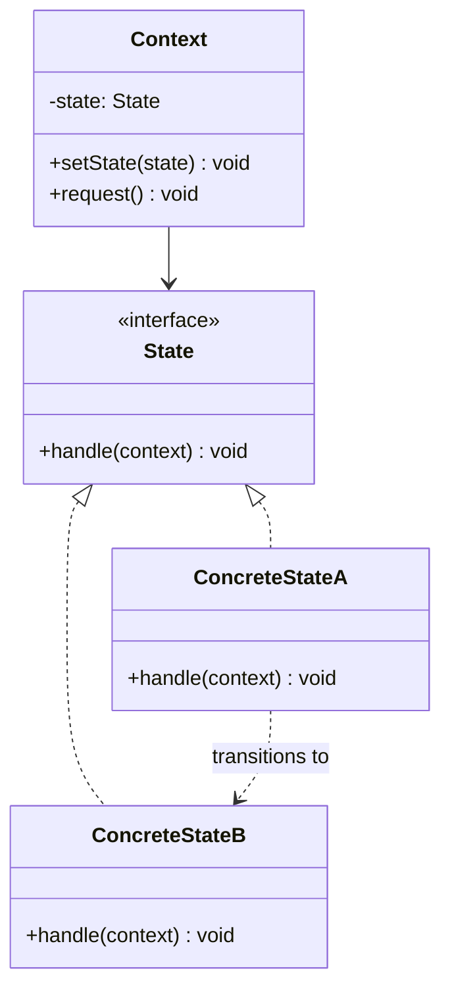
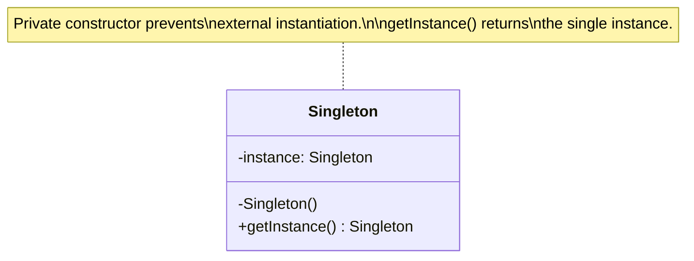
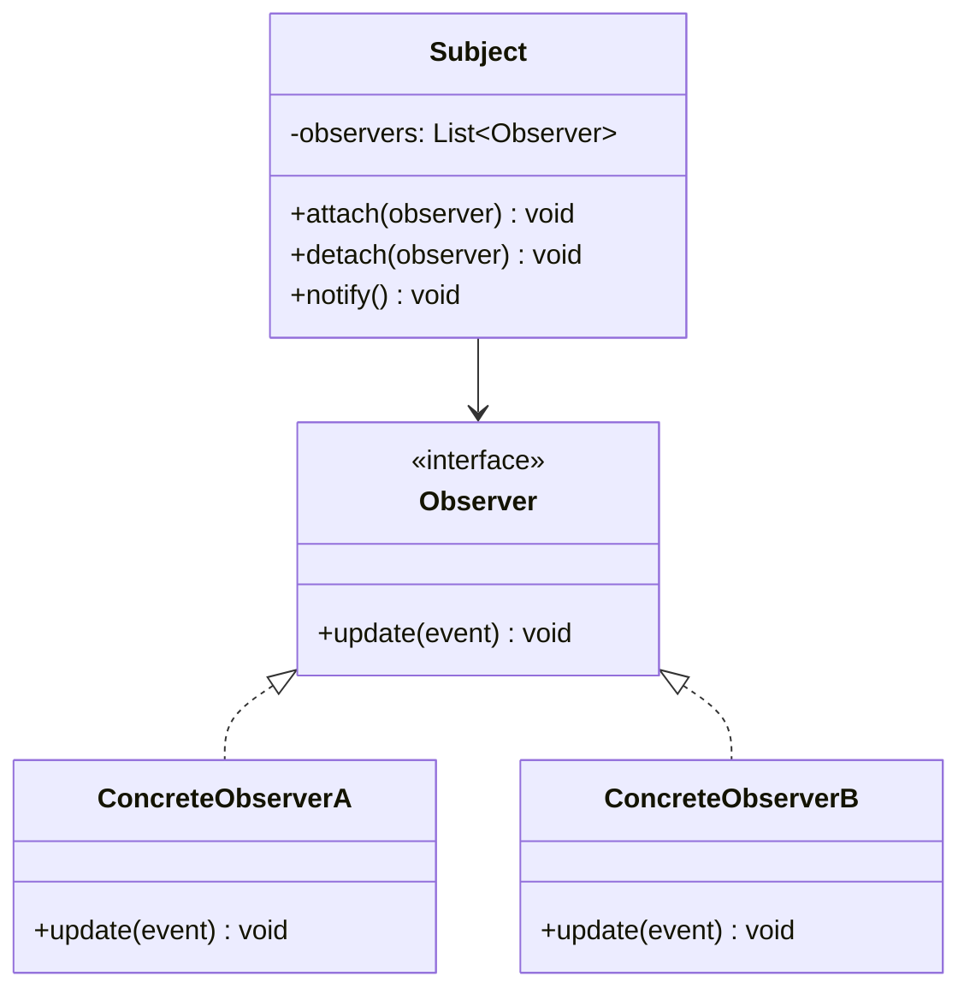
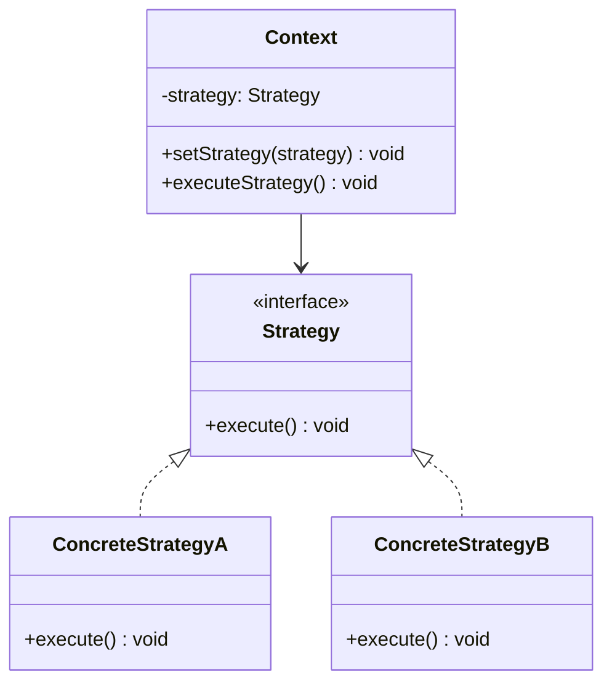
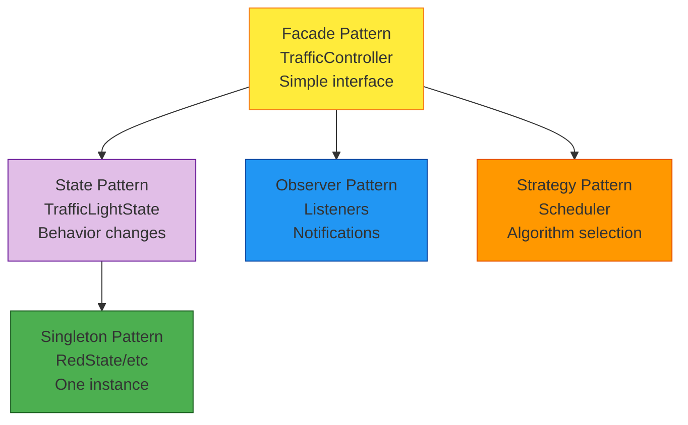

# Design Patterns - Complete Catalog

> **For Beginners**: Design Patterns are proven solutions to common problems. Think of them as "recipes" for solving design challenges. Just like cooking recipes, you don't invent them from scratch - you use tried-and-tested solutions!

---

## 🎯 PATTERNS USED IN OUR SYSTEM

We use **6 design patterns** in the Traffic Signal System:

| Pattern | Category | Purpose | Where Used |
|---------|----------|---------|------------|
| **State** | Behavioral | Manage object behavior based on state | TrafficLightState |
| **Singleton** | Creational | Ensure only one instance exists | RedState, YellowState, GreenState |
| **Observer** | Behavioral | Notify multiple objects of changes | StateChangeListener |
| **Strategy** | Behavioral | Encapsulate algorithms | RoundRobinScheduler |
| **Template Method** | Behavioral | Define algorithm skeleton | StateChangeListener |
| **Facade** | Structural | Simplified interface to complex system | TrafficController |

---

## 📊 Pattern 1: State Pattern ⭐⭐⭐

> **"Allow an object to alter its behavior when its internal state changes."**

### Problem:
Traffic signal behaves differently based on state (RED/YELLOW/GREEN). Without pattern, we'd have messy if-else or switch-case statements.

### Solution Structure:



### Our Implementation:

```java
// Context: TrafficSignal
public class TrafficSignal {
    private TrafficLightState currentState; // State object

    public void setState(TrafficLightState newState) {
        this.currentState = newState;
        currentState.handleState(this); // Delegate to state
    }

    public void transitionToNextState() {
        TrafficLightState nextState = currentState.getNextState();
        setState(nextState);
    }
}

// State Interface
public interface TrafficLightState {
    void handleState(TrafficSignal signal);
    TrafficLightState getNextState();
    String getStateName();
}

// Concrete State
public class RedState implements TrafficLightState {
    private static final RedState INSTANCE = new RedState();

    public static RedState getInstance() {
        return INSTANCE;
    }

    @Override
    public void handleState(TrafficSignal signal) {
        System.out.println("RED: STOP!");
        // Turn on red LED, activate stop sensors, etc.
    }

    @Override
    public TrafficLightState getNextState() {
        return GreenState.getInstance(); // RED → GREEN
    }

    @Override
    public String getStateName() {
        return "RED";
    }
}
```

### Benefits:
- ✅ **Open/Closed Principle**: Add new states without modifying existing code
- ✅ **Single Responsibility**: Each state class handles its own behavior
- ✅ **Eliminates conditionals**: No switch-case needed
- ✅ **Easy to extend**: Add FlashingYellowState without touching RedState

### When to Use:
- Object behavior depends on its state
- Large conditional statements based on state
- State-specific behavior

---

## 📊 Pattern 2: Singleton Pattern ⭐⭐

> **"Ensure a class has only one instance and provide global access to it."**

### Problem:
All RED signals behave identically. No need for multiple RedState objects - waste of memory!

### Solution Structure:



### Our Implementation:

```java
public class RedState implements TrafficLightState {

    // Step 1: Create the single instance (eager initialization)
    private static final RedState INSTANCE = new RedState();

    // Step 2: Private constructor (prevents external instantiation)
    private RedState() {
        // Only called once during class loading
    }

    // Step 3: Public method to get the instance
    public static RedState getInstance() {
        return INSTANCE;
    }

    // ... state methods
}

// Usage:
RedState red1 = RedState.getInstance();
RedState red2 = RedState.getInstance();
assert red1 == red2; // ✅ Same instance!

// Can't do this:
// RedState red = new RedState(); // ❌ Compile error! Constructor is private
```

### Thread-Safe Variations:

```java
// Variation 1: Eager initialization (thread-safe, simple)
public class RedState {
    private static final RedState INSTANCE = new RedState(); // Created at class load
    public static RedState getInstance() { return INSTANCE; }
}

// Variation 2: Lazy initialization (thread-safe, complex)
public class RedState {
    private static volatile RedState instance;

    public static RedState getInstance() {
        if (instance == null) { // First check (no locking)
            synchronized (RedState.class) { // Lock only if null
                if (instance == null) { // Second check (with lock)
                    instance = new RedState();
                }
            }
        }
        return instance;
    }
}

// Variation 3: Enum singleton (best for Java!)
public enum RedState {
    INSTANCE;

    public void handleState(TrafficSignal signal) { /*...*/ }
}
// Usage: RedState.INSTANCE.handleState(signal);
```

### Benefits:
- ✅ **Memory efficient**: Only one instance
- ✅ **Global access**: Available everywhere
- ✅ **Lazy initialization** (optional): Created only when needed

### When to Use:
- Only one instance should exist
- Instance should be globally accessible
- Examples: Configuration, Logger, State objects

---

## 📊 Pattern 3: Observer Pattern ⭐⭐⭐

> **"Define a one-to-many dependency between objects so that when one changes state, all dependents are notified."**

### Problem:
When a signal changes state, multiple components need to react (logging, safety checks, UI updates). Don't want to hard-code all reactions in TrafficSignal!

### Solution Structure:



### Our Implementation:

```java
// Subject: TrafficSignal
public class TrafficSignal {
    private List<StateChangeListener> listeners = new CopyOnWriteArrayList<>();

    // Attach observer
    public void addListener(StateChangeListener listener) {
        listeners.add(listener);
    }

    // Detach observer
    public void removeListener(StateChangeListener listener) {
        listeners.remove(listener);
    }

    // Notify all observers
    private void notifyListeners(StateChangeEvent event) {
        for (StateChangeListener listener : listeners) {
            listener.onStateChange(event);
        }
    }

    // When state changes, notify observers
    public void setState(TrafficLightState newState, String reason, boolean isAuto) {
        StateChangeEvent event = new StateChangeEvent(this, currentState, newState, reason, isAuto);

        // Notify before change
        for (StateChangeListener listener : listeners) {
            listener.onStateChangeStart(event);
        }

        // Change state
        this.currentState = newState;

        // Notify after change
        for (StateChangeListener listener : listeners) {
            listener.onStateChangeComplete(event);
        }
    }
}

// Observer Interface
public interface StateChangeListener {
    void onStateChangeStart(StateChangeEvent event);
    void onStateChangeComplete(StateChangeEvent event);
}

// Concrete Observer 1: Logging
public class LoggingStateListener implements StateChangeListener {
    @Override
    public void onStateChangeStart(StateChangeEvent event) {
        System.out.println("🔄 State changing: " + event.getDescription());
    }

    @Override
    public void onStateChangeComplete(StateChangeEvent event) {
        System.out.println("✅ State changed: " + event.getDescription());
    }
}

// Concrete Observer 2: Safety
public class SafetyCheckListener implements StateChangeListener {
    @Override
    public void onStateChangeStart(StateChangeEvent event) {
        // Validate transition is safe
        if (event.getFromState().getStateName().equals("GREEN") &&
            event.getToState().getStateName().equals("RED")) {
            throw new IllegalStateException("Cannot skip YELLOW!");
        }
    }

    @Override
    public void onStateChangeComplete(StateChangeEvent event) {
        // Log successful safety check
    }
}

// Usage:
TrafficSignal signal = new TrafficSignal(Direction.NORTH, config);
signal.addListener(new LoggingStateListener());
signal.addListener(new SafetyCheckListener());
signal.setState(GreenState.getInstance()); // Both listeners notified!
```

### Benefits:
- ✅ **Loose coupling**: Subject doesn't know concrete observers
- ✅ **Dynamic relationships**: Add/remove observers at runtime
- ✅ **Broadcast communication**: One event → many receivers

### When to Use:
- One object changes and others need to react
- Don't want tight coupling between objects
- Examples: Event systems, UI updates, logging

---

## 📊 Pattern 4: Strategy Pattern ⭐⭐

> **"Define a family of algorithms, encapsulate each one, and make them interchangeable."**

### Problem:
Need to cycle through directions. Algorithm might change (round-robin vs priority-based vs time-based).

### Solution Structure:



### Our Implementation:

```java
// Strategy Interface (implicit)
public interface DirectionScheduler {
    Direction getNext();
    Direction getCurrent();
}

// Concrete Strategy 1: Round-Robin
public class RoundRobinScheduler implements DirectionScheduler {
    private List<Direction> directions;
    private int currentIndex;

    @Override
    public Direction getNext() {
        currentIndex = (currentIndex + 1) % directions.size();
        return directions.get(currentIndex);
    }

    @Override
    public Direction getCurrent() {
        return directions.get(currentIndex);
    }
}

// Concrete Strategy 2: Priority-Based (future)
public class PriorityScheduler implements DirectionScheduler {
    private Map<Direction, Integer> priorities;

    @Override
    public Direction getNext() {
        // Return direction with highest priority traffic
        return findHighestPriorityDirection();
    }
}

// Context: TrafficController
public class TrafficController {
    private DirectionScheduler scheduler;

    public TrafficController() {
        // Can swap strategies!
        this.scheduler = new RoundRobinScheduler(); // Default
    }

    public void setScheduler(DirectionScheduler scheduler) {
        this.scheduler = scheduler; // Change strategy at runtime!
    }

    private void cycleToNextDirection() {
        Direction nextDir = scheduler.getNext(); // Use strategy
        // ... set signal
    }
}
```

### Benefits:
- ✅ **Interchangeable algorithms**: Swap scheduling strategies
- ✅ **Open/Closed Principle**: Add new strategies without modifying controller
- ✅ **Eliminates conditionals**: No if-else for different algorithms

### When to Use:
- Multiple algorithms for same task
- Want to switch algorithms at runtime
- Examples: Sorting, routing, scheduling

---

## 📊 Pattern 5: Template Method Pattern ⭐

> **"Define the skeleton of an algorithm, letting subclasses override specific steps."**

### Our Implementation:

```java
// Template in interface with default methods
public interface StateChangeListener {

    // Template method (defines algorithm skeleton)
    default void onStateChange(StateChangeEvent event) {
        // Step 1: Pre-processing
        beforeUpdate(event);

        // Step 2: Main update (subclass must implement)
        doUpdate(event);

        // Step 3: Post-processing
        afterUpdate(event);
    }

    // Hook methods (can be overridden)
    default void beforeUpdate(StateChangeEvent event) {
        // Default: do nothing
    }

    default void afterUpdate(StateChangeEvent event) {
        // Default: do nothing
    }

    // Abstract method (must be implemented)
    void doUpdate(StateChangeEvent event);
}

// Concrete implementation
public class CustomListener implements StateChangeListener {
    @Override
    public void doUpdate(StateChangeEvent event) {
        System.out.println("Main update: " + event);
    }

    @Override
    public void beforeUpdate(StateChangeEvent event) {
        System.out.println("Before: Prepare resources");
    }

    @Override
    public void afterUpdate(StateChangeEvent event) {
        System.out.println("After: Cleanup resources");
    }
}
```

### Benefits:
- ✅ **Code reuse**: Common steps defined once
- ✅ **Control**: Parent defines algorithm flow
- ✅ **Flexibility**: Subclasses customize specific steps

---

## 📊 Pattern 6: Facade Pattern ⭐

> **"Provide a unified interface to a set of interfaces in a subsystem."**

### Problem:
Using the traffic system is complex (create signals, start timer, manage states). Need simple interface!

### Our Implementation:

```java
// Facade: TrafficController
public class TrafficController {

    // Simplifies complex subsystem
    public void start() {
        // Hides complexity:
        // 1. Initialize all signals
        initializeSignals();
        // 2. Set all to RED
        setAllSignalsToRed();
        // 3. Set first to GREEN
        signals.get(currentDirection).setState(GreenState.getInstance());
        // 4. Start timer
        timer.start();
        // 5. Set flags
        isRunning = true;
    }

    // Simple interface for complex operation
    public void stop() {
        timer.stop();
        setAllSignalsToRed();
        isRunning = false;
    }

    // Simple interface for override
    public void manualOverride(Direction direction, String reason) {
        // Hides complexity of state transitions
        // ...
    }
}

// Client code (simple!)
TrafficController controller = new TrafficController();
controller.start(); // ✅ One line!
// vs. without facade:
// SignalTimer timer = new SignalTimer(...);
// TrafficSignal north = new TrafficSignal(...);
// TrafficSignal south = new TrafficSignal(...);
// ... many lines of setup code
```

### Benefits:
- ✅ **Simplified interface**: Hide complexity
- ✅ **Decoupling**: Clients don't depend on subsystem details
- ✅ **Ease of use**: One call does everything

---

## 📊 Pattern Combinations

Our system combines patterns effectively:



---

## 🎯 Pattern Selection Guide

| When You Need... | Use Pattern... | Example |
|------------------|----------------|---------|
| Behavior depends on state | State | Traffic light states |
| Only one instance | Singleton | State objects |
| Many objects need updates | Observer | Logging, safety checks |
| Interchangeable algorithms | Strategy | Scheduling algorithms |
| Simplified interface | Facade | Controller start/stop |
| Algorithm skeleton | Template Method | Listener processing |

---

## 🎯 Key Takeaways

1. **Design patterns** = Proven solutions to common problems
2. **State Pattern** = Perfect for state-dependent behavior
3. **Singleton** = One instance, global access
4. **Observer** = One-to-many notification
5. **Strategy** = Interchangeable algorithms
6. **Facade** = Simplified interface
7. **Combine patterns** = Solve complex problems

---

**Remember**: Don't force patterns - use them when they naturally solve your problem!
