# UML Relationships with Java Examples

> **For Beginners**: Relationships show HOW classes connect to each other. Think of them like relationships between people - friends, family, coworkers - each type has different rules and levels of closeness!

---

## 🎯 ALL UML RELATIONSHIPS

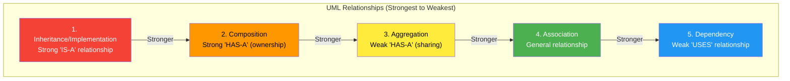

---

## 📊 1. Inheritance / Implementation

### Symbol: `<|--` (solid) or `<|..` (dashed)

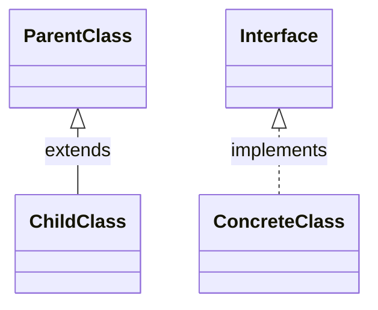

### Meaning:
- **"IS-A" relationship**
- Child inherits everything from parent
- Strongest relationship (tightest coupling)

### Java Examples:

#### Inheritance (Class extends Class)

```java
// ❌ NOT USED in our system (prefer composition over inheritance)

// Example if we had used it:
public abstract class TrafficControlDevice {
    protected String location;

    public abstract void activate();
    public abstract void deactivate();
}

public class TrafficSignal extends TrafficControlDevice {
    @Override
    public void activate() {
        System.out.println("Traffic signal activated");
    }

    @Override
    public void deactivate() {
        System.out.println("Traffic signal deactivated");
    }
}

// TrafficSignal IS-A TrafficControlDevice ✅
```

#### Implementation (Class implements Interface)

```java
// ✅ USED extensively in our system

// Interface defines contract
public interface TrafficLightState {
    void handleState(TrafficSignal signal);
    TrafficLightState getNextState();
    String getStateName();
}

// Concrete class implements contract
public class RedState implements TrafficLightState {
    @Override
    public void handleState(TrafficSignal signal) {
        System.out.println("RED: STOP!");
    }

    @Override
    public TrafficLightState getNextState() {
        return GreenState.getInstance();
    }

    @Override
    public String getStateName() {
        return "RED";
    }
}

// RedState IS-A TrafficLightState ✅
```

**When to Use**:
- Interface implementation: Always good (loose coupling)
- Class inheritance: Be careful (tight coupling, prefer composition)

---

## 📊 2. Composition (Strong Ownership)

### Symbol: `*--` (filled diamond)

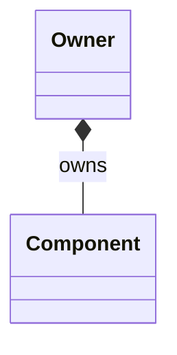

### Meaning:
- **"HAS-A" with ownership**
- Owner creates and destroys component
- Component **cannot exist** without owner
- Component is **part of** owner

### Real-World Analogy:
- **Heart** is part of **Human** (composition)
- If human dies, heart goes with it
- Heart cannot exist independently

### Java Example:

```java
// ✅ USED in our system

public class TrafficController {
    // Composition: Controller OWNS the signals
    private Map<Direction, TrafficSignal> signals;

    public TrafficController() {
        this.signals = new HashMap<>();

        // Controller CREATES the signals (ownership!)
        for (Direction dir : Direction.values()) {
            TrafficSignal signal = new TrafficSignal(dir, config);
            signals.put(dir, signal); // Controller owns signal
        }
    }

    // When controller is destroyed, signals are destroyed too
    // Signals cannot exist without controller
}

// Another example: Controller owns Timer
public class TrafficController {
    private SignalTimer timer; // Owned by controller

    public TrafficController() {
        this.timer = new SignalTimer(this); // Created by controller
    }

    public void stop() {
        timer.stop(); // Controller controls timer's lifecycle
    }
}
```

**UML Diagram**:
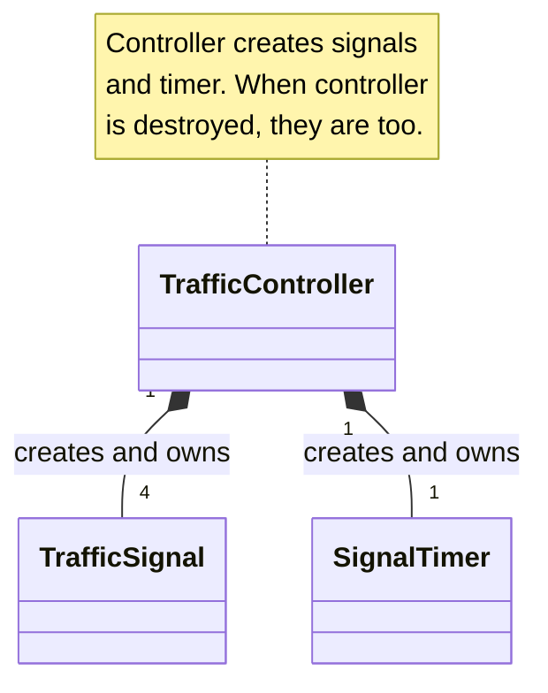

**Code Characteristics**:
- ✅ Owner creates component (`new`)
- ✅ Owner holds reference
- ✅ Owner controls lifecycle
- ✅ Component is `private`
- ✅ Component dies with owner

---

## 📊 3. Aggregation (Weak Ownership)

### Symbol: `o--` (hollow diamond)

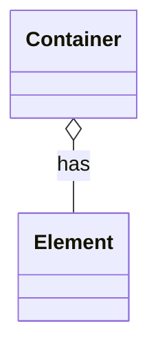

### Meaning:
- **"HAS-A" without ownership**
- Container uses element, but doesn't create it
- Element **can exist** independently
- Element can be **shared** by multiple containers

### Real-World Analogy:
- **Library** has **Books** (aggregation)
- Books can exist without library
- Books can move to another library
- Library doesn't create books

### Java Example:

```java
// ✅ USED in our system

public class TrafficSignal {
    // Aggregation: Signal USES state, but doesn't own it
    private TrafficLightState currentState;

    public void setState(TrafficLightState newState) {
        // State is passed in from outside (not created here!)
        this.currentState = newState;
    }
}

// States exist independently (Singletons!)
TrafficLightState red = RedState.getInstance();

// Multiple signals can share the same state instance
signal1.setState(red);
signal2.setState(red); // Same instance!

// State exists even if signals are destroyed
```

**UML Diagram**:
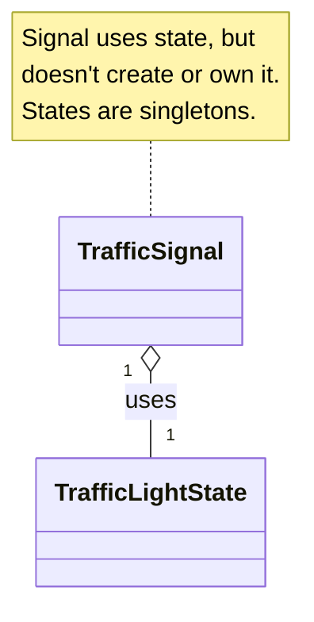

**Code Characteristics**:
- ✅ Container receives element (passed in)
- ✅ Container doesn't create element
- ✅ Element can be shared
- ✅ Element exists independently

---

## 📊 4. Association (General Relationship)

### Symbol: `--` (solid line)

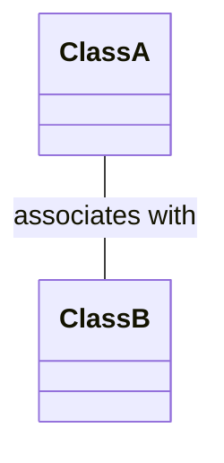

### Meaning:
- General "knows about" relationship
- Can be unidirectional or bidirectional
- Neutral - no ownership implied

### Java Example:

```java
// General relationship (not strongly used in our system)

public class TrafficIntersection {
    private List<TrafficSignal> signals; // Intersection knows about signals
}

public class TrafficSignal {
    private Direction direction; // Signal knows about direction
}
```

**When to Use**:
- When relationship doesn't fit composition or aggregation
- Neutral "knows about" relationship

---

## 📊 5. Dependency (Uses)

### Symbol: `-->` (solid arrow) or `..>` (dashed arrow)

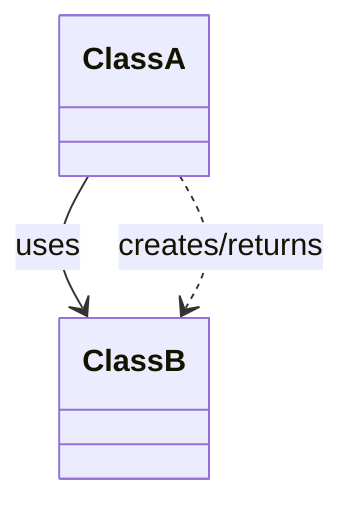

### Meaning:
- **"USES" relationship**
- Weakest relationship
- Class A depends on Class B to function
- Often temporary (method parameter, local variable, return type)

### Real-World Analogy:
- **Chef** uses **Recipe** (dependency)
- Chef doesn't own recipe
- Chef just follows it temporarily

### Java Examples:

#### Type 1: Method Parameter

```java
// ✅ USED in our system

public class TrafficSignal {
    private TrafficLightState currentState;
    private SignalConfig config; // Dependency!

    // Config is passed in (dependency)
    public TrafficSignal(Direction direction, SignalConfig config) {
        this.config = config; // Signal USES config
    }

    public void resetTime() {
        // Signal depends on config to get duration
        this.timeRemaining = config.getDuration(currentState);
    }
}
```

#### Type 2: Local Variable

```java
public class TrafficController {
    public void tick() {
        // Direction is used locally (dependency)
        Direction current = scheduler.getCurrent();
        TrafficSignal signal = signals.get(current);
        // ...
    }
}
```

#### Type 3: Return Type

```java
public class RedState {
    // Returns GreenState (dependency)
    public TrafficLightState getNextState() {
        return GreenState.getInstance(); // Depends on GreenState
    }
}
```

#### Type 4: Creates Instance

```java
public class TrafficSignal {
    // Creates StateChangeEvent (dependency)
    private void notifyListeners() {
        StateChangeEvent event = new StateChangeEvent(...); // Creates event
        // ...
    }
}
```

**UML Diagram**:
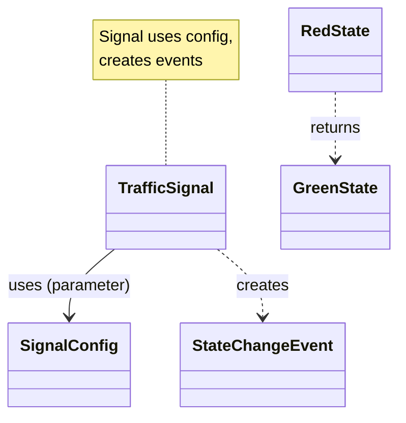

**Code Characteristics**:
- ✅ Used as method parameter
- ✅ Created locally
- ✅ Returned from method
- ✅ Imported in file
- ✅ Weak coupling

---

## 📊 Complete Relationship Comparison

| Relationship | Symbol | Coupling | Lifetime | Example | Code Pattern |
|--------------|--------|----------|----------|---------|--------------|
| **Inheritance** | `<\|--` | Strongest | N/A | IS-A | `class A extends B` |
| **Implementation** | `<\|..` | Strong | N/A | IS-A | `class A implements I` |
| **Composition** | `*--` | Strong | Same as owner | Part-of | `new B()` in constructor |
| **Aggregation** | `o--` | Medium | Independent | Has-a | Passed as parameter |
| **Association** | `--` | Medium | Independent | Knows-about | Stored reference |
| **Dependency** | `-->` or `..>` | Weak | Temporary | Uses | Method param, local var |

---

## 📊 Decision Tree: Which Relationship?

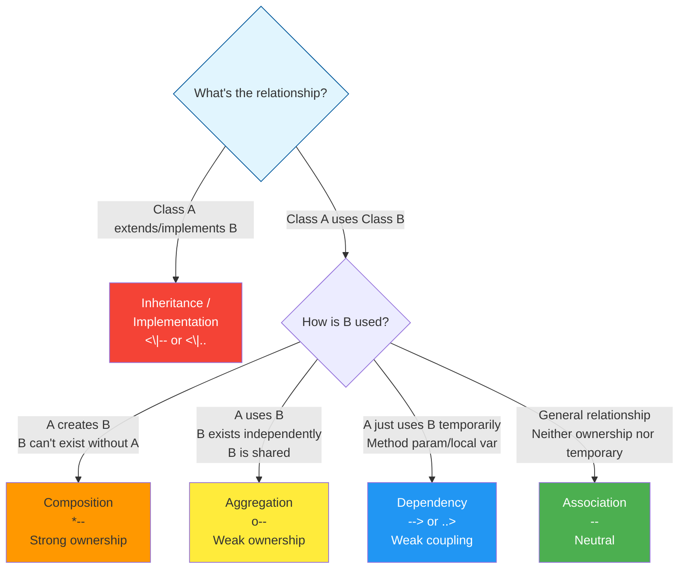

---

## 📊 Traffic Signal System - Complete Relationships

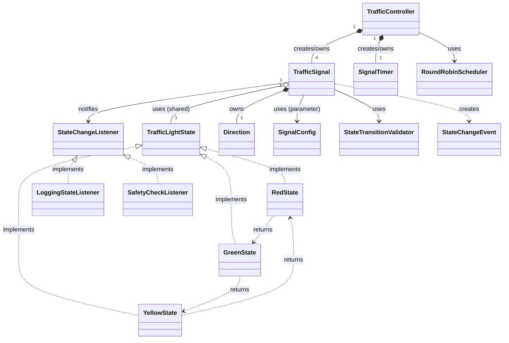

---

## 🎯 Common Mistakes

### Mistake 1: Confusing Composition and Aggregation

```java
// ❌ MISTAKE: Treating composition like aggregation
public class TrafficController {
    private TrafficSignal signal;

    public TrafficController(TrafficSignal signal) {
        this.signal = signal; // ❌ This is aggregation, not composition!
    }
}

// ✅ CORRECT: Composition
public class TrafficController {
    private TrafficSignal signal;

    public TrafficController() {
        this.signal = new TrafficSignal(...); // ✅ Controller creates signal
    }
}
```

### Mistake 2: Using Inheritance Instead of Composition

```java
// ❌ BAD: Unnecessary inheritance
public class TrafficSignal extends SignalConfig {
    // Signal IS-A Config? No! Signal HAS-A Config!
}

// ✅ GOOD: Use composition
public class TrafficSignal {
    private SignalConfig config; // HAS-A relationship ✅
}
```

### Mistake 3: Wrong Arrow Direction

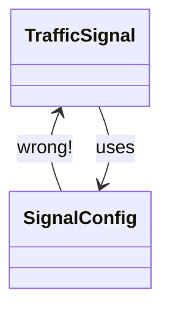

---

## 🎯 Key Takeaways

1. **Inheritance** (`<|--`) = IS-A (use sparingly)
2. **Implementation** (`<|..`) = IS-A (use interfaces!)
3. **Composition** (`*--`) = Strong HAS-A (owner creates)
4. **Aggregation** (`o--`) = Weak HAS-A (shared)
5. **Association** (`--`) = Knows-about
6. **Dependency** (`-->`) = Uses (weakest)

---

## 🎯 Quick Reference

| If... | Use... |
|-------|--------|
| A is a type of B | Inheritance/Implementation |
| A creates B, B dies with A | Composition |
| A uses B, B is shared | Aggregation |
| A uses B temporarily | Dependency |
| General relationship | Association |

---

**Remember**: Choose the weakest relationship that works. Loose coupling = better design!
