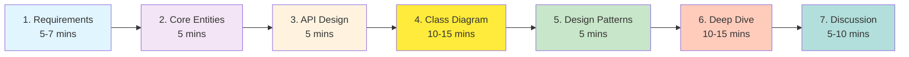

# Whiteboard Interview Checklist

> **For Beginners**: When solving LLD on a whiteboard, follow this step-by-step process. Think of it as a recipe - follow the steps in order for best results!

---

## 🎯 THE 7-STEP PROCESS



**Total Time**: 45-60 minutes

---

## ✅ STEP 1: Clarify Requirements (5-7 minutes)

### What to Ask:

**Functional Requirements:**
- [ ] "How many directions? Four (N, S, E, W) or more?"
- [ ] "What are the signal states? RED, YELLOW, GREEN only?"
- [ ] "Should signals cycle automatically or manually?"
- [ ] "Do we need manual override capability?"
- [ ] "Any special states like FLASHING_YELLOW?"

**Non-Functional Requirements:**
- [ ] "How many intersections? One or multiple?"
- [ ] "Is thread safety important?"
- [ ] "Should it work offline or need network?"
- [ ] "Performance requirements? (queries/second)"
- [ ] "Is this for embedded device or server?"

**Constraints:**
- [ ] "Any specific technology? (Java, Python, C++?)"
- [ ] "Memory constraints?"
- [ ] "Can I use external libraries?"

### Write Down on Whiteboard:

```
=== REQUIREMENTS ===
Functional:
- 4 directions: NORTH, SOUTH, EAST, WEST
- 3 states per signal: RED, YELLOW, GREEN
- Automatic cycling (round-robin)
- Manual override capability
- Only ONE green at a time (safety!)

Non-Functional:
- Thread-safe (timer + manual override)
- Single intersection focus
- Must run on embedded device
- <100ms response time for queries

Out of Scope:
- Pedestrian signals
- Multiple intersections
- Dynamic timing based on traffic
```

**Time Checkpoint**: 5-7 minutes elapsed

---

## ✅ STEP 2: Identify Core Entities (5 minutes)

### What to Do:

1. **Identify Nouns** from requirements
2. **Draw boxes** for main entities
3. **One sentence** describing each

### Write on Whiteboard:

```
=== CORE ENTITIES ===

1. TrafficSignal
   "Represents a signal for one direction (NORTH/SOUTH/etc)"
   - Has direction
   - Has current state
   - Has time remaining

2. SignalState
   "Enum for RED, YELLOW, GREEN"

3. Direction
   "Enum for NORTH, SOUTH, EAST, WEST"

4. TrafficController
   "Manages all 4 signals, coordinates cycling"

5. SignalTimer
   "Background thread for automatic cycling"
```

### Quick Sketch:

```
┌──────────────────┐
│ TrafficController│  ← Coordinates everything
└────────┬─────────┘
         │ manages
         ↓
┌────────────────┐
│ TrafficSignal  │  ← One per direction
│ - direction    │
│ - currentState │
│ - timeRemaining│
└────────────────┘
```

**Time Checkpoint**: 10-12 minutes elapsed

---

## ✅ STEP 3: Define Key APIs (5 minutes)

### What to Do:

1. **List 5-10 key methods**
2. **Include return types**
3. **Show purpose**

### Write on Whiteboard:

```
=== KEY APIs ===

TrafficController:
  + start() void
    → Start automatic cycling

  + stop() void
    → Stop system (all RED)

  + manualOverride(Direction dir, String reason) void
    → Force direction to GREEN (emergency)

  + getSignalStatus(Direction dir) String
    → Query current state

TrafficSignal:
  + setState(SignalState state) void
    → Change signal state

  + transitionToNextState() void
    → Move to next state (GREEN→YELLOW→RED)

  + getTimeRemaining() int
    → Seconds left in current state

  + canCross() boolean
    → Is it safe to cross?
```

**Time Checkpoint**: 15-17 minutes elapsed

---

## ✅ STEP 4: Draw Class Diagram (10-15 minutes)

### What to Draw:

**Start Simple, Add Details:**

#### Round 1: Basic Structure (3 mins)

```
┌────────────────────────┐
│   TrafficController    │
└────────────────────────┘
             │
             │ has
             ↓
┌────────────────────────┐
│    TrafficSignal       │
└────────────────────────┘
             │
             │ uses
             ↓
┌────────────────────────┐
│  SignalState (enum)    │
│  - RED                 │
│  - YELLOW              │
│  - GREEN               │
└────────────────────────┘
```

#### Round 2: Add Key Fields (5 mins)

```
┌─────────────────────────────────┐
│     TrafficController           │
│─────────────────────────────────│
│ - signals: Map<Dir, Signal>     │
│ - currentDirection: Direction   │
│ - timer: SignalTimer            │
│─────────────────────────────────│
│ + start() void                  │
│ + stop() void                   │
│ + manualOverride(Dir, String)   │
│ + tick() void                   │
└─────────────────────────────────┘
              │
              ↓
┌─────────────────────────────────┐
│      TrafficSignal              │
│─────────────────────────────────│
│ - direction: Direction          │
│ - currentState: SignalState     │
│ - timeRemaining: int            │
│─────────────────────────────────│
│ + setState(state) void          │
│ + transitionToNextState() void  │
│ + decrementTime() boolean       │
└─────────────────────────────────┘
```

#### Round 3: Add Relationships (3 mins)

```
Controller *--→ Signal (composition)
Controller o--→ Timer (composition)
Signal    -->  SignalState (uses)
Signal    -->  Direction (has)
```

### Draw These Arrows:

```
*--  = Composition (strong ownership)
o--  = Aggregation (weak ownership)
-->  = Dependency (uses)
<|-- = Inheritance
<|.. = Implementation
```

**Time Checkpoint**: 27-32 minutes elapsed

---

## ✅ STEP 5: Mention Design Patterns (5 minutes)

### What to Say:

**Point to parts of diagram and explain:**

```
Interviewer: "What design patterns are you using?"

You: "I'm using three main patterns:

1. STATE PATTERN (point to SignalState)
   - Each state (RED/YELLOW/GREEN) is a separate class
   - Eliminates switch-case statements
   - Easy to add new states without modifying existing code

2. SINGLETON PATTERN (point to state classes)
   - Only one instance of each state needed
   - Memory efficient
   - All signals share same state instances

3. OBSERVER PATTERN (add to diagram)
   - When signal state changes, notify listeners
   - Logging, safety checks, UI updates
   - Loose coupling between signal and observers"

*Draw quick Observer sketch*:

┌────────────┐      ┌─────────────────┐
│   Signal   │─────→│ StateListener   │
└────────────┘      │   <<interface>> │
   (Subject)        └─────────────────┘
                            △
                            │
                     ┌──────┴──────┐
                     │             │
              ┌──────┴──┐    ┌────┴──────┐
              │ Logger  │    │  Safety   │
              └─────────┘    └───────────┘
```

**Time Checkpoint**: 32-37 minutes elapsed

---

## ✅ STEP 6: Deep Dive (10-15 minutes)

### Interviewer Will Pick ONE Topic:

**Option A: State Transitions**

```java
// Write on whiteboard:

public void transitionToNextState() {
    // Get next state from current state
    TrafficLightState nextState = currentState.getNextState();

    // Validate transition
    if (!validator.isValidTransition(currentState, nextState)) {
        throw new IllegalStateException("Invalid transition!");
    }

    // Notify listeners BEFORE
    notifyListeners(BEFORE_CHANGE);

    // Change state
    this.currentState = nextState;
    this.timeRemaining = nextState.getDuration();

    // Notify listeners AFTER
    notifyListeners(AFTER_CHANGE);

    // Log
    logger.info("Transitioned to " + nextState.getStateName());
}

// Explain:
// 1. State knows its next state (GREEN→YELLOW→RED→GREEN)
// 2. Always validate (safety!)
// 3. Observer pattern for notifications
// 4. Atomic operation (all or nothing)
```

**Option B: Thread Safety**

```java
// Write on whiteboard:

public void tick() {
    lock.lock();  // 🔒 Acquire lock
    try {
        // Critical section
        TrafficSignal active = signals.get(currentDirection);
        boolean expired = active.decrementTime();

        if (expired) {
            handleStateTransition();
        }

    } finally {
        lock.unlock();  // 🔓 ALWAYS release!
    }
}

// Explain:
// 1. ReentrantLock for mutual exclusion
// 2. Fair lock (FIFO) prevents starvation
// 3. try-finally ensures unlock even if exception
// 4. Prevents race conditions between timer and override
```

**Option C: Manual Override**

```java
// Write on whiteboard:

public void manualOverride(Direction target, String reason) {
    lock.lock();
    try {
        // Safety: Complete current YELLOW transition
        if (currentSignal.isYellow()) {
            waitForYellowComplete();
        }

        // Transition current to RED
        currentSignal.setState(RED);

        // Set target to GREEN
        TrafficSignal targetSignal = signals.get(target);
        targetSignal.setState(GREEN);

        // Update current direction
        currentDirection = target;

        // Log override
        logger.warn("OVERRIDE: " + target + " - " + reason);

    } finally {
        lock.unlock();
    }
}

// Explain:
// 1. Thread-safe (uses lock)
// 2. Safety first (never skip YELLOW)
// 3. Logs for audit trail
// 4. Resumes normal cycling after
```

**Time Checkpoint**: 42-52 minutes elapsed

---

## ✅ STEP 7: Discussion & Trade-offs (5-10 minutes)

### Common Questions:

**Q: "How would you scale this to 1000 intersections?"**

```
A: "Great question! I'd use a distributed architecture:

1. Each intersection runs independently (edge computing)
   - No single point of failure
   - Works offline

2. Central monitoring system (optional)
   - Aggregates status via MQTT/HTTP
   - Dashboard for city-wide view

3. Load balancer + API servers
   - Horizontal scaling
   - Handle queries/commands

4. Database with read replicas
   - Master for writes
   - Replicas for reads

Diagram:
┌──────────┐   ┌──────────┐   ┌──────────┐
│Intersect1│   │Intersect2│...│IntersectN│
└─────┬────┘   └────┬─────┘   └────┬─────┘
      │             │              │
      └─────────────┴──────────────┘
                    │
              [Load Balancer]
                    │
         ┌──────────┴──────────┐
         │                     │
    [API Server]         [API Server]
         │                     │
         └──────────┬──────────┘
                    │
              [Database]
```

**Q: "What are the trade-offs of your design?"**

```
A: "Let me discuss pros and cons:

PROS:
✅ State Pattern makes adding new states easy
✅ Observer pattern decouples components
✅ Thread-safe with ReentrantLock
✅ Each intersection independent

CONS:
❌ Synchronous design (blocking calls)
   → Could use CompletableFuture for async
❌ No persistence (state lost on restart)
   → Could add database or file persistence
❌ Simple round-robin (no traffic awareness)
   → Could add sensors and dynamic timing

For the given requirements, I prioritized:
- Simplicity (easy to understand/maintain)
- Safety (thread-safe, validated transitions)
- Extensibility (easy to add features)

Trade-offs are appropriate for current scope!"
```

**Time Checkpoint**: 47-60 minutes elapsed

---

## 🎯 WHITEBOARD COMMUNICATION TIPS

### DO's:

- ✅ **Think out loud** - Explain as you draw
- ✅ **Ask questions** - "Should I detail this part?"
- ✅ **Use clean boxes** - Keep diagrams neat
- ✅ **Label everything** - Don't assume interviewer knows
- ✅ **Check for understanding** - "Does this make sense?"
- ✅ **Start simple** - Add complexity gradually
- ✅ **Use examples** - "For instance, when NORTH is GREEN..."
- ✅ **Acknowledge trade-offs** - "I chose X over Y because..."

### DON'Ts:

- ❌ **Silent coding** - Don't draw for 10 mins without talking
- ❌ **Sloppy diagrams** - Hard to read = hard to evaluate
- ❌ **Jumping ahead** - Don't skip to implementation
- ❌ **Ignoring feedback** - Listen to interviewer hints
- ❌ **Being defensive** - Accept criticism gracefully
- ❌ **Overcomplicating** - KISS (Keep It Simple, Stupid)

---

## 🎯 QUICK REFERENCE SHEET

### Time Budget:

| Phase | Time | What to Do |
|-------|------|------------|
| Requirements | 5-7 min | Ask questions, write down |
| Core Entities | 5 min | List main classes |
| API Design | 5 min | Key methods |
| Class Diagram | 10-15 min | Draw structure |
| Design Patterns | 5 min | Explain patterns |
| Deep Dive | 10-15 min | Code one component |
| Discussion | 5-10 min | Trade-offs, scaling |

### Essential Elements to Cover:

- [ ] All requirements clarified
- [ ] Core entities identified
- [ ] Key APIs defined
- [ ] Class diagram drawn
- [ ] Relationships shown
- [ ] At least 2 design patterns mentioned
- [ ] Thread safety discussed
- [ ] Trade-offs acknowledged

### Common Pitfalls to Avoid:

- ❌ Starting to code immediately
- ❌ Not asking clarifying questions
- ❌ Drawing messy diagrams
- ❌ Not explaining your thinking
- ❌ Overcomplicating the solution
- ❌ Ignoring edge cases
- ❌ Not considering thread safety

---

## 🎯 SAMPLE WHITEBOARD LAYOUT

```
┌─────────────────────────────────────────────────────┐
│                  REQUIREMENTS                       │
│ - 4 directions, 3 states, automatic cycling        │
│ - Thread-safe, manual override                     │
└─────────────────────────────────────────────────────┘

┌─────────────────────────────────────────────────────┐
│              CORE ENTITIES                          │
│ TrafficController, TrafficSignal, State, Direction │
└─────────────────────────────────────────────────────┘

┌─────────────────────────────────────────────────────┐
│              CLASS DIAGRAM                          │
│   [Draw main diagram here]                         │
│                                                     │
│   ┌──────────┐       ┌──────────┐                 │
│   │Controller│───────│  Signal  │                 │
│   └──────────┘       └──────────┘                 │
│                            │                        │
│                            ↓                        │
│                      ┌──────────┐                  │
│                      │  State   │                  │
│                      └──────────┘                  │
└─────────────────────────────────────────────────────┘

┌─────────────────────────────────────────────────────┐
│            DESIGN PATTERNS                          │
│ 1. State Pattern (for states)                      │
│ 2. Observer Pattern (for notifications)            │
│ 3. Singleton Pattern (for state instances)         │
└─────────────────────────────────────────────────────┘

┌─────────────────────────────────────────────────────┐
│         CODE DEEP DIVE (picked by interviewer)     │
│   [Write key code snippet here]                    │
└─────────────────────────────────────────────────────┘
```

---

## 🎯 Key Takeaways

1. **Follow the 7-step process** - Structure keeps you on track
2. **Communicate constantly** - Think out loud
3. **Start simple, add complexity** - Don't over-engineer
4. **Draw cleanly** - Neat diagrams = clear thinking
5. **Time management** - Budget your 45-60 minutes
6. **Ask questions** - Clarify early and often
7. **Discuss trade-offs** - Show maturity in design thinking

---

**Remember**: The whiteboard interview tests your thought process, not just your knowledge. Show how you think, not just what you know!
