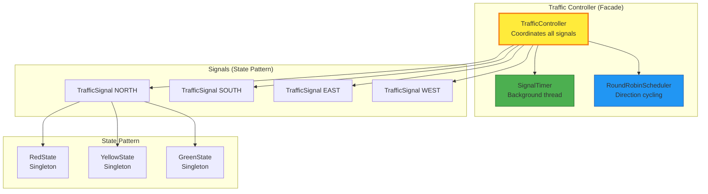

# Traffic Signal System - Low Level Design (LLD)

> A comprehensive, beginner-friendly guide to designing a traffic signal system. Perfect for interview preparation and learning object-oriented design!

---

## 🎯 WHAT IS THIS?

This is a **complete Low Level Design (LLD)** for a traffic signal system at a 4-way intersection. It includes:

- ✅ **Requirements analysis** (functional & non-functional)
- ✅ **Step-by-step class diagrams** (5 incremental steps)
- ✅ **Design patterns** (State, Observer, Singleton, Strategy, Facade)
- ✅ **Complete Java implementation** (~1,500 LOC)
- ✅ **Sequence diagrams** (6 different scenarios)
- ✅ **Thread safety** (concurrency handling)
- ✅ **SOLID principles** (with examples)
- ✅ **Interview Q&A** (15+ questions with detailed answers)
- ✅ **Common mistakes** (with solutions)
- ✅ **Whiteboard checklist** (7-step process)

---

## 📚 DOCUMENTATION STRUCTURE

### Part 1: Requirements & Planning (Files 01-02)
- **01-requirements.md** - Functional, non-functional, and constraint requirements
- **02-use-case-diagram.md** - Actors, use cases, and user stories

### Part 2: Incremental Design (Files 03-07)
- **03-step1-class-diagram.md** - Basic enums (Direction, SignalState)
- **04-step2-class-diagram.md** - Core classes (TrafficSignal, SignalConfig)
- **05-step3-state-pattern.md** - State Pattern implementation
- **06-step4-integration.md** - Observer Pattern & validation
- **07-step5-controller.md** - Controller, timer, scheduler

### Part 3: Complete Design (Files 08-10)
- **08-final-class-diagram.md** - Complete system with all relationships
- **09-sequence-diagrams.md** - 6 interaction scenarios
- **10-component-diagram.md** - Architecture & deployment

### Part 4: Deep Dives (Files 11-14)
- **11-concurrency.md** - Thread safety mechanisms
- **12-solid-principles.md** - SOLID application with examples
- **13-design-patterns.md** - 6 patterns explained
- **14-relationships.md** - UML relationships with Java code

### Part 5: Interview Prep (Files 15-17)
- **15-interview-qa.md** - 15+ interview questions & answers
- **16-common-mistakes.md** - 10 mistakes with solutions
- **17-whiteboard-checklist.md** - Step-by-step interview process

### Part 6: Implementation (Files 18-20)
- **18-complete-implementation.md** - Full working Java code
- **19-design-summary.md** - One-page design summary
- **20-README.md** - This file

---

## 🚀 QUICK START

### For Interview Preparation:

**1-Hour Sprint**:
1. Read `01-requirements.md` (10 min)
2. Read `08-final-class-diagram.md` (15 min)
3. Read `15-interview-qa.md` (20 min)
4. Read `19-design-summary.md` (10 min)
5. Practice explaining to a friend (5 min)

**Half-Day Deep Dive**:
1. Read files 01-07 in sequence (2 hours)
2. Study design patterns in `13-design-patterns.md` (1 hour)
3. Review common mistakes in `16-common-mistakes.md` (30 min)
4. Practice whiteboarding with `17-whiteboard-checklist.md` (30 min)

### For Learning OOP Design:

**Week 1**: Requirements & Basic Design
- Day 1: Requirements (file 01)
- Day 2: Use cases (file 02)
- Day 3-4: Step-by-step design (files 03-05)
- Day 5: State Pattern deep dive (file 05)

**Week 2**: Advanced Concepts
- Day 1: Observer Pattern (file 06)
- Day 2: Controller architecture (file 07)
- Day 3: Thread safety (file 11)
- Day 4: SOLID principles (file 12)
- Day 5: Design patterns (file 13)

**Week 3**: Implementation & Practice
- Day 1-2: Study complete implementation (file 18)
- Day 3: Code it yourself from scratch
- Day 4: Review common mistakes (file 16)
- Day 5: Practice whiteboarding (file 17)

---

## 🎯 SYSTEM OVERVIEW

### Problem Statement:
Design a traffic signal system for a 4-way intersection that:
- Controls signals for NORTH, SOUTH, EAST, WEST directions
- Each signal has RED, YELLOW, GREEN states
- Automatically cycles through directions (round-robin)
- Supports manual override for emergencies
- Ensures only ONE direction is GREEN at any time

### Solution Architecture:



### Key Features:
- ✅ **State Pattern**: Extensible signal states
- ✅ **Observer Pattern**: Event notifications
- ✅ **Thread Safety**: ReentrantLock, volatile flags
- ✅ **Validation**: All transitions checked
- ✅ **Fail-Safe**: All RED on crash

---

## 💻 CODE EXAMPLE

### Basic Usage:

```java
// Create controller
TrafficController controller = new TrafficController();

// Start automatic cycling
controller.start();
// Output: NORTH goes GREEN, others RED
//         After 60s: NORTH → YELLOW
//         After 5s:  NORTH → RED, SOUTH → GREEN
//         Continues cycling...

// Query status
Map<Direction, String> status = controller.getAllSignalStatus();
System.out.println(status);
// Output: {NORTH=RED (45s), SOUTH=GREEN (60s), EAST=RED (110s), WEST=RED (110s)}

// Manual override (emergency)
controller.manualOverride(Direction.EAST, "Ambulance");
// Output: Current signal → RED, EAST → GREEN

// Stop system
controller.stop();
// Output: All signals → RED (fail-safe)
```

### Running the Complete System:

```bash
# Compile
javac -d bin src/com/traffic/signal/**/*.java src/com/traffic/signal/*.java

# Run
java -cp bin com.traffic.signal.Main
```

See `18-complete-implementation.md` for full code.

---

## 🎨 DESIGN PATTERNS USED

| Pattern | Purpose | Classes Involved |
|---------|---------|------------------|
| **State** | Manage signal behavior based on state | TrafficLightState, RedState, YellowState, GreenState |
| **Singleton** | Single instance per state | RedState, YellowState, GreenState |
| **Observer** | Notify listeners of state changes | StateChangeListener, LoggingStateListener, SafetyCheckListener |
| **Strategy** | Pluggable scheduling algorithms | RoundRobinScheduler |
| **Facade** | Simplified interface | TrafficController |
| **Template Method** | Define algorithm skeleton | StateChangeListener default methods |

---

## ✅ SOLID PRINCIPLES

| Principle | How Applied |
|-----------|-------------|
| **S** Single Responsibility | TrafficSignal (state), Validator (validation), Logger (logging) - each has one job |
| **O** Open/Closed | Can add FlashingYellowState without modifying existing states |
| **L** Liskov Substitution | All TrafficLightState implementations are interchangeable |
| **I** Interface Segregation | Small interfaces (StateChangeListener) vs one giant interface |
| **D** Dependency Inversion | Controller depends on StateChangeListener interface, not concrete Logger |

---

## 🔒 THREAD SAFETY

**Mechanisms**:
1. **ReentrantLock** in TrafficController (fair lock)
2. **Volatile flags** (isRunning, isPaused)
3. **Synchronized methods** for atomic operations
4. **ConcurrentHashMap** for signal storage
5. **Immutable events** (final fields)

**Concurrent Operations**:
- Timer thread: Ticks every second, decrements time
- Override thread: Manual emergency overrides
- Query threads: Status queries from monitoring

All operations are thread-safe with proper locking!

---

## 📊 METRICS

- **Classes**: 14
- **Interfaces**: 2
- **Enums**: 2
- **Lines of Code**: ~1,500
- **Design Patterns**: 6
- **Documentation Pages**: 20
- **Mermaid Diagrams**: 30+
- **Code Examples**: 100+

---

## 🎯 WHO IS THIS FOR?

### Students:
- Learning object-oriented design
- Understanding design patterns
- Preparing for interviews
- Building portfolio projects

### Interview Candidates:
- Software Engineer roles (entry to mid-level)
- System Design interviews
- LLD round preparation
- Practice whiteboarding

### Professionals:
- Refreshing OOP concepts
- Learning best practices
- Code review reference
- Teaching material

---

## 📖 LEARNING PATH

**Beginner** (New to OOP Design):
```
01-requirements → 03-step1 → 04-step2 → 08-final-class-diagram → 18-complete-implementation
```

**Intermediate** (Know OOP, learning patterns):
```
01-requirements → 05-state-pattern → 06-observer → 11-concurrency → 12-solid → 13-design-patterns
```

**Advanced** (Interview prep):
```
19-design-summary → 15-interview-qa → 16-common-mistakes → 17-whiteboard-checklist
```

---

## 🎯 KEY TAKEAWAYS

After completing this LLD, you will understand:

1. **Requirements Analysis**: Functional vs non-functional requirements
2. **Incremental Design**: Building complexity step-by-step
3. **Design Patterns**: When and how to apply them
4. **Thread Safety**: Preventing race conditions and deadlocks
5. **SOLID Principles**: Writing maintainable OOP code
6. **UML Diagrams**: Class, sequence, component diagrams
7. **Interview Skills**: Communicating design decisions
8. **Common Pitfalls**: Mistakes to avoid

---

## 🚀 NEXT STEPS

### After completing this LLD:

1. **Code it yourself**: Implement from scratch without looking
2. **Extend it**: Add pedestrian signals, sensors, adaptive timing
3. **Try variants**: Elevator system, parking lot, library management
4. **Practice whiteboarding**: Explain to a friend or record yourself
5. **Mock interviews**: Use online platforms to practice

### Related LLDs to study next:
- Elevator System (State Pattern)
- Parking Lot (Strategy Pattern)
- Library Management (Observer Pattern)
- ATM System (State + Chain of Responsibility)
- Vending Machine (State Pattern)

---

## 📚 RESOURCES

### Within this repo:
- Start with `01-requirements.md`
- Follow steps 01→07 for incremental learning
- Use `17-whiteboard-checklist.md` for interviews
- Reference `19-design-summary.md` for quick review

### External resources:
- "Head First Design Patterns" (book)
- "Clean Code" by Robert Martin (book)
- refactoring.guru (website)
- System Design Primer (GitHub)

---

## 🤝 CONTRIBUTION

Found an error? Have a suggestion? Want to add examples?

This is a learning resource - improvements are welcome!

---

## 📜 LICENSE

This educational material is provided as-is for learning purposes.

---

## 🎓 AUTHOR'S NOTE

This LLD was created with beginners in mind. Every concept is explained with:
- Real-world analogies
- Multiple code examples
- Common mistakes to avoid
- Visual diagrams
- Interview tips

**Goal**: Make Low Level Design accessible and understandable for everyone!

---

## 🎯 FINAL CHECKLIST

Before your interview, ensure you can:

- [ ] Explain requirements (functional vs non-functional)
- [ ] Draw class diagram from memory
- [ ] Explain State Pattern and why it's used
- [ ] Describe thread safety mechanisms
- [ ] Walk through a state transition
- [ ] Discuss trade-offs of your design
- [ ] Handle follow-up questions (scaling, extensions)
- [ ] Code key methods on whiteboard
- [ ] Apply SOLID principles
- [ ] Identify and explain relationships

---

## 📞 QUICK REFERENCE

**Most Important Files**:
1. `01-requirements.md` - Know your requirements!
2. `08-final-class-diagram.md` - Complete picture
3. `15-interview-qa.md` - Practice questions
4. `19-design-summary.md` - Quick review

**For Coding Practice**:
- `18-complete-implementation.md` - Full working code

**For Interviews**:
- `17-whiteboard-checklist.md` - Step-by-step process

**For Deep Understanding**:
- `12-solid-principles.md` - Design principles
- `13-design-patterns.md` - Pattern catalog
- `11-concurrency.md` - Thread safety

---

## 🎉 SUCCESS STORIES

Use this LLD to:
- ✅ Ace your LLD interview round
- ✅ Understand object-oriented design deeply
- ✅ Build a strong foundation for system design
- ✅ Contribute to real-world projects confidently

---

**Ready to start? Begin with `01-requirements.md`!**

**Good luck with your interviews! 🚀**
