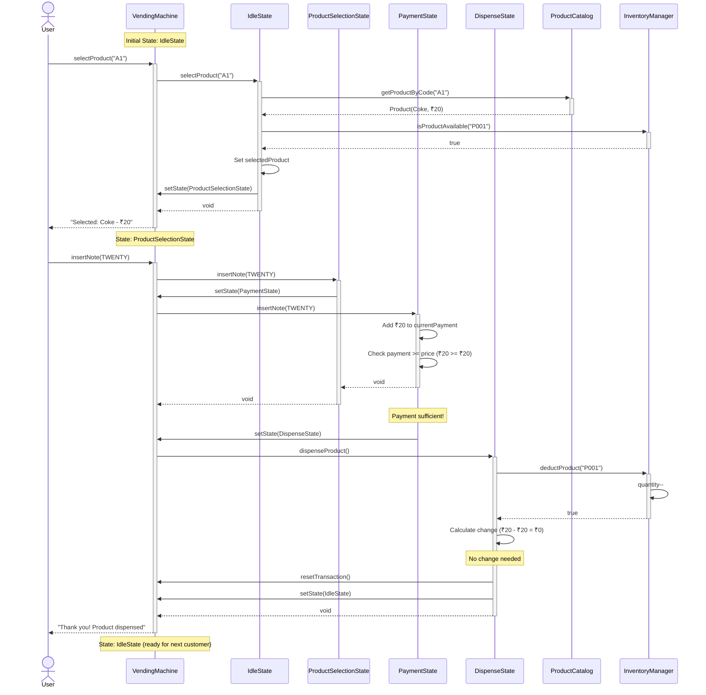
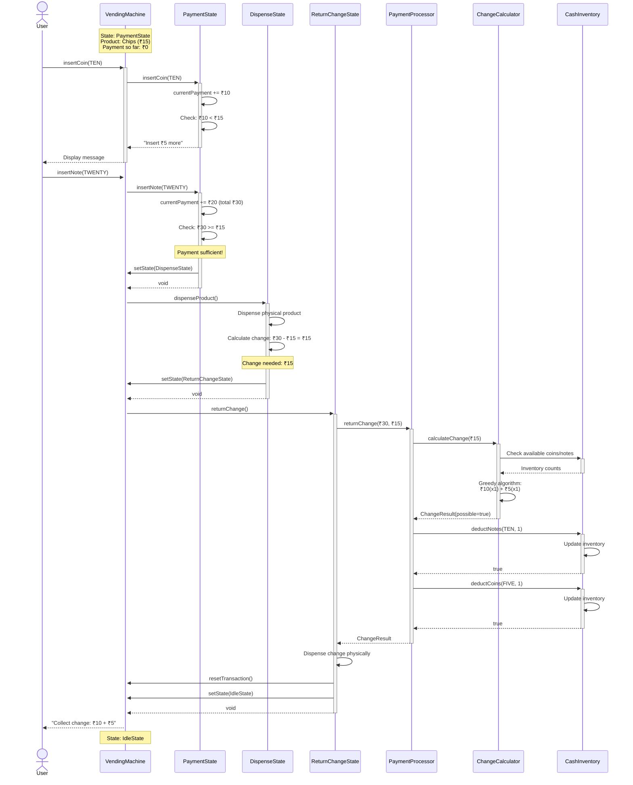
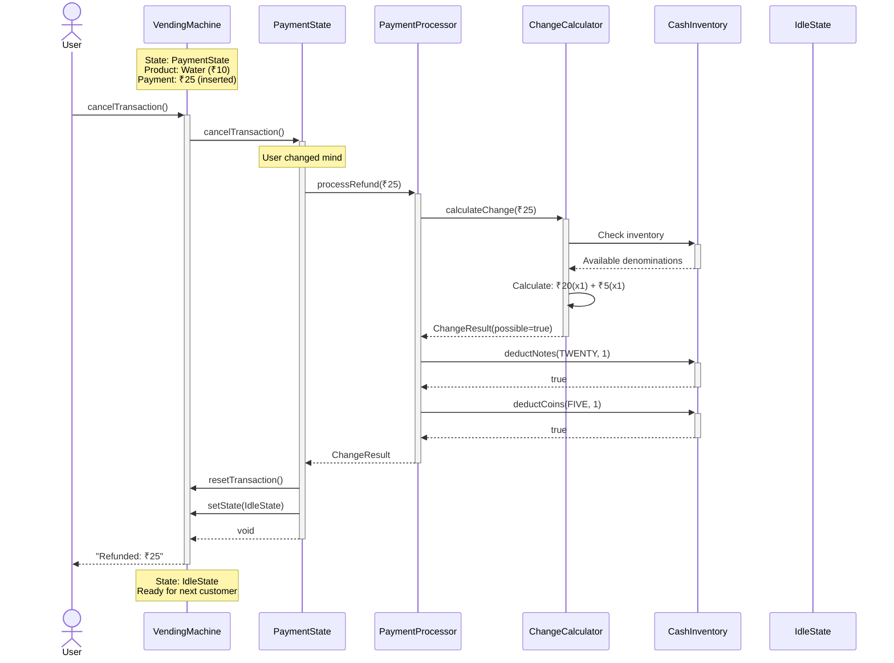
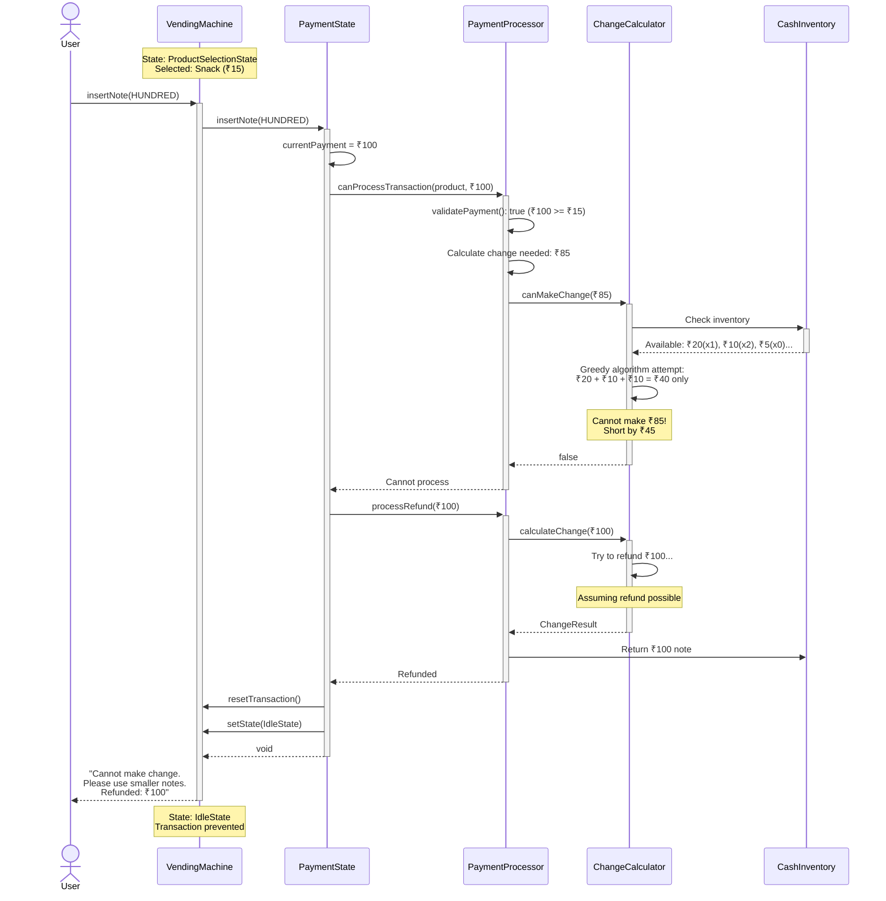
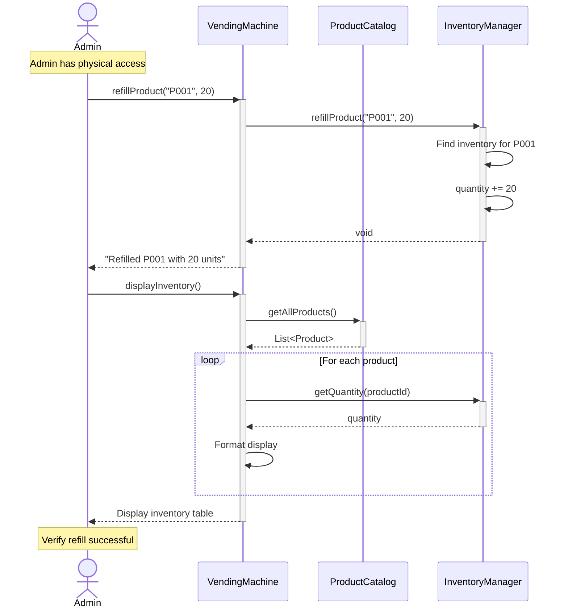
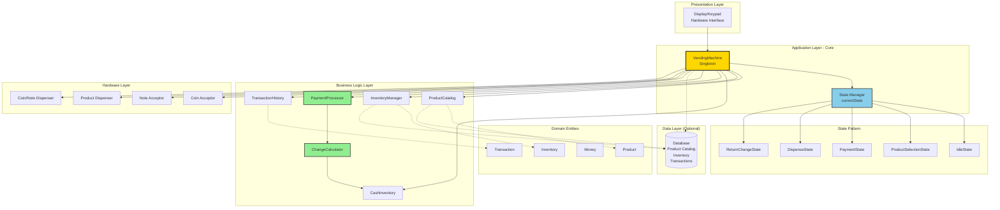
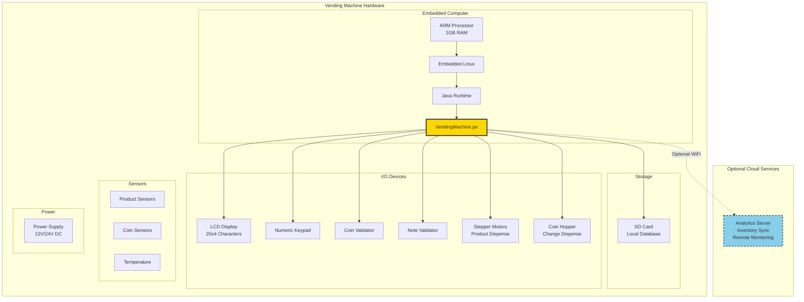

# Sequence Diagrams - Vending Machine Flows

## What are Sequence Diagrams?

**Sequence diagrams** show how objects interact over TIME. They focus on:
- **Order of operations** (top to bottom = time flows)
- **Messages** between objects (method calls)
- **Lifelines** of objects (vertical dashed lines)
- **Activations** (when object is active, shown as rectangles)

---

## Sequence Diagram 1: Successful Product Purchase (Exact Payment)

**Key Points**:
- Every user action goes through VendingMachine (facade pattern)
- VendingMachine delegates to current state
- States transition automatically when conditions met
- Inventory updated atomically during dispense

---

## Sequence Diagram 2: Product Purchase with Change Return

**Key Points**:
- Change calculation happens BEFORE dispensing change
- Greedy algorithm finds optimal denomination breakdown
- Cash inventory updated atomically
- If change calculation fails, entire transaction would rollback

---

## Sequence Diagram 3: Transaction Cancellation

**Key Points**:
- Cancellation uses same change calculation logic as normal change
- All inserted money refunded
- Transaction data cleared
- Machine returns to Idle state

---

## Sequence Diagram 4: Insufficient Change Scenario

**Key Points**:
- Change calculation happens BEFORE dispensing product (safe!)
- If change cannot be made, transaction rejected
- User gets full refund
- Prevents inventory loss due to insufficient change

---

## Sequence Diagram 5: Admin Operations - Refill Inventory

---

## Component Diagram - System Architecture

---

## Deployment Diagram (Physical Architecture)

---

## Sequence Diagram Lessons for Beginners

### Lesson 1: Read Top to Bottom
Time flows from top to bottom. Earlier operations are higher up.

### Lesson 2: Solid vs Dashed Arrows
- **Solid arrow (→)**: Synchronous call (caller waits for response)
- **Dashed arrow (⇢)**: Return/response
- **Dashed arrow (⇢)** can also mean: Asynchronous call (fire and forget)

### Lesson 3: Activation Boxes
Rectangles on lifelines show when object is "active" (processing).

### Lesson 4: Alt/Opt/Loop Fragments
- **alt**: Alternative paths (if-else)
- **opt**: Optional (if only)
- **loop**: Iteration

### Lesson 5: Notes
Use notes to add context (state information, comments, etc.)

---

## What Sequence Diagrams Teach Us

1. **Order matters**: Payment must come before dispensing
2. **Dependencies**: Change calculation depends on cash inventory
3. **State transitions**: Clear progression through states
4. **Error handling**: Graceful failures with refunds
5. **Atomicity**: Operations grouped together (dispense + inventory update)

---

**Sequence Diagrams Complete!** ✅

These diagrams show the **dynamic behavior** of the system - how it operates over time.
