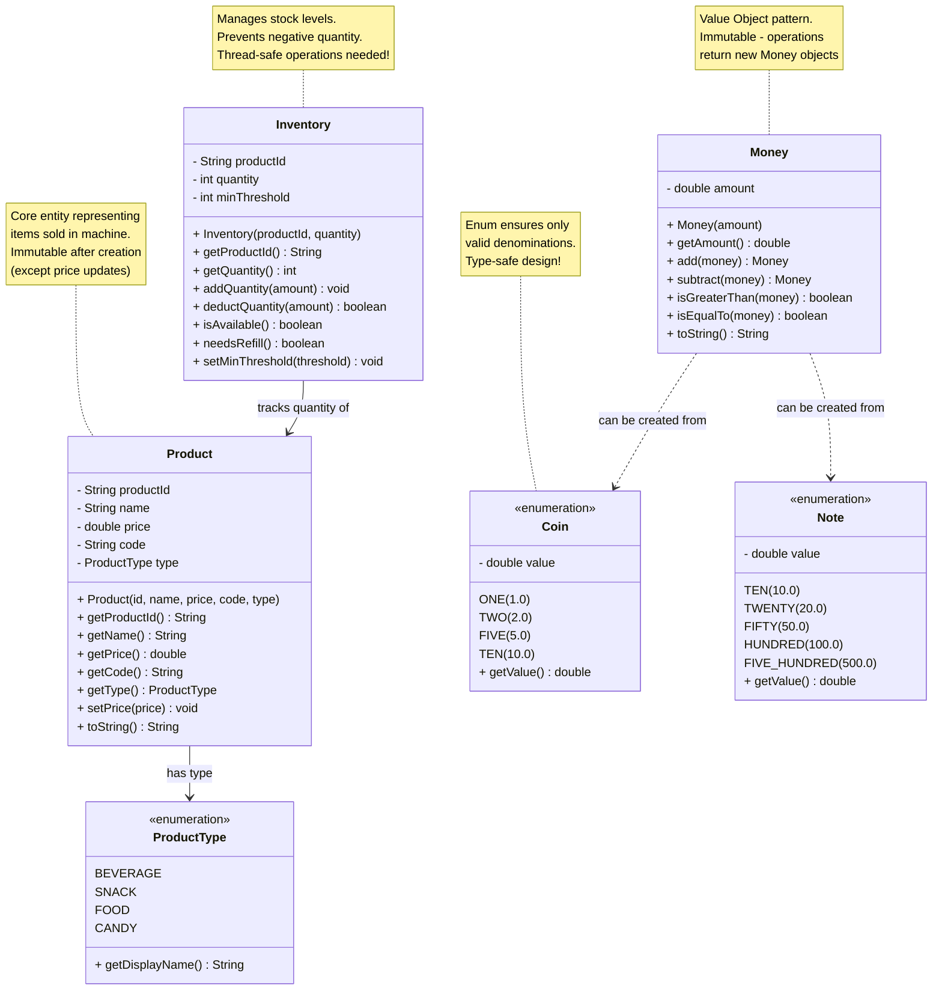

# Step 1: Core Domain Entities - Product, Inventory, and Money

## WHERE TO START?

### Why start with these entities?
When designing any system, we start with **NOUNS** from requirements:
- Product (what we sell)
- Inventory (how much we have)
- Money (how customers pay)

These are **domain entities** - the fundamental building blocks that represent real-world concepts.

### What should be added in Step 1?
1. **Product**: Represents items sold in the machine
2. **Inventory**: Tracks quantity of products
3. **Coin**: Represents coin denominations
4. **Note**: Represents currency notes
5. **Money**: Abstract concept of payment

---

## Step 1: Class Diagram



---

## What You Added in Step 1

### 1. Product Class
**Purpose**: Represents a product that can be sold

**Key Attributes**:
- `productId`: Unique identifier (e.g., "PROD_001")
- `name`: Display name (e.g., "Coca Cola")
- `price`: Cost in rupees (e.g., 20.0)
- `code`: Slot code for selection (e.g., "A1")
- `type`: Category of product (enum)

**Why these attributes?**
- `productId` is internal identifier (database)
- `code` is external identifier (customer sees "A1" on machine)
- Separation allows flexibility (same product in multiple slots)

---

### 2. ProductType Enumeration
**Purpose**: Type-safe product categories

**Values**:
- `BEVERAGE`: Drinks (Coke, Pepsi, Water)
- `SNACK`: Chips, Cookies
- `FOOD`: Sandwiches, Instant Noodles
- `CANDY`: Chocolates, Gum

**Why use enum instead of String?**
```java
// ❌ BAD: Using String (prone to typos)
if (product.getType().equals("BAVERAGE")) { // typo!
    // won't work
}

// ✅ GOOD: Using enum (compile-time safety)
if (product.getType() == ProductType.BEVERAGE) {
    // type-safe!
}
```

---

### 3. Inventory Class
**Purpose**: Tracks quantity of each product

**Key Attributes**:
- `productId`: Which product this inventory is for
- `quantity`: Current available count
- `minThreshold`: Alert level (e.g., if quantity < 2, alert admin)

**Key Methods**:
- `addQuantity()`: Admin refills inventory
- `deductQuantity()`: System dispenses product (returns true/false)
- `isAvailable()`: Quick check if quantity > 0
- `needsRefill()`: Check if below threshold

**Design Decision**:
- One Inventory object per Product
- `deductQuantity()` returns boolean (atomic operation)
- **Thread-safe** operations needed (will add synchronization later)

---

### 4. Coin & Note Enumerations
**Purpose**: Type-safe representation of currency

**Why separate Coin and Note?**
- Different physical handling (coin slot vs note acceptor)
- Different storage mechanisms
- Different validation logic

**Why enum instead of double?**
```java
// ❌ BAD: Using raw doubles
double payment = 7.5; // Invalid! No such currency
insertMoney(payment);

// ✅ GOOD: Using enum
Coin coin = Coin.FIVE; // Only valid denominations!
insertMoney(coin);
```

**Supported Denominations**:
- **Coins**: ₹1, ₹2, ₹5, ₹10
- **Notes**: ₹10, ₹20, ₹50, ₹100, ₹500

---

### 5. Money Class (Value Object)
**Purpose**: Encapsulates monetary amounts with operations

**Why create Money class instead of using `double`?**

```java
// ❌ BAD: Using primitive double
double price = 20.0;
double payment = 50.0;
double change = payment - price; // What if someone does payment + price?

// ✅ GOOD: Using Money class
Money price = new Money(20.0);
Money payment = new Money(50.0);
Money change = payment.subtract(price); // Intent clear, type-safe
```

**Key Characteristics**:
- **Immutable**: Once created, amount cannot change
- **Value Object**: Two Money objects with same amount are equal
- **Operations return new objects**: Follows functional programming style

**Methods**:
- `add()`: Returns new Money with sum
- `subtract()`: Returns new Money with difference
- `isGreaterThan()`: Comparison for validation
- `isEqualTo()`: Check if exact payment

---

## Design Decisions Explained

### Decision 1: Product vs Inventory Separation
**Question**: Why not combine Product and Inventory into one class?

**Answer**: **Single Responsibility Principle (SOLID)**
- `Product`: Describes WHAT the item is (attributes, price)
- `Inventory`: Describes HOW MANY we have (quantity, stock)

**Benefits**:
- Easy to query "All products" without caring about stock
- Easy to update stock without touching product data
- Can have multiple inventory locations (future enhancement)

---

### Decision 2: Enum for Currency
**Question**: Why not use a `Currency` class with `value` field?

**Answer**: **Compile-time safety + Fixed set of values**

In Java:
```java
// ❌ Using class (anyone can create invalid currency)
class Currency {
    private double value;
    public Currency(double value) {
        this.value = value; // No validation!
    }
}
Currency invalid = new Currency(7.5); // Oops!

// ✅ Using enum (only valid values possible)
enum Coin {
    FIVE(5.0),
    TEN(10.0);

    private double value;
    Coin(double value) { this.value = value; }
}
Coin valid = Coin.FIVE; // Can't create invalid!
```

---

### Decision 3: Immutable Money Class
**Question**: Why make Money immutable?

**Answer**: **Safety + Predictability**

```java
// ❌ Mutable Money (dangerous!)
Money total = new Money(0);
total.add(new Money(10)); // Does this modify total or return new?
// Confusing! Side effects!

// ✅ Immutable Money (clear!)
Money total = new Money(0);
total = total.add(new Money(10)); // Explicit reassignment
// Clear intent! No side effects!
```

**Benefits**:
- Thread-safe by design
- No accidental modifications
- Easy to reason about
- Follows Value Object pattern

---

## Relationships Explained

### 1. Product → ProductType (Association)
- **Type**: Association (Product HAS-A ProductType)
- **Multiplicity**: Many-to-One (many products can be same type)
- **Implementation**: Product holds reference to enum value

### 2. Inventory → Product (Association)
- **Type**: Association (Inventory tracks quantity OF Product)
- **Multiplicity**: One-to-One (one inventory per product)
- **Implementation**: Inventory holds `productId` (not full Product object)

**Why store `productId` instead of `Product` reference?**
```java
// Option 1: Store Product reference
class Inventory {
    private Product product; // Tight coupling!
}

// Option 2: Store productId
class Inventory {
    private String productId; // Loose coupling!
}
```

**Answer**: Loose coupling! Inventory doesn't need to know all Product details. Just needs ID to associate.

### 3. Money ..> Coin/Note (Dependency)
- **Type**: Dependency (dashed line)
- **Why?**: Money can be created FROM Coin/Note but doesn't store them
- **Usage**: `Money money = new Money(Coin.TEN.getValue());`

---

## Beginner Tips

### Tip 1: Start with Data
Always start LLD with **data structures** (entities). Don't jump to state machines or algorithms yet!

### Tip 2: Nouns = Classes
Read requirements and highlight NOUNS:
- "Customer selects **Product**"
- "Machine tracks **Inventory**"
- "User inserts **Coin**"

These become your classes!

### Tip 3: Use Enums for Fixed Sets
Anytime you have a **limited, predefined set of values**, use enum:
- ✅ Days of week
- ✅ Payment types (CASH, CARD, UPI)
- ✅ Product categories
- ✅ Currency denominations

### Tip 4: Value Objects for Domain Concepts
Use classes (not primitives) for domain concepts:
- ❌ `double money`
- ✅ `Money money`
- ❌ `String email`
- ✅ `Email email`

**Why?** Encapsulation, validation, and type safety!

---

## Common Beginner Mistakes

### Mistake 1: God Class
```java
// ❌ BAD: One class does everything
class Product {
    private String name;
    private double price;
    private int quantity; // Inventory concern!
    private List<Coin> acceptedCoins; // Payment concern!

    public void dispense() { } // Machine concern!
    public void calculateChange() { } // Payment concern!
}
```

**Solution**: **One class, one responsibility!**

---

### Mistake 2: Primitive Obsession
```java
// ❌ BAD: Everything is String/double/int
void processPayment(double amount) { }
void updatePrice(double price) { }

// ✅ GOOD: Use domain objects
void processPayment(Money amount) { }
void updatePrice(Money price) { }
```

---

### Mistake 3: Mutable Value Objects
```java
// ❌ BAD: Mutable Money
class Money {
    private double amount;
    public void setAmount(double amount) { // Dangerous!
        this.amount = amount;
    }
}

// ✅ GOOD: Immutable Money
class Money {
    private final double amount; // final!
    // No setter!
    public Money add(Money other) {
        return new Money(this.amount + other.getAmount());
    }
}
```

---

## Java Code Skeleton (Step 1)

```java
// Product.java
public class Product {
    private final String productId;
    private final String name;
    private final String code;
    private final ProductType type;
    private double price; // Can change, so not final

    public Product(String productId, String name, double price,
                   String code, ProductType type) {
        this.productId = productId;
        this.name = name;
        this.price = price;
        this.code = code;
        this.type = type;
    }

    // Getters only (immutable except price)
    public String getProductId() { return productId; }
    public String getName() { return name; }
    public double getPrice() { return price; }
    public String getCode() { return code; }
    public ProductType getType() { return type; }

    // Only price can be updated
    public void setPrice(double price) {
        if (price <= 0) {
            throw new IllegalArgumentException("Price must be positive");
        }
        this.price = price;
    }
}

// ProductType.java
public enum ProductType {
    BEVERAGE("Beverages"),
    SNACK("Snacks"),
    FOOD("Food Items"),
    CANDY("Candies");

    private final String displayName;

    ProductType(String displayName) {
        this.displayName = displayName;
    }

    public String getDisplayName() {
        return displayName;
    }
}

// Inventory.java
public class Inventory {
    private final String productId;
    private int quantity;
    private int minThreshold;

    public Inventory(String productId, int initialQuantity) {
        this.productId = productId;
        this.quantity = initialQuantity;
        this.minThreshold = 2; // Default threshold
    }

    public synchronized boolean deductQuantity(int amount) {
        if (quantity >= amount) {
            quantity -= amount;
            return true;
        }
        return false;
    }

    public synchronized void addQuantity(int amount) {
        quantity += amount;
    }

    public boolean isAvailable() {
        return quantity > 0;
    }

    public boolean needsRefill() {
        return quantity <= minThreshold;
    }

    // Getters
    public String getProductId() { return productId; }
    public int getQuantity() { return quantity; }
}

// Coin.java
public enum Coin {
    ONE(1.0),
    TWO(2.0),
    FIVE(5.0),
    TEN(10.0);

    private final double value;

    Coin(double value) {
        this.value = value;
    }

    public double getValue() {
        return value;
    }
}

// Note.java
public enum Note {
    TEN(10.0),
    TWENTY(20.0),
    FIFTY(50.0),
    HUNDRED(100.0),
    FIVE_HUNDRED(500.0);

    private final double value;

    Note(double value) {
        this.value = value;
    }

    public double getValue() {
        return value;
    }
}

// Money.java (Value Object)
public final class Money {
    private final double amount;

    public Money(double amount) {
        if (amount < 0) {
            throw new IllegalArgumentException("Amount cannot be negative");
        }
        this.amount = amount;
    }

    public double getAmount() {
        return amount;
    }

    public Money add(Money other) {
        return new Money(this.amount + other.amount);
    }

    public Money subtract(Money other) {
        return new Money(this.amount - other.amount);
    }

    public boolean isGreaterThan(Money other) {
        return this.amount > other.amount;
    }

    public boolean isEqualTo(Money other) {
        return Math.abs(this.amount - other.amount) < 0.001;
    }

    @Override
    public boolean equals(Object obj) {
        if (this == obj) return true;
        if (!(obj instanceof Money)) return false;
        Money other = (Money) obj;
        return Math.abs(this.amount - other.amount) < 0.001;
    }

    @Override
    public String toString() {
        return "₹" + amount;
    }
}
```

---

## What's Next in Step 2?

In Step 2, we'll add:
1. **VendingMachine** class (the main controller)
2. **InventoryManager** (manages all inventory)
3. **ProductCatalog** (manages all products)

This will connect all our entities together!

---

**Step 1 Complete!** ✅
