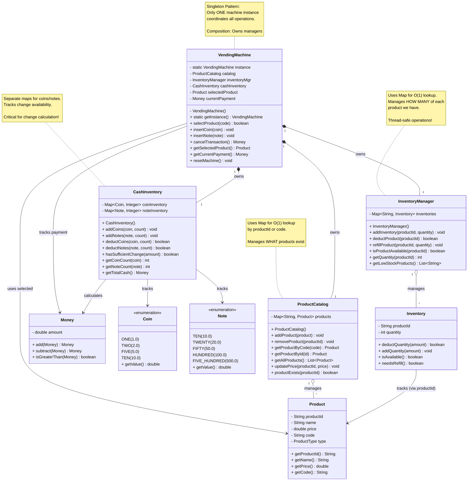

# Step 2: Adding VendingMachine and Manager Classes

## WHAT YOU ADDED IN THIS STEP?

In Step 2, we add the **orchestration layer** that coordinates all entities:

1. **VendingMachine** - Main controller class (Singleton)
2. **InventoryManager** - Manages all inventories
3. **ProductCatalog** - Manages all products
4. **CashInventory** - Manages coins and notes for change

These classes **coordinate** the entities from Step 1.

---

## WHY YOU ADDED THESE?

### Problem with Step 1
Step 1 had isolated entities with no way to:
- Track multiple products
- Track multiple inventories
- Coordinate transactions
- Manage cash for change

### Solution in Step 2
Add **Manager classes** following **Single Responsibility Principle**:
- Each manager handles ONE aspect of the system
- VendingMachine coordinates all managers
- Clear separation of concerns

---

## Step 2: Class Diagram



---

## WHAT IS THE CHANGE FROM PREVIOUS STEP?

### Step 1 → Step 2 Changes

| Aspect | Step 1 | Step 2 |
|--------|--------|--------|
| **Structure** | Individual entities only | Entities + Managers |
| **Coordination** | None | VendingMachine coordinates |
| **Storage** | No collections | Maps for O(1) lookup |
| **Singleton** | Not applicable | VendingMachine is singleton |
| **Relationships** | Basic associations | Composition + Aggregation |
| **Transaction** | Not possible | Can select product, insert money |

---

## WHY THESE CHANGES?

### Change 1: VendingMachine as Singleton

**Code Example**:
```java
// ❌ BAD: Multiple machine instances
VendingMachine machine1 = new VendingMachine();
VendingMachine machine2 = new VendingMachine(); // Two machines!?

// ✅ GOOD: Singleton ensures one instance
VendingMachine machine1 = VendingMachine.getInstance();
VendingMachine machine2 = VendingMachine.getInstance();
// machine1 == machine2 (same instance!)
```

**Why Singleton?**
- Only ONE vending machine exists in real world
- Centralized state management
- Prevents inconsistent states

**When NOT to use Singleton?**
- If you need to manage multiple vending machines
- In that case, create `VendingMachineManager` and remove singleton

---

### Change 2: Composition Relationships

**VendingMachine owns (composes) managers:**

```java
class VendingMachine {
    // Composition: VendingMachine creates and owns these
    private ProductCatalog catalog = new ProductCatalog();
    private InventoryManager inventoryMgr = new InventoryManager();
    private CashInventory cashInventory = new CashInventory();
}
```

**What is Composition?**
- **Strong ownership**: Parent creates and owns child
- **Lifecycle**: When parent dies, children die too
- **Cannot exist independently**: Managers have no meaning without VendingMachine

**UML Symbol**: Filled diamond (◆)

**Real-world analogy**:
- Human **composes** Heart (heart can't exist without human)
- Car **composes** Engine (engine is part of car)

---

### Change 3: Aggregation Relationships

**ProductCatalog aggregates Products:**

```java
class ProductCatalog {
    // Aggregation: Catalog manages Products but doesn't create them
    private Map<String, Product> products = new HashMap<>();

    public void addProduct(Product product) { // Product created elsewhere
        products.put(product.getProductId(), product);
    }
}
```

**What is Aggregation?**
- **Weak ownership**: Parent manages children but doesn't create them
- **Lifecycle**: Children can exist independently of parent
- **Passed via parameters**: Products created outside, then added

**UML Symbol**: Empty diamond (◇)

**Real-world analogy**:
- University **aggregates** Students (students exist independently)
- Library **aggregates** Books (books exist independently)

---

### Change 4: Maps for O(1) Lookup

**Why use `Map` instead of `List`?**

```java
// ❌ BAD: Using List (O(n) search)
class ProductCatalog {
    private List<Product> products = new ArrayList<>();

    public Product getProductById(String id) {
        for (Product p : products) { // O(n) - slow!
            if (p.getProductId().equals(id)) {
                return p;
            }
        }
        return null;
    }
}

// ✅ GOOD: Using Map (O(1) search)
class ProductCatalog {
    private Map<String, Product> products = new HashMap<>();

    public Product getProductById(String id) {
        return products.get(id); // O(1) - fast!
    }
}
```

**Performance Comparison**:
- **List**: O(n) search - slow for 50 products
- **Map**: O(1) search - instant even for 1000 products

---

## DESIGN DECISIONS

### Decision 1: Why Three Separate Managers?

**Question**: Why not put everything in VendingMachine?

**❌ Bad Design (God Class)**:
```java
class VendingMachine {
    private Map<String, Product> products;
    private Map<String, Inventory> inventories;
    private Map<Coin, Integer> coins;
    private Map<Note, Integer> notes;

    public void addProduct() { }
    public void updatePrice() { }
    public void refillInventory() { }
    public void addCoins() { }
    // 50+ methods here... MESSY!
}
```

**✅ Good Design (Separation of Concerns)**:
```java
class VendingMachine {
    private ProductCatalog catalog; // Handles products
    private InventoryManager inventoryMgr; // Handles inventory
    private CashInventory cashInventory; // Handles cash

    // VendingMachine coordinates, delegates work
    public void selectProduct(String code) {
        Product p = catalog.getProductByCode(code);
        if (inventoryMgr.isProductAvailable(p.getProductId())) {
            this.selectedProduct = p;
        }
    }
}
```

**Benefits**:
- **Single Responsibility**: Each class has ONE job
- **Easier Testing**: Test managers independently
- **Maintainability**: Changes to product management don't affect cash management

---

### Decision 2: Where to Store Current Transaction?

**Question**: Should transaction data be in VendingMachine or separate Transaction class?

**Current Choice**: In VendingMachine (Simple approach)
```java
class VendingMachine {
    private Product selectedProduct; // Current transaction
    private Money currentPayment;   // Current transaction
}
```

**Alternative**: Separate Transaction class (More complex)
```java
class Transaction {
    private Product product;
    private Money payment;
    private TransactionStatus status;
}

class VendingMachine {
    private Transaction currentTransaction;
}
```

**Why we chose VendingMachine?**
- Simpler for single-transaction machines
- No need for transaction history (yet)
- Fewer classes to manage

**When to use separate Transaction?**
- Need transaction history
- Support multiple concurrent transactions
- Complex transaction lifecycle

---

### Decision 3: CashInventory Separate from InventoryManager

**Question**: Why not manage coins/notes in InventoryManager?

**Answer**: **Different concerns!**

- **InventoryManager**: Tracks product quantities (physical items)
- **CashInventory**: Tracks coins/notes (currency)

**Different operations**:
```java
// Product inventory: Simple count
inventoryMgr.deductProduct(productId); // -1

// Cash inventory: Complex change calculation
cashInventory.hasSufficientChange(27.0); // Need ₹20 + ₹5 + ₹2
```

Cash requires **change-making algorithm** which is a distinct responsibility!

---

## Relationships Explained (Beginner-Friendly)

### 1. Composition (Filled Diamond ◆)

**Definition**: Parent OWNS child, creates it, and child cannot exist without parent

**Code Pattern**:
```java
class Parent {
    private Child child = new Child(); // Created inside parent

    // Child lifecycle tied to parent
}
```

**Example in our design**:
```java
class VendingMachine {
    private ProductCatalog catalog = new ProductCatalog(); // Composition!
}
```

**When to use?**
- Child has no meaning outside parent
- Parent manages child's lifecycle
- Strong "part-of" relationship

---

### 2. Aggregation (Empty Diamond ◇)

**Definition**: Parent MANAGES children but doesn't own them, children can exist independently

**Code Pattern**:
```java
class Parent {
    private List<Child> children = new ArrayList<>();

    public void addChild(Child child) { // Child passed from outside
        children.add(child);
    }
}
```

**Example in our design**:
```java
class ProductCatalog {
    private Map<String, Product> products = new HashMap<>();

    public void addProduct(Product product) { // Product created elsewhere
        products.put(product.getProductId(), product);
    }
}
```

**When to use?**
- Children can exist independently
- Parent is a collection/manager
- Weak "has-a" relationship

---

### 3. Association (Simple Arrow →)

**Definition**: One class USES another

**Code Pattern**:
```java
class ClassA {
    public void doSomething(ClassB b) { // Uses ClassB
        b.someMethod();
    }
}
```

**Example in our design**:
```java
class VendingMachine {
    private Product selectedProduct; // Association: uses Product
}
```

---

### 4. Dependency (Dashed Arrow ⇢)

**Definition**: One class DEPENDS ON another (usually as method parameter)

**Code Pattern**:
```java
class ClassA {
    public void doSomething(ClassB b) { // Depends on ClassB temporarily
        // Use b only in this method
    }
}
```

---

## Java Code Skeleton (Step 2 - NEW Classes)

```java
// VendingMachine.java (Singleton Pattern)
public class VendingMachine {
    // Singleton instance
    private static VendingMachine instance;

    // Composed managers (created here)
    private ProductCatalog catalog;
    private InventoryManager inventoryManager;
    private CashInventory cashInventory;

    // Current transaction state
    private Product selectedProduct;
    private Money currentPayment;

    // Private constructor (Singleton)
    private VendingMachine() {
        this.catalog = new ProductCatalog();
        this.inventoryManager = new InventoryManager();
        this.cashInventory = new CashInventory();
        this.currentPayment = new Money(0);
    }

    // Get singleton instance
    public static synchronized VendingMachine getInstance() {
        if (instance == null) {
            instance = new VendingMachine();
        }
        return instance;
    }

    // Select product by code (e.g., "A1")
    public boolean selectProduct(String code) {
        Product product = catalog.getProductByCode(code);

        if (product == null) {
            System.out.println("Invalid product code");
            return false;
        }

        if (!inventoryManager.isProductAvailable(product.getProductId())) {
            System.out.println("Product out of stock");
            return false;
        }

        this.selectedProduct = product;
        System.out.println("Selected: " + product.getName() +
                           " Price: ₹" + product.getPrice());
        return true;
    }

    // Insert coin
    public void insertCoin(Coin coin) {
        currentPayment = currentPayment.add(new Money(coin.getValue()));
        cashInventory.addCoins(coin, 1);
        System.out.println("Inserted: ₹" + coin.getValue());
        System.out.println("Total payment: " + currentPayment);
    }

    // Insert note
    public void insertNote(Note note) {
        currentPayment = currentPayment.add(new Money(note.getValue()));
        cashInventory.addNotes(note, 1);
        System.out.println("Inserted: ₹" + note.getValue());
        System.out.println("Total payment: " + currentPayment);
    }

    // Cancel transaction and refund
    public Money cancelTransaction() {
        Money refund = currentPayment;
        resetTransaction();
        System.out.println("Transaction cancelled. Refund: " + refund);
        return refund;
    }

    // Reset transaction state
    private void resetTransaction() {
        this.selectedProduct = null;
        this.currentPayment = new Money(0);
    }

    // Getters
    public Product getSelectedProduct() { return selectedProduct; }
    public Money getCurrentPayment() { return currentPayment; }
    public ProductCatalog getCatalog() { return catalog; }
    public InventoryManager getInventoryManager() { return inventoryManager; }
    public CashInventory getCashInventory() { return cashInventory; }
}

// ProductCatalog.java
public class ProductCatalog {
    // Map for O(1) lookup by productId
    private Map<String, Product> productsById;
    // Map for O(1) lookup by code (e.g., "A1")
    private Map<String, Product> productsByCode;

    public ProductCatalog() {
        this.productsById = new HashMap<>();
        this.productsByCode = new HashMap<>();
    }

    public void addProduct(Product product) {
        productsById.put(product.getProductId(), product);
        productsByCode.put(product.getCode(), product);
    }

    public void removeProduct(String productId) {
        Product product = productsById.remove(productId);
        if (product != null) {
            productsByCode.remove(product.getCode());
        }
    }

    public Product getProductByCode(String code) {
        return productsByCode.get(code);
    }

    public Product getProductById(String productId) {
        return productsById.get(productId);
    }

    public List<Product> getAllProducts() {
        return new ArrayList<>(productsById.values());
    }

    public void updatePrice(String productId, double newPrice) {
        Product product = productsById.get(productId);
        if (product != null) {
            product.setPrice(newPrice);
        }
    }

    public boolean productExists(String productId) {
        return productsById.containsKey(productId);
    }
}

// InventoryManager.java
public class InventoryManager {
    private Map<String, Inventory> inventories;

    public InventoryManager() {
        this.inventories = new HashMap<>();
    }

    public void addInventory(String productId, int initialQuantity) {
        inventories.put(productId, new Inventory(productId, initialQuantity));
    }

    public synchronized boolean deductProduct(String productId) {
        Inventory inventory = inventories.get(productId);
        if (inventory != null && inventory.deductQuantity(1)) {
            return true;
        }
        return false;
    }

    public synchronized void refillProduct(String productId, int quantity) {
        Inventory inventory = inventories.get(productId);
        if (inventory != null) {
            inventory.addQuantity(quantity);
        } else {
            addInventory(productId, quantity);
        }
    }

    public boolean isProductAvailable(String productId) {
        Inventory inventory = inventories.get(productId);
        return inventory != null && inventory.isAvailable();
    }

    public int getQuantity(String productId) {
        Inventory inventory = inventories.get(productId);
        return inventory != null ? inventory.getQuantity() : 0;
    }

    public List<String> getLowStockProducts() {
        List<String> lowStock = new ArrayList<>();
        for (Inventory inv : inventories.values()) {
            if (inv.needsRefill()) {
                lowStock.add(inv.getProductId());
            }
        }
        return lowStock;
    }
}

// CashInventory.java
public class CashInventory {
    private Map<Coin, Integer> coinInventory;
    private Map<Note, Integer> noteInventory;

    public CashInventory() {
        this.coinInventory = new HashMap<>();
        this.noteInventory = new HashMap<>();

        // Initialize with zero counts
        for (Coin coin : Coin.values()) {
            coinInventory.put(coin, 0);
        }
        for (Note note : Note.values()) {
            noteInventory.put(note, 0);
        }
    }

    public synchronized void addCoins(Coin coin, int count) {
        coinInventory.put(coin, coinInventory.get(coin) + count);
    }

    public synchronized void addNotes(Note note, int count) {
        noteInventory.put(note, noteInventory.get(note) + count);
    }

    public synchronized boolean deductCoins(Coin coin, int count) {
        int current = coinInventory.get(coin);
        if (current >= count) {
            coinInventory.put(coin, current - count);
            return true;
        }
        return false;
    }

    public synchronized boolean deductNotes(Note note, int count) {
        int current = noteInventory.get(note);
        if (current >= count) {
            noteInventory.put(note, current - count);
            return true;
        }
        return false;
    }

    public int getCoinCount(Coin coin) {
        return coinInventory.get(coin);
    }

    public int getNoteCount(Note note) {
        return noteInventory.get(note);
    }

    public Money getTotalCash() {
        double total = 0;

        for (Map.Entry<Coin, Integer> entry : coinInventory.entrySet()) {
            total += entry.getKey().getValue() * entry.getValue();
        }

        for (Map.Entry<Note, Integer> entry : noteInventory.entrySet()) {
            total += entry.getKey().getValue() * entry.getValue();
        }

        return new Money(total);
    }

    // Will implement in Step 5 (Change Calculation)
    public boolean hasSufficientChange(double amount) {
        // TODO: Implement greedy algorithm
        return true;
    }
}
```

---

## Common Beginner Mistakes (Step 2)

### Mistake 1: Not Using Singleton Correctly
```java
// ❌ BAD: Public constructor
class VendingMachine {
    public VendingMachine() { } // Anyone can create instances!
}

// ✅ GOOD: Private constructor
class VendingMachine {
    private VendingMachine() { } // Only getInstance() can create
}
```

---

### Mistake 2: Confused Composition vs Aggregation
```java
// ❌ WRONG: Passing managers from outside (not composition)
class VendingMachine {
    private ProductCatalog catalog;

    public VendingMachine(ProductCatalog catalog) { // Aggregation, not composition
        this.catalog = catalog;
    }
}

// ✅ RIGHT: Creating managers inside (composition)
class VendingMachine {
    private ProductCatalog catalog = new ProductCatalog(); // Composition!
}
```

---

### Mistake 3: Using List Instead of Map
```java
// ❌ BAD: O(n) lookup
private List<Product> products;

// ✅ GOOD: O(1) lookup
private Map<String, Product> products;
```

---

## What's Next in Step 3?

In Step 3, we'll add the **State Pattern**:
1. Create `VendingMachineState` interface
2. Implement concrete states (Idle, ProductSelection, Payment, Dispense)
3. State transition logic

This will make the machine behavior **context-dependent**!

---

**Step 2 Complete!** ✅

**Key Takeaways**:
- VendingMachine coordinates everything (Singleton)
- Managers handle specific concerns (SRP)
- Composition for strong ownership
- Aggregation for weak ownership
- Maps for efficient lookups
